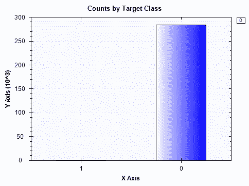
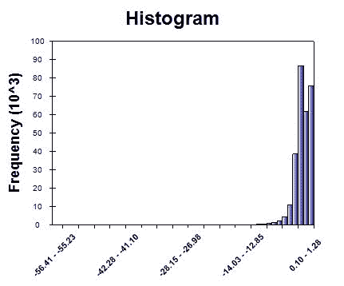
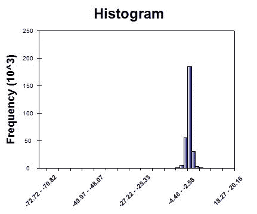
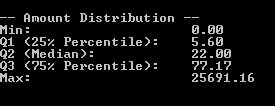
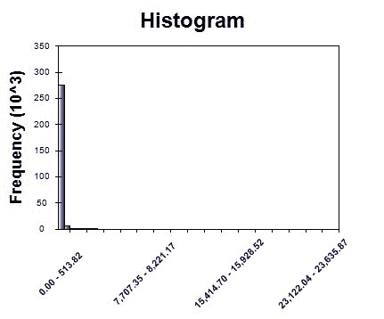
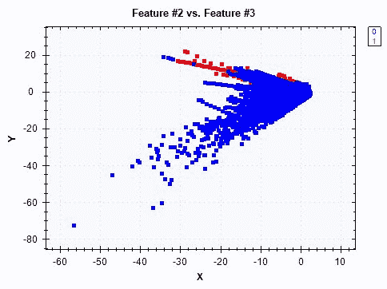
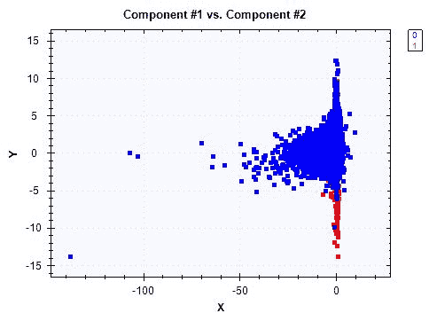
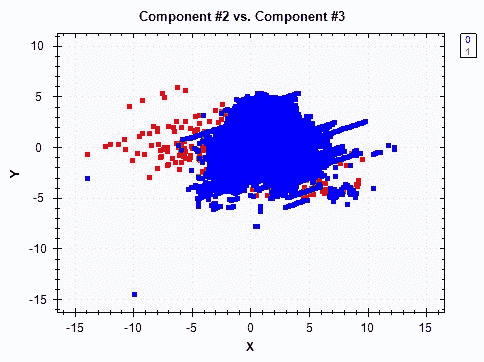
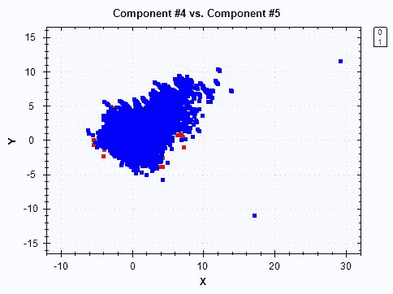

# 十、信用卡欺诈检测

在上一章中，我们使用**主成分分析**（**PCA**）构建了第一个异常检测模型，并了解了如何使用主成分检测网络攻击。与网络攻击或网络入侵问题类似，异常检测模型经常用于欺诈检测。许多行业的各种组织，如金融服务、保险公司和政府机构，经常遇到欺诈案件。特别是在金融部门，欺诈与金钱损失直接相关，这些欺诈案件可能以多种不同的形式出现，如信用卡被盗、伪造会计或伪造支票。由于这些事件发生相对较少，因此很难发现这些欺诈案件。

在本章中，我们将讨论如何为信用卡欺诈检测构建异常检测模型。我们将使用匿名信用卡数据集，该数据集包含大部分正常信用卡交易和相对较少的欺诈性信用卡交易。我们将首先查看数据集的结构、目标类的分布以及各种匿名特征的分布。然后，我们将开始应用 PCA 并构建标准化的主成分，这些主成分将用作欺诈检测模型的特征。在模型构建步骤中，我们将试验两种不同的方法来构建欺诈检测模型，**主成分分类器**（**PCC**），这与我们在[第 9 章](09.html# 3EK180-5ebdf09927b7492888e31e8436526470)、*网络攻击检测*和一类**中构建的类似支持向量机**（**SVM**），从正常信用卡交易中学习并检测任何异常。建立这些模型后，我们将评估它们的异常检测率，并比较它们在信用卡欺诈检测方面的性能。

在本章中，我们将介绍以下主题：

*   信用卡欺诈检测项目的问题定义
*   匿名信用卡数据集的数据分析
*   特征工程与 PCA
*   一类 SVM 与 PCC
*   评估异常检测模型

# 问题定义

信用卡欺诈在其他欺诈事件中较为常见，并且可能发生在我们的日常生活中。信用卡欺诈的发生方式多种多样。信用卡可能丢失或被盗，然后被小偷使用。另一种可能发生信用卡欺诈的方式是，您的身份可能已暴露给恶意的人，然后他们使用您的身份开立新的信用卡帐户，甚至接管您现有的信用卡帐户。骗子甚至可以利用电话钓鱼进行信用卡欺诈。由于信用卡欺诈的发生方式多种多样，许多信用卡持有人都面临着这类欺诈的风险，因此有一种适当的方法来防止此类欺诈的发生已成为我们日常生活中必不可少的一部分。许多信用卡公司已经采取各种措施来预防和检测此类欺诈活动，使用各种**机器学习**（**ML**和异常检测技术。

在本章中，我们将通过使用和扩展我们关于构建异常检测模型的知识来构建信用卡欺诈检测模型。我们将使用匿名信用卡数据集，可在以下链接中找到：[https://www.kaggle.com/mlg-ulb/creditcardfraud/data](https://www.kaggle.com/mlg-ulb/creditcardfraud/data) 。该数据集约有 285000 笔信用卡交易，其中只有约 0.17%是欺诈交易，这很好地反映了现实情况。通过这些数据，我们将了解数据集是如何构造的，然后开始了解目标变量和特征变量的分布。然后，我们将使用 PCA 构建特征，类似于我们在[第 9 章](09.html# 3EK180-5ebdf09927b7492888e31e8436526470)、*网络攻击检测*中所做的。为了构建信用卡欺诈检测模型，我们将对 PCC（类似于我们在[第 9 章](09.html# 3EK180-5ebdf09927b7492888e31e8436526470)、*网络攻击检测*中构建的 PCC）和单类 SVM 进行实验，后者从正常信用卡交易中学习，并判断新交易是否欺诈。最后，我们将观察假警报和欺诈检测率，以评估和比较这些模型的性能。

总结我们对信用卡欺诈检测项目的问题定义：

*   有什么问题？我们需要一个用于欺诈信用卡交易的异常检测模型，该模型可以识别、防止和阻止潜在的欺诈信用卡活动。
*   为什么这是个问题？每个信用卡持有人都面临着成为信用卡欺诈受害者的风险，如果没有对此类恶意企图做好适当准备，信用卡欺诈受害者的数量将会增加。通过信用卡欺诈检测模型，我们可以防止和阻止潜在的欺诈性信用卡交易的发生。
*   解决这个问题的方法有哪些？我们将使用公开的匿名信用卡数据，并且有很多正常的信用卡交易和少量的欺诈交易。我们将对这些数据应用 PCA，并使用 PCC 和一类 SVM 模型进行欺诈检测实验。
*   成功的标准是什么？由于任何信用卡欺诈事件都会导致金钱损失，因此我们需要较高的欺诈检测率。即使存在一些误报或误报，最好标记任何可疑的信用卡活动，以防止任何欺诈交易。

# 匿名信用卡数据分析

现在让我们开始查看信用卡数据集。如前所述，我们将使用以下链接提供的数据集：[https://www.kaggle.com/mlg-ulb/creditcardfraud/data](https://www.kaggle.com/mlg-ulb/creditcardfraud/data) 。该数据集包含约 285000 条信用卡交易记录，其中一些是欺诈性交易，大部分记录是正常信用卡交易。由于机密性问题，数据集中的要素名称是匿名的。我们将使用`creditcard.csv`文件，该文件可从链接下载。

# 目标变量分布

我们要检查的第一件事是数据集中欺诈性和非欺诈性信用卡交易的分布。在数据集中，名为`Class`的列是目标变量，对于欺诈性信用卡交易，用`1`编码；对于非欺诈性交易，用`0`编码。您可以使用以下代码首先将数据加载到 Deedle 数据帧中：

```cs
// Read in the Credit Card Fraud dataset
// TODO: change the path to point to your data directory
string dataDirPath = @"<path-to-your-dir>";

// Load the data into a data frame
string dataPath = Path.Combine(dataDirPath, "creditcard.csv");
Console.WriteLine("Loading {0}\n\n", dataPath);
var df = Frame.ReadCsv(
    dataPath,
    hasHeaders: true,
    inferTypes: true
);
```

此数据集具有表示每个特性和目标类的标题，因此我们使用`hasHeaders: true`标志加载此数据。现在我们已经加载了数据，您可以使用以下代码来分析目标类的分布：

```cs
// Target variable distribution
var targetVarCount = df.AggregateRowsBy<string, int>(
    new string[] { "Class" },
    new string[] { "V1" },
    x => x.ValueCount
).SortRows("V1");
targetVarCount.RenameColumns(new string[] { "is_fraud", "count" });

targetVarCount.Print();

DataBarBox.Show(
    targetVarCount.GetColumn<string>("is_fraud").Values.ToArray(),
    targetVarCount["count"].Values.ToArray()
).SetTitle(
    "Counts by Target Class"
);
```

由于您可能已经熟悉此函数，我们正在使用 Deedle 数据帧中的`AggregateRowsBy`函数按`Class`列对行进行分组，然后计算每个目标类中的记录数。由于列名`Class`不能很好地代表我们的目标类是什么以及它的含义，因此我们将其重命名为另一个名称`is_fraud`。从这段代码中可以看到，您可以使用带有新列名字符串数组的`RenameColumns`函数来重命名功能名称。最后，我们使用 Accord.NET 框架中的`DataBarBox`类来显示一个条形图，直观地显示目标类的分布。

以下输出显示了目标类的分布：


从这个输出可以看出，欺诈性信用卡交易和非欺诈性信用卡交易的数量之间存在很大差距。我们只有 492 份欺诈记录和 284000 份非欺诈记录。

以下是代码生成的条形图，用于直观显示目标类的分布：



如前一次输出所预期的，属于目标类别的记录数量**1**表示欺诈，与属于目标类别的记录数量**0**表示非欺诈和正常信用卡交易之间存在较大差距。与日常信用卡交易相比，信用卡欺诈的发生相对较少，因此预计会出现这一巨大差距。这种大类不平衡使得大多数 ML 模型很难准确地了解如何识别欺诈和非欺诈。

# 特征分布

由于保密问题，除了交易金额之外，我们在此数据中拥有的功能都是匿名的。因为我们不知道每个特征代表什么以及每个特征意味着什么，所以很难从特征分析中推断出任何直观的见解。但是，了解每个特征是如何分布的、每个特征的分布与其他特征的分布有何不同以及我们是否可以从这些特征集中得出任何明显的模式仍然是有帮助的。

让我们首先看一下代码。以下代码显示了我们如何计算和可视化特征的分布：

```cs
// Feature distributions
foreach (string col in df.ColumnKeys)
{
    if (col.Equals("Class") || col.Equals("Time"))
    {
        continue;
    }

    double[] values = df[col].DropMissing().ValuesAll.ToArray();

    Console.WriteLine(String.Format("\n\n-- {0} Distribution -- ", col));
    double[] quartiles = Accord.Statistics.Measures.Quantiles(
        values,
        new double[] { 0, 0.25, 0.5, 0.75, 1.0 }
    );
    Console.WriteLine(
        "Min: \t\t\t{0:0.00}\nQ1 (25% Percentile): \t{1:0.00}\nQ2 (Median): \t\t{2:0.00}\nQ3 (75% Percentile): \t{3:0.00}\nMax: \t\t\t{4:0.00}",
        quartiles[0], quartiles[1], quartiles[2], quartiles[3], quartiles[4]
    );

    HistogramBox.Show(
        values,
        title: col
    )
    .SetNumberOfBins(50);
}
```

从这段代码中可以看到，我们正在计算四分位数。您可能还记得，四分位数是将数据分为四个不同部分的点。第一个四分位数是最小值和中间值之间的中点，第二个四分位数是中间值，第三个四分位数是中间值和最大值之间的中点。您可以使用`Accord.Statistics.Measures.Quantiles`函数轻松计算四分位数。在计算四分位数之后，我们使用 Accord.NET 框架中的`HistogramBox`类为每个特征构建直方图图，以可视化分布。让我们来看看这个代码的一些输出。

我们要看的第一个分布是针对`V1`特性的，而`V1`的四分位数如下所示：


`V1`特征的分布似乎向负方向倾斜。即使中值约为 0，负值范围为-56.41 至 0，而正值范围仅为 0 至 2.45。以下是前一代码的直方图输出：



正如预期的那样，直方图图显示特征分布的左偏态，`V1`，而大多数值约为 0。

接下来，让我们看看第二个特性`V2`的分布，其中输出如下所示：


`V2`的直方图如下所示：



虽然在负方向和正方向上都有一些极值，但这些值似乎以 0 为中心。与前面的特征`V1`相比，偏斜不太明显。

最后，让我们看看`amount`特性的分布，它可以告诉我们交易金额的范围。以下是`amount`功能的四分位数：



似乎任何信用卡交易都可以将 0 到 25691.16 之间的任何正数作为交易金额。以下是`amount`功能的柱状图：



正如所料，我们可以看到右边有一条长尾。这在某种程度上是意料之中的，因为每个人的支出模式不同于其他人。一些人通常会购买价格适中的物品，而另一些人可能会购买非常昂贵的物品。

最后，让我们简单地看看当前的特征集将欺诈性信用卡交易与非欺诈性交易区分开来。让我们先看看下面的代码：

```cs
// Target Var Distributions on 2-dimensional feature space
double[][] data = BuildJaggedArray(
    df.ToArray2D<double>(), df.RowCount, df.ColumnCount
);
int[] labels = df.GetColumn<int>("Class").ValuesAll.ToArray();

double[][] first2Components = data.Select(
    x => x.Where((y, i) => i < 2
).ToArray()).ToArray();
ScatterplotBox.Show("Feature # 1 vs. Feature # 2", first2Components, labels);

double[][] next2Components = data.Select(
    x => x.Where((y, i) => i >= 1 && i <= 2).ToArray()
).ToArray();
ScatterplotBox.Show("Feature # 2 vs. Feature # 3", next2Components, labels);

next2Components = data.Select(
    x => x.Where((y, i) => i >= 2 && i <= 3).ToArray()
).ToArray();
ScatterplotBox.Show("Feature # 3 vs. Feature # 4", next2Components, labels);
```

从这段代码中可以看到，我们首先将 Deedle 数据帧变量`df`转换为二维数组变量`data`，以构建散点图。然后，我们获取前两个特征并显示散点图，该散点图显示了目标类在前两个特征中的分布。对于第二个、第三个和第四个特性，我们将重复此过程两次。

以下散点图是数据集中第一个和第二个要素的目标类分布：


从散点图中，很难（如果不是不可能的话）将欺诈（编码为 1）与非欺诈（编码为 0）区分开来。让我们看看下面两个功能之间的散点图：



与前两个功能的情况类似，似乎没有一条清晰的线来区分欺诈和非欺诈。最后，以下是第三个和第四个要素之间的目标类散点图：


从这个散点图来看，很难画出一条清晰的线来区分两个目标类。欺诈性交易似乎更多地位于这个散点图的右下角，但模式很弱。在下一节中，我们将尝试构建更好地分隔两个目标类的特性。

此数据分析步骤的完整代码可在以下链接中找到：[https://github.com/yoonhwang/c-sharp-machine-learning/blob/master/ch.10/DataAnalyzer.cs](https://github.com/yoonhwang/c-sharp-machine-learning/blob/master/ch.10/DataAnalyzer.cs) 。

# 特征工程与 PCA

到目前为止，我们已经分析了目标和特征变量的分布情况。在本章中，我们将重点介绍使用 PCA 构建特征。

# 特征工程的准备

为了拟合主成分分析，我们必须首先准备数据。让我们快速查看以下代码，将信用卡欺诈数据加载到 Deedle 的数据框中：

```cs
// Read in the Credit Card Fraud dataset
// TODO: change the path to point to your data directory
string dataDirPath = @"<path-to-dir>";

// Load the data into a data frame
string dataPath = Path.Combine(dataDirPath, "creditcard.csv");
Console.WriteLine("Loading {0}\n\n", dataPath);
var df = Frame.ReadCsv(
    dataPath,
    hasHeaders: true,
    inferTypes: true
);

Console.WriteLine("* Shape: {0}, {1}\n\n", df.RowCount, df.ColumnCount);
```

现在，我们已经将数据加载到一个名为`df`的变量中，我们将不得不将数据分为两组，一组用于正常信用卡交易数据，另一组用于欺诈交易数据，这样我们就可以将 PCA 仅用于正常交易。查看以下代码，了解如何将正常事务与原始数据集分开：

```cs
string[] featureCols = df.ColumnKeys.Where(
    x => !x.Equals("Time") && !x.Equals("Class")
).ToArray();

var noFraudData = df.Rows[
    df["Class"].Where(x => x.Value == 0.0).Keys
].Columns[featureCols];
double[][] data = BuildJaggedArray(
    noFraudData.ToArray2D<double>(), noFraudData.RowCount, featureCols.Length
);
```

如果回顾上一个数据分析步骤，目标变量`Class`对于欺诈性交易编码为 1，对于非欺诈性交易编码为 0。从代码中可以看出，我们创建了一个数据框，`noFraudData`，只有正常的信用卡交易记录。然后，我们使用辅助函数`BuildJaggedArray`将该数据帧转换为二维双数组，用于拟合 PCA。此帮助器函数的代码如下所示：

```cs
private static double[][] BuildJaggedArray(double[,] ary2d, int rowCount, int colCount)
{
    double[][] matrix = new double[rowCount][];
    for (int i = 0; i < rowCount; i++)
    {
        matrix[i] = new double[colCount];
        for (int j = 0; j < colCount; j++)
        {
            matrix[i][j] = double.IsNaN(ary2d[i, j]) ? 0.0 : ary2d[i, j];
        }
    }
    return matrix;
}
```

这段代码看起来应该很熟悉，因为我们在前面的许多章节中都使用过它。

我们需要做的下一件事是将整个数据帧（包括非欺诈和欺诈记录）转换为二维数组。使用经过训练的 PCA，我们将对新创建的二维阵列进行变换，该阵列稍后将用于构建信用卡欺诈检测模型。让我们看看下面的代码：

```cs
double[][] wholeData = BuildJaggedArray(
    df.Columns[featureCols].ToArray2D<double>(), df.RowCount, featureCols.Length
);
int[] labels = df.GetColumn<int>("Class").ValuesAll.ToArray();
```

正如您从这个代码片段中所看到的，我们只是使用`BuildJaggedArray`函数将整个数据帧`df`转换为二维数组`wholeData`。

# 拟合主成分分析

我们现在已经准备好使用非欺诈性信用卡数据进行 PCA。与我们在[第 9 章](09.html# 3EK180-5ebdf09927b7492888e31e8436526470)、*网络攻击检测*中所做的类似，我们将使用以下代码来拟合 PCA：

```cs
var pca = new PrincipalComponentAnalysis(
    PrincipalComponentMethod.Standardize
);
pca.Learn(data);
```

从这段代码中可以看出，我们正在使用 Accord.NET 框架中的`PrincipalComponentAnalysis`类来训练 PCA。这里需要注意的另一件事是我们如何使用`PrincipalComponentMethod.Standardize`。由于主成分分析对特征的尺度很敏感，我们首先对特征值进行标准化，然后对主成分分析进行拟合。使用这种经过训练的 PCA，我们可以转换包含欺诈和非欺诈交易的整个数据。将 PCA 转换应用于数据集的代码如下所示：

```cs
double[][] transformed = pca.Transform(wholeData);
```

现在，我们已经为下面的模型构建步骤准备好了所有 PCA 功能。在我们移动之前，让我们看看是否可以找到任何明显的模式，这些模式可以用新的 PCA 特性分离目标类。让我们先看看下面的代码：

```cs
double[][] first2Components = transformed.Select(x => x.Where((y, i) => i < 2).ToArray()).ToArray();
ScatterplotBox.Show("Component # 1 vs. Component # 2", first2Components, labels);

double[][] next2Components = transformed.Select(
    x => x.Where((y, i) => i >= 1 && i <= 2).ToArray()
).ToArray();
ScatterplotBox.Show("Component # 2 vs. Component # 3", next2Components, labels);

next2Components = transformed.Select(
    x => x.Where((y, i) => i >= 2 && i <= 3).ToArray()
).ToArray();
ScatterplotBox.Show("Component # 3 vs. Component # 4", next2Components, labels);

next2Components = transformed.Select(
    x => x.Where((y, i) => i >= 3 && i <= 4).ToArray()
).ToArray();
ScatterplotBox.Show("Component # 4 vs. Component # 5", next2Components, labels);
```

与我们在数据分析步骤中所做的类似，我们采用了两个特征，并在选定的特征中创建目标类的散点图。从这些图中，我们可以看出主成分分析转换数据中的主成分是否能更有效地区分欺诈性信用卡交易和非欺诈性交易。

以下散点图适用于第一个和第二个主成分：



有一个明显的分界点，用于区分欺诈（散点图中的红色点）和非欺诈（散点图中的蓝色点）。从散点图来看，欺诈样本的 Y 值（第二主成分值）通常小于-5。

以下是第二和第三主成分之间的散点图：



与之前的散点图相比，此图中的模式似乎较弱，但似乎仍有一条明显的线将许多欺诈案件与非欺诈案件区分开来。

以下散点图位于第三和第四个主成分之间：


最后，以下是第四和第五主成分之间的散点图：



在最后两个散点图中，我们找不到明显的模式将两个目标类彼此分开。考虑到我们在查看前三个主成分及其散点图时可以找到一些可分离的线，我们的信用卡欺诈检测异常检测模型将能够在更高维度和多个主成分的数据中学习如何对欺诈进行分类。

最后，让我们来看看由主成分解释的方差的比例。首先看一下以下代码：

```cs
DataSeriesBox.Show(
    pca.Components.Select((x, i) => (double)i),
    pca.Components.Select(x => x.CumulativeProportion)
).SetTitle("Explained Variance");
System.IO.File.WriteAllLines(
    Path.Combine(dataDirPath, "explained-variance.csv"),
    pca.Components.Select((x, i) => String.Format("{0},{1:0.0000}", i + 1, x.CumulativeProportion))
);
```

正如我们在[第 9 章](09.html# 3EK180-5ebdf09927b7492888e31e8436526470)*网络攻击检测*中所讨论的，我们可以使用`PrincipalComponentAnalysis`对象中的`Components`属性来提取每个分量所解释的方差的累积比例。从代码的第三行可以看到，我们迭代了`Components`属性并提取`CumulativeProportion`值。然后，我们使用`DataSeriesBox`类显示一个折线图。运行此代码时，您将看到主成分解释的累计方差比例的下图：


从这个图表中可以看出，第二十个主成分解释了数据中约 80%的方差。我们将使用此图表来决定在下一节中构建异常检测模型时要使用多少主成分。

最后，我们需要导出这些数据，因为我们在这个特征工程步骤中刚刚创建了一个新的 PCA 转换数据集，我们希望使用这些新数据来构建模型。您可以使用以下代码导出此数据：

```cs
Console.WriteLine("exporting train set...");

System.IO.File.WriteAllLines(
    Path.Combine(dataDirPath, "pca-features.csv"),
    transformed.Select((x, i) => String.Format("{0},{1}", String.Join(",", x), labels[i]))
);
```

正如您从这个代码片段中看到的，我们正在将这些数据导出到一个名为`pca-features.csv`的 CSV 文件中。在接下来的步骤中，我们将使用这些数据构建异常检测模型，用于信用卡欺诈检测。

此功能工程步骤中使用的完整代码可在以下链接中找到：[https://github.com/yoonhwang/c-sharp-machine-learning/blob/master/ch.10/FeatureEngineering.cs](https://github.com/yoonhwang/c-sharp-machine-learning/blob/master/ch.10/FeatureEngineering.cs) 。

# 一类支持向量机与 PCC

我们现在准备为信用卡欺诈检测项目构建异常检测模型。在这一步中，我们将试验两种不同的方法。我们将建立一个 PCC，类似于我们在[第 9 章](09.html# 3EK180-5ebdf09927b7492888e31e8436526470)、*网络攻击检测*中所做的。此外，我们还将介绍一种新的学习算法，一类支持向量机，它从正常的信用卡交易数据中学习，并决定一个新的数据点是否与训练它的正常数据相似。

# 模特训练准备

首先，我们需要加载在上一个特征工程步骤中创建的数据。您可以使用以下代码加载数据：

```cs
// Read in the Credit Card Fraud dataset
// TODO: change the path to point to your data directory
string dataDirPath = @"<path-to-dir>";

// Load the data into a data frame
string dataPath = Path.Combine(dataDirPath, "pca-features.csv");
Console.WriteLine("Loading {0}\n\n", dataPath);
var featuresDF = Frame.ReadCsv(
    dataPath,
    hasHeaders: false,
    inferTypes: true
);
featuresDF.RenameColumns(
    featuresDF.ColumnKeys
        .Select((x, i) => i == featuresDF.ColumnCount - 1 ? "is_fraud" : String.Format("component-{0}", i + 1))
);
```

如果您还记得上一个特征工程步骤，我们没有导出具有列名的数据。因此，我们正在将数据加载到 Deedle 数据帧`featuresDF`，并将`hasHeaders`标志设置为`false`。然后，我们使用`RenameColumns`方法为每个特征指定适当的列名。让我们使用以下代码快速检查此数据集中的目标类分布：

```cs
Console.WriteLine("* Shape: ({0}, {1})", featuresDF.RowCount, featuresDF.ColumnCount);

var count = featuresDF.AggregateRowsBy<string, int>(
    new string[] { "is_fraud" },
    new string[] { "component-1" },
    x => x.ValueCount
).SortRows("component-1");
count.RenameColumns(new string[] { "is_fraud", "count" });
count.Print();
```

此代码的输出如下所示：


如前所述，在数据分析步骤中，大多数样本属于非欺诈性交易，只有一小部分数据属于欺诈性信用卡交易。

# 主成分分类器

我们将首先尝试使用主成分构建异常检测模型，类似于我们在[第 9 章](09.html# 3EK180-5ebdf09927b7492888e31e8436526470)、*网络攻击检测*中所做的。为了训练和测试 PCC 模型，我们编写了一个助手函数，名为`BuildPCAClassifier`。该助手功能的详细代码可在以下 repo 中找到：[https://github.com/yoonhwang/c-sharp-machine-learning/blob/master/ch.10/Modeling.cs](https://github.com/yoonhwang/c-sharp-machine-learning/blob/master/ch.10/Modeling.cs) 。让我们一步一步来看看这个辅助函数。

当您查看`BuildPCAClassifier`方法的代码时，您将看到以下代码行：

```cs
// First 13 components explain about 50% of the variance
int numComponents = 13;
string[] cols = featuresDF.ColumnKeys.Where((x, i) => i < numComponents).ToArray();

// First, compute distances from the center/mean among normal events
var normalDF = featuresDF.Rows[
    featuresDF["is_fraud"].Where(x => x.Value == 0).Keys
].Columns[cols];

double[][] normalData = BuildJaggedArray(
    normalDF.ToArray2D<double>(), normalDF.RowCount, cols.Length
);
```

首先，我们正在细分前十三个主成分，它们解释了大约 50%的方差。然后，我们创建一个非欺诈性信用卡交易组`normalDF`和`normalData`，以便我们可以使用该子集来构建异常检测模型。

接下来我们要做的是开始计算**马氏距离**度量，以测量数据点与非欺诈性信用卡交易分布之间的距离。如果您还记得，我们在[第 9 章](09.html# 3EK180-5ebdf09927b7492888e31e8436526470)、*网络攻击检测*中使用了相同的距离度量，我们建议您查看[第 9 章](09.html# 3EK180-5ebdf09927b7492888e31e8436526470)、*网络攻击检测*中的*模型构建*部分，以了解有关此距离度量的更详细说明。计算距离的代码如下所示：

```cs
double[] normalVariances = ComputeVariances(normalData);
double[] rawDistances = ComputeDistances(normalData, normalVariances);

double[] distances = rawDistances.ToArray();

double meanDistance = distances.Average();
double stdDistance = Math.Sqrt(
    distances
    .Select(x => Math.Pow(x - meanDistance, 2))
    .Sum() / distances.Length
);

Console.WriteLine(
    "* Normal - mean: {0:0.0000}, std: {1:0.0000}",
    meanDistance, stdDistance
);
```

正如您从这个代码片段中所看到的，我们使用两个辅助函数`ComputeVariances`和`ComputeDistances`来计算特征值和距离的方差。以下是`ComputeVariances`方法的代码：

```cs
private static double[] ComputeVariances(double[][] data)
{
    double[] componentVariances = new double[data[0].Length];

    for (int j = 0; j < data[0].Length; j++)
    {
        componentVariances[j] = data
            .Select((x, i) => Math.Pow(data[i][j], 2))
            .Sum() / data.Length;
    }

    return componentVariances;
}
```

此代码看起来应该很熟悉，因为这与我们在[第 9 章](09.html# 3EK180-5ebdf09927b7492888e31e8436526470)、*网络攻击检测*中使用的代码相同，用于构建网络攻击检测的 PCC 模型。此外，以下是`ComputeDistances`方法的代码：

```cs
private static double[] ComputeDistances(double[][] data, double[] componentVariances)
{

    double[] distances = data.Select(
        (row, i) => Math.Sqrt(
            row.Select(
                (x, j) => Math.Pow(x, 2) / componentVariances[j]
            ).Sum()
        )
    ).ToArray();

    return distances;
}
```

这段代码看起来也很熟悉，因为我们在[第 9 章](09.html# 3EK180-5ebdf09927b7492888e31e8436526470)中也使用了这段代码，*网络攻击检测*中也使用了这段代码。使用这两种方法，我们计算了非欺诈交易数据中距离度量的平均值和标准偏差。输出如下所示：


通过计算正常交易组中的距离度量，我们现在计算欺诈性交易和非欺诈性交易分布之间的距离。以下是`BuildPCAClassifier`代码中计算欺诈距离的部分：

```cs
// Detection
var fraudDF = featuresDF.Rows[
    featuresDF["is_fraud"].Where(x => x.Value > 0).Keys
].Columns[cols];

double[][] fraudData = BuildJaggedArray(
    fraudDF.ToArray2D<double>(), fraudDF.RowCount, cols.Length
);
double[] fraudDistances = ComputeDistances(fraudData, normalVariances);
```

从这个代码片段中可以看到，我们首先将欺诈数据从整个数据集中分离出来，并创建一个二维数组变量`fraudData`，用于距离测量计算。然后，使用我们编写的`ComputeDistances`函数，我们可以计算欺诈性信用卡交易和非欺诈性交易分布之间的距离。通过这些距离度量，我们开始分析每个目标虚警率的欺诈检测率。请看以下代码段：

```cs
// 5-10% false alarm rate
for (int i = 0; i < 4; i++)
{
    double targetFalseAlarmRate = 0.05 * (i + 1);
    double threshold = Accord.Statistics.Measures.Quantile(
        distances,
        1 - targetFalseAlarmRate
    );

    int[] detected = fraudDistances.Select(x => x > threshold ? 1 : 0).ToArray();

    Console.WriteLine("\n\n---- {0:0.0}% False Alarm Rate ----", targetFalseAlarmRate * 100.0);
    double overallRecall = (double)detected.Sum() / detected.Length;
    Console.WriteLine("* Overall Fraud Detection: {0:0.00}%", overallRecall * 100.0);
}
```

这个代码片段看起来应该很熟悉，因为这与我们在[第 9 章](09.html# 3EK180-5ebdf09927b7492888e31e8436526470)、*网络攻击检测*中所做的类似。然而，与此不同的是，我们只有两个目标类别（欺诈与非欺诈），而在[第 9 章](09.html# 3EK180-5ebdf09927b7492888e31e8436526470)、*网络攻击检测*中，我们有五个目标类别（正常与四种不同类型的网络攻击）。从这段代码中可以看到，我们对 5%到 10%的五种不同的目标虚警率进行了实验，并分析了给定目标虚警率下的欺诈检测率。在下面的模型评估步骤中，我们将更深入地研究这段代码。

# 一类支持向量机

我们将要探索的下一种信用卡欺诈检测方法是训练一类 SVM。单类支持向量机是支持向量机的一种特殊情况，首先使用数据对支持向量机模型进行训练，然后，当它看到一个新的数据点时，支持向量机模型可以确定新的数据点是否足够接近它训练的数据。为了训练一类 SVM 模型，我们编写了一个帮助函数`BuildOneClassSVM`，该函数的完整代码可以在以下 repo 中找到：[https://github.com/yoonhwang/c-sharp-machine-learning/blob/master/ch.10/Modeling.cs](https://github.com/yoonhwang/c-sharp-machine-learning/blob/master/ch.10/Modeling.cs) 。让我们一步一步地了解这个 helper 函数。

首先，让我们看一下代码的一部分，它选择了非欺诈性的信用卡交易数据，这些数据将用于训练单类 SVM。代码如下所示：

```cs
// First 13 components explain about 50% of the variance
int numComponents = 13;
string[] cols = featuresDF.ColumnKeys.Where((x, i) => i < numComponents).ToArray();

var rnd = new Random(1);
int[] trainIdx = featuresDF["is_fraud"]
    .Where(x => x.Value == 0)
    .Keys
    .OrderBy(x => rnd.Next())
    .Take(15000)
    .ToArray();
var normalDF = featuresDF.Rows[
    trainIdx
].Columns[cols];

double[][] normalData = BuildJaggedArray(
    normalDF.ToArray2D<double>(), normalDF.RowCount, cols.Length
);
```

与我们之前构建的 PCC 模型类似，我们使用前十三个主成分来解释约 50%的总方差。接下来，我们将从非欺诈性交易样本中再选择记录，并构建一个序列集。正如您从该代码中看到的，我们随机选择 15000 个非欺诈性样本作为序列集。

现在我们有一个火车来训练一类 SVM 模型，让我们看看下面的代码：

```cs
var teacher = new OneclassSupportVectorLearning<Gaussian>();
var model = teacher.Learn(normalData);
```

我们使用 Accord.NET 框架中的`OneclassSupportVectorLearning`算法来训练一类 SVM 模型。如您所见，我们在本章中使用`Gaussian`核构建了一个 SVM 模型，但您可以使用不同的核进行实验。现在，剩下的唯一一步就是测试我们刚刚训练的一类 SVM 模型。以下代码显示了我们如何构建测试集来评估此模型：

```cs
int[] testIdx = featuresDF["is_fraud"]
    .Where(x => x.Value > 0)
    .Keys
    .Concat(
        featuresDF["is_fraud"]
        .Where(x => x.Value == 0 && !trainIdx.Contains(x.Key))
        .Keys
        .OrderBy(x => rnd.Next())
        .Take(5000)
        .ToArray()
    ).ToArray();

var fraudDF = featuresDF.Rows[
    testIdx
].Columns[cols];

double[][] fraudData = BuildJaggedArray(
    fraudDF.ToArray2D<double>(), fraudDF.RowCount, cols.Length
);

int[] fraudLabels = featuresDF.Rows[
    testIdx
].GetColumn<int>("is_fraud").ValuesAll.ToArray();
```

正如您从该代码中看到的，我们将所有欺诈样本和 5000 个随机子选择的非欺诈样本作为测试集。通过这个测试集，我们将评估这一类 SVM 模型在检测信用卡欺诈方面的性能。

我们将在下面的章节中更深入地研究评估代码，但是让我们来看看我们如何评估我们刚刚训练过的一类 SVM 模型的性能。代码如下所示：

```cs
for(int j = 0; j <= 10; j++)
{
    model.Threshold = -1 + j/10.0; 

    int[] detected = new int[fraudData.Length];
    double[] probs = new double[fraudData.Length];
    for (int i = 0; i < fraudData.Length; i++)
    {
        bool isNormal = model.Decide(fraudData[i]);
        detected[i] = isNormal ? 0 : 1;
    }

    Console.WriteLine("\n\n---- One-Class SVM Results ----");
    Console.WriteLine("* Threshold: {0:0.00000}", model.Threshold);
    double correctPreds = fraudLabels
        .Select((x, i) => detected[i] == 1 && x == 1 ? 1 : 0)
        .Sum();
    double precision = correctPreds / detected.Sum();
    double overallRecall = correctPreds / fraudLabels.Sum();
    Console.WriteLine("* Overall Fraud Detection: {0:0.00}%", overallRecall * 100.0);
    Console.WriteLine("* False Alarm Rate: {0:0.00}%", (1 - precision) * 100.0);
}
```

从这段代码中可以看到，我们迭代了不同的阈值值，类似于我们为之前的 PCC 模型设置不同阈值的方式。与代码的第三行一样，您可以使用模型的`Threshold`属性来获取或设置阈值，以确定记录是正常的还是异常的。与我们评估 PCC 的方式类似，我们将研究模型验证的欺诈检测率和虚警率。

我们在建模步骤中使用的完整代码可以在以下链接中找到：[https://github.com/yoonhwang/c-sharp-machine-learning/edit/master/ch.10/Modeling.cs](https://github.com/yoonhwang/c-sharp-machine-learning/edit/master/ch.10/Modeling.cs) 。

# 评估异常检测模型

我们训练了两个异常检测模型，一个使用主成分，另一个使用一类 SVM 算法。在本节中，我们将更详细地了解用于评估这些模型的性能指标和代码。

# 主成分分类器

如前一节所述，我们将研究每个目标虚警率的信用卡欺诈检测率。用于评估 PCC 模型的代码如下所示：

```cs
// 5-10% false alarm rate
for (int i = 0; i < 4; i++)
{
    double targetFalseAlarmRate = 0.05 * (i + 1);
    double threshold = Accord.Statistics.Measures.Quantile(
        distances,
        1 - targetFalseAlarmRate
    );

    int[] detected = fraudDistances.Select(x => x > threshold ? 1 : 0).ToArray();

    Console.WriteLine("\n\n---- {0:0.0}% False Alarm Rate ----", targetFalseAlarmRate * 100.0);
    double overallRecall = (double)detected.Sum() / detected.Length;
    Console.WriteLine("* Overall Fraud Detection: {0:0.00}%", overallRecall * 100.0);
}
```

与[第 9 章](09.html# 3EK180-5ebdf09927b7492888e31e8436526470)*网络攻击检测*类似，我们将目标虚警率从 5%迭代到 10%，并检查给定虚警率的检测率。使用目标虚警率变量`targetFalseAlarmRate`，我们使用`Accord.Statistics.Measures.Quantile`方法计算阈值。使用此计算出的阈值，我们将距离大于此阈值的所有记录标记为欺诈，其他记录标记为非欺诈。让我们看看评估结果。

以下是 5%虚警率下的欺诈检测率：


以下是 10%虚警率下的欺诈检测率：


以下是 15%虚警率下的欺诈检测率：


最后，以下是 20%虚警率下的欺诈检测率：


从这些结果可以看出，随着我们放松并提高目标虚警率，欺诈检测率也会提高。在 5%的目标误报率下，我们只能检测到约 59%的欺诈交易。然而，在 20%的目标虚警率下，我们可以检测到 80%以上的信用卡欺诈交易。

# 一类支持向量机

现在让我们来看一下单类 SVM 模型在信用卡欺诈数据集上的表现。模型评估的代码如下所示：

```cs
for(int j = 0; j <= 10; j++)
{
    model.Threshold = -1 + j/10.0; 

    int[] detected = new int[fraudData.Length];
    double[] probs = new double[fraudData.Length];
    for (int i = 0; i < fraudData.Length; i++)
    {
        bool isNormal = model.Decide(fraudData[i]);
        detected[i] = isNormal ? 0 : 1;
    }

    Console.WriteLine("\n\n---- One-Class SVM Results ----");
    Console.WriteLine("* Threshold: {0:0.00000}", model.Threshold);
    double correctPreds = fraudLabels
        .Select((x, i) => detected[i] == 1 && x == 1 ? 1 : 0)
        .Sum();
    double precision = correctPreds / detected.Sum();
    double overallRecall = correctPreds / fraudLabels.Sum();
    Console.WriteLine("* Overall Fraud Detection: {0:0.00}%", overallRecall * 100.0);
    Console.WriteLine("* False Alarm Rate: {0:0.00}%", (1 - precision) * 100.0);
}
```

从这段代码中可以看到，我们以 0.1 的增量迭代从-1.0 到 0.0 的不同阈值。您可以通过更新一类 SVM 模型对象的`Threshold`属性来设置模型的阈值。该阈值将指导模型如何确定哪些记录是欺诈的，哪些不是。在对最终模型做出决策时，您需要试验不同的阈值值，以确定适合您需求的最佳阈值。让我们来看看一些性能结果。

以下显示了阈值为-0.4 时的性能指标：


以下显示了阈值为-0.3 时的性能指标：


以下显示了阈值为-0.2 时的性能指标：


最后，以下显示了阈值为-0.1 时的性能指标：


从这些结果可以看出，随着阈值的增加，虚警率降低，但欺诈检测率也降低。很明显，在更高的精确度和更高的欺诈检测率之间存在权衡。在-0.4 的阈值下，该模型能够检测到约 70%的欺诈性信用卡交易，假警报率约为 40%。另一方面，在-0.1 的阈值下，该模型只能检测到约 57%的欺诈性信用卡交易，但误报率仅为 33%左右。

# 总结

在本章中，我们构建了另一个异常检测模型，用于信用卡欺诈检测。本章首先介绍匿名信用卡欺诈数据的结构，然后分析目标变量和特征变量的分布。在分析目标类别的分布时，我们注意到欺诈类别和非欺诈类别之间存在很大的类别不平衡。当我们面对任何类型的异常检测项目时，这都是正常的，其中正常类远远超过正类。然后，我们开始分析匿名特征的分布。由于这些特征因保密问题而被匿名化，我们无法从数据集中获得任何直觉。

然而，我们能够更好地了解分布情况，以及如何使用原始特征轻松区分欺诈和非欺诈。然后，我们应用 PCA 并导出模型构建步骤的 PCA 特征。我们尝试了两种方法来构建信用卡欺诈检测模型：主成分分类器和单类支持向量机。我们通过观察不同虚警率下的欺诈检测率来评估这些模型的性能。显然，在提高虚警率和提高欺诈检测率之间存在着权衡。

本章是关于在 C# 中构建 ML 模型的最后一章。在下一章中，我们将总结到目前为止我们在所有章节中所做的工作，以及在构建 ML 模型时还有哪些额外的实际挑战。此外，我们还将讨论其他一些软件包，以及其他一些数据科学技术，它们可以用于您未来的 ML 项目。