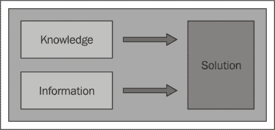
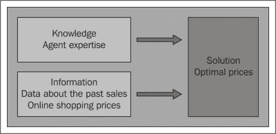
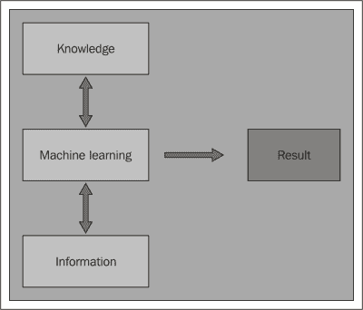
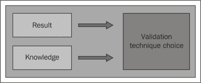

<title>Chapter 1. Transforming Data into Actions</title>

# 第一章。将数据转化为行动

面对业务问题，我们需要知识和专业技能来找到解决方案。此外，我们还需要有助于确定解决方案的相关数据。本章展示了新技术如何让我们构建强大的机器，从数据中学习，为商业决策提供支持。

本章将涉及的主题如下:

*   处理商业问题的一般思路
*   与数字技术相关的新挑战
*   新工具如何帮助使用信息
*   工具如何识别不明显的信息
*   工具如何估计未来事件的结果
*   为什么是 R？

# 业务决策中的数据驱动方法

专业知识和信息在商业决策中扮演着重要的角色。本节展示了数据驱动技术如何改变了应对挑战的方法并改进了解决方案。

## 商业决策来自知识和专长

解决商业问题的总体思路多年来都没有改变，它将知识和信息结合在一起。在使用数字技术之前，知识来自以前的经验和其他人提供的专业知识。关于信息，它是关于分析当前形势并将其与过去的事件进行比较。

一个简单的例子是，一个水果商想要确定他们商品的价格。一个产品的价格应该是利润最大化，这取决于销量，也取决于价格本身。经销商开始了他们的工作，他们的父亲给了他们所有的知识。因此，他们已经知道不同水果的价格。此外，每天结束时，他们可以观察每种水果的销售量。基于此，他们可以提高卖得很好的水果的价格，降低卖不出去的水果的价格。这个简单的例子展示了水果商如何结合领域知识和信息来解决他们的问题，如下图所示:

这个简单的例子展示了一个简单的挑战如何需要知识和数据的结合。

## 数字时代提供了更多的数据和专业知识

尽管解决商业问题的总体思路没有改变，但数字技术为我们提供了新的强大工具。

互联网允许人们互相联系，分享他们的专业知识，这样每个人都可以访问大量的信息。在互联网出现之前，知识来自于信任的人和书。现在，信息的传播使得人们可以找到世界各地不同人写的书和文章。此外，网站和论坛允许其用户相互联系，以便分享专业知识和快速找到答案。

数字技术跟踪不同的活动，并产生大量相关数据。我们所说的数据指的是机器可以处理的一组定量或定性的信息。因此，当面临业务问题时，我们可以使用来自不同来源的大量数据。有些信息可能不太相关，但是即使删除了这些信息，我们仍然会有大量的数据。因此，我们对结果有很大的改进潜力。

数字技术带来的变化包括获取专业知识的过程和数据的性质。因此，解决问题的方法提出了新的挑战。

一个公司面临业务问题的简单例子是一个汽车经销商，他销售不同的二手车，并希望设定最相关的价格。汽车经销商应该根据汽车型号、车龄和其他特征来确定价格。此示例旨在说明一种可能的情况，并不一定与实际问题相关。

汽车经销商需要确定每辆车的最佳价格，以实现收入最大化。类似于卖水果的，如果一辆车的价格太高，车商短时间内不会卖掉，那么就会产生额外的仓储成本，车也就失去了价值。这导致了额外的成本和利润的减少，从而损害了业务。另一方面，如果价格太低，公司将立即出售汽车。虽然存储成本较低，但公司还没有获得最佳利润。为了销售汽车并实现利润最大化，该公司希望找出最佳价格。

让我们来看看有助于找到解决方案的专业知识和信息。公司可以使用:

*   已经销售过不同汽车的代理商的知识
*   来自互联网的信息
*   关于以前销售的数据

代理可以利用他们过去的经验，因此他们的知识有助于确定最佳价格。然而，当市场变化很快时，仅仅确定价格是不够的。

互联网给了我们很多信息，因为有很多在线购物网站显示二手车的价格。网上购物不同于实体市场，但一个专业的代理商可以看看网站，比较价格。通过这种方式，代理可以将他们的专业知识与在线信息结合起来，以一种良好的方式确定正确的价格。

这种方法产生了好的结果，但是仍然不是最佳的。查看不同的网站很费时间，尤其是如果有很多种类的汽车，所以很难甚至不可能每天查看价格。另一个问题是，可能会有许多网站，让一个人不可能处理所有的信息。通过自动化我们的网络研究和更系统地使用数据，我们可以更快地获取信息。

要获取信息，数据来源是公司销售和在线市场，一个好的汽车定价解决方案应该考虑所有这些来源。公司销售数据显示了过去顾客对价格的反应。例如，我们知道过去销售每辆车需要多长时间。如果花的时间太长，价格可能会太高。该标准是客观的，专家代理可以使用该信息来识别当前错误的价格。

来自在线购物网站的数据显示汽车价格，我们可以使用工具来存储价格和销售历史。尽管这些信息与问题的相关性较小，但可以像处理公司销售数据一样对其进行处理，从而提高结果的准确性，如下图所示:

这个例子显示了拥有更多信息和专业知识的潜力。这里的挑战是以最恰当的方式使用信息来改进解决方案。一般来说，我们使用的信息越多，结果可能就越准确。在最坏的情况下，我们有很多不相关的信息，我们可以识别和使用其中一小部分相关的信息。

## 技术连接数据和业务

一个人可以通过结合数据和专业知识来解决一个商业问题，只要数据是人类大脑可以理解的。数字技术带来的数据量的增长改变了处理问题的方式，因为更多的数据需要新的工具来使用。此外，新设备使我们能够进行数据分析，这在 10 年前的个人电脑上是不可能的。

这一事实不仅改变了处理数据的方式，也改变了做出商业决策的整个过程。

有几种方法可以使用数据中包含的信息。例如，互联网电影流媒体提供商网飞使用一种工具，根据你的兴趣产生个性化的电影推荐。**机器学习**是指从数据中学习提供洞察和行动的工具，是**人工智能**的一个子领域。机器学习技术不只是处理数据，而是将数据和业务联系起来。信息和知识之间的这种交互是至关重要的，并且几乎影响到构建解决方案的每一步。

在构建识别解决方案的工具时，知识仍然扮演着重要的角色。由于有许多机器学习工具处理同一个问题，你的专业知识可以用来选择最相关的工具。此外，大多数工具都有一些参数，因此有必要了解设置它们的问题，如下图所示:

在机器学习技术识别出一个结果之后，我们可以使用信息和专业知识来验证它的性能。例如，在汽车经销商的例子中，我们可以构建一个工具来自动识别最佳价格并预测销售每辆汽车的必要时间。从之前的数据开始，我们可以使用该工具来估计销售汽车需要多长时间，并将估计时间与实际时间进行比较。此外，我们可以识别当前的价格，并利用知识和专业知识来查看它们是否合理。通过这种方式，我们比较机器学习方法与现实的相似程度。

验证有助于比较不同的技术并选择性能最佳的技术。此外，技术通常需要不同选项的设置，验证有助于选择最合适的选项，如下图所示:

总之，机器学习和业务之间的交互极其重要，它发生在构建解决方案过程的每个部分。

<title>Identifying hidden patterns</title>

# 识别隐藏模式

数据显示一些显而易见的信息，它包含许多其他更隐含的信息。有时，业务问题的解决方案需要一些不太明显的信息，这些信息可能部分是主观的。本节展示了一些机器学习技术如何从数据中发现隐藏的结构和模式。

## 数据包含隐藏的信息

跟踪活动的数据包含与技术设备相关的信息。例如，在超市里，收银机会跟踪购买的商品。因此，有可能获得每种商品过去的销售信息。可用信息是**销售点** ( **POS** )数据，它通过以下属性显示交易:

*   项目 ID
*   已售出的单位数量
*   项目的价格
*   购买的日期和时间
*   收银机的 ID
*   客户 ID(针对使用 Nectar 卡的客户)

有些信息是显而易见的，可以通过分析数据轻松获取，而有些信息是隐藏的。从交易开始，很容易确定过去的销售总额。例如，我们可以计算一天卖出了多少件产品。这样做很容易:

1.  根据产品 ID 和日期选择交易。
2.  添加单位数量。

仍然很容易获得一些稍微复杂一些的信息。我们可以将商品分成几个部门，知道了前一年每个部门的总销售量，我们就可以:

1.  为每个部门生成产品 id 列表。
2.  对于每个部门，选择前一年的交易和该部门的产品 id。
3.  添加单位数量。

从过去的总销售额中提取任何其他种类的信息都是可能的。如果分析的目标是客户而不是销售呢？

我们可以使用客户 ID 来跟踪每个客户的购买情况。例如，给定一个客户 ID，我们可以确定他们购买的总数量。这个数据还是很容易获取的，所以谈不上隐藏模式。但是，仍有大量关于客户的信息无法直接显示。

有些客户有类似的客户习惯。客户类别的例子有:

*   学生
*   家庭主妇
*   老年人

每一组人都有一些特定的购买习惯，如下所示:

*   可花的钱
*   顾客感兴趣的产品
*   购买的日期和时间

例如，平均来说，学生比其他人花的钱少。妈妈们更热衷于为家里购买食品和日用品。学生放学后更有可能去超市；老年人几乎在一天中的任何时候都会去。

该数据并不显示哪些客户 id 与每一类客户相关联，即使它包含一些关于他们行为的信息。但是，为了执行简单的分析操作，很难识别哪些客户是相似的。此外，为了识别组，我们需要对客户类别有一个初步的猜测。

## 商业问题需要隐藏信息

一个业务问题可能需要一些隐藏的信息。在超市的例子中，我们想对一些客户群进行特别的营销和折扣活动。

营销活动的选项决定了以下内容:

*   做广告的是哪些商品
*   哪些商品打折
*   折扣
*   哪些工作日会受到促销的影响

如果超市很小，就有可能提取每个顾客的数据，然后通过特定的活动来解决他们的问题。然而，超市很大，有很多顾客，所以如果不使用一些数据处理，就不可能单独考虑他们中的每一个。

一种可能是定义一种方法，自动读取关于每个客户的数据，从而选择营销活动。这种方法需要满足以下条件:

*   组织数据和选定的信息
*   数据建模
*   定义行动

这种方法是可行的，尽管它有一些缺点。营销活动的决策需要对客户群有一个总体的了解。在理解了顾客行为的模式之后，就有可能定义一种方法来从顾客行为出发选择营销活动。因此，这种方法需要一些前期分析。

另一个解决方案是识别有相似习惯的客户群。一旦定义了群体，就可以分别分析每个群体，以了解其共同的购买行为。

下图显示了用小圆圈表示的一些客户，其中大圆圈表示同类客户群:

这样，超市就有了一些关于每个群体的信息，通过结合以下内容，帮助他们确定正确的营销活动:

*   关于集团客户的一些汇总信息
*   一些商业知识，让他们能够定义一个适当的营销活动

假设每个顾客在未来都有相同的习惯，至少在短期内，就有可能确定每组顾客的购买行为和兴趣，从而针对他们开展相同的活动。

## 重塑数据

从 POS 数据开始，我们希望对超市顾客的购买习惯进行建模，以便识别同类群体。虽然 POS 数据不直接显示客户行为，但它包含客户 ID。每个客户的行为可以通过测量他们的习惯来建模。例如，我们可以衡量他们在过去几年中购买的设备总数。类似地，我们可以定义一些其他的**关键绩效指标**(**KPI**)，它们是描述行为不同方面的值。提取与客户相关的所有交易后，我们可以将 KPI 定义如下:

*   他们在上一年购买的单位总数
*   他们去年花费的总金额
*   他们在下午 6 点到 7 点之间购买的单位的百分比
*   特定项目部门的总支出
*   他们在夏天花费的钱的百分比

选择 KPI 有不同的选项，它们应该与问题相关。在我们的示例中，我们希望确定客户可能对哪些产品感兴趣。

与该问题相关的一些 KPI 如下:

*   去年花费的总金额，以确定客户可以花费的最大金额
*   不同项目部门的支出百分比，以确定客户感兴趣的项目
*   上午和下午早些时候购买的百分比，以识别家庭主妇和养老金领取者

给定一小组客户，通过观察数据很容易识别同质群体。然而，如果我们有许多客户和/或 KPI，我们需要计算工具来揭示数据中隐藏的模式。

## 用无监督学习识别模式

有一些识别隐藏结构的机器学习算法，这个技术分支被称为“无监督学习”。从数据开始，无监督学习算法识别没有直接显示的模式和标签。

在我们的示例中，我们使用描述客户购买行为的一组适当的 KPI 为客户建模。我们的目标是找出 KPI 值相似的群体。

为了联系客户，第一步是衡量他们的相似程度。观察两个客户的数据，如果他们的 KPI 值相似，我们可以看到他们是相似的。由于客户很多，我们无法人工观察数据，所以需要定义一个准则。该标准是一个函数，它将两个客户的 KPI 作为输入，并计算一个*距离*，该距离是一个表示值之间差异的数字。这样就有了客观的方式来陈述两个客户*有多相似*。

我们通过*对象*对客户进行建模，这些对象的*相似度*可以测量。有几种机器学习算法将*相似的*对象分组，它们被称为**聚类技术**。这些技术将相似的客户组合在一起，从而识别同类的组。

有不同的选项对客户进行分组，具体取决于:

*   所需集群的数量
*   每个 KPI 的相关性
*   识别集群的方法

聚类有不同的选项，大多数算法都包含一些参数。为了选择合适的技术和设置，我们需要研究数据来理解业务问题。

这一章只是介绍性的一章，聚类只是无监督学习的一个例子。

## 通过无监督学习做出商业决策

聚类技术让我们能够识别同质的客户群。对于每个集群，超市必须使用促销和折扣来定义针对其客户的营销活动。

对于每个集群，可以定义一个汇总表来显示客户的平均行为。将这些信息与一些商业专业知识结合起来，超市可以最大化活动的积极影响。

总之，聚类允许我们将大量的数据转换成一小组相关的信息。然后，业务专家可以阅读和理解聚类结果，以做出最佳决策。

这个例子展示了数据和专业知识是如何紧密联系在一起的。机器学习算法需要使用业务专业知识定义的 KPI。算法处理完数据后，需要业务专家来确定正确的行动。

<title>Estimating the impact of an action</title>

# 评估行动的影响

当一个商业决策包括在不同选项之间进行选择时，解决方案需要估计每个选项的影响。本章展示了机器学习技术如何根据期权预测未来事件，以及我们如何衡量准确性。

## 业务问题需要估计未来事件

如果我们不得不在不同的选项之间做出选择，我们会评估每个选项的影响并选择最好的。为了说明这一点，的例子是一家大型超市计划开始销售一种新商品，商业决策包括选择其价格。

为了选择最佳价格，公司需要知道:

*   价格选项
*   每个价格选项对商品销售的影响
*   每个价格选项对其他商品销售的影响

理想的解决方案是最大化短期和长期整体收入的影响。关于物品本身，如果它的价格太高，公司就不会出售它，错过了潜在的利润。另一方面，如果价格太低，公司将出售不同的单位，而没有很好的收入。

此外，一个新项目的价格会对类似项目的销售产生影响。例如，如果超市正在销售一种新的谷物，所有其他谷物产品的销售都会受到影响。如果新价格太低，一些购买其他商品的顾客会想省钱，因此购买新商品。这样部分客户会少花钱，整体收益会降低。相反，如果新产品定价过高，顾客可能会认为其他产品太便宜，从而降低其质量。

有种不同的影响，其中一种选择是首先定义商品的最低和最高价格，以避免对相关商品的销售产生负面影响。然后，我们可以选择新的价格，使物品本身的收益最大化。

## 收集要学习的数据

让我们假设我们已经定义了新商品的最低和最高价格。我们的目标是使用数据来发现信息，让我们最大限度地提高产品的收益。收入取决于:

*   项目的价格
*   下个月要销售的单位

为了使收益最大化，我们希望根据价格对其进行估计，并选择使其最大化的价格。如果我们能根据价格来估计销售量，我们就能估计收入。

该数据显示过去交易的信息，包括:

*   项目 ID
*   日期
*   一天内售出的单位数量
*   项目的价格

还存在映射包括一些特征的项目的其他数据。为了简化问题，这些特征都是分类的，所以它们显示类别而不是数字。功能示例如下:

*   部门
*   产品
*   品牌
*   定义项目的其他分类特征

我们没有任何关于新产品销售的数据，所以我们需要使用一些类似产品的数据来估计客户行为。我们假设:

*   未来顾客的行为与过去相似
*   类似商品的顾客行为是相似的
*   新产品的销售并没有因为它是新上市的而受到影响

因为我们要估算新产品的销售量，所以我们从同类产品的销售量开始。对于每个项目，我们提取其上个月的交易，并计算:

*   上个月的总台数
*   上个月最常见的价格

此外，对于每个项目，我们都有定义其特征的数据。关于每个项目的数据是估算收入的起点。

## 使用监督学习预测未来结果

在我们的问题中，机器学习算法的目标是根据商品的价格预测其销量。从数据中学习预测未来事件的技术分支被称为**监督学习**。算法的起点是由事件已知的对象组成的训练数据集。算法识别描述对象和事件的数据之间的关系。然后，他们建立一个模型来定义这种关系，并使用该模型来预测其他对象上的事件。监督学习和非监督学习的区别在于，监督学习技术使用已知事件进行训练，而非监督学习技术识别隐藏的模式。

例如，我们有一个新项目，它的价格可以是 2 美元、3 美元或 4 美元。为了得到最优价格，我们需要估计未来的收入。

该数据根据价格和功能显示任何商品的销售量。根据新商品的价格，估算其销售量的方法是使用最相似的规定数量( *k* )的商品的销售量。对于每个价格，步骤如下:

1.  根据新商品的特点和价格，定义哪些是最相似的 *k* 商品。
2.  定义如何使用类似产品的数据来估计新产品的销售量。

为了识别最相似的项目，我们必须决定什么是*相似*以及如何*相似*。为了做到这一点，我们可以定义一种方法来衡量任何两个项目之间的相似性取决于功能和价格。考虑到这些特征，可以通过距离函数来测量相似性:

*   价差
*   相同产品
*   相同的品牌
*   同一个部门
*   其他类似特征

一种简单的方法是将距离测量为特征之间相异度的总和。例如，一个非常简单的差异可以是价格差异加上显示不同值的分类特征的数量。一种稍微更有利的方法是根据相关性给每个特征不同的权重。例如，两个不属于同一个部门的物品非常不同，而两个产品相同但品牌不同的物品非常相似。

定义了距离函数后，我们要根据价格来识别出 *k* 个最相似的对象。对于每个价格点，我们用新商品的特性和选择的价格定义一个商品。然后，对于超市中的每件商品，我们计算该商品和新商品之间的距离。这样就可以挑选出距离最低的 *k* 项。

在确定了 k 个最相似的项目后，我们需要确定如何使用这些信息来估算新的数量。一个简单的方法是计算这 *k* 件商品销售量的平均值。更高级的方法是给予更相似的项目更大的重要性。

根据过去的数据估计未来事件的技术被称为监督学习技术。已经说明的算法是**k-最近邻** ( **KNN** )算法，并且它是最基本的监督学习技术之一。

<title>Summary</title>

# 总结

本章展示了如何通过结合专业知识和信息来解决业务问题。你看到了数字技术如何导致信息量的增加，并为我们提供了面对挑战的新技术。你大概了解了机器学习技术的两个最重要的分支:非监督学习和监督学习。无监督学习技术识别隐藏在数据中的一些结构，监督学习技术使用数据来估计未知情况。

下一章展示了与机器学习问题相关的挑战，并定义了识别其解决方案的软件要求。然后，本章介绍了我们将在本书中使用的软件，并为您提供了一个简短的教程。