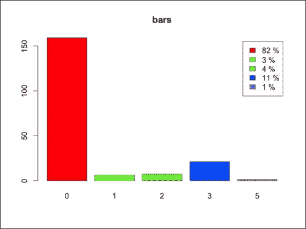
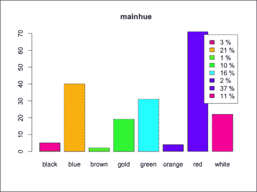
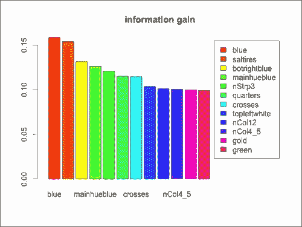

# 四、第一步——数据探索和特征工程

有不同种类的问题需要机器学习解决方案。例如，我们的目标可以是预测未来的结果或从数据中识别模式。起点是一组对象(例如，项目)或人(例如，超市的顾客)。在大多数情况下，机器学习技术从描述对象/人的一些特征开始识别解决方案。这些特征是数字和/或分类属性，它们是机器学习模型的基础。拥有正确的特征将提高模型的性能和准确性，因此定义一些与问题相关的特征是极其重要的。

在本章中，您将:

*   构建机器学习解决方案
*   构建特征数据
*   清理数据
*   探索已定义的功能
*   修改特征
*   使用过滤器对要素进行分级

# 构建机器学习解决方案

我们在机器学习解决方案的哪个阶段定义特征？让我们看一下构建解决方案的整个过程的概述。我们可以将该方法分为三个步骤:

1.  定义我们将使用的功能。
2.  运用一种或多种技巧来解决问题。
3.  评估结果并优化性能。

在第一步中，我们可以通过使用过滤器并选择最相关的特征来评估每个特征的相关性。我们还可以定义一些有利于描述数据的特征的组合。

在第二步中，当我们建立一个模型时，我们可以使用一些技术(嵌入式方法)对特征进行排序，并自动识别最相关的特征。

最后一步非常重要，因为我们有了更多的信息，允许我们识别更合适的特性集。例如，我们可以使用具有不同特性集的相同模型，并评估哪种特性组合性能更好。一种选择是使用一个包装器，该包装器包括用一组选定的特征构建一个模型，迭代地添加(或删除)一个特征，并且如果它提高了模型的准确性，则保留该改变。

总之，特征选择是一个循环而不是一个步骤，它发生在程序的每个部分。本章展示了特性工程过程，包括定义特性、转换特性和确定它们的等级。这些步骤是:

*   探索数据
*   定义/转换新功能
*   识别最相关的特征

虽然探索数据总是在开始，但所有的步骤都可以重复，直到我们找到满意的解决方案，所以它们并不总是遵循相同的顺序。例如，在识别出最相关的特征之后，我们可以探索数据，识别新的模式，并因此定义一些新的特征。

特性选择的过程与模型有关，在这一章中，我们确定了一些适用于许多模型的特性。

本章展示了一个标志的例子。基于一个国家的国旗，我们的目标是确定该国的语言。假设我们知道所有国家的国旗，并且只知道其中一些国家的语言，该模型将估计其他国家的语言。


# 构建特征数据

本节展示了我们如何构建原始数据来构建特性。每个国家的数据如下:

*   国旗的照片
*   一些地理数据，如洲、地理象限、区域和人口
*   该国的语言和宗教

目标是建立一个从国旗开始预测国家语言的模型。大多数模型可以处理数字和/或分类数据，所以我们不能使用旗帜的图像作为模型的特征。解决方案是定义一些描述每个旗帜的特征，例如颜色的数量。这样，我们从一个表开始，该表的行对应于国家，列对应于国旗特征。

基于图片建立带有标志属性的矩阵会花费很多时间。幸运的是，我们可以使用包含一些特征的数据集。我们拥有的数据仍然有点杂乱，所以我们需要清理和转换它，以*右格式*构建一个特征表。

数据集中包含的特征显示了以下信息:

*   旗帜上的颜色
*   旗帜上的图案
*   标志中的一些附加元素，如文本或一些星星
*   一些地理数据，如洲、地理象限、区域和人口
*   该国的语言和宗教

以正确的格式引导表格的步骤如下:

1.  从[https://archive . ics . UCI . edu/ml/machine-learning-databases/flags/](https://archive.ics.uci.edu/ml/machine-learning-databases/flags/)下载数据集及相关信息，并下载`flag.data`。
2.  打开 RStudio，将工作目录设置为包含数据的文件夹:

    ```
    setwd('path/containing/the/data')
    ```

3.  将数据加载到 R 环境:

    ```
    dfFlag <- read.csv('flag.data', header=FALSE)
    ```

现在，我们可以使用`str`看到`dfFlag`的结构:

```
str(dfFlag)
'data.frame':    194 obs. of  30 variables:
 $ V1 : Factor w/ 194 levels "Afghanistan",..: 1 2 3 4 5 6 7 8 9 10 ...
 $ V2 : int  5 3 4 6 3 4 1 1 2 2 ...
 $ V3 : int  1 1 1 3 1 2 4 4 3 3 ...
 $ V4 : int  648 29 2388 0 0 1247 0 0 2777 2777 ...
 $ V5 : int  16 3 20 0 0 7 0 0 28 28 ...
 $ V6 : int  10 6 8 1 6 10 1 1 2 2 ...
 $ V7 : int  2 6 2 1 0 5 1 1 0 0 ...
 $ V8 : int  0 0 2 0 3 0 0 0 0 0 ...
 $ V9 : int  3 0 0 0 0 2 1 1 3 3 ...
 $ V10: int  5 3 3 5 3 3 3 5 2 3 ...
 $ V11: int  1 1 1 1 1 1 0 1 0 0 ...
 $ V12: int  1 0 1 0 0 0 0 0 0 0 ...
 $ V13: int  0 0 0 1 1 0 1 1 1 1 ...
 $ V14: int  1 1 0 1 1 1 0 1 0 1 ...
 $ V15: int  1 0 1 1 0 0 1 1 1 1 ...
 $ V16: int  1 1 0 0 0 1 0 1 0 0 ...
 $ V17: int  0 0 0 1 0 0 1 0 0 0 ...
 $ V18: Factor w/ 8 levels "black","blue",..:5 7 5 2 4 7 8 7 2 2 ...
 $ V19: int  0 0 0 0 0 0 0 0 0 0 ...
 $ V20: int  0 0 0 0 0 0 0 0 0 0 ...
 $ V21: int  0 0 0 0 0 0 0 0 0 0 ...
 $ V22: int  0 0 0 0 0 0 0 0 0 0 ...
 $ V23: int  1 1 1 0 0 1 0 1 0 1 ...
 $ V24: int  0 0 1 0 0 0 0 0 0 0 ...
 $ V25: int  0 0 0 1 0 0 0 1 0 0 ...
 $ V26: int  1 0 0 1 0 1 0 0 0 0 ...
 $ V27: int  0 1 0 1 0 0 1 0 0 0 ...
 $ V28: int  0 0 0 0 0 0 0 0 0 0 ...
 $ V29: Factor w/ 7 levels "black","blue",..: 1 6 4 2 2 6 7 1 2 2 ...
 $ V30: Factor w/ 8 levels "black","blue",..: 5 7 8 7 7 1 2 7 2 2 ...

```

`dfFlag`对象包含 30 个未定义名称的列。我们有描述包含在`flag.description.txt`中的数据的文档，这允许我们定义列名。前七列包含一些与标志无关的属性。让我们开始定义一些包含特性名称的向量。第一列是国名。定义名称的步骤如下:

1.  定义国家名称:

    ```
    nameCountry <- 'name'
    ```

2.  定义三个地理特征的名称:`continent`、`zone`和`area` :

    ```
    namesGeography <- c('continent', 'zone', 'area')
    ```

3.  定义三个国家公民的姓名特征，包括他们的语言:

    ```
    namesDemography <- c('population', 'language', 'religion')
    ```

4.  定义一个惟一的向量，它包含按正确顺序排列的七个属性:

    ```
    namesAttributes <- c(nameCountry, namesGeography, namesDemography)
    ```

5.  定义定义`bars`、`stripes`、`colors` :

    ```
    namesNumbers <- c('bars', 'stripes', 'colors')
    ```

    号的特征名称
6.  对于某些颜色，如果标志包含颜色，有一个变量显示`1`，否则显示`0`。定义它们的名字:

    ```
    namesColors <- c('red', 'green', 'blue', 'gold', 'white', 'black', 'orange')
    ```

7.  定义主导色的名称:

    ```
    nameMainColor <- 'mainhue'
    ```

8.  定义属性的名称，该属性显示标志中包含多少图案/图形(例如，形状、图片或文本):

    ```
    namesDrawings <- c(   'circles', 'crosses', 'saltires', 'quarters',   'sunstars', 'crescent', 'triangle', 'icon', 'animate', 'text' )
    ```

9.  悬空:四个角中的两个中的颜色:

    ```
    namesAngles <- c('topleft', 'botright')
    ```

10.  定义按正确顺序包含所有名称的`namesFlag`:

    ```
    namesFlag <- c(namesNumbers, namesColors, nameMainColor, namesDrawings, namesAngles)
    ```

11.  设置绑定`namesAttributes`和`namesFlag`的`dfFlag`列名:

    ```
    names(dfFlag) <- c(namesAttributes, namesFlag)
    ```

现在，数据框有了正确的列名。然而，一些列，比如`language`包含数字而不是属性名，文档显示了数字代表什么。例如，对于语言，1 对应于英语，2 对应于西班牙语。我们可以使用以下步骤构建一个具有正确格式的数据的数据表:

1.  将`dfFlag`转换成`dtFlag`数据表:

    ```
    library(data.table) dtFlag <- data.table(dfFlag)
    ```

2.  显示`continent`栏:

    ```
    dtFlag[1:20, continent] [1] 5 3 4 6 3 4 1 1 2 2 6 3 1 5 5 1 3 1 4 1 
    ```

3.  `continent`栏包含一个介于`1`和`6`之间的数字，文档显示为`1=N.America`、`2=S.America`、`3=Europe`、`4=Africa`、`5=Asia`、`6=Oceania`。然后，我们定义一个包含大洲的向量:

    ```
    vectorContinents <- c('N.America', 'S.America', 'Europe', 'Africa', 'Asia', 'Oceania')
    ```

4.  将`continent`转换为`factor`，其级别为`vectorContinents` :

    ```
    dtFlag[, continent := factor(continent, labels=vectorContinents)]
    ```

5.  与`continent`类似，将`zone`转换为`factor` :

    ```
    vectorZones <- c('NE', 'SE', 'SW', 'NW') dtFlag[, zone := factor(zone, labels=vectorZones)]
    ```

6.  将`language`转换为`factor` :

    ```
    vectorLanguages <- c(   'English', 'Spanish', 'French', 'German', 'Slavic',   'Other Indo-European', 'Chinese', 'Arabic',   'Japanese/Turkish/Finnish/Magyar', 'Others')   dtFlag[, language := factor(language, labels=vectorLanguages)]
    ```

7.  将 `religion`转换为`factor` :

    ```
    vectorReligions <- c(   'Catholic', 'Other Christian', 'Muslim', 'Buddhist',   'Hindu', 'Ethnic', 'Marxist', 'Others' ) dtFlag[, religion := factor(religion, labels=vectorReligions)]
    ```

我们来看看`dtFlag`:

```
str(dtFlag)
Classes 'data.table' and 'data.frame':	194 obs. of  30 variables:
 $ name      : Factor w/ 194 levels "Afghanistan",..: 1 2 3 4 5 6 7 8 9 10 ...
 $ continent : int  5 3 4 6 3 4 1 1 2 2 ...
 $ zone      : Factor w/ 4 levels "NE","SE","SW",..: 1 1 1 3 1 2 4 4 3 3 ...
 $ area      : int  648 29 2388 0 0 1247 0 0 2777 2777 ...
 $ population: int  16 3 20 0 0 7 0 0 28 28 ...
 $ language  : int  10 6 8 1 6 10 1 1 2 2 ...
 $ religion  : int  2 6 2 1 0 5 1 1 0 0 ...
 $ bars      : int  0 0 2 0 3 0 0 0 0 0 ...
 $ stripes   : int  3 0 0 0 0 2 1 1 3 3 ...
 $ colors    : int  5 3 3 5 3 3 3 5 2 3 ...
 $ red       : int  1 1 1 1 1 1 0 1 0 0 ...
 $ green     : int  1 0 1 0 0 0 0 0 0 0 ...
 $ blue      : int  0 0 0 1 1 0 1 1 1 1 ...
 $ gold      : int  1 1 0 1 1 1 0 1 0 1 ...
 $ white     : int  1 0 1 1 0 0 1 1 1 1 ...
 $ black     : int  1 1 0 0 0 1 0 1 0 0 ...
 $ orange    : int  0 0 0 1 0 0 1 0 0 0 ...
 $ mainhue   : Factor w/ 8 levels "black","blue",..: 5 7 5 2 4 7 8 7 2 2 ...
 $ circles   : int  0 0 0 0 0 0 0 0 0 0 ...
 $ crosses   : int  0 0 0 0 0 0 0 0 0 0 ...
 $ saltires  : int  0 0 0 0 0 0 0 0 0 0 ...
 $ quarters  : int  0 0 0 0 0 0 0 0 0 0 ...
 $ sunstars  : int  1 1 1 0 0 1 0 1 0 1 ...
 $ crescent  : int  0 0 1 0 0 0 0 0 0 0 ...
 $ triangle  : int  0 0 0 1 0 0 0 1 0 0 ...
 $ icon      : int  1 0 0 1 0 1 0 0 0 0 ...
 $ animate   : int  0 1 0 1 0 0 1 0 0 0 ...
 $ text      : int  0 0 0 0 0 0 0 0 0 0 ...
 $ topleft   : Factor w/ 7 levels "black","blue",..: 1 6 4 2 2 6 7 1 2 2 ...
 $ botright  : Factor w/ 8 levels "black","blue",..: 5 7 8 7 7 1 2 7 2 2 ...
 - attr(*, ".internal.selfref")=<externalptr> 

```

数据格式正确。尽管我们必须正确地转换数据，但这仍然比手动定义特征花费更少的时间。


# 探索和可视化特征

在定义了特性之后，我们可以探索它们并确定它们与问题的关系。在本节中，您将看到如何浏览数据和定义一些简单的图表。

让我们从一个特性开始，例如，`mainhue`，它显示了旗帜的主色。我们想要识别最常见的主色，为此，我们可以使用`table`来计算每个可能值的出现次数。我们可以从`dtFlag`中提取`mainhue`列，并对其应用`table`:

```
table(dtFlag[, mainhue])
black   blue  brown   gold  green orange    red  white 
 5     40      2     19     31      4     71     22

```

三种最常见的主色是红色、蓝色和绿色。请注意，我们可以将`table`放在方括号内，用更干净的代码`dtFlag[, table(mainhue)]`获得相同的结果。

我们如何对任何其他列执行相同的操作呢？首先，让我们定义一个名为`nameCol`的字符串，它包含我们想要分析的列的名称。为了访问该列，我们可以在`dtFlag`的方括号内使用`get(nameCol)`:

```
nameCol <- 'mainhue'
dtFlag[, table(get(nameCol))]
```

这种符号非常有用，因为我们可以很容易地将它包含在使用名称字符串的函数中，可视化所有其他列的相同结果:

```
listTableCol = lapply(
  namesAngles, function(nameCol){
    dtFlag[, table(get(nameCol))]
  })
listTableCol[[1]]
 black   blue   gold  green orange    red  white 
 12     43      6     32      4     56     41 

```

如果我们想制作一个图表呢？我们可以使用`barplot`构建一个直方图。让我们首先提取每个频率值的表格:

```
nameCol <- 'language'
freqValues <- dtFlag[, table(get(nameCol))]
```

`freqValues` 方法包含列表中使用任意一种语言的国家的数量。我们可以使用`names`提取一个语言向量:

```
names(freqValues)
```

现在，我们有了构建直方图所需的所有数据(如果你没有读过[第 3 章](ch03.html "Chapter 3. A Simple Machine Learning Analysis")，*一个简单的机器学习分析*，请参见`barplot`的文档)。此外，我们可以使用`rainbow`定义颜色:

```
barplot(
  height = freqValues,
  names.arg = names(freqValues),
  main = nameCol,
  col = rainbow(length(freqValues)),
  ylab = 'number of flags'
)
```

获得的直方图如下:


如果我们想探究一个属性，这个图表非常有用。为了只用一行代码就做到这一点，我们可以定义一个函数，为一个通用列`nameCol`构建这个图表。另外，我们可以添加`legend`来显示百分比。为了显示`legend`，我们计算`percValues`，它包含显示该值的行的百分比，并将其用作`legend.text`参数，如下所示:

```
barplotAttribute <- function(dtData, nameCol)
{
  # define the frequency
  freqValues <- dtData[, table(get(nameCol))]
  # define the percentage
  percValues <- freqValues / sum(freqValues)
  percValues <- round(percValues * 100)
  percValues <- paste(percValues, '%')
  # generate the histogram
  barplot(
    height = freqValues,
    names.arg = names(freqValues),
    main = nameCol,
    col = rainbow(length(freqValues)),
    legend.text = percValues,
    ylab = 'number of flags'
  )
}
```

让我们将函数应用到另一列，例如`stripes`:

```
barplotAttribute(dtFlag, 'stripes')
```


使用一个`for`循环，我们可以为每个标志属性生成相同的图表。我们需要时间来查看每个图表和以下图表之间的结果，所以我们使用`readline`来停止程序。脚本暂停，直到我们在控制台中按下*回车*。这样，我们可以非常快速地浏览所有功能，如下所示:

```
for(nameCol in namesFlag)
{
  barplotAttribute(dtFlag, nameCol)
  readline()
}
```

通过这几行代码，我们观察到了每个特性的值出现的频率。

另一个快速探索是，给定一种颜色，计算包含该颜色的标志的数量。例如，让我们数一数有红色部分的旗帜。有一个名为`red`的属性，如果标志包含红色部分，其值为`1`，否则为`0`。如果我们对所有列值求和，我们将获得包含红色部分的标志总数，如下所示:

```
dtFlag[, sum(red)]
[1] 153
dtFlag[, sum(get('red'))]
[1] 153

```

正如我们之前看到的，我们可以在方括号内使用`get`。我们如何对所有常见的颜色进行同样的处理呢？`namesColors`向量包含所有颜色属性的名称，如下所示:

```
namesColors
[1] "red"    "green"  "blue"   "gold"   "white"  "black"  "orange"

```

`namesColors`的第一个元素是`red`，所以我们可以用它来计数包含红色的标志:

```
dtFlag[, sum(get(namesColors[1]))]
[1] 153

```

我们可以使用`sapply`(参见文档)对`namesColors`的每个元素应用一个函数。在这种情况下，该函数计算包含特定颜色的标志的数量:

```
sapply(namesColors, function(nameColor){
  dtFlag[, sum(get(nameColor))]
})
red  green   blue   gold  white  black orange 
153     91     99     91    146     52     26 

```

最常见的颜色是红色和绿色。

到目前为止，我们已经探索了旗帜的特征；下一步是看它们与这个国家的语言有什么关系。一个快速的方法是使用决策树(参见[第三章](ch03.html "Chapter 3. A Simple Machine Learning Analysis")、*一个简单的机器学习分析*)。

首先，让我们导入包来生成并可视化决策树:

```
library('rpart')
library('rpart.plot')
```

决策树模型需要一个定义变量之间关系的公式对象。这种情况下，公式为*语言~特征 1 +特征 2 + …* 。我们可以通过使用一个`for` 循环将`namesFlag`中包含的所有名称添加到中来构建公式，如下所示:

```
formulaRpart <- 'language ~ '
for(name in namesFlag){
  formulaRpart <- paste(formulaRpart, '+', name)
}
formulaRpart <- formula(formulaRpart)
```

我们可以使用`rpart`构建模型，使用`prp`可视化树:

```
tree <- rpart(formula=formulaRpart, data=dtFlag)
prp(tree)
```


树的一些节点看不清楚。例如，`saltires`如果旗帜有斜线，则显示`1`,否则显示`0`。第一个树节点表示 **saltires > = 0.5** 条件，因此左边的标志有一个 saltire。这反映了要素的格式不正确，因此下一步将是转换要素。

首先，让我们定义一个名为`dtFeatures`的新数据表，它包含特性和结果。从现在开始，我们将修改`dtFeatures`,直到所有的特征都是正确的格式，如图所示:

```
dtFeatures <- dtFlag[, c('language', namesFlag), with=FALSE]
```

让我们定义一个函数来可视化表格。我们将重用此函数来跟踪功能转换过程中的进度，如下所示:

```
plotTree <- function(dtFeatures){
  formulaRpart <- paste(names(dtFeatures)[1], '~')
  for(name in names(dtFeatures)[-1]){
    formulaRpart <- paste(formulaRpart, '+', name)
  }
  formulaRpart <- formula(formulaRpart)
  tree <- rpart(formula=formulaRpart, data=dtFeatures)
  prp(tree)
}
plotTree(dtFeatures)
```

图表和之前一模一样。

到目前为止，我们已经看到了一些探索特性的技术。数据探索允许我们研究数据的本质，这是清理当前特性和定义其他特性的起点。此外，我们已经构建了一些函数，这些函数允许我们只用一行代码就可以生成一些图表。我们可以使用这些函数来跟踪特征转换。


# 修改特征

我们的特征是描述旗帜的属性，其中一些可能格式不正确。在本节中，我们将了解每个特性，并在必要时对其进行转换。

为了跟踪我们已经处理过的特征，让我们开始定义一个空向量`namesProcessed`，它包含我们已经处理过的特征。当我们转换一个特征时，我们将特征名称添加到`namesProcessed`:

```
namesProcessed <- c()
```

让我们从数字列开始，比如`red`，它有两种可能的结果:`0`，如果标志包含红色，否则为`1`。`red`变量定义了一个属性，所以它应该是分类的而不是数字的。然后，我们可以将`red`转换成一个特征，如果颜色是红色，则为`yes`，否则为`no`。

如果我们看一下每个特性的图表，我们会注意到有些图表只显示两个值，它们总是`0`和`1`。为了将它们分别转换成`yes`和`no`格式，我们可以使用一个`for`循环。对于`namesFlag`中的每个特征，我们检查是否只有两个可能的值。如果是这样，我们将特征转换成因子。先说`red`:

```
nameFeat <- 'red'
```

我们可以检查`nameFeat`是否显示两个值:

```
length(unique(dtFeatures[, get(nameFeat)])) == 2
```

在这种情况下，答案是`TRUE`，因此我们可以生成一个向量，其中包含分别用于`0`和`1`的与`no`和`yes`相同的列。为此，我们使用`factor`，它指定标签为`no`和`yes`，如图所示:

```
vectorFactor <- dtFeatures[
  , factor(get(nameFeat), labels=c('no', 'yes'))
]
head(vectorFactor)
[1] yes yes yes yes yes yes
Levels: no yes

```

现在，我们可以使用一个`for`循环来转换每个显示两种可能结果的特征。对于每个特性，我们使用`if`检查它是否只有两个值。在我们生成`vectorFactor`之后，我们使用方括号内的`eval`覆盖旧列。做`dtFeatures[, eval('red') := vectorFactor]`和`dtFeatures[, red := vectorFactor]`一样，如下图所示:

```
for(nameFeat in namesFlag){
  if(length(unique(dtFeatures[, get(nameFeat)])) == 2){
    vectorFactor <- dtFeatures[
      , factor(get(nameFeat), labels=c('no', 'yes'))]
    dtFeatures[, eval(nameFeat) := vectorFactor]
    namesProcessed <- c(namesProcessed, nameFeat)
  }
}
```

再来看看我们还没有改造的功能。`namesFlag`特征包含所有初始特征，而`namesProcessed`包含我们已经转换的特征。为了可视化不在`namesProcessed`中的特征，我们可以使用`setdiff`，它是一个函数，给出在第一个向量中而不在第二个向量中的元素，如下所示:

```
setdiff(namesFlag, namesProcessed)
```

还有很多特征我们还没有分析。例如，`bars`是一个数字属性，显示标志中竖条的数量。如果我们使用`bars`作为数字特征，模型将识别语言和模型之间的关系。所有西班牙语国家的国旗都包含零个或三个竖条，因此 model 可以学习类似“只有当我们的竖条少于四个时，语言才能是西班牙语。”然而，没有一个西班牙语国家的国旗上有 1 或 2 个横杠。一种解决方案是根据条形的数量对国家/地区进行分组，如下所示:

```
barplotAttribute(dtFeatures, 'bars')
```



图表显示，具有大量标记的组是 **0** 和 **3** 条。因此，分组可以如下:

*   没有横条的旗帜
*   三格旗
*   所有其他的旗帜

我们可以定义一个名为`nBars0`的新列，如果旗帜没有竖线，它等于`TRUE`:

```
dtFeatures[, nBars0 := bars == 0]
```

同样，我们定义`nBars3`，对于有三个横条的标志来说就是`TRUE`。我们不需要定义带有剩余标志的列，因为通过检查`nBars0`和`nBars3`是否为`FALSE`已经可以识别出它们:

```
dtFeatures[, nBars1_2 := bars %in% c(1, 2)]
dtFeatures[, nBars3 := bars == 3]
```

让我们删除最初的`bars`列，并将`bars`添加到`namesProcessed`:

```
dtFeatures[, bars := NULL]
namesProcessed <- c(namesProcessed, 'bars')
```

我们执行的操作被称为**离散化**，因为我们从一个数字开始生成了一些离散特征。

同样，我们可以将转换为`stripes`和`colors`:

```
barplotAttribute(dtFeatures, 'stripes')
dtFeatures[, nStrp0 := stripes == 0]
dtFeatures[, nStrp2 := stripes == 2]
dtFeatures[, nStrp3 := stripes == 3]
dtFeatures[, nStrp5 := stripes == 5]
dtFeatures[, stripes := NULL]
namesProcessed <- c(namesProcessed, 'stripes')

barplotAttribute(dtFeatures, 'colors')
dtFeatures[, nCol12 := colors %in% c(1, 2)]
dtFeatures[, nCol3 := colors == 3]
dtFeatures[, nCol4_5 := colors %in% c(4, 5)]
dtFeatures[, colors := NULL]
namesProcessed <- c(namesProcessed, 'colors')
```

让我们来看看`namesDrawings`中包含的我们还没有处理的特性:

```
for(nameCol in setdiff(namesDrawings, namesProcessed)){
  barplotAttribute(dtFeatures, nameCol)
  readline()
}
```


在所有这些功能中，大多数标志显示`0`。因此，我们可以将标志分为两类:`0`和其余。我们正在定义一个新的分类变量，如果值大于`0`则为`yes`，否则为 `no`。该过程被称为**二进制化**，因为我们将一些数字特征转换为只显示两个值的分类特征，如下所示:

```
for(nameCol in setdiff(namesDrawings, namesProcessed)){
  dtFeatures[, eval(nameCol) := ifelse(get(nameCol) > 0, 'yes', 'no')]
  namesProcessed <- c(namesProcessed, nameCol)
}
```

让我们探索一下其余的特性，如下面的代码所示:

```
for(nameCol in setdiff(namesFlag, namesProcessed)){
  barplotAttribute(dtFeatures, nameCol)
  readline()
}
```

获得的图表如下:



剩下的三个特征是`topleft`、`botright`和`mainhue`。它们都是分类的，并显示两个以上的可能值。例如，`mainhue`有八个选项。然而，只有少数旗帜以`black`、`brown`或`orange`为主色调。我们没有足够的信息来考虑不太常见的颜色。在这种情况下，我们可以为它们定义一个名为`dummy variable`的新分类变量。我们可以决定用至少 15 个标志为每种可能的颜色定义一个虚拟变量。`topleft`和`botright`的情况与相似，所以我们可以用同样的方式对它们进行转换，如图所示:

```
namesToDummy <- c("topleft", "botright", "mainhue")
for(nameCol in namesToDummy){
  frequencyColors <- dtFeatures[, list(.N), by=nameCol]
  for(color in frequencyColors[N > 20, get(nameCol)]){
    nameFeatNew <- paste(nameCol, color, sep='')
    dtFeatures[, eval(nameFeatNew) := get(nameCol) == color]
  }
  dtFeatures[, eval(nameCol) := NULL]
  namesProcessed <- c(namesProcessed, nameCol)
}
```

现在，我们已经改造了所有的功能。然而，我们已经定义的一些新列属于`logical`类。最好将它们可视化为显示`yes`或`no`的分类属性，因此最好转换它们，如下所示:

```
for(nameCol in names(dtFeatures)){
  if(dtFeatures[, class(get(nameCol))] == 'logical'){
    print(nameCol)
    dtFeatures[, eval(nameCol) := ifelse(get(nameCol), 'yes', 'no')]
  }
}
```

让我们使用下面的代码来看看决策树是如何变化的:

```
plotTree(dtFeatures)
```

获得的图表如下:


决策树类似于前面的树。然而，决策树的每个节点都在检查一个条件，其结果是`yes`和`no`。

在本章中，我们已经看到了三种转换特性的方式:

*   **离散化**:从一个数字变量开始，我们将所有可能的值分组。然后，对于每个集合，我们定义一个新的变量，如果数值变量属于该集合，则显示`yes`，否则显示`no`。
*   **二进制化**:从一个数值变量开始，我们通过只定义两个集合来离散化一个数值变量。我们定义一个阈值，并检查变量是高于还是低于阈值。
*   **虚拟**:从分类变量开始，我们确定最常见的结果。然后，对于每个常见结果，我们定义一个新变量，如果变量等于值，则显示`yes`，否则显示`no`。


# 使用过滤器或维度缩减对特征进行排序

在前面的部分，我们定义了不同的特性。但是所有这些真的与问题相关吗？有一些被称为**嵌入式模型**的技术可以自动选择最相关的特性。我们还可以使用不同的功能集构建相同的机器学习模型，然后选择性能更好的功能集。这两种选择都不错，尽管它们需要大量的计算能力。

另一种方法是使用过滤器，这是一种识别最相关特征的技术。我们在应用任何机器学习模型之前使用过滤器，通过这种方式，我们削减了算法的大量计算成本。一些滤波器分别考虑每个特征，并且计算效率非常高。

一个简单的过滤器是**皮尔逊相关系数**，它是变量之间线性关系的一种度量。相关性是一个介于-1 和 1 之间的数字，这两个极值表达了两个变量之间清晰的线性关系。绘制图表时，所有点都在同一条线上。相关性为 0 表示两个变量之间没有线性相关性。相关系数越高，线性关系越强。在我们的例子中，我们可以测量每个标志属性和语言之间的相关性，并挑选相关性模块较高的属性。

另一种分别考虑每个特征的技术是信息增益比。让我们假设我们想要构建一个模型，而对旗帜一无所知。在这种情况下，我们能做的最好的事情就是确定最通用的语言，并假设每个国家都使用该语言。如果我们只知道哪些旗帜包含红色呢？模型肯定会比没有任何信息要好。好多少？特性的信息增益比是一个量化增加特性所带来的改进的指标。

相关性和信息增益比分别考虑每个特征，因此完全忽略了它们之间的相互作用。例如，我们可以有两个对语言有很大影响的特征，它们彼此之间有很强的相关性，以至于它们包含相同的信息。让我们假设我们已经在模型中包含了两个特性中的一个。添加另一个不会给提供任何进一步的信息，尽管它本身是高度相关的。如果两个特征之间的关系是线性的，我们就说**多重共线性**。

在其他情况下，我们有两个特性，如果分开来看有一点相关性，如果放在一起看会有很大的影响。如果我们使用这种过滤器对特征进行排序，我们会将它们都排除在外，从而丢失一些有用的信息。

对特征进行分级的替代方法是识别相关的特征组合。一种技术是**主** **成分分析** ( **PCA** )，它是基于特征之间的相关性。从特征开始，PCA 定义了一组称为主成分的变量，它们彼此线性独立。主成分的数量等于或小于特征的数量，并且通过方差对成分进行排序。然后，可以选择具有高方差的组件子集。然而，PCA 有局限性，因为它仅基于线性关系，并且它不考虑预测事物的属性(在我们的例子中是语言)。

有不同的技术，我们在本章中使用的是**信息增益比**，因为它简单而有意义。r 为我们提供了`FSelector` 包，其中包含了用于特性选择的不同工具。该软件包要求您在计算机上安装 JRE，如下所示:

```
install.packages('FSelector')
library('FSelector')
```

让我们构建包含所有特性名称的`namesFeatures`向量。然后，我们可以使用`information.gain`函数计算它们的信息增益比，如图所示:

```
namesFeatures <- names(dtFeatures)[-1]
dfGains <- information.gain(language~., dtFeatures)
```

`dfGains` 方法是一个带有名为`attr_importance`的字段的数据帧。特性名是行名，所以让我们添加另一个包含名的列:

```
dfGains$feature <- row.names(dfGains)
```

让我们将数据框转换成数据表:

```
dtGains <- data.table(dfGains)
```

为了查看最相关的功能，我们可以按相关性对它们进行排序:

```
dtGains <- dtGains[order(attr_importance, decreasing = T)]
 head(dtGains)
 attr_importance      feature
1:       0.1583055         blue
2:       0.1537296     saltires
3:       0.1313155 botrightblue
4:       0.1262545  mainhueblue
5:       0.1205012       nStrp3
6:       0.1149405     quarters

```

`blue`和`saltires`特性定义了非常相关的属性。为了直观显示最相关的特性，我们可以构建一个包含前 12 个属性的图表，如下所示:

```
dtGainsTop <- dtGains[1:12]
barplot(
  height = dtGainsTop[, attr_importance],
  names.arg = dtGainsTop[, feature],
  main = 'information gain',
  col = rainbow(nrow(dtGainsTop)),
  legend.text = dtGainsTop[, feature],
  xlim=c(0, 20)
)
```

获得的直方图如下:



既然我们已经定义了特性排名，我们就能够从最相关的特性中构建一个模型。我们可以包括所有相关性高于所选阈值的特征，或者从顶部开始挑选定义的个特征。然而，我们仍然没有考虑到特征之间的相互作用。例如，在顶级特性中，我们的有`the flag contains the blue`、`blue is the main color`和`the bottom right is blue`。虽然都很相关，但都是关于`blue`的，所以是多余的，我们可以排除其中一个。

总之，过滤器是对特征进行分级的快速且有用的方法，但是我们在构建模型时必须非常小心地使用它们。


# 总结

在本章中，您学习了如何执行特征选择。在加载并研究了特性之后，您看到了如何使用离散化和二进制化来转换它们。您还将类别特征转换为虚拟变量。您理解了特性选择的重要性，并使用信息增益率对特性进行了排序。在下一章，我们将使用机器学习技术来预测语言。