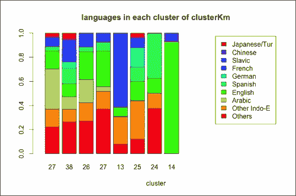
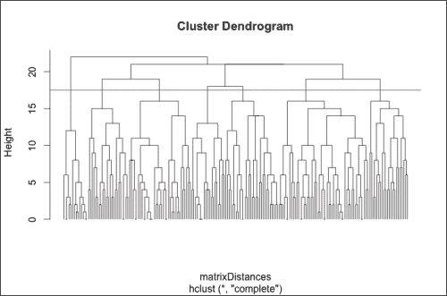
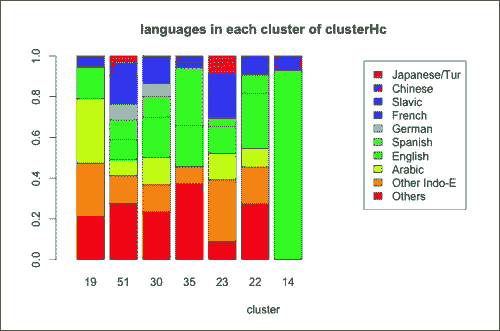
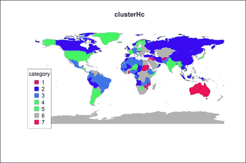
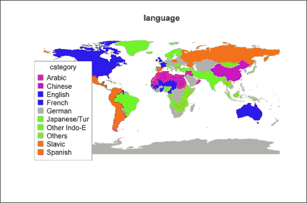
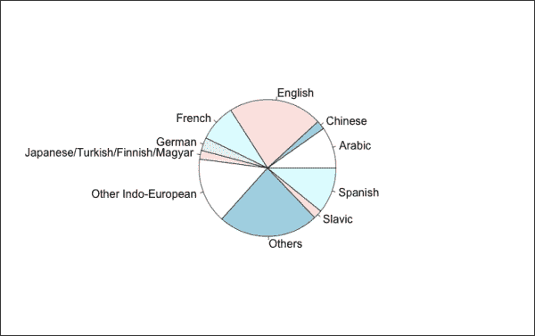
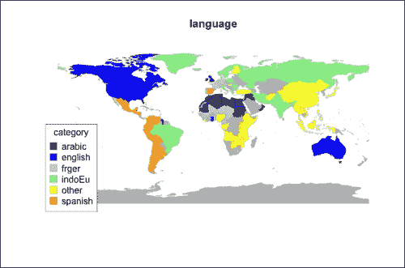
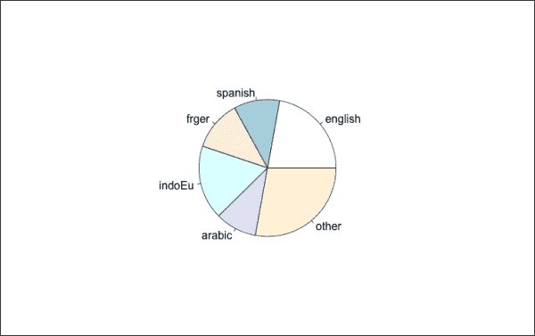

# 五、第二步——应用机器学习技术

本章重点介绍机器学习算法的应用，这是开发解决方案的核心。有不同类型的从数据中学习的技术。根据我们的目标，我们可以使用数据来识别对象之间的相似性或估计新对象的属性。

为了展示机器学习技术，我们从上一章处理的标志数据开始。然而，阅读本章并不要求你了解前面的内容，尽管建议你了解数据的来源。

在本章中，您将学习:

*   识别同类项目组
*   浏览并可视化项目组
*   评估一种新的国家语言
*   设置机器学习技术的配置

# 鉴别同类的一组物品

我们的数据描述了每个国家的国旗。有没有办法识别国旗属性相似的国家群体？我们可以使用一些聚类技术，这些技术是使用数据定义同质聚类的机器学习算法。

在上一章中，从标志属性开始，我们构建了一个特性表，并将其存储到`dtFeatures.txt`文件中。为了将文件加载到 R 中，第一步是使用`setwd`定义包含文件的目录。然后，我们可以使用`read.table`将文件加载到`dfFeatures`数据框中，并将其转换为`dtFeatures`数据表，如图所示:

```r
# load the flag features
setwd('<INSER YOUR DIRECTORY/PATH>")
dfFeatures <- read.table(file = 'dtFeatures.txt')
library("data.table")
dtFeatures <- data.table(dfFeatures)
```

让我们看看使用`str`的数据，类似于前面的章节:

```r
# explore the features
str(dtFeatures)
Classes 'data.table' and 'data.frame':	194 obs. of  38 variables:
 $ language     : Factor w/ 10 levels "Arabic","Chinese",..: 8 7 1 3 7 8 3 3 10 10 ...
 $ red          : Factor w/ 2 levels "no","yes": 2 2 2 2 2 2 1 2 1 1 ...
 $ green        : Factor w/ 2 levels "no","yes": 2 1 2 1 1 1 1 1 1 1 ...
 $ blue         : Factor w/ 2 levels "no","yes": 1 1 1 2 2 1 2 2 2 2 ...

```

语言列是一个因子，有 10 种语言，称为因子的`levels`。所有其他列包含描述标志的特征，它们是具有两个级别的因子:`yes`和`no`。其特点如下:

*   如果标志包含颜色，则`colors`特征(例如`red`)有一个`yes`级别
*   如果标志包含模式，则`patterns`特征(例如`circle`)有一个`yes`级别
*   如果标志有 3 个横条，后跟数字的`nBars` / `nStrp` / `nCol`特征(例如`nBars3`)有一个`yes`级别
*   如果左上部分是蓝色的，后跟颜色的`topleft` / `botright` / `mainhue`特征(例如`topleftblue`)具有一个`yes`级别

## 使用 k-均值识别组

我们的目标是识别相似的标志组。为了这个的目的，我们可以开始使用一个基本的聚类算法，即 **k-means** 。

k-means 目标是识别 *k* (例如，八个)同类标志簇。想象一下把所有的旗帜分成八组。其中一个包括 10 面旗帜，其中 7 面包含红色。假设我们有一个`red`属性，如果标志包含红色则为`1`，否则为`0`。我们可以说这个集群的`average flag`包含`red`的概率为 70%，所以它的`red`属性为 0.7。对每个其他属性做同样的事情，我们可以定义`average flag`，它的属性是组内的平均值。每个聚类都有一个平均标志，我们可以使用相同的方法来确定。

k-means 算法基于一个称为聚类中心的平均对象。在开始时，该算法将标记分成 8 个随机组，并确定它们的 8 个中心。然后，k-means 将每个标志重新分配给中心最相似的组。这样，聚类更加均匀，并且算法可以重新计算它们的中心。经过几次迭代后，我们有 8 个包含同类标志的组。

k 均值算法是一种非常流行的技术，R 为我们提供了`kmeans`函数。为了使用它，我们可以看看它的帮助:

```r
# K-MEANS
# see the function documentation
help(kmeans)
```

我们需要两个输入:

*   `x`:数字数据矩阵
*   `centers`:聚类数(或聚类中心开始)

从`dtFeatures`开始，我们需要建立一个数字特征矩阵`dtFeaturesKm`。首先，我们可以将特征名称放入`arrayFeatures`并生成包含所有特征的`dtFeaturesKm`数据表。执行以下步骤:

1.  定义`arrayFeatures`，它是一个包含特征名称的向量。`dtFeatures`方法包含第一列中的属性和其他列中的特性，所以我们提取除第一列之外的所有列名:

    ```r
    arrayFeatures <- names(dtFeatures)[-1]
    ```

2.  定义`dtFeaturesKm`包含的特性:

    ```r
    dtFeaturesKm <- dtFeatures[, arrayFeatures, with=F]
    ```

3.  将通用列(例如，`red`)转换为数字格式。我们可以使用`as.numeric`将列格式从 factor 转换为 numeric:

    ```r
    dtFeaturesKm[, as.numeric(red)]
    ```

4.  The new vector contains `1` if the value is `no` and `2` if the value is `yes`. In order to use the same standards as our k-means descriptions, we prefer to have `0` if the attribute is `no` and `1` if the attribute is `yes`. In this way, when we are computing the average attribute within a group, it will be a number between 0 and 1 that can be seen as a portion of flags whose attribute is `yes`. Then, in order to have 0 and 1, we can use `as.numeric(red) – 1`:

    ```r
    dtFeaturesKm[, as.numeric(red) - 1]
    ```

    或者，我们也可以使用 ifelse 函数做同样的事情。

5.  我们需要将每个列的格式转换为 0-1。`arrayFeatures`数据表包含所有特性的名称，我们可以使用`for`循环来处理每个特性。如果我们想要转换名称包含在`nameCol`中的列，我们需要使用`eval` - `get`符号。使用`eval(nameCol) :=`我们重新定义列，使用`get(nameCol)`我们使用列的当前值，如下所示:

    ```r
    for(nameCol in arrayFeatures)   dtFeaturesKm[     , eval(nameCol) := as.numeric(get(nameCol)) - 1     ]
    ```

6.  现在转换 0-1 格式的所有特征。我们来形象化一下:

    ```r
    View(dtFeaturesKm)
    ```

7.  `kmeans`功能要求数据为矩阵形式。为了将`dtFeaturesKm`转换成矩阵，我们可以使用`as.matrix` :

    ```r
    matrixFeatures <- as.matrix(dtFeaturesKm)
    ```

`matrixFeatures`数据表包含构建 k 均值算法的数据，其他`kmeans`输入是参数。k-means 算法不会自动检测聚类数，所以我们需要通过`centers`输入来指定。给定一组对象，我们可以从中识别任意数量的集群。最能反映数据的数字是哪个？有一些技术允许我们定义它，但是它们超出了本章的范围。我们可以只定义一个合理的中心数，例如 8:

```r
# cluster the data using the k-means
nCenters <- 8
modelKm <- kmeans(
  x = matrixFeatures,
  centers = nCenters
  )
```

`modelKm`功能是包含不同模型组件的列表。`kmeans`的帮助为我们提供了输出的详细描述，我们可以使用`names`来获得元素名称。让我们看看组件:

```r
names(modelKm)
[1] "cluster"      "centers"      "totss"        "withinss" 
[5] "tot.withinss" "betweenss"    "size"         "iter" 
[9] "ifault" 

```

我们可以看到包含在`centers`中的聚类中心，如图所示:

```r
View(modelKm$centers)
```

每行定义一个中心，每列显示一个属性。所有的属性都在 0 和 1 之间，它们表示群集中属性等于`1`的标志的百分比。例如，如果`red`是`0.5`，这意味着一半的标志包含红色。

我们将使用的元素是`cluster`，它包含一个指定每个标志的集群的标签。对于实例，如果一个簇的第一个元素是`3`，这个意味着`matrixFeatures`(以及`dtFeatures`)中的第一个标志属于第三个簇。

### 探索星团

我们可以查看每个集群，以探索其标志。为了让做到这一点，我们可以通过定义`clusterKm`列将集群添加到初始表中，如下所示:

```r
# add the cluster to the data table
dtFeatures[, clusterKm := modelKm$cluster]
```

为了探索一个集群，我们可以确定有多少国家讲每种语言。从`dtFeatures`开始，我们可以使用数据表聚合来汇总每个集群的数据。首先，让我们定义包含分类的列:

```r
# aggregate the data by cluster
nameCluster <- 'clusterKm'
```

我们想确定每个集群中有多少行。允许我们确定行数的数据表命令是`.N`，如下图所示:

```r
dtFeatures[, list(.N), by=nameCluster]
```

如果我们想为集群大小指定不同的列名，可以在列表中指定，如下所示:

```r
dtFeatures[, list(nCountries=.N), by=nameCluster]
```

为了确定每种语言有多少个国家，我们可以使用`table`:

```r
dtFeatures[, table(language)]
```

为了在聚合中使用`table`，输出应该是一个列表。为此，我们可以使用`as.list`转换表格，如下所示:

```r
dtFeatures[, as.list(table(language))]
```

现在，我们可以使用`by`将该操作应用于每个组，如图所示:

```r
dtFeatures[, as.list(table(language)), by=nameCluster]
```

如果我们想要可视化说每种语言的国家的百分比呢？我们可以将表中的每个值除以集群中国家的数量，如下所示:

```r
dtFeatures[, as.list(table(language) / .N), by=nameCluster]
```

我们希望生成包含每个组中的国家数量和每种语言的百分比的`dtClusters`。为此，我们可以使用刚才看到的命令生成两个列表。为了合并这两个列表，我们可以使用`c(list1, list2)`，如图所示:

```r
dtClusters <- dtFeatures[
  , c(list(nCountries=.N), as.list(table(language) / .N)),
  by=nameCluster
  ]
```

每一排`dtClusters`代表一个集群。`nCountries`列显示集群中国家的数量，所有其他列显示每种语言的百分比。为了直观地显示这些数据，我们可以为每个聚类构建一个直方图。每个条形被分成若干段，代表说每种语言的国家的数量。如果我们给出一个矩阵作为输入，那么`barplot`函数允许我们构建想要的图表。每个矩阵列对应一个条，每行定义条被划分的块。

我们需要定义一个包含语言百分比的矩阵。这可以通过执行以下步骤来完成:

1.  定义`arrayLanguages`包含`dtClusters`语言的栏目名称:

    ```r
    arrayLanguages <- dtFeatures[, unique(language)]
    ```

2.  构建`dtBarplot`包含的语言列:

    ```r
    dtBarplot <- dtClusters[, arrayLanguages, with=F]
    ```

3.  使用`as.matrix`将`dtBarplot`转换成矩阵。为了构建图表，我们需要使用 R 函数`t` :

    ```r
    matrixBarplot <- t(as.matrix(dtBarplot))
    ```

    转置矩阵(反转行和列)
4.  用聚类大小定义一个向量，即国家的数量。我们将在列下显示数字:

    ```r
    nBarplot <- dtClusters[, nCountries]
    ```

5.  将图例名称定义为国家名称:

    ```r
    namesLegend <- names(dtBarplot)
    ```

6.  缩短图例名称的长度，以避免图例与图表重叠。使用`substring`，我们将名称限制为 12 个字符，如下所示:

    ```r
    help(substring) namesLegend <- substring(namesLegend, 1, 12)
    ```

7.  使用`rainbow`定义颜色。我们需要为`namesLegend`的每个元素定义一种颜色，所以颜色的个数是`length(namesLegend)`，如图:

    ```r
    arrayColors <- rainbow(length(namesLegend))
    ```

8.  使用`paste` :

    ```r
    plotTitle <- paste('languages in each cluster of', nameCluster)
    ```

    定义图表标题

现在我们拥有了所有的`barplot`输入，所以我们可以构建图表了。为了确保图例不会与条形重叠，我们包含了指定绘图边界的`xlim`参数，如下所示:

```r
# build the histogram
barplot(
  height = matrixBarplot,
  names.arg = nBarplot,
  col = arrayColors,
  legend.text = namesLegend,
  xlim = c(0, ncol(matrixBarplot) * 2),
  main = plotTitle,
  xlab = 'cluster'
)
```

获得的图表如下:



k-means 算法从随机分割数据定义的初始聚类开始执行一系列步骤。最终的输出取决于初始的随机分割，每次运行算法时，初始的随机分割都是不同的。因此，如果我们多次运行 k-means，我们可能会获得不同的结果。然而，这个图表有助于我们识别语言群中的一些模式。例如，在第八组中，几乎所有的国家都讲英语，所以我们可以推断，有一些讲英语的国家也有类似的国旗。在第五组中，超过一半的国家说法语，所以我们可以推断出同样的情况。一些不太相关的结果是，阿拉伯语在第一个聚类中占有很高的份额，而西班牙语在第七个聚类中相当相关。

我们正在使用其他聚类算法，我们将以类似的方式可视化结果。为了有干净紧凑的代码，我们可以定义`plotCluster`函数。输入是`dtFeatures`特征数据表和`nameCluster`集群列名。代码与前面的代码几乎相同，如下所示:

```r
# define a function to build the histogram
plotCluster <- function(
  dtFeatures, # data table with the features
  nameCluster # name of the column defining the cluster
){
  # aggregate the data by cluster
  dtClusters <- dtFeatures[
    , c(list(nCountries=.N), as.list(table(language) / .N)),
    by=nameCluster]

  # prepare the histogram inputs
  arrayLanguages <- dtFeatures[, unique(language)]
  dtBarplot <- dtClusters[, arrayLanguages, with=F]
  matrixBarplot <- t(as.matrix(dtBarplot))
  nBarplot <- dtClusters[, nCountries]
  namesLegend <- names(dtBarplot)
  namesLegend <- substring(namesLegend, 1, 12)
  arrayColors <- rainbow(length(namesLegend))

  # build the histogram
  barplot(
    height = matrixBarplot,
    names.arg = nBarplot,
    col = arrayColors,
    legend.text = namesLegend,
    xlim=c(0, ncol(matrixBarplot) * 2),
    main = paste('languages in each cluster of', nameCluster),
    xlab = 'cluster'
  )

}
```

这个函数应该构建与前一个相同的直方图。让我们使用下面的代码来检查它:

```r
# visualize the histogram using the functions
plotCluster(dtFeatures, nameCluster)
```

另一种可视化集群的方法是为每个集群使用不同的颜色构建一个世界地图。在之外，我们可以为这些语言可视化一个世界地图。

为了构建地图，我们需要安装并加载`rworldmap`包，如下所示:

```r
# define a function for visualizing the world map
install.packages('rworldmap')
library(rworldmap)
```

这个包从国家名开始构建一个世界地图，在我们的例子中就是从第`dfFeatures`行名开始。我们可以将`country`列添加到`dtFeatures`中，如图所示:

```r
dtFeatures[, country := rownames(dfFeatures)]
```

我们的数据很旧，所以德国仍然分为两部分。为了在地图上形象化，我们可以把`Germany-FRG`转换成`Germany`。同样，我们可以将`USSR`转换成`Russia`，如图所示:

```r
dtFeatures[country == 'Germany-FRG', country := 'Germany']
dtFeatures[country == 'USSR', country := 'Russia']
```

现在，我们可以定义一个函数来构建一个显示集群的世界地图。输入是要可视化的特征的`dtFeatures`数据表和`colPlot`列名(例如，`clusterKm`)。另一个参数是`colourPalette`，它决定了在地图中使用的颜色。更多信息参见`help(mapCountryData)`，如图所示:

```r
plotMap <- function(
  dtFeatures, # data table with the countries
  colPlot # feature to visualize
  colourPalette = 'negpos8' # colors
){
  # function for visualizing a feature on the world map
```

我们定义包含要可视化的集群的`colPlot`列。对于字符串，我们只使用前 12 个字符，如下所示:

```r
  # define the column to plot
  dtFeatures[, colPlot := NULL]
  dtFeatures[, colPlot := substring(get(colPlot), 1, 12)]
```

我们构建包含构建图表所需数据的`mapFeatures`。更多信息见`help(joinCountryData2Map)`。`joinCode = 'NAME'`输入指定国家由它们的名称而不是缩写来定义。`nameJoinColumn`指定我们在哪个列中有国家名称，如下所示:

```r
  # prepare the data to plot
  mapFeatures <- joinCountryData2Map(
    dtFeatures[, c('country', 'colPlot'), with=F],
    joinCode = 'NAME',
    nameJoinColumn = 'country'
  )
```

我们可以使用`mapCountryData`构建图表。我们指定使用彩虹的颜色，缺少数据的国家将是灰色的，如下面的代码所示:

```r
  # build the chart
  mapCountryData(
    mapFeatures,
    nameColumnToPlot='colPlot',
    catMethod = 'categorical',
    colourPalette = colourPalette,
    missingCountryCol = 'gray',
    mapTitle = colPlot
  )

}
```

现在，我们可以使用 `plotMap`在世界地图上可视化 k 均值聚类，如图所示:

```r
plotMap(dtFeatures, colPlot = 'clusterKm')
```


我们可以看到许多亚洲国家属于第五类。此外，我们可以观察到，意大利，法国和爱尔兰属于同一个集群，因为他们的国旗是相似的。除此之外，很难找出任何其他模式。

## 识别集群的层次结构

其他识别同类群体的技术是层次聚类算法。这些技术构建集群，迭代地合并对象。开始时，每个国家都有一个集群。我们定义了两个聚类有多相似的度量，在每一步，我们识别其标志最相似的两个聚类，并将它们合并成一个唯一的聚类。最后，我们得到了一个包含所有国家的集群。

执行分层聚类的 R 函数是`hclust`。我们来看看它的`help`功能:

```r
# HIERARCHIC CLUSTERING
# function for hierarchic clustering
help(hclust)
```

第一个输入是`d`，文档解释说它是一个相异结构，即包含所有对象之间距离的矩阵。正如文档所建议的，我们可以使用`dist`函数来构建输入，如下所示:

```r
# build the distance matrix
help(dist)
```

`dist`的输入是描述标志的数字矩阵。我们已经为 k-means 算法构建了`matrixDistances`，所以我们可以重用它。另一个相关输入是`method`，它指定`dist`如何测量两个旗帜之间的距离。我们应该使用哪种方法？所有的特征都是二元的，因为它们有两种可能的结果，即`0`和`1`。那么，距离可以是具有不同值的属性的数量。这样决定距离的`method`对象是`manhattan`，如图:

```r
matrixDistances <- dist(matrixFeatures, method = 'manhattan')
```

`matrixDistances`函数包含任意两个标志之间的差异。另一个输入是`method`，它指定了聚集方法。在我们的例子中，我们将方法设置为`complete`。还有其他选项用于`method`和它们定义了链接，即计算集群间距离的方式，如图所示:

```r
# build the hierarchic clustering model
modelHc <- hclust(d = matrixDistances, method = 'complete')
```

`modelHc`方法包含聚类模型，我们可以使用`plot`来可视化聚类。您可以参考`hclust`的帮助来了解`plot`的参数，如图所示:

```r
# visualize the hierarchic clustering model
plot(modelHc, labels = FALSE, hang = -1)
```



这个图表显示了算法程序。在底部，我们有所有的国家，每个国旗属于不同的集群。每条线代表一个聚类，当算法合并聚类时，这些线会聚。在图表的左侧，您可以看到一个代表标志之间距离的刻度，在每个级别上，该算法会合并彼此相距特定距离的分类。在顶部，所有标志属于同一个群。这张图叫做**树状图**。考虑下面的代码:

```r
# define the clusters
heightCut <- 17.5
abline(h=heightCut, col='red')
```

我们要识别的集群是红线以上的集群。标识从`modelHc`开始的簇的函数是`cutree`，我们可以在`h`参数中指定水平线高度，如下图所示:

```r
cutree(modelHc, h = heightCut)
```

现在，我们可以将集群添加到`dtFeatures`，如图所示:

```r
dcFeatures[, clusterHc := cutree(modelHc, h = heightCut)]
```

如前所述，我们可以看到每个集群中使用哪些语言。我们可以重用`plotCluster`和`plotMap`:

```r
# visualize the clusters
plotCluster(dtFeatures, nameCluster = 'clusterHc')
```



在第八组中，英语是主要语言。除此之外，阿拉伯语只与第一组相关，法语和德语与第二组和第三组相关，西班牙语与第三组相关。

我们也可以用集群来可视化世界地图，如下所示:

```r
plotMap(dtFeatures, colPlot = 'clusterHc')
```

获得的图表如下:



与 k-means 相似，唯一一个有显著聚类的大陆是亚洲。

本节描述了两种流行的聚类技术，用于识别同质标志簇。它们都允许我们了解不同旗帜之间的相似之处，我们可以使用这些信息作为支持来解决一些问题。


# 应用 k-最近邻算法

本节将向您展示如何从一个新国家的国旗开始评估该国家的语言，使用一种简单的监督学习技术，即 **k 近邻** ( **KNN** )。在这种情况下，我们估计语言，这是一个`categoric`属性，所以我们使用分类技术。如果属性是数字，我们将使用回归技术。我选择 KNN 的原因是它易于解释，并且有一些选项可以修改它的参数以提高结果的准确性。

让我们看看 KNN 是如何工作的。我们知道 150 个国家的国旗和语言，我们想从国旗开始确定一个新国家的语言。首先，我们找出 10 个国旗与新国旗最相似的国家。其中，我们有六个西班牙语国家、两个英语国家、一个法语国家和一个阿拉伯语国家。

在这 10 个国家中，最通用的语言是西班牙语，因此我们可以预计新国旗属于一个说西班牙语的国家。

KNN 就是基于这种方法。为了评估一种新的国家语言，我们确定了国旗最相似的 K 个国家。然后，我们估计新国家说的是其中最通用的语言。

我们有一个表格，通过 37 个二进制属性描述了 194 个标志，它们的值可以是`Yes`或`No`。例如，如果主要的旗帜颜色是绿色，则`mainhuegreen`属性是`yes`，否则是`no`。所有属性都描述了旗帜的颜色和图案。

与上一节类似，在修改`dtFeatures`之前，我们定义了包含特性名称的`arrayFeatures`。当我们向`dtFeatures`添加一些列时，我们从`dfFeatures`中提取特征名称。然后，我们添加来自`dfFeatures`的国家名称的`country`列，如下所示:

```r
# define the feature names
arrayFeatures <- names(dfFeatures)[-1]
# add the country to dtFeatures
dtFeatures[, country := rownames(dfFeatures)]
dtFeatures[country == 'Germany-FRG', country := 'Germany']
dtFeatures[country == 'USSR', country := 'Russia']
```

从`dtFeatures`开始，我们可以应用 KNN。给定一个新的标志，我们如何确定哪 10 个是最相似的标志？给定任意两个标志，我们可以测量它们有多相似。最简单的方法是计算两个标志中有多少要素具有相同的值。他们共同的属性越多，他们就越相似。

在前一章中，我们已经探索并转换了特性，所以我们不需要处理它们。然而，我们还没有探索语言栏。对于每种语言，我们可以使用`table`来确定有多少个国家使用该语言，如下所示:

```r
dtFeatures[, table(language)]
```

不同语言的国家数量差异很大。最受欢迎的语言是`English`，有 43 个国家，还有一些语言只有 4 个国家。为了对所有语言有一个总体的了解，我们可以通过构建一个图表来可视化这个表。在上一节中，我们定义了`plotMap`，它显示了世界地图上的群体。我们可以用它来显示说每种语言的国家，如下所示:

```r
plotMap(dtFeatures, colPlot = 'language', colourPalette = 'rainbow')
```

获得的图表如下:



很高兴看到地图显示说每种语言的国家，但仍然有点难以理解这些群体有多大。一个更好的选择是生成一个饼状图，其切片与每组国家的数量成比例。R 功能是`pie`，如图所示:

```r
# visualize the languages
help(pie)
```

`pie`函数需要一个输入，即一个包含使用每种语言的国家数量的矢量。如果输入向量字段有名称，它将显示在图表中。我们可以使用`table`构建所需的向量，如下所示:

```r
arrayTable <- dtFeatures[, table(language)]
```

幸运的是，`pie`不需要任何其他论证:

```r
pie(arrayTable)
```

获得的图表如下:



有些语言只在少数几个国家使用。例如，只有 4 个斯拉夫国家。给定一个新的国家，我们希望从它的国旗开始确定它的语言。让我们假设我们不知道在四个斯拉夫国家中的一个国家说的是哪种语言。如果我们考虑到它的 10 个最近的邻居，那么不超过 3 个斯拉夫国家。如果它的 10 个邻国中有 4 个说英语的国家会怎样？尽管所有其余的斯拉夫国家都在它的附近，但是有更多的英语国家，仅仅是因为英语群体更大。所以算法会估计国家是英国。同样，我们与任何其他小团体都有同样的问题。像几乎所有的机器学习算法一样，KNN 无法对属于任何其他更小群体的国家进行分类。

在处理任何分类问题时，如果有些群体很小，我们就没有足够的相关信息。在这种情况下，即使是好的技术也无法对属于一个小组的新对象进行分类。此外，假设一个新的国家属于中等规模的集团，它可能有许多属于大集团的邻国。因此，讲这些语言之一的新国家可能被分配到大的组。

通过了解模型的局限性，我们可以定义一个可行的机器学习问题。为了避免出现小团体，我们可以合并一些团体。聚类技术允许我们识别哪些语言组定义更明确，并且相应地，我们可以将语言分成这些组:`English`、`Spanish`、`French and German`、`Slavic and other Indo-European`、`Arabic`和`Other`。

我们可以定义语言组来构建`listGroups`,它的元素包含组所讲的语言。例如，我们可以定义包含`Slavic`和`Other Indo-European`语言的`indoEu`组，如下所示:

```r
# reduce the number of groups
listGroups <- list(
  english = 'English',
  spanish = 'Spanish',
  frger = c('French', 'German'),
  indoEu = c('Slavic', 'Other Indo-European'),
  arabic = 'Arabic',
  other = c(
    'Japanese/Turkish/Finnish/Magyar', 'Chinese', 'Others'
    )
  )
```

现在，我们可以重新定义包含语言组的`language`列。对于`listGroups`的每个元素，我们将所有语言转换成元素名。例如，我们将`Slavic`和`Other Indo-European`转换成`indoEu`。

我们可以在`for`循环中执行这个操作。所有的组名都包含在列表名中，所以我们可以迭代`names(listGroups)`的元素，如下所示:

```r
for(nameGroup in names(listGroups)){
```

这里，`nameGroup`定义一个组名，`listGroups[[nameGroup]]`包含它的语言。我们可以使用`language %in% listGroups[[nameGroup]]`来提取说任何一种群体语言的`dtFeatures`的行。然后，我们可以使用`:=`数据表符号将 language 列重新分配给`nameGroup`组名，如下所示:

```r
  dtFeatures[
    language %in% listGroups[[nameGroup]],
    language := nameGroup
    ]
}
```

我们重新定义了分组语言的`language`列。让我们来看看:

```r
dtFeatures[, language]
```

这里，`language`是一个因素，只有六个可能的级别是我们的语言组。不过可以看到 R 在控制台里印了`16 Levels: Arabic Chinese English French ... Other`。原因是`language`列的格式是`factor`，它记录了 10 个初始值。为了只显示六个语言组，我们可以使用`factor`重新定义`language`列，如下所示:

```r
dtFeatures[, language := factor(language)]
dtFeatures[, language]
```

现在我们只有六层。正如我们之前所做的，我们可以使用`plotMap`可视化组大小数据，如下所示:

```r
# visualize the language groups
plotMap(dtFeatures, colPlot = 'language')
```

得到的地图如下:



我们可以看到，每个类别的国家在地理上彼此接近。

为了直观显示新的组大小，我们可以使用`pie`，如图所示:

```r
pie(dtFeatures[, table(language)])
```

获得的图表如下:



所有六个组包含足够多的国家。**英语**和**其他**组比其他组大一点，但规模相当。

现在我们可以建立 KNN 模型了。r 为我们提供了包含 KNN 算法的`kknn`包。让我们安装并加载软件包，如下所示:

```r
# install and load the package
install.packages("kknn")
library(kknn)
```

构建 KNN 的函数叫做`kknn`，比如包。让我们来看看它的帮助功能:

```r
help(kknn)
```

第一个输入是 formula，它定义了特性和输出。然后，我们必须定义一个训练集，包含用于构建模型的数据，以及一个测试集，包含我们应用模型的数据。我们使用关于训练集的所有信息，并假装不知道测试集国家的语言。还有定义一些模型参数的其他可选输入。

所有的特征名称都包含在`arrayFeatures`中。为了定义输出如何依赖于特性，我们需要在`output ~ feature1 + feature2 + …`中构建一个字符串。格式。执行以下步骤:

1.  定义字符串的第一部分:`output ~` :

    ```r
    formulaKnn <- 'language ~'
    ```

2.  对于每个特性，使用`paste` :

    ```r
    for(nameFeature in arrayFeatures){   formulaKnn <- paste(formulaKnn, '+', nameFeature) }
    ```

    添加`+ feature`
3.  将字符串转换成`formula`格式:

    ```r
    formulaKnn <- formula(formulaKnn)
    ```

我们构建了包含要放入`kknn`的关系的`formulaKnn`。

现在，我们需要从`dtFeatures`开始定义训练集和测试集。公平分配是将 80%的数据放入训练集，为此，我们可以将每个国家以 80%的概率添加到训练集，否则添加到测试集。我们可以定义长度等于`dtFeatures`中行数的`indexTrain`向量。R 功能是`sample`，如图所示:

```r
help(sample)
```

这些论点是:

*   `x`:要被放入向量的值，这里是`TRUE`和`FALSE`。
*   `size`:向量的长度，在我们的例子中是`dtFeatures`中的行数。
*   `replace`:为了多次采样值，这里是`TRUE`。
*   `prob`:选择`x`元素的概率。在我们的例子中，我们选择概率为 80%的`TRUE`和概率为 20%的`FALSE`。

使用我们的参数，我们可以构建`indexTrain`，如下所示:

```r
# split the dataset into training and test set
indexTrain <- sample(
  x=c(TRUE, FALSE),
  size=nrow(dtFeatures),
  replace=TRUE,
  prob=c(0.8, 0.2)
)
```

现在，我们需要将`indexTrain`是`TRUE`的行添加到训练集中，并将剩余的行添加到测试集中。我们使用简单的数据表操作提取所有的行，其中`indexTrain`是`TRUE`，如下所示:

```r
dtTrain <- dtFeatures[indexTrain]
```

为了提取测试行，我们必须使用操作符`NOT`切换`TRUE`和`FALSE`，其中 R 是`!`，如图所示:

```r
dtTest <- dtFeatures[!indexTrain]
```

现在我们有了使用`kknn`的所有基本论据。我们设置的其他参数是:

*   `k`:邻居数量为`10`。
*   KNN 可以选择为这些功能分配不同的相关性，但是我们目前没有使用这个功能。将`kernel`参数设置为`rectangular`，我们使用基本的 KNN。
*   `distance`:我们想计算两个旗帜之间的距离，作为它们没有共同属性的数量(类似于上一章)。为了做到这一点，我们将距离参数设置为等于`1`。更多信息可以了解**闵可夫斯基距离**。

让我们建立 KNN 模型:

```r
# build the model
modelKnn <- kknn(
  formula = formulaKnn,
  train = dtTrain,
  test = dtTest,
  k = 10,
  kernel = 'rectangular',
  distance = 1
)
```

模型已经从`dtTrain`中学习并估计了`dtTest`中国家的语言。正如我们在`kknn`帮助中看到的那样，`modelKnn`是一个包含模型描述的列表。显示预测语言的组件是`fitted.valued`，如图所示:

```r
# extract the fitted values
modelKnn$fitted.values
```

我们可以将预测语言添加到`dtTest`中，以便与真实语言进行比较:

```r
# add the estimated language to dtTest
dtTest[, languagePred := modelKnn$fitted.values]
```

对于`dtTest`中的国家，我们知道真实的和预测的语言。我们可以使用`sum(language == languagePred)`来计算它们相同的次数。我们可以用正确预测数除以总数，即`.N`(行数)，来衡量模型精度，如下图:

```r
# evaluate the model
percCorrect <- dtTest[, sum(language == languagePred) / .N]
percCorrect
```

这里，`percCorrect` 根据对训练/测试数据集的分割而变化很大。由于我们有不同的语言群体，`percCorrect`并不是特别高。


# 优化 k-最近邻算法

我们用 37 个与语言有不同相关性的特征建立了我们的 KNN 模型。给定一个新标志，它的邻居是共享许多属性的标志，不管它们的相关性如何。如果一个标志有不同的与语言无关的公共属性，我们会错误地将它包含在邻域中。另一方面，如果一个标志共享一些高度相关的属性，它将不会被包括在内。

KNN 在不相关属性的情况下表现更差。这一事实被称为维数灾难，在机器学习算法中非常普遍。解决维数灾难的方法是根据相关性对特征进行排序，并选择最相关的特征。另一个我们在本章中不会看到的选项是使用降维技术。

在前一章中，在*使用过滤器或降维对特征进行排序*部分，我们使用信息增益比来衡量特征的相关性。现在，我们可以计算`dtGains`表，类似于上一章，从`dtTrain`开始。我们不能使用整个`dtFeatures`，因为我们假装不知道测试集国家的语言。想看看`information.gain`是如何工作的，可以看看[第四章](ch04.html "Chapter 4. Step 1 – Data Exploration and Feature Engineering")、*第一步——数据探索与特征工程*。考虑下面的例子:

```r
# compute the information gain ratio
library('FSelector')
formulaFeat <- paste(arrayFeatures, collapse = ' + ')
formulaGain <- formula(paste('language', formulaFeat, sep = ' ~ '))
dfGains <- information.gain(language~., dtTrain)
dfGains$feature <- row.names(dfGains)
dtGains <- data.table(dfGains)
dtGains <- dtGains[order(attr_importance, decreasing = T)]
View(dtGains)
```

`feature`列包含特性名称，而`attr_importance`列显示特性增益，表示其相关性。为了选择最相关的特征，我们可以首先用排序后的特征重建`arrayFeatures`。然后，我们将能够选择顶部，如下所示:

```r
# re-define the feature vector
arrayFeatures <- dtGains[, feature]
```

从`arrayFeatures`开始，给定一个`nFeatures`数字，我们希望使用顶级`nFeatures`特性构建公式。为了能够对任何`nFeatures`做到这一点，我们可以定义一个函数来构建公式，如下所示:

```r
# define a function for building the formula
buildFormula <- function(
  arrayFeatures, # feature vector
  nFeatures # number of features to include
){
```

步骤如下:

1.  提取顶部的`nFeatures`特征，放入`arrayFeaturesTop` :

    ```r
    arrayFeaturesTop <- arrayFeatures[1:nFeatures]
    ```

2.  构建公式字符串的第一部分:

    ```r
    formulaKnn <- paste('language', '~')
    ```

3.  将特性添加到公式:

    ```r
    for(nameFeature in arrayFeaturesTop){   formulaKnn <- paste(formulaKnn, '+', nameFeature) }
    ```

4.  将`formulaKnn`转换成`formula`格式:

    ```r
    formulaKnn <- formula(formulaKnn)
    ```

5.  返回输出:

    ```r
      return(formulaKnn) }
    ```

    ```r
    formulaKnnTop <- buildFormula(arrayFeatures, nFeatures = 10) formulaKnnTop
    ```

使用我们的函数，我们可以使用前 10 个特性构建`formulaKnnTop`，如下所示:

现在，我们可以使用与之前相同的输入来构建模型，除了现在包含`formulaKnnTop`的`formula input`，如下所示:

```r
# build the model
modelKnn <- kknn(
  formula = formulaKnnTop,
  train = dtTrain,
  test = dtTest,
  k = 10,
  kernel = 'rectangular',
  distance = 1
)
```

如前所述，我们可以将预测的语言添加到名为`languagePred10`的新列中的`dtTest`:

```r
# add the output to dtTest
dtTest[, languagePredTop := modelKnn$fitted.values]
```

我们可以计算出我们正确识别的语言的百分比:

```r
# evaluate the model
percCorrectTop <- dtTest[, sum(language == languagePredTop) / .N]
percCorrectTop
```

我们通过选择顶级特性实现了任何改进吗？为了确定哪个模型最准确，我们可以比较`percCorrect10`和`percCorrect`，确定哪个最高。我们随机定义了`dtTrain`和`dtTest`之间的分裂，所以每次运行算法时结果都会改变。

还有另一个选择来避免维数灾难。这些标志由 37 个具有不同相关性的特征描述，我们选择了 10 个最相关的特征。以这种方式，相似性取决于前 10 个中的共同特征的数量。如果我们有两个标志，前 10 个特性中只有两个，其余的 20 个是相同的，会怎么样？它们的相似性是否低于前 10 个特征中有 3 个相同的两个标志？我们可以使用其他 27 个特性，而不是忽略它们，给它们一个较低的相关性。

还有一个 KNN 变体，称为 **加权 KNN** ，它识别每个特征的相关性，并相应地构建 KNN。有不同的 KNN 版本，`kknn`函数允许我们使用其中一些，指定`kernel`参数。在我们的例子中，我们可以设置`kernel = 'optimal'`，如图所示:

```r
# build the weighted knn model
modelKnn <- kknn(
  formula = formulaKnn,
  train = dtTrain,
  test = dtTest,
  k = 10,
  kernel = 'optimal',
  distance = 1
)
```

如前所述，我们可以测量精确度:

```r
# add the estimated language to dtTest
dtTest[, languagePredWeighted := modelKnn$fitted.values]
percCorrectWeighted <- dtTest[
  , sum(language == languagePredWeighted) / .N
  ]
```

根据训练/测试分割，`percCorrectWeighted`可以高于或低于`percCorrect`。

我们看到了建立监督机器学习模型的不同选择。为了确定哪个执行最好，我们需要评估每个选项并优化参数。


# 总结

在本章中，您学习了如何识别同构集群以及可视化集群过程和结果。你定义了一个可行的监督机器学习问题，并用 KNN 解决了它。您评估了模型、准确性并修改了其参数。您还对功能进行了排名，并选择了最相关的功能。

在下一章，你会看到一个更好的方法来评估监督学习模型的准确性。您将看到优化模型参数和选择最相关特性的结构化方法。