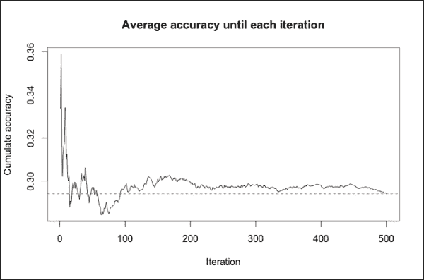
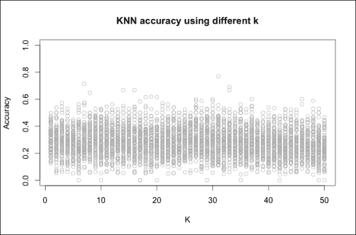
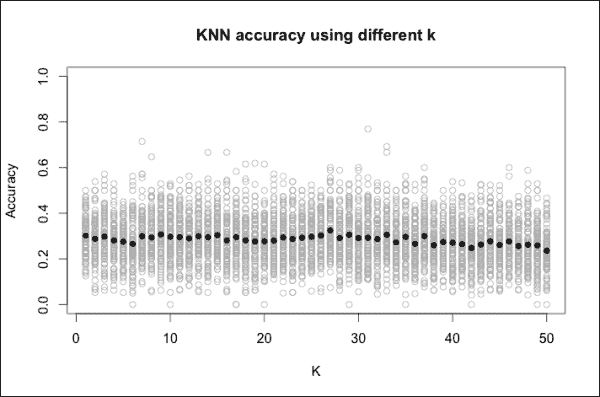
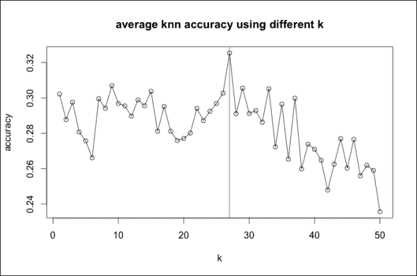
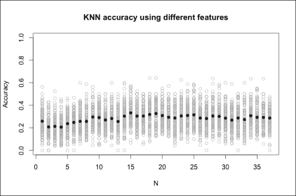
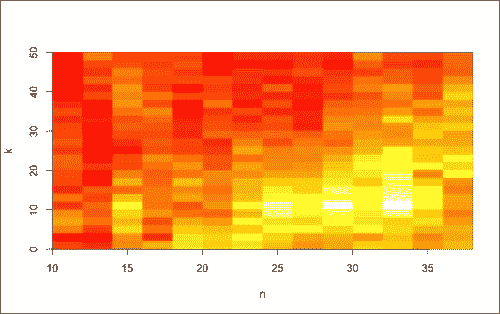

# 六、第三步——验证结果

在前一章中，我们从他们的国旗开始估算新国家的语言。为此，我们使用 KNN 算法，这是一种监督学习算法。我们构建了 KNN，并测量了它的准确性，交叉验证了估计的语言。在本章中，我们将了解如何以更可靠的方式测量精度，并调整 KNN 参数以提高其性能。为了能够完成本章中的任务，您不必阅读前一章，尽管建议您阅读前一章，以便理解 KNN 算法是如何工作的。

在本章中，您将学习如何:

*   验证算法的准确性
*   调整算法参数
*   选择最相关的数据特征
*   一起优化参数和特征

# 验证机器学习模型

从一个描述国家、旗帜及其语言的表开始，KNN 从其旗帜属性开始估算一种新的国家语言。在这一章中，我们将评价 KNN 的表现。

## 衡量算法的准确性

我们已经通过交叉验证估计的语言评估了算法的准确性。首先，我们将数据分成两部分，即训练集和测试集。然后，我们使用训练集建立 KNN 算法，以估计测试集国家的语言。通过计算估计的语言正确的次数，我们定义了一个准确性指数，即正确猜测的百分比。准确性取决于我们将哪些数据放入测试集。由于我们随机定义了训练集国家，因此每次重复交叉验证时，准确性都会发生变化。那么，这种方法的结果是不可靠的。

本章的目标是使用一种可靠的技术来评估 KNN，在这种意义上，准确性不会改变两次验证同一个模型。多次重复训练/集合分割和验证，几乎每个国家都将至少一次同时处于训练和测试集合中。我们可以计算平均准确率，它将考虑训练集和测试集中的所有国家。在几次迭代之后，平均精度将是可靠的，因为它不会随着迭代次数的增加而显著改变。

在评估 KNN 之前，我们需要加载`kknn`和`data.table`包:

```r
# load the packages
library('kknn')
library('data.table')
```

我们可以使用一组定义的参数和数据来定义函数构建和交叉验证 KNN，以便我们可以快速评估任何配置的算法。由于 R 命令与前一章相似，我们将快速浏览一遍。这些函数的输入是:

*   包含数据的表格
*   包含我们使用的特征名称的向量
*   KNN 参数

步骤如下:

1.  定义哪些行属于定型集和测试集。我们构建`indexTrain`，它是一个向量，指定哪些行将出现在训练集中。我们设置一个标志在测试集中的概率为 10%。在[第 5 章](ch05.html "Chapter 5. Step 2 – Applying Machine Learning Techniques")、*第 2 步——应用机器学习技术*中，我们设定了 20%的概率，但在本章中我们会多次重复验证，所以 10%就足够了。
2.  从`indexTrain`开始，提取进入`dtTrain`和`dtTest`的行。
3.  定义定义要预测的特征和属性的公式。
4.  使用输入参数构建 KNN。
5.  定义包含测试集估计语言的`languageFitted`向量。
6.  数一数`languageFitted`和真实语言有多少次是一样的。
7.  用预测语言和真实语言匹配的次数除以测试集中的国家数来计算准确性指数。

这是构建函数的 R 代码。注释反映了编号的项目符号，如下所示:

```r
validateKnn <- function(
  dtFeatures, # data table with the features
  arrayFeatures, # feature names array
  k = 10, # knn parameter
  kernel = 'rectangular', # knn parameter
  distance = 1 # knn parameter
){

  # 1 define the training/test set rows
  indexTrain <- sample(
    x=c(TRUE, FALSE),
    size=nrow(dtFeatures),
    replace=TRUE,
    prob=c(0.9, 0.1)
  )

  # 2 define the training/test set
  dtTrain <- dtFeatures[indexTrain]
  dtTest <- dtFeatures[!indexTrain]

  # 3 define the formula
  formulaOutput <- 'language ~'
  formulaFeatures <- paste(arrayFeatures, collapse = ' + ')
  formulaKnn <- paste(formulaOutput, formulaFeatures)
  formulaKnn <- formula(formulaKnn)

  # 4 build the KNN model
  modelKnn <- kknn(
    formula = formulaKnn,
    train = dtTrain,
    test = dtTest,
    k = k,
    kernel = kernel,
    distance = distance
  )

  # 5 defining the predicted language
  languageFitted <- modelKnn$fitted.values

  # 6 count the corrected predictions and the total
  languageReal <- dtTest[, language]
  nRows <- length(languageReal)

  # 7 define the accuracy index
  percCorrect <- sum(languageFitted == languageReal) / nRows

  return(percCorrect)
}
```

这里，`validateKnn` 是验证 KNN 算法的起点。

## 定义平均精度

为了使用`validateKnn`，我们需要在中定义输入，如下所示:

*   该数据表具有该特性，如图所示:

    ```r
    setwd('<INSER/YOUR/DIRECTORY/PATH>") dfFeatures <- read.table(file = 'dtFeatures.txt')
    ```

*   包含 KNN 所有可能特征的向量:

    ```r
    arrayFeatures <- names(dfFeatures) arrayFeatures <- arrayFeatures[arrayFeatures != 'language']
    ```

*   可以设置或保留默认值的 KNN 参数。

现在，我们有了所有能够使用`validateKnn`的元素。我们可以使用它们的随机子集，例如，前 10 个特征。关于参数，我们可以保留所有参数的默认值，除了等于`8`的`k`，如图所示:

```r
# evaluate a model accuracy
validateKnn(
  dtFeatures = dtFeatures,
  arrayFeatures = arrayFeatures[1:10],
  k = 8
)
[1] 0.3571429

```

运行`validateKnn`不止一次，我们可以注意到结果每次都有变化，正如预期的那样。然而，现在我们可以定义另一个多次运行`validateKnn`的函数。然后，我们计算准确度平均值，并将其用作可靠的性能指标。我们的新函数被称为`cvKnn`,因为它对 KNN 进行了规定次数的交叉验证。

`cvKnn`参数是数据表、迭代次数、特征名称和 KNN 参数。让我们开始定义数据表和迭代次数。所有其他输入与`validateKnn`相同。为了有清晰紧凑的代码，我们可以使用省略号(...)指定我们可以添加其他参数。然后，我们可以再次使用省略号将这些参数传递给任何函数。这意味着当我们调用`validateKnn`时，我们可以使用`validateKnn(...)`来指定`cvKnn`的任何额外参数都将是`validateKnn`的输入。

功能步骤是:

1.  定义一个空向量`arrayPercCorrect`，它将包含精度。
2.  运行`validateKnn`并定义`arrayPercCorrect`，包含精度。
3.  将精度`arrayPercCorrect`增加到`arrayPercCorrect`。

这是构建该函数的代码:

```r
cvKnn <- function(
  dtFeatures, # data table with the features
  nIterations=10, # number of iterations
  ... # feature names array and knn parameters
){

  # 1 initialize the accuracy array
  arrayPercCorrect <- c()

  for(iIteration in 1:nIterations){

    # 2 build and validate the knn
    percCorrect <- validateKnn(dtFeatures, ...)

    # 3 add the accuracy to the array
    arrayPercCorrect <- c(arrayPercCorrect, percCorrect)
  }

  return(arrayPercCorrect)
}
```

现在，我们可以使用`cvKnn`来构建和验证 KNN 500 次。然后，我们计算平均准确度作为 KNN 性能指数:

```r
# determine the accuracies
arrayPercCorrect = cvKnn(
  dtFeatures, nIterations=500,
  arrayFeatures=arrayFeatures
)
# compute the average accuracy
percCorrectMean <- mean(arrayPercCorrect)
percCorrectMean
[1] 0.2941644

```

我们定义`percCorrectMean`，可以作为精度指标。

## 可视化平均精度计算

为了查看的结果在任何迭代中变化了多少，我们可以将每一步的准确度与它们的平均值进行比较。首先，我们使用`plot`建立一个图表，其中的精度和参数是:

*   `x`:这是我们想要绘制的向量(`arrayPercCorrect`)。
*   `ylim`:精度是一个介于 0 和 1 之间的数字。使用`ylim = c(0, 1)`，我们指定我们可视化的区域在 0 和 1 之间。
*   `xlab`和`ylab`:这些是轴标签。
*   `main`:这是标题。

代码如下:

```r
# plot the accuracy at each iteration
plot(
  x = arrayPercCorrect,
  ylim = c(0, 1),
  xlab = 'Iteration', ylab = 'Accuracy',
  main = 'Accuracy at each iteration'
)
```

为了将精确度与其平均值进行比较，我们可以通过画一条带有`abline`的红色水平虚线来显示平均值，如图所示:

```r
help(abline)
abline(h=percCorrectMean, col='red', lty='dashed')
```

我们可以通过为最小和最大范围画一条水平线来显示值的范围，如下所示:

```r
abline(h=min(arrayPercCorrect), col='blue', lty='dashed')
abline(h=max(arrayPercCorrect), col='blue', lty='dashed')
```

获得的图如下:


精确度从一次迭代到另一次迭代变化很大，范围在 0%到 70%之间。不出所料，单一精度完全不靠谱。500 次迭代中的平均值呢？我们需要多少次迭代才能得到稳定的结果？

我们可以在第一次迭代中可视化精度指数，然后是前两次迭代的平均值，然后是前三次迭代的平均值，依此类推。如果在任何一点，平均值停止变化，我们就不需要再进一步。通过构建图表，我们可以观察达到稳定平均值需要多少次迭代。

首先，让定义包含累积平均值的`arrayCumulate`，累积平均值是每次迭代之前的部分平均值，如下所示:

```r
# plot the average accuracy until each iteration
arrayCumulate <- c()
for(nIter in 1:length(arrayPercCorrect)){
  cumulateAccuracy <- mean(arrayPercCorrect[1:nIter])
  arrayCumulate <- c(arrayCumulate, cumulateAccuracy)
}
```

使用与之前相同的命令，我们构建一个新的图表。唯一的新参数是`type='l'`，它指定我们显示一条线而不是点。为了放大具有平均值的区域，我们删除了`ylim`参数，如下所示:

```r
plot(
  x = arrayCumulate,
  type = 'l',
  xlab = 'Iteration', ylab = 'Cumulate accuracy',
  main = 'Average accuracy until each iteration'
)
abline(h = percCorrectMean, col = 'red', lty = 'dashed')
```

得到的图为如下:



我们可以注意到，在 100 次迭代之后，精度几乎是稳定的。假设不同的参数配置不会改变太多，我们可以用 100 次迭代来验证 KNN 算法。

在本节中，我们已经了解了如何使用一组特定的特性和一些定义的参数来自动评估模型性能。在下面的章节中，我们将使用这个函数来优化模型的性能。


# 调整参数

本节向您展示如何通过调整参数来提高 KNN 的性能。我们正在处理定义邻居数量的 *k* 参数。使用这些步骤确定性能最佳的 *k* 参数:

1.  定义我们将要测试的 *k* 的值。KNN 在本地工作，也就是说，给定一个新的国旗，它只能识别几个相似的国旗。我们最多应该用几个？由于总共只有不到 200 个标志，我们不想使用超过 50 个标志。然后，我们应该测试 1 到 50 之间的每个 *k* ，我们可以定义包含选项

    ```r
    # define the k to test arrayK <- 1:50
    ```

    的`arrayK`
2.  定义迭代次数。对于`arrayK`中的每一个 *k* ，我们需要按照`nIterations`定义的足够高的次数来构建和验证 KNN。在前一章中，我们了解到我们至少需要 100 次迭代才能获得有意义的 KNN 精度:

    ```r
    nIterations <- 100
    ```

3.  评估每个 *k* 的精度。
4.  选择精度最高的 *k* 。

最后两步更详细，我们将深入探讨。

为了测量每个 *k* 的精度，我们将`dtAccuracyK`定义为包含精度的空数据表。然后，我们使用一个`for`循环来运行 KNN 和*数组*中的每个 *k* ，并添加新的结果。步骤如下:

1.  使用`cvKnn`运行并验证 KNN。
2.  定义我们将添加到`dtAccuracyK`的包含精度和 *k* 的行。
3.  使用`rbind` :

    ```r
    # validate the knn with different k dtAccuracyK <- data.table() for(k in arrayK) {    # run the KNN and compute the accuracies   arrayAccuracy <- cvKnn(     dtFeatures,     nIterations=nIterations,     arrayFeatures = arrayFeatures,     k = k   )   # define the new data table rows   rowsAccuracyK <- data.table(     accuracy = arrayAccuracy,     k = k   )   # add the new rows to the accuracy table   dtAccuracyK <- rbind(     dtAccuracyK,     rowsAccuracyK     ) }
    ```

    将新行添加到`dtAccuracyK`

现在，让我们来看看`result.head(dtAccuracyK)`:

```r
 accuracy k
1: 0.3636364 1
2: 0.4545455 1
3: 0.4000000 1
4: 0.2727273 1
5: 0.3000000 1
6: 0.2500000 1

```

`dtAccuracyK`的每一行包含 KNN 的一次迭代。第一列显示精度，第二列显示迭代中使用的 *k* 。

为了可视化结果，我们可以使用`plot`。我们想要可视化的两个维度是 *k* 和精度。输入如下所示:

*   `x`、`y`:这些是`k`和`accuracy`列的绘图尺寸
*   `xlab`、`ylab`:这些是轴标签，分别是`k`和`accuracy`
*   `main`:这是图表标题
*   `ylim`:这些是 *y* 区域限制，即`0`和`1`
*   这是灰色的点的颜色，以便强调我们稍后将添加的黑点

代码如下:

```r
# plot all the accuracies
plot(
  x = dtAccuracyK[, k],
  y = dtAccuracyK[, accuracy],
  xlab = 'K', ylab = 'Accuracy',
  main = 'KNN accuracy using different k',
  ylim = c(0, 1),
  col = 'grey'
)
```

获得的图如下:



### 提示

也可以用`type = 'str(dtCvK)'`代替`type = 'o'`。

根据 *k* ，我们无法注意到任何相关的差异。原因是每次迭代的精确度都有很大的不同。为了识别表现更好的 *k* ，我们可以计算每个 *k* 的平均表现。我们将新的数据表称为`dtCvK`，因为我们正在交叉验证模型，如下所示:

```r
# compute the average accuracy
dtCvK <- dtAccuracyK[
  , list(accuracy = mean(accuracy)),
  by='k'
  ]
View(dtCvK)
```

这里，`dtCvK`包含每个 *k* 的平均精度。我们可以使用 points 将它添加到图表中，这是一个向当前图表添加新点的函数。为了使这些点更加清晰可见，我们使用`pch = 16`显示完整的点，如图所示:

```r
# add the average accuracy to the chart
help(points)
points(
  x = dtCvK[, k],
  y = dtCvK[, accuracy],
  pch = 16
)
```

剧情如下:



平均精度在 *k* 之间变化，但很难注意到差异，因为它总是在 0.3 到 0.4 左右。为了更清楚地看到差异，我们可以只绘制平均值，而不可视化 *y* 极限，如下所示:

```r
# plot the average accuracy
plot(
  x = dtCvK[, k],
  y = dtCvK[, accuracy],
  xlab = 'k', ylab = 'accuracy',
  main = 'average knn accuracy using different k',
  type = 'o'
)
```

### 提示

You can also use `type = 'str(dtCvK)'` instead of type = `'o'`.

我们可以确定表现最佳的 *k* ，并使用`abline`将其添加到图表中:

```r
# identify the k performing best
kOpt <- dtCvK[accuracy == max(accuracy), k]
abline(v = kOpt, col = 'red')
```

### 提示

也可以用`kOpt <- 27`代替`kOpt <- dtCvK[accuracy == max(accuracy), k]`。

获得的图如下:



最佳的 *k* 是 27，如果 *k* 在 22 到 30 的范围内，KNN 表现很好。

在本章中，我们确定了 *k* 的最佳表现。但是，还有其他参数我们没有优化，比如距离法。此外，我们可以改进选择要包含的特性的算法，我们将在下一节中对此进行探讨。


# 选择要包含在模型中的数据特征

在前面的部分，我们设置了一个 KNN 参数来最大化性能。另一个调优选项是定义我们用来构建模型的数据。我们的表格描述了使用 37 个特征的标志，并且我们将它们全部包含在模型中。然而，如果只包括其中的一部分，KNN 可能会表现得更好。

选择特性的最简单方法是使用过滤器(如[第 4 章](ch04.html "Chapter 4. Step 1 – Data Exploration and Feature Engineering")、*步骤 1-数据探索和特性工程*中的*使用过滤器或降维对特性进行排序*部分所预期的那样)，该过滤器估计每个特性的影响，并且仅包括最相关的特性。在根据相关性对所有特性进行排序后，我们可以定义`n`参数，指定我们在模型中包含多少特性。然后，我们可以使用类似于上一节的方法，根据`n`最大化精度。

第一步是定义如何对特性进行排序。我们可以使用信息增益比过滤器来估计每个特征的影响，而忽略其他特征。我们已经讨论过信息增益比及其局限性(参见[第 4 章](ch04.html "Chapter 4. Step 1 – Data Exploration and Feature Engineering")、*步骤 1-数据探索和特征工程*中的*使用过滤器或降维对特征进行排序*部分)，我们将使用相同的 R 命令，如下所示:

```r
# rank the features
library('FSelector')
dfGains <- information.gain(
  language~., dtFeatures
  )
dfGains$feature <- row.names(dfGains)
dtGains <- data.table(dfGains)
dtGains <- dtGains[order(attr_importance, decreasing = T)]
arrayFeatures <- dtGains[, feature]
```

这里，`arrayFeatures`包含了按相关性排序的特征。现在，我们可以选择顶级 *n* 特性来构建模型。 *n* 的选项是`1`和特征总数之间的数字，我们定义包含它们的`arrayN`，如图所示:

```r
# define the number of features to test
arrayN <- 1:length(arrayFeatures)
```

为了存储每次迭代的准确性，我们将`dtAccuracyN`定义为一个空数据表，并使用`for`循环迭代地添加行。步骤如下:

1.  使用`cvKnn`验证 KNN，并将精度存储在`arrayAccuracy`中。我们设置 *k* 参数等于`kOpt (27)`，也就是上一节定义的最优 *k* 。
2.  用要添加的行定义`rowsAccuracyN`数据表。
3.  使用`rbind`将新行添加到`dtAccuracyN`。

这是生成`for`循环的代码:

```r
for(n in arrayN)
{
  # 1 run the KNN and compute the accuracies
  arrayAccuracy <- cvKnn(
    dtFeatures,
    nIterations = nIterations,
    arrayFeatures = arrayFeatures[1:n],
    k = kOpt
  )

  # 2 define the new data table rows
  rowsAccuracyN <- data.table(
    accuracy = arrayAccuracy,
    n = n
  )

  # 3 add the new rows to the accuracy table
  dtAccuracyN <- rbind(
    dtAccuracyN,
    rowsAccuracyN
  )
}
```

这里，`dtAccuracyN`包含每次迭代精度，取决于 *n* 。通过使用以下步骤，我们可以构建一个图表，其中包含所有精度及其在 *n* 的不同值上的平均值:

1.  构建一个图表，显示每次迭代的精确度:

    ```r
    plot(   x = dtAccuracyN[, n],   y = dtAccuracyN[, accuracy],   xlab = 'N', ylab = 'Accuracy',   main = 'KNN accuracy using different features',   ylim = c(0, 1),   col = 'grey' )
    ```

2.  从`dtAccuracyN`开始，计算每次迭代的平均精度:

    ```r
    dtCvN <- dtAccuracyN[   , list(accuracy = mean(accuracy)),   by='n'   ]
    ```

3.  将具有平均准确度的点添加到图表中:

    ```r
    Points(   x = dtCvN[, n],   y = dtCvN[, accuracy],   xlab = 'n', ylab = 'accuracy',   pch = 16 )
    ```

获得的图如下:



图表显示我们使用高值的 *n* 获得了最佳精度。为了找出最好的 T21，我们可以画出它们的平均值。然后，我们将表现最好的 *n* 定义为`nOpt`,并添加一条与之对应的红色垂直线，如图所示:

```r
# plot the average accuracy
plot(
  x = dtCvN[, n],
  y = dtCvN[, accuracy],
  xlab = 'N', ylab = 'Accuracy',
  main = 'Average knn accuracy using different features',
  type = 'o'
)

# identify the n performing best
nOpt <- dtCvN[accuracy == max(accuracy), n]
abline(v = nOpt, col = 'red')
```

获得的图如下:


性能最佳的功能数量为 **15** ，此后性能缓慢下降。

在图表中，我们可以注意到有一些点增加了一个新的特征，精度下降了很多(例如 **3** 、 **11** 、 **13** )。在这几点上，我们增加了一个降低性能的特性。如果我们只是决定不包括它呢？我们可以开始仅使用最相关的特征来构建模型，然后添加第二相关的特征。如果性能提高了，我们保留第二个特性；否则，我们丢弃它。之后，我们对第三个特征进行同样的操作，并重复这一操作，直到我们添加或丢弃了每个特征。这种方法被称为包装器，它允许我们定义比过滤器更好的特性集。

在本节中，我们确定了最佳的 *n* 和最佳的 *k* ，因此我们使用它们来构建具有良好性能的 KNN。


# 一起调谐特性和参数

在前两节中，我们使用所有特征(`n=37`)确定了最佳的 *k* 。然后，使用最佳的 *k* ，我们确定了最佳的 *n* 。如果用`k=30`和`n=25`算法表现更好呢？我们还没有探索这种组合以及许多其他选项，因此可能有一种组合比`k=27`和`n=15`表现得更好。

为了确定最佳方案，最简单的方法是测试所有的备选方案。然而，如果变量之间有太多可能的组合，我们就没有足够的计算能力来测试所有的组合。在这种情况下，我们可以使用优化算法(如梯度下降)来确定最佳参数。

幸运的是，在我们的例子中，我们只调优了两个参数，并且我们可以测试它们可能值的一部分。例如，如果我们选择 20 个值的 *n* 和 20 个值的 *k* ，我们就有 400 种组合。为此，我们执行以下步骤:

1.  定义 *k* 的选项。包括所有功能，KNN 在`k=26`时表现最好，在`40`后表现很差。但是，设置一个较低的 *n* ，事情可能会发生变化，所以我们需要测试所有可能的 *k* 。为了限制选项的数量，我们可以将测试限制在奇数。让我们使用`seq`生成 1 到 49 之间的所有奇数。`from`和`to`参数定义了序列的开始和结束。`by`参数定义了产生奇数的增量 2。使用`seq`，我们构建包含 *k* 所有选项的`arrayK`，如下所示:

    ```r
    arrayK <- seq(from = 1, to =  49, by = 2)
    ```

2.  定义 *n* 的选项。我们已经看到，仅使用一个小的特征集，算法的性能非常差，因此我们可以在 10 和特征总数之间测试 *n* ，即 37。类似于 *k* ，我们只包括奇数:

    ```r
    arrayN <- seq(from = 11, to = 37, by = 2)
    ```

3.  生成 *k* 和 *n* 之间所有可能的组合。为此，我们可以使用`expand.grid`。给定两个或多个向量，`expand.grid`生成一个包含所有可能组合的数据帧。在我们的例子中，我们从`arrayK`开始生成一个`k`列，从`arrayN`开始生成一个`n`列，如下所示:

    ```r
    dfParameters <- expand.grid(k=arrayK, n=arrayN)
    ```

4.  将`dfParameters`转换成数据表:

    ```r
    dtParameters <- data.table(dfParameters)
    ```

现在，我们可以用`head`来看看`dtParameters`:

```r
head(dtParameters)
 k  n
1:  1 11
2:  3 11
3:  5 11
4:  7 11
5:  9 11
6: 11 11

```

这里，`dtParameters`包含 350 种组合中的每一种。我们需要确定精确度，并将它们存储在一个名为`accuracy`的新列中。为了做到这一点，我们使用了一个`for`循环来遍历这些行。`iConfig`变量是行索引，定义为 1 和行数`nrow(dtParameters)`之间的一个数字。有不同的组合，所以运行这部分代码可能需要一段时间。每次迭代后，我们使用行中包含的参数构建模型，这些参数是:

*   **k** :有`dtParameters[iConfig, k]`参数
*   **n** :有`dtParameters[iConfig, n]`参数

考虑下面的代码:

```r
# validate the knn with different k and nFeatures
for(iConfig in 1:nrow(dtParameters)){  

  arrayAccuracy <- cvKnn(
    dtFeatures, nIterations = nIterations,
    arrayFeatures = arrayFeatures[1:dtParameters[iConfig, n]],
    k = dtParameters[iConfig, k]
  )
```

现在，我们可以计算`arrayAccuracy`平均值，并将其加到`dtParameters`:

```r
  # add the average accuracy to dtParameters
  dtParameters[iConfig, accuracy := mean(arrayAccuracy)]
}
```

`dtParameters`的每一行包含一个参数集及其相关精度。为了更方便地查看精度，我们可以构建一个矩阵，其行对应于`n`，其列对应于`k`。矩阵的每个元素都显示了精确度。为了建立矩阵，我们可以使用`reshape`，如图所示:

```r
# reshape dtParameters into a matrix
help(reshape)
```

`reshape`语法相当复杂。在我们的例子中，我们想要构建的矩阵是一个`wide`格式，所以我们需要指定`direction = "wide"`。其他参数定义了我们使用的列，它们是:

*   `v.names`:该栏定义矩阵值(精度)
*   `idvar`:该列定义矩阵行(`n`的值)
*   `timevar`:该列定义矩阵列(`k`的值)

使用`reshape`，我们可以构建`dfAccuracy`数据框，如图所示:

```r
dfAccuracy <- reshape(
  data = dtParameters,
  direction = "wide",
  v.names = "accuracy",
  idvar = "n",
  timevar = "k"
)
View(dfAccuracy)
```

`n`列包含 *n* 参数，我们将其移除，以便获得仅具有精度的数据帧。然后，我们将数据帧转换成矩阵，如下所示:

```r
dfAccuracy$n <- NULL
matrixAccuracy <- as.matrix(dfAccuracy)
```

现在我们可以将`n`和`k`分别指定为行名和列名，如图所示:

```r
rownames(matrixAccuracy) <- arrayN
colnames(matrixAccuracy) <- arrayK
View(matrixAccuracy)
```

为了直观显示取决于参数的准确性，我们可以构建一个热图，它是一个表示矩阵的图表。两个图表尺寸为`k`和`n`，颜色代表数值。我们可以使用`image`来构建这个图表:

```r
# plot the performance depending on k and n
help(image)
```

我们使用的论据是:

*   这是矩阵
*   `x`和`y`:这些是维度名称，包含在`arrayN`和`arrayK`中
*   `xLab`和`yLab`:这些是轴标签
*   `col`:这是我们显示的颜色矢量(我们可以使用`heat.colors`函数)

考虑以下代码:

```r
image(
  x = arrayN, y = arrayK, z = matrixAccuracy,
  xlab = 'n', ylab = 'k',
  col = heat.colors(100)
)
```

获得的图如下:



浅黄色代表高精度，红色代表低精度。我们可以注意到，k*在 9 到 19 的范围内，n*在 29 到 33 的范围内，我们获得了最佳的精度。最差的性能是当 *n* 为低电平而 *k* 为高电平时。**

让我们看看最佳组合是什么。考虑以下代码:

```r
# identify the best k-n combination
kOpt <- dtParameters[accuracy == max(accuracy), k]
nOpt <- dtParameters[accuracy == max(accuracy), n]
```

最佳组合是`k=11`和`n=33`，我们无法分别确定最大化参数。原因是，只有当我们不包括所有功能时，KNN 才能与`k=11`一起很好地运行。

在本节中，我们看到了优化两个参数的简单方法。在其他情况下，我们需要更先进的技术。

这种方法的一个局限是我们只调整了两个参数。我们可以实现更好的性能调整其他 KNN 参数如距离法。


# 总结

在本章中，我们学习了如何用预测的平均准确度来评估模型的性能。我们知道如何确定一个准确的交叉验证指数来表达准确性。从交叉验证索引开始，我们调整了参数。此外，我们还学习了如何使用滤波器或滤波器选择特性，以及如何同时调整特性和参数。本章描述了构建机器学习解决方案的最后一部分，下一章概述了一些最重要的机器学习技术。