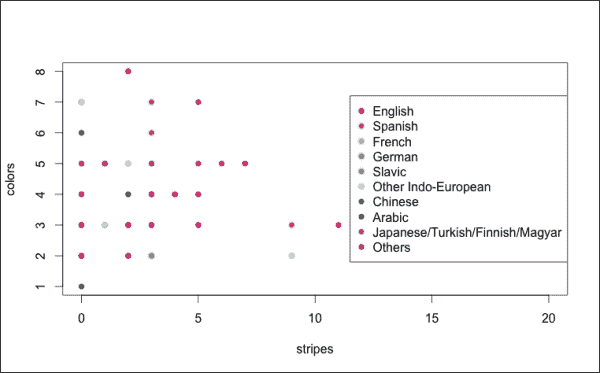
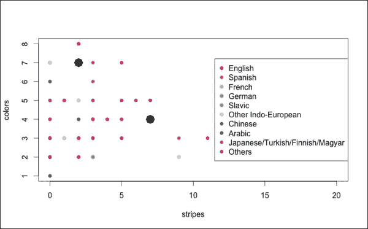
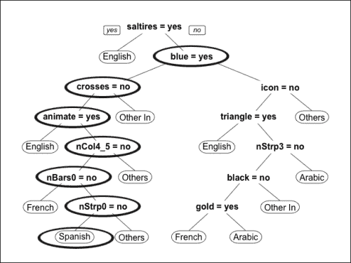
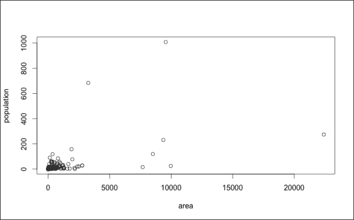
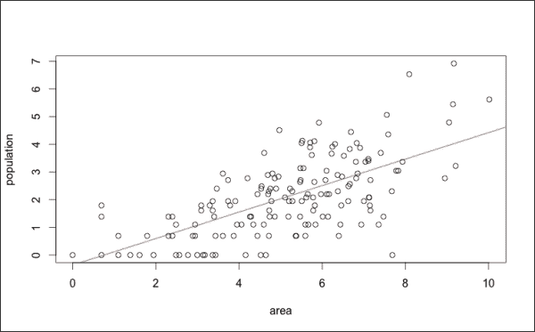
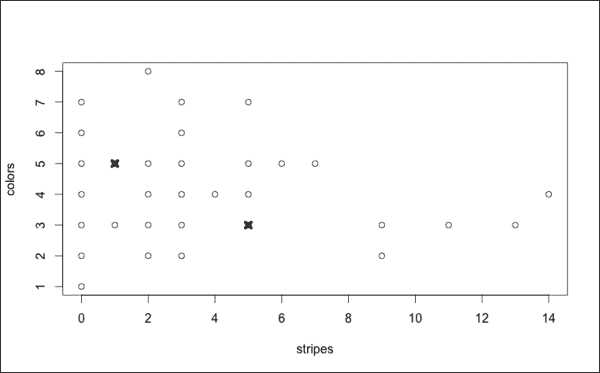
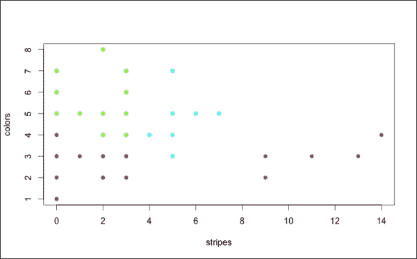

# 七、机器学习技术回顾

有不同的机器学习技术，本章概述了最相关的技术。有些已经在前面的章节中介绍过了，有些是新的。

在本章中，您将学习以下主题:

*   最相关的技术分支:监督和非监督学习
*   使用监督学习进行预测
*   用无监督学习识别隐藏模式和结构
*   这些技术的利弊

# 概述

机器学习技术有不同的类别，在本章中我们将看到两个最相关的分支——监督学习和非监督学习，如下图所示:

监督和非监督学习技术处理由特征描述的对象。监督学习技术的一个例子是决策树学习，而非监督技术的一个例子是 k-means。在这两种情况下，算法从一组对象中学习，差异就是它们的目标:有监督的技术预测其性质已知的属性，无监督的技术识别新的模式。

监督学习技术预测对象的属性。这些算法从属性已知的对象训练集中学习，并预测其他对象的属性。有两类监督学习技术:分类和回归。如果预测的属性是类别性的，我们讨论分类，如果属性是数值性的，我们讨论回归。

无监督学习技术识别一组对象的模式和结构。无监督学习的两个主要分支是聚类和降维。聚类技术根据对象的属性识别同类的对象组，一个例子是 k-means。降维技术识别描述对象的一小组重要特征，一个例子是主成分分析。聚类和降维之间的区别分别取决于所标识的属性是类别属性还是数值属性，如下图所示:

本章将向你展示每个分支的一些流行技术。为了说明这些技术，我们将重用[第 4 章](ch04.html "Chapter 4. Step 1 – Data Exploration and Feature Engineering")、*第 1 步——数据探索和特征工程*的 flag 数据集；[第五章](ch05.html "Chapter 5. Step 2 – Applying Machine Learning Techniques")，*第二步——应用机器学习技术*；以及[第 6 章](ch06.html "Chapter 6. Step 3 – Validating the Results")、*第 3 步——验证本书配套代码包中可以找到的结果*。

# 监督学习

本章将向你展示一些流行的监督学习算法的例子。这些技术对于面对业务问题非常有用，因为它们对未来的属性和结果做出了预测。此外，可以测量每项技术和/或参数的精度，以便选择最合适的技术和参数，并以最佳方式进行设置。

正如预期的那样，有两类技术:分类和回归。然而，大多数技术都可以在这两种环境中使用。以下各小节介绍了不同的算法。

## k-最近邻算法

KNN 是一种监督学习算法，执行分类或回归。给定一个新对象，该算法从其最相似对象的 *k* 个邻居开始预测其属性。KNN 是一种懒惰的学习算法，它直接查询训练数据来进行预测。

在类别属性的情况下，算法估计它是相似对象中最常见的。对于数值属性，它会计算它们之间的中值或平均值。为了说明哪些是 *k* 最*相似的*物体，KNN 使用了一个相似度函数来评估两个物体有多相似。为了度量相似性，起点通常是表示不相似性的距离矩阵。然后，该算法计算新对象之间的相似性，并挑选出最相似的对象。

在我们的示例中，我们将使用旗帜数据集，其特征是旗帜中条纹的数量和颜色的数量。我们希望从国旗属性开始预测的属性是一个新国家的语言。

训练集由一些国家以这样的方式组成，即没有两个国家具有相同的国旗特征。首先，让我们将数据可视化。我们可以在图表中显示国家，图表的维度是两个特征，颜色是语言，如下所示:

我们有两个新的国家:

*   7 条条纹和 4 种颜色
*   3 条纹和 7 种颜色

我们想要使用 4 最近邻算法来确定两个新国家的语言。我们可以将这两个国家添加到图表中，并为每个国家确定 4 个最近的点，如下所示:

对于图表右侧的国家，其 4 个最近的邻居都属于**其他**，所以我们估计其语言为**其他**。另一个国家有一个混合的邻居:1 个英语，1 个其他印欧语，和 2 个西班牙语国家。最常见的语言是西班牙语，所以我们估计是西班牙语国家。

KNN 是一种简单且可扩展的算法，在许多情况下都取得了良好的效果。然而，在存在许多特征的情况下，相似性函数考虑了所有特征，包括不太相关的特征，使得难以使用距离。在这种情况下，KNN 无法识别有意义的最近邻，这个问题被称为维数灾难。一个解决方案是通过选择最相关的特征或使用降维技术来降低维度(这是下一节的主题)。

## 决策树学习

决策树学习是一种监督学习算法，构建分类或回归树。树的每个叶子代表属性估计，并且每个节点根据特征的条件相应地分割数据。

决策树学习是一种渴望的方法，因为它使用训练集来建立模型，而不需要您查询数据。所有其他监督学习技术也是如此。

该算法的目标是定义最相关的特征，并据此将集合分成两组。然后，对于每个组，该算法识别其最相关的特征，并将组中的对象分成两部分。这个过程一直持续到我们将树叶识别为小的物体群。对于每片叶子，如果是分类的，该算法将特征估计为众数，如果是数值的，该算法将特征估计为平均数。在构建树之后，如果我们有太多的叶子，我们可以定义一个级别，在这个级别中我们停止分裂树。这样，每片叶子将包含一个相当大的群体。这种停止分裂的过程称为修剪。这样，我们找到了一个不太复杂但更准确的预测。

在我们的示例中，我们希望从不同的国旗属性(比如颜色和图案)开始确定一个新国家的语言。该算法从训练集中建立树学习。让我们想象一下:

在任一节点，如果答案为**真**，我们向左，如果答案为**假**，我们向右。首先，模型识别最相关的属性，即 **saltires** 。如果一个标志包含一个 saltire，我们去左边，我们确定相关的国家是英语。否则，我们向右走，检查旗帜是否包含蓝色。然后，我们继续检查条件，直到我们到达一片叶子。

让我们假设我们建造这棵树时没有考虑到西班牙国旗。我们如何估计西班牙的语言？从顶部开始，我们检查遇到的每个节点上的条件。

这些是步骤:

1.  旗帜里没有盐，所以我们走左边。
2.  旗帜包含蓝色，所以我们去右边。
3.  旗帜上没有十字，所以`crosses = no`是`true`，我们往左走。
4.  旗帜不包含动画图像，所以我们到右边。
5.  国旗有两种主色，所以`number of colors not equal to 4 or 5`是`true`，我们去左边。
6.  旗帜不包含任何横条，所以我们去左边。

国旗没有任何垂直条纹，所以`nStrp0 = no`是`true`，我们向左走，如下图所示:

最后估计语言是`Spanish`。

决策树学习可以处理数字和/或类别特征和属性，因此只需少量的数据准备就可以应用于不同的上下文。此外，与其他算法不同，它适用于许多特征。一个缺点是，算法可能会过度拟合，因为模型太接近数据，比现实更复杂，尽管修剪可以帮助这一点。

# 线性回归

线性回归是一种统计模型，用于识别数字变量之间的关系。给定一组由 *y* 属性和`x1, …,`和`xn`特征描述的对象，模型定义了特征和属性之间的关系。该关系由线性函数 *y = a0 + a1 * x1 + … + an * xn* 描述，并且`a0, …,`和`an`是由该方法以该关系尽可能接近数据的方式定义的参数。

在机器学习的情况下，线性回归可用于预测数值属性。该算法从训练数据集中学习以确定参数。然后，给定一个新对象，该模型将其特征插入到线性函数中以估计属性。

在我们的示例中，我们希望从一个国家的面积开始估计该国的人口。首先，让我们将面积(以千平方公里计)和人口(以百万计)的数据可视化，如下图所示:

大多数国家的面积不到 300 万平方公里，人口不到 2 亿，只有少数国家的面积和/或人口比它们高得多。因此，大多数点都集中在图表的左下方。为了分散点，我们可以使用对数面积和人口来变换要素，如下图所示:

线性回归的目标是识别尽可能接近数据的线性关系。在我们的例子中，我们有两个维度，所以我们可以用一条线来可视化这种关系。给定面积，线性回归估计人口在线。让我们在图表中看到它的对数特征:

给定一个我们知道该地区的新国家，我们可以使用回归线估计其人口。在图表中，有一个我们知道该地区的新国家。线性回归估计它的点在红线上。

线性回归是一种非常简单和基本的技术。缺点是它需要数字特征和属性，所以在很多情况下它不适用。但是，可以使用虚拟变量或其他技术将分类特征转换为数字格式。

另一个缺点是，该模型对特征和属性如何与相关做出了强有力的假设。估计输出的函数是线性的，因此在某些情况下，它可能与真实的关系相差甚远。此外，如果在现实中特征相互作用，模型就不能跟踪这种相互作用。使用使关系线性的变换来解决这个问题是可能的。还可以定义表达非线性交互的新特征。

线性回归是非常基本的，也是其他一些技术的起点。例如，逻辑回归预测值在 0 到 1 范围内的属性。

# 感知机

**人工神经网络** ( **ANN** )是监督学习技术，其逻辑类似于生物神经系统。一种简单的 ANN 技术是单层感知器，它是一种估计二进制属性的分类技术，该属性的值可以是 0 或 1。感知器像神经元一样工作，如果总和高于定义的阈值，它将所有输入和输出的影响总和为 1。该模型基于以下参数:

*   每个特征的权重，定义其影响
*   一个阈值，超过该阈值，估计输出为 1

从特征开始，模型通过以下步骤估计属性

*   通过线性回归计算输出:将每个要素乘以其权重，然后求和
*   如果输出高于阈值，则将属性估计为 1，否则估计为 0

模型如下图所示:

开始时，该算法使用一组定义的系数和一个阈值来构建感知器。然后，该算法使用训练集迭代地改进系数。在每一步，该算法估计每个对象的属性。然后，该算法计算真实属性和估计属性之间的差异，并使用该差异来修改系数。在很多情况下，算法达不到一组稳定的不被修改的系数，所以我们需要定义在哪个点停止。最后，我们有一个由一组系数定义的感知，我们可以用它来估计新物体的属性。

感知器是神经网络的一个简单例子，它让我们很容易理解变量的影响。然而，感知器依赖于一个线性回归，所以它也受到同样的限制:特征影响是线性的，特征之间不能相互交互。

## 合奏

每个算法都有一些导致错误结果的弱点。如果我们能够用不同的算法解决同一个问题，并选出最佳结果，会怎么样？如果只是几个算法犯了同样的错误，我们可以忽略它们。不可能确定哪个结果是正确的，哪个是错误的，但是有另一个选择。通过对新对象执行监督学习，我们可以应用不同的算法，并从中挑选最常见或平均的结果。这样，如果大部分算法识别出正确的估计，我们就会把它考虑进去。集成方法基于这一原理:它们组合不同的分类或回归算法来增加它们的准确性。

集成方法需要来自不同算法和/或训练数据集的结果之间的可变性。一些选项包括:

*   **改变算法配置**:算法不变，参数在一定范围内变化。
*   **改变算法**:我们使用不同的技术预测属性。此外，对于每种技术，我们可以使用不同的配置。
*   **使用不同的数据子集**:算法是一样的，每次都从训练数据的不同随机子集学习。
*   **使用不同的数据样本(bagging)** :算法是相同的，它从引导样本中学习，即从训练数据集中随机选取的一组对象。同一个对象可以被多次拾取。

最终结果结合了所有算法的输出。在分类的情况下，我们使用众数，在回归的情况下，我们使用平均数或中位数。

我们可以使用监督学习技术的任何组合来构建集成算法，因此有几种选择。一个例子是使用 bagging 结合决策树学习算法的随机森林(在前面列表的最后一个要点中解释了该技术)。

集成方法通常比单一算法执行得好得多。在分类的情况下，集成消除了只影响一小部分算法的偏差。然而，不同算法的逻辑通常是相关的，并且相同的偏差可能是常见的。在这种情况下，系综保持偏差。

集成方法并不总是适用于回归问题，因为偏差会影响最终结果。例如，如果只有一个算法计算出一个非常有偏差的结果，那么平均值将会受到很大的影响。在这种情况下，中位数更好，因为它更稳定，不受离群值的影响。

# 无监督学习

本章展示了一些非监督学习技术。当面临业务问题时，这些技术允许我们识别隐藏的结构和模式，并执行探索性的数据分析。此外，无监督学习可以简化问题，允许我们建立更准确、更简单的解决方案。这些技术也可以用于问题本身的解决。

技术的两个分支是聚类和降维，并且它们中的大多数并不适用于这两种情况。这一章展示了一些流行的技术。

## k 均值

k-means 是一种基于质心的聚类技术。给定一组对象，该算法识别出 *k* 个同类集群。k-means 是基于质心的，因为每个聚类都是由表示其平均对象的质心来定义的。

该算法的目标是识别 *k 个*质心。然后，k-means 将每个对象关联到最近的质心，定义了 *k* 簇。该算法从一组随机的质心开始，并迭代地改变它们，改进聚类。

在我们的例子中，数据是关于国旗的，两个特征是条纹的数量和颜色的数量。我们以这样的方式选择国家的子集，使得没有两个标志具有相同的属性值。我们的目标是找出两组相同的国家。k-means 的第一步是识别两个随机质心。让我们在图表中可视化数据和质心:

**o** 代表国旗， **x** 代表质心。在运行 k-means 之前，我们需要定义一个距离，这是一种确定对象之间不相似性的方法。例如，在上图中，我们可以使用欧几里得距离来表示连接两点的直线的长度。该算法是迭代的，每一步由以下步骤组成:

1.  对于每个点，确定距离最小的质心。然后，将该点指定给与最近质心相关的簇。
2.  重新计算每个簇的质心，使其成为其对象之间的平均值。

最后，我们有两个相关的质心代表平均物体的集群。让我们将它们形象化，如下所示:

颜色代表聚类，黑色的 **x** 代表最终的质心。

k-means 是最流行的聚类技术之一，因为它易于理解，并且不需要大量的计算能力。但是，该算法有一定的局限性。它包含一个随机成分，所以如果我们对同一组数据运行两次，它可能会识别出不同的聚类。另一个缺点是，它不能在某些特定的环境中识别集群，例如当集群具有不同的大小或复杂的形状时。k-means 是一个非常简单和基本的算法，它是一些更复杂技术的起点。

## 层次聚类

层次聚类是聚类技术的一个分支。从一组对象开始，目标构建集群的层次结构。在凝聚层次聚类中，每个对象一开始属于不同的聚类。然后，该算法合并聚类，直到有一个聚类包含所有对象。在确定了层次结构之后，我们可以定义集群，并在任何时候停止它们的合并。

在每个聚集步骤中，该算法合并两个最相似的聚类，并且有一些参数定义相似性。首先，我们需要定义一种方法来衡量两个对象有多相似。有几种选择，视情况而定。然后，我们需要定义聚类之间的相似度；这些方法被称为**联动**。在中，为了测量相似性，我们开始定义一个相反的距离函数。为了确定 cluster1 和 cluster2 之间的距离，我们测量 cluster1 的每个可能对象和 cluster2 的每个对象之间的距离。测量两个集群之间距离的一些选项有:

*   **单联动**:该为最小距离
*   **完成** **联动**:此为最大距离
*   **平均** **联动**:此为平均距离

根据链接的不同，算法的结果会有所不同。

该示例使用与 k-means 相同的数据。国旗是用条纹和颜色的数量来表示的，我们想要识别同类的群体。我们使用的距离是欧几里得距离(只是两点之间的距离),链接是完整的。首先，让我们从它们的层次结构中识别集群，如下图所示:

该图表被称为**树状图** ，在图表的底部，每个对象属于一个不同的簇。然后，向上，我们合并集群，直到所有的对象都属于同一个集群。高度是算法合并聚类的距离。例如，在高度为 3 时，距离小于 3 的所有聚类已经被合并。

红线在 6 的高度，它定义了我们何时停止合并，在它下面的物体被分成 4 个簇。现在，我们可以将图表中的集群可视化如下:

点的颜色代表聚类。该算法已经正确地识别了右边的组，并且以良好的方式将左边的组分成三部分。

对于等级聚类有不同的选项，其中一些在某些情况下会产生非常好的结果。与 k-means 不同，该算法是确定性的，因此它总是导致相同的结果。

层次聚类的一个大缺点是计算时间(`O(n3)`)，这使得它不可能应用于大型数据集。另一个不足是选择算法配置和树状图切割的手动组件。为了确定一个好的解决方案，我们通常需要用不同的配置运行算法，并可视化树状图来定义它的切割。

## 五氯苯甲醚

**主成分分析** ( **PCA** )是转换特征的统计过程。PCA 逻辑基于线性相关和方差的概念。在机器学习环境中，PCA 是一种降维技术。

从描述一组对象的特征开始，目标定义其他彼此线性不相关的变量。输出是一组新的变量，定义为初始特征的线性组合。此外，新变量根据其相关性进行排名。新变量的数量小于或等于特征的初始数量，并且可以选择最相关的特征。然后，我们能够定义一个更小的特性集，减少问题的维度。

该算法开始定义具有最高方差的特征组合。然后，在每一步，它迭代地定义另一个最大化方差的特征组合，条件是新的组合与其他组合不线性相关。

在[第 4 章](ch04.html "Chapter 4. Step 1 – Data Exploration and Feature Engineering")、*第 1 步——数据探索和特征工程*、[第 5 章](ch05.html "Chapter 5. Step 2 – Applying Machine Learning Techniques")、*第 2 步——应用机器学习技术*和[第 6 章](ch06.html "Chapter 6. Step 3 – Validating the Results")、*第 3 步——验证结果*的示例中，我们定义了 37 个描述每个国旗的属性。应用主成分分析，我们可以定义 37 个新的属性，定义为变量的线性组合。属性按相关性排序，因此我们可以选择前六个，这样就有了一个描述旗帜的小表。通过这种方式，我们能够建立一个监督学习模型，在六个相关特征的基础上评估语言。

在存在大量特征的情况下，主成分分析允许我们定义一个较小的相关变量集。然而，这种技术并不适用于所有情况。不足之处在于结果取决于如何缩放特征，因此有必要首先标准化变量。

在处理监督学习问题时，我们可以使用主成分分析来降低它的维数。但是，PCA 只考虑特征，而忽略了它们与要预测的属性的关系，因此它可能会选择与问题不太相关的特征组合。

# 总结

在这一章中，我们学习了机器学习技术的主要分支:监督学习和非监督学习。我们看到了如何使用监督学习技术(如 KNN、决策树、线性回归和神经网络)来估计数值或类别属性。我们看到，使用集成技术来提高性能是可能的，集成技术是组合不同的监督学习算法的技术。我们学习了如何使用聚类技术(如 k-means 和层次聚类)来识别同质组。我们还理解了降维技术(如 PCA)对定义更小变量集的特征进行转换的重要性。

下一章展示了一个可以用机器学习技术解决的商业问题的例子。我们还将看到监督和非监督学习技术的例子。