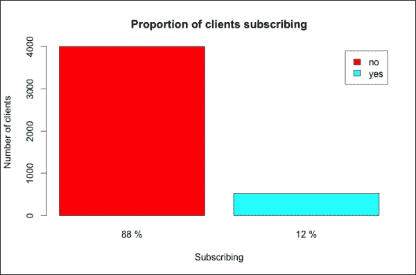
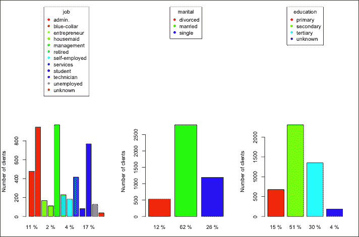
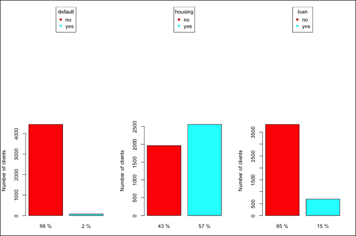
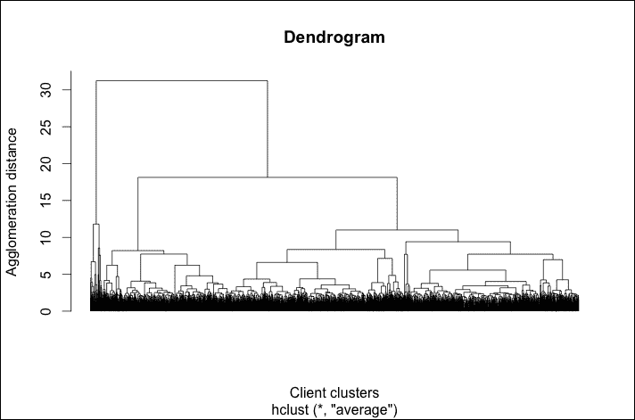
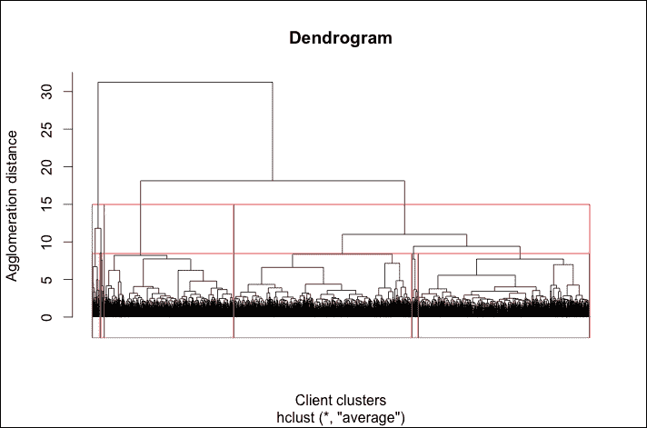
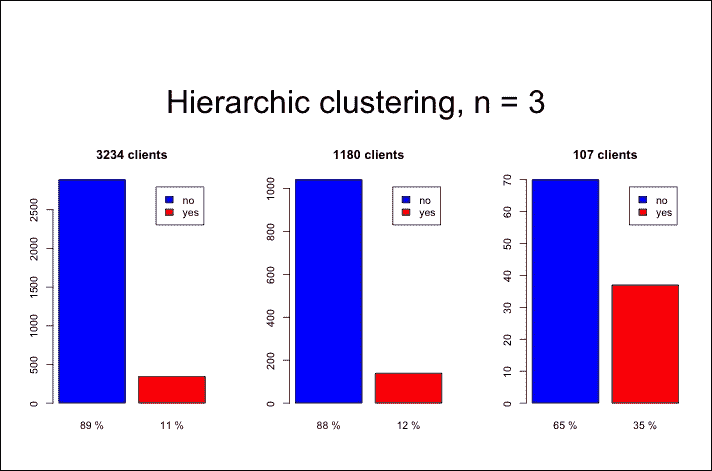
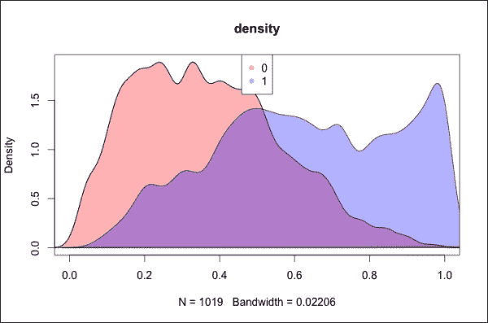
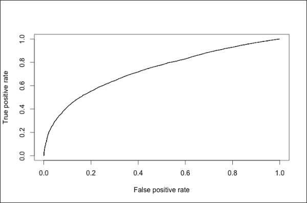
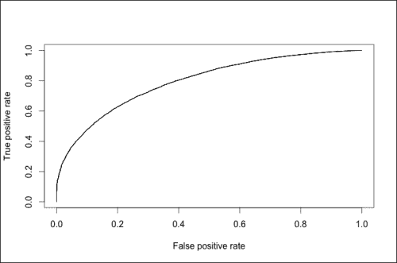

<title>Chapter 8. Machine Learning Examples Applicable to Businesses</title>

# 第八章。适用于企业的机器学习示例

本章的目的是向你展示机器学习如何帮助解决一个商业问题。大部分技巧在前一章已经探讨过了，所以这一章的节奏很快。这些技术是关于无监督和有监督的学习。无监督算法从数据中提取隐藏结构，监督技术预测属性。本章使用属于这两个分支的技术解决了一个业务挑战。

在本章中，您将学习如何:

*   将机器学习方法应用于商业问题
*   细分银行的客户群
*   确定营销活动的目标
*   选择表现更好的技术

# 问题概述

一家葡萄牙银行机构发起电话营销活动。机构资源有限，需要选择目标客户。从关于过去活动的数据开始，我们可以使用机器学习技术为公司提供一些支持。这些数据显示了客户的个人信息和以前营销活动的信息。机器学习算法的目标是识别更有可能订阅的客户。从数据出发，算法需要理解如何使用新客户的数据来预测他们每个人订阅的可能性。

## 数据概述

数据包括大约 2，500 多名客户，他们受到一次或多次电话营销活动的影响。我们有一些关于客户的细节，我们知道谁订阅了。

表中的每一行对应于一个客户端，如果客户端订阅了，则有一列显示输出为`yes`，否则为`no`。其他列是描述客户端的功能，它们是:

*   **个人信息**:包括年龄、工作、婚姻状况、教育程度、信用违约、年平均余额、住房、个人贷款等信息
*   **与公司的沟通**:包括联络类型、上次联络月份和工作日、上次通话时长、联络次数等详细信息
*   **之前的活动**:包括之前活动的天数、过去的联系次数和过去的结果等详细信息

这是这张桌子的样品。`y`列显示属性，如果客户端订阅，则预测`yes`，否则预测`no`。

| 

年龄

 | 

职位

 | 

婚姻状况

 | 

...

 | 

接触

 | 

…

 | 

y

 |
| --- | --- | --- | --- | --- | --- | --- |
| 30 | 服务 | 已婚的 |   | 细胞的 |   | 不 |
| 33 | 管理 | 单一的 |   | 电话 |   | 是 |
| 41 | 体力劳动者的 | 单一的 |   | 未知的 |   | 不 |
| 35 | 自己经营的 | 已婚的 |   | 电话 |   | 不 |

数据存储在`bank.csv`中，我们可以将它们加载到 R 中，构建一个数据表。`sep=';'`字段指定文件中的字段用分号分隔，如下所示:

```
library(data.table)
dtBank <- data.table(read.csv('bank.csv', sep=';'))
```

`duration`功能显示最后一次通话的秒数。我们分析的目标是确定给哪些客户打电话，在联系客户之前我们无法知道持续时间。此外，在知道一个呼叫持续时间之后，我们已经知道客户端是否订阅了，所以使用这个属性来预测结果是没有意义的。出于这些原因，我们移除了`duration`功能，如下所示:

```
# remove the duration
dtBank[, duration := NULL]
```

下一步是探索数据，以了解背景。

## 探索输出

在这个小节中，我们快速浏览和转换数据。

`y`输出是分类的，可能的结果是`yes`和`no`，我们的目标是可视化比例。为此，我们可以使用以下步骤构建一个饼图:

1.  使用`table` :

    ```
    dtBank[, table(y)] y   no  yes 4000  521 
    ```

    统计有多少客户订阅，有多少没有订阅
2.  确定客户端订阅和不订阅的百分比:

    ```
    dtBank[, table(y) / .N] y      no     yes  0.88476 0.11524 
    ```

3.  构建一个从比例开始确定百分比的函数:

    ```
    DefPercentage <- function(frequency) {   percentage = frequency / sum(frequency)   percentage = round(percentage * 100)   percentage = paste(percentage, '%')   return(percentage) }
    ```

4.  确定百分比:

    ```
    defPercentage(dtBank[, table(y) / .N]) [1] "88 %" "12 %" 
    ```

5.  看`barplot`的帮助那就是 R 函数构建条形图:

    ```
    help(barplot)
    ```

6.  定义柱状图输入:

    ```
    tableOutput <- dtBank[, table(y)] colPlot <- rainbow(length(tableOutput)) percOutput <- defPercentage(tableOutput)
    ```

7.  构建柱状图:

    ```
    barplot(   height = tableOutput,   names.arg = percOutput,   col = colPlot,   legend.text = names(tableOutput),   xlab = 'Subscribing'   ylab = 'Number of clients',   main = 'Proportion of clients subscribing' )
    ```

得到的图如下:



只有 12%的客户端订阅，所以输出值不是平均分布的。下一步是探索所有的数据。

## 探索和转换功能

类似于输出，我们可以构建一些图表来探究这些特性。让我们先用`str`来看看它们:

```
str(dtBank)
Classes 'data.table' and 'data.frame':    4521 obs. of  16 variables:
 $ age      : int  30 33 35 30 59 35 36 39 41 43 ...
 $ job      : Factor w/ 12 levels "admin.","blue-collar",..: 11 8 5 5 2 5 7 10 3 8 ...
 $ marital  : Factor w/ 3 levels "divorced","married",..: 2 2 3 2 2 3 2 2 2 2 ...
...

```

这些要素属于两种数据类型:

*   **类别**:该数据类型以因子格式存储特征
*   **数字**:该数据类型以整数格式存储特征

分类特性的图表不同于数字特性的图表，因此我们需要将特性分成两组。通过使用以下步骤，我们可以定义一个包含类别特征的向量和另一个用于数字特征的向量:

1.  使用`lapply` :

    ```
    classFeatures <- lapply(dtBank, class)
    ```

    定义每个列类
2.  删除包含输出的`y`列:

    ```
    classFeatures <- classFeatures[names(classFeatures) != 'y']
    ```

3.  确定类别特征:

    ```
    featCategoric <- names(classFeatures)[   classFeatures == 'factor'   ]
    ```

4.  确定数字特征:

    ```
    featNumeric <- names(classFeatures)[   classFeatures == 'integer'   ]
    ```

与输出类似，我们可以为九个类别特征中的每一个构建一个饼图。为了避免有太多的图表，我们可以在同一个图表中放三个馅饼。R 函数是`par`，它允许定义图表网格:

```
help(par)
```

我们需要的输入是:

*   `mfcol`:这是一个包含列数和行数的向量。对于每个特性，我们用饼图和图例分别构建一个图表。我们把饼图放在最下面一行，图例放在最上面。然后，我们有两行和三列。
*   `mar`:这是一个定义绘图页边空白的矢量:

    ```
    par(mfcol = c(2, 3), mar = c(3, 4, 1, 2))
    ```

现在，我们可以使用一个`for`循环来构建直方图:

```
for(feature in featCategoric){
```

在`for`循环中执行以下步骤:

1.  定义饼状图输入:

    ```
      TableFeature <- dtBank[, table(get(feature))]   rainbCol <- rainbow(length(tableFeature))   percFeature <- defPercentage(tableFeature)
    ```

2.  定义一个新的图，其图例由与其颜色匹配的特征名称组成。我们添加特征名作为图例标题:

    ```
       plot.new()    legend(      'top', names(tableFeature),      col = rainbCol, pch = 16,      title = feature    )
    ```

3.  构建直方图，该直方图将显示在底部一行:

    ```
      barplot(     height = tableFeature,     names.arg = percFeature,     col = colPlot,     xlab = feature,     ylab = 'Number of clients'   ) }
    ```

我们构建了三个图表，每个图表包含三个类别特征。让我们来看看第一个:



`job`属性有不同的级别，其中一些有大量的客户端。然后，我们可以为每个相关作业定义一个虚拟变量，忽略其他变量。为了确定最相关的工作，我们确定属于每个级别的人的百分比。然后，我们设置一个阈值，忽略百分比低于阈值的所有级别。在这种情况下，阈值为 0.08，即 8%。定义新的虚拟列后，我们删除`job`:

```
percJob <- dtBank[, table(job) / .N]
colRelevant <- names(percJob)[percJob > 0.08]
for(nameCol in colRelevant){
  newCol <- paste('job', nameCol, sep='_')
  dtBank[, eval(newCol) := ifelse(job == nameCol, 1, 0)]
}
dtBank[, job := NULL]
```

在这里，`marital`定义了婚姻状况，有三个等级，其中`divorced`和`single`有一个较小但重要的部分。我们可以定义两个虚拟变量来定义三个级别:

```
dtBank[, single := ifelse(marital == 'single', 1, 0)]
dtBank[, divorced := ifelse(marital == 'divorced', 1, 0)]
dtBank[, marital := NULL]
```

关于`education`，超过一半的客户接受过中等教育，所以我们可以假设4%的`unknown`是`secondary`。然后，我们有三个属性，我们可以定义两个虚拟变量:

```
dtBank[, edu_primary := ifelse(education == 'primary', 1, 0)]
dtBank[, edu_tertiary := ifelse(education == 'tertiary', 1, 0)]
dtBank[, education := NULL]
```

得到的剧情如下:



**默认**、**住房**、**贷款**属性有两个不同的级别，因此可以使用`as.numeric`将转换成数字形式。为了在属性为`no`时得到`0`，在属性为`yes`时得到`1`，我们减去`1`，如下:

```
dtBank[, housing := as.numeric(housing) - 1]
dtBank[, default := as.numeric(default) - 1]
dtBank[, loan := as.numeric(loan) - 1]
```

获得的直方图如下:


这里，**联系** 有三个选项，其中一个是**未知**。所有选项都有一个有效部分，因此我们可以定义两个虚拟变量，如下所示:

```
dtBank[, cellular := ifelse(contact == 'cellular', 1, 0)]
dtBank[, telephone := ifelse(contact == 'telephone', 1, 0)]
dtBank[, contact := NULL]
```

我们可以将`month`转换成一个数字变量，其中一月对应于`1`，十二月对应于`12`。特征值是没有大写字母缩写的月份名称，例如`jan`代表`January`。为了定义数字特征，我们定义了一个向量，它的第一个元素是`jan`，第二个元素是`feb`，依此类推。然后，使用`which`，我们可以识别向量的相应元素。例如，`apr`是向量的第四个元素，所以使用`which`我们得到`4`。为了构建带有有序月份名称的向量，我们使用包含缩写月份名称的`month.abb`和不大写第一个字母的`tolower`，如下所示:

```
Months <- tolower(month.abb)
months <- c(
    'jan', 'feb', 'mar', 'apr', 'may', 'jun',
    'jul', 'aug', 'sep', 'oct', 'nov', 'dec'
)
dtBank[
  , month := which(month == months),
  by=1:nrow(dtBank)
  ]
```

在`poutcome`、`success`和`failure`有一小部分客户。但是，它们非常相关，因此我们定义了两个虚拟变量:

```
dtBank[, past_success := ifelse(poutcome == 'success', 1, 0)]
dtBank[, past_failure := ifelse(poutcome == 'failure', 1, 0)]
dtBank[, poutcome := NULL]
```

我们将所有的分类特征转换成数字格式。下一步是研究数字特征，并在必要时对它们进行转换。

有六个数字特征，我们可以为每个特征建立一个图表。该图表是一个直方图，显示了特征值的分布情况。为了可视化同一图表中的所有数字，我们可以使用`par`将它们放入一个 3 x 2 的网格中。论据如下:

*   `mfrow`:与`mfcol`类似，定义一个图形网格。区别只是我们将数字添加到网格中的顺序。
*   `mar`:我们将页边距设置为其默认值，即`c(5, 4, 4, 2) + 0.1`，如下:

    ```
    par(mfrow=c(3, 2), mar=c(5, 4, 4, 2) + 0.1)
    ```

我们可以使用`hist`构建直方图。输入如下所示:

*   `x`:这是带有数据的向量
*   `main`:这是剧情标题
*   `xlab`:这是 x 轴下的标签

我们可以在数据表里面直接使用`hist`和方括号。为了一步完成所有的图表，我们使用了一个`for`循环:

```
for(feature in featNumeric){
  dtBank[, hist(x = get(feature), main=feature, xlab = feature)]
}
```

获得的直方图如下:


这里，**年龄**和**日**均匀分布在它们的可能值上，所以它们不需要任何处理。剩下的特性都集中在小值上，所以我们需要对它们进行变换。我们用来定义变换特征的函数是对数，它允许我们有更多的扩展值。对数适用于值大于 0 的要素，因此我们需要从要素中移除负值。

为了避免零，在计算对数之前，将`1`加到特征上。

根据数据描述，如果机构之前没有联系过客户，则`pdays`等于`-1`。为了识别第一次联系的客户，如果`pdays`等于`-1`，我们可以定义一个新的虚拟变量`1`。然后，我们用`0`替换所有负值，如下:

```
dtBank[, not_contacted := ifelse(pdays == -1, 1, 0)]
dtBank[pdays == -1, pdays := 0]
```

`balance`特性代表过去的余额，如果余额为负，我们可以定义一个虚拟变量`1`。然后，我们用`0`替换负余额:

```
dtBank[, balance_negative := ifelse(balance < 0, 1, 0)]
dtBank[balance < 0, balance := 0]
```

现在，我们可以计算所有特征的对数。由于对数的输入必须是正的，并且一些特征等于`0`，我们在计算对数之前将`1`加到每个特征上:

```
dtBank[, pdays := log(pdays + 1)]
dtBank[, balance := log(balance + 1)]
dtBank[, campaign := log(campaign + 1)]
dtBank[, previous := log(previous + 1)]
```

我们已经将所有特征转换成数字格式。现在，我们可以看看新功能表:

```
str(dtBank)
View(dtBank)
```

唯一不是数字或整数的列是输出`y`。我们可以将其转换为数字格式，并将其名称改为 output:

```
dtBank[, output := as.numeric(y) – 1]
dtBank[, y := NULL]
```

我们加载并清理了数据。现在我们已经准备好建立机器学习模型了。

<title>Clustering the clients</title>

# 聚集客户

为了应对下一次营销活动，我们需要确定更有可能订阅的客户。由于很难逐一评估客户，我们可以确定同类客户群，并确定最有希望的客户群。

从过去的数据开始，我们根据客户的个人信息对他们进行分类。然后，给定一个新的客户端，我们识别最相似的组，并将这个新客户端关联到它。我们没有关于新客户的客户行为的信息，所以聚类仅仅基于个人属性。

执行聚类有不同的技术，在本节中，我们使用一种相关的算法，即分层聚类。层次聚类的一个参数是链接，这是计算两个组之间距离的方法。主要选项有:

*   **单联动**:该是第一组物体和第二组物体之间的最小距离
*   **完全联动**:这是第一组物体和第二组物体之间的最大距离
*   **平均链接**:这个是第一组物体和第二组物体之间的平均距离

在我们的例子中，我们选择平均链接，这个选择来自于对三个选项的测试。

我们将仅包含个人特征的`dtPers`定义如下:

```
featPers <- c(
  'age', 'default', 'balance', 'balance_negative',
  'housing', 'loan',
  'job_admin.', 'job_blue-collar',	'job_management',
  'job_services', 'job_technician',
  'single', 'divorced', 'edu_primary', 'edu_tertiary'
)
dtPers <- dtBank[, featPers, with=F]
```

现在，我们可以应用层次聚类，步骤如下:

1.  定义相异度矩阵:

    ```
    d <- dist(dtPers, method = 'euclidean')
    ```

2.  构建层次聚类模型:

    ```
    hcOut <- hclust(d, method = 'average')
    ```

3.  想象树状图。`par`方法定义了绘图布局，在这种情况下,只包含一个图表,`plot`包含一个改善外观的参数。`labels`和`hang`特性避免在底部出现混乱的图表，其他参数指定绘图标题和轴标签，如下所示:

    ```
    par(mfrow = c(1, 1)) plot(   hcOut,   labels = FALSE,   hang = -1,   main = 'Dendrogram',   xlab = 'Client clusters',   ylab = 'Agglomeration distance' )
    ```

获得的直方图如下:



我们可以识别出围绕 **40** 高度切割树状图的三个集群。还有另一个选项是在较低的级别(大约 18)切割树状图，识别七个集群。我们可以探索这两个选项，并使用`rect.hclust`在树状图上可视化两个分裂，如下所示:

```
k1 <- 3
k2 <- 7
par(mfrow=c(1, 1))
rect.hclust(hcOut, k = k1)
rect.hclust(hcOut, k = k2)
```

获得的直方图如下:



为了识别最成功的集群，我们可以使用饼图显示订阅的客户端比例，并将集群中的客户端数量作为其标题。让我们看看第一次分裂的三个集群的图表。构建饼图的步骤类似于我们之前执行的步骤:

1.  定义一个包含输出属性

    ```
    dtClust <- dtBank[, 'output', with = F]
    ```

    的数据表
2.  向数据表中添加两个定义分类的列。每列对应不同数量的簇:

    ```
    dtClust[, clusterHc1 := cutree(hclOut, k = k1)] dtClust[, clusterHc2 := cutree(hclOut, k = k2)]
    ```

3.  用一行三列定义绘图布局。`oma`参数定义了外部边距:

    ```
    par(mfrow = c(1, 3), oma = c(0, 0, 10, 0))
    ```

4.  使用类似于数据探索的命令，构建三个直方图，显示订阅或未订阅每个集群的客户端的百分比:

    ```
    for(iCluster in 1:k1){   tableClust <- dtClust[     clusterHc1 == iCluster,     table(output)     ]   sizeCluster <- dtClust[, sum(clusterHc1 == iCluster)]   titlePie <- paste(sizeCluster, 'clients')   barplot(     height = tableClust,     names.arg = defPercentage(tableClust),     legend.text = c('no', 'yes'),     col = c('blue', 'red'),     main = titlePie   ) }
    ```

5.  添加图表的标题:

    ```
    mtext(   text = 'Hierarchic clustering, n = 3',   outer = TRUE, line = 1, cex = 2 )
    ```

获得的直方图如下:



第一个和第二个集群包含了大部分客户，该活动在他们身上并不特别成功。第三个集群较小，其客户端订阅的百分比明显较高。然后，我们可以开始针对新客户的营销活动，类似于第三个集群。

使用相同的 R 命令，我们可以看到由第二次分割确定的七个集群的相同图表，如下所示:

1.  定义两行四列的绘图布局:

    ```
    par(mfrow = c(2, 4), oma = c(0, 0, 10, 0))
    ```

2.  构建直方图:

    ```
    for(iCluster in 1:k2){   tableClust <- dtClust[     clusterHc2 == iCluster,     table(output)     ]   sizeCluster <- dtClust[, sum(clusterHc2 == iCluster)]   titlePie <- paste(sizeCluster, 'clients')   barplot(     height = tableClust,     names.arg = defPercentage(tableClust),     col = c('blue', 'red'),     main = titlePie   ) }
    ```

3.  添加图表标题:

    ```
    mtext(   text = 'Hierarchic clustering, n = 7',   outer = TRUE, line = 1, cex = 2 )
    ```

得到的直方图如下:


前三个集群包含了大部分客户，营销活动对他们来说并不是特别有效。第四个和第五个集群的客户端订阅比例要高得多。最后两个集群非常成功，尽管它们非常小。营销活动将开始针对所有新客户，类似于最后两个集群，它将针对第四和第五集群的一部分客户。

总之，通过聚类，我们发现了活动非常成功的小客户群体。然而，大多数客户属于一个大集群，我们没有足够的信息。原因是该活动在少数具有特定特征的客户身上取得了成功。

<title>Predicting the output</title>

# 预测产量

过去的营销活动针对的是部分客户群。在其他 1000 个客户中，我们如何确定 100 个更热衷于订阅？我们可以建立一个模型，从数据中学习，并估计哪些客户与之前活动中订阅的客户更相似。对于每个客户端，如果该客户端更有可能订阅，则该模型估计得分较高。有不同的机器学习模型来确定分数，我们使用两种性能良好的技术，如下所示:

*   **逻辑回归**:这是线性回归的一个变体，用于预测二进制输出
*   **随机森林**:这是一个基于决策树的集成，在存在许多特征的情况下工作良好

最后，我们需要从两种技术中选择一种。交叉验证方法允许我们评估模型的准确性(参见[第 6 章](ch06.html "Chapter 6. Step 3 – Validating the Results")、*步骤 3-验证结果*)。从这一点出发，我们可以衡量两个选项的准确性，并选择一个表现更好的选项。

在选择了最合适的机器学习算法后，我们可以使用交叉验证来优化它。然而，为了避免模型构建过于复杂，我们不执行任何特征选择或参数优化。

以下是构建和评估模型的步骤:

1.  加载包含随机森林算法的`randomForest`包:

    ```
    library('randomForest')
    ```

2.  定义定义输出和变量名的公式。公式格式为`output ~ feature1 + feature2 + ...` :

    ```
    arrayFeatures <- names(dtBank) arrayFeatures <- arrayFeatures[arrayFeatures != 'output'] formulaAll <- paste('output', '~') formulaAll <- paste(formulaAll, arrayFeatures[1]) for(nameFeature in arrayFeatures[-1]){   formulaAll <- paste(formulaAll, '+', nameFeature) } formulaAll <- formula(formulaAll)
    ```

3.  初始化包含所有测试集的表格:

    ```
    dtTestBinded <- data.table()
    ```

4.  定义迭代次数:

    ```
    nIter <- 10
    ```

5.  开始一个`for`循环:

    ```
    for(iIter in 1:nIter) {
    ```

6.  定义训练和测试数据集:

    ```
    indexTrain <- sample(   x = c(TRUE, FALSE),   size = nrow(dtBank),   replace = T,   prob = c(0.8, 0.2) ) dtTrain <- dtBank[indexTrain] dtTest <- dtBank[!indexTrain]
    ```

7.  从测试集中选择一个子集，使我们拥有相同数量的`output == 0`和`output == 1`。首先，我们根据输出将`dtTest`分成两部分(`dtTest0`和`dtTest1`)，并计算每个部分的行数(`n0`和`n1`)。然后，由于`dtTest0`有更多的行，我们随机选择`n1`行。最后，我们重新定义`dtTest`绑定`dtTest0`和`dtTest1`，如下:

    ```
      dtTest1 <- dtTest[output == 1]   dtTest0 <- dtTest[output == 0]   n0 <- nrow(dtTest0)   n1 <- nrow(dtTest1)   dtTest0 <- dtTest0[sample(x = 1:n0, size = n1)]   dtTest <- rbind(dtTest0, dtTest1)
    ```

8.  使用`randomForest`建立随机森林模型。公式参数定义变量之间的关系，数据参数定义训练数据集。为了避免模型过于复杂，所有其他参数都保留默认值:

    ```
    modelRf <- randomForest(   formula = formulaAll,   data = dtTrain )
    ```

9.  使用`glm`建立逻辑回归模型，该函数用于建立**广义线性模型** ( **GLM** )。GLMs 是线性回归的推广，允许定义连接线性预测器和输出的链接函数。输入与随机森林相同，增加了`family = binomial(logit)`定义回归为逻辑:

    ```
    modelLr <- glm(   formula = formulaAll,   data = dtTest,   family = binomial(logit) )
    ```

10.  预测随机森林的输出。该函数为`predict`，其主要参数为`object`定义模型和`newdata`定义测试集，如下:

    ```
    dtTest[, outputRf := predict(   object = modelRf, newdata = dtTest, type='response'   )]
    ```

11.  使用类似于随机森林的`predict`预测逻辑回归的输出。另一个论点是`type='response'`并且在逻辑回归的情况下是必要的:

    ```
    dtTest[, outputLr := predict(   object = modelLr, newdata = dtTest, type='response'   )]
    ```

12.  将新的测试集添加到`dtTestBinded` :

    ```
    dtTestBinded <- rbind(dtTestBinded, dtTest)
    ```

13.  结束`for`循环:

    ```
    }
    ```

我们构建了包含`output`列的`dtTestBinded`,该列定义了哪些客户进行了订阅以及模型估计的分数。将分数与真实输出进行比较，可以验证模型的性能。

为了探究`dtTestBinded`，我们可以构建一个图表，显示非订阅客户端的分数是如何分布的。然后，我们将订阅客户端的分布添加到图表中，并对它们进行比较。这样就可以看出两组分数的差异。由于我们对随机森林和逻辑回归使用相同的图表，我们通过以下给定步骤定义一个构建图表的函数:

1.  定义函数及其输入，包括数据表和分数列的名称:

    ```
    plotDistributions <- function(dtTestBinded, colPred) {
    ```

2.  计算没有订阅的客户端的分布密度。使用`output == 0`，我们提取未订阅的客户端，使用`density`，我们定义一个`density`对象。调整参数定义平滑带宽，它是我们从数据开始构建曲线的方式的参数。带宽可以解释为详细程度:

    ```
      densityLr0 <- dtTestBinded[     output == 0,     density(get(colPred), adjust = 0.5)     ]
    ```

3.  计算订阅客户端的分布密度:

    ```
      densityLr1 <- dtTestBinded[     output == 1,     density(get(colPred), adjust = 0.5)     ]
    ```

4.  使用`rgb`定义图表中的颜色。颜色有透明红和透明蓝:

    ```
      col0 <- rgb(1, 0, 0, 0.3)   col1 <- rgb(0, 0, 1, 0.3)
    ```

5.  使用未订阅的客户端密度构建图表。这里，`polygon`是将面积加到图表上的函数:

    ```
      plot(densityLr0, xlim = c(0, 1), main = 'density')   polygon(densityLr0, col = col0, border = 'black')
    ```

6.  添加订阅图表的客户端:

    ```
      polygon(densityLr1, col = col1, border = 'black')
    ```

7.  添加图例:

    ```
      legend(     'top',     c('0', '1'),     pch = 16,     col = c(col0, col1)   )
    ```

8.  结束功能:

    ```
      return() }
    ```

现在，我们可以对随机森林输出使用`plotDistributions`:

```
par(mfrow = c(1, 1))
plotDistributions(dtTestBinded, 'outputRf')
```

获得的直方图如下:


x 轴代表分数，y 轴代表与订阅相似分数的客户端数量成比例的密度。由于我们没有每个可能分数的客户端，假设细节级别为 0.01，密度曲线是平滑的，即每个分数的密度是具有相似分数的数据之间的平均值。

红色和蓝色区域分别代表非订阅客户端和订阅客户端。很容易注意到，紫色区域来自两条曲线的重叠。对于每个分数，我们可以确定哪个密度更高。如果最高的曲线是红色的，客户端将更有可能订阅，反之亦然。

对于随机森林，大多数非订阅客户分数在`0`和`0.2`之间，密度峰值在`0.05`附近的。订阅客户有一个更大的价差分数，虽然更高，并且他们的峰值在`0.1`左右。这两个发行版有很多重叠，所以很难从他们的分数来确定哪些客户会订阅。但是，如果营销活动的目标是得分高于 0.3 的所有客户，他们将可能属于蓝色聚类。总之，使用 random forest，我们能够确定一小组很有可能订阅的客户。

为了进行比较，我们可以构建关于逻辑回归输出的相同图表，如下所示:

```
plotDistributions(dtTestBinded, 'outputLr')
```

获得的直方图如下:



对于逻辑回归，两个分布有点重叠，但它们明显覆盖了两个不同的区域，并且它们的峰值非常远。分数高于 0.8 的客户很可能会订阅，所以我们可以选择一小部分客户。如果我们选择得分在 0.5 或 0.6 以上的客户，我们也能够确定更多可能订阅的客户。

总之，逻辑回归似乎表现得更好。然而，分布图只适合于探索性能，而不能提供清晰的评估。下一步是定义如何使用索引评估模型。

我们将使用的验证指标是 AUC，它取决于另一个图表，即**受试者操作特征** ( **ROC** )。在建立分类模型之后，我们定义一个阈值，并假设分数高于该阈值的客户将会订阅。ROC 显示了依赖于阈值的模型准确性。曲线尺寸为:

*   **真实阳性率**:该指标显示在订阅客户中，得分高于阈值的百分比。这个指数要尽可能的高。
*   **误报率**:该指标显示在非订阅客户中，百分比得分高于阈值。这个指数应该尽可能的低。

曲线 ( **AUC** )下的**面积是 ROC 下的面积。给定订阅的随机客户端和未订阅的另一个随机客户端，AUC 表示订阅的客户端的分数高于另一个客户端的概率。**

我们可以定义一个函数来构建图表并计算 AUC 指数:

1.  加载包含用于交叉验证模型的函数的`ROCR`包:

    ```
    library('ROCR')
    ```

2.  定义函数及其输入，包括数据表和分数列的名称:

    ```
    plotPerformance <- function(dtTestBinded, colPred) {
    ```

3.  定义一个预测对象，作为构建 ROC 图表的起点。该功能为`prediction`，由`ROCR`包提供:

    ```
      pred <- dtTestBinded[, prediction(get(colPred), output)]
    ```

4.  构建 ROC 图表。`ROCR`包提供的函数是`performance`，它允许你以不同的方式评估预测。在这种情况下，我们想要用`true`和`false`的阳性率构建一个图表，所以输入是**真阳性率** ( **tpr** )和**假阳性率**(**FPR**):

    ```
      perfRates <- performance(pred, 'tpr', 'fpr')   plot(perfRates)
    ```

5.  使用`performance`计算 AUC 指数。输入是`auc`，它定义我们正在计算 AUC 指数:

    ```
      perfAuc <- performance(pred, 'auc')   auc <- perfAuc@y.values[[1]]
    ```

6.  返回 AUC 指数作为函数输出:

    ```
      return(auc) }
    ```

使用`plotPerformance`，我们可以构建关于随机森林的图表，并计算存储在`aucRf`中的`auc`索引:

```
aucRf <- plotPerformance(dtTestBinded, 'outputRf')
```

获得的直方图如下:



正如预期的那样，图表分别显示了 tpr 和 fpr。当阈值为`1`时，没有客户端的速率高于它，因此没有正的(预测订阅的客户端)。在这种情况下，我们处于右上角，两个指数都等于 100%。随着阈值的降低，我们有了更多的积极客户，因此 tpr 和 fpr 降低。最终，当阈值为`0`时，tpr 和 fpr 等于`0`，我们在左下角。在理想情况下，tpr 等于`1`，fpr 等于`0`(左上角)。然后，曲线越靠近左上角越好。

与随机森林相似，我们为逻辑回归构建图表并计算 AUC 指数:

```
aucLr <- plotPerformance(dtTestBinded, 'outputLr')
```

获得的直方图如下:



逻辑回归的图表类似于随机森林的图表。查看详细信息，我们可以注意到左下方的曲线更陡，而右上方的曲线不太陡，因此定义 AUC 的曲线下面积更大。

交叉验证包含随机成分，因此 AUC 指数可能略有不同。设置`nIter = 100`，上次我执行脚本时，随机森林的 AUC 大约为 73 %,逻辑回归的 AUC 大约为 79%。我们可以得出结论，逻辑回归表现更好，所以我们应该使用它来建立模型。

在本节中，我们学习了如何构建一个为客户提供分数的模型。该算法允许公司识别更有可能订阅的客户，并且还可以估计其准确性。本章的后续部分将选择一个特征子集并优化参数，以便获得更好的性能。

<title>Summary</title>

# 摘要

在本章中，您学习了如何探索和转换与业务问题相关的数据。您使用聚类技术来划分银行的客户群，并使用监督学习技术来确定客户的得分排名。在建立机器学习模型后，您能够交叉验证它，可视化 ROC 曲线并计算 AUC 指数。这样，你就能够选择最合适的技术。

这本书展示了机器学习模型如何解决商业问题。这本书不仅仅是一个教程，它还展示了机器学习的重要性，如何开发解决方案，以及如何使用这些技术解决业务问题。我希望这本书不仅传递了机器学习的概念，还传递了对这个既有价值又迷人的领域的热情。我要感谢你遵循这条道路。我希望这只是一段美好旅程的开始。

如果你有任何疑问，请不要犹豫与我联系。