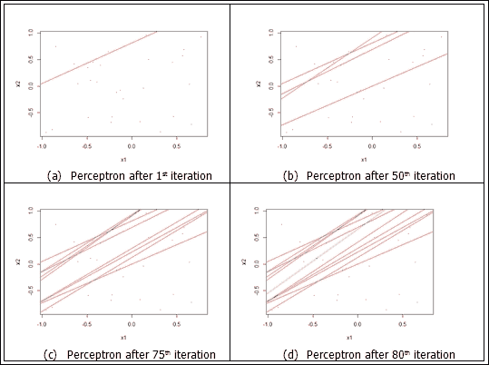
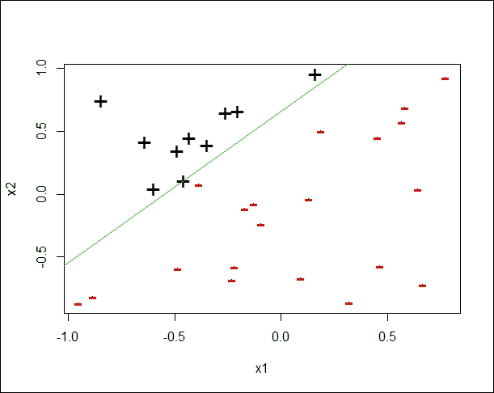
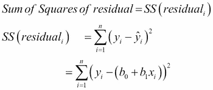
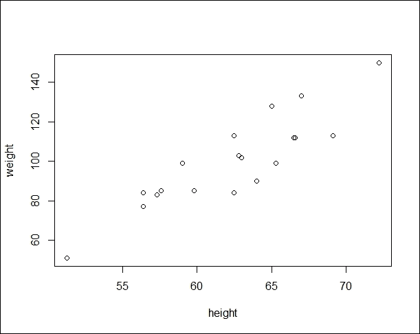
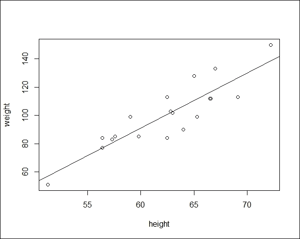
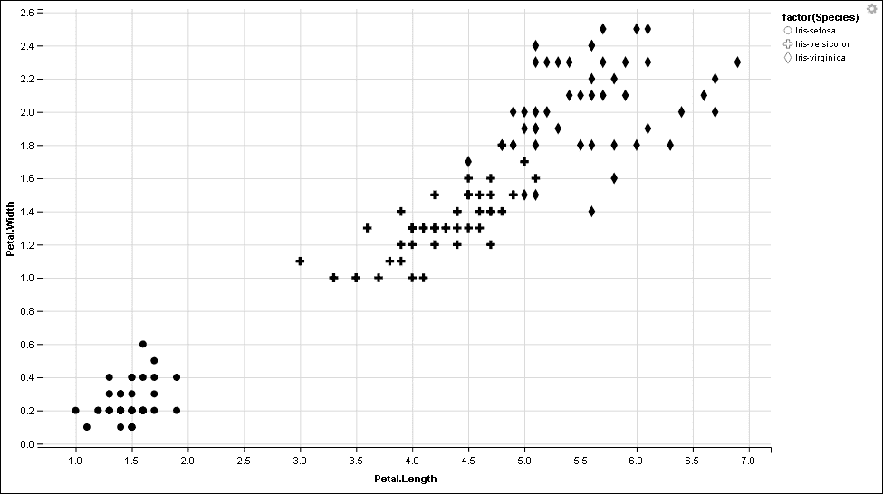
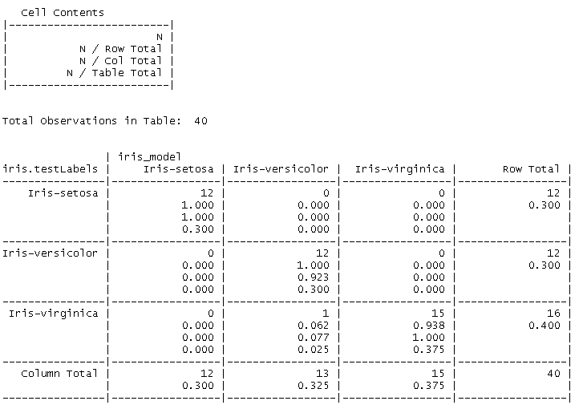
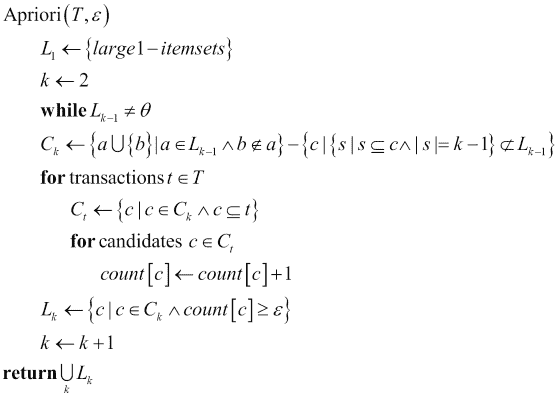

# 二、让我们帮助机器学习

当你第一次听到机器学习时，它听起来更像是科幻电影中的一个花哨词，而不是科技行业的最新趋势。与普通人谈论它，他们的反应要么是对这个概念普遍感到好奇，要么是对智能机器以某种终结者-天网的方式接管我们的世界感到谨慎和恐惧。

我们生活在一个数字时代，每时每刻都有各种各样的信息呈现在我们面前。正如我们将在本章和接下来的章节中看到的，机器学习是一种喜欢数据的东西。事实上，最近对该领域的大肆宣传和兴趣不仅受到计算技术进步的推动，还受到每秒钟生成的数据量的指数增长的推动。最新的数据表明，每天大约有 2.5 万亿字节的数据(也就是 2.5 后跟 18 个 0)！

### 注意

**趣闻**:每分钟有超过 300 小时的视频数据上传到 YouTube

来源:[https://www-01 . IBM . com/software/data/big data/what-is-big-data . html](https://www-01.ibm.com/software/data/bigdata/what-is-big-data.html)

深呼吸，四处看看。你周围的一切每时每刻都在产生各种各样的数据；你的电话，你的汽车，交通信号，全球定位系统，恒温器，天气系统，社交网络，等等等等！数据无处不在，我们可以用它做各种有趣的事情，帮助系统学习。听起来很有趣，让我们开始机器学习之旅。通过本章，我们将涵盖:

*   理解机器学习
*   机器学习中的算法及其应用
*   算法家族:监督的和非监督的

# 了解机器学习

难道我们没有被教导计算机系统必须被编程来完成特定的任务吗？他们可能在做事情上快一百万倍，但是他们必须被编程。我们必须对每一步进行编码，只有这样这些系统才能工作并完成任务。那么机器学习的概念是不是一个非常矛盾的概念？

最简单地说，机器学习指的是一种教会系统学习完成某些任务的方法，例如学习一种功能。听起来简单，但有点混乱，难以消化。令人困惑是因为我们对系统(特别是计算机系统)工作方式的看法和我们学习的方式是两个几乎没有交集的概念。它甚至更难消化，因为学习虽然是人类与生俱来的能力，却难以用语言表达，更不用说教给系统了。

那什么是机器学习？在我们试图回答这个问题之前，我们需要理解，在哲学层面上，它不仅仅是一种编程方式。机器学习是很多东西。

有许多方法可以描述机器学习。从上一章给出的高层次定义继续，让我们回顾一下 Tom Mitchell 在 1997 年给出的定义:

> *“如果由 P 测量的计算机程序在 T 上的性能随着经验 E 而提高，则称该计算机程序从关于某个任务 T 和某个性能测量 P 的经验 E 中学习。”*

### 注

**汤姆·米切尔教授简介**

他出生于 1951 年，是美国计算机科学家，也是卡耐基梅隆大学(CMU)的教授。他也是 CMU 大学机器学习系主任。他因在机器学习、人工智能和认知神经科学领域的贡献而闻名。他是人工智能促进协会等各种机构的成员。

现在让我们借助一个例子来理解这个简洁而有力的定义。假设我们想要建立一个预测天气的系统。对于当前的例子，系统的任务(T)是预测某个地方的天气。为了完成这样的任务，它需要依靠过去的天气信息。我们将把它称为经验 e。它的性能(P)是根据它在任何一天预测天气的好坏来衡量的。因此，我们可以概括为，如果一个系统利用过去的信息(或经验 E)更好地预测天气(或任务 T )(或提高其性能 P ),那么它已经成功地学会了如何预测天气。

正如前面的例子所示，这个定义不仅有助于我们从工程的角度理解机器学习，还为我们提供了量化术语的工具。这个定义有助于我们理解这样一个事实，即学习一个特定的任务需要理解和处理经验形式的数据。它还提到，如果一个计算机程序学习，它的性能会随着经验的增加而提高，这与我们学习的方式非常相似。


# 机器学习中的算法

到目前为止，我们已经对机器学习有了抽象的理解。我们理解机器学习的定义，即当任务 T 的性能 P 随之提高时，计算机程序可以利用经验 E 形式的数据来学习任务 T。我们还看到了机器学习与传统编程范式的不同之处，因为我们不会对每一步都进行编码，而是让程序形成对问题空间的理解，并帮助我们解决问题。看到这样一个程序就在我们面前工作是相当令人惊讶的。

一直以来，当我们学习机器学习的概念时，我们把这个神奇的计算机程序视为一个神秘的黑匣子，为我们学习和解决问题。现在是我们揭开谜底的时候了，看看引擎盖下，看看这些神奇的算法的辉煌。

我们将从机器学习中一些最常用和最广泛使用的算法开始，看看它们的复杂性、用法和必要的数学知识。通过这一章，你将被介绍到不同的算法家族。这个列表绝不是详尽无遗的，即使算法将被详细解释，对它们的深入理论理解也超出了本书的范围。书籍、在线课程、博客等形式的材料随处可见。

## 感知器

这就像机器学习宇宙的`Hello World` 算法。它可能是最容易理解和使用的，但它的功能丝毫不减。

由 Frank Rosenblatt 于 1958 年发表的感知器算法获得了很多关注，因为它保证在可分离的数据集中找到分隔符。

感知器是一种函数(或者更准确地说是一种简化的神经元)，它将一个实数向量作为输入，并生成一个实数作为输出。

数学上，感知器可以表示为:


其中，`w1,…,wn`是权重，`b`是称为偏差的常数，`x1,…,xn`是输入，`y`是函数`f`的输出，该函数称为激活函数。

算法如下:

1.  初始化权重向量`w`并将`b`偏向小随机数。
2.  基于函数`f`和矢量`x`计算输出矢量`y`。
3.  更新权重向量`w`和偏置`b`以抵消误差。
4.  重复第 2 步和第 3 步，直到没有错误或者错误降到某个阈值以下。

该算法试图找到一个分隔符，该分隔符通过使用称为训练数据集的标记数据集将输入分成两类(训练数据集对应于上一节中机器学习的定义中所述的经验 E)。该算法从给权重向量`w`和偏差`b`分配随机权重开始。然后，它基于函数`f`处理输入，并给出一个向量`y`。然后将该生成的输出与来自训练数据集的正确输出值进行比较，并分别对`w`和`b`进行更新。为了理解权重更新过程，让我们考虑一个点，比如说`p1`，它具有正确的输出值`+1`。现在，假设如果感知器将`p1`错误分类为`-1`，它更新权重`w`并偏置`b`以在`p1`的方向上少量移动感知器(移动受学习速率限制，以防止突然跳跃)，以便正确分类。当算法找到正确的分隔符时，或者当输入分类误差低于某个用户定义的阈值时，算法停止。

现在，让我们在一个小例子的帮助下看看这个算法是如何工作的。

为了让算法工作，我们需要一个线性可分的数据集。让我们假设数据是由以下函数生成的:


根据前面的等式，正确的分隔符将为:


使用 R 中均匀分布的数据生成输入向量`x`的过程如下:

```r

#30 random numbers between -1 and 1 which are uniformly distributed

x1 <- runif(30,-1,1) 

x2 <- runif(30,-1,1)

#form the input vector x

x <- cbind(x1,x2)

```

现在我们有了数据，我们需要一个函数将它分类到两个类别中的一个。

```r

#helper function to calculate distance from hyperplane

calculate_distance = function(x,w,b) {

 sum(x*w) + b

}

#linear classifier

linear_classifier = function(x,w,b) {

distances =apply(x, 1, calculate_distance, w, b)

return(ifelse(distances < 0, -1, +1))

}

```

辅助函数`calculate_distance`计算每个点离分隔符的距离，而`linear_classifier`将每个点分类为属于类别`-1`或类别`+1`。

感知器算法然后使用前面的分类器函数使用训练数据集找到正确的分离器。

```r

#function to calculate 2nd norm

second_norm = function(x) {sqrt(sum(x * x))}

#perceptron training algorithm

perceptron = function(x, y, learning_rate=1) {

w = vector(length = ncol(x)) # initialize w

b = 0 # Initialize b

k = 0 # count iterations

#constant with value greater than distance of furthest point

R = max(apply(x, 1, second_norm)) 

incorrect = TRUE # flag to identify classifier

#initialize plot

plot(x,cex=0.2)

#loop till correct classifier is not found

while (incorrect ) {

 incorrect =FALSE 

 #classify with current weights

 yc <- linear_classifier(x,w,b)

 #Loop over each point in the input x

 for (i in 1:nrow(x)) {

 #update weights if point not classified correctly

 if (y[i] != yc[i]) {

 w <- w + learning_rate * y[i]*x[i,]

 b <- b + learning_rate * y[i]*R^2

 k <- k+1

 #currect classifier's components

 # update plot after ever 5 iterations

 if(k%%5 == 0){

 intercept <- - b / w[[2]]

 slope <- - w[[1]] / w[[2]]

 #plot the classifier hyper plane

 abline(intercept,slope,col="red")

 #wait for user input

 cat ("Iteration # ",k,"\n")

 cat ("Press [enter] to continue")

 line <- readline()

 }

 incorrect =TRUE

 }

 }

}

s = second_norm(w)

#scale the classifier with unit vector

return(list(w=w/s,b=b/s,updates=k))

}

```

现在是时候训练感知器了！

```r

#train the perceptron

p <- perceptron(x,Y)

```

该图将如下所示:



感知器努力寻找正确的分类器。正确的分类器以绿色显示

前面的图显示了感知器的训练状态。每个不正确的分类器都用红线显示。如所示，感知机在找到绿色标记的正确分类器后结束。

最终分离器的放大视图如下所示:

```r

#classify based on calculated 

y <- linear_classifier(x,p$w,p$b)

plot(x,cex=0.2)

#zoom into points near the separator and color code them

#marking data points as + which have y=1 and – for others

points(subset(x,Y==1),col="black",pch="+",cex=2)

points(subset(x,Y==-1),col="red",pch="-",cex=2)

# compute intercept on y axis of separator

# from w and b

intercept <- - p$b / p$w[[2]]

# compute slope of separator from w

slope <- - p$w[[1]] /p$ w[[2]]

# draw separating boundary

abline(intercept,slope,col="green")

```

图看起来像下图所示的:



感知器找到的正确分类器功能


# 算法家族

在机器学习领域有大量的算法，并且每年都有更多的算法被发明出来。在这个领域有大量的研究，因此算法的列表也越来越多。这也是一个事实，越多的算法被使用，越多的改进被发现。机器学习是工业界和学术界携手并进的一个领域。

但是，正如《蜘蛛侠》被告知*拥有强大的力量就意味着巨大的责任*一样，读者也应该理解眼前的责任。有这么多算法可用，有必要了解它们是什么，它们适合在哪里。一开始可能会感到不知所措和困惑，但那是因为将他们归类到家庭中会有所帮助。

机器学习算法可以以多种方式分类。最常见的方式是将它们分组为有监督学习算法和无监督学习算法。

## 监督学习算法

监督学习指的是在称为训练数据集的预定义数据集上训练的算法。训练数据集通常是由输入元素和期望的输出元素或信号组成的二元元组。一般来说，输入元素是一个矢量。监督学习算法使用训练数据集来产生期望的函数。如此产生(或者更确切地说是推断)的函数然后被用来正确地映射新数据，更好地称为测试数据。

已经学习好的算法将能够以合理的方式正确地确定看不见的数据的输出。这就带来了泛化和过拟合的概念。

简而言之，一般化指的是这样的概念，其中算法基于(有限的)训练数据来一般化期望的函数，以便以正确的方式处理看不见的数据。过度拟合完全是一般化的相反概念，其中算法推断出一个函数，使得它精确地映射到训练数据集(包括噪声)。当对照新的/看不见的数据检查由算法学习的函数时，这可能导致巨大的误差。

泛化和过度拟合都围绕着输入数据中的随机误差或噪声。当一般化试图最小化噪声的影响时，过度拟合也通过拟合噪声来达到相反的效果。

使用监督方法解决的问题可分为以下步骤:

1.  **准备训练数据**:数据准备是所有机器学习算法最重要的一步。由于监督学习利用带标签的输入数据集(由给定输入的相应输出组成的数据集)，这一步变得更加重要。这些数据通常由人类专家或通过测量来标注。
2.  **准备模型**:模型是输入数据集和学习模式的表示。模型表示受输入特征和学习算法本身等因素的影响。推断函数的准确性也取决于这种表示是如何形成的。
3.  **选择一种算法**:根据正在解决的问题和输入的信息，然后选择一种算法来学习和解决问题。
4.  **检查并微调**:这是一个迭代步骤，对输入数据集运行算法，并微调参数，以达到所需的输出水平。然后在测试数据集上测试该算法，以评估其性能并测量误差。

在受监督的学习中，有两个主要的子类别:

1.  **基于回归的机器学习**:帮助我们回答数量问题的学习算法，比如有多少？或者多少钱？输出通常是连续值。更正式地说，这些算法基于训练数据和形成的模型来预测未知/新数据的输出值。在这种情况下，输出值是连续的。线性回归、多元回归、回归树等等是一些监督回归算法。
2.  **基于分类的机器学习**:帮助我们回答客观问题或是非预测的学习算法。例如，此组件有故障吗？或者这个肿瘤会致癌吗？更正式地说，这些算法基于训练数据和形成的模型来预测未知或新数据的类别标签。**支持向量机** ( **SVM** )、决策树、随机森林等等是几种常用的监督分类算法。

让我们详细看看一些监督学习算法。

### 线性回归

正如前面提到的，回归帮助我们回答量化的问题。回归源于统计领域。研究人员使用线性关系来预测给定输入值`X`的输出值`Y`。这种线性关系称为线性回归或回归线。

数学上，线性回归表示为:


其中，`b[0]`是截距或直线与`y`轴相交的点。

`b[1]`是直线的斜率，即`y`的变化超过`x`的变化。

前面的等式与表示直线的方式非常相似，因此称为线性回归。

现在，我们如何决定哪条线适合我们的输入，以便它能很好地预测未知数据？为此我们需要一个误差度量。可以有各种误差测量；最常用的是**最小二乘法**。

在我们定义最小二乘法之前，我们首先需要了解术语残差。残差就是 Y 与拟合值的偏差。数学上:


其中，`ŷ[i]`为`y`的偏差值。

最小二乘法表明，当残差平方和最小时，模型与数据的拟合最佳。

数学上:



我们使用微积分来最小化残差的平方和，并找到相应的系数。

现在我们已经了解了线性回归，让我们举一个真实世界的例子来看看它的作用。

假设我们有与学生身高和体重相关的数据。你体内的数据科学家突然开始思考这些孩子的体重和身高之间是否有任何关系。从形式上讲，一个孩子的体重可以根据他/她给定的身高来预测吗？

要拟合线性回归，第一步是了解数据，看两个变量(`weight`和`height`)之间是否存在相关性。因为在这种情况下，我们只处理两个维度，使用散点图可视化数据将有助于我们快速理解它。这也将使我们能够确定变量是否有某种线性关系。

让我们首先准备好我们的数据，并将其与相关系数一起显示在散点图上。

```r

#Height and weight vectors for 19 children

height <- c(69.1,56.4,65.3,62.8,63,57.3,59.8,62.5,62.5,59.0,51.3,64,56.4,66.5,72.2,65.0,67.0,57.6,66.6)

weight <- c(113,84,99,103,102,83,85,113,84,99,51,90,77,112,150,128,133,85,112)

plot(height,weight)

cor(height,weight)

```

**输出:**

```r

[1] 0.8848454

```

散点图如下所示:



该图显示了体重和身高维度的数据点

前面的散点图证明了我们关于体重和身高有线性关系的直觉是正确的。这可以使用相关函数进一步确认，该函数给出了值`0.88`。

是时候为我们的数据集准备模型了！我们使用内置的实用程序`lm`或线性模型实用程序来找到系数`b[0]`和`b[1]`。

```r

#Fitting the linear model

model <- lm(weight ~ height) # weight = slope*weight + intercept

#get the intercept(b0) and the slope(b1) values

model

```

输出如下所示:


您可以使用下面的命令进行更多的试验，找出由`lm`实用程序计算的更多细节。我们鼓励你继续尝试这些。

```r

#check all attributes calculated by lm

attributes(model)

#getting only the intercept

model$coefficients[1] #or model$coefficients[[1]]

#getting only the slope

model$coefficients[2] #or model$coefficients[[2]]

#checking the residuals

residuals(model)

#predicting the weight for a given height, say 60 inches

model$coefficients[[2]]*50 + model$coefficients[[1]]

#detailed information about the model

summary(model)

```

作为最后一部分，让我们想象一下散点图本身的回归线。

```r

#plot data points

 plot(height,weight)

#draw the regression line

abline(model)

```

散点图如下图所示:



带回归计算回归线的散点图

因此，我们看到了如何识别两个变量之间的关系，以及如何使用几行代码进行预测。但是我们还没有完成。在决定是否使用线性回归之前，读者必须了解几个注意事项。

线性回归可用于预测给定输入的输出值，当且仅当:

*   散点图形成线性模式
*   它们之间的相关性中等至强(超过`0.5`或`-0.5`)

仅满足前两个条件之一的情况可能导致不正确的预测或完全无效的模型。例如，如果我们只检查相关性并发现它很强，并跳过查看散点图的步骤，那么这可能会导致无效的预测，因为当数据本身遵循曲线形状时，您可能试图拟合直线(请注意，曲线数据集也可能具有高相关值，因此会出错)。

重要的是要记住**相关性并不意味着因果关系**。简单地说，两个变量之间的相关性并不一定意味着一个导致另一个。可能有这样一种情况，原因和结果是间接相关的，因为第三个变量被称为共同变量。用来描述这个问题最常见的例子就是鞋码和阅读能力的关系。从调查数据来看(如果有！可以推断，较大的鞋码与较高的阅读能力有关，但这显然并不意味着大脚会导致良好的阅读技能得到发展。有趣的是，小孩子的脚很小，还没有被教会阅读。在这种情况下，这两个变量更准确地与年龄相关。

对于我们之前使用的体重身高比的例子，你现在应该会得出类似的结论。是的，前面的例子也有类似的谬误，但它是一个易于使用的场景。你可以随意看看周围没有这种问题的案例。

线性回归在金融领域得到应用，它被用于量化投资风险等方面。它还广泛应用于经济领域的趋势线分析等。

除了线性回归、 **logistic 回归、**逐步回归、**、**多元自适应** **回归样条** ( **MARS** )、其他的都是一些比较有监督的回归学习算法。**

### K-最近邻(KNN)

从实现和理解的角度来看，k 最近邻或 KNN 算法是最简单的算法之一。它们是另一种类型的监督学习算法，帮助我们对数据进行分类。

用“物以类聚，人以群分”这句话可以很容易地描述 KNN，也就是说，相似的东西很可能具有相似的属性。KNN 正是利用这一概念，根据数据点与其邻居的相似性来标记数据点。

形式上，KNN 可以被描述为通过将最相似的已标记数据点(或训练样本)分配给未标记(或看不见)的数据点来分类它们的过程。

KNN 是一种监督学习算法。因此，它从分类到不同类别的示例的训练数据集开始。然后，该算法选取测试数据集中的每个数据点，并基于选择的相似性度量，识别其 *k* 最近邻(其中 k 是预先指定的)。然后，该数据点被分配 k 个最近邻中的大多数的类别。

KNN 的锦囊妙计是相似性度量。有各种相似性度量可供我们使用。选择哪一个取决于问题的复杂性、数据的类型等等。欧几里德距离就是这样一种被广泛使用的度量。欧几里得距离是两点之间最短的直接路线。从数学上讲，它是这样给出的:


曼哈顿距离、余弦距离和闵可夫斯基距离是可用于查找最近邻的一些其他类型的距离度量。

KNN 算法的下一个参数是 K-最近邻中的`k`。k 的值决定了 KNN 模型对测试数据的概括程度。训练数据过拟合和欠拟合之间的平衡取决于`k`的值。稍加推敲，很容易理解，一个大的`k`会将噪声数据带来的方差影响降到最低，但同时也会破坏数据中微小但重要的模式。这个问题被称为**偏差-方差权衡**。

k 的最佳值，即使很难确定，也位于极端值`k=1`到`k=total number of training samples`之间。常见的做法是将`k`的值设置为等于训练实例的平方根，通常在 3 到 10 之间。虽然这是一种常见的做法，但是`k`的值取决于要学习的概念的复杂性和训练示例的数量。

追求 KNN 算法的下一步是准备数据。用于准备输入向量的特征应该在相似的尺度上。此步骤的基本原理是距离公式取决于要素的测量方式。例如，如果与其他要素相比，某些要素具有较大范围的值，则距离测量将由这些测量主导。将特征缩放到相似比例的方法称为**归一化**。非常像距离测量，有各种归一化方法可用。一种这样的方法是最小-最大归一化，数学上给出为:


在我们开始用我们的例子来理解 KNN 之前，让我们概述一下执行 KNN 的步骤:

1.  **收集数据和探索数据**:我们需要收集与要学习的概念相关的数据。我们还需要研究数据以了解各种特征，知道它们的值的范围，并确定类标签。
2.  **标准化数据**:如前所述，KNN 对距离测量的依赖性使得我们标准化数据以消除计算中的任何不一致或偏差变得非常重要。
3.  **创建训练和测试数据集**:由于学习一个概念并准备一个模型来概括未知数据的可接受水平非常重要，因此我们需要准备训练和测试数据集。测试数据集，即使被标记，也用于确定模型概括所学概念的准确性和能力。通常的做法是将输入样本分为三分之二和三分之一部分，分别用于训练和测试数据集。同样重要的是，这两个数据集是所有类别标签和数据点的良好混合，也就是说，这两个数据集应该是完整数据的代表性子集。
4.  **训练模型**:现在我们已经准备好了所有的东西，我们可以使用训练数据集、测试数据集、标签和`k`的值来训练我们的模型并标记测试数据集中的数据点。
5.  **评估模型**:最后一步是评估学习到的模式。在这一步中，我们确定与已知标签相比，算法对测试数据集的类别标签的预测有多好。通常为相同的情况准备一个混淆矩阵。

现在，让我们看看 KNN 的行动。眼前的问题是根据某些特征对不同种类的花进行分类。对于这个特殊的例子，我们将使用 Iris 数据集。这个数据集是默认安装的 r。

#### 收集和探索数据

第一步是收集和探索数据。让我们先收集数据。

要检查您的系统是否有所需的数据集，只需输入名称:

```r

iris

#this should print the contents of data set onto the console.

```

如果您没有可用的数据集，不要担心！您可以按如下方式下载它:

```r

#skip these steps if you already have iris on your system

iris <- read.csv(url("http://archive.ics.uci.edu/ml/machine-learning-databases/iris/iris.data"), header = FALSE)

#assign proper headers

names(iris) <- c("Sepal.Length", "Sepal.Width", "Petal.Length", "Petal.Width", "Species")

```

现在我们有了数据，是时候探索和理解它了。为了探索数据集及其属性，我们使用以下命令:

```r

#to view top few rows of data

head(iris)

```

**输出:**


```r

#to view data types, sample values, categorical values, etc

str(iris)

```

**输出:**


```r

#detailed view of the data set

summary(iris)

```

**输出:**


summary 命令帮助我们更好地理解数据。它清楚地显示了不同的属性以及`min`、`max`、`median`和其他类似的统计数据。在接下来的步骤中，我们可能需要对数据或要素进行缩放或规范化，这些将对我们有所帮助。

在第一步中，我们通常标记输入数据。因为我们当前的数据集已经被标记，所以对于这个示例问题，我们可以跳过这一步。让我们直观地看到物种是如何传播的。我们再次利用著名的散点图，但是这次我们使用一个名为`ggvis`的包。

您可以将`ggvis`安装为:

```r

install.packages("ggvis")

```

为了可视化所有 3 个物种的花瓣宽度和长度，我们使用以下代码片段:

```r

#load the package

library(ggvis)

#plot the species

iris %>% ggvis(~Petal.Length, ~Petal.Width, fill = ~factor(Species)) %>% layer_points()

```

### 注

`ggvis`包是 r 中的一个交互式图形包。它遵循一种独特的方式来表达输入以生成可视化。前面的代码片段使用管道操作符`%>%`将输入数据传递给`ggvis`，并再次使用管道操作符将输出传递给`layer_points`进行最终绘制。`~`操作符向`ggvis`表示`Petal.Length`是输入数据集(iris)中的一个变量。在[http://ggvis.rstudio.com/ggvis-basics.html](http://ggvis.rstudio.com/ggvis-basics.html)阅读更多关于`ggvis`的。



前面的图清楚地显示出**鸢尾花**的花瓣宽度和长度之间的相关性很高，而其他两个物种的相关性稍低。

### 注意

试着观察萼片宽度和萼片长度，看看你是否能发现任何关联。

#### 数据规范化

下一步是标准化数据，以便所有的特征都在相同的比例上。从数据探索步骤可以看出，所有属性的值或多或少都在一个可比较的范围内。但是，为了这个例子，让我们写一个最小-最大归一化函数:

```r

#normalization function

min_max_normalizer <- function(x)

{

num <- x - min(x) 

denom <- max(x) - min(x)

return (num/denom)

}

```

请记住，规范化不会改变数据，它只是缩放数据。因此，即使我们的数据不需要规范化，这样做也不会造成任何伤害。

### 注意

**注**

在接下来的步骤中，为了输出清晰，我们将使用非标准化数据。

```r

#normalizing iris data set

normalized_iris <- as.data.frame(lapply(iris[1:4], min_max_normalizer))

#viewing normalized data

summary(normalized_iris)

```

以下是标准化数据框的摘要:


#### 创建训练和测试数据集

既然我们已经规范化了数据，我们可以将它分成训练和测试数据集。我们将遵循通常的将数据一分为二的三分之二三分之一规则。如前所述，两个数据集都应该代表整个数据，因此我们需要选择适当的样本。我们将利用 R 的`sample()`函数来准备样品。

```r

#checking the data constituency

table(iris$Species)

```

**输出:**


```r

#set seed for randomization

set.seed(1234)

# setting the training-test split to 67% and 33% respectively

random_samples <- sample(2, nrow(iris), replace=TRUE, prob=c(0.67, 0.33))

# training data set

iris.training <- iris[

random_samples ==1, 1:4] 

#training labels

iris.trainLabels <- iris[

random_samples ==1, 5]

# test data set

iris.test <- iris[

random_samples ==2, 1:4]

#testing labels

iris.testLabels <- iris[

random_samples ==2, 5]

```

#### 从数据中学习/训练模型

一旦我们在训练和测试数据集中准备好了数据，我们就可以进行下一步，使用 KNN 从数据中学习。R 中的 KNN 实现存在于类库中。KNN 函数接受以下输入:

*   `train`:包含训练数据的数据框。
*   `test`:包含测试数据的数据框。
*   `class`:包含类别标签的向量。也称为因子向量。
*   `k`:k 近邻的值。

对于当前情况，让我们假设`k`的值为`3`。奇数通常擅长打破平局。KNN 被处决为:

```r

#setting library

library(class)

#executing knn for k=3

iris_model <- knn(train = iris.training, test = iris.test, cl = iris.trainLabels, k=3)

#summary of the model learnt

iris_model

```

**输出:**


快速扫描输出显示，除了 virginica 的一个杂色标签之外，其他都是正确的。虽然这个很容易发现，但是还有更好的方法来评估这个模型。

#### 评估模型

这将我们带到的最后一步，我们评估模型。我们通过准备一个混淆矩阵或交叉表来帮助我们理解预测的标签相对于测试数据的已知标签是怎样的。r 为我们提供了另一个名为`CrossTable()`的实用函数，它存在于`gmodels`库中。让我们看看输出:

```r

#setting library

library(gmodels)

#Preparing cross table

CrossTable(x = iris.testLabels, y = iris_model, prop.chisq=FALSE)

```

**输出:**



从前面的输出中，我们可以得出结论，模型将 virginica 的一个实例标记为 versicolor，而所有其他测试数据点都被正确标记。这也有助于我们推断`k=3`的选择确实足够好。我们建议读者用不同的`k`值来尝试相同的例子，看看结果的变化。

KNN 是一种简单而强大的算法，它对基础数据分布不做任何假设，因此可用于要素和类之间的关系复杂或难以理解的情况。

缺点是，KNN 是一种资源密集型算法，因为它需要大量的内存来处理数据。对距离测量和缺失数据的依赖需要额外的处理，这是该算法的另一个开销。

尽管有其局限性，KNN 仍被用于许多现实生活中的应用，如文本挖掘、预测心脏病发作、预测癌症等。KNN 在金融和农业领域也有应用。

决策树、随机森林和支持向量机是一些最流行和最广泛使用的监督分类算法。

## 无监督学习算法

无监督学习指的是自动学习概念的算法。现在我们已经熟悉了监督学习的概念，让我们利用我们的知识来理解无监督学习。

与需要标记输入训练数据集的监督学习算法不同，无监督学习算法的任务是在没有任何标记训练数据集的情况下，在数据中查找关系和模式。这些算法处理输入数据以挖掘规则、检测模式、总结和分组数据点，这有助于获得有意义的见解，并向用户描述数据。在无监督学习算法的情况下，没有训练和测试数据集的概念。相反，如前所述，输入数据被分析并用于导出模式和关系。

与监督学习类似，非监督学习算法也可以分为两大类:

*   **基于关联规则的机器学习**:这些算法挖掘输入数据来识别模式和规则。规则解释数据集中变量之间的有趣关系，以描述数据中出现的频繁项集和模式。这些规则反过来有助于从庞大的数据仓库中发现对任何企业或组织都有用的见解。流行的算法包括 Apriori 和 FP-Growth。
*   **基于聚类的机器学习**:类似于基于监督学习的分类算法，这些算法的主要目标是仅使用从输入数据单独导出的特征，而不使用其他外部信息，将输入数据点聚类或分组到不同的类或类别中。与分类不同，聚类中的输出标签是未知的。一些流行的聚类算法包括 k-means、k-medoids 和层次聚类。

让我们看看一些无监督学习算法。

### Apriori 算法

这个风靡全球的算法是由 Agarwal 和 Srikant 在 1993 年提出的。该算法旨在处理事务性数据，其中每个事务都是一组项或项集。算法简而言之就是识别项目集，这些项目集是数据集中至少 C 个事务的子集。

形式上，让`┬`是一组项目，`D`是一组事务，其中每个事务`T`是`┬`的子集。数学上:


那么关联规则是形式`X → Y`的隐含，其中事务`T`包含`X`作为`┬`的子集，并且:


如果包含`X`的`D`中的`c%`事务也包含`Y`，则在具有置信因子`c`的事务集合`D`中，蕴涵`X → Y`成立。如果`D`中事务的`s%`包含`X U Y`，则称关联规则`X → Y`的支持因子为`s`。因此，给定一组交易`D`，识别关联规则的任务意味着生成所有这样的规则，这些规则具有大于用户定义的阈值的置信度和支持度，该阈值被称为`minsup`(用于最小支持度阈值)和`minconf`(用于最小置信度阈值)。

大体上，该算法分两步工作。第一个是识别出现次数超过预定阈值的项目集。这样的项目集称为**频繁项目集**。第二步是从识别出的满足最小置信度和支持度约束的频繁项集生成关联规则。

使用以下伪代码可以更好地解释这两个步骤:



现在让我们来看看算法的运行。考虑中的数据集是 UCI 机器学习知识库的`Adult`数据集。该数据集包含具有性别、年龄、婚姻状况、国籍和职业等属性的人口普查数据，以及工作阶级、收入等经济属性。我们将使用这个数据集来确定人口普查信息和个人收入之间是否存在关联规则。

Apriori 算法存在于`arules`库中，所考虑的数据集被命名为`Adult.`,它也可用于默认的 R 安装。

```r

# setting the apriori library

library(arules)

# loading data

data("Adult");

```

是时候探索我们的数据集并查看一些样本记录了:

```r

# summary of data set

summary(Adult);

# Sample 5 records

inspect(Adult[0:5]);

```

我们知道数据集包含一些有 115 列的`48k`事务。我们还可以根据项目集的大小获得关于项目集分布的信息。`inspect`函数让我们得以窥见示例事务以及每一列所包含的值。

现在，让我们建立一些关系:

```r

# executing apriori with support=50% confidence =80%

rules <- apriori(Adult, parameter=list(support=0.5, confidence=0.8,target="rules"));

# view a summary

summary(rules);

#view top 3 rules

as(head(sort(rules, by = c("confidence", "support")), n=3), "data.frame")

```

Apriori 算法使用`Adult`数据集作为输入来识别事务数据中的规则和模式。在查看概要时，我们可以看到该算法成功地识别出分别满足`50%`和`80%`的支持度和置信度约束的`84`规则。现在我们已经确定了规则，让我们看看它们是什么:


规则形式为`X→ Y`，其中`X`为`lhs`或左侧，`Y`为`rhs`或右侧。前面的图像也显示了相应的置信度和支持值。从输出中我们可以推断，如果人们全职工作，那么他们面临资本损失的机会几乎为零(置信因子 95.8%)。另一个规则有助于我们推断，为私人雇主工作的人也几乎没有面临资本损失的机会。这种规则可以用来制定社会福利、经济改革等方面的政策或计划。

除了 Apriori 之外，还有其他关联规则挖掘算法，如 FP Growth、ECLAT 和许多其他算法，这些算法多年来已被用于各种应用。

### K-Means

在无监督聚类算法的世界中，最简单和最广泛使用的算法是 K-Means。正如我们最近看到的，无监督学习算法在没有任何先验标签或训练的情况下处理输入数据以得出模式和关系。聚类算法尤其有助于我们对数据点进行聚类或划分。

根据定义，聚类是指将对象分组到组中的任务，使得一个组中的元素比其他组中的元素彼此更相似。K-Means 以无监督的方式做同样的事情。

数学上，给定一组`n`观察值`{x1,x2,…,xn}`，其中每个观察值是一个 *d* 维向量，该算法试图通过最小化目标函数将这些 *n* 观察值划分为`k (≤ n)`集合。

与其他算法一样，可以有不同的目标函数。为了简单起见，我们将使用被称为**的最广泛使用的函数，其具有聚类平方和**或 **WCSS 函数**。


这里的`μ[i]`是分区`S[i]`中点数的平均值。

该算法遵循简单的两步迭代过程，其中第一步称为分配步骤，随后是更新步骤。

*   通过设置`k`分区的方式进行初始化:`m1,m2…mk`
*   直到均值不变或者变化低于某个阈值:

    1.  **分配步骤**:将每个观测值分配到一个其带内聚类平方和值最小的分区，也就是将该观测值分配到一个其均值最接近该观测值的分区。
    2.  **更新步骤**:对于`1 to k`中的`i`，基于该分区中的所有观测值更新每个均值`mi`。

该算法可以使用不同的初始化方法。最常见的是 Forgy 和随机划分方法。我鼓励你多读读这些。此外，除了输入数据集之外，该算法还需要`k`的值，即要形成的聚类数。最佳值可能取决于各种因素，通常根据使用案例来决定。

让我们看看算法的运行。

我们将再次使用我们已经用于 KNN 算法的虹膜花数据集。对于 KNN，我们已经标记了物种，然后尝试学习并将测试数据集中的数据点分类到正确的类别中。

使用 K-Means，我们还旨在实现相同的数据划分，但没有任何标记的训练数据集(或监督)。

```r

# prepare a copy of iris data set

kmean_iris <- iris

#Erase/ Nullify species labels

kmean_iris$Species <- NULL

#apply k-means with k=3

(clusters <- kmeans(kmean_iris, 3))

```

现在我们有了来自`k-means`的输出，让我们看看它如何很好地划分了不同的物种。记住，`k-means`没有分区标签，只是简单地将数据点分组。

```r

# comparing cluster labels with actual iris  species labels.

table(iris$Species, clusters$cluster)

```

**输出:**


输出显示物种 setosa 匹配集群标签 2，versicolor 匹配标签 3，依此类推。从视觉上，很容易看出数据点是如何聚集的:

```r

# plot the clustered points along sepal length and width

plot(kmean_iris[c("Sepal.Length", "Sepal.Width")], col=clusters$cluster,pch = c(15,16,17)[as.numeric(clusters$cluster)])

points(clusters$centers[,c("Sepal.Length", "Sepal.Width")], col=1:3, pch=8, cex=2)

```


K-Means 在计算机图形学等领域得到广泛应用，用于颜色量化；它与其他算法相结合，用于自然语言处理、计算机视觉等。

`k-means`有不同的变体(R 本身提供三种不同的变体)。除了 k-means 之外，其他无监督聚类算法有 k-medoids、层次聚类等。


# 摘要

通过这一章，我们正式定义了机器学习的概念。我们谈到了机器学习算法实际上是如何学习一个概念的。我们触及了各种其他概念，如泛化、过度拟合、训练、测试、频繁项目集等等。我们还学习了机器学习算法的家族。我们通过不同的机器学习算法来理解引擎盖下的魔法，以及它们的应用领域。

有了这些知识，我们就可以解决一些现实世界的问题，拯救世界。

接下来的几章基于本章中的概念来解决特定的问题和用例。准备好行动吧！