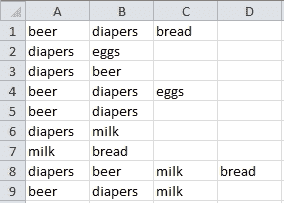
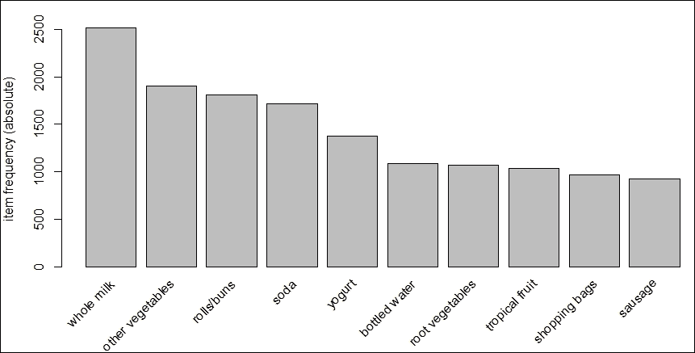
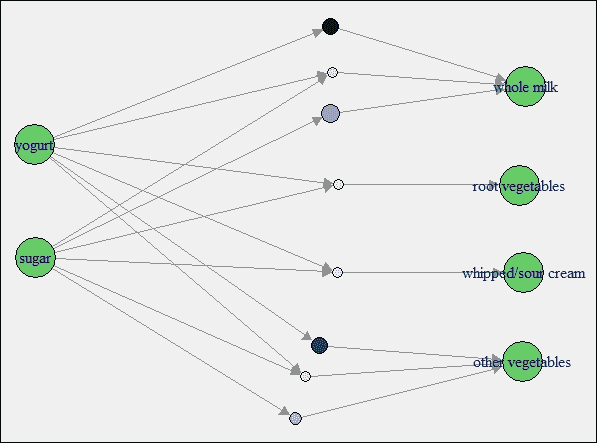

<title>Chapter 3. Predicting Customer Shopping Trends with Market Basket Analysis</title> 

# 第三章。用购物篮分析预测顾客购物趋势

经过前面的[第二章](ch02.html "Chapter 2. Let's Help Machines Learn")，*让我们帮助机器学习*，你现在知道如何让机器从观察和数据点中学习，以便它们可以找出有趣的模式、趋势，并做出预测。在这一章中，我们将讨论当今零售商、商店和电子商务市场所面临的复杂问题之一。随着现代技术和创新的出现，购物已经成为一种相对愉快和令人愉快的体验，我们可以在家中舒适地享受这种体验，甚至不用冒险去实际的商店，使用提供购物设施的网络或专用应用程序。由于零售商、商店、市场和卖家数量庞大，竞争相当激烈，为了吸引客户，他们必须使用他们可以从消费者那里收集的关于他们个人特征和购物模式的所有数据，并使用机器学习技术来尝试根据每个客户尽可能个性化购物体验。

你可能想知道机器学习如何帮助为每个用户提供个性化的购物体验！答案在于两件事:数据和算法。使用这两者的组合，零售商能够计算出消费者购买的最流行的商品、消费者的好恶、销售上升和下降的高峰时间、人们倾向于购买的产品的趋势组合，以及其他零售商为相同产品提供的产品评论和价格。零售商拥有自己的数据科学团队，他们汇总这些数据并应用各种机器学习算法来分析趋势产品，并构建推荐引擎来预测客户最有可能购买的产品，并根据客户的兴趣和购物历史向客户提供建议。

在本章中，我们将关注基于产品的推荐，其中算法关注客户购物交易数据，我们观察客户购买的产品组合的常见模式，以检测和预测客户最有可能购买的产品以及他们过去购买的产品。本章中我们将重点介绍的主要技术如下:

*   产品权变矩阵评估
*   频繁项目集生成
*   关联规则挖掘

然而，使用关联规则和模式挖掘的趋势分析有其自身的局限性。它们不能根据顾客的兴趣、购买的产品和评价等属性为每个顾客提供更个性化的购物体验。我们将在下一章中讨论这一点，我们将重点关注基于用户的协同过滤等算法，这种算法在构建推荐引擎时会同时考虑基于产品和基于用户的功能。

最有趣的是，所有零售商和电子商务市场，如 Staples、Macy's、Target、Amazon、Flipkart、阿里巴巴、Rakuten、Lazada 和许多其他公司，都有自己的数据科学团队，可以解决各种问题，包括我们之前讨论的问题。他们利用从客户购物交易、产品库存、交付、SLA、评论、广告、点击率、跳出率、定价数据和许多其他来源生成的所有数据。他们处理这些数据，并将其输入到基于机器学习算法的引擎中，以生成数据驱动的见解，从而增加企业的销售额和利润。现在，这无疑是一个目前市场上炙手可热的领域。现在让我们进一步研究一些机器学习技术和算法，这些技术和算法帮助他们做出如此伟大的数据驱动决策！

# 检测和预测趋势

在这一部分，我们将谈论我们所说的趋势到底是什么，以及零售商如何发现和预测这些趋势。基本上，零售环境中的趋势可以定义为一段时间内发生的特定模式或行为。这可能涉及一种产品或产品组合在很短的时间内销售一空，甚至相反。一个简单的例子是，一部最畅销的智能手机甚至在任何电子商务市场上架之前就被预订并脱销，或者是一种产品组合，如常见于顾客购物篮或购物车中的经典啤酒和尿布组合！

我们如何开始分析购物车，或者开始检测和预测购物趋势。就像我之前提到的，我们可以通过正确的数据和算法来实现这一点。让我们假设我们领导着一家大型零售连锁店。首先，我们必须跟踪我们的商店和网站上发生的每一笔交易。我们需要收集与购买的商品、缺货、一起购买的商品组合以及客户交易相关的数据点。

一旦我们有了这些数据，我们就可以开始处理、规范化这些数据，并将其聚合为机器可读的格式，这些格式可以很容易地进行操作，并输入到机器学习算法中，根据购物趋势进行产品推荐。我们可以通过使用正确的数据结构和构造来实现这一点，我们在[第 1 章](ch01.html "Chapter 1. Getting Started with R and Machine Learning")、*R 和机器学习入门*中学到了这些。有几种机器学习算法可以帮助我们分析购物交易数据，并根据购物趋势推荐产品。这些算法所处的主要范式通常被称为 **购物篮分析**。有趣的是，这些算法使用统计和机器学习概念，如概率、支持度、置信度、lift、模式检测等，来确定哪些是经常一起购买的商品，这有助于我们分析购物交易，并检测和预测趋势。如果我们经营的是零售连锁店，这最终会帮助我们向顾客推荐产品，并明智地做出商业决策！请注意，我们将在这两个算法中使用的唯一数据是纯粹的基于购物交易的数据。

在我们开始构建算法来分析购物车和交易之前，让我们先来看看市场篮子分析实际上意味着什么，以及与之相关的概念。当我们使用这些概念来实现机器学习算法来解决现实世界的问题时，这将会派上用场。

<title>Market basket analysis</title> 

# 购物篮分析

市场购物篮分析由一些建模技术组成，零售商和电子商务市场通常使用这些技术来分析购物车和交易，以找出客户购买最多的商品、他们购买的商品种类、特定商品销售最多的旺季是什么，等等。在这一章中，我们将关注基于物品的交易模式，以检测和预测人们正在购买和最有可能购买的物品。让我们先来看看购物篮分析的正式定义，然后我们再来看看核心概念、度量标准和与之相关的技术。最后，我们将总结如何实际使用这些结果来制定数据驱动的决策。

## 购物篮分析实际上是什么意思？

购物篮分析通常包括几种基于简单原则的建模技术，即购物时，如果您购买了某组商品(在机器学习行话中也称为项目集)，您可能会购买其他特定商品或该项目集的商品。我们分析人类的购物模式，并应用统计技术来产生频繁项目集。这些项目集包含人们根据过去的购物历史最有可能一起购买的项目组合。

项目集的一个简单例子是人们经常在市场上购买啤酒和尿布。项目集可以描述为`{ beer, diapers }`。频繁项集是由比平常出现得更频繁的项集来表示的，并由称为支持度的度量来指定，我们将在后面讨论这一点。因此，根据前面的例子，你可以说，如果我买啤酒，我也最有可能买`diapers`，并向我推荐该产品。我们还可以通过分析购物来在这些项目集之上构建项目关联规则。关联规则的一个例子可以通过使用符号`{ beer, diapers } -> { milk }`的项目集来表示，这将表明如果我一起购买啤酒和尿布，我很可能也一起购买牛奶！

## 核心概念和定义

既然你已经知道了购物篮分析实际上是做什么的，让我们来看看算法和技术中广泛使用的一些定义和概念。

**交易数据集**表示每天/每周记录顾客购物交易的数据库或数据集，由顾客一起购买的各种物品组成。我们将举一个交易数据集的例子，在本章后面的算法中我们也会用到它。考虑下面的数据集，它也可以从本章的`shopping_transaction_log.csv`文件中获得。数据如下图所示:



前面数据集中的每个像元也被定义为一个项。项目也用符号 In 表示，其中`n`表示`n-th`项目编号，在正式定义中，以及在构建算法伪代码或手工进行一些计算时，示例用花括号括起来。例如，单元格组合`(1, A)`表示项目`I1`，其值被描述为`{ beer }`。

**项目集**定义为在任何购物交易中一起购买的项目集或项目组。因此，基于交易，这些项目被称为同时发生。我们将项目集表示为`ISn`，其中 *n* 表示`n-th`项目集编号。项目集值将被括在大括号中。前面数据集中的每一行都表示一个特定的事务，项的组合构成了项集。项目集`IS1`由`{ beer, diapers, bread }`描述。

**关联** **规则**或公正规则是具有**左侧** ( **LHS** )和右侧**右侧** ( **RHS** )的陈述，并且表明如果我们有 LHS 上的商品要购买，我们也可能有兴趣购买 RHS 商品。这表示项目集是相互关联的。它们被标记为`ISx → ISy`，这意味着如果我的购物车中有项目集`x`，我也会对购买项目集`y`感兴趣。一个示例规则可以是`{ beer } → { diapers }`，它表示如果我的购物车中有啤酒，我也有可能会购买尿布！我们现在将看到一些决定如何测量频繁项目集和关联规则强度的度量标准。

一个项集的**频率**基本上就是一个特定的项集在所有事务的列表中出现的次数。请注意，项目集可以是事务中较大项目集的子集，并且仍然被计数，因为该子集表示包含特定项目集的项目集是与一些其他产品一起购买的。我们可以将其表示为`f(ISn)`，其中`ISn`是一个特定的项目集，函数`f( )`给出了该项目集在整个基于事务的数据集中的出现频率。以我们之前的数据集为例，`f(IS{beer, diapers})`是 6，这表明在我们的数据集中的所有交易数据中,`IS{beer, diapers}`总共被购买了 6 次。

项目集的**支持**被定义为事务数据集中包含特定项目集的事务部分。基本上，它意味着项集被购买的次数除以数据集中的事务总数。可以表示为，其中`S( )`表示项集`ISn`的支持度。以我们前面的例子为例，`S(IS{beer, diapers})`是，这给了我们`66.67%`。对关联规则的支持是类似的，可以描述为，其中我们使用交集操作符来查看两个项目集在事务数据集中同时出现的频率。对我们之前定义的规则`S(IS{beer} → IS{diapers})`的支持又是或`66.67%`，因为啤酒和尿布组合的项目集总共出现了六次，正如我们之前看到的。当评估来自关联规则或频繁项目集的结果时，支持度越高越好。支持更多的是衡量规则的质量，检测过去的事务中已经发生了什么。

关联规则的**置信度**定义为，对于一个包含规则 LHS 上的项集的新事务，该事务也包含规则 RHS 上的项集的概率或可能性。规则的置信度可以描述为，其中`C( )`表示规则的置信度。请注意，由于支持度的计算涉及到将项集频率除以分母中的事务总数，因此上述等式的 RHS 最终会简化为获取分子和分母的项集频率。因此，我们得到作为获得置信度的简化公式。我们之前的规则`C(IS{beer} → IS{diapers})`的置信度是或`100%`，这意味着如果我的购物篮里有啤酒，购买尿布的概率是百分之百！这是相当高的，如果你回到数据集，你可以看到这是真的，因为对于每一个涉及啤酒的交易，我们可以看到与之相关的尿布。因此，你可以看到，作出预测和建议并不是火箭科学，而只是简单的应用数学和数据之上的统计方法。请记住，信心更多的是检测规则的质量，根据过去的交易数据预测未来会发生什么。

关联规则的**提升**定义为 LHS 和 RHS 上的两个项目集的组合的支持度除以每个项目集的支持度的乘积的比值。规则的提升可以描述为，其中`L( )`表示规则的提升。对于我们的示例规则，`L(IS{beer} → IS{diapers})`是，计算为，给出了`1.125`的值，这相当不错！一般来说，规则的提升是评估规则质量的另一个度量。如果 lift 为`> 1`，则表明 LHS 中项目集的存在导致客户也将购买 RHS 上的项目集的概率增加。这是确定项目集关联以及哪些项目影响人们购买其他项目的另一个非常重要的方法，因为如果 lift 有一个值`= 1`，这意味着 LHS 和 RHS 上的项目集是独立的，购买一个项目集不会影响客户购买另一个项目集。如果 lift 为`< 1`，则表明如果客户在 LHS 上有一个项集，那么在 RHS 上购买该项集的概率相对较低。

## 用于分析的技术

如果你已经被上一节的数学信息弄得不知所措，放松下来，深呼吸！你不需要记住一切，因为大多数时候，算法会为你计算一切！你需要擅长的是以正确的方式使用这些技术和算法，并解释结果以过滤出必要和有用的东西。当您稍后开始实现和应用这些技术时，前面提到的概念会对您有所帮助，我们将在本节中简要描述这些技术。我们将主要讨论本章将要探讨的三种技术。

产品权变矩阵的评估是最简单的开始方法，它更像是一种全球趋势捕捉机制，显示了在权变矩阵中一起购买的最多的产品。我们将在后面使用的 R 包`arules`有一个很好的功能，叫做 **crossTable** ，它帮助将项目对的联合出现交叉列表到一个列联矩阵中。我们将使用该矩阵来预测客户最有可能与矩阵中的其他产品一起购买哪些产品。

频繁项集的生成是从产品列联矩阵停止的地方开始的，因为它有一个严重的限制，即不能在任何时间点处理成对的产品。因此，为了进入可以有任意数量产品的项目集并从中检测模式，我们将使用机器学习构建我们自己的频繁项目集生成器！利用这一点，我们将能够获得具有特定支持值的频繁项目集，这些支持值指示可能一起购买的项目集，从而形成向客户推荐产品的基础。

最后，我们将使用出色的 Apriori 算法实现关联规则挖掘，该算法使用频繁的项集作为其规则生成过程的一部分。你已经在[第二章](ch02.html "Chapter 2. Let's Help Machines Learn")、*中看过这个演示，让我们帮助机器学习*。但是，这一次我们将使用其成熟的功能来查看产品项目集之间的关联规则，使用我们之前讨论的指标来评估规则的质量，并使用这些规则来对购物交易中的产品进行趋势预测和推荐。

## 做出数据驱动的决策

你现在知道了什么是购物篮分析，使用了什么技术，以及它们给我们带来了什么结果。请记住，市场篮分析的输出是一组在交易中频繁出现的项目或产品。现在，这种情况之所以会发生，是因为强大的支持、信心和提升增强了它的联想，顾客倾向于购买它们，或者也可能是因为零售商将商品放在一起或并排放在商店或网站上。然而，请记住，强大的关联并不总是偶然发生的，这就是零售商总是试图利用我们前面谈到的技术来促进销售。

以下是一些关键的数据驱动的决策，零售商通常倾向于根据从购物篮分析中获得的结果做出这些决策:

*   包含成对产品(如尿布和啤酒)的频繁项目集通常应该并排放置在商店中，这将使客户易于访问，他们会倾向于购买更多的产品。
*   具有大量不同项目或产品计数的频繁项目集应该放在项目集的特定类别或主题中，例如特殊的杂货组合或婴儿产品。对整个项目集提供的折扣吸引了更多的顾客。
*   当顾客浏览购物或电子商务网站时，在与项目集相关联的特定产品页面中，具有从频繁项目集或关联矩阵中获得的项目或产品的长列表的关联规则可被显示为对顾客的产品建议和推荐。应该注意的是，这些规则的提升至少要大于 1，就像我们之前讨论的那样。
*   推荐系统、定向广告和营销一切都可以建立在购物篮分析的结果之上。

这些决定如果在正确的地点和正确的时间做出，可以极大地帮助零售商提高他们的销售额并获得良好的利润。

既然我们已经对购物篮分析实际上做了什么以及它是如何工作的有了坚实的理解，我们将从为我们的第一项技术构建一个简单的算法开始，在这项技术中，我们使用基于在超市购买的热门产品的产品关联矩阵来做出产品推荐，然后继续使用 R 语言强大的机器学习功能来构建更复杂的分析器和推荐器。

<title>Evaluating a product contingency matrix</title> 

# 评估产品应急矩阵

我们将在这里做一些事情。首先，我们将通过使用基于产品对购买频率的产品关联矩阵来分析一个属于超市的小型玩具数据集。然后，我们将通过使用另一个数据集，转到基于其他指标(如支持、提升等)的权变矩阵。

我们的第一个矩阵的数据包括在超市销售的六种最受欢迎的产品，以及每种产品单独销售和与其他产品组合销售的次数。我们在一个`csv`文件中以数据表的形式获取数据，如下图所示:


为了分析这些数据，我们首先需要理解它描述了什么。基本上，每个单元格值表示产品组合的销售次数。因此，单元格组合`(1, A)`表示产品组合`(milk, milk)`，它基本上是购买牛奶的次数。另一个例子是单元格组合`(4, C)`，它类似于单元格组合`(3, D)`，指示面包和黄油一起被购买的次数。这通常也被称为列联矩阵，在我们的例子中，它是一个产品列联矩阵，因为它处理产品数据。让我们遵循我们的标准机器学习管道，获取数据，分析数据，在我们的算法上运行数据，然后获得预期的结果。

## 获取数据

这里，我们将首先使用下面的代码片段将数据集从磁盘加载到内存中。记得将`top_supermarket_transactions.csv`文件放在运行以下代码片段的同一个目录中，该代码片段也可以在本书附带的名为`ch3_product`偶发事件`matrix.R`的文件中找到。

```

> # reading in the dataset

> data <- read.csv("supermarket_transactions.csv")

> 

> # assigning row names to be same as column names

> # to build the contingency matrix

> row.names(data) <- data[[1]]

> data <- subset(data, select = c(-1))

>

> ## viewing the contingency matrix

> cat("Products Transactions Contingency Matrix")

Products Transactions Contingency Matrix

> data

```

**输出:**


## 分析和可视化数据

在这里，我们将对数据集做一些探索性分析，看看数据告诉我们什么样的故事。为此，我们将首先在下面的代码片段中查看与购买牛奶和面包相关的事务:

```

> ## Analyzing and visualizing the data

> # Frequency of products bought with milk

> data['milk', ]

 milk bread butter beer wine diapers

milk 10000  8758   5241  300  215     753

> 

> # Sorting to get top products bought with milk

> sort(data['milk', ], decreasing = TRUE)

 milk bread butter diapers beer wine

milk 10000  8758   5241     753  300  215

> 

> # Frequency of products bought with bread

> data['bread', ]

 milk bread butter beer wine diapers

bread 8758  9562   8865  427  322     353

> 

> # Sorting to get top products bought with bread

> sort(data['bread', ], decreasing = TRUE)

 bread butter milk beer diapers wine

bread  9562   8865 8758  427     353  322

```

因此，您可以看到，仅仅通过对数据列进行排序，我们就能够看到与面包或牛奶一起购买的顶级产品。当从矩阵中推荐购买顶级产品时，如果该产品已经在购物车中，我们将从推荐列表中删除该产品，因为，如果我购买面包，向我推荐面包是没有意义的。现在，我们将使用镶嵌图来显示完整的数据集。请注意，购买频率非常高的产品组合将具有高频率值，并将在镶嵌图中的显著区域显示出来。

```

> # Visualizing the data

> mosaicplot(as.matrix(data), 

+            color=TRUE, 

+            title(main="Products Contingency Mosaic Plot"),

+            las=2

+            )

```

代码生成了下面的镶嵌图，其中我们使用 color 参数应用了一个渐变，并使用`las`参数指定轴标签与轴成直角，以创建一个更清晰的图。


从前面的图中，您可以注意到，现在很容易看出哪些产品与另一种产品一起被购买了很多次。忽略相同的产品行和列值，我们可以很容易地推断出像啤酒和尿布这样的产品组合被购买得非常频繁！

### 注意

我们的啤酒和尿布组合的背景故事实际上是由沃尔玛早些时候发现的，当时他们分析了客户交易数据，发现在星期五，年轻的美国爸爸倾向于一起购买啤酒和尿布。他们会和朋友一起庆祝周末，但是，有了孩子之后，他们也要履行照顾孩子需求的基本职责。事实上，沃尔玛把啤酒和尿布并排放在商店里，他们的销售额显著上升！这就是分析和机器学习的力量，它使我们能够发现未知和意想不到的模式。

## 全球建议

现在我们将根据顾客在购物车中选择的产品推荐产品。请注意，我们将此称为全局推荐，因为这些产品推荐既不是基于关联规则，也不是基于频繁项集，我们将在后面探讨。它们完全基于产品对购买计数的全球产品应急矩阵。下面的代码片段使我们能够从矩阵中为每件商品推荐两个最佳推荐产品:

```

## Global Recommendations

cat("Recommendations based on global products contingency matrix")

items <- names(data)

for (item in items){

 cat(paste("Top 2 recommended items to buy with", item, "are: "))

 item.data <- subset(data[item,], select=names(data)[!names(data) %in% item])

 cat(names(item.data[order(item.data, decreasing = TRUE)][c(1,2)]))

 cat("\n")

}

```

这为我们提供了以下输出:

```

Top 2 recommended items to buy with milk are: bread butter

Top 2 recommended items to buy with bread are: butter milk

Top 2 recommended items to buy with butter are: bread milk

Top 2 recommended items to buy with beer are: wine diapers

Top 2 recommended items to buy with wine are: beer butter

Top 2 recommended items to buy with diapers are: beer milk

```

因此，您可以看到，根据从应急矩阵中购买的产品对，我们得到了人们倾向于购买的前两种产品，这是基于该矩阵中捕捉到的全球趋势。现在，我们将根据一些其他指标，研究生成更高级的应急矩阵的更多方法。

## 高级应急矩阵

到目前为止，我们只是使用基于产品购买频率的产品权变矩阵。我们现在将使用我们之前讨论过的支持和提升等指标来创建更多的权变矩阵，因为它们是顾客购物时有可能一起购买的商品的更好指标。为此，我们将使用**综合存档网络** ( **CRAN** )存储库中可用的包`arules` 。如果没有，可以使用`install.packages('arules')`命令下载。安装完成后，我们将查看一个标准的基于杂货店的交易日志数据库，并使用我们在前面章节中使用的标准机器学习方法来构建列联矩阵，以处理任何数据集或问题。

首先，我们将开始将所需的包和数据加载到我们的工作区中，并查看事务数据的样子:

```

> # loading the required package

> library(arules)

> 

> # getting and loading the data

> data(Groceries)

> 

> # inspecting the first 3 transactions 

> inspect(Groceries[1:3])

 items 

1 {citrus fruit,semi-finished bread,margarine,ready soups}

2 {tropical fruit,yogurt,coffee} 

3 {whole milk}

```

前面的每笔交易都是一起购买的一组产品，正如我们在前面几节中讨论的那样。我们现在将在不同的矩阵上构建几个应急矩阵，并查看客户有兴趣一起购买的前五个产品对。以下代码片段向我们展示了基于计数的产品应急矩阵:

```

> # count based product contingency matrix 

> ct <- crossTable(Groceries, measure="count", sort=TRUE)

> ct[1:5, 1:5]

```

**输出:**


这里我们可以看到一个类似于我们之前使用过的矩阵。现在，我们将创建一个基于支持的产品应急矩阵:

```

> # support based product contingency matrix 

> ct <- crossTable(Groceries, measure="support", sort=TRUE)

> ct[1:5, 1:5]

```

**输出:**


最后，我们看一下另一个基于我们之前讨论过的度量提升的矩阵。如果你记得的话，lift 的值越高，如果大于 1，这两种产品被顾客一起购买的几率就越大。

```

> # lift based product contingency matrix 

> ct <- crossTable(Groceries, measure="lift", sort=TRUE)

> ct[1:5, 1:5]

```

**输出:**


从前面的矩阵中，你可以得到这样的见解，人们倾向于一起购买酸奶和全脂牛奶，或者苏打水和全脂牛奶并不真正搭配，因为它的提升值小于`1`。这些洞察有助于规划商店和购物网站中的产品放置，以获得更好的销售和推荐。

但是，这种模式的一些主要问题如下:

*   产品数量多导致矩阵庞大，难以处理，因为需要更多的时间和空间来处理。
*   可以在频繁项集中检测成对的项，仅用于推荐。从这个模型中找出两个以上项目的组合是可能的，但这需要与集合论相关的额外逻辑。
*   面临冷启动问题，这通常在推荐引擎中是已知的，当新产品推出时，我们无法预测推荐或它将如何在市场上销售，因为我们的历史数据没有任何相关信息。

<title>Frequent itemset generation</title> 

# 频繁项集生成

我们现在将研究一种更好的技术来发现模式并检测经常购买的产品。为此，我们将使用频繁项集生成技术。我们将从零开始实现这个算法，因为即使当我们解决任何机器学习或优化问题时，我们通常使用现成的机器学习算法，这些算法已经过优化并在各种 R 包中可用，这本书的主要目标之一是确保我们了解机器学习算法背后到底发生了什么。因此，我们将会看到我们如何利用数学、统计学和逻辑学的原理来构建这些算法。

## 开始使用

我们将为此使用的数据是我们在本章开始时用来解释购物篮分析概念的`shopping_transaction_log.csv`数据集。我们将在本节中使用的代码可以在`ch3_frequent`项目集`generation.R`文件中找到。我们将首先检查所有的函数，然后定义 main 函数，它利用所有的 helper 函数来定义频繁项集生成的工作流。

我们将从加载一些库依赖和实用函数开始:

```

## load library dependencies 

library(dplyr)  # manipulating data frames

library(gridExtra)  # output clean formatted tables

## Utility function: Appends vectors to a list

list.append <- function (mylist, ...){

 mylist <- c(mylist, list(...))

 return(mylist)

}

```

## 数据检索和转换

接下来，我们将定义获取数据并将其转换为所需格式的数据帧的函数，该数据帧由产品和购买频率组成。如果我们想要删除低于某个购买频率阈值的产品，我们还可以删除这个数据框。

```

## Step 1: Function to read the dataset into memory from file

get_transaction_dataset <- function(filename){

 df <- read.csv(filename, header = FALSE)

 dataset <- list()

 for (index in seq(nrow(df))){

 transaction.set <- as.vector(unlist(df[index,]))

 transaction.set <- transaction.set[transaction.set != ""]

 dataset <- list.append(dataset, transaction.set)

 }

 return(dataset)

} 

## Step 2: Function to convert dataset into a data frame

get_item_freq_table <- function(dataset){

 item.freq.table <- unlist(dataset) %>% table %>% data.frame

 return (item.freq.table)

}

## Step 3: Function to prune items based on minimum frequency

##         as specified by the user.

##         Here min freq <- item.min.freq

prune_item_freq_table <- function(item.freq.table, item.min.freq){

 pruned.item.table <- item.freq.table[item.freq.table$Freq >= 

 item.min.freq,]

 return (pruned.item.table)

}

```

## 构建一个项目集关联矩阵

现在，我们将实现三个函数来帮助我们构建项目集关联矩阵。我们首先构建第一个函数，它根据作为参数传递的每个项集中的项数，从事务数据集中的项列表返回不同的唯一项集组合。这有助于我们获得特定计数的项目集。

```

## Step 4: Function to get possible itemset combinations where 

##         each itemset has n number of items where n is specified ##         by the user. Here n <- num.items 

get_associated_itemset_combinations <- function(pruned.item.table, 

 num.items){

 itemset.associations <- c()

 itemset.association.matrix <- combn(pruned.item.table$., 

 num.items)

 for (index in seq(ncol(itemset.association.matrix))){

 itemset.associations <- c(itemset.associations,

 paste(itemset.association.matrix[,index],

 collapse = ", ")

 )

 }

 itemset.associations <- unique(itemset.associations)

 return (itemset.associations)

}

```

下面的函数构建一个频率列联表，显示数据集中每个事务中每个项集的出现次数。这构成了为构建频繁项集获取数据的基础。项目集关联矩阵在较高的层次上显示了在我们的数据集中每个事务的前一个函数中生成的不同唯一项目集的出现情况。

```

## Step 5: Function to build an itemset association matrix where ##         we see a contingency table showing itemset association 

##         occurrence in each transaction of the dataset

build_itemset_association_matrix <- function(dataset, 

 itemset.association.labels,

 itemset.combination.nums){ 

 itemset.transaction.labels <- sapply(dataset, paste, 

 collapse=", ")

 itemset.associations <- lapply(itemset.association.labels, 

 function(itemset){

 unlist(strsplit(itemset, ", ", 

 fixed = TRUE)

 )

 }

 )

 # building the itemset association matrix

 association.vector <- c()

 for (itemset.association in itemset.associations){

 association.vector <- c(association.vector,

 unlist(

 lapply(dataset, 

 function(dataitem, 

 num.items=itemset.combination.nums){ 

 m <- match(dataitem, itemset.association)

 m <- length(m[!is.na(m)])

 if (m == num.items){

 1

 }else{

 NA

 }

 }

 )

 )

 )

 }

 itemset.association.matrix <- matrix(association.vector, 

 nrow = length(dataset))

 itemset.association.labels <- sapply(itemset.association.labels, 

 function(item) {

 paste0('{', paste(item, 

 collapse = ', '), '}')

 }

 ) 

 itemset.transaction.labels <- sapply(dataset, 

 function(itemset){

 paste0('{', paste(itemset, 

 collapse = ', '), '}')

 }

 )

 colnames(itemset.association.matrix) <- itemset.association.labels

 rownames(itemset.association.matrix) <- itemset.transaction.labels

 return (itemset.association.matrix)

}

```

一旦我们有了项目集关联矩阵，我们就在下面的函数中使用它，对这些单个项目集的出现次数进行求和，以获得整个数据集中每个项目集的总出现次数:

```

## Step 6: Function to generate total occurrences of each itemset 

##         in the transactional dataset based on data from the 

##         association matrix

get_frequent_itemset_details <- function(itemset.association.matrix){

 frequent.itemsets.table <- apply(itemset.association.matrix, 

 2, sum, na.rm=TRUE)

 return (frequent.itemsets.table)

}

```

## 创建频繁项集生成工作流

最后，我们将定义一个函数，该函数将利用前面所有的函数来创建一个用于生成频繁项集的工作流。这里我们将采用的主要参数包括包含数据集位置的`data.file.path`、`itemset.combination.nums`和`item.min.freq`，前者表示每个项集中应该包含的项数，后者表示每个项的最小购买计数阈值，而`minsup`则告诉我们对生成的频繁项集的最小支持。

```

## Step 7: Function containing entire workflow to generate 

##         frequent itemsets

frequent.itemsets.generator <- function(data.file.path, 

 itemset.combination.nums=2, 

 item.min.freq=2, minsup=0.2){

 # get the dataset

 dataset <- get_transaction_dataset(data.file.path)

 # convert data into item frequency table

 item.freq.table <- get_item_freq_table(dataset)

 pruned.item.table <- prune_item_freq_table(item.freq.table, 

 item.min.freq)

 # get itemset associations

 itemset.association.labels <- get_associated_itemset_combinations(pruned.item.table,

 itemset.combination.nums)

 itemset.association.matrix <- build_itemset_association_matrix(dataset, 

 itemset.association.labels, 

 itemset.combination.nums)

 # generate frequent itemsets

 frequent.itemsets.table <- get_frequent_itemset_details(itemset.association.matrix)

 frequent.itemsets.table <- sort(frequent.itemsets.table[frequent.itemsets.table > 0], 

 decreasing = TRUE)

 frequent.itemsets.names <- names(frequent.itemsets.table)

 frequent.itemsets.frequencies <- as.vector(frequent.itemsets.table)

 frequent.itemsets.support <- round((frequent.itemsets.frequencies * 100) / length(dataset), 

 digits=2)

 frequent.itemsets <- data.frame(Itemset=frequent.itemsets.names,

 Frequency=frequent.itemsets.frequencies,

 Support=frequent.itemsets.support)

 # apply minimum support cutoff to get frequent itemsets

 minsup.percentage <- minsup * 100

 frequent.itemsets <- subset(frequent.itemsets, 

 frequent.itemsets['Support'] >= minsup.percentage)

 frequent.itemsets.support <- sapply(frequent.itemsets.support,

 function(value){

 paste0(value,'%')

 }

 )

 # printing to console

 cat("\nItem Association Matrix\n")

 print(itemset.association.matrix)

 cat("\n\n")

 cat("\nValid Frequent Itemsets with Frequency and Support\n")

 print(frequent.itemsets)

 # displaying frequent itemsets as a pretty table

 if (names(dev.cur()) != "null device"){

 dev.off()

 }

 grid.table(frequent.itemsets)

}

```

## 检测购物趋势

现在是测试我们算法的时候了！我们将首先生成具有两个项目的所有频繁项目集，其中每个项目在整个数据集中至少被购买了三次，并且具有至少 20%的最小支持度。为此，您必须在 R 控制台中启动以下功能。一定要记得先在内存中加载所有以前的函数。

```

> frequent.itemsets.generator(

 data.file.path='shopping_transaction_log.csv', 

 itemset.combination.nums=2, item.min.freq=3, minsup=0.2)

```

我们得到下面的项集列联矩阵，用来生成频繁项集。左侧的行表示事务，每一列表示一个项目集。


最终的频繁项集将以漂亮的表格形式显示在控制台和绘图部分，如下所示:


因此，您可以清楚地看到项目集`{beer, diapers}`是我们最频繁的项目集，支持度大约为`67%`，它在我们的数据集中总共出现了六次，关联矩阵向您显示了它出现的确切事务。因此，该功能检测到人们更频繁地购买啤酒和尿布或尿布和牛奶的趋势，因此我们可以在人们购物时向他们推荐同样的产品。接下来我们还将看看包含三个项目的频繁项目集:

```

> frequent.itemsets.generator(

 data.file.path='shopping_transaction_log.csv',

 itemset.combination.nums=3, item.min.freq=1, minsup=0.2)

```

这为我们提供了下表，其中显示了频繁项集及其必要的统计信息:


因此，我们看到我们得到两个支持度大于 20%的频繁项集。当然，请记住，这是一个小数据集，包含购买交易的数据集越大，获得的模式就越多，支持也就越强。

我们已经成功构建了一个生成频繁项集的算法！您可以在新的数据集上使用相同的算法来生成越来越多的频繁项目集，然后我们可以开始向人们推荐产品，只要我们看到他们从任何频繁项目集中购买一个或多个项目。一个简单的例子是，如果我们看到有人在买啤酒，我们可以向他们推荐尿布和牛奶，因为我们的算法早些时候在频繁项目集中检测到了这种购物趋势。

<title>Association rule mining</title> 

# 关联规则挖掘

我们现在将实现购物篮分析中的最后一项技术，用于找出项目集之间的关联规则，以检测和预测产品购买模式，这些模式可用于产品推荐和建议。值得注意的是，我们将使用来自`arules`包的 Apriori 算法，它首先使用一个生成频繁项集的实现，这一点我们在前面已经讨论过了。一旦有了频繁项集，该算法就会根据支持度、置信度和提升度等参数生成必要的规则。我们还将展示如何使用`arulesViz`包可视化和交互这些规则。这个实现的代码在`ch3_association`规则`mining.R`文件中，你可以直接加载并按照书上说的去做。

## 加载依赖项和数据

我们将首先加载必要的包和数据依赖项。请注意，我们将使用`Groceries`数据集，我们在前面处理高级列联矩阵的章节中讨论过。

```

> ## loading package dependencies

> library(arules) # apriori algorithm

> library(arulesViz)  # visualize association rules

> 

> ## loading dataset

> data(Groceries)

```

## 探索性分析

我们将在这里对我们的数据集做一些基本的探索性分析，看看我们在处理什么样的数据，什么产品在客户中最受欢迎。

```

> ## exploring the data

> inspect(Groceries[1:3])

 items 

1 {citrus fruit,semi-finished bread,margarine,ready soups}

2 {tropical fruit,yogurt,coffee} 

3 {whole milk} 

> # viewing the top ten purchased products 

> sort(itemFrequency(Groceries, type="absolute"), 

+                    decreasing = TRUE)[1:10]

```

**输出:**


```

> # visualizing the top ten purchased products

> itemFrequencyPlot(Groceries,topN=10,type="absolute")

```

前面的代码片段呈现了下面的条形图，它告诉我们购买最多的前十种产品，这让我们初步了解了客户在购买杂货时购买最多的是什么。看起来人们通常会买很多必需品，比如牛奶和蔬菜。



## 检测和预测购物趋势

我们将使用 Apriori 算法生成关联规则,我们之前谈到过，检测购物趋势，这样我们就可以预测客户未来可能会购买什么，甚至向他们推荐。我们将从生成关联规则的正常工作流开始:

```

> # normal workflow

> metric.params <- list(supp=0.001, conf=0.5)

> rules <- apriori(Groceries, parameter = metric.params)

> inspect(rules[1:5])

```

**输出:**


解释这些规则的方式是，您观察 LHS 上的商品和 RHS 上的商品，并得出结论:如果顾客的购物车中有来自 LHS 的商品，他也有可能购买 RHS 上的商品。这种机会可以使用剩余列中的指标来量化。我们已经在购物篮分析的概念中讨论了这些指标的重要性。从前面的规则，我们可以说有 73.3%的把握，如果一个顾客买了蜂蜜，他也会买全脂牛奶。从前面的规则中，我们看到了一种趋势，即蜂蜜、可可、布丁和烹饪巧克力都需要牛奶作为基本成分，这可能解释了为什么人们倾向于将牛奶与这些产品一起购买，我们可以向顾客推荐这种产品。随意调整提升、支持和信心的参数，从数据集中提取更多的规则，以获得越来越多的模式！

通常由 Apriori 算法生成的规则具有重复的关联规则，在我们检查规则集之前需要删除这些规则。您可以对生成的规则使用以下实用函数来完成同样的操作:

```

# pruning duplicate rules

prune.dup.rules <- function(rules){

 rule.subset.matrix <- is.subset(rules, rules)

 rule.subset.matrix[lower.tri(rule.subset.matrix, diag=T)] <- NA

 dup.rules <- colSums(rule.subset.matrix, na.rm=T) >= 1

 pruned.rules <- rules[!dup.rules]

 return(pruned.rules)

}

```

还有一些方法可以通过特定的指标对规则进行排序，以查看具有最佳质量的规则。我们将使用按最佳置信度值排序的先前度量参数值来查看最佳规则。

```

# sorting rules based on metrics

rules <- sort(rules, by="confidence", decreasing=TRUE)

rules <- prune.dup.rules(rules)

inspect(rules[1:5])

```

**输出:**


我们在前面的规则中看到像`{ rice, sugar }`这样的项目集，它们有很强的倾向与`{ whole milk }`一起被购买。置信度值相当高(因为我们对它们进行了排序，所以它们应该很高！)为 100%，并且提升也大于 1，指示项目集之间的正关联。请注意，在大型数据集中，支持值可能不是很高，这是完全正常的，因为我们在整个交易数据集中搜索一些特定的模式，由于交易类型不同，这些模式甚至可能不包括当前交易总数的 1%。然而，对我们来说，检测这些模式以做出明智的决定，预测哪些产品可能会一起出售并推荐给客户，这是极其重要的。接下来，我们将查看另一个显示按 lift 排序的最佳质量规则的示例:

```

> rules<-sort(rules, by="lift", decreasing=TRUE)

> rules <- prune.dup.rules(rules)

> inspect(rules[1:5])

```

**输出:**


我们看到，这些规则确实有很高的吸引力和很好的信心，使它们成为顾客最想一起购买的商品！

我们现在来看看如何检测我们之前讨论过的特定购物模式。实现这一点的一种方法是以特定的项目为目标，并生成显式包含这些项目的关联规则。第一种方法是预测如果顾客购买了关联规则 RHS 上的商品，他们的购物车中可能有什么商品。我们通过如下所示显式指定项目来实现这一点，并分析事务性数据集:

```

> # finding itemsets which lead to buying of an item on RHS

> metric.params <- list(supp=0.001,conf=0.5, minlen=2)

> rules<-apriori(data=Groceries, parameter=metric.params, 

+                appearance = list(default="lhs",rhs="soda"),

+                control = list(verbose=F))

> rules <- prune.dup.rules(rules)

> rules<-sort(rules, decreasing=TRUE, by="confidence")

> inspect(rules[1:5])

```

**输出:**


有趣的是，人们倾向于一起购买饮料，如咖啡、水、啤酒和其他各种饮料以及以前规则中的苏打水。因此，你可以看到，使用这些规则来预测用户何时会购买汽水并采取相应的行动是非常容易的。

如果用户已经将一些特定的商品放入购物车，我们还可以通过使用下面的技术在关联规则的 LHS 上显式设置特定的项目集值来预测用户将要购买的商品:

```

# finding items which are bought when we have an itemset on LHS

metric.params <- list(supp=0.001, conf = 0.3, minlen=2)

rules<-apriori(data=Groceries, parameter=metric.params, 

 appearance = list(default="rhs",

 lhs=c("yogurt", "sugar")),

 control=list(verbose=F))

#rules <- prune.dup.rules(rules)

rules<-sort(rules, decreasing=TRUE,by="confidence")

inspect(rules[1:5])

```

**输出:**


你可以从前面的规则中清楚地看到，如果人们的购物车中有酸奶和糖，他们会倾向于购买牛奶。因此，通过定位特定的项目集，您可以向客户提供基于特定产品的建议。

## 可视化关联规则

有一个优秀的包，`arulesViz`提供了一种交互的方式来可视化关联规则并与之交互。以下是上述关联规则的可视化示例:

```

> ## visualizing rules

> plot(rules, method="graph", interactive=TRUE, shading=TRUE)

```

前面的代码片段生成了下面的可视化效果，帮助我们更好地理解关联规则。我们将项目集保留在可视化左侧的 LHS 上，由顶点酸奶和糖表示。我们可以看到 RHS 上的商品，如果我们购买 LHS 上的任何商品或一起购买，它们有可能被购买。例如，如果购物车里既有酸奶又有糖，或者只有其中一种，人们会倾向于购买全脂牛奶。



由`arulesViz`生成的可视化是完全交互式的，您可以摆弄顶点和边，并根据您的愿望放置项目集，以从各种规则中找到越来越多的趋势和模式。

我们对购物篮分析中使用的主要技术的讨论到此结束，这些技术用于从购物交易日志中检测和预测趋势，并根据得出的见解采取相应的行动。

<title>Summary</title> 

# 总结

在这一章中，我们讨论了很多内容！我们首先讨论了如何检测和预测零售垂直市场的趋势。然后，我们深入了解了购物篮分析的真正含义和核心概念、算法背后的数学公式，以及用于评估从算法中获得的结果的关键指标，特别是支持、信心和提升。我们还讨论了用于分析的最流行的技术，包括关联矩阵评估、频繁项集生成和关联规则挖掘。接下来，我们讨论了如何使用购物篮分析做出数据驱动的决策。最后，我们实现了自己的算法，并使用了 R 中一些流行的库，如`arules`，将这些技术应用于一些真实世界的事务数据，以检测、预测和可视化趋势。请注意，这些机器学习技术仅谈论纯粹基于购买和交易日志的基于产品的推荐。这里缺少了人的因素，因为我们没有考虑基于用户购买或评级的好恶。

在下一章中，我们将解决其中的一些问题，并构建强大的推荐引擎来推荐产品，同时考虑产品和用户的兴趣。