# 五、信用风险检测和预测——描述性分析

在前两章中，您看到了一些围绕零售和电子商务领域的有趣问题。你现在知道如何从购物模式中发现和预测购物趋势，以及如何建立推荐系统。如果您还记得[第 1 章](ch01.html "Chapter 1. Getting Started with R and Machine Learning")、*R 和机器学习入门*中提到的，机器学习的应用是多种多样的，我们可以应用相同的概念和技术来解决现实世界中各种各样的问题。我们将在这里处理一个全新的问题，但要坚持你所学的内容，因为你以前学过的一些概念很快就会派上用场！

在接下来的几章中，我们将处理一个与金融领域相关的新问题。我们将根据之前收集的一些数据，关注某家德国银行的银行客户，他们可能会给该银行带来信用风险。我们将对这些数据进行描述性和探索性分析，以突出数据集中不同的潜在特征，并查看它们与信用风险的关系。下一步，我们将使用机器学习算法和这些数据特征来建立预测模型，以检测和预测可能存在潜在信用风险的客户。你可能记得我们做这个分析保持不变需要的两个主要东西是数据和算法。

您可能会惊讶地发现，风险分析是金融机构最关注的领域之一，包括银行、投资公司、保险公司和经纪公司。这些组织中的每一个通常都有专门的团队来解决围绕风险分析的问题。经常分析的一些风险示例包括信贷风险、销售风险、欺诈相关风险等等。

在本章中，我们将关注以下主题:

*   对我们的信用风险数据集进行描述性分析
*   信用风险问题的领域知识
*   数据集特征的详细分析
*   对数据的探索性分析
*   各种数据特征的可视化
*   确定特征显著性的统计测试

永远记住，在解决任何机器学习问题之前，领域知识是必不可少的，因为否则我们将会盲目地应用随机算法和技术，这可能不会给出正确的结果。

# 分析的类型

在我们开始应对下一个挑战之前，了解一下广泛涵盖数据科学领域的不同类型的分析将会非常有用。我们使用各种数据挖掘和机器学习技术来解决不同的数据问题。然而，根据该技术的机制及其最终结果，我们可以将分析大致分为四种不同的类型，下面将对此进行解释:

*   **描述性分析**:当我们有一些数据需要分析时，我们会用到这个。我们从查看数据的不同属性开始，提取有意义的特征，并使用统计和可视化来理解已经发生的事情。描述性分析的主要目的是大致了解我们正在处理的数据类型，并总结过去发生的事情。如今，几乎 80%以上的商业分析都是描述性的。
*   **诊断分析**:这有时与描述性分析结合在一起。这里的主要目标是更深入地研究数据以找到特定的模式并回答诸如为什么会发生这种情况之类的问题。通常，它包括根本原因分析，以找到事情发生的根本原因，以及在事情发生过程中涉及到的主要因素。有时，回归建模等技术有助于实现这一目标。
*   **预测分析**:这是任何分析流程的最后一步。一旦建立了一致且稳定的预测模型，并有良好的干净的预测数据流，您就可以建立利用这些数据的系统，并开始采取行动来改善您的业务。请记住，预测建模只能预测未来可能发生的事情，因为所有模型本质上都是概率性的，没有什么是 100%确定的。
*   **规定性分析**:如果你已经建立了一致的预测模型，有了清晰的数据流，你就能够预测未来可能发生的事情，那么这是任何分析管道的最后一步。然后你可以建立利用这一点的系统，并开始采取行动来改善你的业务。请记住，要实现这一点，您需要具有良好数据的有效预测模型和出色的反馈机制。

大多数组织都会进行大量的描述性分析和一些预测性分析。然而，由于不断变化的业务条件和数据流以及与之相关的问题，实施规定的分析非常困难，其中最常见的是数据清理问题。我们将在本章讨论描述性分析，然后在下一章讨论预测性分析，以解决与信用风险分析相关的问题。


# 我们的下一个挑战

在前几章中，我们已经讨论了机器学习在电子商务领域的一些有趣的应用。在接下来的两章中，我们最大的挑战将是金融领域。我们将使用数据分析和机器学习技术来分析一家德国银行的财务数据。该数据将包含该银行客户的大量信息。我们将分两个阶段分析这些数据，包括描述性分析和预测性分析。

*   **描述性的**:这里我们将仔细观察数据及其各种属性。我们将进行描述性分析和可视化，以了解我们正在处理的特征类型以及它们与信用风险的关系。我们将在这里处理的数据已经由标记数据组成，我们将能够看到多少客户有信用风险，多少没有。我们还将仔细观察数据中的每个特征，并理解其重要性，这将在下一步中有用。
*   **预测**:这里我们将更加关注预测建模中使用的机器学习算法，以使用我们在上一步中已经获得的数据来建立预测模型。我们将使用各种机器学习算法，并在预测客户是否有潜在信用风险时测试模型的准确性。我们将使用标记的数据来训练模型，然后在几个数据实例上测试模型，将我们的预测结果与实际结果进行比较，以查看我们的模型表现如何。

预测信用风险的重要性对于金融机构来说是非常有用的，例如银行必须经常处理客户的贷款申请。然后，他们必须根据所掌握的客户信息，决定批准还是拒绝贷款。如果他们有一个强大的机器学习系统，可以分析关于客户的数据，并指出哪些客户可能有信用风险，那么他们可以通过不批准向这些客户贷款来防止业务损失。


# 什么是信用风险？

从本章开始，我们就一直在使用这个术语**信用风险**，你们中的许多人可能想知道这到底是什么意思，尽管你们在阅读了上一节后可能已经猜到了。在这里，我们将清楚地解释这个术语，以便在我们分析数据时，您在理解后续部分中的数据及其特性方面没有问题。

信用风险的标准定义是由于借款人未能及时支付所需债务而发生的债务违约风险。这种风险是由贷方承担的，因为贷方承担了本金和利息的损失。

在我们的案例中，我们将与一家银行打交道，该银行充当向申请贷款的客户发放贷款的金融机构。因此，可能拖欠贷款付款的客户将成为银行的信用风险。通过分析客户数据并对其应用机器学习算法，银行将能够提前预测哪些客户可能存在潜在的信贷风险。这将有助于降低风险，并通过不向可能给银行带来信贷风险的客户发放贷款来最大限度地减少损失。


# 获取数据

我们的数据分析管道的第一步是获取数据集。我们实际上已经清理了数据，并为数据属性提供了有意义的名称，您可以通过打开`german_credit_dataset.csv`文件来查看。您也可以通过以下 URL 从慕尼黑大学统计系获得实际数据集:[http://www . statistik . lmu . de/service/datenarchiv/kredit/kredit _ e . html](http://www.statistik.lmu.de/service/datenarchiv/kredit/kredit_e.html)。

您可以下载数据，然后通过在数据文件所在的同一目录中启动 R 来运行以下命令，以便了解我们将在以下部分中处理的数据:

```

> # load in the data and attach the data frame

> credit.df <- read.csv("german_credit_dataset.csv", header = TRUE, sep = ",") 

> # class should be data.frame

> class(credit.df)

[1] "data.frame"

> 

> # get a quick peek at the data

> head(credit.df)

```

下图显示了数据的前六行。每一列表示数据集的一个属性。稍后我们将更详细地关注每个属性。

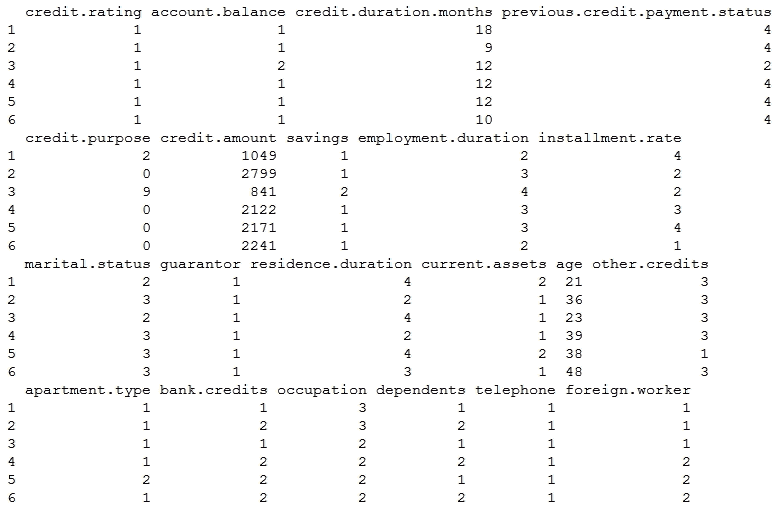

要获得关于数据集及其属性的详细信息，可以使用下面的代码片段:

```

> # get dataset detailed info

> str(credit.df)

```

前面的代码将使您能够快速查看您正在处理的数据点的总数，其中包括记录的数量、属性的数量以及关于每个属性的详细信息，包括属性名称、类型和属性值的一些示例，如您在下面的屏幕截图中所见。使用这个，我们可以很好地了解不同的属性和它们的数据类型，这样我们就知道对它们应用什么样的转换，以及在描述性分析中使用什么样的统计方法。

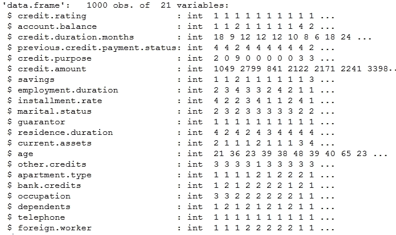

从前面的输出中，您可以看到我们的数据集总共有 1000 条记录，其中每条记录处理一个银行客户的数据点。每条记录都有不同的数据点或描述数据的属性，每条记录总共有 21 个属性。上图中还显示了每个属性的数据类型和样本值。

### 注

请注意，默认情况下，R 已经根据变量的值为变量分配了`int`数据类型，但是我们将在数据预处理阶段根据它们的实际语义对其进行修改。


# 数据预处理

在本节中，我们将关注数据预处理，包括数据清理、转换和标准化(如果需要的话)。基本上，在开始对数据进行任何分析之前，我们执行操作来准备好数据。

## 处理缺失值

在情况下，您正在处理的数据会有缺失值，这通常在 r 中表示为`NA`。有几种方法可以检测到它们，接下来我们将向您展示几种方法。请注意，有几种方法可以做到这一点。

```

> # check if data frame contains NA values

> sum(is.na(credit.df))

[1] 0

> 

> # check if total records reduced after removing rows with NA 

> # values

> sum(complete.cases(credit.df))

[1] 1000

```

`is.na`函数非常有用，因为它有助于发现数据集中是否有任何元素具有`NA`值。还有另一种方法可以做到这一点，使用`complete.cases`函数，该函数本质上返回一个逻辑向量，表明行是否完整以及它们是否有任何`NA`值。您可以检查与原始数据集相比，记录总数是否减少了，因为这样您就知道数据集中有一些丢失的值。幸运的是，在我们的例子中，我们没有任何丢失的值。但是，将来如果您要处理丢失的值，有多种方法可以处理。其中一些包括通过使用诸如`complete.cases`之类的函数删除缺少值的行，或者用一个可能是最频繁出现的值或平均值来填充它们，等等。这也被称为缺失值插补，它取决于变量属性和您正在处理的域。因此，我们在这里不会过多关注这个领域。

## 数据类型转换

我们之前提到过，默认情况下，数据集的所有属性都被声明为`int`，这是 R 的一个数字类型，但在这种情况下并非如此，我们必须根据变量语义和值来改变它。如果你上过统计学的基础课，你可能知道我们通常处理两种类型的变量:

*   **数字变量**:这些变量的值带有一些数学意义。这个就是你可以对它们进行数学运算，比如加、减等等。一些例子可以是一个人的年龄、体重等等。
*   **分类变量**:这些变量的值没有任何数学意义，您不能对它们执行任何数学运算。这个变量中的每个值都属于一个特定的类或类别。一些例子可以是一个人的性别、工作等等。

由于我们数据集中的所有变量都被默认转换为数字，我们只需要将分类变量从数字数据类型转换为因子，这是在 r 中表示分类变量的好方法。

我们数据集中的数字变量包括`credit.duration.months`、`credit.amount`和 age，我们不需要执行任何转换。但是，其余 18 个变量都是分类变量，我们将使用以下实用函数来转换它们的数据类型:

```

# data transformation

to.factors <- function(df, variables){

 for (variable in variables){

 df[[variable]] <- as.factor(df[[variable]])

 }

 return(df)

}

```

该函数将用于我们现有的数据帧`credit.df`，如下所示，用于转换变量数据类型:

```

> # select variables for data transformation

> categorical.vars <- c('credit.rating', 'account.balance', 

+                       'previous.credit.payment.status',

+                       'credit.purpose', 'savings', 

+                       'employment.duration', 'installment.rate',

+                       'marital.status', 'guarantor', 

+                       'residence.duration', 'current.assets',

+                       'other.credits', 'apartment.type', 

+                       'bank.credits', 'occupation', 

+                       'dependents', 'telephone', 

+                       'foreign.worker')

> 

> # transform data types

> credit.df <- to.factors(df = credit.df, 

+                         variables=categorical.vars)

> 

> # verify transformation in data frame details

> str(credit.df)

```

现在，在下面的输出中，我们可以看到数据框中的属性详细信息，以及所选分类变量的已转换数据类型。您会注意到，在数据集的 21 个变量/属性中，有 18 个已经成功地转换为分类变量。


数据预处理步骤到此结束,我们现在将开始分析我们的数据集。

### 注

请注意，我们的几个数据集属性/特征有很多类或类别，我们需要在分析阶段进行更多的数据转换和特征工程，以防止预测模型过度拟合，我们将在后面讨论。


# 数据分析和转换

现在我们已经处理了我们的数据，可以进行分析了。如前所述，我们将在本节中进行描述性和探索性分析。我们将分析不同的数据集属性，并讨论它们的意义、语义以及与信用风险属性的关系。我们将使用统计函数、列联表和可视化来描述所有这些。

除此之外，我们还将对数据集中的一些特征进行数据转换，即分类变量。我们将这样做来合并具有相似语义的类别类，并通过将它们与一个相似的类合并来删除比例很小的类。这样做的一些原因包括防止我们的预测模型过度拟合，我们将在[第 6 章](ch06.html "Chapter 6. Credit Risk Detection and Prediction – Predictive Analytics")、*信用风险检测和预测-预测分析*中构建预测模型，将语义相似的类链接在一起，还因为像逻辑回归这样的建模技术不能很好地处理具有大量类的分类变量。我们将首先分析数据集中的每个要素/变量，然后在必要时执行任何转换。

## 建筑分析实用程序

在我们开始分析之前，我们将开发一些用于分析数据集特征的效用函数。请注意，所有的实用函数都是在一个名为`descriptive_analytics_utils.R`的单独的`.R`文件中定义的。您可以使用命令`source('descriptive_analytics_utils.R')`将所有函数加载到内存或任何其他 R 脚本文件中，然后开始使用它们。我们现在将讨论这些效用函数。

我们现在将讨论我们使用过的各种软件包。我们已经使用了一些包，比如`pastecs`和`gmodels`来获得特性的汇总统计数据和构建列联表。软件包`gridExtra`和`ggplot2`已经分别用于网格布局和建筑可视化。如果你没有安装它们，你可以使用`install.packages`命令来安装它们。接下来，加载包，如下面的代码片段所示:

```

# load dependencies

library(gridExtra) # grid layouts

library(pastecs) # details summary stats

library(ggplot2) # visualizations

library(gmodels) # build contingency tables

```

现在我们已经有了所有需要的依赖项，我们将首先实现一个函数来获得关于数字变量的汇总统计信息。下面的代码片段实现了同样的目的。如您所见，我们已经利用了`stat.desc`和 summary 函数来获得关于变量的详细和精简的汇总统计信息。自变量和因变量的约定在随后的代码段和随后的其他函数中用`indep.var`和`dep.var`表示。

```

# summary statistics

get.numeric.variable.stats <- function(indep.var, detailed=FALSE){

 options(scipen=100)

 options(digits=2)

 if (detailed){

 var.stats <- stat.desc(indep.var)

 }else{

 var.stats <- summary(indep.var)

 }

 df <- data.frame(round(as.numeric(var.stats),2))

 colnames(df) <- deparse(substitute(indep.var))

 rownames(df) <- names(var.stats)

 if (names(dev.cur()) != "null device"){

 dev.off()

 }

 grid.table(t(df))

}

```

接下来，我们将构建一些函数来可视化数值变量。我们将使用 `histograms\density`图和`box plots`来描述属性分布。

```

# visualizations

# histograms\density

visualize.distribution <- function(indep.var){

 pl1 <- qplot(indep.var, geom="histogram", 

 fill=I('gray'), binwidth=5,

 col=I('black'))+ theme_bw()

 pl2 <- qplot(age, geom="density",

 fill=I('gray'), binwidth=5, 

 col=I('black'))+ theme_bw()

 grid.arrange(pl1,pl2, ncol=2)

}

# box plots

visualize.boxplot <- function(indep.var, dep.var){

 pl1 <- qplot(factor(0),indep.var, geom="boxplot", 

 xlab = deparse(substitute(indep.var)), 

 ylab="values") + theme_bw()

 pl2 <- qplot(dep.var,indep.var,geom="boxplot",

 xlab = deparse(substitute(dep.var)),

 ylab = deparse(substitute(indep.var))) + theme_bw()

 grid.arrange(pl1,pl2, ncol=2)

}

```

我们已经使用了`ggplot2`包中的`qplot`函数来构建可视化效果，我们将很快看到它的效果。现在我们将把注意力转移到`categorical variables`上。我们将从构建一个函数来获取任何`categorical variable`的汇总统计数据开始。

```

# summary statistics

get.categorical.variable.stats <- function(indep.var){

 feature.name = deparse(substitute(indep.var))

 df1 <- data.frame(table(indep.var))

 colnames(df1) <- c(feature.name, "Frequency")

 df2 <- data.frame(prop.table(table(indep.var)))

 colnames(df2) <- c(feature.name, "Proportion")

 df <- merge(

 df1, df2, by = feature.name

 )

 ndf <- df[order(-df$Frequency),]

 if (names(dev.cur()) != "null device"){

 dev.off()

 }

 grid.table(ndf)

}

```

前面的函数将总结分类变量，并讨论其中有多少类或类别以及其他一些细节，如频率和比例。如果您还记得，我们之前提到过，我们还将描述分类变量与类别/因变量的关系`credit.risk`。下面的函数将以列联表的形式帮助我们达到同样的目的:

```

# generate contingency table

get.contingency.table <- function(dep.var, indep.var, 

 stat.tests=F){

 if(stat.tests == F){

 CrossTable(dep.var, indep.var, digits=1, 

 prop.r=F, prop.t=F, prop.chisq=F)

 }else{

 CrossTable(dep.var, indep.var, digits=1, 

 prop.r=F, prop.t=F, prop.chisq=F,

 chisq=T, fisher=T)

 }

}

```

我们还将构建一些描述可视化的函数。我们将通过使用以下函数，使用条形图可视化`categorical variable`分布:

```

# visualizations

# barcharts

visualize.barchart <- function(indep.var){

 qplot(indep.var, geom="bar", 

 fill=I('gray'), col=I('black'),

 xlab = deparse(substitute(indep.var))) + theme_bw()

}

```

我们将使用以下函数，使用镶嵌图来描绘前面提到的列联表的可视化效果:

```

# mosaic plots

visualize.contingency.table <- function(dep.var, indep.var){

 if (names(dev.cur()) != "null device"){

 dev.off()

 }

 mosaicplot(dep.var ~ indep.var, color=T, 

 main = "Contingency table plot")

}

```

既然我们已经构建了所有必要的实用程序，我们将在下一节开始分析我们的数据。

## 分析数据集

我们将在本节中分析数据集的每个特征，并在必要时以汇总统计、关系、统计测试和可视化的形式描述我们的分析。我们将在表格中标明对每个变量进行的必要分析。需要记住的重要一点是，代码中由`dep.var`表示的从属特征将始终是`credit.rating`，因为这是一个依赖于其他特征的变量；这些特征是独立变量，在表格和图表中通常用`indep.var`表示。

我们将对一些具有重要意义的重要特征进行详细的分析和转换，特别是具有大量类的数据特征，这样我们可以清楚地了解数据分布以及它们在数据转换时是如何变化的。对于剩余的特性，我们不会过多关注汇总统计数据，而是通过转换以及它们与相关`credit.rating`变量的关系来更加强调特性工程。

现在，我们将附加数据框，以便轻松访问各个要素。您可以使用以下代码片段来实现这一点:

```

> # access dataset features directly

> attach(credit.df)

```

现在我们将从因变量`credit.risk`开始我们的分析，在我们的数据集中也被称为类变量，我们将在下一章尝试预测它。

以下代码片段有助于我们获得该特性所需的汇总统计信息:

```

> # credit.rating stats

> get.categorical.variable.stats(credit.rating)

> # credit.rating visualizations

> visualize.barchart(credit.rating)

```

下面的可视化告诉我们，`credit.rating`有两个类，`1`和`0`，并给出了必要的统计数据。基本上，信用评级为`1`的客户信用良好，信用评级为`0`的客户信用不佳。我们还从柱状图中观察到，与其他客户相比，银行中信用良好的客户比例明显较高。

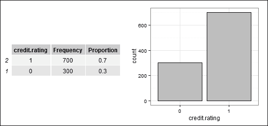

接下来，我们将分析的`account.balance`特性。基本上，该属性指示客户当前账户的当前余额。

我们将从获取汇总统计数据开始，并使用以下代码片段绘制一个条形图。为了更好地理解，我们将两个输出放在一起。

```

> # account.balance stats and bar chart

> get.categorical.variable.stats(account.balance)

> visualize.barchart(account.balance)

```

从下面的可视化中，你可以看到`account.balance`有四个不同的类，它们都有一些特定的语义，我们很快就会谈到。

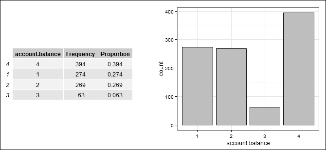

从前面的输出中，您可以看到`account.balance`有四个不同的类，它们都有一些语义，如下所述。货币 DM 表示德意志马克，德国的旧货币名称。

这四个类别表明以下作为至少持有一年的主要语义或支票账户:

*   **1** :没有流水账
*   **2** :无余额或借方
*   **3**:DM`< 200`的余额
*   **4**:T2 DM 余额

货币 DM 表示德国马克，德国的旧货币名称。我们将在这里进行一些功能工程，并将类别 3 和类别 4 结合在一起，以指示帐户中有正余额的客户。我们之所以这样做，是因为类 3 的比例相对于其他类来说很小，我们不希望不必要地为每个特性保留太多的类，除非它们很关键。我们将通过使用以下代码片段来实现这一点。

首先，我们将为此加载必要的包。如果没有安装软件包，使用命令`install.packages("car")`安装它。

```

> #load dependencies

> library(car)

```

现在我们将重新编码必要的类，如下所示:

```

> # recode classes and update data frame

> new.account.balance <- recode(account.balance,

+                           "1=1;2=2;3=3;4=3")

> credit.df$account.balance <- new.account.balance

```

我们现在将使用列联表来查看`new.account.balance`和`credit.rating`之间的关系，如前所述，并通过使用以下代码片段使用马赛克图来可视化它。我们还会进行一些统计测试，稍后我会简单解释一下。

```

> # contingency table and mosaic plot 

> get.contingency.table(credit.rating, new.account.balance, 

 stat.tests=T)

> visualize.contingency.table(credit.rating, new.account.balance)

```

在下图中，您现在可以看到`account.balance`的各种类是如何在表格和图中与`credit.rating`相关地分布的。一个有趣的现象是，账户里有资金的人，90%都不是潜在的信用风险，这听起来很有道理。


我们在这里还执行了两个统计测试:卡方检验和费希尔检验，这两个相关的测试都在广泛用于假设检验的列联表中。这些测试中涉及的统计计算的细节超出了本章的范围。我会用一种容易理解的方式来表达。通常，我们从前面描述的两个变量之间不存在关联或关系的零假设开始，以及两个变量之间存在关联或联系的可能性的替代假设开始。如果从测试中获得的 p 值小于或等于`0.05`，只有这样我们才能拒绝零假设，支持替代假设。在这种情况下，您可以清楚地看到两个测试都给出了 p 值`< 0.05`，这无疑支持了另一个假设，即`credit.rating`和`account.balance`之间存在某种关联。当我们建立统计模型时，这些类型的测试非常有用。你可以在互联网或任何统计书籍上查找前面的测试，以更深入地了解 p 值意味着什么以及它们是如何工作的。

### 注意

请注意，接下来我们将只显示每个特性最重要的分析结果。然而，您总是可以尝试使用我们前面解释的函数来获得各种分析技术的相关信息。对于列联表，使用`get.contingency.table()`函数。可以通过在`get.contingency.table()`功能中将`stat.tests`参数设置为`TRUE`来进行统计测试。您也可以使用`visualize.contingency.table()`功能查看镶嵌图。

现在我们来看一下`credit.duration.months`，它表示信用证的期限，以月为单位。这是一个数值变量，分析将与其他分类变量稍有不同。

```

> # credit.duration.months analysis

> get.numeric.variable.stats(credit.duration.months)

```

我们可以从下图中看到同样的情况:


我们看到的值是以月为单位的，我们得到了该特性的典型汇总统计数据，包括平均值、中值和四分位数。现在，我们将使用`histograms/density`图和`boxplots`图来显示该特性值的总体分布。

```

> # histogram\density plot

> visualize.distribution(credit.duration.months)

```

前面的代码片段产生了以下情节。我们可以清楚地观察到，这是一个具有几个峰值的多峰分布。

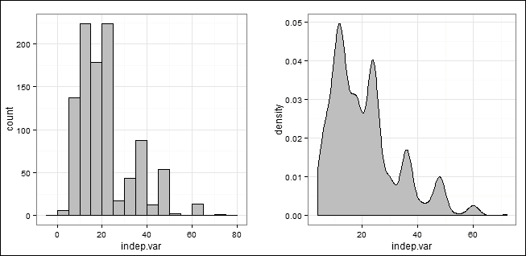

我们现在以方框图的形式将它可视化，包括显示与下一个`credit.rating`关联的图。

```

> # box plot

> visualize.boxplot(credit.duration.months, credit.rating)

```

有趣的是，从下面的图中我们看到，信用评级差的人的信用持续时间中值高于信用评级好的人。如果我们假设许多信用期限长的客户拖欠付款，这似乎是合理的。

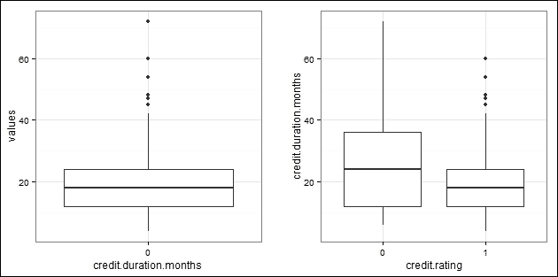

转到下一个变量，`previous.credit.payment.status`表示客户在支付其先前信用方面的状态。这是一个`categorical variable`，我们得到了它的统计数据，如下所示:

```

> # previous.credit.payment.status stats and bar chart

> get.categorical.variable.stats(previous.credit.payment.status)

> visualize.barchart(previous.credit.payment.status)

```

这为我们提供了以下描述数据分布的表格和条形图:

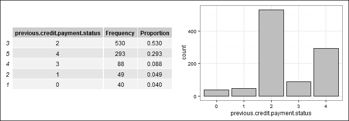

这些类将以下内容作为主要语义:

*   **0** :付款犹豫
*   **1** :问题流水账
*   **2** :没有以前的积分了
*   **3** :我行当前授信没有问题
*   **4** :偿还之前在该行的授信

我们将对这个特性应用下面的转换，所以新的语义将是:

*   **1** :付款的一些问题
*   **2** :所有信用已支付
*   **3** :没有问题，只在这家银行付款

我们将在下面的代码片段中执行转换:

```

> # recode classes and update data frame

> new.previous.credit.payment.status <- 

 recode(previous.credit.payment.status,

+                                           "0=1;1=1;2=2;3=3;4=3")

> credit.df$previous.credit.payment.status <- 

 new.previous.credit.payment.status

```

变换特征的列联表可通过以下方式获得:

```

> # contingency table

> get.contingency.table(credit.rating,

 new.previous.credit.payment.status)

```

我们从下面的表格中观察到，大多数拥有良好信用评级的人没有任何问题地支付了他们以前的贷款，而那些没有良好信用评级的人在支付时出现了一些问题，这是有道理的！

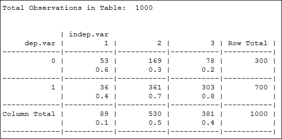

我们要看的下一个特性是`credit.purpose`，它表示信用额度的用途。这是也是一个分类变量，我们得到它的汇总统计数据，并绘制柱状图，显示其各种类别的频率，如下所示:

```

> # credit.purpose stats and bar chart

> get.categorical.variable.stats(credit.purpose)

> visualize.barchart(credit.purpose)

```

这为我们提供了以下描述数据分布的表格和条形图:

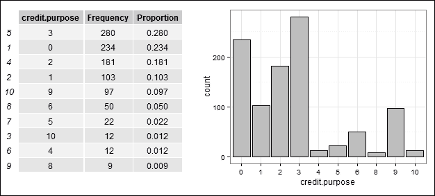

我们注意到，仅这个特性就有惊人的 11 个类。除此之外，我们还观察到，与前 5 个类相比，几个类的比例极低，类 **标签 7** 甚至没有出现在数据集中！这就是为什么我们需要像以前一样，通过将这些类组合在一起来进行特性工程。

这些类将以下内容作为主要语义:

*   0 :其他
*   **1** :新车
*   **2** :二手车
*   **3** :家具项目
*   **4** :收音机或电视机
*   **5** :家用电器
*   **6** :修理
*   **7** :教育
*   **8** :休假
*   **9** :再培训
*   **10** :商务

我们将通过合并一些现有的类来转换这个特性，转换后的新语义如下:

*   **1** :新车
*   **2** :二手车
*   **3** :家居相关物品
*   **4** :其他

我们将通过使用以下代码片段来实现这一点:

```

> # recode classes and update data frame

> new.credit.purpose <- recode(credit.purpose,"0=4;1=1;2=2;3=3;

+                                              4=3;5=3;6=3;7=4;

+                                              8=4;9=4;10=4")

> credit.df$credit.purpose <- new.credit.purpose

```

然后，通过以下代码片段获得变换后要素的关联表:

```

> # contingency table

> get.contingency.table(credit.rating, new.credit.purpose)

```

根据下表，我们看到信用目的为家庭相关项目或其他项目的客户似乎在不良信用评级类别中所占比例最大:

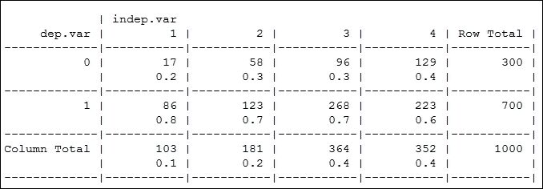

我们将分析的下一个特征是`credit.amount`，它基本上表示客户向银行要求的 DM 信用额。这是一个数字变量，我们使用以下代码来获取汇总统计数据:

```

> # credit.amount analysis

> get.numeric.variable.stats(credit.amount)

```


我们看到正常的统计数据，如平均信贷额为 3270 德国马克，中位数为 3270 德国马克左右。现在，我们将使用直方图和密度图来可视化上述数据的分布，如下所示:

```

> # histogram\density plot

> visualize.distribution(credit.amount)

```

这将为我们提供`credit.amount`的直方图和密度图，您可以在下图中看到它是一个右偏分布:

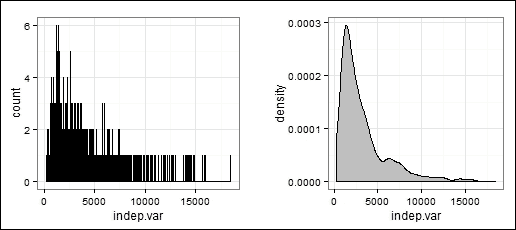

接下来，我们将使用 boxplots 可视化数据，以查看数据分布及其与使用以下代码片段的`credit.rating`的关系:

```

> # box plot

> visualize.boxplot(credit.amount, credit.rating)

```

这将生成以下箱线图，从中可以清楚地看到箱线图中许多点所显示的分布的右偏斜。我们还看到了一个有趣的观点，即中值信用评级对那些要求更高信用额度的客户来说是不利的，这似乎是假设他们中的许多人可能未能支付还清信用额度所需的所有款项。

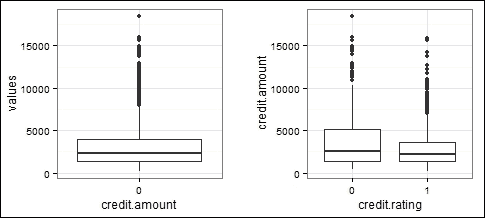

既然您已经很好地了解了如何对分类变量和数值变量进行描述性分析，那么接下来我们将不再展示针对每个特征的所有不同分析技术的输出。如果您有兴趣更深入地研究数据，请随意试验我们之前在剩余变量上使用的函数，以获得汇总统计数据和可视化效果！

下一个特性是 savings，它是一个分类变量，对于 5 个类别标签具有以下语义:

*   **1** :无储蓄
*   **2** : `< 100` DM
*   **3** :在`[100, 499]` DM 之间
*   **4** :在`[500, 999]` DM 之间
*   **5** : `>= 1000` DM

该特征表示属于客户的储蓄/股票的平均数量。我们将把它转换成以下四个类别标签:

*   1 :没有储蓄
*   **2** : `< 100` DM
*   **3** :在`[100, 999]` DM 之间
*   **4** : `>= 1000` DM

我们将使用以下代码片段:

```

> # feature: savings - recode classes and update data frame

> new.savings <- recode(savings,"1=1;2=2;3=3;

+                                4=3;5=4")

> credit.df$savings <- new.savings

```

现在我们使用列联表的以下代码来分析储蓄和`credit.rating`之间的关系:

```

> # contingency table

> get.contingency.table(credit.rating, new.savings)

```

这将生成以下列联表。观察表中的值，很明显没有存款的人在信用评级不好的客户中所占的比例最大，这并不奇怪！对于信用评级良好的客户来说，这个数字也很高，因为与信用评级不良的记录总数相比，信用评级良好的记录总数也很高。然而，我们也看到，与储蓄账户中信用评级不佳且同时拥有`> 1000`糖尿病的人相比，拥有`> 1000`糖尿病且信用评级良好的人的比例相当高。

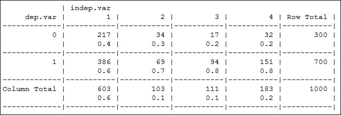

我们现在来看看名为`employment.duration`的特性，它是一个分类变量，表示客户受雇至今的时间长度。五类特征的语义是:

*   失业人员
*   **2** : `< 1`年
*   **3** :在`[1, 4]`年之间
*   **4** :在`[4, 7]`年之间
*   **5** : `>= 7`年

我们将把它转换成以下四类:

*   **1** :失业或`< 1`年
*   **2** :在`[1,4]`年之间
*   **3** :在`[4,7]`年之间
*   **4** : `>= 7`年

我们将使用以下代码:

```

> # feature: employment.duration - recode classes and update data frame

> new.employment.duration <- recode(employment.duration,

+                                   "1=1;2=1;3=2;4=3;5=4")

> credit.df$employment.duration <- new.employment.duration

```

现在我们使用列联表分析其关系，如下所示:

```

> # contingency table

> get.contingency.table(credit.rating, new.employment.duration)

```

我们从下表中观察到，无工作年限或工作年限很短且信用评级不良的客户比例远高于信用评级良好的类似客户。在`employment.duration`特征的情况下，值 1 表示失业或有`< 1`年就业的人。这些人拥有不良信用评级的比例为 300 人中有 93 人。这给出了 31%,与具有良好信用评级的客户(700 个客户中的 141 个，或 20%)的相同指标相比，这要高得多。

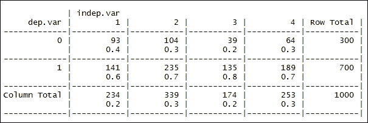

我们现在继续下一个名为`installment.rate`的特性，它是一个具有以下语义的分类变量:

*   **1** : `>=35%`
*   **2** :在`[25, 35]%`之间
*   **3** :在`[20, 25]%`之间
*   **4** : `< 20%`为四类

在这个属性的原始元数据中没有太多的信息，所以有些模糊，但是我们假设它指示了客户工资的百分比，这个百分比的用于每月分期支付信用贷款。我们不会在这里做任何转换，所以我们将直接进入关系。

```

> # feature: installment.rate - contingency table and statistical tests

> get.contingency.table(credit.rating, installment.rate, 

+                      stat.tests=TRUE)

```

我们在代码片段中对这个变量进行了统计测试，因为我们不确定我们对其语义的假设是否正确，或者它是否是一个重要的变量。从下面的结果中，我们看到两个统计测试都产生了`> 0.05`的 p 值，因此判定零假设有利于备选项。这告诉我们，这两个变量之间没有显著的关联，当我们为预测模型建立特征集时，这一特征可能不是要考虑的一个。我们将在下一章更详细地讨论特性选择。

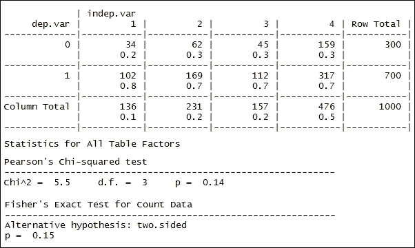

我们要分析的下一个变量是`marital.status`，它表示客户的婚姻状况，是一个分类变量。它有四个具有以下语义的类:

*   **1** :男性离异
*   **2** :男单身
*   **3** :男性已婚/丧偶
*   **4** :母

我们将用以下语义将它们转换成三个类:

*   **1** :男离异/单身
*   **2** :男性已婚/丧偶
*   3 :女性

我们将使用以下代码:

```

> # feature: marital.status - recode classes and update data frame

> new.marital.status <- recode(marital.status, "1=1;2=1;3=2;4=3")

> credit.df$marital.status <- new.marital.status

```

我们现在通过使用以下代码片段构建一个列联表来观察`marital.status`和`credit.rating`之间的关系:

```

> # contingency table

> get.contingency.table(credit.rating, new.marital.status)

```

从下表中，我们注意到，对于信用评级良好的客户，单身男性与已婚男性的比例为 **1:2** ，而对于信用评级不良的客户，这一比例接近 **1:1** 。这是否意味着也许更多的已婚男性倾向于及时偿还他们的信用债务？这可能是这个数据集的一种可能性，但请记住，相关性并不意味着一般的因果关系。

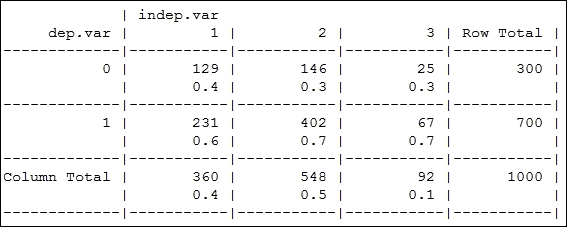

来自统计测试的 p 值为我们提供了一个值`0.01`，表明这些特征之间可能存在某种关联。

下一个特征是担保人，这表示客户是否有任何其他债务人或担保人。这是一个分类变量，有三个类，语义如下:

*   **1** :无
*   **2** :共同申请人
*   **3** :担保人

我们用以下语义将它们转换成两个变量:

*   **1** :否
*   **2** :是

对于转换，我们使用下面的代码片段:

```

> # feature: guarantor - recode classes and update data frame

> new.guarantor <- recode(guarantor, "1=1;2=2;3=2")

> credit.df$guarantor <- new.guarantor

```

对此进行统计测试得出的 p 值为`1`，比`0.05`大得多，因此支持无效的假设，并暗示担保人和`credit.rating`之间可能没有关联。

### 提示

您还可以使用直接函数来运行统计测试，而不是每次都调用`get.contingency.table(…)`函数。对于费雪精确检验，称之为`fisher.test(credit.rating, guarantor)`，对于皮尔森卡方检验，称之为`chisq.test(credit,rating, guarantor)`。随意用任何其他独立变量替换担保人来执行这些测试。

下一个特性是`residence.duration`，它表示客户已经在当前地址居住了多长时间。

这是一个分类变量，对于四个类具有以下语义:

*   **1** : `< 1`年
*   **2** :在`[1,4]`年之间
*   **3** :在`[4,7]`年之间
*   **4** : `>= 7`年

我们将不做任何转换，而是直接做统计测试，看看这个特性是否与`credit,rating`有任何关联。在上一篇技巧文章中，使用函数`fisher.test`和`chisq.test`都给我们一个 p 值`0.9`，这个值是显著的`> 0.05`，因此它们之间没有显著的关系。我们将在这里显示这两个统计测试的输出，这样您就可以了解它们描述了什么。

```

> # perform statistical tests for residence.duration

> fisher.test(credit.rating, residence.duration)

> chisq.test(credit.rating, residence.duration)

```

您可以从以下输出中看到，我们从之前讨论的两个测试中获得了相同的 p 值:


我们现在将我们的焦点转移到`current.assets,`，它是一个分类变量，对于四个类具有以下语义:

*   **1** :无资产
*   **2** :汽车/其他
*   **3** :人寿保险/储蓄合同
*   **4** :房屋/土地所有权

我们不会对该数据进行任何转换，而是直接运行相同的统计测试来检查它是否与`credit.rating`有任何关联。我们得到一个 p 值`3 x 10-5`，它肯定是`< 0.05`，因此我们可以得出结论，替代假设成立，即变量之间存在某种关联。

我们要分析的下一个变量是`age`。这是一个数字变量，我们将获得其汇总统计信息，如下所示:

```

> # age analysis

> get.numeric.variable.stats(age)

```

**输出**:


我们可以观察到客户的平均年龄是 35.5 岁，中位年龄是 33 岁。为了查看特性分布，我们将使用下面的代码片段，使用直方图和密度图来可视化它:

```

> # histogram\density plot

> visualize.distribution(age)

```

我们可以从下面的图中观察到，该分布是一个右偏分布，大多数客户年龄在 25 到 45 岁之间:

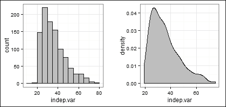

我们现在将通过箱线图来观察`age`和`credit.rating`之间的关系，如下所示:

```

> # box plot

> visualize.boxplot(age, credit.rating)

```

通过我们在最末端看到的一簇点，可以在箱线图中清楚地分辨出图中的右偏斜。从右图中我们可以得出一个有趣的观察结果:信用评级不好的人比信用评级好的人的平均年龄要低。

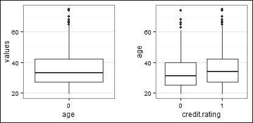

这种联系的一个原因可能是，还没有很好地定居和就业的年轻人无法偿还他们从银行获得的信用贷款。但是，再说一次，这只是一个假设，我们无法验证，除非我们调查每个客户的完整背景。

接下来，我们将看看特性`other.credits`，它对三个类有如下语义:

*   **1** :他行
*   **2** :在商店
*   **3** :无更多积分

此功能指示客户在别处是否有任何其他未决信用。我们将用下面的语义将它转换成两个类:

*   **1** :是
*   **2** :没有

我们将使用以下代码片段:

```

> # feature: other.credits - recode classes and update data frame

> new.other.credits <- recode(other.credits, "1=1;2=1;3=2")

> credit.df$other.credits <- new.other.credits

```

在对新转换的特征执行统计测试时，我们得到了一个 p 值`0.0005`，它是`< 0.05`，因此支持替代假设而不是零假设，表明在这个特征和`credit.rating`之间有一些关联，假设没有任何其他的影响。

下一个特性`apartment.type`是一个分类变量，具有以下三个类的语义:

*   **1** :免费公寓
*   出租公寓
*   3 拥有被占用的公寓

这个特征基本上表明了顾客居住的公寓类型。我们不会对此变量进行任何转换，而是直接进行统计测试。两个测试都给出了 p 值`< 0.05`，这意味着在`apartment.type`和`credit.rating`之间存在某种关联，假设没有其他因素影响它。

现在我们来看看特性`bank.credits`，它是一个分类变量，对于四个类具有以下语义:

*   **1** :一个
*   **2** :二/三
*   **3** :四个/五个
*   **4** :六个以上

该特征表示客户从该银行获得的信用贷款的总数，包括当前的一个。我们将把它转换成一个二进制特性，两个类的语义如下:

*   **1** :一个
*   **2** :不止一个

我们将使用以下代码:

```

> # feature: bank.credits - recode classes and update data frame

> new.bank.credits <- recode(bank.credits, "1=1;2=2;3=2;4=2")

> credit.df$bank.credits <- new.bank.credits

```

对这一转换后的特征进行统计测试给我们一个 p 值`0.2`，它比`> 0.05`大得多，因此我们知道零假设仍然有效，即`bank.credits`和`credit.rating`之间没有显著的关联。有趣的是，如果你用未转化版本的`bank.credits`进行统计测试，你会得到一个更高的 p 值`0.4`，这表明没有显著的相关性。

下一个特征是`occupation`，它明显表示客户的当前工作。这是一个分类变量，其四个类具有以下语义:

*   **1** :无固定住所的无业人员
*   **2** :无固定住所的无技能人员
*   **3** :技术工人/未成年公务员
*   **4** :行政/个体户/高级公务员

我们不会在这个特性上应用任何转换，因为每个职业都有其独特的特征。因此，我们将直接分析与统计测试的关系。两个测试都产生了 p 值`0.6`，这肯定是`> 0.05`，并且零假设保持有效，即两个特征之间没有显著的关系。

我们现在来看下一个特性依赖项，它是一个分类变量，其两个类标签具有以下语义:

*   **1** :零比二
*   **2** :三个以上

此功能表示客户的受抚养人的总人数。我们将不应用任何转换，因为它已经是一个二进制变量。对该特征进行统计测试，得出 p 值`1`，这告诉我们该特征与`credit.rating`没有显著关系。

接下来是特征电话，这是一个二进制分类变量，它有两个类，用以下语义表示客户是否有电话:

*   **1** :否
*   **2** :是

这里我们不需要任何进一步的转换，因为它是一个二元变量。因此，我们继续进行统计测试，该测试给出了 p 值`0.3`，即`> 0.05`，裁定零假设有利于替代方案，从而表明电话和`credit.rating`之间不存在显著关联。

数据集中的最后一个特征是`foreign.worker`，它是一个二进制分类变量，有两个具有以下语义的类，表示客户是否是外籍工人:

*   **1** :是
*   **2** :否

我们不执行任何转换，因为它已经是一个具有两个不同类的二元变量，并继续进行统计测试。两个测试都给了我们一个 p 值`< 0.05`，这可能表明这个变量与`credit.rating`有显著的关系。

至此，我们结束了数据集的数据分析阶段。

## 保存转换后的数据集

我们已经使用几个分类变量的数据转换进行了大量的特征工程,由于我们将在转换后的特征集上构建预测模型，我们需要将该数据集单独存储到磁盘上。我们使用下面的代码片段:

```

> ## Save the transformed dataset

> write.csv(file='credit_dataset_final.csv', x = credit.df, 

+           row.names = F)

```

我们可以在下一次开始构建预测模型时将上面的文件直接加载到 R 中，这将在下一章中讨论。


# 下一步

我们已经分析了我们的数据集，执行了必要的特征工程和统计测试，构建了可视化，并且获得了关于信用风险分析以及银行在分析客户时会考虑哪些特征的大量领域知识。我们之所以详细分析数据集中的每个特征，是为了让您了解银行在分析客户信用评级时考虑的每个特征。这是为了让您更好地理解领域知识，并帮助您熟悉将来对任何数据集执行探索性和描述性分析的技术。那么，接下来呢？现在使用这个数据集真正有趣的部分来了；从这些数据中构建特征集，并将其输入预测模型，以预测哪些客户可能存在潜在的信用风险，哪些不会。如前所述，有两个步骤:数据和算法。事实上，我们将更进一步说，有一些特性集和算法将帮助我们实现我们的主要目标。

## 功能集

数据集基本上是一个由几个观察记录组成的文件,其中每个元组或记录表示一个完整的观察集，列是观察中的特定属性或特征，表示特定的特征。在预测分析中，通常数据集中有一个属性或要素的类或类别必须进行预测。这个变量在我们的数据集中是`credit.rating`，也称为因变量。它所依赖的所有其他特征都是独立变量。这些特征的组合形成了一个特征向量，也就是通常所说的特征集。有各种方法来确定我们应该为预测模型考虑哪些特征集，并且您将会看到，对于任何数据集来说，从来没有固定的特征集。它基于特征工程、我们正在构建的预测模型的类型以及基于统计测试的特征的重要性而不断变化。

特征集中的每个属性都被称为特征或属性，在统计学中也被称为独立变量或解释变量。正如我们在数据集中看到的，要素可以是各种类型。我们可以有几个类别的分类特征、两个类别的二元特征、基本上是分类特征但具有某种内在顺序(例如，低、中、高)的序数特征，以及可以是整数值或实数值的数值特征。特征在构建预测模型时非常重要，通常情况下，数据科学家会花费大量时间来构建完美的特征集，以大幅提高预测模型的准确性。这就是为什么除了了解机器学习算法之外，领域知识非常重要。

## 机器学习算法

一旦我们准备好特征集，我们就可以开始使用预测模型来使用它们，并开始根据它们的特征预测客户的信用评级。要记住的一件重要事情是，这是一个迭代过程，我们必须根据从预测模型中获得的输出和反馈来不断修改我们的特征集，以进一步改进它们。本节将简要介绍与我们的场景相关的几种方法，这些方法属于监督机器学习算法类。

*   **线性分类算法**:这些算法根据线性函数的来执行分类，该线性函数通过执行特征集和与它们相关联的一些权重的点积来给每个类别分配分数。预测的类是具有最高分数的类。特征集的最佳权重以多种方式确定，并根据所选的算法而有所不同。算法的一些例子包括逻辑回归、支持向量机和感知器。
*   **决策树**:这里我们使用决策树作为预测模型，将来自数据点的各种观察映射到我们要预测的记录的观察类。决策树就像一个流程图结构，其中每个内部非叶节点表示对一个特征的检查，每个分支表示该检查的结果，每个末端叶节点包含一个我们最终预测的类标签。
*   **集成学习方法**:这些方法包括使用多种机器学习算法来获得更好的预测模型。一个例子是随机森林分类算法，该算法在模型训练阶段使用决策树的集合，并且在每个阶段，它将来自决策树的集合的多数输出决策作为其输出。这有助于减少使用决策树时经常出现的过度拟合。
*   **Boosting 算法**:这也是监督学习算法家族中的一种集成学习技术。它包括训练几个弱分类模型并在将它们添加到比它们更强的最终分类器之前从它们学习的迭代过程。当添加分类器时，遵循基于其准确性的加权方法。未来的弱分类器更多地关注先前被错误分类的记录。
*   **神经网络**:这些算法受到生物神经网络的启发，生物神经网络由相互连接的神经元系统组成，这些神经元相互交换信息。在预测建模中，我们处理由相互连接的节点组组成的人工神经网络。每个节点由一个函数组成，该函数通常是一个数学函数(即 sigmoid 函数),并具有一个与之相关的自适应权重，该权重根据输入到节点的输入而不断变化，并不断检查在几次迭代中从输出获得的误差，也称为**时期**。

在下一章构建预测模型时，我们将涉及其中的几个算法。


# 摘要

恭喜你坚持到本章结束！到目前为止，你已经学到了我们在这一章中讲到的一些重要的东西。您现在已经了解了金融领域中最重要的领域之一，即信用风险分析。除此之外，您还获得了关于银行如何分析客户信用评级以及他们考虑什么样的属性和特征的重要领域知识。对数据集的描述性和探索性分析还让您了解到，当您只有一个问题要解决并且有一个数据集提供给您时，如何从头开始工作！您现在知道了如何执行特性工程，使用`ggplot2`构建漂亮的出版物质量可视化，以及执行统计测试来检查特性关联。最后，我们通过讨论特征集来结束我们的讨论，并简要介绍了几种有监督的机器学习算法，这些算法将有助于我们下一步预测信用风险。最有趣的部分还在后面，敬请期待！