# 八、Twitter 数据的情感分析

|   | *“塑造公众情绪的人...使法令和决定成为可能或不可能。* |   |
|   | ——*亚伯拉罕·林肯。* |

人们的想法不仅关系到政治家和名人，也关系到我们大多数社会人。这种想知道对自己看法的需要已经影响了人们很长时间，并且被前面的名言恰当地概括了。意见虫不仅影响我们自己的观点，也影响我们使用产品和服务的方式。正如在学习购物篮分析和推荐引擎时所讨论的那样(分别参见[第 3 章](ch03.html "Chapter 3. Predicting Customer Shopping Trends with Market Basket Analysis")、*用购物篮分析预测客户购物趋势*和[第 4 章](ch04.html "Chapter 4. Building a Product Recommendation System")、*构建产品推荐系统*)，我们的行为可以通过观察一群具有相似特征(如价格敏感度、颜色偏好、品牌忠诚度等)的人的行为来近似或预测。我们在前面的章节中也讨论过，很长一段时间以来，我们在进行下一次大的购买之前，都会询问我们的朋友和亲戚的意见。虽然这些观点在个人层面上对我们很重要，但我们可以从这些信息中获得更有价值的见解。

如果说万维网的出现只是加速和扩大了我们的圈子，这是一种保守的说法。不重复，值得一提的是，网络为分析人类行为打开了新的大门。

在前一章中，社交网络是讨论的对象。我们不仅使用社交网络作为工具来获得洞察力，而且我们还讨论了这样一个事实，即这些平台满足了我们对他人在想什么或在做什么的固有好奇心。社交网络为我们所有人提供了一个平台，在这里我们可以表达自己的观点并被倾听。它的*被听到*方面有点难以定义和处理。例如，我们在这些平台上对某人或某事的意见和反馈(假设它们是真实的)肯定会被我们圈子里的人(直接或间接)听到，但他们可能会也可能不会被他们想要的人或组织听到。尽管如此，这样的意见或反馈确实会影响与他们相关的人以及他们从那时起的行为。这种观点的影响和我们对人们想法的普遍好奇，加上更多这样的用例，是本章的动机。

在本章中，我们将:

*   了解情感分析及其关键概念
*   了解情感分析的应用和挑战
*   理解执行意见挖掘的不同方法
*   在 Twitter 数据上应用情感分析的概念

# 理解情感分析

基于互联网的公司及其首席执行官是全球经济中最赚钱的实体，这一事实很好地说明了这个世界是如何被技术驱动和被互联网塑造的。与任何其他媒体不同，互联网已经变得无处不在，渗透到我们生活的方方面面。除了将互联网用于许多其他目的之外，我们正在使用和依赖互联网和基于互联网的解决方案来获得建议和推荐，这并不奇怪。

正如我们在前几章中所看到的，互联网与电子商务和金融机构等领域之间的关系太深了。但是我们对网络世界的使用和信任并不止于此。无论是在你家附近的新餐馆预定一张桌子，还是决定今晚看哪部电影，在我们打最后一个电话之前，我们都会从互联网上获得帮助，以了解其他人的意见或其他人的分享。正如我们将在后面看到的，这种决策辅助工具不仅仅局限于商业平台，还适用于许多其他领域。

意见挖掘或情感分析(众所周知，可互换)是使用自然语言处理、文本分析和计算语言学自动识别文本中主观性的过程。情感分析旨在使用所述技术来识别说话者的积极、消极或中立的观点、情感或态度。情感分析(此后与意见挖掘互换使用)在世界范围内从商业到服务领域都有应用。

## 情感分析的关键概念

我们现在将研究与情感分析相关的关键术语和概念。这些术语和概念将帮助我们在接下来的部分中正式讨论。

### 主观性

观点或情绪是一个人自己对观点和信仰的表达。此外，主观性(或主观文本)表达了我们对产品、人、政府等实体的情感。例如，一个主观的句子可能是*我喜欢使用 Twitter* ，这表明一个人对一个特定的社交网络的喜爱，而一个客观的句子可能是 *Twitter 是一个社交网络*。第二个例子只是陈述了一个事实。情感分析围绕着主观文本或主观分类。理解并非所有的主观文本都表达情感也很重要。例如，*我刚刚创建了我的 Twitter 账户*。

### 感情极性

一旦我们有了一段文本，它在本质上是主观的(并且表达了一些情绪)，下一个任务是将它分类为积极或消极的情绪类别之一(有时也考虑中性)。这项任务可能还包括将文本的情感置于极性的连续(或离散)尺度上，从而定义积极程度(或情感极性)。根据上下文，情感极性分类可以处理不同的类别集合。例如，在电影的分级系统中，情感极性可以被定义为喜欢与不喜欢，或者在辩论中观点可以被分类为支持与反对。

### 意见汇总

从一段文本中进行观点分类或情感提取是情感分析过程中的一项重要任务。接下来通常是情感总结。为了从与同一主题相关的不同文本中得出见解或结论(比如，对给定电影的评论)，重要的是将情感聚合(或总结)成可消费的形式以得出结论(无论电影是大片还是哑弹)。这可能涉及到使用可视化来推断整体情绪。

### 特征提取

正如我们在章节中看到的那样，特征识别和提取是决定机器学习算法成败的关键。是数据本身之后最重要的因素。让我们来看看在解决情感分析问题时使用的一些特征集:

*   **TF-IDF**: Information Retrieval makes heavy use of **Term Frequency-Inverse** **Document Frequency** (**tf-idf**) to enable quick information retrieval and analysis. In the context of tf-idf, a piece of text is represented as a feature vector containing words as its constituents. Recent research has also shown that, in the context of sentiment analysis, the presence of a word improves the performance and accuracy as compared to the frequency of the word.

    ### 注意

    **来源**:

    庞博、莉莲·李和希瓦库玛·维特亚娜森。竖起大拇指？使用机器学习技术的情感分类。《自然语言处理中的经验方法会议论文集(**em NLP**)，第 79–86 页，2002 年。

    TF-IDF 给定为:

    在哪里，

    `tf(t,d)`是`d`文档中`t`的词频。

    `idf(t,D)`是术语`t`在文档集`D`中的逆文档频率。

    例如，我们有以下两个文档的截屏，以及它们的术语和相应的频率:

    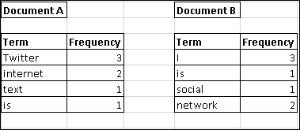

    在其最简单的形式中，术语`Twitter`的`TF-IDF`可以被给出为:

    

    不同的权重方案可用于计算`tfidf`；前面的示例使用以 10 为底的 log 来计算`idf`。

*   `n-Grams`:计算语言学和概率学把一个文本语料库看作一个连续的术语序列，可能是音素、字母、单词等等。基于 n-gram- 的建模技术在信息论中找到了它们的根源，在信息论中，下一个字符或单词的可能性是基于前面的 *n* 项。根据`n`的值，特征向量或模型被称为一元模型(对于`n=1`)、二元模型(对于`n=2`)、三元模型(对于`n=3`)等等。n 元语法对于词汇表外的单词和近似匹配特别有用。例如，考虑单词序列，诸如*关于情感分析的章节*的句子将具有诸如*关于章节*、*关于*的章节、*关于情感*、*情感分析*等二元模型。

    ### 注

    谷歌关于使用 n-grams 的有趣工作:[http://Google research . blogspot . in/2006/08/all-our-n-gram-are-belong-to-you . html](http://googleresearch.blogspot.in/2006/08/all-our-n-gram-are-belong-to-you.html)。

*   **Parts of Speech** (**POS**): Understanding and making use of the underlying structure of the language for analysis has obvious advantages. POS are rules of language which are used to create sentences, paragraphs and documents. In its simplest form, adjectives are usually pretty good indicators of subjectivity (not always, though). A number of approaches make use of the polarity of adjectives while classifying subjective texts. Using phrases containing adjectives has been shown to improve performance even further. Research into using other parts of speech, such as verbs and nouns, along with adjectives has also shown positive results.

    ### 注意

    **参考**:

    彼得·特尼。竖起大拇指还是竖起大拇指？语义导向应用于无监督的评论分类。《计算语言学协会会议录》**(**ACL**)，417–424 页，2002 年。**

    **以下示例显示了例句中标记的词类(形容词、名词等)，例如，*我们看到了黄狗*:**

    **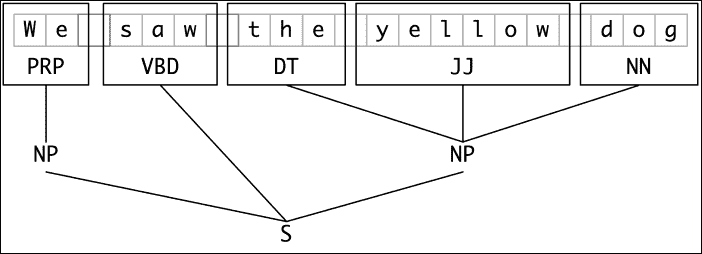

    来源:[http://www.nltk.org/](http://www.nltk.org/)** 
*   ****否定**:在情感分析的情况下，否定起着重要的作用。比如*我喜欢橘子*和*我不喜欢橘子*这样的句子，区别只是在*不要*这个词上，否定项把句子的极性翻转到相反的类别(分别为正和负)。否定可用作第二特征集，其中原始特征向量按原样生成，但随后基于否定项在极性上翻转。这种方法还有其他的变体，与不考虑否定影响的方法相比，它们在结果上有所改进。**
*   ****主题特征**:主题在设置上下文中起着重要的作用。因为情感分析是关于说话者的观点，所以主观性受到所讨论的主题的影响。大量的研究已经开始分析文本语料库的主题和情感之间的关系和效果。**

### **注**

****参考**:**

**托尼·马伦和奈杰尔·科利尔。基于支持向量机和不同信息源的情感分析。《自然语言处理中的**经验** **方法会议论文集** ( **EMNLP** )，412–418 页，2004 年 7 月。海报纸。**

## **方法**

**既然我们对情感分析领域的关键概念有了基本的理解，让我们来看看解决这个问题的不同方法。**

**情感分析主要在以下两个抽象层次上执行:**

*   ****文档级别**:在这个抽象级别，任务是分析一个给定的文档，以确定它的总体情绪是正面的还是负面的(或者在某些情况下是中性的)。基本假设是整个文档表达了与单个实体相关的观点。例如，给定一个产品评论，系统对其进行分析以确定该评论是正面的还是负面的。**
*   ****句子级**:句子级分析是一种更细粒度的情感分析形式。这种粒度级别反驳了文档中并非所有句子都是主观的事实，从而更好地利用主观性分类来确定每个句子的情感。**

**与其他机器学习技术非常相似，情感分析也可以使用监督和非监督方法来处理:**

*   ****监督方法**:关于情感分析的研究已经进行了相当一段时间。虽然早期的研究受到标记的数据集的可用性的限制，并且执行了相当肤浅的分析，但是现代用于情感分析的监督学习方法已经看到了进步，无论是在利用这些技术的系统方面，还是由于标记数据集的可用性，这种系统的整体性能方面。诸如 WordNet、SentiWordNet、SenticNet、newswire、Epinions 等数据集通过提供包含极性词、分类文档、用户意见等的数据集，极大地帮助研究人员改进监督算法。诸如 **朴素贝叶斯**、**支持向量机** ( **SVM** )的算法，如[第 6 章](ch06.html "Chapter 6. Credit Risk Detection and Prediction – Predictive Analytics")、*信用风险检测和预测——预测分析*和**基于最大熵的**分类算法是监督学习方法的经典例子。**
*   ****无监督方法**:无监督情感分析算法通常从建立或学习情感词典开始，然后确定文本输入的极性。词典生成是通过语言试探法、引导等技术完成的。Turney 在他 2002 年的论文中详细描述了一种著名的方法，其中他描述了使用一些基于词性的固定句法模式的无监督情感分析。

    ### 注

    **参考** :

    **语言学试探法**:瓦西里奥斯·哈兹瓦西洛格鲁(Vasileios Hatzivassiloglou)和凯瑟琳·麦克欧文(Kathleen McKeown)。预测形容词的语义指向。ACL/EACL 联合会议论文集，174-181 页，1997。

    **自举**:艾伦·里洛夫(Ellen Riloff)和贾尼斯·维贝(Janyce Wiebe)。学习主观表达的抽取模式。《自然语言处理中的经验方法会议论文集》 ( **EMNLP** )，2003 年。

    **特尼**:彼得特尼。竖起大拇指还是竖起大拇指？语义导向在无监督评论分类中的应用。在**计算语言学协会的会议录** ( **ACL** )，417–424 页，2002 年。

    T47**

## **应用**

**正如我们一直在讨论的那样，我们对网上意见的依赖有点令人惊讶。在购买产品、下载软件、选择应用程序或选择餐厅之前，我们有意或无意地检查这些观点或受其影响。情感分析或意见挖掘在许多领域都有应用；它们可以归纳为以下几大类:**

*   ****线上线下商业**:顾客的喜好可以在瞬间成就或摧毁品牌。一个产品要成为热销品，包括定价、包装和营销在内的一切都必须完美。顾客对与产品有关的所有方面都有看法，从而影响他们的销售。这不仅仅是在线商务的情况，顾客在实际购买之前会在多个网站或博客上查看产品评论，口碑和其他类似因素也会影响顾客对线下商务的看法。因此，情感分析成为品牌或公司追踪和分析的一个重要因素，以便在游戏中处于领先地位。对社交媒体内容(如推文、脸书帖子、博客等)的分析为品牌提供了对客户如何感知其产品的洞察。在某些情况下，品牌推出具体的营销活动，以设定产品的总体情绪或炒作。**
*   **治理:在一个大多数活动都在网上进行的世界里，政府也不例外。全球各国政府都有项目在政策制定和安全事务中利用情感分析(通过分析和监控敌对或负面通信的任何增加)。情感分析也被分析家用来确定或预测选举结果。像 *eRuleMaking* 这样的工具将情感分析作为一个关键组件。**

**除了前面提到的两个类别，意见挖掘在诸如推荐引擎和通用预测系统的领域中作为一种增强技术。例如，意见挖掘可以与推荐引擎结合使用，以从推荐列表中排除意见或情感低于特定阈值的产品。情感分析还可以基于与演员阵容、制片厂、电影主题等相关的情感，在预测一部即将上映的电影是否会一鸣惊人方面找到创新的用途。**

## **挑战**

**理解他人的观点和/或情绪本来就是一项艰巨的任务。能够用算法处理这样的问题同样困难。以下是执行情感分析时面临的一些挑战:**

*   ****理解和建模自然语言结构**:情感分析本质上是一个**自然语言处理** ( **NLP** )问题，尽管是一个受限的问题。尽管情感分析是 NLP 的一种受限形式，包括积极、消极或中性的分类，但它仍然面临着诸如共指消解、词义消歧和否定处理等问题。近年来，NLP 的进步以及情感分析在一定程度上帮助克服了这些问题，但在我们能够完美地模拟自然语言的规则之前，还有很长的路要走。**
*   **讽刺:感情可以用非常微妙的方式表达。这不仅仅是负面情绪；积极的情绪也可以很好地隐藏在讽刺的句子中。因为理解讽刺是只有少数人能掌握的技巧，所以模仿讽刺并正确识别情绪并不容易。例如，评论*这样一个简单易用的产品，你只需要阅读 300 页的手册*，只包含正面的话，却有负面的味道，不容易建模。**
*   ****评审和评审人员素质**:因人而异。我们中的一些人可能会非常强烈地表达我们的观点，而另一些人可能不会。另一个问题是每个人都有自己的观点，不管他们是否了解某个主题。这就产生了审查和审查者质量的问题，可能会影响整体分析。例如，一个漫不经心的读者可能不是最适合要求评论一本新书的人。同样，让评论家来评论一个新作者的书也是不明智的。这两个极端都可能导致有偏见的结果或不正确的见解。**
*   ****意见数据的大小和偏差**:网络上有大量的博客和网站，为用户提供了一个平台来表达和分享对地球内外一切可能的事情的意见。尽管如此，粒度级别的意见数据仍是一个问题。正如我们在前一章所讨论的，与特定背景(比如一个品牌或一个人)相关的数据量非常有限，以至于会影响整体分析。此外，由于偏见、不正确的事实或谣言，可用的数据有时偏向有利于(或不利于)实体。**

**

# 基于推文的情感分析

现在我们已经掌握了情感分析领域的关键术语和概念，让我们来测试一下我们的理论。我们已经看到了情绪分析的一些主要应用领域，以及执行此类分析通常面临的挑战。在本节中，我们将执行情感分析，分为以下几类:

*   **极性分析**:这将涉及到使用正面和负面词汇的标记列表对情感极性进行评分和汇总。
*   **基于分类的分析**:在这种方法中，我们将利用 R 的丰富库，根据可供公众使用的带标签的推文进行分类。我们还将讨论它们的性能和准确性。

r 有一个非常健壮的库，用于提取和处理来自 Twitter 的信息，名为`TwitteR`。正如我们在前一章看到的，在我们可以使用 TwitteR 或任何其他库进行情感分析之前，我们首先需要使用 Twitter 的应用程序管理控制台创建一个应用程序。对于这一章，我们将重用上一章的应用程序(将您的应用程序密钥和秘密放在手边)。此外，在接下来的章节中，我们将以更加结构化的格式利用前面章节中的代码，以实现重用并遵循`#bestCodingPractices`。

在我们开始分析之前，让我们首先重构现有的代码，并编写一些助手函数，这些函数在以后会派上用场。正如我们所知，Twitter 上的数据可以使用搜索词或从用户的时间表中提取。以下两个助手函数帮助我们以可重用的方式完成完全相同的任务:

```r

#extract search tweets

extractTweets <- function(searchTerm,tweetCount){

 # search term tweets

 tweets = searchTwitter(searchTerm,n=tweetCount)

 tweets.df = twListToDF(tweets)

 tweets.df$text <- sapply(tweets.df$text,function(x) iconv(x,to='UTF-8'))

 return(tweets.df)

}

#extract timeline tweets

extractTimelineTweets <- function(username,tweetCount){

 # timeline tweets

 twitterUser <- getUser(username)

 tweets = userTimeline(twitterUser,n=tweetCount)

 tweets.df = twListToDF(tweets)

 tweets.df$text <- sapply(tweets.df$text,function(x) iconv(x,to='UTF-8'))

 return(tweets.df)

}

```

函数`extractTweets`将`search`项和要提取的 tweets 数量作为输入，返回数据帧中的数据，该数据帧包含转换为 UTF8 编码的文本。类似地，函数`extractTimelineTweets`将用户名和推文数量作为输入，并返回数据框中的数据，其中的文本被转换为 UTF8 编码。因此，前面的两个函数将帮助我们多次提取推文(基于不同的`search`术语或用户),而无需一次又一次地重写相同的代码行。

继续同样的主题，我们将编写另一个助手函数来清理和转换我们的数据集。正如我们在前一章看到的，R 的`tm`库为我们提供了各种实用函数来快速清理和转换文本语料库。在这个函数中，我们将利用`tm_map`来转换我们的推文:

```r

# clean and transform tweets

transformTweets <- function(tweetDF){

 tweetCorpus <- Corpus(VectorSource(tweetDF$text))

 tweetCorpus <- tm_map(tweetCorpus, tolower)

 tweetCorpus <- tm_map(tweetCorpus, removePunctuation)

 tweetCorpus <- tm_map(tweetCorpus, removeNumbers)

 # remove URLs

 removeURL <- function(x) gsub("http://[[:alnum:]]*", "", x)

 tweetCorpus <- tm_map(tweetCorpus, removeURL) 

 # remove stop words

 twtrStopWords <- c(stopwords("english"),'rt','http','https')

 tweetCorpus <- tm_map(tweetCorpus, removeWords, twtrStopWords)

 tweetCorpus <- tm_map(tweetCorpus, PlainTextDocument)

 #convert back to dataframe

 tweetDataframe <- data.frame(text=unlist(sapply(tweetCorpus, 

 `[`, "content")), stringsAsFactors=F)

 #split each doc into words

 splitText <- function(x) {

 word.list = str_split(x, '\\s+')

 words = unlist(word.list)

 }

 # attach list of words to the data frame

 tweetDataframe$wordList = sapply(

 tweetDataframe$text,

 function(text) splitText(text))

 return (tweetDataframe)

}

```

除了常见的转换，如删除停止单词、改为小写、删除标点符号等，函数`transformTweets`在单词级别标记每个 tweet，并将每个 tweet 中的单词列表附加到对象。此外，该函数将转换后的 tweets 返回到一个数据帧中，以供进一步操作。

## 极性分析

如部分*关键概念*中所讨论的，极性是所考虑的文本的积极、消极或中性分类。类别标签可以根据上下文(喜欢与不喜欢或喜欢与不喜欢)而改变。极性还可以附加一个度数，将分析的文本放在极性的连续(或离散)标度上(比如从`-5`到`5`)。这种极性的程度有助于我们分析文本中积极(或消极)的程度。这在比较研究中特别有用，因为我们有机会参照某些基准来查看分析过的文本。

在这一部分，我们将分析推文，并根据每条推文中确定的极性词对每条推文进行评分。简单且易于编码的算法概括如下:

1.  基于选定的搜索词或 Twitter 句柄提取推文。
2.  清理推文并将其转换成合适的格式，以便于分析。将 tweets 标记成一个单词列表。
3.  加载用于极性词识别的正负词列表。
4.  对于每条推文，计算与前面第 3 步中获得的正面和负面单词列表相匹配的正面和负面单词的数量。
5.  根据上一步中正面和负面匹配之间的差异，为每条推文分配一个极性得分。

前面的步骤图示如下:


一旦数据集中的每条推文都被评分，我们就可以汇总分数，以了解与搜索词或 Twitter 句柄相关的整体情感分布。积极的价值观定义了积极的情绪；数字越大表示积极程度越高，消极情绪也是如此。0 分代表中立立场。例如，*这辆车惊人的快而且漂亮*比*这辆车不错*更积极，尽管两者都是肯定句。

让我们使用这个算法来分析使用搜索词和 Twitter 句柄的情感。如前所述，意见挖掘已经变得至关重要，不仅对品牌，对政府也是如此。每个实体都想了解其目标受众对它和它的倡议的感受，政府也不例外。最近，印度政府一直在有效地利用 Twitter 和其他社交媒体平台来接触受众，让他们了解政府的举措和政策。其中一项倡议是最近发起的印度制造倡议。考虑一个场景，其中一个人的任务是分析与这样一个计划相关的有效性和公众意见。要分析随着时间动态变化的公众意见，Twitter 将是一个不错的选择。因此，为了分析对印度制造倡议的看法，让我们分析一些推文。

如前所述，我们首先连接到 Twitter，提取与搜索词*印度制造*相关的推文。接下来是预处理步骤，我们删除停用词、URL 等等，将 tweets 转换成可用的格式。我们还将每条 tweet 标记成一个组成单词的列表，以便在接下来的步骤中使用。一旦我们的数据集准备就绪，并且是可消费的格式，我们就加载正面和负面单词的预编译列表。该名单可从 https://www.cs.uic.edu/~liub/FBS/sentiment-analysis.html 获得。

我们首先编写一个可重用的`analyzeTrendSentiments`函数，它将搜索词和要提取的 tweets 数量作为输入。它利用函数`extractTweets`和 `transformTweets`来完成工作:

```r

analyzeTrendSentiments <- function(search,tweetCount){ 

 #extract tweets

 tweetsDF <- extractTweets(search,tweetCount)

 # transformations

 transformedTweetsDF <- transformTweets(tweetsDF)

 #score the words 

 transformedTweetsDF$sentiScore = sapply(transformedTweetsDF$wordList,function(wordList) scoreTweet(wordList))

 transformedTweetsDF$search <- search

 return(transformedTweetsDF) 

}

```

然后，我们使用函数`analyzeTrendSentiments`获得一个数据帧，该数据帧由使用预编译的极性词列表评分的 tweets 组成。我们也使用`twitteR`、`ggplot2`、`stringr`和`tm`库:

```r

library(twitteR)

library(stringr)

library(tm)

library(ggplot2)

consumerSecret = "XXXXXXXXXX"

consumerKey = "XXXXXXXXXXXXXXXXXXXXXXXXX"

setup_twitter_oauth(consumer_key = consumerKey,consumer_secret = consumerSecret)

# list of positive/negative words from opinion lexicon

pos.words = scan(file= 'positive-words.txt', what='character', comment.char=';')

neg.words = scan(file= 'negative-words.txt', what='character', comment.char=';')

#extract 1500 tweets on the given topic

makeInIndiaSentiments <- analyzeTrendSentiments("makeinindia",1500)

#plot the aggregated scores on a histogram

qplot(makeInIndiaSentiments $sentiScore)

```

在上一章中，我们学习并使用了不同的可视化方法来掌握隐藏在我们分析中的洞察力。继续同样的思考过程，我们生成一个汇总分数的直方图。可视化看起来像这样:

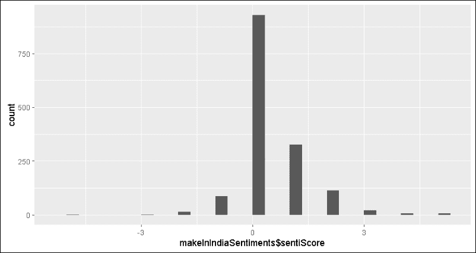

直方图很容易解释。它在 *x* 轴上显示了分布在极性刻度上的鸣叫，在 *y* 轴上显示了鸣叫的频率。结果显示正态分布，总体倾向于正态分布。这一举措似乎得到了受众的积极响应。

让我们更深入地分析一下这个分析本身，分析一下对同一个搜索词的看法，看看这些看法是如何随着时间的推移而变化的。

### 注意

这项分析的推文是在倡议发起当天和一天后提取的。由于 Twitter 的动态特性，您的结果可能会有所不同。你也可以在本章的其他例子中观察到不同的结果。我们鼓励你在学习本章中的例子时，发挥创造力，尝试其他流行话题。

输出如下所示:


前面的两个直方图显示了两天内观点的转变。如果你当时正在关注新闻，在这个项目的一个活动中，突然发生了一场大火，烧毁了整个舞台。上面的图表是基于火灾发生后的推文，而标记为 **makeinindia_yday** 的图表是指前一天的推文。虽然情绪的转变并不激烈，但很明显，这种转变更倾向于积极的一面(一些推文甚至达到了 6+的分数)。这可能是因为 tweeple 开始称赞应急小组和警察在防止伤亡方面的快速行动吗？好吧，看起来 Twitter 不仅仅是关于人们对随机事件的咆哮！

### 注

**世界领导人**

推特引起了名人和政治家的狂热。作为一个快速练习，试着分析世界领导人的推特账号，比如`@potus`、`@pmoindia`和`@number10gov`，看看我们的领导人通过推特表达什么样的观点。如果他们的时间线是中立的，不要感到惊讶...哎呀，外交！

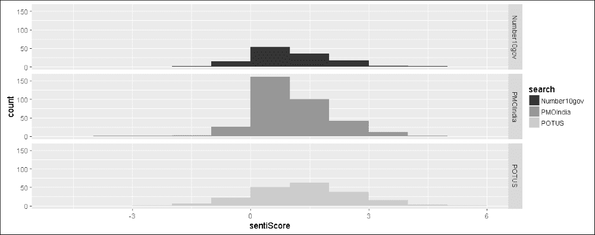

## 基于分类的算法

分类问题需要根据每个类的一些定义的特征将输入数据标记为所需的类(参见[第 2 章](ch02.html "Chapter 2. Let's Help Machines Learn")、*让我们帮助机器学习*，了解详细信息)。在情感分析的情况下，分类是积极的和消极的(或者在某些情况下是中性的)。在前面的章节中，我们已经了解了不同的分类算法，并看到了它们是如何跨领域用于解决分类和分类问题的，情感分析是这些算法非常有用的另一个领域。

在本节中，我们将使用分类算法(如 SVM 和 boosting)进行意见挖掘。我们也将触及集合方法，看看它们如何帮助提高性能。请注意，在本节中，我们将只关注正极性和负极性，但这种方法足够通用，可以很容易地扩展到包括中性极性。

### 标签数据集

由于这是一种受监督的学习方法，我们需要带标签的数据来训练和测试我们算法的性能。出于本章的目的，我们将利用来自[http://www.sentiment140.com/](http://www.sentiment140.com/)的标记数据集。它包含分别标记为 0、2 和 4 的负面、中性和正面情绪的推文。除了情感标签之外，还有各种属性，如`tweet ID`、`date`、`search query`、`username`、`tweet text`。对于我们的例子，我们将只考虑 tweet 文本及其相应的标签。


### 注意

在[https://github.com/guyz/twitter-sentiment-dataset](https://github.com/guyz/twitter-sentiment-dataset)可以找到另一个带标签的推文来源。这个源代码利用 python 脚本下载了大约 5000 条带标签的推文，同时牢记 Twitter API 准则。

在我们进入特定算法的细节之前，让我们看看标记的数据集，并执行收集数据并将其转换为所需形式的初始步骤。对于这些步骤，我们将使用库，如`caret`和`RTextTools`。

如前所述，数据集包含标记为 0、2 和 4 的极性，分别表示负极、中性和正极。我们将在 R 中加载`csv`文件，并应用一个快速转换来将标签更改为正数和负数。一旦极性被转换成可理解的名称，我们将过滤掉包含中性情绪的数据行。此外，我们将只保留极性和 tweet 文本的列，并删除其余的。

```r

# load labeled dataset

labeledDSFilePath = "labeled_tweets.csv"

labeledDataset = read.csv(labeledDSFilePath, header = FALSE)

# transform polarity labels

labeledDataset$V1 = sapply(labeledDataset$V1, 

 function(x) 

 if(x==4) 

 x <- "positive" 

 else if(x==0) 

 x<-"negative" 

 else x<- "none")

#select required columns only

requiredColumns <- c("V1","V6")

# extract only positive/negative labeled tweets 

tweets<-as.matrix(labeledDataset[labeledDataset$V1 

 %in% c("positive","negative")

 ,requiredColumns])

```

`tweets`对象现在是一个矩阵，每行代表一条推文，列代表极性和推文文本。在我们将这个矩阵转换成分类算法所需的格式之前，我们需要将我们的数据分成训练和测试数据集(参见[第 2 章](ch02.html "Chapter 2. Let's Help Machines Learn")、*让我们帮助机器学习*，了解更多信息)。因为为了训练和测试的目的，训练和测试数据集应该包含所有类的足够好的样本分布，所以我们使用`caret`包中的`createDataPartition` 函数。对于我们的用例，我们将数据分成 70/30 的训练和测试数据集:

```r

indexes <- createDataPartition(tweets[,1], p=0.7, list = FALSE)

train.data <- tweets[indexes,]

test.data <- tweets[-indexes,]

```

我们执行快速检查，以查看我们的数据是如何在原始数据集中的正类和负类以及训练和测试数据集中进行拆分的。您将在下面的屏幕截图中看到结果:

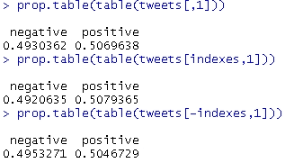

正如我们所见，`createDataPartition`在保持训练和测试数据集中相似的情感分布方面做得很好。

下一个转换是文档术语矩阵转换。正如我们在[第 7 章](ch07.html "Chapter 7. Social Media Analysis – Analyzing Twitter Data")、*社交媒体分析——分析 Twitter 数据*中看到的，文档术语矩阵将给定的数据集转换成代表文档的行和术语的列(单词/句子)。不像上一章，我们使用`tm`库的`DocumentTermMatrix`函数进行转换，并使用`tm_map`应用各种转换，对于当前用例，我们将使用来自`RTextTools`库的`create_matrix`函数。这个函数是对`tm`的相应函数的抽象。我们还将使用`tfidf`作为我们的特征，为每个术语分配权重。`create_matrix`方法还可以帮助我们将句子拆分成单词、停用词和数字移除，以及对它们进行词干处理。你可以这样做:

```r

train.dtMatrix <- create_matrix(train.data[,2], 

 language="english" , 

 removeStopwords=TRUE, 

 removeNumbers=TRUE,

 stemWords=TRUE,

 weighting = tm::weightTfIdf)

test.dtMatrix <- create_matrix(test.data[,2], 

 language="english" , 

 removeStopwords=TRUE, 

 removeNumbers=TRUE,

 stemWords=TRUE,

 weighting = tm::weightTfIdf,

 originalMatrix=train.dtMatrix)

test.data.size <- nrow(test.data)

```

### 注意

`RTextTools v1.4.2`中的`create_matrix`方法有一个小错误，当使用`originalMatrix`选项时会阻止权重分配。下面的小黑客可以用来修复这个问题，直到库得到更新:

```r

>  trace("create_matrix",edit=T) 

```

滚动到第 42 行，将缩写更新为缩写。

有关更多详细信息和处理此问题的替代方法，请查看以下链接:

[https://github.com/timjurka/RTextTools/issues/4](https://github.com/timjurka/RTextTools/issues/4)

[http://stack overflow . com/questions/16630627/recreate-same-document-term-matrix-with-new-data](http://stackoverflow.com/questions/16630627/recreate-same-document-term-matrix-with-new-data)

现在我们已经有了`DocumentTermMatrix`格式的训练和测试数据集，我们可以继续进行分类算法，让我们的机器学习和构建情感分类器！

### 支持向量机

**支持向量** **机器**，或者俗称的 **SVM** ，是分类监督学习算法中最通用的一类。SVM 以这样的方式构建模型，即属于不同类的数据点被清晰的间隙分隔开，该间隙被优化以使分隔距离尽可能最大。边缘上的样本被称为支持向量，由一个超平面分隔(详见[第 6 章](ch06.html "Chapter 6. Credit Risk Detection and Prediction – Predictive Analytics")、*信用风险检测和预测-预测分析*)。

由于我们当前的情感分析用例也是一个二元(积极和消极)分类问题，SVM 帮助我们使用训练数据集建立了一个模型，该模型将推文分别分为积极和消极的情感类别。

我们将使用`e1071`库的`svm`函数来构建一个情感分类器。我们从库中可用的 SVM 分类器的默认值开始，并遵循我们在[第 6 章](ch06.html "Chapter 6. Credit Risk Detection and Prediction – Predictive Analytics")、*信用风险检测和预测-预测分析*中所做的相同迭代程序，最终得到最佳分类器。下面的代码片段使用默认值构建一个情感分类器，然后打印一个混淆矩阵，以及其他用于评估的统计数据，如下面的代码片段所示:

```r

svm.model <- svm(train.dtMatrix, as.factor(train.data[,1]))

## view inital model details

summary(svm.model)

## predict and evaluate results

svm.predictions <- predict(svm.model, test.dtMatrix)

true.labels <- as.factor(test.data[,1])

confusionMatrix(data=svm.predictions, reference=true.labels, positive="positive")

```

如下生成的混淆矩阵显示，分类器只有 *50%的准确率*，这就像扔硬币一样糟糕，对负面情绪没有任何预测！看起来分类器不能从训练数据集中推断或学习太多。

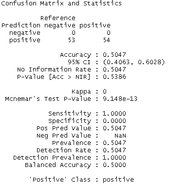

为了构建一个性能更好的模型，我们现在将深入底层并调整一些参数。来自`e1071`的`svm`实现为我们提供了一个名为`tune`的奇妙实用程序，用于在给定的参数范围内使用网格搜索获得超参数的优化值:

```r

## hyperparameter optimizations

# run grid search

cost.weights <- c(0.1, 10, 100)

gamma.weights <- c(0.01, 0.25, 0.5, 1)

tuning.results <- tune(svm, train.dtMatrix, as.factor(train.data[,1]), kernel="radial", 

 ranges=list(cost=cost.weights, gamma=gamma.weights))

# view optimization results

print(tuning.results)

# plot results

plot(tuning.results, cex.main=0.6, cex.lab=0.8,xaxs="i", yaxs="i")

```

### 注意

在上面的代码片段中，我们利用了**径向偏置核**(或简称为 **rbf** )进行超参数优化。使用 rbf 的动机是因为它在*特异性*和*灵敏度*方面的性能更好，尽管总体精度与*线性*内核相当。我们敦促我们的读者尝试线性核，并观察整体结果的差异。请注意，对于文本分类，线性核通常比其他核表现得更好，不仅在准确性方面，而且在性能方面

参数调整导致超参数`cost`和`gamma`的优化值分别为`10`和`0.01`；下图证实了这一点(最暗的区域对应最佳值)。

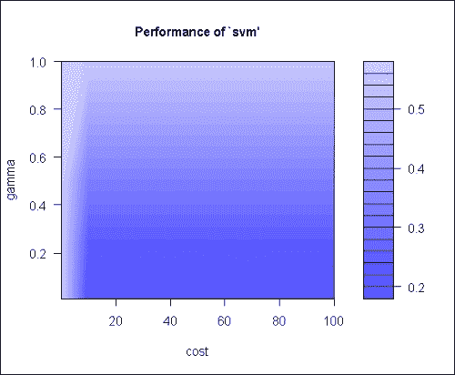

以下代码片段使用最佳模型来预测和准备混淆矩阵，如下所示:

```r

# get best model and evaluate predictions

svm.model.best = tuning.results$best.model

svm.predictions.best <- predict(svm.model.best, test.dtMatrix)

confusionMatrix(data=svm.predictions.best, reference=true.labels, positive="positive")

```

下面的混淆矩阵显示了一个大大改进的模型的预测。从仅仅 50%的准确率到 80%甚至更高的准确率是一个很好的飞跃。让我们检查该模型的 ROC 曲线，以确认准确性确实足够好:

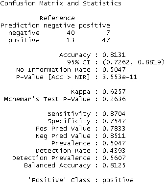

为了准备 ROC 曲线，我们将重用第 6 章、*信用风险检测和预测-预测分析*中的实用程序脚本`performance_plot_utils.R`，并将优化模型中的预测传递给 it:

```r

# plot best model evaluation metric curves

svm.predictions.best <- predict(svm.model.best, test.dtMatrix, decision.values = T)

svm.prediction.values <- attributes(svm.predictions.best)

$decision.values

predictions <- prediction(svm.prediction.values, true.labels)

par(mfrow=c(1,2))

plot.roc.curve(predictions, title.text="SVM ROC Curve")

plot.pr.curve(predictions, title.text="SVM Precision/Recall Curve")

```

使用上述代码片段生成的 ROC 曲线如下:


ROC 曲线也证实了 AUC 为 0.89 的良好学习模型。因此，我们可以使用这个模型将推文分为正面或负面类别。我们鼓励读者尝试基于 ROC-b 的优化，并观察模型中是否有任何进一步的改进。

### 合奏方法

简而言之，有监督的机器学习算法是关于学习潜在的功能或模式，这些功能或模式帮助我们基于历史数据准确预测(在一定范围内)。在本书的过程中，我们遇到了许多这样的算法，尽管 R 使得编码和测试这些算法变得容易，但是值得一提的是，学习一个高度精确的函数或模式并不是一件容易的事情。构建高度复杂的模型会导致过度拟合和欠拟合等问题。在所有这些混乱中，需要注意的是学习简单的规则和函数总是很容易的。

例如，为了将电子邮件分类为垃圾邮件或非垃圾邮件，机器学习算法必须学习多个规则，例如:

*   包含诸如*立即购买*等文字的电子邮件是垃圾邮件
*   包含五个以上超链接的电子邮件是垃圾邮件
*   来自通讯录中联系人的电子邮件不是垃圾邮件

以及更多类似的规则。给定一个训练数据集，比方说标签电子邮件的`T`，机器学习算法(具体来说是分类算法)将生成一个分类器`C`，它是一个底层功能或模式的假设。然后我们使用这个分类器`C`来预测新邮件的标签。

另一方面，分类器集成被定义为一组分类器，其输出以某种方式被组合以分类新的例子。基于机器学习的集成领域的主要发现是，集成的性能比组成它们的单个分类器好得多。

集合优于其组成部分的一个必要和充分条件是，它们应该是准确的和多样的。如果一个分类器的预测优于随机猜测，则称其为*精确的*(见弱学习者)。而如果两个分类器在相同的数据点上产生不同的错误，则它们被称为*不同的*。

我们可以将**弱学习者**定义为预测和决策至少比随机猜测要好的学习者。弱学习者也被称为基础学习者或元学习者。

下面的框图可视化了集成分类器的概念:

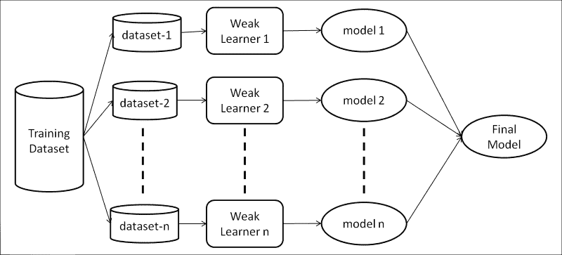

如前面的框图所示，训练数据集被分成 *n 个*数据集(这些数据集的分割或生成取决于集成方法)，弱学习器(相同或不同的弱学习器，同样取决于集成方法)基于这些数据集建立模型。然后基于加权或未加权投票将这些模型组合起来，以准备用于分类的最终模型。为什么群体工作的数学证明相当复杂，超出了本书的范围。

#### 助推

构建集成分类器(或回归器)有多种方法，boosting 是其中一种。Boosting 是 Robert Schapire 在 1990 年发表的名为*弱可学性的强度*的开创性论文中提出的答案，他在论文中优雅地描述了 Boosting 系综，同时回答了 Kearns 和 Valiant 在 1989 年发表的论文中提出的问题，该论文谈到了多个弱学习者可以创造一个强学习者。

### 注意

*弱可学性的力量*:[http://www . cs . Princeton . edu/~ schapire/papers/Strength of Weak . pdf](http://www.cs.princeton.edu/~schapire/papers/strengthofweak.pdf)。

**卡恩斯和瓦兰特:**学习布尔学习和有限自动机的密码学限制:[http://dl.acm.org/citation.cfm?id=73049](http://dl.acm.org/citation.cfm?id=73049)

最初的 boosting 算法被 Freund 和 Schapire 修改，命名为 **AdaBoost** 或**Adaptive****Boosting**。该算法实际上是可实现的，并从经验上提高了泛化性能。该算法可以用数学方法表示如下:

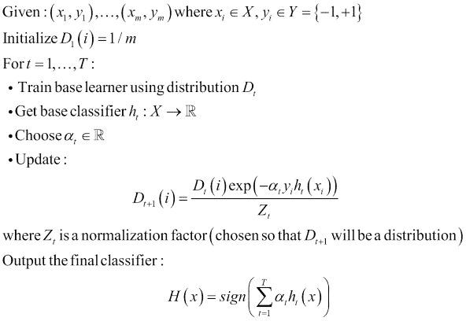

来源:[https://www . cs . Princeton . edu/Picasso/mats/schapire 02 boosting _ schapire . pdf](https://www.cs.princeton.edu/picasso/mats/schapire02boosting_schapire.pdf)

这里:

*   **X** 是训练集
*   **Y** 是标签组
*   **D [t] (i)** 是训练样本 **i** 在迭代 **t** 上的权重分布
*   **h [t]** 是迭代 **t** 得到的分类器
*   **α** 是**h[t]的强度参数或重量**
*   **H** 是最终或组合分类器。

简而言之，一般来说，提升从一开始就给所有训练样本分配相等的权重。然后，它在假设空间上迭代，以学习关于加权示例的假设 **h [t]** 。在每一个这样的假设被学习之后，权重以这样的方式被调整，即被正确分类的例子的权重被减少。这种对权重的更新有助于弱学习者在接下来的迭代中更加关注错误分类的数据点。最后，每个学习到的假设通过加权投票得出最终模型 **H** 。

现在我们已经对集成方法和 boosting 有了一个总体的概述，让我们使用 R 中的`RTextTools`库中可用的 boosting 实现来将 tweets 分类为正面或负面。

我们将重用我们为基于 SVM 的分类创建的训练测试文档术语矩阵`train.dtMatrix`和`test.dtMatrix`，以及容器对象`train.container`和`test.container`。

为了构建基于增强集成的分类器，`RTextTools`提供了一个简单易用的实用函数`train_model`。它在内部使用 *LogitBoosting* 来构建分类器。我们使用`500`迭代来构建我们的 boosting 系综。

```r

boosting.model <- train_model(train.container, "BOOSTING"

 , maxitboost=500)

boosting.classify <- classify_model(test.container, boosting.model)

```

然后，我们准备一个混淆矩阵，看看我们的分类器如何在测试数据集上执行。

```r

predicted.labels <- boosting.classify[,1]

true.labels <- as.factor(test.data[,1])

confusionMatrix(data = predicted.labels, 

 reference = true.labels, 

 positive = "positive")

```

下面的混淆矩阵显示，我们基于 boosting 的分类器的工作精度为 78.5%，这是相当好的，因为我们没有执行任何性能调整。相比之下，在 SVM 的初始迭代中，我们的准确率只有 50%多一点。

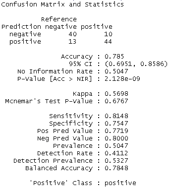

如前所述，集成方法(特别是 boosting)提高了广义性能，也就是说，它们有助于实现接近 0 的训练误差，而不会过度拟合训练数据。为了理解和评估我们在这些参数上的助推分类器，我们将使用一种叫做**交叉验证**的模型评估技术。

#### 交叉验证

交叉验证是一种模型评估技术，用于评估模型的泛化性能。这就是也称为**旋转估计**。与残差方法相比，交叉验证是验证模型泛化的更好的方法，因为对于传统的验证技术，训练集和测试集的误差(例如**根**均方误差 / **RMSE** )不能正确地表示模型的性能。交叉验证可通过以下方式进行:

*   **维持方法**:最简单的交叉验证技术。数据被分成训练集和测试集。在训练集上拟合模型，然后用测试集(模型目前还没见过)计算平均绝对测试误差。该累积误差用于评估模型。由于它依赖于训练-测试部分是如何完成的，这种技术有很大的差异。
*   **K 倍交叉验证方法**:这是对维持方法的改进。将数据集分成 *k* 个子集，然后使用 *k* 个子集的 *1* 作为测试集，其余的 *k-1* 作为训练集，应用保持方法 k 次。这种方法具有较低的方差，因为每个数据点在测试集中出现一次，在训练集中出现 *k-1* 次。缺点是由于迭代次数，需要更多的计算时间。K-fold 交叉验证的一种极端形式是省略一个交叉验证方法，其中除了一个数据点之外的所有数据点都用于训练。该过程重复 *N* (数据集的大小)次。

我们可以使用`cross_validate`函数在我们的 boosting 分类器上轻松执行 K-fold 交叉验证。通常，使用 10 重交叉验证:

```r

# Cross validation

N=10

set.seed(42)

cross_validate(train.container,N,"BOOSTING"

 , maxitboost=500)

```

前面的代码片段生成了以下交叉验证摘要:


结果表明，该分类器具有良好的泛化能力，总体平均准确率为 97.8%。

Boosting 是基于弱学习器构造集成分类器的方法之一。诸如装袋、贝叶斯最优分类器、分桶和堆叠等方法是一些各有利弊的变体。

### 注意

**构建系综**

`RTextTools`是一个健壮库，它提供了`train_models`和`classify_models`等函数，通过组合各种基础学习者来准备系综。它还提供了生成分析的工具，用于以非常详细的方式评估这种集合的性能。详见[https://journal . r-project . org/archive/2013-1/colling wood-jurka-Boyd stun-et al . pdf](https://journal.r-project.org/archive/2013-1/collingwood-jurka-boydstun-etal.pdf)。


# 总结

Twitter 是数据科学的金矿，有趣的模式和见解遍布其中。它源源不断的用户生成内容，加上独特的、基于兴趣的关系，提供了近距离了解人类动态的机会。情感分析就是这样一个领域，Twitter 提供了一套正确的成分来理解我们如何展示和分享关于产品、品牌、人物等的观点。

在这一章中，我们已经了解了情感分析的基础知识、关键术语和应用领域。我们还研究了执行情感分析时面临的各种挑战。我们已经研究了各种常用的特征提取方法，比如 tf-idf、Ngrams、POS、negation 等等，用于执行情感分析(或者一般的文本分析)。我们已经在前一章的基础上构建了代码库，以简化和构造实用函数供重用。我们使用 Twitter 搜索词进行了极性分析，看到了公众对某些活动的意见是如何被轻松跟踪和分析的。然后，我们继续研究用于分类的监督学习算法，其中我们使用 SVM 和 Boosting 来构建情感分类器，使用的库有`caret`、`RTextTools`、`ROCR`、`e1071`等等。在结束最后一章之前，我们还简要地谈到了高度研究和广泛使用的集成方法领域，并了解了基于交叉验证的模型评估。

还有许多其他算法和分析技术可以用来从 Twitter 和互联网上的其他来源中提取更有趣的见解。在这一章(和这本书)中，我们仅仅试图解决一个巨大冰山的一角！数据科学不仅仅是应用算法来解决问题或获得洞察力。除了领域理解、特性工程和收集数据以尝试和解决未知问题之外，它还需要创造性思维和大量的尽职调查。

总而言之，请思考唐纳德·拉姆斯菲尔德的这句话:

> *“已知有已知。这些是我们知道自己知道的事情。有已知的未知。也就是说，有些事情，我们知道我们不知道。但也有不为人知的未知。有些事情我们不知道我们不知道。”*

数据科学是学习已知和探索未知的未知的旅程，机器学习是帮助完成它的强大工具。`#KeepMining`！**