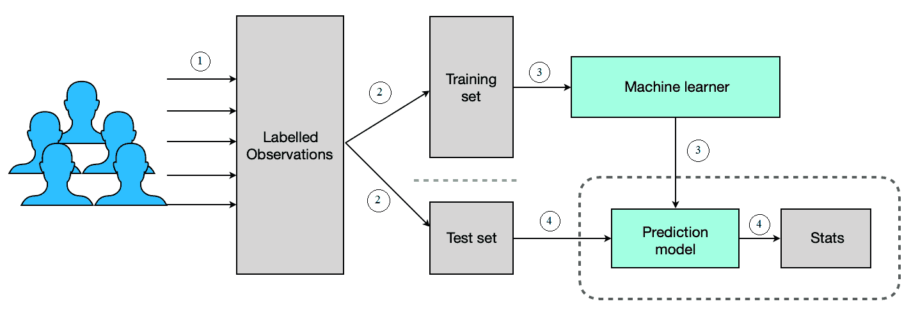
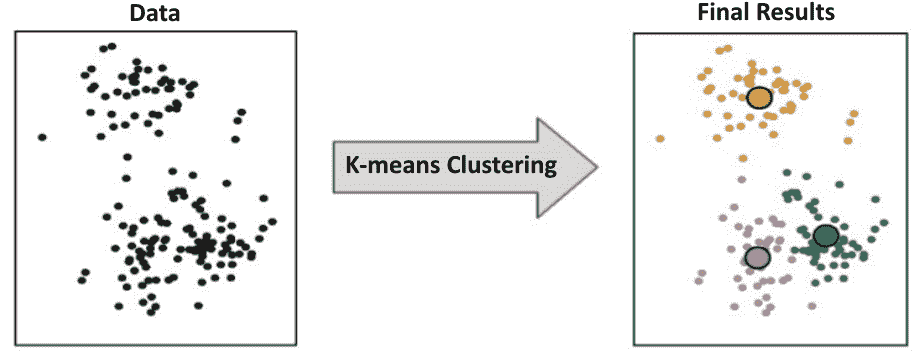
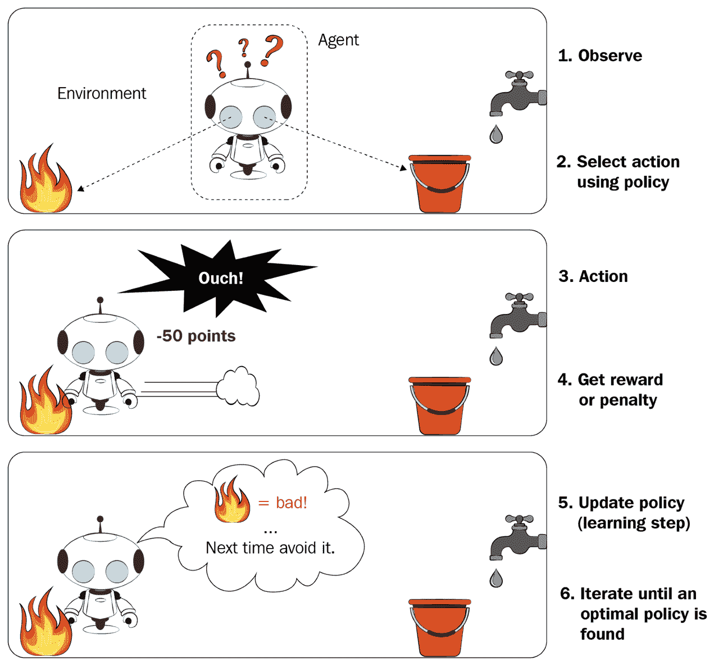
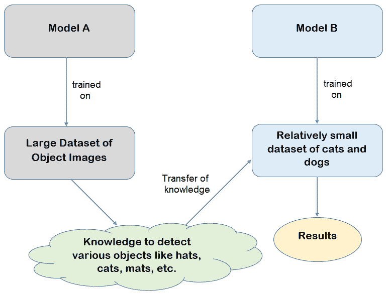
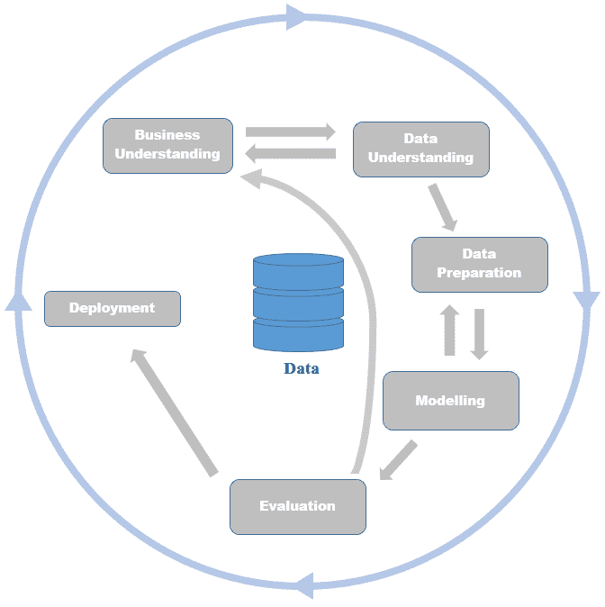

<title>Exploring the Machine Learning Landscape</title>  

# 探索机器学习的前景

**机器学习** ( **ML** )是试图模仿人类学习行为的**人工智能** ( **AI** )的一个令人惊叹的子领域。类似于婴儿通过观察它遇到的例子来学习的方式，ML 算法通过观察作为输入提供给它的数据点来学习对未来事件的结果或响应。

在本章中，我们将讨论以下主题:

*   ML 与软件工程
*   ML 方法的类型
*   ML 术语—快速回顾
*   ML 项目管道
*   学习范式
*   数据集

<title>ML versus software engineering</title>  

# ML 与软件工程

随着大多数人从传统的软件工程实践过渡到 ML，理解这两个领域之间的潜在差异是很重要的。从表面上看，这两个领域似乎都可以生成某种代码来执行特定的任务。观察到的一个有趣的事实是，与软件工程不同，在软件工程中，程序员显式地编写一个具有基于若干条件的各种响应的程序，ML 算法通过观察输入示例来推断游戏规则。当新的输入数据被输入系统时，所学习的规则被进一步用于更好的决策。

正如您在下图中所看到的，从数据中自动推断动作而无需人工干预是 ML 和传统编程的主要区别:

ML 与传统编程的另一个关键区别在于，通过 ML 获得的知识能够通过成功地解释算法从未见过的数据来概括训练样本之外的内容，而用传统编程编码的程序只能执行作为代码一部分的响应。

另一个区别是，在软件工程中，有一些特定的方法来解决手边的问题。给定一个基于某些输入假设和条件开发的算法，您将能够保证在给定输入的情况下获得输出。在 ML 世界中，不可能对从算法获得的输出提供这样的保证。在 ML 世界中，如果不在数据集上实际尝试这两种技术来解决手头的问题，也很难确认一种特定的技术是否优于另一种。

ML 和软件工程不一样！ML 项目里面可能会涉及到一些软件工程，但是不能认为 ML 和软件工程是一回事。

虽然洗钱有一个以上的正式定义，但下面提到的是一些经常遇到的关键定义:

"机器学习是让计算机在没有明确编程的情况下行动的科学."
—史丹福

“机器学习基于算法，这些算法可以从数据中学习，而不依赖于基于规则的编程。”
—麦肯锡公司

随着数据作为未来燃料的兴起，AI、ML、数据挖掘、数据科学和数据分析等术语被行业从业者互换使用。理解这些术语之间的主要区别以避免混淆是很重要的。

人工智能、ML、数据挖掘、数据科学和数据分析这些术语虽然可以互换使用，但它们并不相同！

让我们来看看以下术语:

*   **人工智能**:人工智能是机器能够以智能方式执行任务的典范。可以观察到，在人工智能的定义中，没有规定机器的智能是可以手动实现还是自动实现。因此，可以有把握地假设，即使是用几个`if...else`或`switch...case`语句编写的程序，然后被注入一台机器来执行任务，也可能被认为是 AI。
*   ML:另一方面，ML 是机器通过从作为输入提供的数据中学习来实现智能的一种方式，因此，我们有一个智能机器来执行任务。可以观察到，除了智能是自动实现的之外，m1 实现了与 AI 相同的目标。所以可以得出结论，ML 简单来说就是一种实现 AI 的方式。
*   **数据挖掘**:数据挖掘是一个特定的领域，专注于发现数据集的未知属性。数据挖掘的主要目标是从作为输入提供的大量数据中提取规则，而在 ML 中，算法不仅从数据输入中推断规则，还使用规则对任何新的输入数据进行预测。
*   **数据分析**:数据分析是一个包含执行基本描述性统计、数据可视化和数据点交流以得出结论的领域。数据分析可以被认为是数据科学中的一个基础层次。对于从业者来说，对为数据挖掘或 ML 练习提供的输入数据进行数据分析是正常的。这种数据分析通常被称为**探索性数据分析(EDA)** 。

*   **数据科学**:数据科学是一个总括术语，包括数据分析、数据挖掘、ML 以及与工作领域相关的任何特定领域的专业知识。数据科学是一个包括处理数据的几个方面的概念，例如从一个或多个来源获取数据、数据清理、数据准备以及基于现有数据创建新的数据点。它包括执行数据分析。它还包括对数据使用一种或多种数据挖掘或 ML 技术来推断知识，以创建对看不见的数据执行任务的算法。这个概念还包括以对将来执行指定任务有用的方式部署算法。

下面是一个维恩图，展示了在数据科学领域工作的专业人员所需的技能。它有三个圈，每个圈都定义了数据科学专业人员应该具备的特定技能:

让我们探讨一下上图中提到的以下技能:

*   **数学&统计知识**:分析数据的统计属性需要这种技能。
*   **黑客技能**:为了快速处理数据，编程技能起着关键作用。应用 ML 算法来创建将对看不见的数据执行预测的输出。
*   **实质性专长**:这个技能指的是手头问题领域的领域专长。它有助于专业人员能够向系统提供适当的输入，并从中学习和评估输入的适当性和获得的结果。

要成为一名成功的数据科学专家，你需要具备数学、编程技能以及业务领域的知识。

正如我们所见，人工智能、数据科学、数据分析、数据挖掘和 ML 都是相互联系的。所有这些领域都是目前业内需求最大的领域。正确的技能组合与现实世界的经验相结合，将导致在这些领域的强有力的职业生涯，目前的趋势。由于 ML 构成了引导空间的核心，下一节将探讨各种类型的 ML 方法，这些方法可以应用于一些现实世界的问题。

ML 无处不在！大多数时候，我们可能正在使用一些基于 ML 的东西，但没有意识到它的存在或它对我们生活的影响！让我们一起来探索一些日常生活中非常受欢迎的设备或应用，这些设备或应用都是由 ML 支持的:

*   **虚拟个人助理** ( **VPAs** )比如 **Google Allo** 、 **Alexa** 、 **Google Now** 、 **Google Home** 、 **Siri** 等等
*   智能地图，显示交通预测，给你的来源和目的地
*   优步或类似运输服务的需求价格飙升
*   机场、火车站和其他公共场所的自动视频监控
*   对脸书等社交媒体网站上发布的图片中的个人进行人脸识别
*   在脸书为您提供个性化新闻
*   YouTube 上为您提供的广告
*   你可能认识的人建议上脸书和其他类似的网站
*   LinkedIn 上的工作推荐，基于你的个人资料
*   谷歌邮件上的自动回复
*   您在在线客户支持论坛上与之交流的聊天机器人
*   搜索引擎结果过滤
*   垃圾邮件过滤

当然，这个列表并没有到此为止。前面提到的应用只是几个基本的应用，说明了 ML 对我们今天生活的影响。引用 ML 没有接触过的学科领域并不令人惊讶！

本节中的主题绝不是对 ML 的详尽描述，而只是让我们开始探索之旅的一个快速接触点。现在我们已经对 ML 是什么以及它可以应用在哪里有了基本的了解，让我们在下一节更深入地研究其他 ML 相关的主题。

<title>Types of ML methods</title>  

# ML 方法的类型

得益于 ML，旨在解决现实世界问题的几种类型的任务可以实现。ML 方法通常意味着一组特定类型的算法，这些算法适合于解决特定类型的问题，并且该方法处理问题带来的任何约束。例如，特定问题的约束可能是可作为学习算法的输入提供的标记数据的可用性。

本质上，流行的 ML 方法是监督学习、非监督学习、半监督学习、强化学习和迁移学习。本节的其余部分将详细介绍这些方法。

<title>Supervised learning</title>  

# 监督学习

当人们非常清楚需要从问题中获得的结果，但是不确定影响输出的数据之间的关系时，可以应用监督学习算法。我们希望我们应用于数据的 ML 算法能够理解不同数据元素之间的关系，从而实现期望的输出。

这个概念可以用一个例子来更好地解释——在银行，在发放贷款之前，他们希望预测贷款申请人是否会偿还贷款。在这种情况下，问题就很明显了。如果向潜在客户 X 发放贷款，有两种可能性:X 会成功偿还贷款，或者 X 不会偿还贷款。银行希望使用 ML 来识别客户 X 所属的类别；即贷款的成功还款者或还款违约者。

虽然要解决的问题定义很清楚，但请注意，有助于成功偿还贷款或不偿还贷款的客户特征并不清楚，这是我们希望 ML 算法通过观察数据中的模式来了解的。

这里的主要挑战是，我们需要提供输入数据，既代表成功偿还贷款的客户，也代表未能偿还贷款的客户。银行只需查看历史数据，即可获得这两类客户的记录，然后根据需要将每条记录标记为已付或未付类别。

这样标记的记录现在成为监督学习算法的输入，这样它就可以学习这两类顾客的模式。从标记数据中学习的过程称为**训练**，从学习过程中获得的输出(算法)称为**模型**。理想情况下，银行会将一部分标记数据与训练数据分开，以便能够测试所创建的模型，这些数据被称为**测试数据**。用于训练模型的标记数据被称为**训练数据**，这并不奇怪。

一旦建立了模型，通过用测试数据测试模型来获得测量值，以确保模型产生令人满意的性能水平，否则执行模型建立迭代，直到获得期望的模型性能。银行可以使用在测试数据上达到预期性能的模型来推断任何新的贷款申请人是否会成为未来的违约者，如果是，则在向该申请人提供贷款方面做出更好的决定。

简而言之，当目标非常明确并且标记数据可用作算法学习模式的输入时，使用监督 ML 算法。下图总结了监督学习过程:

监督学习可以进一步分为两类，即**分类**和**回归**。本节中解释的银行贷款违约预测是分类的一个示例，其目的是预测名义类型的标签，如“是”或“否”。另一方面，也可以预测数值(连续值)，这种类型的预测称为回归。回归的一个例子是，根据该地区的房屋需求、卧室数量、房屋尺寸以及公共交通便利性等特征来预测城市黄金地段房屋的月租金。

有几种监督学习算法，这一领域的一些公知算法包括**分类和回归树** ( **车**)、逻辑回归、线性回归、朴素贝叶斯、神经网络、 **k 近邻** ( **KNN** )和**支持向量机** ( **SVM** )。

<title>Unsupervised learning</title>  

# 无监督学习

标记数据的可用性不是很普遍，手动标记数据也不便宜。这就是无监督学习发挥作用的情况。

例如，一家小型精品公司希望向其在脸书页面上注册的客户推出促销活动。虽然业务目标很明确——需要向客户推广促销活动——但不清楚哪个客户属于哪个组。与监督学习方法不同，在监督学习方法中，先验知识存在于坏债务人和好债务人方面，在这种情况下，没有这样的线索。

当客户信息作为非监督学习算法的输入时，它试图识别数据中的模式，从而将具有相似属性的客户数据分组。

物以类聚，人以群分是无监督学习在客户分组中遵循的原则。

从分组练习中形成这些有机组背后的推理可能不是很直观。可能需要一些研究来确定促成一组客户聚集在一个组中的因素。大多数时候，这种研究是手工的，每组中的数据点都需要验证。这种研究可以形成基础，以确定手头的特定促销活动需要推广到哪些群体。这种无监督学习的应用被称为**聚类**。下图显示了无监督 ML 在数据点聚类中的应用:

有许多聚类算法。然而，最流行的是 k-均值聚类、k-模式聚类、层次聚类、模糊聚类等。

其他形式的无监督学习确实存在。例如，在零售业，一种称为**关联规则挖掘**的无监督学习方法被应用于客户购买，以识别一起购买的商品。在这种情况下，与监督学习不同，完全不需要标签。所涉及的任务只需要 ML 算法来识别由客户一起计费的产品之间的潜在关联。从关联规则挖掘中获取信息有助于零售商将一起购买的产品放在邻近的位置。这个想法是可以直观地鼓励顾客购买额外的产品。

先验地，**等价类变换** ( **Eclat** )和**频率模式增长** ( **FPG** )是现有的执行关联规则挖掘的几种算法中流行的。

无监督学习的另一种形式是异常检测或异常值检测。该练习的目标是识别不属于作为无监督学习算法的输入给出的其余元素的数据点。类似于关联规则挖掘，由于手头问题的性质，算法不需要利用标签来实现目标。

欺诈检测是异常检测在信用卡行业中的一个重要应用。信用卡交易被实时监控，并且任何虚假的交易模式被立即标记，以避免信用卡用户和信用卡提供商的损失。被监控的异常模式可能是以外币进行的巨额交易，而不是特定客户通常进行交易的正常货币。这可能是位于两个不同大陆的实体店在同一天进行的交易。总的想法是能够标记出一个偏离常规的模式。

K-means 聚类和一类 SVM 是两种众所周知的无监督 ML 算法，用于观察群体中的异常。

总的来说，可以理解，鉴于用于训练的标记数据是稀缺资源，无监督学习无疑是一种非常重要的方法。

<title>Semi-supervised learning</title>  

# 半监督学习

半监督学习是监督和非监督方法的混合。ML 需要大量的数据进行训练。大多数情况下，用于模型训练的数据量与模型的性能之间存在正比关系。

在医学成像等小众领域，大量图像数据(核磁共振成像、x 光、CT 扫描)是可用的。然而，合格的放射科医生标记这些图像的时间和可用性是稀缺的。在这种情况下，我们可能最终只能得到一些由放射科医生标记的图像。

半监督学习通过建立初始模型来利用少量标记图像，该初始模型用于标记域中存在的大量未标记数据。一旦大量标记数据可用，可以使用监督 ML 算法来训练和创建最终模型，该最终模型用于对未知数据的预测任务。下图说明了半监督学习中涉及的步骤:

语音分析、蛋白质合成和 web 内容分类是某些领域，在这些领域中有大量的未标记数据和少量的标记数据。半监督学习在这些领域得到了成功的应用。

**生成对抗网络** ( **甘斯**)、**半监督支持向量机** ( **S3VMs** )、基于图的方法和**马尔可夫链方法是半监督 ML 领域中众所周知的方法。**

<title>Reinforcement learning</title>  

# 强化学习

**强化学习** ( **RL** )是一种 ML 方法，既不是监督学习，也不是无监督学习。在这种方法中，奖励定义在开始时被提供作为这种学习算法的输入。由于该算法不提供用于训练的标记数据，这种类型的学习算法不能被归类为监督学习。另一方面，它不被归类为无监督学习，因为该算法被提供了关于奖励定义的信息，该信息指导该算法采取步骤来解决手头的问题。

强化学习旨在通过依赖收到的反馈来改进用于持续解决任何问题的策略。目标是在采取措施解决问题的同时获得最大的回报。获得的奖励由算法本身根据奖励和惩罚定义来计算。这个想法是实现最佳的步骤，最大化的回报来解决手头的问题。

下图描述了一个机器人在特定的火灾环境中通过强化学习方法自动确定理想行为:

一台在雅达利电子游戏中击败人类的机器被称为强化学习最重要的成功故事之一。为了实现这一壮举，人类玩的大量示例游戏被输入到算法中，该算法学习采取步骤以最大化奖励。在这种情况下，奖励是最终得分。从示例输入中学习后的算法，只是模拟了游戏中每一步的模式，最终使获得的分数最大化。

虽然强化学习似乎只能应用于游戏场景，但这种方法在行业中也有许多使用案例。下面提到的例子是三个这样的用例:

*   基于自发供求的商品和服务的动态定价旨在实现利润最大化，通过一种称为 **Q-learning** 的强化学习来实现。
*   仓库空间的有效利用是库存管理专业人员面临的一个主要挑战。市场需求波动、大量可用库存以及重新补充库存的延迟是影响空间利用率的主要制约因素。强化学习算法用于优化采购库存的时间以及减少从仓库取回货物的时间，从而直接影响被称为库存管理领域中的问题的空间管理问题。
*   在医学中，需要延长治疗和不同的药物给药来治疗诸如癌症的疾病。基于患者的特征，治疗是高度个性化的。治疗通常包括不同阶段的不同治疗策略。这种治疗计划通常被称为**动态治疗方案** ( **DTR** )。强化学习有助于处理临床试验数据，根据作为强化学习算法输入的患者特征，为患者提供适当的个性化 DTR。

有四种非常流行的强化学习算法，分别是 Q-learning、**state-action-reward-state-action**(**SARSA**)、 **deep Q network** ( **DQN** )、**deep deterministic policy gradient**(**DDPG**)。

<title>Transfer learning</title>  

# 迁移学习

代码的可重用性是面向对象编程的基本概念之一，在软件工程领域非常流行。类似地，迁移学习涉及重用为实现特定任务而构建的模型来解决另一个相关的任务。

可以理解的是，为了实现更好的性能测量，ML 模型需要在大量标记数据上进行训练。更少数量的数据意味着更少的训练，结果是一个性能次优的模型。

迁移学习试图通过重用从不同的相关模型获得的知识来解决因数据量较少而产生的问题。拥有更少的数据点来训练模型不应该妨碍建立更好的模型，这是迁移学习背后的核心概念。下图显示了在对狗和猫图像进行分类的图像识别任务中迁移学习的目的:

在此任务中，神经网络模型涉及检测前几层中的边缘、颜色斑点检测等。只有在渐进层(可能在最后几层)，模型才试图识别狗或猫的面部特征，以便将它们分类为目标之一(狗或猫)。

可以观察到，识别边缘和彩色斑点的任务并不特定于猫和狗的图像。即使模型是在非狗或非猫的图像上训练的，推断边缘或色块的知识通常也是可以推断的。最终，如果这种知识与从推断猫脸和狗脸得到的知识结合起来，即使它们的数量很少，我们也会有一个比通过在更少的图像上训练获得的次优模型更好的模型。

在狗-猫分类器的情况下，首先，在不限于猫和狗的图像的大量图像上训练模型。然后模型被取走，最后几层被重新训练在狗和猫的脸上。这样获得的模型然后被测试和使用，证明性能测量是令人满意的。

迁移学习的概念不仅用于与图像相关的任务。另一个使用它的例子是在自然语言处理中，它可以对文本数据进行情感分析。

假设一家推出新产品的公司有一个以前从未有过的概念(比方说，就目前而言，一辆飞行汽车)。任务是分析与新产品相关的推文，并确定它们中的每一条是积极的、消极的还是神经情绪的。可以观察到，在飞行汽车的领域中，先前标记的推文是不可用的。在这种情况下，我们可以基于几个产品和领域的通用产品评论的标记数据建立一个模型。我们可以通过补充飞行汽车领域特定的术语来重用该模型，以利用新模型。这个新模型将最终用于测试和部署，以分析关于新推出的飞行汽车的推文中的情绪。

迁移学习可以通过以下两种方式实现:

*   通过重用自己的模型
*   通过重用预先训练的模型

预训练模型是由各种组织或个人建立的模型，作为他们研究工作的一部分或竞赛的一部分。这些模型通常非常复杂，并且基于大量数据进行训练。它们还经过优化，可以高精度地执行任务。这些模型可能需要几天或几周的时间在现代硬件上进行训练。组织或个人通常在许可的情况下发布这些模型以供重用。这种预先训练的模型可以通过迁移学习范式下载和重用。这将有效地利用预先训练的模型所拥有的大量现有知识，否则对于硬件资源和要训练的数据量有限的个人来说，很难获得这些知识。

各方提供了几种预训练模型。下面描述了一些流行的预训练模型:

*   **Inception-V3 模型**:这个模型已经在 ImageNet 上进行了训练，作为一个大型视觉识别挑战的一部分。比赛要求参与者将一张给定的图片分成 1000 个类别。一些类包括动物的名字和物体的名字。

*   MobileNet :这个预先训练好的模型是由 Google 建立的，它旨在使用 ImageNet 数据库执行对象检测。该架构是为手机设计的。
*   **VCG 人脸**:这是一个为人脸识别建立的预训练模型。
*   **VCG 16** :这是在**可可女士**数据集上训练的预训练模型。这一个完成图像字幕；也就是说，给定一个输入图像，它生成一个描述图像内容的标题。
*   **谷歌的 Word2Vec 模型和斯坦福的 GloVe 模型**:这些经过预训练的模型将文本作为输入，产生单词向量作为输出。分布式单词向量为 NLP 或 ML 应用程序提供了一种表示文档的形式。

现在我们已经对各种可能的 ML 方法有了基本的了解，在下一节中，我们将重点快速回顾 ML 中使用的关键术语。

<title>ML terminology – a quick review</title>  

# ML 术语——快速回顾

在这一节中，我们采用流行的 ML 术语并对其进行回顾。这份非详尽的综述将帮助我们快速复习，并使我们能够顺利地跟踪本书涵盖的项目。

<title>Deep learning</title>  

# 深度学习

这是一个革命性的趋势，并成为最近一段时间 ML 世界的超级热门话题。它是一种 ML 算法，使用具有多个隐藏神经元层的**人工神经网络** ( **ANNs** )来解决问题。

通过将深度学习应用于几个现实世界的问题，获得了优越的结果。**卷积神经网络**(**CNN**)，**递归神经网络** ( **RNNs** ) **自动编码器** ( **AEs** )，**生成对抗网络** ( **GANs** )，以及**深度信念网络** ( **DBNs** )是一些流行的深度学习方法

<title>Big data</title>  

# 大数据

该术语指的是大量的数据，包括结构化数据类型(类似于表格的行和列)和非结构化数据类型(文本文档、录音、图像数据等)。由于数据量的原因，它不适合需要执行 ML 算法的硬件的主存储器。需要单独的策略来处理这些大量的数据。数据的分布式处理和结果的组合(通常称为 **MapReduce** )是一种策略。也有可能每次顺序地处理刚好足够放入主存储器的数据，并将结果存储在硬盘上的某个地方；我们需要重复这个过程，直到所有的数据都处理完毕。数据处理后，需要将结果组合起来，以利用所有已处理数据的最终结果。

对大数据进行 ML 需要 Hadoop、Spark 等特殊技术。不用说，为了在大数据上成功应用这些技术，您需要磨练专业技能。

<title>Natural language processing</title>  

# 自然语言处理

这是人工智能的一个应用领域，旨在让计算机理解人类语言，如英语、法语和普通话。NLP 应用程序使用户能够使用口语与计算机进行交互。

聊天机器人、语音合成、机器翻译、文本分类和聚类、文本生成和文本摘要是 NLP 的一些流行应用。

<title>Computer vision</title>  

# 计算机视觉

ML 的这个领域试图模仿人类的视觉。其目的是让计算机能够看到、处理和确定图像或视频中的对象。深度学习和强大硬件的可用性导致了 ML 领域中非常强大的应用程序的兴起。

诸如自动驾驶汽车、物体识别、物体跟踪、运动分析和图像恢复之类的自动车辆是计算机视觉的一些应用。

<title>Cost function</title>  

# 价值函数

成本函数、损失函数或误差函数被从业者交替使用。每一种都用于定义和测量模型的误差。ML 算法的目标是最小化数据集的损失。

成本函数的一些例子是线性回归中使用的平方损失、支持向量机中使用的铰链损失和分类算法中用于测量准确度的 0/1 损失。

<title>Model accuracy</title>  

# 模型精度

准确性是用于测量 ML 模型性能的流行指标之一。度量很容易理解，并帮助从业者非常容易地向其业务用户传达模型的优点。

通常，这种度量用于分类问题。准确性是用正确预测的数量除以预测的总数来衡量的。

<title>Confusion matrix</title>  

# 混淆矩阵

此表描述了分类模型的性能。它是一个 *n* 行， *n* 列的矩阵，其中 *n* 表示由分类模型预测的类的数量。当与实际标签比较时，通过记下模型的正确和错误预测的数量来形成。

混淆矩阵可以用一个例子来更好地解释——假设一个数据集中有 100 张图片，其中有 50 张狗图片和 50 张猫图片。给定该数据集，建立模型以将图像分类为猫图像或狗图像。模型的输出表明，40 幅狗图像被正确分类，20 幅猫图像被正确预测。下表是根据模型的预测输出构建的混淆矩阵:

| 模型预测标签 | **实际标签** |
|  | 猫 | 狗 |
| 猫 | 20 | 30 |
| 狗 | 10 | 40 |

<title>Predictor variables</title>  

# 预测变量

这些变量也称为**独立变量**或 **x 值**。这些是有助于预测因变量、目标变量或响应变量的输入变量。

在房屋租金预测用例中，房屋的平方英尺大小、卧室数量、该地区空闲房屋的数量、公共交通的邻近程度、医院和学校等设施的可达性都是决定房屋租赁成本的预测变量的一些示例。

<title>Response variable</title>  

# 响应变量

因变量或目标值或 y 值均可被从业者互换使用，作为术语**响应变量**的替代物。这是模型根据作为输入提供给模型的独立变量预测为输出的变量。

在房租预测用例中，预测的房租是响应变量。

<title>Dimensionality reduction</title>  

# 降维

特征约简(或特征选择)或维数约简是对输入的独立变量集进行约简，以获得模型预测目标真正需要的较少数量的变量的过程。

在某些情况下，可以通过将多个因变量组合在一起来表示它们，而不会丢失太多信息。例如，不是有两个独立的变量，如矩形的长度和矩形的宽度，尺寸可以只由一个称为面积的变量来表示，该变量表示矩形的长度和宽度。

以下是我们需要对给定输入数据集执行降维的多种原因:

*   为了有助于数据压缩，请将数据存放在较小的磁盘空间中。
*   由于使用更少的维度来表示数据，处理数据的时间减少了。
*   它从数据集中移除冗余要素。冗余要素通常被称为数据中的**多重共线性**。

*   将数据减少到更少的维度有助于通过图形和图表可视化数据。
*   降维可移除数据集中的噪声特征，从而提高模型性能。

有许多方法可以降低数据集中的维数。使用过滤器，如信息增益过滤器和对称属性评估过滤器，是一种方法。基于遗传算法的选择和**主成分分析** ( **PCA** )是用于实现降维的其他流行技术。确实存在混合方法来实现特征选择。

<title>Class imbalance problem</title>  

# 阶级失衡问题

让我们假设需要建立一个识别猫和狗图像的分类器。这个问题有两类，即猫和狗。如果要训练分类模型，就需要训练数据。在这种情况下，训练数据基于作为输入给出的狗和猫的图像，因此监督学习模型可以学习狗和猫的特征。

如果数据集中有 100 幅图像可用于训练，其中 95 幅是狗的图片，那么其中 5 幅是猫的图片。训练数据集中不同类的这种不平等表示被称为类不平衡问题。

当每个类中的例子数量大致相等时，大多数 ML 技术工作得最好。人们可以采用某些技术来解决数据中的类别不平衡问题。一种技术是减少多数类(狗的图像)样本，并使它们等于少数类(猫的图像)。在这种情况下，由于大量的狗图像没有被使用，所以存在信息损失。另一种选择是生成类似于少数类数据(猫的图像)的合成数据，以便使数据样本的数量等于多数类。**合成少数过采样技术** ( **SMOTE** )是一种非常流行的生成合成数据的技术。

可以注意到，在训练数据集经历类别不平衡问题的情况下，准确度不是评估模型性能的良好度量。假设一个基于类别不平衡数据集构建的模型，该数据集预测要求它预测的任何测试样本的多数类别。在这种情况下，可以获得 95%的准确率，因为大约 95%的图像是测试数据集中的狗图像。但这种表现只能被称为一个骗局，因为该模型没有任何辨别能力——它只是预测狗作为它需要预测的任何图像的类别。在这种情况下，恰好每个图像都被预测为一只狗，但模型仍然以非常高的精度逃脱，这表明它是一个伟大的模型，无论它是不是在现实中！

在类别不平衡是一个问题的情况下，有几个其他的性能指标可以使用，F1 分数和接收机工作特性曲线下的**面积** ( **AUCROC** )是一些流行的指标。

<title>Model bias and variance</title>  

# 模型偏差和方差

虽然有几种最大似然算法可用于建立模型，但可以根据模型产生的偏差和方差来选择模型。

当模型从作为输入提供的数据集中学习真实信号的能力有限时，就会出现偏差。有一个高度偏向的模型本质上意味着模型是一致的，但平均起来是不准确的。

当模型对用来训练它们的训练数据集过于敏感时，会出现方差误差。模型中的高方差本质上意味着训练的模型平均起来将在任何测试数据集上产生高精度，但是它们的预测是不一致的。

<title>Underfitting and overfitting</title>  

# 欠拟合和过拟合

欠拟合和过拟合是与偏差和方差密切相关的概念。这两个是模型性能差的最大原因，因此从业者在构建 ML 模型时必须非常密切地关注这些问题。

模型对训练数据和测试数据都表现不佳的情况称为欠拟合。这种情况可以通过观察高训练误差和测试误差来检测。具有欠拟合问题意味着选择来拟合模型的 ML 算法不适合对训练数据的特征进行建模。因此，唯一的补救办法是尝试其他种类的 ML 算法来对数据建模。

过度拟合是指模型很好地学习了训练数据的特征，以至于无法对其他看不见的数据进行归纳。在过度拟合模型中，训练数据中的噪声或随机波动被模型视为真实信号，并且它也在看不见的数据中寻找这些模式，因此影响了较差的模型性能。

过度拟合在诸如决策树和神经网络的非参数和非线性模型中更为普遍。修剪树木是解决这个问题的一种方法。另一种补救措施是一种称为 **dropout** 的技术，其中从模型中学习到的一些特征被随机地从模型中删除，从而使模型更能概括看不见的数据。正则化是解决过度拟合问题的另一种技术。这是通过惩罚模型的系数来实现的，以便模型更好地概括。L1 惩罚和 L2 惩罚是在回归场景中可以通过其执行正则化的惩罚类型。

从业者的目标是确保模型既不过拟合也不欠拟合。为了实现这一点，有必要了解何时停止训练 ML 数据。人们可以在图表上绘制训练误差和验证误差(在被搁置的训练数据集的一小部分上测量的误差),并且识别训练数据保持减少，然而验证误差开始上升的点。

有时，获取训练数据的性能度量并期望在看不见的数据上获得类似的度量可能不起作用。通过采用称为 k-fold 交叉验证的数据重采样技术，可以从模型中获得更真实的训练和测试性能估计。k 倍交叉验证中的 *k* 是指一个数；示例包括三重交叉验证、五重交叉验证和十重交叉验证。 **k 重交叉验证**技术包括将训练数据分成 *k* 部分，并运行训练过程 *k* + 1 次。在每次迭代中，对数据的第 *k* - 1 个分区进行训练，第 *k* ^第个分区专门用于测试。可以注意到，用于测试的第 *k* ^第个分区和用于训练的第 *k* - 1 个分区在每次迭代中被混洗，因此训练数据和测试数据在每次迭代中并不保持不变。这种方法能够获得对性能的悲观测量，这可以从模型中对未来的未知数据进行预测。

通过 10 次运行获得模型性能的 10 重交叉验证被认为是从业者对模型性能的黄金标准估计。在工业设置和关键的 ML 应用中，总是建议以这种方式估计模型的性能。

<title>Data preprocessing</title>  

# 数据预处理

这基本上是在 ML 项目管道的早期阶段采用的一个步骤。数据预处理包括将原始数据转换成 ML 算法可接受的输入格式。

特征散列、缺失值插补、将变量从数值转换为名义值以及从名义值转换为数值是数据预处理过程中的几个步骤。

原始文本文档到单词向量的转换是数据预处理的一个例子。由此获得的词向量可以被馈送到 ML 算法，以实现文档分类或文档聚类。

<title>Holdout sample</title>  

# 保持样本

在处理定型数据集时，会保留一小部分数据用于测试模型的性能。一小部分数据是看不见的数据(在训练中不使用)，因此可以依赖于对该数据获得的测量。所获得的测量结果可以用于调整模型的参数，或者仅仅是报告模型的性能，以便根据可以从模型中预期的性能水平来设置期望值。

可以注意到，基于维持样本报告的性能测量不如 k 倍交叉验证估计那样稳健。这是因为在从原始数据集中随机拆分维持集的过程中，可能会出现一些未知的偏差。此外，也不能保证维持数据集表示定型数据集中涉及的所有类。如果我们需要维持数据集中所有类的表示，那么需要应用一种叫做**分层维持样本**的特殊技术。这确保了维持数据集中的所有类都有一个表示。显然，从分层的维持样本中获得的性能测量是比从非分层的维持样本中获得的性能估计更好的性能估计。

70%-30%、80%-20%和 90%-10%通常是在 ML 项目中观察到的训练数据集-维持数据拆分。

<title>Hyperparameter tuning</title>  

# 超参数调谐

ML 或深度学习算法在训练模型之前将超参数作为输入。每个算法都有自己的超参数集，有些算法可能没有超参数。

超参数调整是模型建立中的一个重要步骤。每种 ML 算法都带有一些默认的超参数值，这些值通常用于构建初始模型，除非专业人员手动覆盖这些超参数。在大多数情况下，为模型设置正确的超参数组合和正确的超参数值可以大大提高模型的性能。因此，强烈建议将超参数调整作为 ML 模型构建的一部分。搜索超参数值的可能范围是一项非常耗时的任务。

k-means 聚类和 k-近邻分类中的 *k* ，随机森林中的树数和树深，XGBoost 中的 *eta* 都是超参数的例子。

**网格搜索**和**贝叶斯**基于优化的超参数调优是从业者中流行的两种超参数调优方法。

<title>Performance metrics</title>  

# 性能指标

一个模型需要根据看不见的数据进行评估，以评估它的良好性。术语“良好”可以用几种方式表达，这些方式被称为模型性能度量。

有几个指标可以用来报告模型的性能。准确度、精确度、召回率、F 分数、灵敏度、特异性、AUROC 曲线、**均方根误差** ( **RMSE** )、汉明损失和**均方误差** ( **MSE** )是其中一些流行的模型性能指标。

<title>Feature engineering</title>  

# 特征工程

要素工程是根据数据集中的现有数据或通过从外部数据源获取附加数据来创建新要素的艺术。这样做的目的是通过添加附加特征来提高模型性能。功能工程通常需要领域专业知识和对业务问题的深入理解。

让我们来看一个特征工程的例子，对于一家正在进行贷款违约者预测项目的银行来说，用该地区过去几个月的失业趋势信息作为训练数据集的来源和补充可能会提高模型的性能。

<title>Model interpretability</title>  

# 模型可解释性

通常，在商业环境中构建 ML 模型时，仅仅报告所获得的性能度量来确认模型的良好性可能是不够的。利益相关者通常好奇的想了解模型的 *whys* ，也就是说，有助于模型性能的因素是什么？换句话说，利益相关者想要了解影响的原因。本质上，涉众的期望是理解模型中各种特性的重要性以及每个变量影响模型的方向。

例如，在癌症预测模型的数据集中，每天花费在锻炼上的*时间*的特征对模型预测有任何影响吗？如果是这样的话，*每天花在锻炼上的时间*会把预测推向消极的方向还是积极的方向？

虽然这个例子听起来很简单，但在现实世界的 ML 项目中，由于变量之间的复杂关系，模型的可解释性并不那么简单。很少有一个特征孤立地影响任何一个方向的预测。影响预测结果的确实是特征的组合。因此，更难解释特征对预测的影响程度。

线性模型通常更容易解释，甚至对商业用户也是如此。这是因为我们通过线性算法进行模型训练来获得各种特征的权重。这些权重是要素如何对模型预测做出贡献的直接指标。毕竟，在线性模型中，预测是通过函数传递的模型权重和特征的线性组合。应该注意，现实世界中变量之间的相互作用本质上不是线性的。因此，试图对具有非线性关系的基础数据进行建模的线性模型可能不具有良好的预测能力。因此，虽然线性模型的可解释性很好，但这是以模型性能为代价的。

相反，非线性和非参数模型往往很难解释。在大多数情况下，甚至对于建立模型的人来说，驱动预测的因素到底是什么，以及在哪个方向上，可能都不明显。这仅仅是因为预测结果是变量的复杂非线性组合。众所周知，与线性模型相比，非线性模型通常是性能更好的模型。因此，需要在模型可解释性和模型性能之间进行权衡。

虽然模型可解释性的目标很难实现，但是实现这个目标还是有好处的。它有助于回顾被视为性能良好的模型，并确认用于模型构建和测试的数据中不存在无意中产生的噪声。很明显，以噪声为特征的模型无法对看不见的数据进行归纳。模型可解释性有助于确保没有噪声作为特征混入模型。此外，它有助于与最终成为模型输出消费者的业务用户建立信任。毕竟，建立一个产出不会被消费的模型是没有意义的！

非参数、非线性模型很难解释，如果不是不可能的话。专门的 ML 方法现在可以用来帮助黑盒模型的可解释性。**部分依赖图** ( **PDP** )、**局部可解释的模型不可知解释** ( **LIME** )、以及 **Shapley 加法解释** ( **SHAP** )也称为 Sharpley 的，是从业者用来破译黑盒模型内部的一些流行方法。

既然对 ML 的各种基本术语有了很好的理解，我们的下一个旅程是探索 ML 项目管道的细节。在下一节中讨论的这个旅程帮助我们理解建立一个 ML 项目的过程，部署它，并获得在业务中使用的预测。

<title>ML project pipeline</title>  

# ML 项目管道

ML 项目上的大多数可用内容，无论是通过书籍、博客还是教程，都以这样一种方式解释了机器学习的机制，即可用的数据集被分成训练、验证和测试数据集。模型是使用训练数据集构建的，通过超参数调整的模型改进是通过验证数据迭代完成的。一旦一个模型被建立并被改进到一个可接受的程度，它就用看不见的测试数据来测试其良好性，并报告测试结果。大多数可用的公共内容都在这一点上结束了。

实际上，商业环境中的 ML 项目超出了这一步。我们可以观察到，如果一个人仅仅停留在测试和报告一个已建立的模型的性能上，那么这个模型在预测未来将要出现的数据方面就没有真正的用途。我们还需要认识到，构建模型的想法是能够在生产中部署模型，并基于新数据进行预测，以便企业可以采取适当的行动。

简而言之，模型需要被保存和重用。这也意味着任何需要进行预测的新数据都需要以与训练数据相同的方式进行预处理。这确保了新数据与定型数据具有相同的列数和相同的列类型。在教授时，完全忽略了实验室模型的生产化这一部分。本节涵盖了模型的端到端管道，从数据预处理到在实验室中构建模型，再到模型的生产化。

ML 管道描述了从原始数据获取到获得对看不见的数据的预测结果的后处理的整个过程，以便使其可用于商业的某种行动。管道可以在通用级别上描述，也可以在非常精细的级别上描述。本节重点描述一个通用的管道，它可以应用于任何 ML 项目。图 1.8 显示了 ML 项目管道的各个组成部分，也称为数据挖掘的**跨行业标准流程** ( **CRISP-DM** )。

<title>Business understanding</title>  

# 商业理解

一旦使用 ML 解决的问题描述被清楚地阐明，ML 管道的第一步是能够确定问题是否与业务相关，以及项目的目标是否被清楚地列出。检查手头的问题是否可以作为 ML 问题来解决也是明智的。这些是业务理解步骤中通常涉及的各个方面。

<title>Understanding and sourcing the data</title>  

# 了解和获取数据

下一步是识别与当前业务问题相关的所有数据源。组织将拥有一个或多个系统，如人力资源管理系统、会计系统和库存管理系统。根据手头问题的性质，我们可能需要从多个来源获取数据。此外，通过数据采集步骤获得的数据不需要总是被构造为表格数据；它可能是非结构化数据，如电子邮件、录音文件和图像。

在规模合理的企业组织中，一个 ML 专业人员不可能独自完成从各种系统中获取数据的任务。可能需要与组织中的其他专业人员紧密合作，以成功完成管道中的这一步骤:

<title>Preparing the data </title>  

# 准备数据

数据准备支持创建输入数据供 ML 算法使用。我们从数据源获得的原始数据通常不是很干净。有时，数据不能容易地融合到 ML 算法中来创建模型。我们需要确保原始数据是干净的，并且是以 ML 算法可以接受的格式准备的。

EDA 是创建输入数据过程中的一个子步骤。这是一个使用视觉和定量辅助工具来理解数据而不对数据内容产生偏见的过程。EDA 让我们对手头可用的数据有了更深入的了解。它有助于我们理解所需的数据准备步骤。在 EDA 过程中，我们可以了解到数据中是否存在异常值、数据中是否存在缺失值以及数据是否重复。所有这些问题都在数据清理期间解决，数据清理是数据准备中的另一个子步骤。在数据清理期间可以采用几种技术，下面提到的是一些流行的技术:

*   删除异常值的记录
*   删除数据中的冗余列和无关列
*   缺失值插补——用特殊值 NA、空白值、中值、平均值或众数或回归值填充缺失值
*   缩放数据
*   从非结构化文本数据中移除停用词，例如 *a* 、*和*以及 *how*
*   使用词干化和词汇化等技术规范化非结构化文本文档中的单词
*   消除文本数据中的非词典单词
*   对文本文档中拼写错误的单词进行拼写纠正
*   用实际的单词描述替换文本中不可识别的特定领域的首字母缩略词
*   图像数据的旋转、缩放和平移

将非结构化数据表示为向量，如果手头的问题需要通过监督学习来处理，则为记录提供标签，处理数据中的类别不平衡问题，特征工程，通过诸如对数变换、最小-最大变换、平方根变换和立方体变换之类的变换函数来变换数据，这些都是数据准备过程的一部分。

数据准备步骤的输出是表格数据，其可以作为输入容易地适合 ML 算法，以便创建模型。

通常在数据准备中完成的附加子步骤是将数据集分成训练数据、验证数据和测试数据。这些不同的数据集在建模步骤中用于特定的目的。

<title>Model building and evaluation</title>  

# 模型建立和评估

一旦数据准备就绪，在创建模型之前，我们需要从可用的特性列表中挑选特性。这可以通过几种现成的特性选择技术来实现。一些 ML 算法(例如 XGBoost)在算法中内置了特征选择，因此我们不需要在执行建模活动之前明确地执行特征选择。

一套 ML 算法可用于尝试和创建数据模型。此外，模型也可以通过集成技术来创建。需要选择算法并使用训练数据集创建模型，然后使用验证数据集调整模型的超参数。最后，可以使用测试数据集来测试所创建的模型。诸如选择正确的度量标准来评估模型性能、过拟合、欠拟合以及可接受的性能阈值等问题都需要在模型构建步骤中加以考虑。可以注意到，如果我们在模型上没有获得可接受的性能，则需要返回到先前的步骤，以便获得更多的数据或创建额外的特征，然后再次重复模型构建步骤，以检查模型性能是否提高。这可以根据需要进行多次，直到模型达到期望的性能水平。

在建模步骤的最后，我们可能会得到一套模型，每个模型都有自己对未知测试数据的性能度量。可以选择具有最佳性能的模型用于生产。

<title>Model deployment</title>  

# 模型部署

下一步是保存最终的模型，以便将来使用。有几种方法可以将模型保存为对象。一旦保存，模型可以随时重新加载，并可用于对新数据进行评分。将模型保存为对象是一项简单的任务，Python 和 R 中有许多库可以实现这一点。作为保存模型的结果，模型对象作为一个`.sav`文件或者一个`.pkl`文件或者一个`.pmml`对象被持久化到磁盘上，这取决于所使用的库。然后，可以将该对象加载到内存中，以对看不见的数据进行评分。

选择用于生产的最终模型可以通过以下两种模式进行部署，以对看不见的数据进行评分:

*   **批处理模式**:批处理模式评分是在一个文件中积累看不见的要评分的数据，然后在预定的时间运行一个批处理作业(只是另一个可执行脚本)来执行评分。该作业将模型对象从磁盘加载到内存中，并对文件中需要评分的每个记录运行。按照批处理作业脚本中的指示，输出被写入指定位置的另一个文件。可以注意到，要评分的记录应该具有与训练数据中相同的列数，并且列的类型也应该符合训练数据。应确保因素列(名义类型数据)中的级别数也应与训练数据的级别数相匹配。
*   **实时模式**:有时业务需要模型评分即时发生。在这种情况下，与批处理模式不同，数据不会累积，我们也不会等到批处理作业运行后再进行评分。我们的期望是，当数据的每个记录可用于评分时，应该由模型进行评分。商业用户几乎可以即时获得评分结果。在这种情况下，需要将一个模型部署为 web 服务，该服务可以为任何到来的请求提供服务。要评分的记录可以通过一个简单的 API 调用传递给 web 服务，然后返回下游应用程序可以使用的评分结果。同样，在 API 调用中传递的未评分数据记录应该符合训练数据记录的格式。

实现接近实时结果的另一种方法是每天多次以非常频繁的间隔对微批量数据运行模型作业。数据在时间间隔之间累积，直到模型作业开始。模型作业对累积的数据进行评分并输出结果，类似于批处理模式。一旦微批处理作业执行完毕，业务用户就可以看到评分结果。微批处理与批处理之间的唯一区别是，与批处理模式不同，业务用户无需等到下一个工作日才能获得评分结果。

尽管模型构建管道以成功部署 ML 模型并使其可用于评分而结束，但在现实世界的业务情况下，工作并没有到此结束。当然，成功的一方会加入进来，但是有必要在某个时间点(可能在部署后的几个月)再次查看模型。没有定期维护的模型不会被企业很好地使用。

为了避免模型损坏和不被业务用户使用，重要的是收集一段时间内对模型性能的反馈，并捕捉是否需要将任何改进合并到模型中。看不见的数据没有标签，因此将模型输出与企业期望的输出进行比较是一项手工操作。在这种情况下，与业务用户合作是获得反馈的强烈要求。

如果对模型有持续的业务需求，并且如果性能没有达到用现有模型评分的看不见的数据上的标记，则需要进行调查以确定根本原因。当与最初训练模型的数据相比时，在一段时间内评分的数据中可能会发生一些变化。在这种情况下，有一个强烈的需要重新校准模型，这基本上是一个非常好的主意，重新开始！

现在，这本书已经涵盖了 ML 和项目管道的所有要点，下一个主题是学习范式，它将帮助我们学习几种 ML 算法。

<title>Learning paradigm</title>  

# 学习范式

关于 ML 的其他书籍或内容中遵循的大多数学习范式都遵循自下而上的方法。这种方法从底层开始，逐步向上。该方法首先涵盖理论要素，如算法的数学介绍、算法的发展、变体和算法采用的参数，然后深入研究特定于数据集的 ML 算法的应用。这可能是一个好方法；然而，真正看到算法产生的结果需要更长的时间。学习者需要很大的毅力来耐心等待，直到涵盖算法的实际应用。在大多数情况下，从事 ML 工作的从业者和某些类别的行业专业人士对实际方面非常感兴趣，他们希望体验算法的力量。对于这些人来说，重点不是算法的理论基础，而是实际应用。在这种情况下，自下而上的方法会适得其反。

本书中教授几种 ML 算法的学习范式与自底向上的方法相反。它遵循一种非常实用的自上而下的方法。这种方法的重点是通过编码学习。

这本书的每一章都将集中在学习一类特定的 ML 算法上。首先，本章重点介绍如何在各种情况下使用算法，以及如何在实践中从算法中获得结果。一旦使用代码和数据集演示了算法的实际应用，本章的其余部分将逐渐揭示到目前为止本章中所经历的算法的理论细节/概念。所有理论上的细节将被确保仅覆盖理解代码和在任何新数据集上应用算法所需的尽可能多的细节。这确保了我们能够学习算法的重点应用领域，而不是在 ML 世界中应用的不太重要的理论方面。

<title>Datasets</title>  

# 数据集

这本书的每一章都描述了一个 ML 项目，该项目使用一个 ML 算法或一组我们试图在特定章节中学习的算法来解决一个商业问题。考虑的项目来自不同的领域，从医疗保健到银行和金融，再到机器人。在接下来的章节中解决的业务问题是经过精心挑选的，用来演示如何解决一个接近真实世界的业务用例。用于问题的数据集是流行的开放数据集。这将有助于我们不仅探索本书中涵盖的解决方案，而且还可以检查针对该问题开发的其他解决方案。在每一章中解决的问题丰富了我们在各种领域中应用 ML 算法的经验，并帮助我们理解如何成功地解决各种领域中的商业问题。

<title>Summary</title>  

# 摘要

嗯！到目前为止，我们一起学到了很多东西，现在我们已经到了这一章的结尾。在这一章中，我们涵盖了所有与 ML 相关的内容，包括术语和项目管道。我们还讨论了学习范式、数据集以及每章将涉及的所有主题和项目。

在下一章，我们将开始研究 ML 系综来预测员工流失。