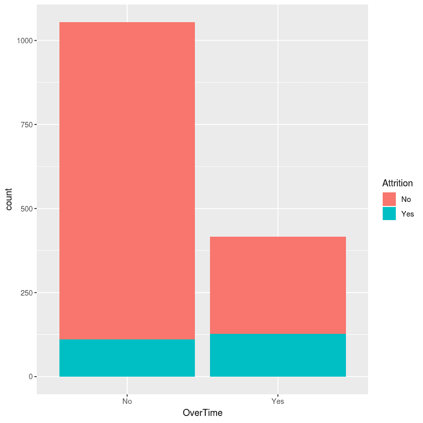
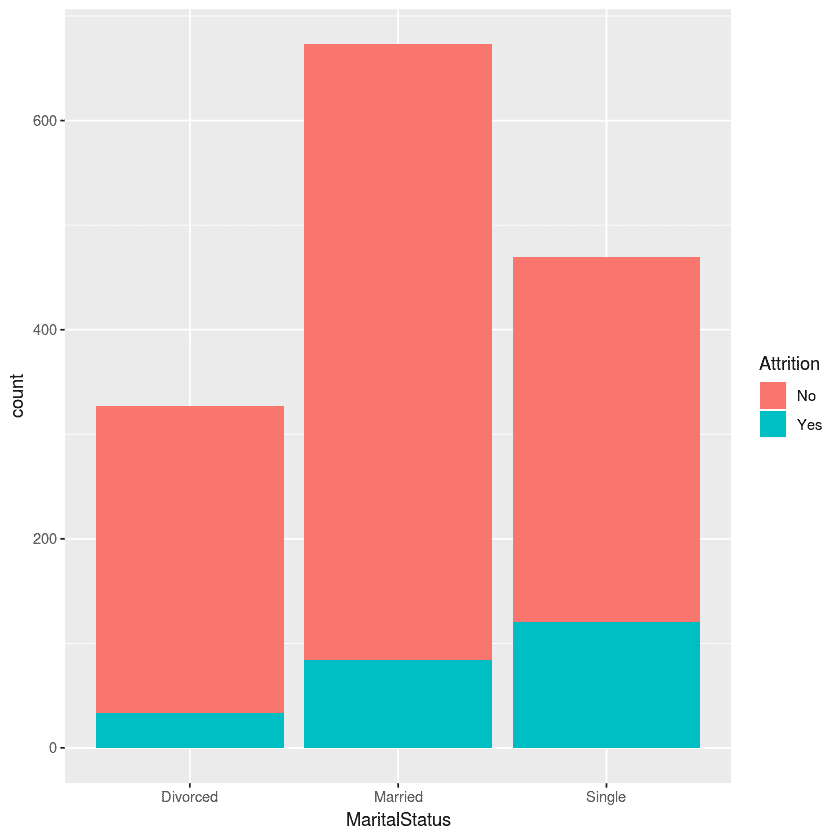
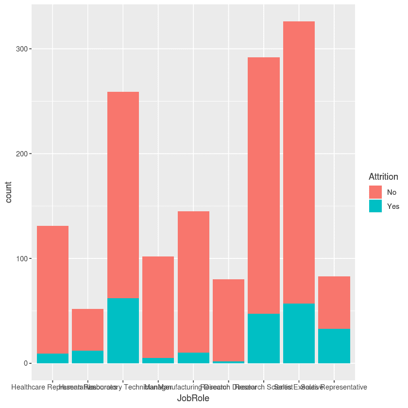
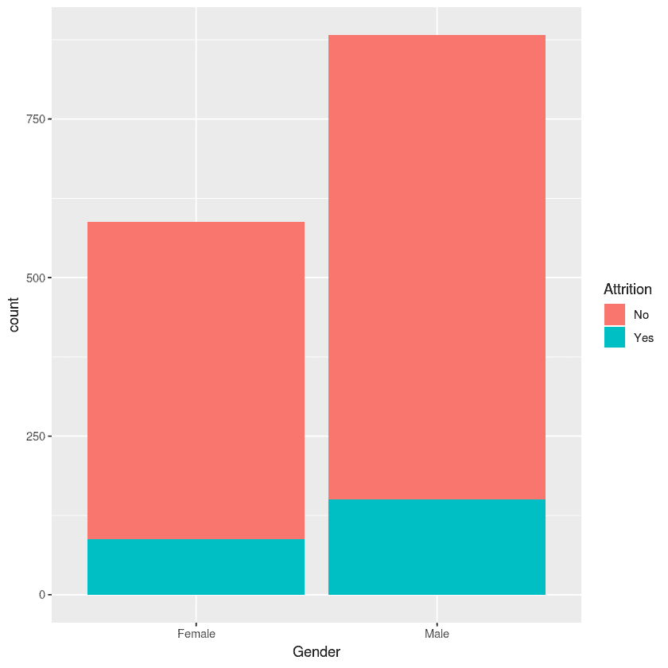
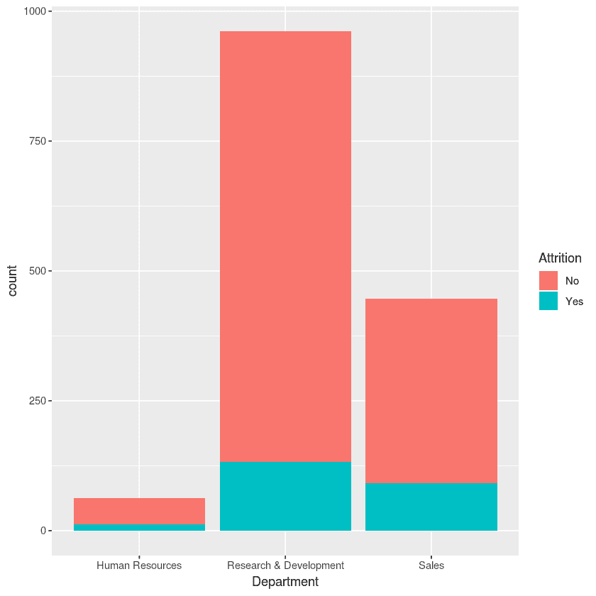
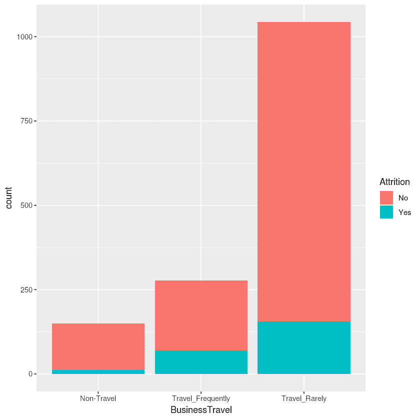
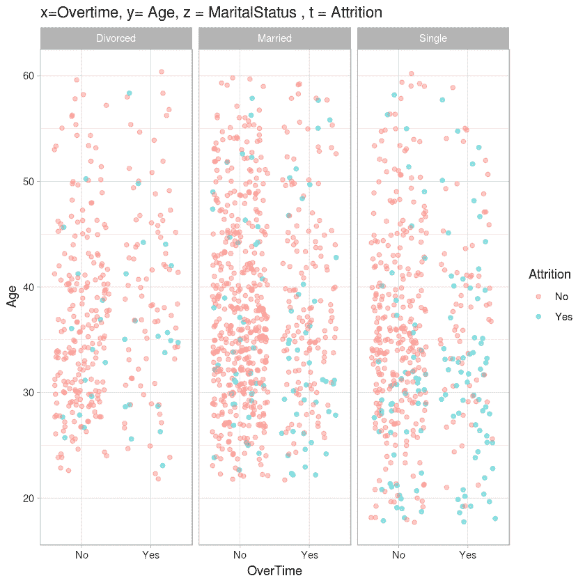
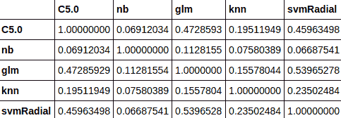

# 二、使用集成模型预测员工流失

如果你回顾了最近的机器学习竞赛，我相信你会做出的一个关键观察是，大多数竞赛中所有三个获奖作品的配方都包括非常好的特征工程，以及调整良好的集成模型。我从这一观察中得出的一个结论是，为了提供成功的机器学习解决方案，良好的特征工程和构建性能良好的模型是应该给予同等重视的两个领域。

虽然功能工程在大多数情况下依赖于构建模型的人的创造力和领域专业知识，但构建一个性能良好的模型是可以通过一种叫做**集成**的哲学来实现的。机器学习实践者经常使用集成技术来击败即使是性能最好的单个 ML 算法所产生的性能基准。在本章中，我们将了解 ML 这一激动人心的领域的以下主题:

*   组装背后的哲学
*   了解损耗问题和数据集
*   性能基准测试的 k 近邻模型
*   制袋材料
*   随机森林随机化
*   助推
*   堆垛


# 组装背后的哲学

在 ML 从业者中非常有名的集成，可以通过一个简单的真实世界的非 ML 例子很好地理解。

假设你申请了一个非常有名的公司的工作，你被通知去面试。仅仅根据面试官的一次面试，你是不可能被选中的。在大多数情况下，你会和几个面试官或者一个面试小组进行多轮面试。公司的期望是每个面试官都是某个领域的专家，并且面试官已经根据你在面试官专业领域的经验评估了你是否适合这份工作。当然，你对这份工作的选择取决于所有与你交谈过的面试官的综合反馈。该组织认为你会在工作中更成功，因为你的选择是基于多个专家做出的综合决定，而不是基于一个专家的决定，这可能会有一定的偏见。

现在，当我们谈到整合所有面试官的反馈时，可以通过几种方法进行整合:

*   **平均分**:假设你的候选资格是基于你在面试中获得一个截止分数。假设你遇到了 10 个面试官，每个人都给你打了 10 分的最高分，这代表了面试官在他的专业领域对你的看法。现在，你的综合分数是由所有面试官给你的所有分数的简单平均值得出的。

*   **多数投票**:在这种情况下，没有每个面试官提供的实际分数(满分为 10 分)。然而，10 位面试官中，有 8 位确认你非常适合这个职位。两位面试官对你的候选资格说不。大多数面试官对你的面试表现都很满意，所以你被选中了。
*   **加权平均**:让我们假设四位面试官都是一些小技能方面的专家，这些技能对你申请的工作来说是很有用的。这些并不是该职位必须具备的技能。你接受了所有 10 位面试官的面试，他们每个人都给了你满分。与平均法类似，在加权平均法中，你的面试最终分数是由所有面试官给出的分数的平均值得到的。

但是，在计算最终分数时，并不是所有的分数都一视同仁。每个面试分数乘以一个权重，得到一个产品。将由此获得的所有乘积相加以获得最终得分。每次面试的权重是它测试的候选人技能的重要性和该技能对工作的重要性的函数。很明显，与必须拥有技能的*相比，拥有*技能的*在工作中的权重较低。现在，最终分数本质上代表了候选人拥有的必备技能的比例，这将对您的选择产生更大的影响。*

类似于面试类比，ML 中的集成也产生基于整合学习的模型。术语**整合学习**本质上表示通过应用若干 ML 算法获得的学习，或者是从作为大型数据集一部分的若干数据子集获得的学习。类似于访谈，通过应用集成技术学习多种模型。然而，通过将平均、多数投票或加权平均技术中的一种应用于由每个单独模型做出的单独预测，实现了关于预测的最终合并。应用集成技术和预测整合技术创建的模型通常被称为**集成**。

每个最大似然算法都是特殊的，并且有一种独特的方式来对基础训练数据进行建模。例如，k-最近邻算法通过计算数据集中元素之间的距离来学习；朴素贝叶斯通过计算属于特定类的数据中每个属性的概率来学习。可以使用不同的 ML 算法创建多个模型，并且可以通过组合几个 ML 算法的预测来进行预测。类似地，当数据集被分区以创建子集时，并且如果使用算法训练多个模型，每个模型专注于一个数据集，则每个模型非常专注，并且它专门学习它被训练的数据子集的特征。在这两种情况下，对于基于多种算法和多个数据子集的模型，当我们通过合并来组合多个模型的预测时，我们可以获得更好的预测，因为我们利用了集成中每个模型所具有的多种优势。否则，当使用单一模型进行预测时，这是无法实现的。

集成的关键是，当我们组合多个模型的预测时，会比只依赖一个模型进行预测获得更好的预测。这与我们一起做得更好的管理哲学没有什么不同，也就是所谓的**协同**！

既然我们理解了集成背后的核心理念，我们现在就准备探索不同类型的集成技术。然而，我们将通过在一个项目中实现它们来学习集成技术，以预测员工的流失。正如我们已经知道的，在构建任何 ML 项目之前，对问题和数据有一个深刻的理解是非常重要的。因此，在下一节中，我们首先重点了解手头的流失问题，然后研究与该问题相关的数据集，最后通过探索性数据分析(EDA)了解数据集的属性。我们在这一节中获得的关键见解来自一次性练习，并将适用于我们将在后面几节中应用的所有集成技术。


# 入门指南

要开始本节，您必须从 GitHub 链接下载本章代码的`WA_Fn-UseC_-HR-Employee-Attrition.csv`数据集。


# 了解损耗问题和数据集

人力资源分析有助于解释组织数据。它找出数据中与人相关的趋势，并帮助人力资源部门采取适当的措施，以保持组织平稳运行和盈利。公司中的人员流失是人事经理和人力资源人员必须应对的复杂挑战之一。有趣的是，可以部署机器学习模型来预测潜在的流失情况，从而帮助适当的人力资源人员或人事经理采取必要的措施来留住员工。

在这一章中，我们将构建预测这种潜在损耗情况的 ML 集成。该项目使用的工作流失数据集是由 IBM 的数据科学家创建的虚拟数据集。`rsample`库包含了这个数据集，我们可以直接从库中使用这个数据集。

这是一个小型数据集，包含 31 个属性的 1，470 条记录。数据集的描述可通过以下代码获得:

```r
setwd("~/Desktop/chapter 2") 
library(rsample) 
data(attrition) 
str(attrition) 
mydata<-attrition 
```

这将导致以下输出:

```r
'data.frame':1470 obs. of  31 variables: 
 $ Age                     : int  41 49 37 33 27 32 59 30 38 36 ... 
 $ Attrition               : Factor w/ 2 levels "No","Yes": 2 1 2 1 1 1 1 1 1 1 .... 
 $ BusinessTravel          : Factor w/ 3 levels "Non-Travel","Travel_Frequently",..: 3 2 3 2 3 2 3 3 2 3 ... 
 $ DailyRate               : int  1102 279 1373 1392 591 1005 1324 1358 216 1299 ... 
 $ Department              : Factor w/ 3 levels "Human_Resources",..: 3 2 2 2 2 2 2 2 2 2 ... 
 $ DistanceFromHome        : int  1 8 2 3 2 2 3 24 23 27 ... 
 $ Education               : Ord.factor w/ 5 levels "Below_College"<..: 2 1 2 4 1 2 3 1 3 3 ... 
 $ EducationField          : Factor w/ 6 levels "Human_Resources",..: 2 2 5 2 4 2 4 2 2 4 ... 
 $ EnvironmentSatisfaction : Ord.factor w/ 4 levels "Low"<"Medium"<..: 2 3 4 4 1 4 3 4 4 3 ... 
 $ Gender                  : Factor w/ 2 levels "Female","Male": 1 2 2 1 2 2 1 2 2 2 ... 
 $ HourlyRate              : int  94 61 92 56 40 79 81 67 44 94 ... 
 $ JobInvolvement          : Ord.factor w/ 4 levels "Low"<"Medium"<..: 3 2 2 3 3 3 4 3 2 3 ... 
 $ JobLevel                : int  2 2 1 1 1 1 1 1 3 2 ... 
 $ JobRole                 : Factor w/ 9 levels "Healthcare_Representative",..: 8 7 3 7 3 3 3 3 5 1 ... 
 $ JobSatisfaction         : Ord.factor w/ 4 levels "Low"<"Medium"<..: 4 2 3 3 2 4 1 3 3 3 ... 
 $ MaritalStatus           : Factor w/ 3 levels "Divorced","Married",..: 3 2 3 2 2 3 2 1 3 2 ... 
 $ MonthlyIncome           : int  5993 5130 2090 2909 3468 3068 2670 2693 9526 5237 ... 
 $ MonthlyRate             : int  19479 24907 2396 23159 16632 11864 9964 13335 8787 16577 ... 
 $ NumCompaniesWorked      : int  8 1 6 1 9 0 4 1 0 6 ... 
 $ OverTime                : Factor w/ 2 levels "No","Yes": 2 1 2 2 1 1 2 1 1 1 ... 
 $ PercentSalaryHike       : int  11 23 15 11 12 13 20 22 21 13 ... 
 $ PerformanceRating       : Ord.factor w/ 4 levels "Low"<"Good"<"Excellent"<..: 3 4 3 3 3 3 4 4 4 3 ... 
 $ RelationshipSatisfaction: Ord.factor w/ 4 levels "Low"<"Medium"<..: 1 4 2 3 4 3 1 2 2 2 ... 
 $ StockOptionLevel        : int  0 1 0 0 1 0 3 1 0 2 ... 
 $ TotalWorkingYears       : int  8 10 7 8 6 8 12 1 10 17 ... 
 $ TrainingTimesLastYear   : int  0 3 3 3 3 2 3 2 2 3 ... 
 $ WorkLifeBalance         : Ord.factor w/ 4 levels "Bad"<"Good"<"Better"<..: 1 3 3 3 3 2 2 3 3 2 ... 
 $ YearsAtCompany          : int  6 10 0 8 2 7 1 1 9 7 ... 
 $ YearsInCurrentRole      : int  4 7 0 7 2 7 0 0 7 7 ... 
 $ YearsSinceLastPromotion : int  0 1 0 3 2 3 0 0 1 7 ... 
 $ YearsWithCurrManager    : int  5 7 0 0 2 6 0 0 8 7 ... 
```

要查看数据集中的`Attrition`目标变量，请运行以下代码:

```r
table(mydata$Attrition) 
```

这将导致以下输出:

```r
 No   Yes  
1233  237  
```

在数据集中的 1，470 个观察值中，我们有 1，233 个样本(83.87%)是非损耗情况和 237 个损耗情况(16.12%)。显然，我们正在处理一个*类不平衡*数据集。

我们现在将使用下面的代码通过`corrplot`库可视化数据中高度相关的变量:

```r
# considering only the numeric variables in the dataset 
numeric_mydata <- mydata[,c(1,4,6,7,10,11,13,14,15,17,19,20,21,24,25,26,28:35)] 
# converting the target variable "yes" or "no" values into numeric 
# it defaults to 1 and 2 however converting it into 0 and 1 to be consistent 
numeric_Attrition = as.numeric(mydata$Attrition)- 1 
# create a new data frame with numeric columns and numeric target  
numeric_mydata = cbind(numeric_mydata, numeric_Attrition) 
# loading the required library 
library(corrplot) 
# creating correlation plot 
M <- cor(numeric_mydata) 
corrplot(M, method="circle") 
```

这将导致以下输出:


在前面的屏幕截图中，可以观察到单元格中较暗和较大的蓝色圆点表示构成单元格的相应行和列中的变量之间存在强相关性。独立变量之间的高度相关性表明数据中存在冗余特征。数据中存在高度相关特征的问题被称为**多重共线性**。如果我们要拟合一个回归模型，那么我们需要通过一些技术来处理数据中高度相关的变量，例如删除冗余特征，或者应用主成分分析或偏最小二乘回归，这可以直观地减少冗余特征。

我们从输出中推断出以下变量高度相关，如果我们要构建基于回归的模型，构建模型的人员需要考虑这些变量:

`JobLevel`-`MonthlyIncome`；`JobLevel`-`TotalWorkingYears`；`MonthlyIncome`-`TotalWorkingYears`；`PercentSalaryHike`-`PerformanceRating`；`YearsAtCompany`-`YearsInCurrentRole`；`YearsAtCompany`-`YearsWithCurrManager`；`YearsWithCurrManager` - `YearsInCurrentRole`

现在，用因变量`Attrition`绘制各种自变量，以了解自变量对目标的影响:

```r
### Overtime vs Attiriton 
l <- ggplot(mydata, aes(OverTime,fill = Attrition)) 
l <- l + geom_histogram(stat="count") 

tapply(as.numeric(mydata$Attrition) - 1 ,mydata$OverTime,mean) 

No Yes
0.104364326375712 0.305288461538462
```

让我们运行以下命令来获得图形视图:

```r
print(l) 
```

上述命令会生成以下输出:



在前面的输出中，可以观察到加班的员工比不加班的员工更容易流失:

让我们通过执行以下命令来计算员工的流失:

```r
### MaritalStatus vs Attiriton 
l <- ggplot(mydata, aes(MaritalStatus,fill = Attrition)) 
l <- l + geom_histogram(stat="count") 

tapply(as.numeric(mydata$Attrition) - 1 ,mydata$MaritalStatus,mean) 
Divorced 0.100917431192661 
Married 0.12481426448737 
Single 0.25531914893617 
```

让我们运行以下命令来获得图形视图:

```r
print(l) 
```

上述命令会生成以下输出:



在前面的输出中，可以观察到单身员工的流失率更高:

```r
###JobRole vs Attrition 
l <- ggplot(mydata, aes(JobRole,fill = Attrition)) 
l <- l + geom_histogram(stat="count") 

tapply(as.numeric(mydata$Attrition) - 1 ,mydata$JobRole,mean) 

Healthcare Representative    Human Resources 
               0.06870229    0.23076923 
    Laboratory Technician    Manager 
               0.23938224    0.04901961 
   Manufacturing Director    Research Director 
               0.06896552    0.02500000 
       Research Scientist    Sales Executive 
               0.16095890    0.17484663 
     Sales Representative 
               0.39759036 
mean(as.numeric(mydata$Attrition) - 1) 
[1] 0.161224489795918 
```

执行以下命令以获得相同的图形表示:

```r
print(l)
```

看看运行前面的命令生成的以下输出:



在前面的输出中，可以观察到从事人力资源工作角色的实验室技术人员、销售代表和员工比其他组织角色有更多的流失。

让我们执行以下命令来检查员工的性别对归因的影响:

```r
###Gender vs Attrition 
l <- ggplot(mydata, aes(Gender,fill = Attrition)) 
l <- l + geom_histogram(stat="count") 

tapply(as.numeric(mydata$Attrition) - 1 ,mydata$Gender,mean) 

Female 0.147959183673469 
Male 0.170068027210884 
```

运行以下命令以获取相同的图形表示:

```r
print(l)
```

这将导致以下输出:



在前面的输出中，您可以看到员工的性别对自然减员没有任何影响，换句话说，所有性别的自然减员都是一样的。

让我们通过执行以下命令来计算各个字段中雇员的属性:

```r
###EducationField vs Attrition el <- ggplot(mydata, aes(EducationField,fill = Attrition)) 
l <- l + geom_histogram(stat="count") 

tapply(as.numeric(mydata$Attrition) - 1 ,mydata$EducationField,mean) 

Human Resources    Life Sciences    Marketing 
       0.2592593    0.1468647        0.2201258 
         Medical   Other Technical  Degree 
       0.1357759    0.1341463        0.2424242
```

让我们执行以下命令来获得图形表示:

```r
print(l)
```

这将导致以下输出:


看一下上图，我们可以得出结论，拥有技术学位或人力资源学位的员工流失更多。看一下下面的代码:

```r
###Department vs Attrition 
l <- ggplot(mydata, aes(Department,fill = Attrition)) 
l <- l + geom_histogram(stat="count") 

tapply(as.numeric(mydata$Attrition) - 1 ,mydata$Department,mean) 
Human Resources  Research & Development  Sales 
   0.1904762       0.1383975              0.2062780 
```

让我们执行下面的命令来检查各个部门的归属:

```r
print(l) 
```

这将导致以下输出:



看前面的图表，我们可以得出结论，与销售和人力资源部门相比，研发部门的人员流失较少。看一下下面的代码:

```r
###BusinessTravel vs Attrition 
l <- ggplot(mydata, aes(BusinessTravel,fill = Attrition)) 
l <- l + geom_histogram(stat="count") 

tapply(as.numeric(mydata$Attrition) - 1 ,mydata$BusinessTravel,mean) 
 Non-Travel   Travel_Frequently   Travel_Rarely 
  0.0800000    0.2490975           0.1495686
```

执行以下命令以获得相同的图形表示:

```r
print(l) 
```

这将导致以下输出:



看一下上图，我们可以得出这样的结论:与不出差或很少出差的员工相比，经常出差的员工更容易流失。

让我们通过执行以下命令来计算员工的加班时间:

```r
### x=Overtime, y= Age, z = MaritalStatus , t = Attrition 
ggplot(mydata, aes(OverTime, Age)) +   
  facet_grid(.~MaritalStatus) + 
  geom_jitter(aes(color = Attrition),alpha = 0.4) +   
  ggtitle("x=Overtime, y= Age, z = MaritalStatus , t = Attrition") +   
  theme_light() 
```

这将导致以下输出:



查看上图，我们可以得出结论，年轻的员工(年龄< 35 ) and are single, but work overtime, are more prone to attrition: 

```r
### MonthlyIncome vs. Age, by  color = Attrition 
ggplot(mydata, aes(MonthlyIncome, Age, color = Attrition)) +  
  geom_jitter() + 
  ggtitle("MonthlyIncome vs. Age, by  color = Attrition ") + 
  theme_light() 
```

This will result in the following output:


查看上图，我们可以得出结论，年轻员工(年龄< 30 岁)的流失率更高，大多数流失率出现在收入低于 7，500 美元的员工中。

尽管我们已经了解了手头数据的许多重要细节，但实际上还有更多需要探索和学习。然而，为了进入下一步，我们在这个 EDA 步骤停止。应该注意的是，在现实世界中，数据不会像我们在这个损耗数据集中看到的那样非常干净。例如，数据中可能会有缺失值；在这种情况下，我们将进行缺失值插补。幸运的是，我们有一个无可挑剔的数据集，为我们创建模型做好了准备，无需进行任何数据清理或额外的预处理。


# 性能基准测试的 k 近邻模型

在这一节中，我们将实现**k-nearest neighbors**(**KNN**)算法，在我们的 IBM 流失数据集上构建一个模型。当然，我们已经从 EDA 中意识到，我们手头的数据集中存在类不平衡问题。然而，我们现在不会针对类不平衡来处理数据集，因为这本身就是一个完整的领域，并且在该领域中有几种技术可用，因此不在本章所讨论的 ML 集成主题的范围之内。现在，我们将按原样考虑数据集并构建 ML 模型。此外，对于类别不平衡数据集，Kappa 或精度和召回或接收器工作特性曲线下的面积(AUROC)是可以使用的适当指标。然而，为了简单起见，我们将使用*精确度*作为性能指标。我们将采用重复 10 次的 10 重交叉验证，以有助于模型性能测量。现在，让我们使用 KNN 算法构建我们的流失预测模型，如下所示:

```r
# Load the necessary libraries 
# doMC is a library that enables R to use multiple cores available on the sysem thereby supporting multiprocessing.  
library(doMC) 
# registerDoMC command instructs R to use the specified number of cores to execute the code. In this case, we ask R to use 4 cores available on the system 
registerDoMC(cores=4) 
# caret library has the ml algorithms and other routines such as cross validation etc.  
library(caret) 
# Setting the working directory where the dataset is located 
setwd("~/Desktop/chapter 2") 
# Reading the csv file into R variable called mydata 
mydata <- read.csv("WA_Fn-UseC_-HR-Employee-Attrition.csv") 
#Removing the non-discriminatory features (as identified during EDA) from the dataset  
mydata$EmployeeNumber=mydata$Over18=mydata$EmployeeCount=mydata$StandardHours = NULL 
# setting the seed prior to model building ensures reproducibility of the results obtained 
set.seed(10000) 
# setting the train control parameters specifying gold standard 10 fold cross validation  repeated 10 times 
fitControl = trainControl(method="repeatedcv", number=10,repeats=10) 
###creating a model on the data. Observe that we specified Attrition as the target and that model should learn from rest of the variables. We specified mydata as the dataset to learn. We pass the train control parameters and specify that knn algorithm need to be used to build the model. K can be of any length - we specified 20 as parameter which means the train command will search through 20 different random k values and finally retains the model that produces the best performance measurements. The final model is stored as caretmodel 
caretmodel = train(Attrition~., data=mydata, trControl=fitControl, method = "knn", tuneLength = 20) 
# We output the model object to the console  
caretmodel 
```

这将导致以下输出:

```r
k-Nearest Neighbors  
1470 samples 
  30 predictors 
   2 classes: 'No', 'Yes'  
No pre-processing 
Resampling: Cross-Validated (10 fold, repeated 10 times)  
Summary of sample sizes: 1323, 1323, 1324, 1323, 1324, 1322, ...  
Resampling results across tuning parameters: 
  k   Accuracy   Kappa        
   5  0.8216447  0.0902934591 
   7  0.8349033  0.0929511324 
   9  0.8374198  0.0752842114 
  11  0.8410920  0.0687849122 
  13  0.8406861  0.0459679081 
  15  0.8406875  0.0337742424 
  17  0.8400748  0.0315670261 
  19  0.8402770  0.0245499585 
  21  0.8398721  0.0143638854 
  23  0.8393945  0.0084393721 
  25  0.8391891  0.0063246624 
  27  0.8389174  0.0013913143 
  29  0.8388503  0.0007113939 
  31  0.8387818  0.0000000000 
  33  0.8387818  0.0000000000 
  35  0.8387818  0.0000000000 
  37  0.8387818  0.0000000000 
  39  0.8387818  0.0000000000 
  41  0.8387818  0.0000000000 
  43  0.8387818  0.0000000000 
Accuracy was used to select the optimal model using the largest value. 
The final value used for the model was k = 11\. 
```

我们可以从模型输出中看到，最佳执行模型是在`k` `= 11`时，并且我们使用这个`k`值获得了 84%的准确度。在这一章的其余部分，当用几种组合技术进行实验时，我们将检验从 KNN 获得的 84%的准确率是否会被打破。

在现实的项目构建情况下，仅仅识别最佳超参数是不够的。需要在具有最佳超参数的完整数据集上训练模型，并且需要保存该模型以供将来使用。我们将在本节的剩余部分回顾这些步骤。

在这种情况下，`caretmodel`对象已经有了用`k = 11`训练的模型，因此我们不试图用最佳超参数重新训练模型。要检查最终模型，您可以使用代码查询模型对象:

```r
caretmodel$finalModel 
```

这将导致以下输出:

```r
11-nearest neighbor model 
Training set outcome distribution: 
  No  Yes  
1233  237  
```

下一步是将您的最佳模型保存到一个文件中，以便我们可以在以后加载它们，并根据看不见的数据进行预测。可以使用`saveRDS` R 命令将模型保存到本地目录:

```r
 # save the model to disk 
saveRDS(caretmodel, "production_model.rds") 
```

在这种情况下，`caretmodel`被保存为工作目录中的`production_model.rds`。该模型现在被序列化为一个文件，可以随时加载，并可用于对看不见的数据进行评分。加载和评分可以通过下面的 R 代码实现:

```r
# Set the working directory to the directory where the saved .rds file is located  
setwd("~/Desktop/chapter 2") 
#Load the model  
loaded_model <- readRDS("production_model.rds") 
```

```r
#Using the loaded model to make predictions on unseen data 
final_predictions <- predict(loaded_model, unseen_data) 
```

请注意，在通过`predict`命令划线之前，需要读取`unseen_data`。

在整个数据集上训练最终模型的代码部分，保存模型，在需要时从文件中重新加载它，并对看不见的数据进行集体评分，这被称为构建 ML 生产化管道。这个流水线对于所有的 ML 模型保持相同，而不管模型是使用单一算法还是使用集成技术来构建的。因此，在后面的部分中，当我们实现各种集成技术时，我们将不会涉及生产化管道，而只是停留在通过重复 10 次的 10 重交叉验证来获得性能度量。


# 制袋材料

Bootstrap aggregation 或 **bagging** 是最早被 ML 实践社区广泛采用的集成技术。打包涉及从单个数据集创建多个不同的模型。为了理解 bagging，理解称为 bootstrapping 的重要统计技术是很重要的。

引导包括创建数据集的多个随机子集。有可能在多个子集中获得相同的数据样本，这被称为**替换引导**。这种方法的优点是，由于使用整个数据集，在估计数量时会出现标准误差。这个技巧可以用一个例子来更好地解释。

假设您有一个 1000 个样本的小数据集。根据样本，要求您计算样本所代表的总体的平均值。现在，一种直接的方法是通过下面的公式:


由于这是一个小样本，我们在估计总体平均值时可能会有误差。这种误差可以通过采用带替换的自举采样来减小。在该技术中，我们创建了数据集的 10 个子集，其中每个数据集包含 100 个项目。一个数据项可以在一个子集中被随机表示多次，并且一个数据项在一个数据子集内以及跨子集被表示的次数没有限制。现在，我们取每个数据子集中样本的平均值，因此，我们得到 10 个不同的平均值。使用所有这些收集的平均值，我们用以下公式估计总体的平均值:


现在，我们对平均值有了更好的估计，因为我们已经外推了小样本，以随机生成代表原始总体的多个样本。

在装袋中，实际的训练数据集通过具有替换的自举采样被分成多个袋。假设我们最终得到了 *n* 个袋子，当对这些袋子中的每一个应用 ML 算法时，我们得到了 *n* 个不同的模型。每个型号都专注于一款包袋。当谈到对新的看不见的数据进行预测时，这些 *n* 模型中的每一个都对数据进行独立的预测。通过组合所有 *n* 个模型的观察预测，得到观察的最终预测。在分类的情况下，采用投票方式，以多数为最终预测。对于回归，所有模型预测的平均值被视为最终预测。

基于决策树的算法，比如**分类和回归树** ( **CART** )，都是不稳定的学习器。原因是训练数据集中的微小变化会严重影响所创建的模型。模型的改变实质上意味着预测也会改变。打包是一种非常有效的技术，可以处理对数据变化的高度敏感性。由于我们可以在数据集的子集上构建多个决策树模型，然后根据每个模型的预测得出最终预测，因此数据变化的影响会被抵消，或者不会被显著感受到。

在数据子集上建立多个模型的一个直观问题是**过度拟合**。然而，这可以通过在不对节点进行任何修剪的情况下生长深树来克服。

bagging 的缺点是，与使用独立的 ML 算法构建模型相比，它需要更长的时间来构建模型。这是显而易见的，因为多个模型是在 bagging 中构建的，而不是一个单一的模型，并且构建这些多个模型需要时间。

现在，让我们实现 R 代码以实现 bagging 系综，并将获得的性能与从 KNN 获得的性能进行比较。然后，我们将探索装袋方法的工作机制。

`caret`库提供了用任何独立的 ML 算法实现 bagging 的框架。`ldaBag`、`plsBag`、`nbBag`、`treeBag`、`ctreeBag`、`svmBag`和`nnetBag`是 caret 中提供的一些示例方法。在本节中，我们将使用三种不同的`caret`方法进行装袋，如`treebag`、`svmbag`和`nbbag`。


# 袋装分类和回归树(treeBag)实现

首先，加载基本库并注册并行处理的内核数量:

```r
library(doMC) 
registerDoMC(cores = 4)  
library(caret) 
#setting the random seed for replication 
set.seed(1234) 
# setting the working directory where the data is located 
setwd("~/Desktop/chapter 2") 
# reading the data 
mydata <- read.csv("WA_Fn-UseC_-HR-Employee-Attrition.csv") 
#removing the non-discriminatory features identified during EDA 
mydata$EmployeeNumber=mydata$Over18=mydata$EmployeeCount=mydata$StandardHours = NULL 
#setting up cross-validation 
cvcontrol <- trainControl(method="repeatedcv", repeats=10, number = 10, allowParallel=TRUE) 
# model creation with treebag , observe that the number of bags is set as 10 
train.bagg <- train(Attrition ~ ., data=mydata, method="treebag",B=10, trControl=cvcontrol, importance=TRUE) 
train.bagg 
```

这将导致以下输出:

```r
Bagged CART  
1470 samples 
  30 predictors 
   2 classes: 'No', 'Yes'  
No pre-processing 
Resampling: Cross-Validated (10 fold, repeated 10 times)  
Summary of sample sizes: 1324, 1323, 1323, 1322, 1323, 1322, ...  
Resampling results: 
  Accuracy  Kappa     
  0.854478  0.2971994 
```

我们可以看到，与使用 KNN 算法获得的 84%的准确度相比，我们获得了更好的 85.4%的准确度。


# 支持向量机装袋(SVMBag)实现

在 SVMBag 和 NBBag 实现中，加载库、注册多处理、设置工作目录、从工作目录中读取数据、从数据中删除非歧视性特征以及设置交叉验证参数的步骤也是相同的。因此，我们不会在 SVMBag 或 NBBag 代码中重复这些步骤。相反，我们将重点讨论特定于 SVMBag 或 NBBag 的代码:

```r
# Setting up SVM predict function as the default svmBag$pred function has some code issue 
svm.predict <- function (object, x) 
{ 
 if (is.character(lev(object))) { 
    out <- predict(object, as.matrix(x), type = "probabilities") 
    colnames(out) <- lev(object) 
    rownames(out) <- NULL 
  } 
  else out <- predict(object, as.matrix(x))[, 1] 
  out 
} 
# setting up parameters to build svm bagging model 
bagctrl <- bagControl(fit = svmBag$fit, 
                      predict = svm.predict , 
                      aggregate = svmBag$aggregate) 
# fit the bagged svm model 
set.seed(300) 
svmbag <- train(Attrition ~ ., data = mydata, method="bag",trControl = cvcontrol, bagControl = bagctrl,allowParallel = TRUE) 
# printing the model results 
svmbag 
```

这将导致以下输出:

```r
Bagged Model  

1470 samples 
  30 predictors 
   2 classes: 'No', 'Yes'  

No pre-processing 
Resampling: Cross-Validated (10 fold, repeated 10 times)  
Summary of sample sizes: 1324, 1324, 1323, 1323, 1323, 1323, ...  
Resampling results: 
  Accuracy   Kappa     
  0.8777721  0.4749657 

Tuning parameter 'vars' was held constant at a value of 44 
```

您将会看到，我们达到了 87.7%的准确率，远远高于 KNN 模型 84%的准确率。


# 朴素贝叶斯装袋实现

我们现在将通过执行以下代码来实现`nbBag`:

```r
# setting up parameters to build svm bagging model 
bagctrl <- bagControl(fit = nbBag$fit, 
                      predict = nbBag$pred , 
                      aggregate = nbBag$aggregate) 
# fit the bagged nb model 
set.seed(300) 
nbbag <- train(Attrition ~ ., data = mydata, method="bag", trControl = cvcontrol, bagControl = bagctrl) 
# printing the model results 
nbbag 
```

这将导致以下输出:

```r
Bagged Model  

1470 samples 
  30 predictors 
   2 classes: 'No', 'Yes'  

No pre-processing 
Resampling: Cross-Validated (10 fold, repeated 10 times)  
Summary of sample sizes: 1324, 1324, 1323, 1323, 1323, 1323, ...  
Resampling results: 

  Accuracy   Kappa      
  0.8389878  0.00206872 

Tuning parameter 'vars' was held constant at a value of 44 
```

我们看到，在这种情况下，我们只实现了 83.89%的准确性，这比 KNN 模型的 84%的性能稍差。

虽然我们只展示了三个用于装袋的`caret`方法的例子，但是实现其他方法的代码是一样的。代码中唯一需要的改变是替换`bagControl`中的`fit`、`predict`和`aggregate`参数。例如，为了用神经网络算法实现 bagging，我们需要如下定义`bagControl`:

```r
bagControl(fit = nnetBag$fit, predict = nnetBag$pred , aggregate = nnetBag$aggregate) 
```

需要注意的是，在 R 中需要有一个合适的库来让`caret`运行这些方法，否则会导致错误。例如，`nbBag`要求在执行代码之前在系统上安装`klaR`库。同样，`ctreebag`函数需要安装`party`包。用户需要先检查系统上适当库的可用性，然后再将其用于`caret`装袋。

我们现在对通过装袋技术实现项目有了一个了解。下一小节介绍装袋的基本工作机制。这将有助于明确 bagging 在内部对我们的数据集做了什么，从而产生比独立模型性能更好的性能测量。


# 随机森林随机化

正如我们在装袋中看到的，我们制作了许多袋子，每个模型都在这些袋子上进行训练。每个包都由实际数据集的子集组成，但是每个包中的特征或变量的数量保持不变。换句话说，我们在 bagging 中执行的是数据集行的子集化。

在随机森林中，当我们通过对行进行子集化来从数据集创建包时，我们还对需要包含在每个包中的要素(列)进行子集化。

假设您的数据集中有 1000 个包含 20 个要素的观测值。我们可以创建 20 个包，其中每个包有 100 个观察值(这是可能的，因为有替换的引导)和五个特征。现在有 20 个模特接受训练，每个模特只能看到分配给她的包。基于问题是回归问题还是分类问题的事实，通过投票或平均得到最终预测。

bagging 和 random forests 之间的另一个关键区别是用于构建模型的 ML 算法。在 bagging 中，可以使用任何 ML 算法来创建模型，但是随机森林模型是专门使用 CART 构建的。

随机森林建模是另一种非常流行的机器学习算法。这是一种已经多次证明自己是性能最好的算法之一，尽管它应用于噪声数据集。对于一个了解引导的人来说，理解随机森林是一件轻而易举的事情。


# 使用随机森林实现损耗预测模型

让我们通过执行以下代码，通过随机森林建模获得我们的损耗模型:

```r
# loading required libraries and registering multiple cores to enable parallel processing 
library(doMC) 
library(caret) 
registerDoMC(cores=4) 
# setting the working directory and reading the dataset 
setwd("~/Desktop/chapter 2") 
mydata <- read.csv("WA_Fn-UseC_-HR-Employee-Attrition.csv") 
# removing the non-discriminatory features from the dataset as identified during EDA step 
mydata$EmployeeNumber=mydata$Over18=mydata$EmployeeCount=mydata$StandardHours = NULL 
# setting the seed for reproducibility 
set.seed(10000) 
# setting the cross validation parameters 
fitControl = trainControl(method="repeatedcv", number=10,repeats=10) 
# creating the caret model with random forest algorithm 
caretmodel = train(Attrition~., data=mydata, method="rf", trControl=fitControl, verbose=F) 
# printing the model summary 
caretmodel 
```

这将导致以下输出:

```r
Random Forest  

1470 samples 
  30 predictors 
   2 classes: 'No', 'Yes'  

No pre-processing 
Resampling: Cross-Validated (10 fold, repeated 10 times)  
Summary of sample sizes: 1323, 1323, 1324, 1323, 1324, 1322, ...  
Resampling results across tuning parameters: 

  mtry  Accuracy   Kappa     
   2    0.8485765  0.1014859 
  23    0.8608271  0.2876406 
  44    0.8572929  0.2923997 

Accuracy was used to select the optimal model using the largest value. 
The final value used for the model was mtry = 23\. 
```

我们看到，与 KNN 的 84%相比，最佳随机森林模型达到了更好的 86%的准确率。


# 助推

弱学习器是一种性能相对较差的算法——通常，弱学习器获得的准确度只是高于概率。人们经常观察到，弱学习者在计算上很简单。决策树桩或 1R 算法是弱学习者的一些例子。强化将弱学习者转化为强学习者。这实质上意味着 boosting 不是一种进行预测的算法，但它与底层的弱 ML 算法一起工作以获得更好的性能。

boosting 模型是在数据子集上学习的一系列模型，类似于 bagging 集成技术。区别在于数据子集的创建。与 bagging 不同，用于模型训练的所有数据子集不是在训练开始之前创建的。相反，boosting 使用 ML 算法构建第一个模型，对整个数据集进行预测。现在，有一些错误分类的实例是第二个模型使用的子集。第二个模型只从第一个模型的输出中筛选出的这个错误分类的数据集学习。

第二个模型的错误分类实例成为第三个模型的输入。重复建立模型的过程，直到满足停止标准。对未知数据集中某个观测值的最终预测是通过对该特定未知观测值的所有模型的预测进行平均或投票得出的。

boosting 算法家族中的各种算法之间存在细微的差异，但是我们不打算详细讨论它们，因为本章的目的是获得对 ML 系综的一般理解，而不是获得对各种 boosting 算法的深入了解。

在获得更好性能的同时，测量是 boosting 集成的最大优势；模型可解释性困难、较高的计算时间和模型过度拟合是 boosting 遇到的一些问题。当然，这些问题可以通过使用专门的技术来解决。

Boosting 算法无疑是超级受欢迎的，据观察，许多 Kaggle 和类似比赛的获胜者都在使用它。有许多可用的增强算法，例如**梯度增强机器** ( **GBMs** )、**自适应增强** ( **AdaBoost** )、梯度树增强、**极端梯度增强** ( **XGBoost** )和**轻度梯度增强机器** ( **LightGBM** )。在本节中，我们将学习两种最流行的 boosting 算法的理论和实现，如 GBMs 和 XGBoost。在学习 boosting 的理论概念及其优缺点之前，让我们首先开始关注如何使用 GBMs 和 XGBoost 实现流失预测模型。


# GBM 实施

让我们用 GBMs 实现流失预测模型:

```r
# loading the essential libraries and registering the cores for multiprocessing 
library(doMC) 
library(mlbench) 
library(gbm) 
library(caret) 
registerDoMC(cores=4) 
# setting the working directory and reading the dataset 
setwd("~/Desktop/chapter 2") 
mydata <- read.csv("WA_Fn-UseC_-HR-Employee-Attrition.csv") 
# removing the non-discriminatory features as identified by EDA step 
mydata$EmployeeNumber=mydata$Over18=mydata$EmployeeCount=mydata$StandardHours = NULL 
# converting the target attrition feild to numeric as gbm model expects all numeric feilds in the dataset 
mydata$Attrition = as.numeric(mydata$Attrition) 
# forcing the attrition column values to be 0 and 1 instead of 1 and 2 
mydata = transform(mydata, Attrition=Attrition-1) 
# running the gbm model with 10 fold cross validation to identify the number of trees to build - hyper parameter tuning 
gbm.model = gbm(Attrition~., data=mydata, shrinkage=0.01, distribution = 'bernoulli', cv.folds=10, n.trees=3000, verbose=F) 
# identifying and printing the value of hyper parameter identified through the tuning above 
best.iter = gbm.perf(gbm.model, method="cv") 
print(best.iter) 
# setting the seed for reproducibility 
set.seed(123) 
# creating a copy of the dataset 
mydata1=mydata 
# converting target to a factor 
mydata1$Attrition=as.factor(mydata1$Attrition) 
# setting up cross validation controls 
fitControl = trainControl(method="repeatedcv", number=10,repeats=10) 
# runing the gbm model in tandem with caret  
caretmodel = train(Attrition~., data=mydata1, method="gbm", distribution="bernoulli",  trControl=fitControl, verbose=F, tuneGrid=data.frame(.n.trees=best.iter, .shrinkage=0.01, .interaction.depth=1, .n.minobsinnode=1)) 
# printing the model summary 
print(caretmodel) 
```

这将导致以下输出:

```r
2623 
Stochastic Gradient Boosting  

1470 samples 
  30 predictors 
   2 classes: '0', '1'  

No pre-processing 
Resampling: Cross-Validated (10 fold, repeated 10 times)  
Summary of sample sizes: 1323, 1323, 1323, 1322, 1323, 1323, ...  
Resampling results: 
  Accuracy   Kappa     
  0.8771472  0.4094991 
Tuning parameter 'n.trees' was held constant at a value of 2623 
Tuning parameter 'shrinkage' was held constant at a value of 0.01 
Tuning parameter 'n.minobsinnode' was held constant at a value of 1 
```

您将会看到，使用 GBM 模型，我们已经实现了 87%以上的准确性，与 KNN 的 84%相比，这是一个更好的准确性。


# 用 XGBoost 构建流失预测模型

现在，让我们用 XGBoost 实现流失预测模型:

```r
# loading the required libraries and registering the cores for multiprocessing 
library(doMC) 
library(xgboost) 
library(caret) 
registerDoMC(cores=4) 
# setting the working directory and loading the dataset 
setwd("~/Desktop/chapter 2") 
mydata <- read.csv("WA_Fn-UseC_-HR-Employee-Attrition.csv") 
# removing the non-discriminatory features from the dataset as identified in EDA step 
mydata$EmployeeNumber=mydata$Over18=mydata$EmployeeCount=mydata$StandardHours = NULL 
# setting up cross validation parameters 
ControlParamteres <- trainControl(method = "repeatedcv",number = 10, repeats=10, savePredictions = TRUE, classProbs = TRUE) 
# setting up hyper parameters grid to tune   
parametersGrid <-  expand.grid(eta = 0.1, colsample_bytree=c(0.5,0.7), max_depth=c(3,6),nrounds=100, gamma=1, min_child_weight=2,subsample=0.5) 
# printing the parameters grid to get an intuition 
print(parametersGrid) 
# xgboost model building 
modelxgboost <- train(Attrition~., data = mydata, method = "xgbTree", trControl = ControlParamteres, tuneGrid=parametersGrid) 
# printing the model summary 
print(modelxgboost) 
```

这将导致以下输出:


```r
eXtreme Gradient Boosting  
1470 samples 
  30 predictors 
   2 classes: 'No', 'Yes'  

No pre-processing 
Resampling: Cross-Validated (10 fold, repeated 10 times)  
Summary of sample sizes: 1323, 1323, 1322, 1323, 1323, 1322, ...  
Resampling results across tuning parameters: 

  max_depth  colsample_bytree  Accuracy   Kappa     
  3          0.5               0.8737458  0.3802840 
  3          0.7               0.8734728  0.3845053 
  6          0.5               0.8730674  0.3840938 
  6          0.7               0.8732589  0.3920721 

Tuning parameter 'nrounds' was held constant at a value of 100 
Tuning parameter 'min_child_weight' was held constant at a value of 2 
Tuning parameter 'subsample' was held constant at a value of 0.5 
Accuracy was used to select the optimal model using the largest value. 
The final values used for the model were nrounds = 100, max_depth = 3, eta = 0.1, gamma = 1, colsample_bytree = 0.5, min_child_weight = 2 and subsample = 0.5\. 
```

同样，我们观察到，使用 XGBoost 模型，我们已经实现了 87%以上的准确性，与使用 KNN 实现的 84%相比，这是一个更好的准确性。


# 堆垛

在迄今为止我们所了解的所有集成中，我们已经以特定的方式操纵了数据集，并公开了用于模型构建的数据子集。然而，在堆叠中，我们不会对数据集做任何事情；相反，我们将应用一种不同的技术，包括使用多种 ML 算法。在堆叠中，我们使用各种 ML 算法构建多个模型。每种算法都拥有一种独特的学习数据特征的方式，最终的堆叠模型间接地结合了所有这些独特的学习方式。正如我们在其他类型的集成中所做的那样，堆叠通过投票或平均的方式获得最终预测，从而获得几个 ML 算法的组合能力。


# 用叠加法建立磨损预测模型

让我们建立一个使用堆叠的流失预测模型:

```r
# loading the required libraries and registering the cpu cores for multiprocessing 
library(doMC) 
library(caret) 
library(caretEnsemble) 
registerDoMC(cores=4) 
# setting the working directory and loading the dataset 
setwd("~/Desktop/chapter 2") 
mydata <- read.csv("WA_Fn-UseC_-HR-Employee-Attrition.csv") 
# removing the non-discriminatory features from the dataset as identified in EDA step 
mydata$EmployeeNumber=mydata$Over18=mydata$EmployeeCount=mydata$StandardHours = NULL 
# setting up control paramaters for cross validation 
control <- trainControl(method="repeatedcv", number=10, repeats=10, savePredictions=TRUE, classProbs=TRUE) 
# declaring the ML algorithms to use in stacking 
algorithmList <- c('C5.0', 'nb', 'glm', 'knn', 'svmRadial') 
# setting the seed to ensure reproducibility of the results 
set.seed(10000) 
# creating the stacking model 
models <- caretList(Attrition~., data=mydata, trControl=control, methodList=algorithmList) 
# obtaining the stacking model results and printing them 
results <- resamples(models) 
summary(results) 
```

这将导致以下输出:

```r
summary.resamples(object = results) 

Models: C5.0, nb, glm, knn, svmRadial  
Number of resamples: 100  

Accuracy  
               Min.   1st Qu.    Median      Mean   3rd Qu.      Max. NA's 
C5.0      0.8082192 0.8493151 0.8639456 0.8625833 0.8775510 0.9054054    0 
nb        0.8367347 0.8367347 0.8378378 0.8387821 0.8424658 0.8435374    0 
glm       0.8299320 0.8639456 0.8775510 0.8790444 0.8911565 0.9387755    0 
knn       0.8027211 0.8299320 0.8367347 0.8370763 0.8438017 0.8630137    0 
svmRadial 0.8287671 0.8648649 0.8775510 0.8790467 0.8911565 0.9319728    0 

Kappa  Min.          1st Qu.     Median     Mean   3rd Qu.      Max.  NA's 
C5.0   0.03992485 0.29828006 0.37227344 0.3678459 0.4495049 0.6112590    0 
nb     0.00000000 0.00000000 0.00000000 0.0000000 0.0000000 0.0000000    0 
glm    0.26690604 0.39925723 0.47859218 0.4673756 0.5218094 0.7455280    0 
knn   -0.05965697 0.02599388 0.06782465 0.0756081 0.1320451 0.2431312    0 
svmRadial 0.24565 0.38667527 0.44195662 0.4497538 0.5192393 0.7423764    0 

# Identifying the correlation between results 
modelCor(results) 
```

这将导致以下输出:



我们可以从相关表结果中看到，没有一个单独的 ML 算法预测是高度相关的。高度相关的结果意味着算法产生了非常相似的预测。与接受单个预测所能获得的收益相比，组合非常相似的预测可能不会真正产生显著的收益。在这种特定情况下，我们可以观察到没有一个算法预测是高度相关的，因此我们可以直接进入堆叠预测的下一步:

```r
# Setting up the cross validation control parameters for stacking the predictions from individual ML algorithms 
stackControl <- trainControl(method="repeatedcv", number=10, repeats=10, savePredictions=TRUE, classProbs=TRUE) 
# stacking the predictions of individual ML algorithms using generalized linear model 
stack.glm <- caretStack(models, method="glm", trControl=stackControl) 
# printing the stacked final results 
print(stack.glm) 
```

这将导致以下输出:

```r
A glm ensemble of 2 base models: C5.0, nb, glm, knn, svmRadial 
Ensemble results: 
Generalized Linear Model  
14700 samples 
    5 predictors 
    2 classes: 'No', 'Yes'  
No pre-processing 
Resampling: Cross-Validated (10 fold, repeated 10 times)  
Summary of sample sizes: 13230, 13230, 13230, 13230, 13230, 13230, ...  
Resampling results: 
  Accuracy   Kappa     
  0.8844966  0.4869556 
```

基于 GLM 的叠加，我们有 88%的准确率。现在，让我们检查使用随机森林建模而不是 GLM 来堆叠五种最大似然算法中每一种算法对观测值的单个预测的效果:

```r
# stacking the predictions of individual ML algorithms using random forest 
stack.rf <- caretStack(models, method="rf", trControl=stackControl) 
# printing the summary of rf based stacking 
print(stack.rf) 
```

这将导致以下输出:

```r
A rf ensemble of 2 base models: C5.0, nb, glm, knn, svmRadial 
Ensemble results: 
Random Forest  
14700 samples 
    5 predictors 
    2 classes: 'No', 'Yes'  
No pre-processing 
Resampling: Cross-Validated (10 fold, repeated 10 times)  
Summary of sample sizes: 13230, 13230, 13230, 13230, 13230, 13230, ...  
Resampling results across tuning parameters: 
  mtry  Accuracy   Kappa     
  2     0.9122041  0.6268108 
  3     0.9133605  0.6334885 
  5     0.9132925  0.6342740 
Accuracy was used to select the optimal model using the largest value.
The final value used for the model was mtry = 3\. 
```

我们看到，不需要太多的努力，我们就可以通过叠加预测达到 91%的准确率。现在，我们来探讨一下堆叠的工作原理。

最后，我们发现了各种可以为我们提供性能更好的模型的集成技术。然而，在结束这一章之前，有几件事我们需要注意。

在 r 中实现 ML 模型并不只有一种方法。例如，可以使用`ipred`库中可用的函数来实现 bagging，而不是像我们在本章中那样使用`caret`。我们应该意识到，超参数调整是模型构建的重要组成部分，有助于获得最佳性能的模型。超参数的数量和这些超参数的可接受值根据我们打算使用的库而变化。这就是我们在本章构建的模型中较少关注超参数调整的原因。然而，通读库文档以理解可以用库函数调优的超参数是非常重要的。在大多数情况下，在模型中引入超参数调整可以显著提高模型的性能。


# 摘要

回想一下，我们使用类别不平衡数据集来构建流失模型。在建模之前使用技术来解决类不平衡是获得更好的模型性能度量的另一个关键方面。我们使用装袋、随机化、增强和堆叠来实现和预测流失模型。仅通过使用模型中现成的功能，我们就能够实现 91%的准确率。特征工程是 ML 模型中不可忽视的一个重要方面。这可能是进一步提高模型性能的另一条途径。

在下一章中，我们将通过构建个性化推荐引擎来探索推荐产品或内容的秘方。我准备实施一个推荐笑话的项目。翻到下一章继续学习之旅。