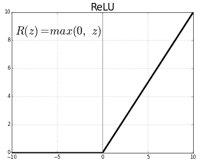
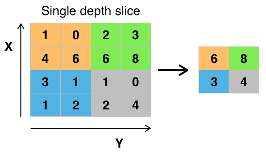
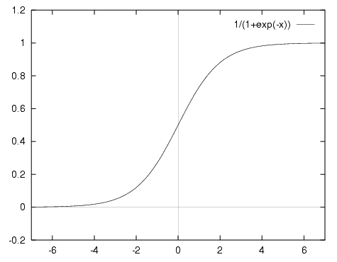
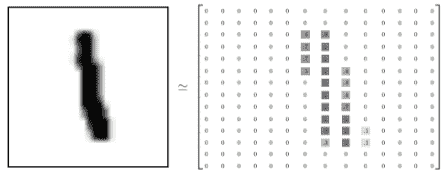
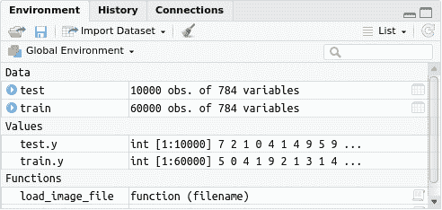
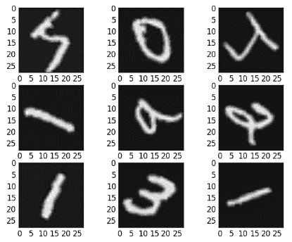
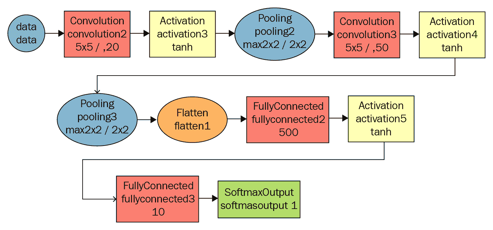
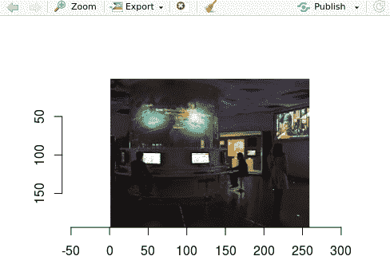
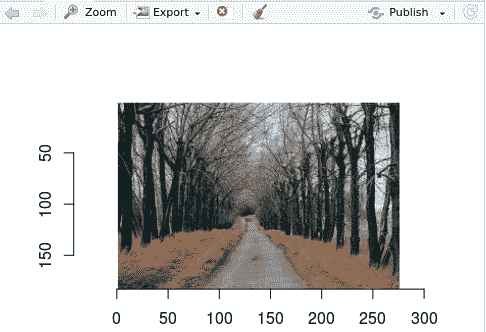

# 六、使用深度神经网络的图像识别

1966 年，麻省理工学院的西蒙·派珀特教授构思了一个雄心勃勃的夏季项目，名为*夏季视觉项目*。这个研究生的任务是*将一个摄像头插入电脑，并使其能够理解所看到的东西*！我确信对于研究生来说完成这个项目是非常困难的，因为即使在今天这个任务也只完成了一半。

当人类向外看的时候，他们能够认出他们所看到的物体。不用思考，他们能够将猫归类为猫，将狗归类为狗，将植物归类为植物，将动物归类为动物——这是因为人类大脑从其广泛的预学习数据库中汲取知识。毕竟，作为人类，我们有数百万年的进化背景，这使我们能够从我们看到的事物中做出推论。计算机视觉处理复制人类视觉过程，以便将它们传递给机器并使它们自动化。

这一章讲的都是通过**机器学习** ( **ML** )学习计算机视觉的理论和实现。我们将建立一个前馈深度学习网络和 LeNet 来实现手写数字识别。我们还将构建一个项目，使用预训练的 Inception-BatchNorm 网络来识别图像中的对象。在本章中，我们将讨论以下主题:

*   理解计算机视觉
*   利用深度学习实现计算机视觉
*   MNIST 数据集简介
*   实现用于手写数字识别的深度学习网络
*   用预训练模型实现计算机视觉


# 技术要求

对于本章涵盖的项目，我们将利用一个非常流行的开放数据集，名为 MNIST。我们将使用 **Apache MXNet** ，一个现代开源深度学习软件框架来训练和部署所需的深度神经网络。


# 理解计算机视觉

在当今世界，我们有先进的相机，它们非常成功地模仿了人眼捕捉光线和颜色的方式；但是用正确的方法捕捉图像只是整个图像理解过程的第一步。在图像捕捉之后，我们将需要启用技术来解释捕捉到的内容，并围绕它构建上下文。这是当眼睛看到东西时，人类大脑的反应。巨大的挑战来了:我们都知道，计算机将图像视为大量的整数值，这些整数值代表了一系列颜色的强度，当然，计算机没有与图像本身相关联的上下文。这就是 ML 发挥作用的地方。ML 允许我们为数据集训练一个上下文，使得计算机能够理解某些数字序列实际上代表什么对象。

计算机视觉是 ML 应用的新兴领域之一。它可用于各种领域，包括医疗保健、农业、保险和汽车行业。以下是一些最受欢迎的应用:

*   从诸如 CT 扫描/MRI 扫描图像的医学图像中检测疾病
*   识别作物疾病和土壤质量，以支持更高的作物产量
*   从卫星图像识别石油储量
*   无人驾驶汽车
*   监测和管理银屑病患者的皮肤状况
*   杂草和农作物的分类和区分
*   面部识别
*   从个人文档(如护照和身份证)中提取信息
*   为无人机和飞机探测地形
*   生物测定学
*   公共监视
*   整理个人照片
*   回答视觉问题

这只是冰山一角。毫不夸张地说，没有一个领域我们找不到计算机视觉的应用。因此，计算机视觉是 ML 从业者重点关注的领域。


# 利用深度学习实现计算机视觉

首先，我们来理解一下术语**深度学习**。它的简单意思是**多层神经网络**。多层使得深度学习成为神经网络的增强和强大形式。**人工神经网络** ( **ANNs** )自 20 世纪 50 年代就已经存在。它们总是被设计成两层；然而，深度学习模型是用多个隐藏层构建的。下图显示了一个假设的深度学习模型:


深度学习模型—高级架构

神经网络计算量很大，因此直到最近，最多可以使用 22 个内核的**中央处理器** ( **CPU** )通常被认为是基础设施的阻碍因素。这种基础设施的限制也限制了神经网络解决现实世界问题的使用。然而，最近，与 CPU 相比，具有数千个内核的**图形处理单元** ( **GPU** )的可用性具有指数级强大的计算能力。这极大地推动了深度学习模型的使用。

数据有多种形式，如表格、声音、HTML 文件、TXT 文件和图像。线性模型通常不会从非线性数据中学习。非线性算法，如决策树和梯度推进机器，也不能很好地从这种数据中学习。另一方面，在特征之间创建非线性交互的深度学习模型利用非线性数据给出了更好的解决方案，因此它们已经成为 ML 社区中的首选模型。

深度学习模型由一系列相互连接的神经元组成，这些神经元创建了神经架构。任何深度学习模型都会有一个输入层、两个或更多个隐藏层(中间层)和一个输出层。输入层由与数据中输入变量数量相等的神经元组成。用户可以决定深度学习网络应该具有的神经元数量和隐藏层数量。一般来说，它是由构建网络的用户通过交叉验证策略来优化的。神经元的数量和隐藏层的数量的选择代表了研究者的挑战。输出层中神经元的数量是根据问题的结果决定的。例如，在回归的情况下，一个输出神经元，对于分类问题，输出神经元等于手头问题中涉及的类的数量。


# 卷积神经网络

深度学习算法有多种类型，我们在计算机视觉中普遍使用的一种叫做**卷积神经网络** ( **CNN** )。CNN 将图像分解成小的像素组，然后通过应用过滤器对其进行计算。然后将结果与他们已知的像素矩阵进行比较。这有助于 CNN 得出图像属于某个已知类别的概率。

在最初的几层中，CNN 识别形状，如曲线和粗糙的边缘，但经过几次卷积后，它们能够识别动物、汽车和人类等物体。

当 CNN 第一次为可用数据建立时，网络的过滤值是随机初始化的，因此它产生的预测大部分是错误的。但随后，它会不断将自己对标记数据集的预测与实际预测进行比较，更新过滤器值，并在每次迭代中提高 CNN 的性能。


# CNN 的层次

CNN 由输入层和输出层组成；它还有各种隐藏层。以下是 CNN 中的各种隐藏层:

*   **卷积**:假设我们有一个用像素表示的图像，卷积是我们在深度学习中有一个几乎总是 3 x 3 的小矩阵，并将矩阵的每个元素乘以图像的 3 x 3 部分的每个元素，然后将它们加在一起，以在一个点上获得卷积的结果。下图说明了像素卷积的过程:


图像上的卷积应用

*   **整流线性单元** ( **ReLU** ):抛弃输入矩阵中负片的非线性激活。例如，假设我们有一个 3 x 3 的矩阵，矩阵的单元格中有负数、零和正数作为值。给定这个矩阵作为 ReLU 的输入，它将矩阵中的所有负数转换为零，并返回 3 x 3 矩阵。ReLU 是可以被定义为 CNN 架构的一部分的激活功能。下图展示了 CNN 中 ReLU 的功能:



CNN 中的校正线性单位(ReLU)

*   **最大池**:最大池是可以在 CNN 架构中设置为一个层的东西。它允许识别特定特征是否存在于先前的级别中。它用最大值替换输入矩阵中的最大值，并给出输出。让我们考虑一个例子，对于 2×2 最大池层，给定 4×4 矩阵作为输入，最大池层用四个单元中的最高值替换输入矩阵中的每个 2×2。由此获得的输出矩阵是非重叠的，并且是具有降低的分辨率的图像表示。下图说明了 CNN 中最大池的功能:



CNN 中最大池层的功能

应用 max pooling 有各种原因，例如减少参数和计算负载的数量，消除过度拟合，以及最重要的是，迫使神经网络看到更大的画面，因为在以前的层中，它专注于看到图像的片段。

*   **全连接层**:也称为**密集层**，这涉及到对该层输入向量的线性操作。该层确保每个输入通过权重连接到每个输出。
*   **Softmax** :一般应用于深度神经网络最后一层的激活函数。在多类分类问题中，我们需要将深度学习网络的全连接输出解释为概率。数据(所有类别)中特定观察值的总概率应等于 1，且观察值属于每个类别的概率应介于 0 和 1 之间。因此，我们将全连接层的每个输出转换为总和的一部分。然而，我们不是简单地做标准比例，而是因为一个非常具体的原因应用这个非线性指数函数:我们希望使我们的最高产量尽可能接近 1，而我们的最低产量接近 0。Softmax 通过将真实线性比例推至接近 1 或 0 来实现这一点。

下图说明了 softmax 激活功能:



Softmax 激活功能

*   **Sigmoid** :这类似于 softmax，除了它应用于二进制分类，比如猫对狗。利用这个激活函数，与其他类相比，观察所属的类被赋予更高的概率。与 softmax 不同，概率的总和不一定是 1。


# MXNet 框架简介

MXNet 是一个超级强大的开源深度学习框架，旨在简化深度学习算法的开发。它用于定义、训练和部署深度神经网络。MXNet 是精简的、灵活的、超可伸缩的，也就是说，它允许快速的模型训练，并支持具有多种语言的灵活编程模型。现有深度学习框架(如 Torch7、Theano 和 Caffe)的问题是，用户需要学习另一个系统或不同的编程风格。

然而，MXNet 通过支持多种语言(如 C++、Python、R、Julia 和 Perl)解决了这个问题。这消除了用户学习新语言的需要；因此，他们可以使用框架并简化网络定义。MXNet 模型能够适应少量内存，并且可以在 CPU、GPU 和多台机器上轻松训练。R 语言的`mxnet`包已经准备好了，安装的细节可以在位于[https://mxnet.incubator.apache.org](https://mxnet.incubator.apache.org)的 **Apache 孵化器**中找到。


# 了解 MNIST 数据集

**改良的国家标准与技术研究所** ( **MNIST** )是一个包含手写数字图像的数据集。这个数据集在 ML 社区中非常流行，用于实现和测试计算机视觉算法。http://yann.lecun.com/exdb/mnist/[大学的 Yann LeCun 教授提供的 MNIST 数据集是一个开放的数据集，其中提供了代表训练数据集和测试数据集的独立文件。对应于测试和训练数据集的标签也可以作为单独的文件获得。训练数据集有 60，000 个样本，测试数据集有 10，000 个样本。](http://yann.lecun.com/exdb/mnist/)

下图显示了 MNIST 数据集中的一些样本图像。每个图像还带有一个标签，指示以下截图中显示的数字:


来自 MNIST 数据集的样本图像

上图所示图像的标签为 **5** 、 **0** 、 **4** 和 **1** 。数据集中的每个图像都是灰度图像，以 28 x 28 像素表示。用像素表示的示例图像如下面的屏幕截图所示:



来自 MNIST 数据集的样本图像用 28 * 28 像素表示

可以展平 28×28 像素矩阵，并将其表示为 784 个像素值的向量。本质上，训练数据集是可以与 ML 算法一起使用的 60，000 x 784 矩阵。测试数据集是一个 10，000 x 784 的矩阵。可以使用以下代码从源下载训练和测试数据集:

```
# setting the working directory where the files need to be downloaded
setwd('/home/sunil/Desktop/book/chapter 6/MNIST')
# download the training and testing dataset from source
download.file("http://yann.lecun.com/exdb/mnist/train-images-idx3-ubyte.gz","train-images-idx3-ubyte.gz")
download.file("http://yann.lecun.com/exdb/mnist/train-labels-idx1-ubyte.gz","train-labels-idx1-ubyte.gz")
download.file("http://yann.lecun.com/exdb/mnist/t10k-images-idx3-ubyte.gz","t10k-images-idx3-ubyte.gz")
download.file("http://yann.lecun.com/exdb/mnist/t10k-labels-idx1-ubyte.gz","t10k-labels-idx1-ubyte.gz")
# unzip the training and test zip files that are downloaded
R.utils::gunzip("train-images-idx3-ubyte.gz")
R.utils::gunzip("train-labels-idx1-ubyte.gz")
R.utils::gunzip("t10k-images-idx3-ubyte.gz")
R.utils::gunzip("t10k-labels-idx1-ubyte.gz")
```

一旦数据被下载并解压缩，我们将在我们的工作目录中看到这些文件。然而，这些文件是二进制格式的，它们不能通过常规的`read.csv`命令直接加载。以下自定义函数代码有助于从二进制文件中读取训练和测试数据:

```
# function to load the image files
load_image_file = function(filename) {
  ret = list()
  # opening the binary file in read mode 
  f = file(filename, 'rb')
  # reading the binary file into a matrix called x
 readBin(f, 'integer', n = 1, size = 4, endian = 'big')
 n = readBin(f, 'integer', n = 1, size = 4, endian = 'big')
 nrow = readBin(f, 'integer', n = 1, size = 4, endian = 'big')
 ncol = readBin(f, 'integer', n = 1, size = 4, endian = 'big')
 x = readBin(f, 'integer', n = n * nrow * ncol, size = 1, signed = FALSE)
  # closing the file
  close(f)
  # converting the matrix and returning the dataframe
  data.frame(matrix(x, ncol = nrow * ncol, byrow = TRUE))
}
# function to load label files
load_label_file = function(filename) {
  # reading the binary file in read mode
  f = file(filename, 'rb')
  # reading the labels binary file into y vector 
  readBin(f, 'integer', n = 1, size = 4, endian = 'big')
  n = readBin(f, 'integer', n = 1, size = 4, endian = 'big')
  y = readBin(f, 'integer', n = n, size = 1, signed = FALSE)
  # closing the file
  close(f)
  # returning the y vector
  y
}
```

可以用以下代码调用这些函数:

```
# load training images data through the load_image_file custom function
train = load_image_file("train-images-idx3-ubyte")
# load  test data through the load_image_file custom function
test  = load_image_file("t10k-images-idx3-ubyte")
# load the train dataset labels
train.y = load_label_file("train-labels-idx1-ubyte")
# load the test dataset labels
test.y  = load_label_file("t10k-labels-idx1-ubyte")
```

在 RStudio 中，当我们执行代码时，我们看到`train`、`test`、`train.y`和`test.y`显示在环境选项卡下。这确认了数据集已成功加载，并且相应的数据帧已创建，如以下屏幕截图所示:



一旦图像数据被加载到数据帧中，它就是代表像素值的一系列数字的形式。以下是在 RStudio 中将像素数据可视化为图像的辅助函数:

```
# helper function to visualize image given a record of pixels
show_digit = function(arr784, col = gray(12:1 / 12), ...) {
  image(matrix(as.matrix(arr784), nrow = 28)[, 28:1], col = col, ...)
}
```

可以像调用其他 R 函数一样调用`show_digit()`函数，将数据帧记录号作为参数。例如，以下代码块中的函数有助于将训练数据集中的`3`记录可视化为 RStudio 中的图像:

```
# viewing image corresponding to record 3 in the train dataset
show_digit(train[3, ])
```

这将产生以下输出:


在他的博客*探索手写数字分类:MNIST 数据集*([http://varianceexplained.org/r/digit-eda/](http://varianceexplained.org/r/digit-eda/))的整洁分析中，大卫·罗宾逊博士对 MNIST 数据集进行了漂亮的探索性数据分析，这将有助于你更好地理解数据集。


# 实现用于手写数字识别的深度学习网络

`mxnet`库提供了几个功能，使我们能够定义组成深度学习网络的层和激活。层的定义、激活函数的使用以及每个隐藏层中使用的神经元数量通常被称为**网络架构**。决定网络架构与其说是科学，不如说是艺术。通常，可能需要多次重复实验来决定问题的正确架构。我们称之为艺术，因为寻找理想的建筑没有确切的规则。层数、这些层中的神经元以及层的类型都是通过反复试验决定的。

在这一部分，我们将建立一个简单的深度学习网络，具有三个隐藏层。以下是我们网络的总体架构:

1.  输入层被定义为网络的初始层。`mx.symbol.Variable` MXNet 函数定义了输入层。
2.  定义了全连接层，也称为密集层，具有 128 个神经元作为网络中的第一隐藏层。这可以通过使用`mx.symbol.FullyConnected` MXNet 函数来完成。
3.  ReLU 激活功能被定义为网络的一部分。`mx.symbol.Activation`功能帮助我们将 ReLU 激活功能定义为网络的一部分。
4.  定义第二隐藏层；这是另一个有 64 个神经元的致密层。这可以通过`mx.symbol.FullyConnected`功能完成，类似于第一个隐藏层。
5.  对第二个隐藏层的输出应用 ReLU 激活函数。这可以通过`mx.symbol.Activation`功能来完成。
6.  我们网络中的最后一个隐藏层是另一个全连接层，但是只有十个输出(等于类的数量)。这也可以通过`mx.symbol.FullyConnected`功能来完成。
7.  需要定义输出层，这应该是每个类的预测概率；因此，我们在输出层应用 softmax。`mx.symbol.SoftmaxOutput`功能使我们能够在输出中配置 softmax。

我们并不是说这是解决该问题的最佳网络架构，但这是我们将要构建的网络，用于演示使用 MXNet 实现深度学习网络。

现在我们已经有了蓝图，让我们使用下面的代码块深入研究网络编码:

```
# setting the working directory
setwd('/home/sunil/Desktop/book/chapter 6/MNIST')
# function to load image files
load_image_file = function(filename) {
  ret = list()
  f = file(filename, 'rb')
  readBin(f, 'integer', n = 1, size = 4, endian = 'big')
  n    = readBin(f, 'integer', n = 1, size = 4, endian = 'big')
  nrow = readBin(f, 'integer', n = 1, size = 4, endian = 'big')
  ncol = readBin(f, 'integer', n = 1, size = 4, endian = 'big')
  x = readBin(f, 'integer', n = n * nrow * ncol, size = 1, signed
= FALSE)
  close(f)
  data.frame(matrix(x, ncol = nrow * ncol, byrow = TRUE))
}
# function to load the label files
load_label_file = function(filename) {
  f = file(filename, 'rb')
  readBin(f, 'integer', n = 1, size = 4, endian = 'big')
  n = readBin(f, 'integer', n = 1, size = 4, endian = 'big')
  y = readBin(f, 'integer', n = n, size = 1, signed = FALSE)
  close(f)
  y }
# loading the image files
train = load_image_file("train-images-idx3-ubyte")
test  = load_image_file("t10k-images-idx3-ubyte")
# loading the labels
train.y = load_label_file("train-labels-idx1-ubyte")
test.y  = load_label_file("t10k-labels-idx1-ubyte")
# lineaerly transforming the grey scale image i.e. between 0 and 255 to # 0 and 1
train.x <- data.matrix(train/255)
test <- data.matrix(test/255)
# verifying the distribution of the digit labels in train dataset
print(table(train.y))
# verifying the distribution of the digit labels in test dataset
print(table(test.y))
```

这将产生以下输出:

```
train.y
   0    1    2   3    4    5    6    7    8    9 
5923 6742 5958 6131 5842 5421 5918 6265 5851 5949 

test.y
   0    1    2    3    4    5    6    7    8    9 
 980 1135 1032 1010  982  892  958 1028  974 1009 
```

现在，定义三个层，并开始训练网络以获得类概率，并确保使用以下代码块可再现结果:

```
# including the required mxnet library 
library(mxnet)
# defining the input layer in the network architecture
data <- mx.symbol.Variable("data")
# defining the first hidden layer with 128 neurons and also naming the # layer as fc1
# passing the input data layer as input to the fc1 layer
fc1 <- mx.symbol.FullyConnected(data, name="fc1", num_hidden=128)
# defining the ReLU activation function on the fc1 output and also # naming the layer as ReLU1
act1 <- mx.symbol.Activation(fc1, name="ReLU1", act_type="relu")
# defining the second hidden layer with 64 neurons and also naming the # layer as fc2
# passing the previous activation layer output as input to the
fc2 layer
fc2 <- mx.symbol.FullyConnected(act1, name="fc2", num_hidden=64)
# defining the ReLU activation function on the fc2 output and also 
# naming the layer as ReLU2
act2 <- mx.symbol.Activation(fc2, name="ReLU2", act_type="relu")
# defining the third and final hidden layer in our network with 10 
# neurons and also naming the layer as fc3
# passing the previous activation layer output as input to the
fc3 layer
fc3 <- mx.symbol.FullyConnected(act2, name="fc3", num_hidden=10)
# defining the output layer with softmax activation function to obtain # class probabilities 
softmax <- mx.symbol.SoftmaxOutput(fc3, name="sm")
# defining that the experiment should run on cpu
devices <- mx.cpu()
# setting the seed for the experiment so as to ensure that the results # are reproducible
mx.set.seed(0)
# building the model with the network architecture defined above
model <- mx.model.FeedForward.create(softmax, X=train.x, y=train.y,
ctx=devices, num.round=10, array.batch.size=100,array.layout ="rowmajor",
learning.rate=0.07, momentum=0.9,  eval.metric=mx.metric.accuracy,
initializer=mx.init.uniform(0.07), 
epoch.end.callback=mx.callback.log.train.metric(100))
```

这将产生以下输出:

```
Start training with 1 devices
[1] Train-accuracy=0.885783334343384
[2] Train-accuracy=0.963616671562195
[3] Train-accuracy=0.97510000983874
[4] Train-accuracy=0.980016676982244
[5] Train-accuracy=0.984233343303204
[6] Train-accuracy=0.986883342464765
[7] Train-accuracy=0.98848334223032
[8] Train-accuracy=0.990800007780393
[9] Train-accuracy=0.991300007204215
[10] Train-accuracy=0.991516673564911
```

若要对测试数据集进行预测并获取测试数据集中每个观察值的标签，请使用以下代码块:

```
# making predictions on the test dataset
preds <- predict(model, test)
# verifying the predicted output
print(dim(preds))
# getting the label for each observation in test dataset; the
# predicted class is the one with highest probability
pred.label <- max.col(t(preds)) - 1
# observing the distribution of predicted labels in the test dataset
print(table(pred.label))
```

这将产生以下输出:

```
[1]    10 10000
pred.label
   0    1    2    3    4    5    6    7    8    9 
 980 1149 1030 1021 1001  869  960 1001  964 1025 
```

让我们使用以下代码来检查模型的性能:

```
# obtaining the performance of the model
print(accuracy(pred.label,test.y))
```

这将产生以下输出:

```
Accuracy (PCC): 97.73% 
Cohen's Kappa: 0.9748 
Users accuracy: 
   0    1    2    3    4    5    6    7    8    9 
98.8 99.6 98.0 97.7 98.3 96.1 97.9 96.3 96.6 97.7 
Producers accuracy: 
   0    1    2    3    4    5    6    7    8    9 
98.8 98.3 98.2 96.7 96.4 98.6 97.7 98.9 97.6 96.2 
Confusion matrix 
   y
x      0    1    2    3    4    5    6    7    8    9
  0  968    0    1    1    1    2    3    1    2    1
  1    1 1130    3    0    0    1    3    8    1    2
  2    0    1 1011    2    2    0    0   11    3    0
  3    1    2    6  987    0   14    2    2    4    3
  4    1    0    2    1  965    2   10    3    6   11
  5    1    0    0    4    0  857    2    0    3    2
  6    5    2    3    0    4    5  938    0    3    0
  7    0    0    2    2    1    1    0  990    3    2
  8    1    0    4    8    0    5    0    3  941    2
  9    2    0    0    5    9    5    0   10    8  986
```

要可视化网络架构，请使用以下代码:

```
# Visualizing the network architecture
graph.viz(model$symbol)
```

这将产生以下输出:


通过简单的架构在基于 CPU 的笔记本电脑上运行几分钟，我们能够在测试数据集上达到`97.7%`的准确度。深度学习网络能够通过看到作为输入的图像来学习解释数字。通过改变架构或增加迭代次数，可以进一步提高系统的精度。值得注意的是，在早期的实验中，我们运行了 10 次迭代。

通过`num.round`参数建模时，可以简单地修改迭代次数。在最佳回合数方面没有严格的规则，所以这是要通过反复试验来确定的。让我们用 50 次迭代来构建模型，并观察它对性能的影响。该规范将与早期项目保持一致，但对模型构建规范进行了以下修改:

```
model <- mx.model.FeedForward.create(softmax, X=train.x, y=train.y,
ctx=devices, num.round=50, array.batch.size=100,array.layout ="rowmajor",
learning.rate=0.07, momentum=0.9,  eval.metric=mx.metric.accuracy,
initializer=mx.init.uniform(0.07), 
epoch.end.callback=mx.callback.log.train.metric(100))
```

注意到`num.round`参数现在被设置为`50`，而不是之前的`10`值。

这将产生以下输出:

```
[35] Train-accuracy=0.999933333396912
[36] Train-accuracy=1
[37] Train-accuracy=1
[38] Train-accuracy=1
[39] Train-accuracy=1
[40] Train-accuracy=1
[41] Train-accuracy=1
[42] Train-accuracy=1
[43] Train-accuracy=1
[44] Train-accuracy=1
[45] Train-accuracy=1
[46] Train-accuracy=1
[47] Train-accuracy=1
[48] Train-accuracy=1
[49] Train-accuracy=1
[50] Train-accuracy=1
[1]    10 10000
pred.label
   0    1    2    3    4    5    6    7    8    9 
 992 1139 1029 1017  983  877  953 1021  972 1017 
Accuracy (PCC): 98.21% 
Cohen's Kappa: 0.9801 
Users accuracy: 
   0    1    2    3    4    5    6    7    8    9 
99.3 99.5 98.2 98.2 98.1 97.1 98.0 97.7 98.0 97.8 
Producers accuracy: 
   0    1    2    3    4    5    6    7    8    9 
98.1 99.1 98.4 97.5 98.0 98.7 98.5 98.3 98.3 97.1 
Confusion matrix 
   y
x      0    1    2    3    4    5    6    7    8    9
  0  973    0    2    2    1    3    5    1    3    2
  1    1 1129    0    0    1    1    3    2    0    2
  2    1    0 1013    1    3    0    0    9    2    0
  3    0    1    5  992    0   10    1    1    3    4
  4    0    0    2    0  963    2    7    1    1    7
  5    0    0    0    4    1  866    2    0    2    2
  6    2    2    1    0    3    5  939    0    1    0
  7    0    1    6    3    1    1    0 1004    2    3
  8    1    1    3    4    0    2    1    3  955    2
  9    2    1    0    4    9    2    0    7    5  987
```

我们可以从输出中观察到，使用训练数据集获得了 100%的准确性。然而，对于测试数据集，我们观察到准确率为 98%。从本质上讲，我们的模型在训练和测试数据集上的表现应该是一样的，才能被称为好模型。不幸的是，在这种情况下，我们遇到了一种称为**过度拟合、**的情况，这意味着我们创建的模型没有很好地泛化。换句话说，模型已经用太多的参数训练了自己，或者它已经训练了太长时间，并且仅用训练数据集中的数据就变得超级专门化；结果是，它在新数据方面做得不好。模型泛化是我们应该明确的目标。有一种叫做 **dropout** 的技术可以帮助我们克服过度拟合问题。


# 实施辍学以避免过度适应

丢弃是在激活层之后的网络架构中定义的，它随机地将激活设置为零。换句话说，辍学随机删除了神经网络的一部分，这使我们能够防止过度拟合。当我们不断丢弃在训练过程中学到的信息时，我们不能完全适应我们的训练数据。这使得我们的神经网络能够更好地学习概括。

在 MXNet 中，使用`mx.symbol.Dropout`函数可以很容易地将 dropout 定义为网络架构的一部分。例如，下面的代码定义了第一次 ReLU 激活(`act1`)和第二次 ReLU 激活(`act2`)后的退出:

```
dropout1 <- mx.symbol.Dropout(data = act1, p = 0.5)
dropout2 <- mx.symbol.Dropout(data = act2, p = 0.3)
```

`data`参数指定了漏失所采用的输入，`p`的值指定了要完成的漏失量。在`dropout1`的情况下，我们指定要丢弃 50%的重量。同样，在应该包括多少辍学和在哪一层没有硬性规定。这是要通过反复试验来确定的。除了现在包括激活后的退出之外，带有退出的代码几乎与早期项目保持一致:

```
# code to read the dataset and transform it to train.x and train.y remains # same as earlier project, therefore that code is not shown here
# including the required mxnet library 
library(mxnet)
# defining the input layer in the network architecture
data <- mx.symbol.Variable("data")
# defining the first hidden layer with 128 neurons and also naming the # layer as fc1
# passing the input data layer as input to the fc1 layer
fc1 <- mx.symbol.FullyConnected(data, name="fc1", num_hidden=128)
# defining the ReLU activation function on the fc1 output and also naming the layer as ReLU1
act1 <- mx.symbol.Activation(fc1, name="ReLU1", act_type="relu")
# defining a 50% dropout of weights learnt
dropout1 <- mx.symbol.Dropout(data = act1, p = 0.5)
# defining the second hidden layer with 64 neurons and also naming the layer as fc2
# passing the previous dropout output as input to the fc2 layer
fc2 <- mx.symbol.FullyConnected(dropout1, name="fc2", num_hidden=64)
# defining the ReLU activation function on the fc2 output and also naming the layer as ReLU2
act2 <- mx.symbol.Activation(fc2, name="ReLU2", act_type="relu")
# defining a dropout with 30% weight drop
dropout2 <- mx.symbol.Dropout(data = act2, p = 0.3)
# defining the third and final hidden layer in our network with 10 neurons and also naming the layer as fc3
# passing the previous dropout output as input to the fc3 layer
fc3 <- mx.symbol.FullyConnected(dropout2, name="fc3", num_hidden=10)
# defining the output layer with softmax activation function to
obtain class probabilities 
softmax <- mx.symbol.SoftmaxOutput(fc3, name="sm")
# defining that the experiment should run on cpu
devices <- mx.cpu()
# setting the seed for the experiment so as to ensure that the results are reproducible
mx.set.seed(0)
# building the model with the network architecture defined above
model <- mx.model.FeedForward.create(softmax, X=train.x, y=train.y, ctx=devices, num.round=50, array.batch.size=100,array.layout = "rowmajor", learning.rate=0.07, momentum=0.9,  eval.metric=mx.metric.accuracy, initializer=mx.init.uniform(0.07), epoch.end.callback=mx.callback.log.train.metric(100))
# making predictions on the test dataset
preds <- predict(model, test)
# verifying the predicted output
print(dim(preds))
# getting the label for each observation in test dataset; the predicted class is the one with highest probability
pred.label <- max.col(t(preds)) - 1
# observing the distribution of predicted labels in the test
dataset
print(table(pred.label))
# including the rfUtilities library so as to use accuracy function
library(rfUtilities)
# obtaining the performance of the model
print(accuracy(pred.label,test.y))
# printing the network architecture
graph.viz(model$symbol) 
```

这将给出以下输出和可视化网络架构:

```
[35] Train-accuracy=0.958950003186862
[36] Train-accuracy=0.958983335793018
[37] Train-accuracy=0.958083337446054
[38] Train-accuracy=0.959683336317539
[39] Train-accuracy=0.95990000406901
[40] Train-accuracy=0.959433337251345
[41] Train-accuracy=0.959066670437654
[42] Train-accuracy=0.960250004529953
[43] Train-accuracy=0.959983337720235
[44] Train-accuracy=0.960450003842513
[45] Train-accuracy=0.960150004227956
[46] Train-accuracy=0.960533337096373
[47] Train-accuracy=0.962033336758614
[48] Train-accuracy=0.96005000303189
[49] Train-accuracy=0.961366670827071
[50] Train-accuracy=0.961350003282229
[1]    10 10000
pred.label
   0    1    2    3    4    5    6    7    8    9 
 984 1143 1042 1022  996  902  954 1042  936  979 
Accuracy (PCC): 97.3% 
Cohen's Kappa: 0.97 
Users accuracy: 
   0    1    2    3    4    5    6    7    8    9 
98.7 98.9 98.1 97.6 98.2 97.3 97.6 97.4 94.3 94.7 
Producers accuracy: 
   0    1    2    3    4    5    6    7    8    9 
98.3 98.3 97.1 96.5 96.8 96.2 98.0 96.1 98.1 97.7 
Confusion matrix 
   y
x      0    1    2    3    4    5    6    7    8    9
  0  967    0    0    0    0    2    5    1    6    3
  1    0 1123    3    0    1    1    3    5    2    5
  2    1    2 1012    4    3    0    0   14    4    2
  3    2    1    4  986    0    6    1    3   12    7
  4    0    0    3    0  964    2    5    0    5   17
  5    2    3    0    9    0  868    7    0    9    4
  6    3    2    0    0    5    3  935    0    6    0
  7    4    1    9    4    3    3    0 1001    6   11
  8    1    3    1    2    1    3    2    1  918    4
  9    0    0    0    5    5    4    0    3    6  956
```

请看下图:


我们可以从输出中看到，dropout 现已成为网络架构的一部分。我们还观察到，与我们最初的项目相比，这种网络架构在测试数据集上产生了较低的准确性。一个原因可能是我们纳入的辍学率(50%和 30%)太高了。我们可以利用这些百分比并重建模型来确定准确性是否会变得更好。然而，这一想法是为了证明使用辍学作为一种正则化技术，以避免在深度神经网络中过度拟合。

除了辍学，还有其他方法可以避免过度适应的情况:

*   **增加数据**:增加更多的训练数据。
*   **数据扩充**:通过应用翻转、扭曲、添加随机噪声和旋转等技术综合创建附加数据。以下屏幕截图显示了应用数据扩充后创建的示例图像:



来自应用数据扩充的样本图像

*   **降低网络架构的复杂性**:更少的层、更少的时代，等等。
*   **批量归一化**:保证网络中生成的权重不会推得很高或很低的过程。这通常通过从一层中的每个重量中减去一层中所有重量的平均值并除以标准偏差来实现。它可以防止过拟合，执行正则化，并显著提高训练速度。`mx.sym.batchnorm()`功能使我们能够在激活后定义批量标准化。

我们不会专注于开发另一个批处理规范化项目，因为在项目中使用该函数与我们在早期项目中使用的其他函数非常相似。到目前为止，我们一直专注于增加历元以提高模型的性能，另一个选项是尝试不同的架构，并评估这是否会提高测试数据集的准确性。关于这一点，让我们探索 LeNet，它是专门为文档中的光学字符识别而设计的。


# 用 MXNet 库实现 LeNet 架构

在他们 1998 年的论文*基于梯度的学习应用于文档识别*中，LeCun 等人介绍了 LeNet 架构。

LeNet 架构包括两组卷积层、激活层和池层，接着是全连接层、激活层、另一个全连接层，最后是 softmax 分类器。下图说明了 LeNet 架构:


LeNet 架构

现在，让我们使用下面的代码块在我们的项目中实现带有`mxnet`库的 LeNet 架构:

```
## setting the working directory
setwd('/home/sunil/Desktop/book/chapter 6/MNIST')
# function to load image files
load_image_file = function(filename) {
  ret = list()
  f = file(filename, 'rb')
  readBin(f, 'integer', n = 1, size = 4, endian = 'big')
  n    = readBin(f, 'integer', n = 1, size = 4, endian = 'big')
  nrow = readBin(f, 'integer', n = 1, size = 4, endian = 'big')
  ncol = readBin(f, 'integer', n = 1, size = 4, endian = 'big')
  x = readBin(f, 'integer', n = n * nrow * ncol, size = 1, signed
= FALSE)
  close(f)
  data.frame(matrix(x, ncol = nrow * ncol, byrow = TRUE))
}
# function to load label files
load_label_file = function(filename) {
  f = file(filename, 'rb')
  readBin(f, 'integer', n = 1, size = 4, endian = 'big')
  n = readBin(f, 'integer', n = 1, size = 4, endian = 'big')
  y = readBin(f, 'integer', n = n, size = 1, signed = FALSE)
  close(f)
  y
}
# load images
train = load_image_file("train-images-idx3-ubyte")
test  = load_image_file("t10k-images-idx3-ubyte")
# converting the train and test data into a format as required by LeNet
train.x <- t(data.matrix(train))
test <- t(data.matrix(test))
# loading the labels
train.y = load_label_file("train-labels-idx1-ubyte")
test.y  = load_label_file("t10k-labels-idx1-ubyte")
# linearly transforming the grey scale image i.e. between 0 and 255 to # 0 and 1
train.x <- train.x/255
test <- test/255
# including the required mxnet library 
library(mxnet)
# input
data <- mx.symbol.Variable('data')
# first convolution layer
conv1 <- mx.symbol.Convolution(data=data, kernel=c(5,5), num_filter=20)
# applying the tanh activation function
tanh1 <- mx.symbol.Activation(data=conv1, act_type="tanh")
# applying max pooling 
pool1 <- mx.symbol.Pooling(data=tanh1, pool_type="max", kernel=c(2,2), stride=c(2,2))
# second conv
conv2 <- mx.symbol.Convolution(data=pool1, kernel=c(5,5), num_filter=50)
# applying the tanh activation function again
tanh2 <- mx.symbol.Activation(data=conv2, act_type="tanh")
#performing max pooling again
pool2 <- mx.symbol.Pooling(data=tanh2, pool_type="max",
                           kernel=c(2,2), stride=c(2,2))
# flattening the data
flatten <- mx.symbol.Flatten(data=pool2)
# first fullconnected later
fc1 <- mx.symbol.FullyConnected(data=flatten, num_hidden=500)
# applying the tanh activation function
tanh3 <- mx.symbol.Activation(data=fc1, act_type="tanh")
# second fullconnected layer
fc2 <- mx.symbol.FullyConnected(data=tanh3, num_hidden=10)
# defining the output layer with softmax activation function to obtain # class probabilities 
lenet <- mx.symbol.SoftmaxOutput(data=fc2)
# transforming the train and test dataset into a format required by 
# MxNet functions
train.array <- train.x
dim(train.array) <- c(28, 28, 1, ncol(train.x))
test.array <- test
dim(test.array) <- c(28, 28, 1, ncol(test))
# setting the seed for the experiment so as to ensure that the
# results are reproducible
mx.set.seed(0)
# defining that the experiment should run on cpu
devices <- mx.cpu()
# building the model with the network architecture defined above
model <- mx.model.FeedForward.create(lenet, X=train.array, y=train.y,
ctx=devices, num.round=3, array.batch.size=100, learning.rate=0.05, 
momentum=0.9, wd=0.00001, eval.metric=mx.metric.accuracy, 
           epoch.end.callback=mx.callback.log.train.metric(100))
# making predictions on the test dataset
preds <- predict(model, test.array)
# getting the label for each observation in test dataset; the
# predicted class is the one with highest probability
pred.label <- max.col(t(preds)) - 1
# including the rfUtilities library so as to use accuracy
function
library(rfUtilities)
# obtaining the performance of the model
print(accuracy(pred.label,test.y))
# printing the network architecture
graph.viz(model$symbol,direction="LR")
```

这将给出以下输出和可视化网络架构:

```
Start training with 1 devices
[1] Train-accuracy=0.678916669438283
[2] Train-accuracy=0.978666676680247
[3] Train-accuracy=0.98676667680343
Accuracy (PCC): 98.54% 
Cohen's Kappa: 0.9838 
Users accuracy: 
    0     1     2     3     4     5     6     7     8     9 
 99.8 100.0  97.0  98.4  98.9  98.2  98.2  98.7  98.2  97.8 
Producers accuracy: 
   0    1    2    3    4    5    6    7    8    9 
98.0 96.9 99.1 99.3 99.0 99.3 99.6 97.7 98.7 98.3  
Confusion matrix 
   y
x      0    1    2    3    4    5    6    7    8    9
  0  978    0    2    2    1    3    7    0    4    1
  1    0 1135   15    2    1    0    5    7    1    5
  2    0    0 1001    2    1    1    0    3    2    0
  3    0    0    0  994    0    5    0    1    1    0
  4    0    0    1    0  971    0    1    0    0    8
  5    0    0    0    3    0  876    2    0    1    0
  6    0    0    0    0    2    1  941    0    1    0
  7    1    0    7    1    3    1    0 1015    3    8
  8    1    0    6    1    1    1    2    1  956    0
  9    0    0    0    5    2    4    0    1    5  987
```

请看下图:



代码在我的 4 核 CPU 机器上运行了不到 5 分钟，但仍然在测试数据集上用三个时期获得了 98%的准确率。我们还可以看到，我们在训练和测试数据集上都获得了 98%的准确性，这证实了没有过度拟合。

我们看到`tanh`被用作激活函数；我们来实验一下，如果改成 ReLU，看有没有影响。该项目的代码将是相同的，除了我们需要找到和替换 ReLU 的`tanh`。我们将不重复代码，因为与早期项目相比，仅有的几行代码发生了变化，如下所示:

```
ReLU1 <- mx.symbol.Activation(data=conv1, act_type="relu")
pool1 <- mx.symbol.Pooling(data=ReLU1, pool_type="max",
                           kernel=c(2,2), stride=c(2,2))
ReLU2 <- mx.symbol.Activation(data=conv1, act_type="relu")
pool2 <- mx.symbol.Pooling(data=ReLU2, pool_type="max",
                           kernel=c(2,2), stride=c(2,2))
ReLU3 <- mx.symbol.Activation(data=conv1, act_type="relu")
fc2 <- mx.symbol.FullyConnected(data=ReLU3, num_hidden=10)
```

在运行以 ReLU 作为激活函数的代码时，您将得到以下输出:

```
Start training with 1 devices
[1] Train-accuracy=0.627283334874858
[2] Train-accuracy=0.979916676084201
[3] Train-accuracy=0.987366676231225
Accuracy (PCC): 98.36% 
Cohen's Kappa: 0.9818 
Users accuracy: 
   0    1    2    3    4    5    6    7    8    9 
99.8 99.7 97.9 99.4 98.6 96.5 97.7 98.2 97.4 97.9 
Producers accuracy: 
   0    1    2    3    4    5    6    7    8    9 
97.5 97.2 99.6 95.6 99.7 99.2 99.7 98.0 99.6 98.2 
Confusion matrix 
   y
x      0    1    2    3    4    5    6    7    8    9
  0  978    0    3    1    1    2   12    0    5    1
  1    1 1132    6    0    2    1    5   11    1    6
  2    0    0 1010    1    0    0    0    1    2    0
  3    0    2    4 1004    0   23    1    3    9    4
  4    0    0    1    0  968    0    1    0    0    1
  5    0    1    0    1    0  861    2    0    3    0
  6    0    0    0    0    0    3  936    0    0    0
  7    1    0    6    3    0    1    0 1010    1    9
  8    0    0    2    0    1    0    1    0  949    0
  9    0    0    0    0   10    1    0    3    4  988
```

使用 ReLU 作为激活函数，我们没有看到精确度的显著提高。它保持在 98%，与使用`tanh`激活功能获得的结果相同。

下一步，我们可以尝试用额外的时期重建模型，看看精确度是否提高了。或者，我们可以尝试调整每个卷积层的滤波器数量和滤波器大小，看看会发生什么！进一步的实验也可以包括增加几个种类的更多层。除非我们实验，否则我们不知道结果会是什么！


# 用预训练模型实现计算机视觉

在[第 1 章](d8e2df34-05df-451e-88ce-62fdf17184d4.xhtml)、*探索机器学习前景*中，我们触及了一个叫做**迁移学习**的概念。这个想法是把在一个模型中学到的知识应用到另一个相关的任务中。如今，迁移学习几乎用于所有的计算机视觉任务。除非有一个巨大的标记数据集可供训练，否则很少从零开始训练模型。

通常，在计算机视觉中，CNN 试图检测早期层中的边缘，中间层中的形状，以及后期层中的一些特定于任务的特征。不管要由 CNN 检测的图像如何，早期层和中间层的功能保持相同，这使得可以利用通过预训练模型获得的知识。通过迁移学习，我们可以重用早期和中间层，只重新训练后面的层。它帮助我们利用最初训练的任务的标记数据。

迁移学习提供了两个主要优势:它节省了我们的训练时间，并确保我们有一个好的模型，即使我们有少得多的标记训练数据。

`Xception`、`VGG16`、`VGG19`、`ResNet50`、`InceptionV3`、`InceptionResNetV2`、`MobileNet`、`DenseNet`、`NASNet`、`MobileNetV2`、`QuocNet`、`AlexNet`、`Inception` (GoogLeNet)和`BN-Inception-v2`是一些广泛使用的预训练模型。虽然我们不会深入研究这些预训练模型的细节，但本节的想法是通过 MXNet 利用预训练模型实现一个项目来检测图像(输入)的内容。

在本节介绍的代码中，我们利用预先训练的 Inception-BatchNorm 网络来预测图像的类别。在运行代码之前，需要将预训练的模型下载到工作目录中。该模型可以从[http://data.mxnet.io/mxnet/data/Inception.zip](http://data.mxnet.io/mxnet/data/Inception.zip)下载。让我们研究以下代码，使用`inception_bn`预训练模型标记一些测试图像:

```
# loading the required libraries
library(mxnet)
library(imager)
# loading the inception_bn model to memory
model = mx.model.load("/home/sunil/Desktop/book/chapter 6/Inception/Inception_BN", iteration=39)
# loading the mean image
mean.img = as.array(mx.nd.load("/home/sunil/Desktop/book/chapter 6/Inception/mean_224.nd")[["mean_img"]])
# loading the image that need to be classified
im <- load.image("/home/sunil/Desktop/book/chapter 6/image1.jpeg")
# displaying the image
plot(im)
```

这将导致以下输出:


为了处理图像并预测最有可能使用预训练模型的图像 id，我们使用以下代码:

```
# function to pre-process the image so as to be consumed by predict function that is using inception_bn model
preproc.image <- function(im, mean.image) {
  # crop the image
  shape <- dim(im)
  short.edge <- min(shape[1:2])
  xx <- floor((shape[1] - short.edge) / 2)
  yy <- floor((shape[2] - short.edge) / 2)
  cropped <- crop.borders(im, xx, yy)
  # resize to 224 x 224, needed by input of the model.
  resized <- resize(cropped, 224, 224)
  # convert to array (x, y, channel)
  arr <- as.array(resized) * 255
  dim(arr) <- c(224, 224, 3)
  # subtract the mean
  normed <- arr - mean.img
  # Reshape to format needed by mxnet (width, height, channel,
num)
  dim(normed) <- c(224, 224, 3, 1)
  return(normed)
}
# calling the image pre-processing function on the image to be classified
normed <- preproc.image(im, mean.img)
# predicting the probabilties of labels for the image using the pre-trained model
prob <- predict(model, X=normed)
# sorting and filtering the top three labels with highest
probabilities
max.idx <- order(prob[,1], decreasing = TRUE)[1:3]
# printing the ids with highest probabilities
print(max.idx)
```

这将导致具有最高概率的 id 的以下输出:

```
[1] 471 627 863
```

让我们使用下面的代码打印对应于概率最高的前三个预测 id 的标签:

```
# loading the pre-trained labels from inception_bn model 
synsets <- readLines("/home/sunil/Desktop/book/chapter
6/Inception/synset.txt")
# printing the english labels corresponding to the top 3 ids with highest probabilities
print(paste0("Predicted Top-classes: ", synsets[max.idx]))
```

这将产生以下输出:

```
[1] "Predicted Top-classes: n02948072 candle, taper, wax light"        
[2] "Predicted Top-classes: n03666591 lighter, light, igniter, ignitor"
[3] "Predicted Top-classes: n04456115 torch"      
```

从输出中，我们看到它已经正确地标记了作为输入传递的图像。我们可以使用下面的代码测试更多的图像，以确认分类是否正确:

```
im2 <- load.image("/home/sunil/Desktop/book/chapter 6/image2.jpeg")
plot(im2)
normed <- preproc.image(im2, mean.img)
prob <- predict(model, X=normed)
max.idx <- order(prob[,1], decreasing = TRUE)[1:3]
print(paste0("Predicted Top-classes: ", synsets[max.idx]))
```

这将产生以下输出:



看一下下面的代码:

```
[1] "Predicted Top-classes: n03529860 home theater, home theatre"   
[2] "Predicted Top-classes: n03290653 entertainment center"         [3] "Predicted Top-classes: n04404412 television, television system"
```

同样，我们可以使用以下代码尝试第三个图像:

```
# getting the labels for third image
im3 <- load.image("/home/sunil/Desktop/book/chapter
6/image3.jpeg")
plot(im3)
normed <- preproc.image(im3, mean.img)
prob <- predict(model, X=normed)
max.idx <- order(prob[,1], decreasing = TRUE)[1:3]
print(paste0("Predicted Top-classes: ", synsets[max.idx]))
```

这将产生以下输出:



看一下下面的输出:

```
[1] "Predicted Top-classes: n04326547 stone wall" 
[2] "Predicted Top-classes: n03891251 park bench" 
[3] "Predicted Top-classes: n04604644 worm fence, snake fence, snake-rail fence, Virginia fence"
```


# 摘要

在这一章中，我们学习了计算机视觉及其与深度学习的关联。我们探索了一种特定类型的深度学习算法，即 CNN，它被广泛用于计算机视觉。我们研究了一个开源的深度学习框架，叫做 MXNet。在详细讨论了 MNIST 数据集之后，我们使用各种网络架构建立了模型，并成功地对 MNIST 数据集中的手写数字进行了分类。在本章的最后，我们深入研究了迁移学习的概念，并探讨了它与计算机视觉的关联。我们在本章中构建的最后一个项目使用一个 Inception-BatchNorm 预训练模型对图像进行分类。

在下一章中，我们将探索一种称为自编码器神经网络的无监督学习算法。我真的很兴奋能够实现一个项目，使用自编码器捕捉信用卡欺诈。你愿意吗？我们走吧！