# 二、电信客户流失的分析和预测

在这一章中，我们将开发一个**机器学习** ( **ML** )项目来分析和预测客户是否有可能取消订购他的电信合同。此外，我们将对数据进行一些初步分析，并进一步了解哪些类型的客户特征通常会导致这种流失。

将使用广泛使用的分类算法，如决策树、随机森林、逻辑回归和**支持向量机** ( **支持向量机**)进行分析和预测。最终，读者将能够选择最佳模型用于生产就绪环境。

简而言之，在这个端到端项目中，我们将学习以下主题:

*   为什么，以及如何，我们做流失预测？
*   基于逻辑回归的流失预测
*   基于 SVM 的流失预测
*   基于决策树的流失预测
*   基于随机森林的流失预测
*   选择最佳部署模式


# 我们为什么要进行客户流失分析，我们如何做？

**客户流失**是客户或顾客的流失(又称**客户流失**，客户流失，或客户流失)。这个概念最初用于电信行业，当时许多用户转向其他服务提供商。然而，在其他业务领域，如银行、互联网服务提供商、保险公司等，这已成为一个非常重要的问题。客户流失的两个主要原因是客户不满意以及竞争对手提供的更便宜和/或更好的产品。

如图 1 中的*所示，在一个商业行业中，有四种可能与客户签订的合同:合同、非合同、自愿和非自愿。客户流失的全部成本包括收入损失和用新客户替代这些客户的(电话)营销成本。然而，这种类型的损失会给企业带来巨大的损失。回想十年前，诺基亚是手机市场的霸主。突然间，苹果宣布推出 iPhone 3G，这是智能手机时代的一场革命。然后，大约 10%到 12%的客户停止使用诺基亚，转而使用 iPhone。虽然后来，诺基亚也试图发布智能手机，但最终，他们无法与苹果竞争:*


图 1:与客户的四种可能的合同

客户流失预测对企业来说至关重要，因为它使企业能够发现有可能取消订阅、产品或服务的客户。它还可以最大限度地减少客户流失。它通过预测哪些客户可能会取消某项服务的订购来做到这一点。然后，相应的企业可以为那些可能取消订阅的客户提供特殊的优惠或计划。这样，企业可以降低流失率。这应该是每一个在线业务的关键业务目标。

当谈到员工流失预测时，典型的任务是确定哪些因素预测员工离职。这些类型的预测过程是大量数据驱动的，并且通常需要利用先进的 ML 技术。然而，在本章中，我们将主要关注客户流失预测和分析。为此，应分析许多因素以了解客户的行为，包括但不限于:

*   客户的人口统计数据，如年龄、婚姻状况等
*   社交媒体的顾客情感分析
*   点击流日志中的浏览行为
*   显示暗示客户流失的行为模式的历史数据
*   客户的使用模式和地理使用趋势
*   呼叫圈数据和支持呼叫中心统计


# 开发流失分析渠道

在 ML 中，我们分两个阶段观察算法的性能:学习和推理。学习阶段的最终目标是准备和描述可用数据，也称为**特征向量**，用于训练模型。

学习阶段是最重要的阶段之一，但也确实很耗时。它包括从转换后的训练数据中准备一个向量列表，也称为**特征向量**(代表每个特征的值的数字向量)，以便我们可以将它们提供给学习算法。另一方面，训练数据有时也包含不纯的信息，需要一些预处理，如清理。

一旦我们有了特征向量，这个阶段的下一步就是准备(或编写/重用)学习算法。下一个重要步骤是训练算法来准备预测模型。通常，(当然也基于数据大小)，运行一个算法可能需要几个小时(甚至几天)的时间，以便将要素汇聚成一个有用的模型，如下图所示:


图 2:学习和训练预测模型——它展示了如何从训练数据中生成特征向量，以训练产生预测模型的学习算法

第二个最重要的阶段是推理，用于智能地使用模型，例如从以前从未见过的数据进行预测，提出建议，推断未来的规则，等等。通常，与学习阶段相比，它花费的时间更少，有时甚至是实时的。因此，推理就是根据新的(即未观察到的)数据测试模型，并评估模型本身的性能，如下图所示:


图 3:从现有模型到预测分析的推理(从未知数据生成特征向量以进行预测)

然而，在整个过程中，为了使预测模型成功，数据在所有 ML 任务中充当一等公民。记住所有这些，下图显示了电信公司可以使用的分析管道:

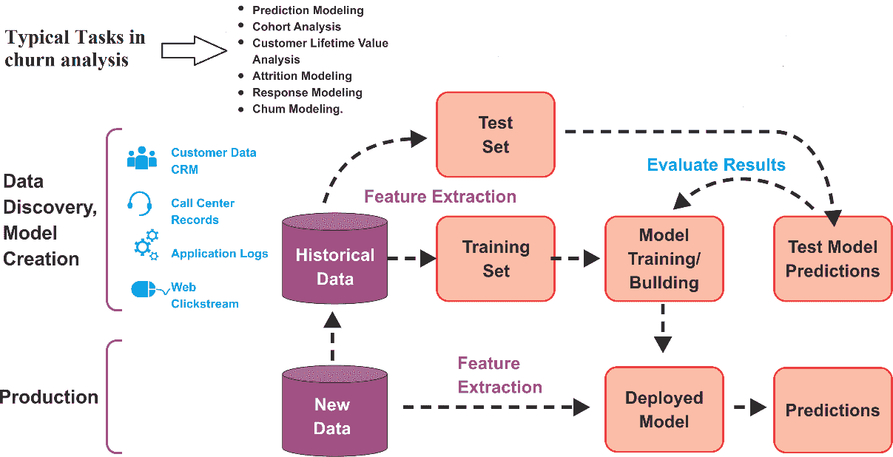

图 4:流失分析管道

通过这种分析，电信公司可以了解如何预测和增强客户体验，从而防止客户流失并定制营销活动。在实践中，这些业务评估通常被用来留住最有可能离开的客户，而不是那些有可能留下来的客户。

因此，我们需要开发一个预测模型，以确保我们的模型对`Churn = True`样本敏感——也就是说，一个二元分类问题。我们将在接下来的章节中看到更多的细节。


# 数据集的描述

**Orange Telecom 的流失数据集**，其中包含经过清理的客户活动数据(特征)，以及一个说明客户是否取消订阅的流失标签，将用于开发我们的预测模型。churn-80 和 churn-20 数据集可分别从以下链接下载:

*   [https://bml-data.s3.amazonaws.com/churn-bigml-80.csv](https://bml-data.s3.amazonaws.com/churn-bigml-80.csv)
*   [https://bml-data.s3.amazonaws.com/churn-bigml-20.csv](https://bml-data.s3.amazonaws.com/churn-bigml-20.csv)

然而，由于开发 ML 模型通常需要更多的数据，因此我们使用较大的数据集(即 churn-80)进行训练和交叉验证，使用较小的数据集(即 churn-20)进行最终测试和模型性能评估。

请注意，后一组仅用于评估模型(用于演示目的)。对于生产就绪环境，电信公司可以使用自己的数据集，并进行必要的预处理和功能工程。数据集具有以下架构:

*   **状态** : `String`
*   **账户长度** : `Integer`
*   **区号** : `Integer`
*   **国际计划** : `String`
*   **语音邮件计划** : `String`
*   **邮件数量** : `Integer`
*   **总日分钟数** : `Double`
*   **全天通话总数** : `Integer`
*   **总日收费** : `Double`
*   **总 eve 分钟数** : `Double`
*   **eve 调用总数** : `Integer`
*   **总 eve 费用** : `Double`
*   **总夜间分钟数** : `Double`
*   **总夜间通话次数** : `Integer`
*   **夜间总费用** : `Double`
*   **总国际分钟数** : `Double`
*   **总国际呼叫数** : `Integer`
*   **总国际费用** : `Double`
*   **客服电话** : `Integer`


# 探索性分析和特征工程

在这一小节中，在开始预处理和特征工程之前，我们将看到数据集的一些 EDA。只有这样，建立分析渠道才有意义。首先，让我们导入必要的包和库，如下所示:

```scala
import org.apache.spark._
import org.apache.spark.sql.functions._
import org.apache.spark.sql.types._
import org.apache.spark.sql._
import org.apache.spark.sql.Dataset
```

然后，让我们为要处理的数据集指定数据源和模式。当将数据加载到 DataFrame 中时，我们可以指定模式。与 Spark 2.x 之前的模式推理相比，该规范提供了优化的性能。

首先，让我们用指定的所有字段创建一个 Scala case 类。变量名是不言自明的:

```scala
case class CustomerAccount(state_code: String, 
    account_length: Integer, 
    area_code: String, 
    international_plan: String, 
    voice_mail_plan: String, 
    num_voice_mail: Double, 
    total_day_mins: Double, 
    total_day_calls: Double, 
    total_day_charge: Double,
    total_evening_mins: Double, 
    total_evening_calls: Double, 
    total_evening_charge: Double,
    total_night_mins: Double, 
    total_night_calls: Double, 
    total_night_charge: Double,
    total_international_mins: Double, 
    total_international_calls: Double, 
    total_international_charge: Double,
    total_international_num_calls: Double, 
    churn: String)
```

现在，让我们创建一个定制模式，其结构类似于我们已经创建的数据源，如下所示:

```scala
val schema = StructType(Array(
    StructField("state_code", StringType, true),
    StructField("account_length", IntegerType, true),
    StructField("area_code", StringType, true),
    StructField("international_plan", StringType, true),
    StructField("voice_mail_plan", StringType, true),
    StructField("num_voice_mail", DoubleType, true),
    StructField("total_day_mins", DoubleType, true),
    StructField("total_day_calls", DoubleType, true),
    StructField("total_day_charge", DoubleType, true),
    StructField("total_evening_mins", DoubleType, true),
    StructField("total_evening_calls", DoubleType, true),
    StructField("total_evening_charge", DoubleType, true),
    StructField("total_night_mins", DoubleType, true),
    StructField("total_night_calls", DoubleType, true),
    StructField("total_night_charge", DoubleType, true),
    StructField("total_international_mins", DoubleType, true),
    StructField("total_international_calls", DoubleType, true),
    StructField("total_international_charge", DoubleType, true),
    StructField("total_international_num_calls", DoubleType, true),
    StructField("churn", StringType, true)
))
```

让我们创建一个 Spark 会话并导入`implicit._`,使我们能够指定一个数据帧操作，如下所示:

```scala
val spark: SparkSession = SparkSessionCreate.createSession("preprocessing")
import spark.implicits._
```

现在让我们创建训练集。我们用 Spark 推荐的格式`com.databricks.spark.csv`读取 CSV 文件。我们不需要任何显式的模式推断，这使得推断模式为假，但是相反，我们需要我们自己的模式，我们刚刚创建了之前。然后，我们从所需的位置加载数据文件，最后，指定我们的数据源，以便我们的数据帧看起来与我们指定的完全相同:

```scala
val trainSet: Dataset[CustomerAccount] = spark.read.
        option("inferSchema", "false")
        .format("com.databricks.spark.csv")
        .schema(schema)
        .load("data/churn-bigml-80.csv")
        .as[CustomerAccount]
```

现在，让我们看看这个模式是什么样子的:

```scala
trainSet.printSchema()
>>>
```


太棒了。看起来和数据结构一模一样。现在让我们使用`show()`方法来看一些样本数据，如下所示:

```scala
trainSet.show()
>>>
```

在下图中，为了便于查看，列名变得更短:


我们还可以从 Spark 中看到使用`describe()`方法的训练集的相关统计数据:

`describe()`方法是 Spark 数据帧的内置统计处理方法。它对所有数字列应用汇总统计计算。最后，它将计算出的值作为单个数据帧返回。

```scala
val statsDF = trainSet.describe()
statsDF.show()
>>>
```


如果这个数据集可以放入 RAM，我们可以使用 Spark 的`cache()`方法缓存它以便快速和重复访问:

```scala
trainSet.cache()
```

让我们看看一些有用的属性，比如与流失的变量相关性。例如，让我们看看客户流失与国际电话总数的关系:

```scala
trainSet.groupBy("churn").sum("total_international_num_calls").show()
>>>
+-----+----------------------------------+
churn|sum(total_international_num_calls)|
+-----+----------------------------------+
|False| 3310.0|
| True| 856.0|
+-----+----------------------------------+
```

让我们看看客户流失与总国际通话费用的关系:

```scala
trainSet.groupBy("churn").sum("total_international_charge").show()
 >>>
+-----+-------------------------------+
|churn|sum(total_international_charge)|
+-----+-------------------------------+
|False| 6236.499999999996|
| True| 1133.63|
+-----+-------------------------------+
```

现在我们还需要准备好测试集来评估模型，让我们准备相同的测试集，类似于训练集，如下所示:

```scala
val testSet: Dataset[CustomerAccount] = 
    spark.read.
    option("inferSchema", "false")
    .format("com.databricks.spark.csv")
    .schema(schema)
    .load("data/churn-bigml-20.csv")
    .as[CustomerAccount]
```

现在让我们缓存它们以便更快地访问，以便进一步操作:

```scala
testSet.cache()
```

现在，让我们看看训练集的一些相关属性，以了解它是否适合我们的目的。首先，让我们为这个会话的持久性创建一个临时视图。我们可以创建一个目录作为接口，用于创建、删除、更改或查询底层数据库、表、函数等等:

```scala
trainSet.createOrReplaceTempView("UserAccount")
spark.catalog.cacheTable("UserAccount")
```

通过客户流失标签对数据进行分组并计算每组中的实例数量表明，虚假客户流失样本大约是真实客户流失样本的六倍。让我们用下面一行代码来验证这个声明:

```scala
trainSet.groupBy("churn").count.show()
>>>
+-----+-----+
|churn|count|
+-----+-----+
|False| 2278|
| True| 388 |
+-----+-----+
```

我们还可以看到前面的陈述，使用 Apache Zeppelin 进行了验证(参见第 8 章、*在银行营销中使用深度信念网络*中关于如何配置和入门的更多详细信息)，如下所示:

```scala
spark.sqlContext.sql("SELECT churn,SUM(international_num_calls) as Total_intl_call FROM UserAccount GROUP BY churn").show()
>>>
```

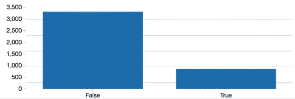

正如我们已经说过的，在大多数情况下，目标是留住最有可能离开的客户，而不是那些有可能留下或正在留下的客户。这也意味着我们应该准备我们的训练集，以确保我们的 ML 模型对真实的流失样本敏感——也就是说，让流失标签为真。

我们还可以观察到前面的训练集非常不平衡。因此，使用分层抽样将两种样本类型放在同一基础上是可行的。当提供了要返回的每种样本类型的部分时，可以使用`sampleBy()`方法。

这里，我们保留了`True` churn 类的所有实例，但是将`False` churn 类向下采样到 *388/2278* 的一部分，大约是`0.1675`:

```scala
val fractions = Map("False" -> 0.1675, "True" -> 1.0)
```

这样，我们也只映射`True`流失样本。现在，让我们为只包含下采样数据的训练集创建一个新的数据帧:

```scala
val churnDF = trainSet.stat.sampleBy("churn", fractions, 12345L)
```

第三个参数是用于再现性目的的种子。现在让我们看看:

```scala
churnDF.groupBy("churn").count.show()
>>>
+-----+-----+
|churn|count|
+-----+-----+
|False| 390|
| True| 388|
+-----+-----+
```

现在让我们看看变量之间的关系。让我们看看白天，晚上，晚上和国际语音通话如何对`churn`类做出贡献。只需执行下面一行:

```scala
spark.sqlContext.sql("SELECT churn, SUM(total_day_charge) as TDC, SUM(total_evening_charge) as TEC,    
                      SUM(total_night_charge) as TNC, SUM(total_international_charge) as TIC,  
                      SUM(total_day_charge) + SUM(total_evening_charge) + SUM(total_night_charge) + 
                      SUM(total_international_charge) as Total_charge FROM UserAccount GROUP BY churn 
                      ORDER BY Total_charge DESC")
.show()
>>>
```


在 Apache Zeppelin 上，可以看到前面的结果如下:

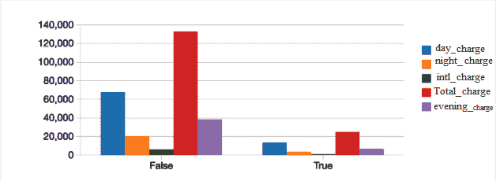

现在，让我们来看看白天、夜晚、晚上和国际语音通话对前面的`churn`类的总费用有多少分钟的贡献。只需执行下面一行:

```scala
spark.sqlContext.sql("SELECT churn, SUM(total_day_mins) 
                      + SUM(total_evening_mins) + SUM(total_night_mins) 
                      + SUM(total_international_mins) as Total_minutes 
                    FROM UserAccount GROUP BY churn").show()
>>>
```


在 Apache Zeppelin 上，可以看到前面的结果如下:

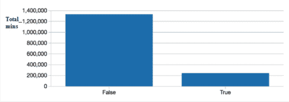

从前面的两个图和表中，很明显，总日分钟数和总日费用是该训练集中高度相关的特征，这对我们的 ML 模型训练没有好处。因此，最好将它们一起移除。此外，下图显示了所有可能的相关性(尽管是用 PySpark 绘制的):

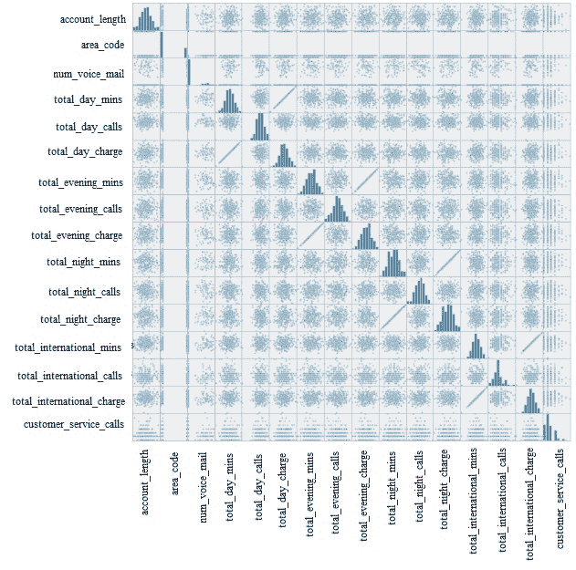

图 5:关联矩阵，包括所有的特性

让我们删除每对相关字段中的一列，以及**州**和**区域代码**列，因为它们也不会被使用:

```scala
val trainDF = churnDF
    .drop("state_code")
    .drop("area_code")
    .drop("voice_mail_plan")
    .drop("total_day_charge")
    .drop("total_evening_charge")
```

非常好。最后，我们有训练数据框架，可用于更好的预测建模。让我们来看看生成的数据帧的一些列:

```scala
trainDF.select("account_length", "international_plan", "num_voice_mail",         
               "total_day_calls","total_international_num_calls", "churn")
.show(10)
>>>
```


然而，我们还没有完成；当前数据框架不能作为估计值提供给模型。正如我们所描述的，Spark ML API 需要将我们的数据转换成 Spark DataFrame 格式，由标签(双精度)和特征(矢量)组成。

现在，我们需要创建一个管道来传递数据，并链接几个转换器和估算器。然后，管道作为特征提取器工作。更具体的说，我们准备了两个`StringIndexer`变压器和一个`VectorAssembler`。

`StringIndexer` encodes a categorical column of labels to a column of label indices (that is, numerical). If the input column is numeric, we have to cast it into a string and index the string values. Other Spark pipeline components, such as Estimator or Transformer, make use of this string-indexed label. In order to do this, the input column of the component must be set to this string-indexed column name. In many cases, you can set the input column with `setInputCol`. Interested readers should refer to this [https://spark.apache.org/docs/latest/ml-features.html](https://spark.apache.org/docs/latest/ml-features.html) for more details.

第一个`StringIndexer`将字符串分类特征`international_plan`和标签转换成数字索引。第二个`StringIndexer`将分类标签(即`churn`)转换成数字。这样，索引分类特征使决策树和随机森林分类器能够适当地处理分类特征，从而提高性能。

现在，将以下代码行、索引标签和元数据添加到标签列。适合整个数据集以包括索引中的所有标签:

```scala
val ipindexer = new StringIndexer()
    .setInputCol("international_plan")
    .setOutputCol("iplanIndex")

val labelindexer = new StringIndexer()
    .setInputCol("churn")
    .setOutputCol("label")
```

现在我们需要提取对分类有贡献的最重要的特征。由于我们已经删除了一些列，因此得到的列集由以下字段组成:

```scala
* Label → churn: True or False
* Features → {("account_length", "iplanIndex", "num_voice_mail", "total_day_mins", "total_day_calls", "total_evening_mins", "total_evening_calls", "total_night_mins", "total_night_calls", "total_international_mins", "total_international_calls", "total_international_num_calls"}
```

由于我们已经使用`StringIndexer`将分类标签转换成数字，下一个任务是提取特征:

```scala
val featureCols = Array("account_length", "iplanIndex", 
                        "num_voice_mail", "total_day_mins", 
                        "total_day_calls", "total_evening_mins", 
                        "total_evening_calls", "total_night_mins", 
                        "total_night_calls", "total_international_mins", 
                        "total_international_calls", "total_international_num_calls")
```

现在，让我们将特征转换成特征向量，特征向量是代表每个特征的值的数字向量。在我们的例子中，我们将使用`VectorAssembler`。它将所有的`featureCols`合并/转换成一个名为**特性**的列:

```scala
val assembler = new VectorAssembler()
    .setInputCols(featureCols)
    .setOutputCol("features")
```

既然我们已经准备好了由标签和特征向量组成的真实训练集，下一个任务就是创建一个估计器——流水线的第三个元素。我们从一个非常简单但是强大的逻辑回归分类器开始。


# LR 用于流失预测

LR 是预测二元响应的最广泛使用的分类器之一。这是一种线性 ML 方法，如[第一章](4b0be2d2-f313-471f-83fe-830931fc8af9.xhtml)、*分析保险严重索赔*所述。`loss`函数是由物流损失给出的公式:


对于 LR 模型，`loss`函数是逻辑损耗。对于二进制分类问题，该算法输出二进制 LR 模型，使得对于由 *x* 表示的给定新数据点，该模型通过应用逻辑函数进行预测:


在上式中， *z = W ^T X* 如果*f(W^TX)>0.5*，则结果为正；否则为负。

注意，LR 模型的原始输出 *f(z)* 具有概率解释。

请注意，与线性回归相比，逻辑回归提供了更高的分类精度。此外，这是一种灵活的方式来调整模型以进行自定义调整，总体而言，模型响应是概率的度量。

最重要的是，尽管线性回归只能预测连续值，但线性回归仍然可以进行足够的推广，使其能够预测离散值:

```scala
import org.apache.spark._
import org.apache.spark.sql.SparkSession
import org.apache.spark.sql.functions._
import org.apache.spark.ml.classification.{BinaryLogisticRegressionSummary, LogisticRegression, LogisticRegressionModel}
import org.apache.spark.ml.Pipeline
import org.apache.spark.ml.tuning.{ParamGridBuilder, CrossValidator}
import org.apache.spark.mllib.evaluation.BinaryClassificationMetrics 
import org.apache.spark.ml.evaluation.BinaryClassificationEvaluator
```

现在我们已经知道了线性回归的工作原理，让我们开始使用线性回归的基于 Spark 的实现。让我们从导入所需的包和库开始。

现在，让我们创建一个 Spark 会话并隐式导入:

```scala
val spark: SparkSession = SparkSessionCreate.createSession("ChurnPredictionLogisticRegression")
import spark.implicits._
```

我们现在需要定义一些超参数来训练基于线性回归的管道:

```scala
val numFolds = 10
val MaxIter: Seq[Int] = Seq(100)
val RegParam: Seq[Double] = Seq(1.0) // L2 regularization param, set 1.0 with L1 regularization
val Tol: Seq[Double] = Seq(1e-8)// for convergence tolerance for iterative algorithms
val ElasticNetParam: Seq[Double] = Seq(0.0001) //Combination of L1 & L2
```

`RegParam`是一个标量，有助于调整约束的强度:一个小值意味着一个软余量，因此自然地，一个大值意味着一个硬余量，无穷大是最硬的余量。

默认情况下，LR 使用设定为 1.0 的正则化参数执行 L2 正则化。相同的模型执行 LR 的 L1 正则化变体，其中正则化参数(即，`RegParam`)被设置为 0.10。弹性网是 L1 和 L2 正则化的结合。

另一方面，`Tol`参数用于迭代算法的收敛容差，如逻辑回归或线性 SVM。现在，一旦我们定义并初始化了超参数，下一个任务就是实例化一个线性回归估计量，如下所示:

```scala
val lr = new LogisticRegression()
    .setLabelCol("label")
    .setFeaturesCol("features")
```

现在，我们已经准备好了三个变压器和一个估算器，下一个任务是连接一个流水线，也就是说，它们每个都充当一个阶段:

```scala
val pipeline = new Pipeline()
    .setStages(Array(PipelineConstruction.ipindexer,
    PipelineConstruction.labelindexer,
    PipelineConstruction.assembler, lr))
```

为了在超参数空间上执行这样的网格搜索，我们需要首先定义它。在这里，Scala 的函数式编程属性非常方便，因为我们只需将函数指针和相应的待评估参数添加到参数网格，您可以在其中设置待测试的参数和交叉验证评估器，以构建模型选择工作流。这将通过线性回归的最大迭代、正则化参数、容差和弹性网络来搜索最佳模型:

```scala
val paramGrid = new ParamGridBuilder()
    .addGrid(lr.maxIter, MaxIter)
    .addGrid(lr.regParam, RegParam)
    .addGrid(lr.tol, Tol)
    .addGrid(lr.elasticNetParam, ElasticNetParam)
    .build()
```

注意，超参数形成一个 n 维空间，其中 *n* 是超参数的数量。这个空间中的每个点都是一个特定的超参数配置，这是一个超参数向量。当然，我们不能探索这个空间中的每个点，所以我们基本上做的是在那个空间中的子集(希望是均匀分布的)上进行网格搜索。

然后我们需要定义一个`BinaryClassificationEvaluator`赋值器，因为这是一个二元分类问题。使用此评估器，将通过比较测试标签列和测试预测列，根据精度度量来评估模型。默认指标是精确召回曲线下的面积和**接收器工作特性** ( **ROC** )曲线下的面积:

```scala
val evaluator = new BinaryClassificationEvaluator()
    .setLabelCol("label")
    .setRawPredictionCol("prediction")
```

我们使用一个`CrossValidator`来选择最佳模型。`CrossValidator`使用评估管道、参数网格和分类评估器。`CrossValidator`使用`ParamGridBuilder`迭代线性回归的最大迭代、回归参数、容差和弹性净参数，然后评估模型，每个参数值重复 10 次以获得可靠的结果，即 10 重交叉验证:

```scala
val crossval = new CrossValidator()
    .setEstimator(pipeline)
    .setEvaluator(evaluator)
    .setEstimatorParamMaps(paramGrid)
    .setNumFolds(numFolds)
```

前面的代码旨在执行交叉验证。验证器本身使用`BinaryClassificationEvaluator`估计器来评估每一个折叠上的渐进网格空间中的训练，并确保没有过度拟合。

尽管幕后有如此多的事情在进行，我们的`CrossValidator`对象的接口仍然保持苗条和众所周知，因为`CrossValidator`也从 Estimator 扩展并支持 fit 方法。这意味着，在调用 fit 之后，包括所有特征预处理和 LR 分类器在内的完整预定义管道将被多次执行，每次都使用不同的超参数向量:

```scala
val cvModel = crossval.fit(Preprocessing.trainDF)
```

现在是时候评估我们使用测试数据集创建的 LR 模型的预测能力了，到目前为止，该数据集尚未用于任何训练或交叉验证，即模型的未知数据。作为第一步，我们需要将测试集转换为模型管道，这将根据我们在前面的特性工程步骤中描述的相同机制来映射特性:

```scala
val predictions = cvModel.transform(Preprocessing.testSet)
al result = predictions.select("label", "prediction", "probability")
val resutDF = result.withColumnRenamed("prediction", "Predicted_label")
resutDF.show(10)
>>>
```


预测概率在根据客户不完美的可能性对客户进行排序时也非常有用。这样，有限数量的资源可以在电信业务中用于预扣，但可以集中于最有价值的客户。

但是看到之前的预测数据帧，真的很难猜测分类精度。第二步，评估员使用`BinaryClassificationEvaluator`进行自我评估，如下所示:

```scala
val accuracy = evaluator.evaluate(predictions)
println("Classification accuracy: " + accuracy)
>>>
Classification accuracy: 0.7670592565329408
```

因此，我们从二元分类模型中获得了大约 77%的分类精度。现在使用二进制分类器的准确性没有足够的意义。

因此，研究人员经常推荐其他性能指标，如精确召回曲线下面积和 ROC 曲线下面积。但是，为此我们需要构建一个包含测试集原始分数的 RDD:

```scala
val predictionAndLabels = predictions
    .select("prediction", "label")
    .rdd.map(x => (x(0).asInstanceOf[Double], x(1)
    .asInstanceOf[Double]))
```

现在，前面的 RDD 可用于计算前面提到的两个性能指标:

```scala
val metrics = new BinaryClassificationMetrics(predictionAndLabels)
println("Area under the precision-recall curve: " + metrics.areaUnderPR)
println("Area under the receiver operating characteristic (ROC) curve : " + metrics.areaUnderROC)
>>>
Area under the precision-recall curve: 0.5761887477313975
Area under the receiver operating characteristic (ROC) curve: 0.7670592565329408
```

在这种情况下，评估返回 77%的准确性，但只有 58%的精度。在下面，我们计算一些更多的度量；例如，假的和真的正的和负的预测对于评估模型的性能也是有用的:

*   **真阳性**:模型正确预测取消订阅的频率
*   **假阳性**:模型错误预测取消订阅的频率
*   **真否定**:模型正确预测完全不取消的频率
*   **假阴性**:模型错误预测不取消的频率

```scala
val lp = predictions.select("label", "prediction")
val counttotal = predictions.count()
val correct = lp.filter($"label" === $"prediction").count()

val wrong = lp.filter(not($"label" === $"prediction")).count()
val ratioWrong = wrong.toDouble / counttotal.toDouble
val ratioCorrect = correct.toDouble / counttotal.toDouble

val truep = lp.filter($"prediction" === 0.0).filter($"label" ===
$"prediction").count() / counttotal.toDouble

val truen = lp.filter($"prediction" === 1.0).filter($"label" ===
$"prediction").count() / counttotal.toDouble

val falsep = lp.filter($"prediction" === 1.0).filter(not($"label" ===
$"prediction")).count() / counttotal.toDouble

val falsen = lp.filter($"prediction" === 0.0).filter(not($"label" ===
$"prediction")).count() / counttotal.toDouble

println("Total Count : " + counttotal)
println("Correct : " + correct)
println("Wrong: " + wrong)
println("Ratio wrong: " + ratioWrong)
println("Ratio correct: " + ratioCorrect)
println("Ratio true positive : " + truep)
println("Ratio false positive : " + falsep)
println("Ratio true negative : " + truen)
println("Ratio false negative : " + falsen)
>>>
```

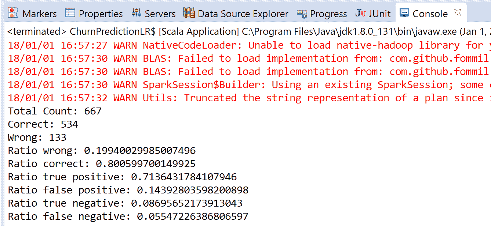

然而，我们还没有得到很好的准确性，所以让我们继续尝试其他分类器，如 SMV。这一次，我们将使用 Apache Spark ML 包中的线性 SVM 实现。


# 用于流失预测的 SVM

SVM 也广泛用于大规模分类(即二元和多项)任务。此外，它也是一种线性 ML 方法，如第一章、*分析保险严重索赔*所述。线性 SVM 算法输出 SVM 模型，其中 SVM 使用的损失函数可以使用铰链损失定义如下:

*L(**w**;**x**,y):=max{0,1−y**w**^T**x**}*

默认情况下，Spark 中的线性 SVM 使用 L2 正则化进行训练。但是，它也支持 L1 正则化，通过 L1 正则化，问题本身变成了线性规划。

现在，假设我们有一组新的数据点*x*；模型根据***w**^T**x***的值进行预测。默认情况下，如果***w****^T****x**≥0*，则结果为正，否则为负。

现在我们已经知道了 SVMs 的工作原理，让我们开始使用 SVM 的基于 Spark 的实现。让我们从导入所需的包和库开始:

```scala
import org.apache.spark._
import org.apache.spark.sql.SparkSession
import org.apache.spark.sql.functions._
import org.apache.spark.ml.classification.{LinearSVC, LinearSVCModel}
import org.apache.spark.sql.SparkSession
import org.apache.spark.sql.functions.max
import org.apache.spark.ml.Pipeline
import org.apache.spark.ml.tuning.{ParamGridBuilder, CrossValidator}
import org.apache.spark.mllib.evaluation.BinaryClassificationMetrics
import org.apache.spark.ml.evaluation.BinaryClassificationEvaluator
```

现在让我们创建一个 Spark 会话并导入隐式:

```scala
val spark: SparkSession = SparkSessionCreate.createSession("ChurnPredictionLogisticRegression")
import spark.implicits._
```

我们现在需要定义一些超参数来训练基于 LR 的管道:

```scala
val numFolds = 10
val MaxIter: Seq[Int] = Seq(100)
val RegParam: Seq[Double] = Seq(1.0) // L2 regularization param, set 0.10 with L1 reguarization
val Tol: Seq[Double] = Seq(1e-8)
val ElasticNetParam: Seq[Double] = Seq(1.0) // Combination of L1 and L2
```

现在，一旦我们定义并初始化了超参数，下一个任务就是实例化 LR 估计器，如下所示:

```scala
val svm = new LinearSVC()
```

现在，我们已经准备好了三个变压器和一个估算器，下一个任务是连接一个流水线，也就是说，它们每个都充当一个阶段:

```scala
val pipeline = new Pipeline()
     .setStages(Array(PipelineConstruction.ipindexer,
                      PipelineConstruction.labelindexer,
                      PipelineConstruction.assembler,svm)
                      )
```

让我们定义`paramGrid`在超参数空间上执行这样的网格搜索。这将通过 SVM 的最大迭代、正则化参数、容差和弹性网络搜索最佳模型:

```scala
val paramGrid = new ParamGridBuilder()
    .addGrid(svm.maxIter, MaxIter)
    .addGrid(svm.regParam, RegParam)
    .addGrid(svm.tol, Tol)
    .addGrid(svm.elasticNetParam, ElasticNetParam)
    .build()
```

让我们定义一个`BinaryClassificationEvaluator`评估器来评估模型:

```scala
val evaluator = new BinaryClassificationEvaluator()
    .setLabelCol("label")
    .setRawPredictionCol("prediction")
```

我们使用`CrossValidator`对最佳模型选择进行 10 重交叉验证:

```scala
val crossval = new CrossValidator()
    .setEstimator(pipeline)
    .setEvaluator(evaluator)
    .setEstimatorParamMaps(paramGrid)
    .setNumFolds(numFolds)
```

现在让我们调用`fit`方法，以便包括所有特征预处理和 LR 分类器的完整预定义管道被多次执行——每次使用不同的超参数向量:

```scala
val cvModel = crossval.fit(Preprocessing.trainDF)
```

现在是时候在测试数据集上评估 SVM 模型的预测能力了。作为第一步，我们需要用模型管道来转换测试集，这将根据我们在前面的特性工程步骤中描述的相同机制来映射特性:

```scala
val predictions = cvModel.transform(Preprocessing.testSet)
prediction.show(10)
>>>
```

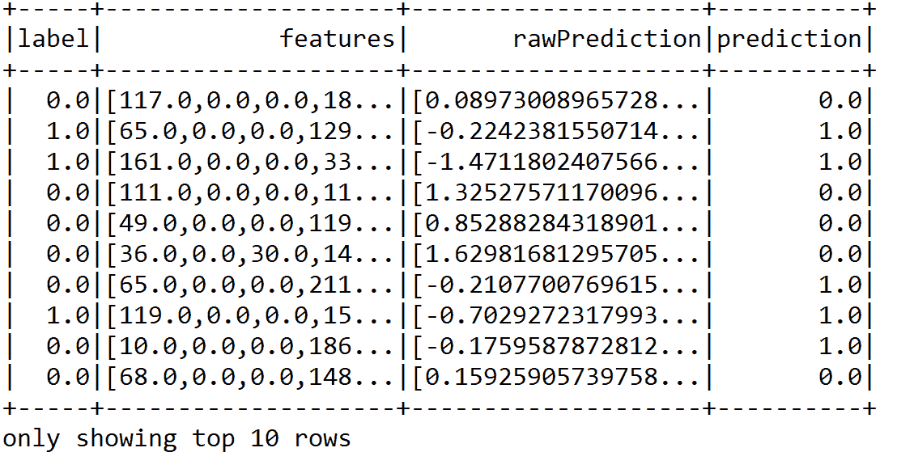

但是看到之前的预测数据帧，真的很难猜测分类精度。第二步，评估员使用`BinaryClassificationEvaluator`进行自我评估，如下所示:

```scala
val accuracy = evaluator.evaluate(predictions)
println("Classification accuracy: " + accuracy)
>>>
Classification accuracy: 0.7530180345969819
```

因此，我们从二元分类模型中获得了大约 75%的分类精度。现在，使用二进制分类器的准确性没有足够的意义。

因此，研究人员经常推荐其他性能指标，如精确召回曲线下面积和 ROC 曲线下面积。但是，为此我们需要构建一个包含测试集原始分数的 RDD:

```scala
val predictionAndLabels = predictions
    .select("prediction", "label")
    .rdd.map(x => (x(0).asInstanceOf[Double], x(1)
    .asInstanceOf[Double]))
```

现在，前面的 RDD 可用于计算前面提到的两个性能指标:

```scala
val metrics = new BinaryClassificationMetrics(predictionAndLabels)
println("Area under the precision-recall curve: " + metrics.areaUnderPR)
println("Area under the receiver operating characteristic (ROC) curve : " + metrics.areaUnderROC)
>>>
Area under the precision-recall curve: 0.5595712265324828
Area under the receiver operating characteristic (ROC) curve: 0.7530180345969819
```

在这种情况下，评估返回 75%的准确性，但只有 55%的精度。在下文中，我们再次计算一些更多的度量；例如，假的和真的正的和负的预测对于评估模型的性能也是有用的:

```scala
val lp = predictions.select("label", "prediction")
val counttotal = predictions.count()

val correct = lp.filter($"label" === $"prediction").count()

val wrong = lp.filter(not($"label" === $"prediction")).count()
val ratioWrong = wrong.toDouble / counttotal.toDouble

val ratioCorrect = correct.toDouble / counttotal.toDouble

val truep = lp.filter($"prediction" === 0.0).filter($"label" ===
$"prediction").count() / counttotal.toDouble

val truen = lp.filter($"prediction" === 1.0).filter($"label" ===
$"prediction").count() / counttotal.toDouble

val falsep = lp.filter($"prediction" === 1.0).filter(not($"label" ===
$"prediction")).count() / counttotal.toDouble

val falsen = lp.filter($"prediction" === 0.0).filter(not($"label" ===
$"prediction")).count() / counttotal.toDouble

println("Total Count : " + counttotal)
println("Correct : " + correct)
println("Wrong: " + wrong)
println("Ratio wrong: " + ratioWrong)
println("Ratio correct: " + ratioCorrect)
println("Ratio true positive : " + truep)
println("Ratio false positive : " + falsep)
println("Ratio true negative : " + truen)
println("Ratio false negative : " + falsen)
>>>
```


然而，我们还没有收到使用 SVM 良好的准确性。此外，没有选项来选择最合适的特征，这将帮助我们用最合适的特征来训练我们的模型。这一次，我们将再次使用一个更健壮的分类器，比如 Apache Spark ML 包中的**决策树** ( **DTs** )实现。


# 用于客户流失预测的 DTs

DTs 通常被认为是一种用于解决分类和回归任务的监督学习技术。

更专业地说，根据统计概率，DT 中的每个分支代表一个可能的决策、事件或反应。与朴素贝叶斯相比，DTs 是一种更健壮的分类技术。原因是，首先，DT 将特征分成训练集和测试集。然后，它产生一个很好的概括来推断预测的标签或类。最有趣的是，DT 算法可以处理二进制和多类分类问题。

例如，在下面的示例图中，DTs 从准入数据中学习使用一组 **if 来近似正弦曲线...else** 决策规则。数据集包含每个申请入学的学生的记录，比如说，申请美国大学的学生。每个记录包含研究生记录考试分数、CGPA 分数和列的排名。现在我们将不得不根据这三个特征(变量)来预测谁是有能力的。在训练 DT 模型和修剪树的不需要的分支之后，可以使用 DTs 来解决这种问题。通常，更深的树表示更复杂的决策规则和更适合的模型:


图 6:大学录取数据的决策树

因此，树越深，决策规则越复杂，模型越适合。现在让我们来看看 DTs 的一些优点和缺点:

|  | **优点** | **缺点** | **更擅长** |
| **决策树** | -易于实施、培训和解释-树木可以被可视化-几乎不需要数据准备-更少的建模和预测时间-可以处理数值和分类数据-使用统计测试验证模型的可能性-对噪声和缺失值具有鲁棒性-高精度 | -对于大而复杂的树，解释很困难-相同的子树中可能会出现重复-对角线决策边界可能存在的问题-决策树学习者可以创建过于复杂的树，不能很好地概括数据-有时，由于数据中的微小变化，DTs 可能会不稳定-学习 DT 本身是一个 NP 完全问题-如果某些类占主导地位，DT 学习者会创建有偏见的树 | -以高度精确的分类为目标-医疗诊断和预后-信用风险分析 |

现在，我们已经知道了 DTs 的工作原理，让我们开始使用基于 Spark 的 DTs 实现。让我们从导入所需的包和库开始:

```scala
import org.apache.spark._
import org.apache.spark.sql.SparkSession
import org.apache.spark.sql.functions._
import org.apache.spark.sql.types._
import org.apache.spark.sql._
import org.apache.spark.ml.Pipeline
import org.apache.spark.ml.classification.{DecisionTreeClassifier, DecisionTreeClassificationModel}
import org.apache.spark.mllib.evaluation.BinaryClassificationMetrics
import org.apache.spark.ml.evaluation.BinaryClassificationEvaluator
import org.apache.spark.ml.tuning.{ParamGridBuilder, CrossValidator}
```

现在让我们创建一个 Spark 会话并导入隐式:

```scala
val spark: SparkSession = SparkSessionCreate.createSession("ChurnPredictionDecisionTrees")
import spark.implicits._
```

现在，一旦我们定义并初始化了超参数，下一个任务就是实例化一个`DecisionTreeClassifier`估计器，如下所示:

```scala
val dTree = new DecisionTreeClassifier()
                .setLabelCol("label")
                .setFeaturesCol("features")
                .setSeed(1234567L)
```

现在，我们已经准备好了三个变压器和一个估算器，下一个任务是连接一个流水线，也就是说，它们每个都充当一个阶段:

```scala
val pipeline = new Pipeline()
                .setStages(Array(PipelineConstruction.ipindexer,
                PipelineConstruction.labelindexer,
                PipelineConstruction.assembler,dTree))
```

让我们定义 paramgrid 来在超参数空间上执行这样的网格搜索。该搜索通过 DT 的杂质、最大箱数和最大深度来寻找最佳模型。树的最大深度:深度 0 表示 1 个叶节点；深度 1 表示 1 个内部节点+ 2 个叶节点。

另一方面，最大箱数用于分离连续要素和选择如何在每个结点上分割要素。箱越多，粒度越高。简而言之，我们通过决策树的`maxDepth`和`maxBins`参数来搜索最佳模型:

```scala
var paramGrid = new ParamGridBuilder()
    .addGrid(dTree.impurity, "gini" :: "entropy" :: Nil)
    .addGrid(dTree.maxBins, 2 :: 5 :: 10 :: 15 :: 20 :: 25 :: 30 :: Nil)
    .addGrid(dTree.maxDepth, 5 :: 10 :: 15 :: 20 :: 25 :: 30 :: 30 :: Nil)
    .build()
```

在前面的代码段中，我们通过序列格式创建了一个渐进式 paramgrid。这意味着我们正在用不同的超参数组合创建网格空间。这将帮助我们提供包含最佳超参数的最佳模型。

让我们定义一个`BinaryClassificationEvaluator`评估器来评估模型:

```scala
val evaluator = new BinaryClassificationEvaluator()
    .setLabelCol("label")
    .setRawPredictionCol("prediction")
```

我们使用`CrossValidator`对最佳模型选择进行 10 重交叉验证:

```scala
val crossval = new CrossValidator()
    .setEstimator(pipeline)
    .setEvaluator(evaluator)
    .setEstimatorParamMaps(paramGrid)
    .setNumFolds(numFolds)
```

现在让我们调用`fit`方法，这样完整的预定义管道，包括所有的特征预处理和 DT 分类器，被执行多次——每次使用不同的超参数向量:

```scala
val cvModel = crossval.fit(Preprocessing.trainDF)
```

现在是时候评估 DT 模型在测试数据集上的预测能力了。作为第一步，我们需要用模型管道来转换测试集，这将根据我们在前面的特性工程步骤中描述的相同机制来映射特性:

```scala
val predictions = cvModel.transform(Preprocessing.testSet)
prediction.show(10)
>>>
```

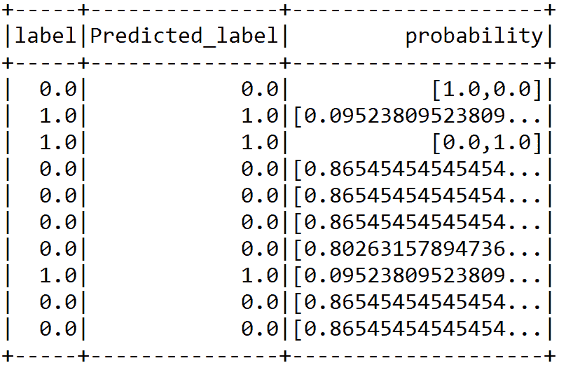

然而，看到前面的预测数据帧，真的很难猜测分类的准确性。第二步，在评估中使用`BinaryClassificationEvaluator`进行评估本身，如下:

```scala
val accuracy = evaluator.evaluate(predictions)
println("Classification accuracy: " + accuracy)
>>>
Accuracy: 0.870334928229665
```

因此，我们从二元分类模型中获得了大约 87%的分类精度。现在，类似于 SVM 和 LR，我们将基于包含测试集原始分数的以下 RDD 来观察精确回忆曲线下的面积和 ROC 曲线下的面积:

```scala
val predictionAndLabels = predictions
    .select("prediction", "label")
    .rdd.map(x => (x(0).asInstanceOf[Double], x(1)
    .asInstanceOf[Double]))
```

现在，前面的 RDD 可用于计算前面提到的两个性能指标:

```scala
val metrics = new BinaryClassificationMetrics(predictionAndLabels)
println("Area under the precision-recall curve: " + metrics.areaUnderPR)
println("Area under the receiver operating characteristic (ROC) curve : " + metrics.areaUnderROC)
>>>
Area under the precision-recall curve: 0.7293101942399631
Area under the receiver operating characteristic (ROC) curve: 0.870334928229665
```

在这种情况下，评估返回 87%的准确度，但只有 73%的精确度，这比 SVM 和 LR 的结果好得多。在下文中，我们再次计算一些更多的度量；例如，假的和真的正的和负的预测对于评估模型的性能也是有用的:

```scala
val lp = predictions.select("label", "prediction")
val counttotal = predictions.count()

val correct = lp.filter($"label" === $"prediction").count()

val wrong = lp.filter(not($"label" === $"prediction")).count()

val ratioWrong = wrong.toDouble / counttotal.toDouble

val ratioCorrect = correct.toDouble / counttotal.toDouble

val truep = lp.filter($"prediction" === 0.0).filter($"label" ===
$"prediction").count() / counttotal.toDouble

val truen = lp.filter($"prediction" === 1.0).filter($"label" ===
$"prediction").count() / counttotal.toDouble

val falsep = lp.filter($"prediction" === 1.0).filter(not($"label" ===
$"prediction")).count() / counttotal.toDouble

val falsen = lp.filter($"prediction" === 0.0).filter(not($"label" ===
$"prediction")).count() / counttotal.toDouble

println("Total Count : " + counttotal)
println("Correct : " + correct)
println("Wrong: " + wrong)
println("Ratio wrong: " + ratioWrong)
println("Ratio correct: " + ratioCorrect)
println("Ratio true positive : " + truep)
println("Ratio false positive : " + falsep)
println("Ratio true negative : " + truen)
println("Ratio false negative : " + falsen)
>>>
```

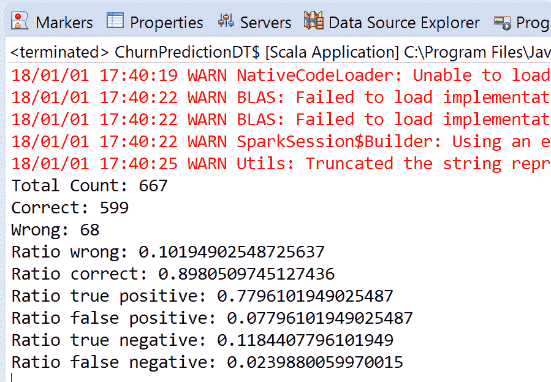

奇幻；我们达到了 87%的准确率，但是什么因素呢？嗯，可以调试得到分类时构造的决策树。但首先，让我们看看在交叉验证后，我们在哪个级别获得了最佳模型:

```scala
val bestModel = cvModel.bestModel
println("The Best Model and Parameters:n--------------------")
println(bestModel.asInstanceOf[org.apache.spark.ml.PipelineModel].stages(3))
>>>
```

最佳模型和参数:

```scala
DecisionTreeClassificationModel (uid=dtc_1fb45416b18b) of depth 5 with 53 nodes.
```

这意味着我们在深度 5 处获得了具有 53 个节点的最佳树模型。现在，让我们通过显示树来提取在树构建期间采取的那些步骤(即决策)。该树帮助我们找到数据集中最有价值的特征:

```scala
bestModel.asInstanceOf[org.apache.spark.ml.PipelineModel]
    .stages(3)
    .extractParamMap

val treeModel = bestModel.asInstanceOf[org.apache.spark.ml.PipelineModel]
    .stages(3)
    .asInstanceOf[DecisionTreeClassificationModel]
println("Learned classification tree model:n" + treeModel.toDebugString)
>>>
```

学习分类树模型:

```scala
If (feature 3 <= 245.2)
    If (feature 11 <= 3.0)
        If (feature 1 in {1.0})
            If (feature 10 <= 2.0)
                Predict: 1.0
            Else (feature 10 > 2.0)
            If (feature 9 <= 12.9)
                Predict: 0.0
            Else (feature 9 > 12.9)
                Predict: 1.0
        ...
    Else (feature 7 > 198.0)
        If (feature 2 <= 28.0)
            Predict: 1.0
        Else (feature 2 > 28.0)
            If (feature 0 <= 60.0)
                Predict: 0.0
            Else (feature 0 > 60.0)
                Predict: 1.0
```

在前面的输出中，`toDebugString()`函数打印出树的决策节点，最后的预测出现在最后的叶子上。还可以清楚地看到，特征 11 和 3 用于决策；这是客户可能流失的两个最重要的原因。但是那两个特征是什么呢？让我们看看他们:

```scala
println("Feature 11:" + Preprocessing.trainDF.filter(PipelineConstruction.featureCols(11)))
println("Feature 3:" + Preprocessing.trainDF.filter(PipelineConstruction.featureCols(3)))
>>>
Feature 11: [total_international_num_calls: double]
Feature 3: [total_day_mins: double]
```

因此，客户服务呼叫和全天分钟数是由决策树选择的，因为它提供了一种自动机制来确定最重要的特征。

等等！我们还没有完成。最后但同样重要的是，我们将使用一种集成技术，RF，它被认为是比 DTs 更健壮的分类器。同样，让我们使用 Apache Spark ML 包中的随机森林实现。


# 用于流失预测的随机森林

正如在[第一章](4b0be2d2-f313-471f-83fe-830931fc8af9.xhtml)、*分析保险严重程度索赔*中所描述的，随机森林是一种集成技术，它采用一个观察子集和一个变量子集来构建决策树——也就是一个 DTs 集成。从技术上来说，它建立了几个决策树，并将它们整合在一起，以获得更准确和稳定的预测。

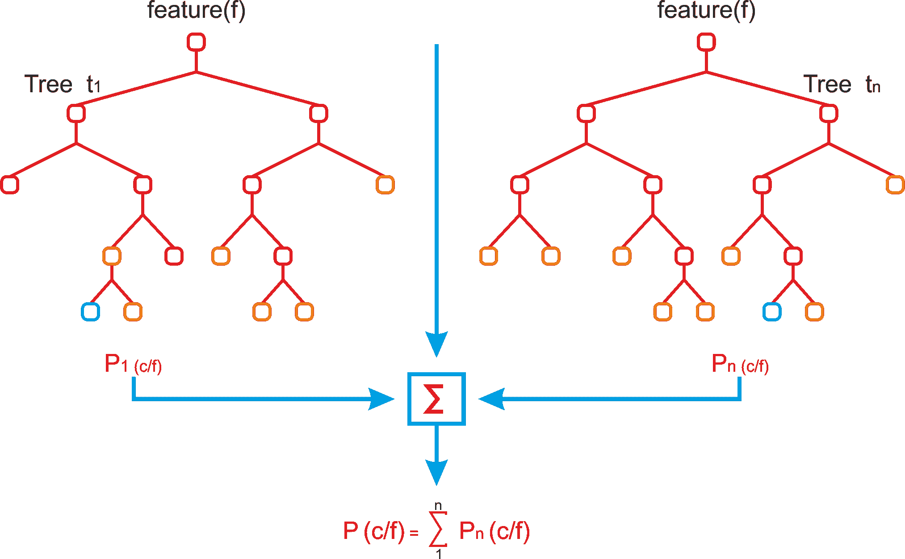

图 7:随机森林及其组装技术解释

这是一个直接的结果，因为通过独立陪审团的最多投票，我们得到的最终预测比最好的陪审团更好(见上图)。现在我们已经知道了 RF 的工作原理，让我们开始使用基于 Spark 的 RF 实现。让我们从导入所需的包和库开始:

```scala
import org.apache.spark._
import org.apache.spark.sql.SparkSession
import org.apache.spark.sql.functions._
import org.apache.spark.sql.types._
import org.apache.spark.sql._
import org.apache.spark.ml.Pipeline
import org.apache.spark.ml.classification.{RandomForestClassifier, RandomForestClassificationModel}
import org.apache.spark.mllib.evaluation.BinaryClassificationMetrics
import org.apache.spark.ml.evaluation.BinaryClassificationEvaluator
import org.apache.spark.ml.tuning.{ParamGridBuilder, CrossValidator}
```

现在让我们创建 Spark 会话并隐式导入:

```scala
val spark: SparkSession = SparkSessionCreate.createSession("ChurnPredictionRandomForest")
import spark.implicits._
```

现在，一旦我们定义并初始化了超参数，下一个任务就是实例化一个`DecisionTreeClassifier`估计器，如下所示:

```scala
val rf = new RandomForestClassifier()
    .setLabelCol("label")
    .setFeaturesCol("features")
    .setSeed(1234567L)// for reproducibility
```

现在，我们已经准备好了三个变压器和一个估算器，下一个任务是连接一个流水线，也就是说，它们每个都充当一个阶段:

```scala
val pipeline = new Pipeline()
    .setStages(Array(PipelineConstruction.ipindexer,
    PipelineConstruction.labelindexer,
    PipelineConstruction.assembler,rf))
```

让我们定义 paramgrid 来在超参数空间上执行这样的网格搜索:

```scala
val paramGrid = new ParamGridBuilder()
    .addGrid(rf.maxDepth, 3 :: 5 :: 15 :: 20 :: 50 :: Nil)
    .addGrid(rf.featureSubsetStrategy, "auto" :: "all" :: Nil)
    .addGrid(rf.impurity, "gini" :: "entropy" :: Nil)
    .addGrid(rf.maxBins, 2 :: 5 :: 10 :: Nil)
    .addGrid(rf.numTrees, 10 :: 50 :: 100 :: Nil)
    .build()
```

让我们定义一个`BinaryClassificationEvaluator`评估器来评估模型:

```scala
val evaluator = new BinaryClassificationEvaluator()
    .setLabelCol("label")
    .setRawPredictionCol("prediction")
```

我们使用`CrossValidator`对最佳模型选择进行 10 重交叉验证:

```scala
val crossval = new CrossValidator()
    .setEstimator(pipeline)
    .setEvaluator(evaluator)
    .setEstimatorParamMaps(paramGrid)
    .setNumFolds(numFolds)
```

现在，让我们调用`fit`方法，以便多次执行完整的预定义管道，包括所有特征预处理和 DT 分类器——每次使用不同的超参数向量:

```scala
val cvModel = crossval.fit(Preprocessing.trainDF)
```

现在是时候评估 DT 模型在测试数据集上的预测能力了。作为第一步，我们需要将测试集转换为模型管道，这将根据我们在前面的特性工程步骤中描述的相同机制来映射特性:

```scala
val predictions = cvModel.transform(Preprocessing.testSet)
prediction.show(10)
>>>
```

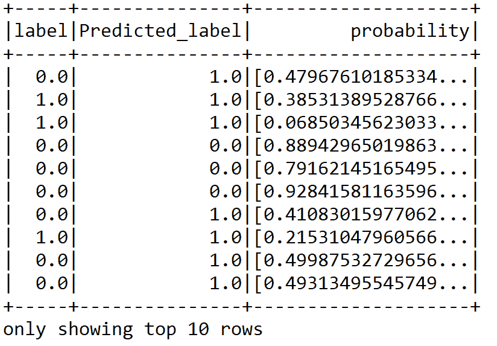

然而，看到前面的预测数据帧，真的很难猜测分类的准确性。第二步，在评估中使用`BinaryClassificationEvaluator`对自身进行评估，如下:

```scala
val accuracy = evaluator.evaluate(predictions)
println("Classification accuracy: " + accuracy)
>>>
Accuracy: 0.870334928229665
```

因此，我们从二元分类模型中获得了大约 87%的分类精度。现在，类似于 SVM 和 LR，我们将基于包含测试集原始分数的以下 RDD 来观察精确回忆曲线下的面积和 ROC 曲线下的面积:

```scala
val predictionAndLabels = predictions
    .select("prediction", "label")
    .rdd.map(x => (x(0).asInstanceOf[Double], x(1)
    .asInstanceOf[Double]))
```

现在，前面的 RDD 可用于计算前面提到的两个性能指标:

```scala
val metrics = new BinaryClassificationMetrics(predictionAndLabels)

println("Area under the precision-recall curve: " + metrics.areaUnderPR)
println("Area under the receiver operating characteristic (ROC) curve : " + metrics.areaUnderROC)
>>>
Area under the precision-recall curve: 0.7293101942399631
Area under the receiver operating characteristic (ROC) curve: 0.870334928229665
```

在这种情况下，评估返回 87%的准确度，但只有 73%的精确度，这比 SVM 和 LR 的结果好得多。在下文中，我们再次计算一些更多的度量；例如，假的和真的正的和负的预测对于评估模型的性能也是有用的:

```scala
val lp = predictions.select("label", "prediction")
val counttotal = predictions.count()

val correct = lp.filter($"label" === $"prediction").count()

val wrong = lp.filter(not($"label" === $"prediction")).count()

val ratioWrong = wrong.toDouble / counttotal.toDouble

val ratioCorrect = correct.toDouble / counttotal.toDouble

val truep = lp.filter($"prediction" === 0.0).filter($"label" ===
$"prediction").count() / counttotal.toDouble

val truen = lp.filter($"prediction" === 1.0).filter($"label" ===
$"prediction").count() / counttotal.toDouble

val falsep = lp.filter($"prediction" === 1.0).filter(not($"label" ===
$"prediction")).count() / counttotal.toDouble

val falsen = lp.filter($"prediction" === 0.0).filter(not($"label" ===
$"prediction")).count() / counttotal.toDouble

println("Total Count : " + counttotal)
println("Correct : " + correct)
println("Wrong: " + wrong)
println("Ratio wrong: " + ratioWrong)
println("Ratio correct: " + ratioCorrect)
println("Ratio true positive : " + truep)
println("Ratio false positive : " + falsep)
println("Ratio true negative : " + truen)
println("Ratio false negative : " + falsen)
>>>
```

我们将得到以下结果:

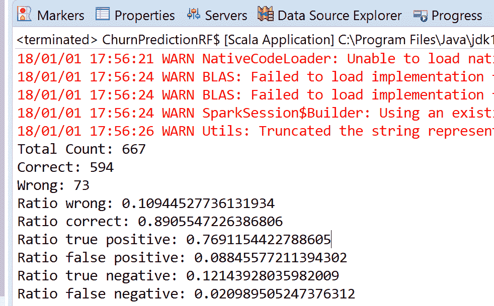

奇幻；我们达到了 91%的准确率，但是是因为什么因素呢？嗯，类似于 DT，可以调试随机森林，得到分类时构建的决策树。对于要打印的树和选择的最重要的特性，尝试 DT 中的最后几行代码，就完成了。

你现在能猜出训练了多少不同的模型吗？嗯，我们有 10 倍的交叉验证和 2 到 7 之间的五维超参数空间基数。现在我们来简单算一下:10 * 7 * 5 * 2 * 3 * 6 = 12600 个模型！

请注意，我们仍然将超参数空间限定为 7 个`numTrees`、`maxBins`和`maxDepth`。此外，请记住，更大的树最有可能表现更好。因此，您可以随意摆弄这些代码和添加特性，也可以使用更大的超参数空间，比如说更大的树。


# 选择最佳部署模式

从前面的结果可以看出，与随机森林和 DT 相比，LR 和 SVM 模型具有相同但更高的假阳性率。因此，我们可以说，DT 和随机森林在真正的正计数方面总体上具有更好的准确性。让我们用每个模型的饼图预测分布来看看前面陈述的有效性:

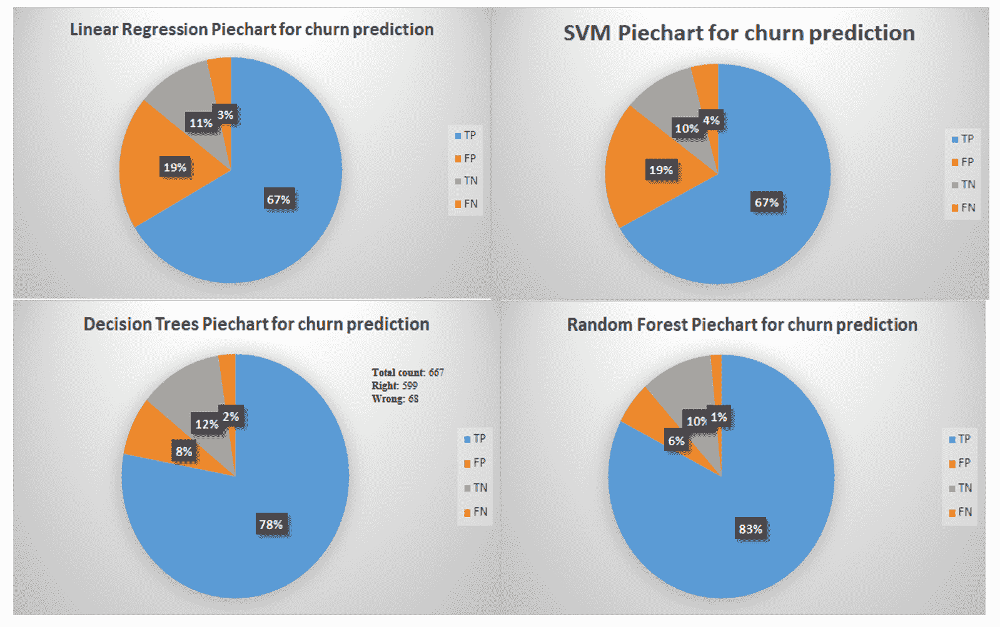

现在，值得一提的是，使用随机森林，我们实际上获得了很高的准确性，但这是一个非常资源，以及耗时的工作；与 LR 和 SVM 相比，这种训练尤其需要相当长的时间。

因此，如果您没有更高的内存或计算能力，建议在运行这段代码之前增加 Java 堆空间，以避免 OOM 错误。

最后，如果您想要部署最佳模型(在我们的例子中就是随机森林)，建议在`fit()`方法调用之后立即保存交叉验证的模型:

```scala
// Save the workflow
cvModel.write.overwrite().save("model/RF_model_churn")
```

您的训练模型将被保存到该位置。该目录将包括:

*   最佳模特
*   估计量
*   求值程序
*   培训本身的元数据

现在，下一个任务将是恢复相同的模型，如下所示:

```scala
// Load the workflow back
val cvModel = CrossValidatorModel.load("model/ RF_model_churn/")
```

最后，我们需要将测试集转换为模型管道，该管道根据我们在前面的特性工程步骤中描述的相同机制来映射特性:

```scala
val predictions = cvModel.transform(Preprocessing.testSet)
```

最后，我们评估恢复的模型:

```scala
val evaluator = new BinaryClassificationEvaluator()
    .setLabelCol("label")
    .setRawPredictionCol("prediction")

val accuracy = evaluator.evaluate(predictions)
    println("Accuracy: " + accuracy)
    evaluator.explainParams()

val predictionAndLabels = predictions
    .select("prediction", "label")
    .rdd.map(x => (x(0).asInstanceOf[Double], x(1)
    .asInstanceOf[Double]))

val metrics = new BinaryClassificationMetrics(predictionAndLabels)
val areaUnderPR = metrics.areaUnderPR
println("Area under the precision-recall curve: " + areaUnderPR)
val areaUnderROC = metrics.areaUnderROC
println("Area under the receiver operating characteristic (ROC) curve: " + areaUnderROC)
>>>
```

您将收到以下输出:


好了，完成了！我们成功地重复使用了这个模型，并做了同样的预测。但是，可能由于数据的随机性，我们观察到的预测略有不同。


# 摘要

在这一章中，我们已经看到了如何开发一个 ML 项目来预测客户是否可能取消他们的订阅，然后使用它来开发一个现实生活中的预测模型。我们开发了使用 LR、SVM、DTs 和随机森林的预测模型。我们还分析了哪些类型的客户数据通常用于对数据进行初步分析。最后，我们已经看到了如何选择用于生产就绪环境的模型。

在下一章中，我们将看到如何开发一个真实的项目，收集历史和实时的**比特币**数据，并预测未来一周、一个月等的价格。除此之外，我们将了解如何为在线加密货币交易生成一个简单的信号。