# 人口规模聚类和种族预测

了解基因组序列的变异有助于我们识别易患常见疾病的人群，治愈罕见疾病，并从更大的人群中找到相应的人群。虽然经典的机器学习技术允许研究人员识别相关变量的组(即聚类)，但对于大型和高维数据集(如整个人类基因组)，这些方法的准确性和有效性会降低。

另一方面，**深度神经网络** ( **DNNs** )形成了**深度学习** ( **DL** )的核心，并提供算法来对数据中复杂的高级抽象进行建模。他们可以更好地利用大规模数据集来构建复杂的模型。

在这一章中，我们将 K-means 算法应用于来自 1000 基因组项目分析的大规模基因组数据，该项目旨在在人群规模上聚类基因型变异。最后，我们训练了一个基于 H2O 的 DNN 模型和一个基于 Spark 的随机森林模型来预测地理种族。本章的主题是*给我你的基因变异数据，我会告诉你的种族*。

然而，我们将配置 H2O，以便在接下来的章节中也可以使用相同的设置。简而言之，在这个端到端项目中，我们将学习以下主题:

*   人口规模聚类和地理种族预测
*   1000 个基因组项目，人类基因变异的深度目录
*   算法和工具
*   使用 K-均值进行人口规模聚类
*   使用 H2O 进行种族预测
*   使用随机森林进行种族预测


# 人口规模聚集和地理种族

**下一代基因组测序** ( **NGS** )减少了基因组测序的开销和时间，带来了前所未有的大数据生产。相比之下，分析这种大规模数据的计算成本很高，并日益成为关键的瓶颈。NGS 数据在总体样本数量和每个样本的特征方面的增长需要大规模并行数据处理的解决方案，这给机器学习解决方案和生物信息学方法带来了巨大的挑战。在医疗实践中使用基因组信息需要有效的分析方法来处理来自成千上万个个体及其数百万个变体的数据。

最重要的任务之一是分析基因组图谱以将个体归因于特定的种族群体，或者分析疾病易感性的核苷酸单倍型。来自 1000 个基因组项目的数据是分析全基因组**单核苷酸多态性** ( **SNPs** )的主要来源，用于预测个体的大陆和区域血统。


# 遗传变异的机器学习

研究表明，来自亚洲、欧洲、非洲和美洲的人群可以根据他们的基因组数据进行区分。然而，更具挑战性的是准确预测单倍群和起源大陆，即地理、种族和语言。其他研究表明，Y 染色体谱系可以在地理上定位，形成了人类基因型的人类等位基因(在地理上)聚类的证据。

因此，个体的聚类与地理起源和祖先相关。由于种族也依赖于祖先，聚类也与更传统的种族概念相关，但这种相关性并不完美，因为遗传变异是根据概率原理发生的。因此，它在不同的种族中并不遵循连续的分布，而是在不同的种群中重叠或溢出。

因此，祖先甚至种族的鉴定可能会被证明对生物医学有用，但任何对疾病相关遗传变异的直接评估最终都会产生更准确和有益的信息。

各种基因组计划提供的数据集，如**癌症基因组图谱** ( **TCGA** )、**国际癌症基因组联盟(ICGC)** 、**千人基因组计划**、**个人基因组计划** ( **PGP** )，处理大规模数据。为了快速处理这些数据，已经提出了基于 ADAM 和 Spark 的解决方案，并且现在广泛用于基因组数据分析研究。

Spark 形成了最有效的数据处理框架，此外，它还为内存集群计算提供了原语，例如，用于重复查询用户数据。这使得 Spark 成为机器学习算法的绝佳候选，其性能优于基于 Hadoop 的 MapReduce 框架。通过使用来自 1000 个基因组项目的遗传变异数据集，我们将尝试回答以下问题:

*   人类基因变异在不同人群中的地理分布如何？
*   我们能否利用个体的基因组图谱将他们归属于特定的人群或从他们的核苷酸单体型推导出疾病易感性？
*   个体的基因组数据是否适合预测地理来源(即个体的人群)？

在这个项目中，我们以一种可扩展和更有效的方式解决了前面的问题。特别是，我们研究了如何将 Spark 和 ADAM 应用于大规模数据处理，将 H2O 应用于整个群体的 K-means 聚类以确定群体间和群体内的群体，以及基于 MLP 的监督学习，通过调整更多的超参数以根据个体的基因组数据更准确地预测个体的群体。在这一点上不要担心；我们将在后面的小节中提供使用这些技术的技术细节。

然而，在开始之前，让我们简短地浏览一下 1000 个基因组项目数据集，为您提供一些理由，说明为什么这些技术的互操作非常重要。


# 1000 个基因组项目数据集描述

来自 1000 个基因组项目的数据是一个非常大的人类基因变异的目录。该项目旨在确定研究人群中频率高于 1%的遗传变异。这些数据已经通过公共数据储存库向全世界的科学家公开提供并免费获取。此外，来自 1000 个基因组项目的数据被广泛用于筛选在患有遗传疾病的个体的外显子组数据和癌症基因组项目中发现的变体。

**变异体调用格式** ( **VCF** )中的基因型数据集提供了人类个体(即样本)及其遗传变异体的数据，此外还有全球等位基因频率以及超级群体的等位基因频率。数据表示在我们的方法中用于预测类别的每个样本的人口区域。特定的染色体数据(VCF 格式)可能有额外的信息表明样本的超群体或所用的测序平台。对于多等位基因变异，每个备选的**等位基因频率** ( **AF** )以逗号分隔的列表显示，如下所示:

```
1 15211 rs78601809 T G 100 PASS AC=3050;
 AF=0.609026;
 AN=5008;
 NS=2504;
 DP=32245;
 EAS_AF=0.504;
 AMR_AF=0.6772;
 AFR_AF=0.5371;
 EUR_AF=0.7316;
 SAS_AF=0.6401;
 AA=t|||;
 VT=SNP
```

AF 计算为**等位基因数** ( **AC** )和**等位基因数** ( **AN** )的商，NS 为有数据的样本总数，而`_AF`表示特定区域的 AF。

1000 基因组计划始于 2008 年；该联盟由 400 多名生命科学家组成，第三阶段于 2014 年 9 月完成，共涵盖来自 26 个群体(即种族背景)的`2,504`个人。总共有超过 8800 万个变异体(8470 万个**单核苷酸多态性** ( **SNPs** )、360 万个短插入/缺失(indels)和 60000 个结构变异体)被鉴定为高质量的单倍型。

简而言之，99.9%的变异由 SNPs 和短 indels 组成。不太重要的变异——包括 SNPs、indels、缺失、复杂的短替换和其他结构变异类别——已被剔除，以进行质量控制。结果，第三阶段发布留下了 8440 万个变体。

26 个种群中的每一个都有大约 60-100 个来自欧洲、非洲、美洲(南北)和亚洲(东南)的个体。人群样本根据其优势祖先分为超人群组:东亚人( **CHB** 、 **JPT** 、 **CHS** 、 **CDX** 和 **KHV** 、欧洲人( **CEU** 、 **TSI** 、 **FIN** 、 **GBR** 和 **IBS** 、非洲人( **YRI **ESN** 、 **ASW** 、 **ACB** 、美国 **MXL** 、 **PUR** 、 **CLM** 、 **PEL** 、南亚 **GIH** 、 **PJL** 、 **BEB** 、 **STU** 和 **ITU 详见*图 1* :****


图 1:来自 1000 基因组计划第三版的地理种族群体(来源 http://www.internationalgenome.org/)

发布的数据集提供了 2，504 名健康成年人(18 岁及以上，项目第三阶段)的数据；在更先进的解决方案可用之前，仅使用至少 70 个**碱基对** ( **bp** )的读数。来自所有样本的所有基因组数据被合并，以将所有变异体归属于一个区域。然而，请注意，特定的单倍型可能不会出现在特定区域的基因组中；也就是说，多样本方法允许将变异归因于个体的基因型，即使该变异不包括在该样本的测序读数中。

换句话说，提供了重叠的读数，单个样本基因组不一定被合并。使用这两种方法对所有个体进行测序:

*   全基因组测序(*平均深度= 7.4x* ，其中 *x* 是可能在给定参考 *bp* 处比对的平均读取数)
*   靶向外显子组测序(*平均深度= 65.7 倍*)

此外，个体和他们的一级亲属，如成年后代，使用高密度 SNP 微阵列进行基因分型。每个基因型包含所有 23 条染色体，一个单独的面板文件表示样本和群体信息。*表 1* 概述了 1000 基因组计划的不同版本:

**表 1——千人基因组计划基因型数据集统计** **(来源:**[http://www.internationalgenome.org/data](http://www.internationalgenome.org/data)**)**

| **1000 个基因组发布** | **变体** | **个人** | **人口** | **文件格式** |
| 第三阶段 | 第三阶段 | 2,504 | 26 | VCF |
| 第一相 | 3790 万 | 1,092 | 14 | VCF |
| 飞行员 | 1480 万 | 179 | 四 | VCF |

五个超人群群体中的 AF，**EAS =东亚人**，**EUR =欧洲人**，**AFR =非洲人**，**AMR =美洲人**，**SAS =南亚人**人群由等位基因数(an，range= [0，1])计算得出。

面板文件详见[FTP://FTP . 1000 genomes . ebi . AC . uk/vol 1/FTP/release/2013 05 02/integrated _ call _ samples _ v 3.2013 05 02 . all . panel](ftp://ftp.1000genomes.ebi.ac.uk/vol1/ftp/release/20130502/integrated_call_samples_v3.20130502.ALL.panel)。

算法、工具和技术


# 来自 1000 基因组计划第 3 版的大规模数据贡献了 820 GB 的数据。因此，ADAM 和 Spark 用于以可扩展的方式为 MLP 和 K-means 模型预处理和准备数据(即训练、测试和验证集)。苏打水改变了 H2O 和火花之间的数据。

然后，K-均值聚类，MLP(使用 H2O)被训练。对于聚类和分类分析，需要使用样本 ID、变异 ID 和备选等位基因计数来获得每个样本的基因型信息，其中我们使用的大多数变异是 SNPs 和 indels。

现在，我们应该知道所使用的每个工具的基本信息，如亚当、H2O，以及一些算法的背景信息，如聚类的 K-means 和 MLP，并对人群进行分类。

H2O 和苏打水


# H2O 是一个机器学习的人工智能平台。它提供了一套丰富的机器学习算法和一个基于网络的数据处理 UI，既有开源的，也有商业的。使用 H2O，可以用多种语言开发机器学习和 DL 应用程序，比如 Java、Scala、Python 和 R:

图 2:https://h20.ai/的 H2O 计算引擎和可用特性

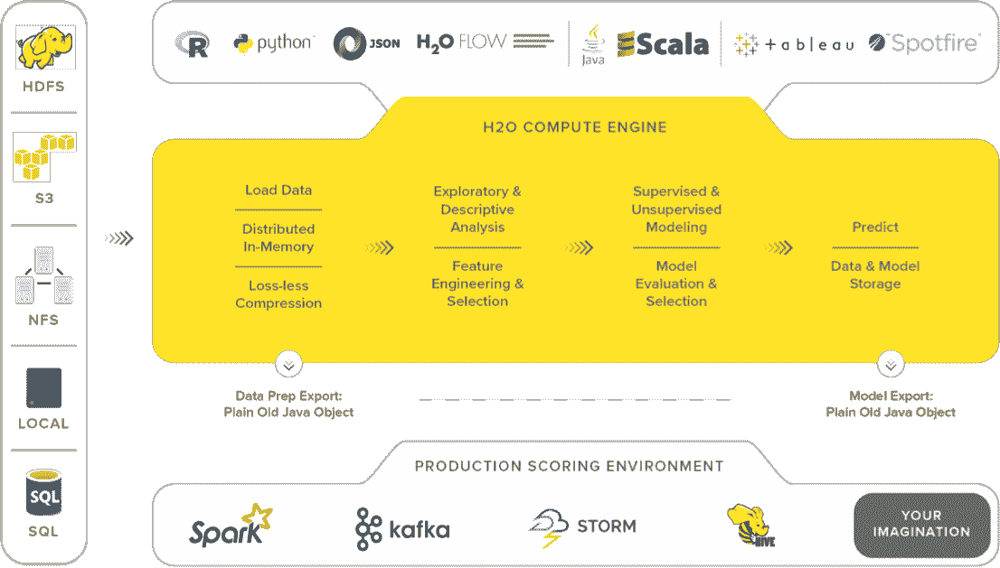

它还能够与 Spark、HDFS、SQL 和 NoSQL 数据库接口。简而言之，H2O 在 Hadoop/Yarn、Spark 或 laptop 上使用 R、Python 和 Scala。另一方面，苏打水结合了 H2O 的快速、可扩展的 ML 算法和 Spark 的能力。它驱动 Scala/R/Python 的计算，并利用 H2O 流 UI。简而言之，闪闪发光的*水= H2O +火花*。

在接下来的几章中，我们将探索 H2O 和波光粼粼的水域的丰富多彩的特征；但是，我认为提供一个包含所有功能领域的图表会很有用:

图 3:可用算法和支持的 ETL 技术的一瞥(来源:https://h20.ai/)

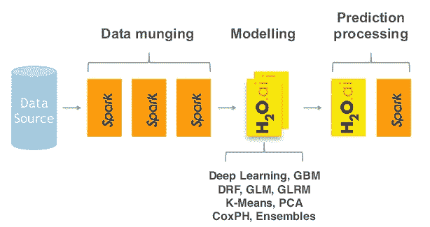

这是一个从 H2O 网站精选的特性和技术列表。它可用于争论数据、使用数据建模以及对结果模型进行评分:

过程

*   模型
*   评分工具
*   数据剖析
*   **广义线性模型** ( **GLM** )
*   预测
*   汇总统计数据
*   决策树
*   混淆矩阵
*   聚合、筛选、绑定和派生列
*   **梯度推进机** ( **GBM**
*   罗马纪元
*   切片、日志转换和匿名化
*   k 均值
*   命中率
*   变量创建
*   异常检测
*   PCA/PCA 得分
*   分升
*   多模型评分
*   培训和验证抽样计划
*   朴素贝叶斯
*   网格搜索
*   下图显示了如何提供一个清晰的方法来描述 H2O 苏打水是如何被用来扩展 Apache Spark 的功能的。H2O 和 Spark 都是开源系统。Spark MLlib 包含了大量的功能，而 H2O 用大量的额外功能扩展了它，包括 DL。它提供了对数据进行转换、建模和评分的工具，我们可以在 Spark ML 中找到这些工具。它还提供了一个基于 web 的用户界面，可以与以下用户进行交互:

图 4:苏打水延伸 H2O，与 Spark 互通(来源:https://h20.ai/)


下图显示了 H2O 如何与 Spark 集成。我们已经知道，Spark 有主服务器和工作服务器；工人创建执行者来做实际的工作。运行基于水的起泡应用程序需要执行以下步骤:

Spark 的 submit 命令将汽水罐发送给 Spark master

*   Spark master 启动工人并分发 JAR 文件
*   Spark 工作人员启动执行器 JVM 来执行工作
*   Spark 执行器启动一个 H2O 实例
*   H2O 实例嵌入在执行器 JVM 中，因此它与 Spark 共享 JVM 堆空间。当所有 H2O 实例启动后，H2O 形成一个集群，然后 H2O 流 web 界面可用:

图 Sparkling water 如何融入 Spark 架构(来源:http://blog . cloud era . com/blog/2015/10/How-to-build-a-machine-learning-app-using-sparking-water-and-Apache-Spark/)


上图解释了 H2O 如何融入 Spark 架构以及它是如何开始的，但是数据共享呢？现在的问题是:数据是如何在 Spark 和 H2O 之间传递的？下图对此进行了解释:

图 Spark 和 H2O 之间的数据传递机制

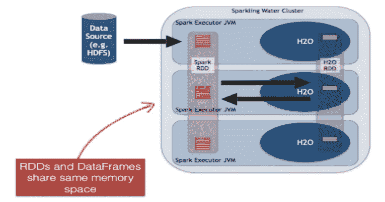

为了更清楚地了解上图，我们为 H2O 和苏打水创建了一个新的 H2O·RDD 数据结构。它是基于 H2O 帧顶部的层，其中的每一列都代表一个数据项，并且被独立压缩以提供最佳的压缩率。

用于大规模基因组数据处理的 ADAM


# 分析 DNA 和 RNA 测序数据需要大规模的数据处理，以根据其上下文来解释数据。学术实验室已经开发出了优秀的工具和解决方案，但是在可伸缩性和互操作性方面往往存在不足。通过这种方式，ADAM 是一个基因组学分析平台，具有使用 Apache Avro、Apache Spark 和 Parquet 构建的专用文件格式。

然而，大规模数据处理解决方案，如 ADAM-Spark，可以直接应用于测序管道的输出数据，即在质量控制、绘图、读取预处理和使用单个样本数据的变体量化之后。一些例子是用于 DNA 测序的 DNA 变体，用于 RNA 测序的读数，等等。

更多信息请参见[http://bdgenomics.org/](http://bdgenomics.org/)和相关出版物:Massie，Matt 和 Nothaft，Frank 等人，ADAM:云计算的基因组格式和处理模式，UCB/EECS，2013-207，加州大学 EECS 分校。

在我们的研究中，ADAM 用于实现支持 VCF 文件格式的可扩展基因组数据分析平台，以便我们可以将基于基因型的 RDD 转换为 Spark 数据框架。

无监督机器学习


# 无监督学习是一种机器学习算法，用于对相关数据对象进行分组，并通过从无标签数据集(即由无标签输入数据组成的训练集)进行推理来找到隐藏模式。

我们来看一个现实生活中的例子。假设你的硬盘上有一个拥挤的大文件夹，里面有大量非盗版且完全合法的 MP3 文件。现在，如果您可以建立一个预测模型，帮助您自动将相似的歌曲组合在一起，并将其组织到您最喜欢的类别中，如乡村、说唱和摇滚，会怎么样？

这是将一个项目分配到一个组的行为，以便以无人监管的方式将 MP3 添加到相应的播放列表中。对于分类，我们假设给你一个正确标记数据的训练数据集。不幸的是，当我们在现实世界中收集数据时，我们并不总是有这种奢侈。

例如，假设我们想将大量的音乐分成有趣的播放列表。如果我们不能直接访问歌曲的元数据，我们怎么可能把它们组合在一起呢？一种可能的方法是混合各种 ML 技术，但是集群通常是解决方案的核心:

图 7:聚类数据样本概览


换句话说，无监督学习算法的主要目标是在未标记的输入数据中探索未知/隐藏的模式。然而，无监督学习还包括其他技术，以探索的方式解释数据的关键特征，以找到隐藏的模式。为了克服这一挑战，聚类技术被广泛用于以无监督的方式基于某些相似性度量对未标记的数据点进行分组。

群体基因组学和聚类


# 聚类分析是关于划分数据样本或数据点，并将其放入相应的同质类或簇中。因此，集群的简单定义可以认为是将对象组织成组的过程，这些组的成员在某些方面是相似的，如。

这样，一个集群就是一个对象的集合，这些对象之间具有某种相似性，并且与属于其他集群的对象不相似。如果给定了遗传变异的集合，聚类算法会根据相似性将这些对象归入一个组，即种群组或超种群组。

K-means 是如何工作的？


# 诸如 K-means 的聚类算法定位数据点组的质心。但是，为了使聚类准确有效，该算法会计算每个点与聚类质心之间的距离。

最终，聚类的目标是确定一组未标记数据中的内在分组。例如，K-means 算法试图在预定义的**三个**(即 *k = 3* )聚类内对相关数据点进行聚类，如图*图 8* 所示:

图 8:典型聚类算法的结果和聚类中心的表示

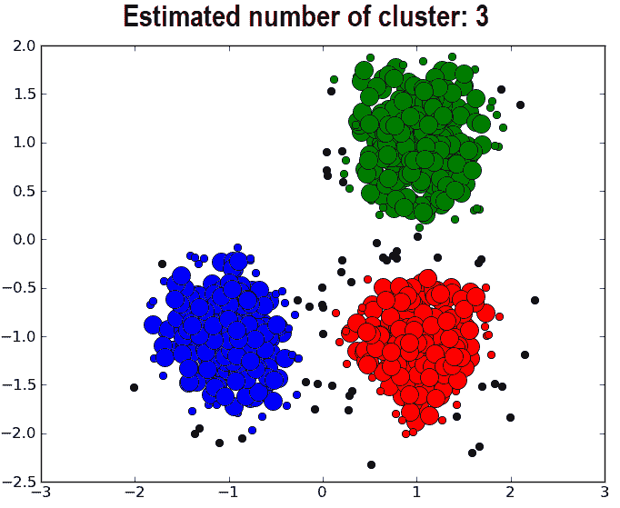

在我们的案例中，通过使用 Spark 的组合方法，亚当和 H2O 能够处理大量不同的数据点。假设，我们有 n 个数据点(x [i] ，i=1，2… n，例如，遗传变异体)需要划分成 *k* 个聚类。然后 K-means 给每个数据点分配一个聚类，目的是找到位置*μ[I]， *i=1...k 个使数据点到聚类的距离最小的聚类。在数学上，K-means 试图通过求解一个方程来实现目标，即一个优化问题:**

在上式中，*c[I]是分配给聚类 *i* 的数据点集， *d(x，μ[I])=∨xμ[I]∨[2]²*是要计算的欧氏距离。该算法通过最小化**聚类内平方和**(即 **WCSS** )来计算数据点和 k 个聚类中心之间的距离，其中*c[I]是属于聚类 *i* 的点集。**


因此，我们可以理解，使用 K-means 的整体聚类操作不是一个微不足道的问题，而是一个 NP-hard 优化问题。这也意味着 K-means 算法不仅试图找到全局最小值，而且经常陷入不同的解决方案。K-means 算法通过在两个步骤之间交替进行:

**聚类分配步骤**:将每个观察值分配给其平均值产生最小 **WCSS** 的聚类。平方和是欧几里德距离的平方。

*   **质心更新步骤**:计算新的均值作为新聚类中观察值的质心。
*   简而言之，K-means 训练的总体方法可以用下图来描述:

图 9:K-means 算法过程的整体方法

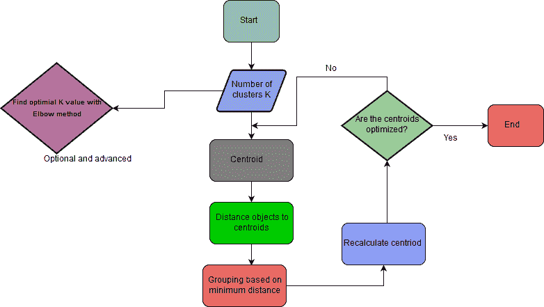

用于地理种族预测的 DNNs


# **多层感知器** ( **MLP** )是前馈神经网络 DNN 的一个例子；也就是说，不同层的神经元之间只有连接。有一个(直通)输入层，一层或多层**线性阈值单元**(**ltu**)(称为**隐藏层**)，以及一个 ltu 的最终层(称为**输出层**)。

除了输出层，每一层都包含一个偏向神经元，并与下一层完全连接，形成一个完全连接的二分图。信号专门从输入流向输出，即单向(**前馈**)。

直到最近，使用反向传播训练算法来训练 MLP，但现在优化版本(即梯度下降)使用反向模式自动差异；也就是说，使用反向传播作为梯度计算技术，用 SGD 训练神经网络。在 DNN 训练中使用了两个抽象层来解决分类问题:

**梯度计算**:使用反向传播

*   **优化级别**:使用 SGD、ADAM、RMSPro 和 Momentum 优化器来计算之前计算的梯度
*   在每个训练周期中，该算法将数据输入网络，并计算连续层中每个神经元的状态和输出。然后，该方法测量网络上的输出误差，即期望输出和当前输出之间的差距，以及最后一个隐藏层中每个神经元对神经元输出误差的贡献。

迭代地，输出误差通过所有隐藏层传播回输入层，并且在反向传播期间跨所有连接权重计算误差梯度:

图 10:由输入层、ReLU 和 softmax 组成的现代 MLP

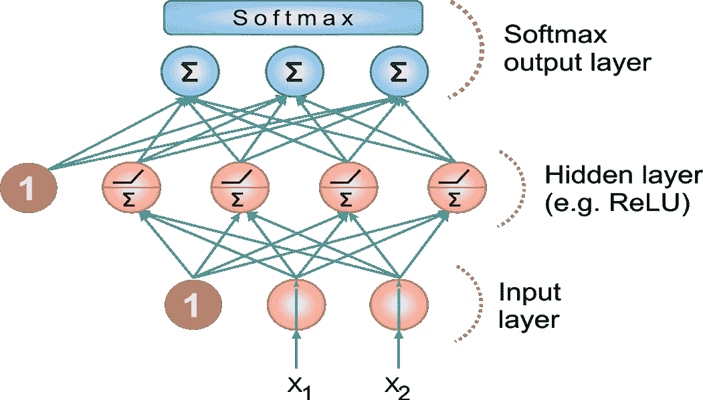

对于多类分类任务，与单独的激活函数相比，输出层通常由共享的 softmax 函数确定(更多信息参见*图 2* ，每个输出神经元提供相应类的估计概率。

此外，我们将使用树集合，如随机森林进行分类。此时，我相信我们可以跳过 RF 的基本介绍，因为我们已经在[第一章](4b0be2d2-f313-471f-83fe-830931fc8af9.xhtml)、*分析保险严重索赔*、[第二章](4e196881-40c8-4eb9-b2b3-e332a49adc1a.xhtml)、*分析和预测电信流失*、[第三章](51e66c26-e12b-4764-bbb7-444986c05870.xhtml)、*从历史数据预测高频比特币价格*中详细介绍过。好了，该是被注视的时候了。尽管如此，在动手之前准备好编程环境总是好的。

配置编程环境


# 在本节中，我们将描述如何配置我们的编程环境，以便我们可以与 Spark、H2O 和 Adam 进行互操作。请注意，在笔记本电脑或台式机上使用 H2O 是非常耗费资源的。因此，请确保您的笔记本电脑至少有 16 GB 的内存和足够的存储空间。

无论如何，我要让这个项目成为 Eclipse 上的 Maven 项目。但是，您也可以尝试在 SBT 定义相同的依赖项。让我们为一个 Maven 友好的项目定义一个`pom.xml`文件上的属性标签:

然后我们可以最新版的 Spark 2.2.1 版本(任何 2.x 版本甚至更高版本应该都可以):

```
<properties>
    <spark.version>2.2.1</spark.version>
    <scala.version>2.11.12</scala.version>
    <h2o.version>3.16.0.2</h2o.version>
    <sparklingwater.version>2.2.6</sparklingwater.version>
    <adam.version>0.23.0</adam.version>
</properties>
```

然后我们需要声明 H2O 和苏打水的依赖项，它们与 properties 标签中指定的版本相匹配。更高版本也可能有效，您可以尝试:

```
<dependency>
    <groupId>org.apache.spark</groupId>
    <artifactId>spark-core_2.11</artifactId>
    <version>${spark.version}</version>
</dependency>
```

最后，让我们定义 ADAM 及其依赖项:

```
<dependency>
    <groupId>ai.h2o</groupId>
    <artifactId>sparkling-water-core_2.11</artifactId>
    <version>2.2.6</version>
</dependency>
<dependency>
    <groupId>ai.h2o</groupId>
    <artifactId>sparkling-water-examples_2.11</artifactId>
    <version>2.2.6</version>
</dependency>
<dependency>
    <groupId>ai.h2o</groupId>
    <artifactId>h2o-core</artifactId>
    <version>${h2o.version}</version>
</dependency>
<dependency>
    <groupId>ai.h2o</groupId>
    <artifactId>h2o-scala_2.11</artifactId>
    <version>${h2o.version}</version>
</dependency>
<dependency>
    <groupId>ai.h2o</groupId>
    <artifactId>h2o-algos</artifactId>
    <version>${h2o.version}</version>
</dependency>
<dependency>
    <groupId>ai.h2o</groupId>
    <artifactId>h2o-app</artifactId>
    <version>${h2o.version}</version>
</dependency>
<dependency>
    <groupId>ai.h2o</groupId>
    <artifactId>h2o-persist-hdfs</artifactId>
    <version>${h2o.version}</version>
</dependency>
<dependency>
    <groupId>ai.h2o</groupId>
    <artifactId>google-analytics-java</artifactId>
    <version>1.1.2-H2O-CUSTOM</version>
</dependency>
```

当我在 Windows 机器上尝试时，我还必须安装`joda-time`依赖项。让我们来做(但是根据您的平台，可能不需要):

```
<dependency>
    <groupId>org.bdgenomics.adam</groupId>
    <artifactId>adam-core_2.11</artifactId>
    <version>0.23.0</version>
</dependency>
```

一旦您在 Eclipse 中创建了一个 Maven 项目(从 IDE 中手动创建或者使用`$ mvn install)`，所有需要的依赖项都将被下载！我们现在准备编码了！

```
<dependency>
    <groupId>joda-time</groupId>
    <artifactId>joda-time</artifactId>
    <version>2.9.9</version>
</dependency>
```

等等！在浏览器上看到 H2O 的用户界面怎么样？为此，我们必须手动将 H2O JAR 下载到我们计算机的某个地方，并将其作为常规的`.jar`文件运行。简而言之，这是一个三方过程:

从[https://www.h2o.ai/download/](https://www.h2o.ai/download/)下载**最新稳定版本** H [2] O。然后拉开拉链；它包含您开始所需的一切。

*   在您的终端/命令提示符下，使用`java -jar h2o.jar`运行`.jar`。
*   将浏览器指向`http://localhost:54321`:
*   图 11:H2O 流程的用户界面

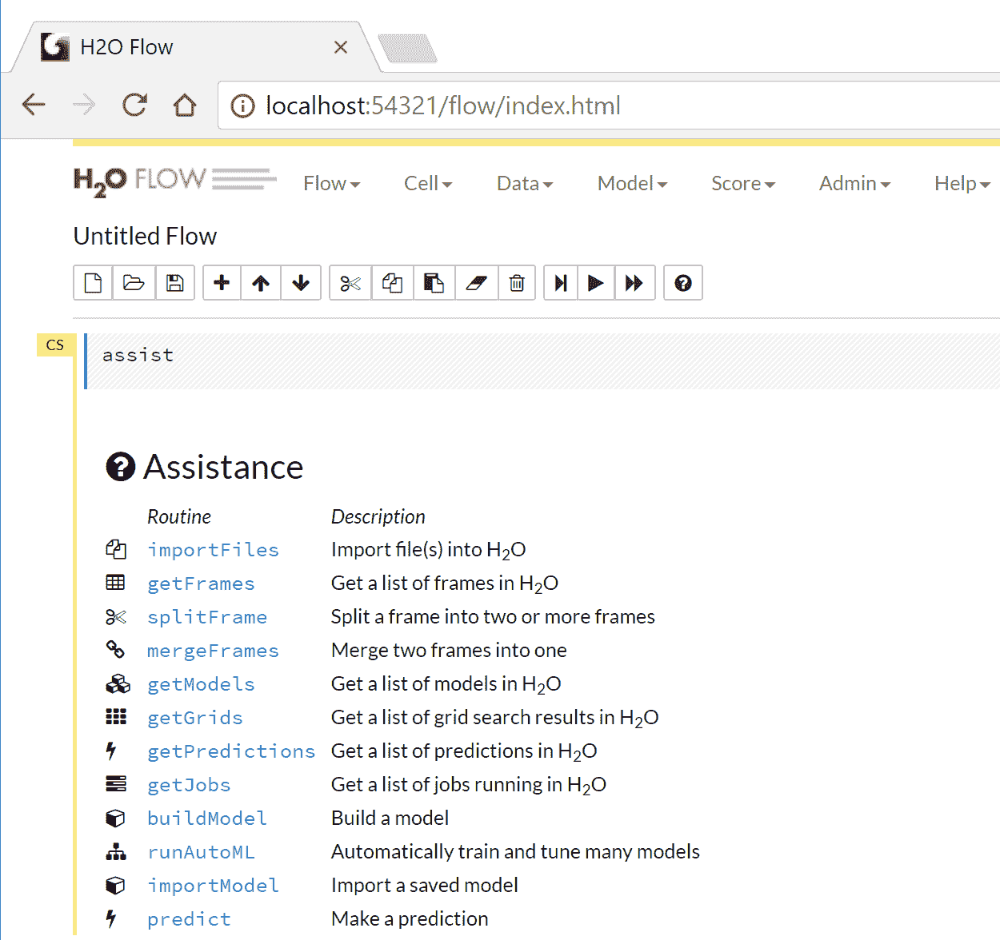

这显示了 h2o 最新版本(即 2018 年 1 月 19 日的 h2o-3.16.0.4)的可用功能。然而，我不打算在这里解释一切，所以让我们停止探索，因为我相信目前这些关于 H2O 和火花水的知识就足够了。

数据预处理和特征工程


# 我已经说过，所有 24 个 VCF 文件贡献了 820 GB 的数据。因此，我决定只使用 Y 染色体的遗传变异体一个两个使论证更清楚。大小约为 160 MB，这并不意味着会带来巨大的计算挑战。你可以从 ftp://ftp.1000genomes.ebi.ac.uk/vol1/ftp/release/20130502/[下载所有的 VCF 文件以及面板文件。](ftp://ftp.1000genomes.ebi.ac.uk/vol1/ftp/release/20130502/)

让我们开始吧。我们从创建 Spark 应用程序的网关`SparkSession`开始:

然后让我们向 Spark 展示 VCF 和面板文件的路径:

```
val spark:SparkSession = SparkSession
    .builder()
    .appName("PopStrat")
    .master("local[*]")
    .config("spark.sql.warehouse.dir", "C:/Exp/")
    .getOrCreate()
```

我们使用 Spark 处理面板文件，以访问目标人群数据并识别人群。我们首先创建一组我们想要预测的人口:

```
val genotypeFile = "<path>/ALL.chrY.phase3_integrated_v2a.20130502.genotypes.vcf"
val panelFile = "<path>/integrated_call_samples_v3.20130502.ALL.panel "
```

然后我们需要创建一个样本 ID →人群的映射，这样我们就可以过滤掉我们不感兴趣的样本:

```
val populations = Set("FIN", "GBR", "ASW", "CHB", "CLM")
```

请注意，面板文件生成所有个人、人口组、种族、超级人口组和性别的样本 ID，如下所示:

```
def extract(file: String,
filter: (String, String) => Boolean): Map[String, String] = {
Source
    .fromFile(file)
    .getLines()
    .map(line => {
val tokens = line.split(Array('t', ' ')).toList
tokens(0) -> tokens(1)
}).toMap.filter(tuple => filter(tuple._1, tuple._2))
}

val panel: Map[String, String] = extract(
panelFile,
(sampleID: String, pop: String) => populations.contains(pop))
```

图 12:样本面板文件的内容


然后加载 ADAM 基因型并过滤基因型，这样我们就只剩下那些我们感兴趣的群体:

下一项工作是将`Genotype`对象转换成我们自己的`SampleVariant`对象，以节省内存。然后，`genotype`对象被转换成一个`SampleVariant`对象，其中只包含我们进一步处理所需的数据:样本 ID，它惟一地标识了一个特定的样本；变体 ID，其唯一地识别特定的遗传变体；和交替等位基因的计数(仅当样品不同于参考基因组时)。

```
val allGenotypes: RDD[Genotype] = sc.loadGenotypes(genotypeFile).rdd
val genotypes: RDD[Genotype] = allGenotypes.filter(genotype => {
    panel.contains(genotype.getSampleId)
    })
```

这里给出了准备样本变体的签名；它需要`sampleID`、`variationId`和`alternateCount`:

好吧！让我们从`genotype`文件中找到`variantID`。一个`varitantId`是一个`String`类型，由染色体中的名称、开始和结束位置组成:

```
case class SampleVariant(sampleId: String,
        variantId: Int,
        alternateCount: Int)
```

一旦我们有了`variantID`，我们应该寻找备用计数。在`genotype`文件中，没有等位基因参考的对象大致是基因替代物:

```
def variantId(genotype: Genotype): String = {
 val name = genotype.getVariant.getContigName
 val start = genotype.getVariant.getStart
 val end = genotype.getVariant.getEnd
s"$name:$start:$end"
}
```

最后，我们构造了一个简单的变体对象。为此，我们需要实习样品 id，因为它们会在 VCF 文件中重复出现:

```
def alternateCount(genotype: Genotype): Int = {
      genotype.getAlleles.asScala.count(_ != GenotypeAllele.REF)
   }
```

太棒了。我们已经能够构建简单的变体。现在，下一个具有挑战性的任务是在我们能够创建`variantsBySampleId` RDD 之前准备好`variantsRDD`:

```
def toVariant(genotype: Genotype): SampleVariant = {
 new SampleVariant(genotype.getSampleId.intern(),
            variantId(genotype).hashCode(),
            alternateCount(genotype))
        }
```

然后，我们必须按样本 ID 对变量进行分组，以便我们可以逐个样本地处理变量。在此之后，我们可以获得样本总数，用于查找某些样本中缺失的变体。最后，我们必须按变体 ID 对变体进行分组，并过滤掉一些样本中缺失的变体:

```
val variantsRDD: RDD[SampleVariant] = genotypes.map(toVariant)
```

现在，让我们制作一个变量 ID →样本计数的映射，其中交替计数大于零。然后我们过滤掉那些不在我们期望的频率范围内的变体。这里的目标只是减少数据集中的维数，以便更容易地训练模型:

```
val variantsBySampleId: RDD[(String, Iterable[SampleVariant])] =
variantsRDD.groupBy(_.sampleId)

val sampleCount: Long = variantsBySampleId.count()
println("Found " + sampleCount + " samples")

val variantsByVariantId: RDD[(Int, Iterable[SampleVariant])] =
variantsRDD.groupBy(_.variantId).filter {
 case (_, sampleVariants) => sampleVariants.size == sampleCount
    }
```

样本(或个体)的总数已经确定，然后根据它们的变体 id 对它们进行分组，并过滤掉没有样本支持的变体，以简化数据预处理并更好地处理非常大量的变体(总共 8440 万)。

```
val variantFrequencies: collection.Map[Int, Int] = variantsByVariantId
.map {
 case (variantId, sampleVariants) =>
        (variantId, sampleVariants.count(_.alternateCount > 0))
        }.collectAsMap()
```

*图 13* 显示了 1000 基因组项目中基因型变体集合的概念视图，并展示了从相同数据中提取特征的过程，以训练我们的 K 均值和 MLP 模型:

图 13:1000 基因组项目中基因型变体集合的概念视图

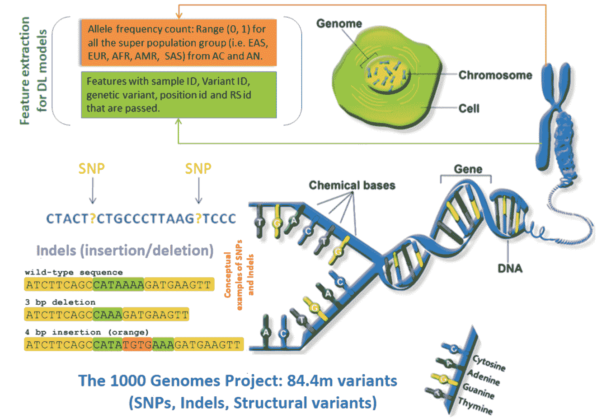

指定的范围是任意的，选择它是因为它包括合理数量的变量，但不会太多。更具体地说，对于每个变体，已经计算了交替等位基因的频率，并且排除了具有少于 12 个交替等位基因的变体，在分析中留下大约 300 万个变体(对于 23 个染色体文件):

一旦我们有了`filteredVariantsBySampleId`，下一个任务就是对每个样本 ID 的变量进行排序。每个样本现在应该有相同数量的排序变量:

```
val permittedRange = inclusive(11, 11)
val filteredVariantsBySampleId: RDD[(String, Iterable[SampleVariant])] =
    variantsBySampleId.map {
 case (sampleId, sampleVariants) =>
 val filteredSampleVariants = sampleVariants.filter(
        variant =>
        permittedRange.contains(
        variantFrequencies.getOrElse(variant.variantId, -1)))
    (sampleId, filteredSampleVariants)
    }
```

RDD 中的所有项目现在应该在相同的订单中具有相同的变体。最后一个任务是使用`sortedVariantsBySampleId`构建一个包含地区和备用计数的`Row`的 RDD:

```
val sortedVariantsBySampleId: RDD[(String, Array[SampleVariant])] =
    filteredVariantsBySampleId.map {
 case (sampleId, variants) =>
        (sampleId, variants.toArray.sortBy(_.variantId))
        }
    println(s"Sorted by Sample ID RDD: " + sortedVariantsBySampleId.first())
```

因此，我们可以只使用第一个来构造训练数据帧的报头:

```
val rowRDD: RDD[Row] = sortedVariantsBySampleId.map {
 case (sampleId, sortedVariants) =>
 val region: Array[String] = Array(panel.getOrElse(sampleId, "Unknown"))
 val alternateCounts: Array[Int] = sortedVariants.map(_.alternateCount)
        Row.fromSeq(region ++ alternateCounts)
        }
```

干得好！到目前为止，我们有我们的 RDD 和头球`StructType`。所以现在，我们可以通过最小的调整/转换来玩 H2O 和 Spark deep/机器学习算法。下图显示了这个端到端项目的整体流程:

```
val header = StructType(
        Seq(StructField("Region", StringType)) ++
        sortedVariantsBySampleId
            .first()
            ._2
            .map(variant => {
                StructField(variant.variantId.toString, IntegerType)
        }))
```

图 14:整体方法的管道

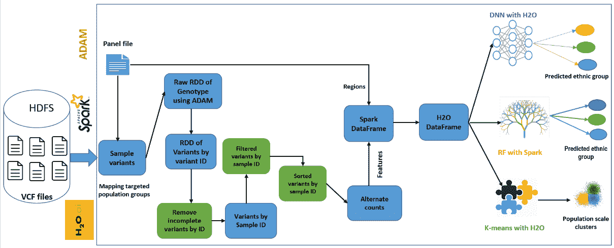

模型训练和超参数调整


# 一旦我们有了`rowRDD`和头，下一个任务就是使用头和`rowRDD`从变量中构造我们的模式数据帧的行:

图 15:包含特征和标签(即区域)列的训练数据集的快照

```
val sqlContext = spark.sqlContext
val schemaDF = sqlContext.createDataFrame(rowRDD, header)
schemaDF.printSchema()
schemaDF.show(10)
>>>
```

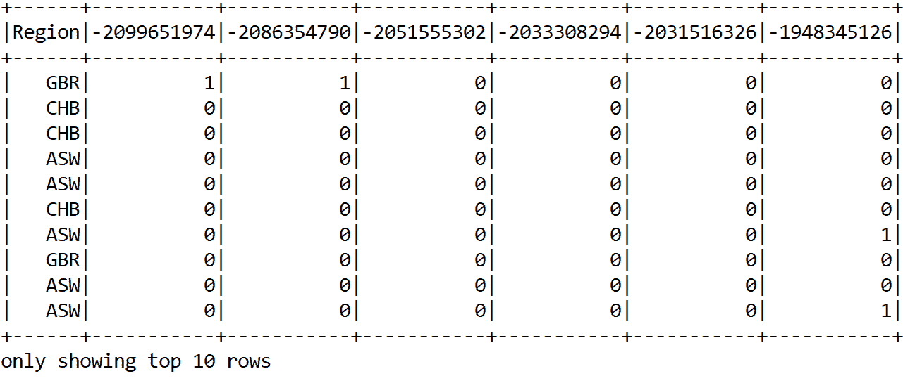

在前面的数据帧中，只显示了几列，包括标签，以便适合页面。

基于 Spark 的 K-means 聚类算法


# 在前面的章节中，我们已经看到了 K-means 是如何工作的。所以我们可以直接进入实现。由于训练将是无人监督的，我们需要删除标签列(即`Region`):

图 16:没有标签(即区域)的 K-means 的训练数据集的快照

```
val sqlContext = sparkSession.sqlContext
val schemaDF = sqlContext.createDataFrame(rowRDD, header).drop("Region")
schemaDF.printSchema()
schemaDF.show(10)
>>>
```


现在，我们已经在[第 1 章](4b0be2d2-f313-471f-83fe-830931fc8af9.xhtml)、*分析保险严重索赔*和[第 2 章](4e196881-40c8-4eb9-b2b3-e332a49adc1a.xhtml)、*分析和预测电信流失*中看到，Spark 希望有两列(即特征和标签)用于监督训练，而对于非监督训练，它希望只有一列包含特征。由于我们删除了标签列，现在我们需要将整个变量列合并成一个单独的`features`列。为此，我们将再次使用`VectorAssembler()`变压器。首先，让我们选择要嵌入向量空间的列:

然后我们实例化`VectorAssembler()`转换器，指定输入列和输出列:

```
val featureCols = schemaDF.columns
```

现在让我们看看它是什么样子的:

```
val assembler = 
new VectorAssembler()
    .setInputCols(featureCols)
    .setOutputCol("features")
val assembleDF = assembler.transform(schemaDF).select("features")
```

图 17:K 均值的特征向量快照

```
assembleDF.show()
>>>
```

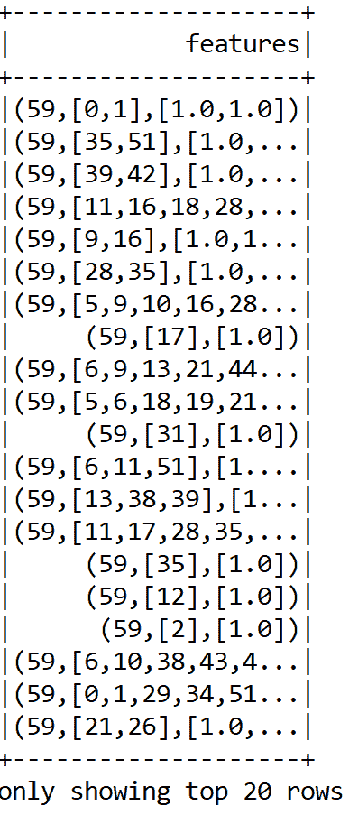

由于我们的数据集非常高维，我们可以使用一些维数算法，如 PCA。因此，让我们通过实例化一个`PCA()`转换器来实现，如下所示:

然后我们对组装的数据帧(即组装的)和前 50 个主成分进行变换。不过你可以调整这个数字。最后，为了避免歧义，我们将`pcaFeatures`列重命名为`features`:

```
val pca = 
new PCA()
    .setInputCol("features")
    .setOutputCol("pcaFeatures")
    .setK(50)
    .fit(assembleDF)
```

图 18:作为最重要特征的前 50 个主要成分的快照

```
val pcaDF = pca.transform(assembleDF)
            .select("pcaFeatures")
            .withColumnRenamed("pcaFeatures", "features")
pcaDF.show()
>>>
```

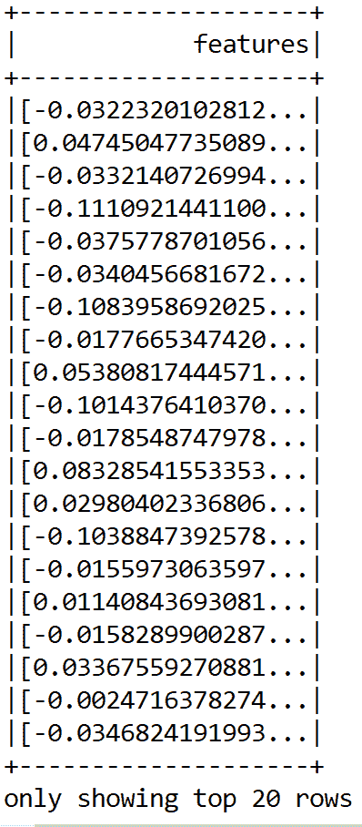

太棒了。一切都很顺利。最后，我们准备训练 K-means 算法:

因此，让我们通过计算**组内误差平方和** ( **WSSSE** )来评估集群:

```
val kmeans = 
new KMeans().setK(5).setSeed(12345L)
val model = kmeans.fit(pcaDF)
```

确定最佳聚类的数量

```
val WSSSE = model.computeCost(pcaDF)
println("Within-Cluster Sum of Squares for k = 5 is" + WSSSE)
>>>
```


# 聚类算法(如 K-means)的优点在于，它们对具有无限数量特征的数据进行聚类。当您拥有原始数据并希望了解数据中的模式时，它们是非常有用的工具。然而，在做实验之前决定簇的数量可能不成功，并且有时可能导致过拟合或欠拟合问题。

另一方面，所有三种算法(即 K-means、平分 K-means 和高斯混合)的一个共同点是，必须预先确定聚类的数量，并将其作为参数提供给算法。因此，非正式地，确定集群的数量是要解决的单独的优化问题。

现在我们将使用基于肘方法的启发式方法。我们从 K = 2 个聚类开始，然后通过增加 K 并观察成本函数 WCSS 的值，对同一数据集运行 K 均值算法:

在某一点上，可以观察到成本函数的大幅下降，但随后随着`k`值的增加，改善变得微不足道。正如聚类分析文献中所建议的，我们可以挑选 WCSS 最后一次大跌后的`k`作为最优。现在，让我们看看 2 到 20 个不同数量的分类的 WCSS 值，例如:

```
val iterations = 20
for (i <- 2 to iterations) {
 val kmeans = new KMeans().setK(i).setSeed(12345L)
 val model = kmeans.fit(pcaDF)
 val WSSSE = model.computeCost(pcaDF)
        println("Within-Cluster Sum of Squares for k = " + i + " is " +
                WSSSE)
    }
```

现在让我们讨论如何利用肘方法来确定集群的数量。如下图所示，我们计算了成本函数 WCSS，作为应用于所选人群中 Y 染色体遗传变异的 K-means 算法的聚类数的函数。

```
Within-Cluster Sum of Squares for k = 2 is 453.161838161838
Within-Cluster Sum of Squares for k = 3 is 438.2392344497606
Within-Cluster Sum of Squares for k = 4 is 390.2278787878787
Within-Cluster Sum of Squares for k = 5 is 397.72112098427874
Within-Cluster Sum of Squares for k = 6 is 367.8890909090908
Within-Cluster Sum of Squares for k = 7 is 362.3360347662672
Within-Cluster Sum of Squares for k = 8 is 347.49306362861336
Within-Cluster Sum of Squares for k = 9 is 327.5002901103624
Within-Cluster Sum of Squares for k = 10 is 327.29376873556436
Within-Cluster Sum of Squares for k = 11 is 315.2954156954155
Within-Cluster Sum of Squares for k = 12 is 320.2478696814693
Within-Cluster Sum of Squares for k = 13 is 308.7674242424241
Within-Cluster Sum of Squares for k = 14 is 314.64784054938576
Within-Cluster Sum of Squares for k = 15 is 297.38523698523704
Within-Cluster Sum of Squares for k = 16 is 294.26114718614707
Within-Cluster Sum of Squares for k = 17 is 284.34890572390555
Within-Cluster Sum of Squares for k = 18 is 280.35662525879917
Within-Cluster Sum of Squares for k = 19 is 272.765762015762
Within-Cluster Sum of Squares for k = 20 is 272.05702362771336
```

可以观察到，当`k = 9`时**出现稍微大的下降**(虽然不是急剧下降)。因此，我们选择簇的数量为 10，如图*图 10* 所示:

图 19:作为 WCSS 函数的集群数量


使用 H2O 进行种族预测


# 到目前为止，我们已经看到了如何对基因变异进行聚类。我们还使用了肘方法，并找到了最佳的数字`k`，暂定数字集群。现在我们应该探索我们在开始时计划的另一项任务——即种族预测。

在前面的 K-means 部分，我们准备了一个名为`schemaDF`的 Spark 数据帧。那个不能和 H2O 一起用。然而，额外的转换是必要的。我们使用`asH2OFrame()`方法将火花数据帧转换成 H2O 帧:

现在，在使用 H2O 时，您应该记住的一件重要事情是，如果您不将标签列转换为分类列，它会将分类任务视为回归。为了摆脱这一点，我们可以使用来自 H2O 的`toCategoricalVec()`方法。由于 H2O 框架具有弹性，我们可以进一步更新同一框架:

```
val dataFrame = h2oContext.asH2OFrame(schemaDF)
```

现在，我们的 H2O 框架已经准备好训练一个基于 H2O 的 DL 模型(这是 DNN，或者更具体地说，一个深度 MLP)。然而，在我们开始训练之前，让我们使用 H2O 内置的`FrameSplitter()`方法将数据帧随机分成 60%的训练数据、20%的测试数据和 20%的验证数据:

```
dataFrame.replace(dataFrame.find("Region"),
dataFrame.vec("Region").toCategoricalVec()).remove()
dataFrame.update()
```

太棒了。我们的训练、测试和验证集已经准备好了，所以让我们为 DL 模型设置参数:

```
val frameSplitter = new FrameSplitter(
        dataFrame, Array(.8, .1), Array("training", "test", "validation")
        .map(Key.make[Frame]),null)

water.H2O.submitTask(frameSplitter)
val splits = frameSplitter.getResult
val training = splits(0)
val test = splits(1)
val validation = splits(2)
```

在前面的设置中，我们指定了一个 MLP，它有三个隐藏层，分别有 128、256 和 512 个神经元。所以总共有五层，包括输入层和输出层。训练将迭代到 200 个纪元。由于我们在隐藏层中使用了太多的神经元，我们应该使用 dropout 来避免过度拟合。为了避免实现更好的正则化，我们使用了 l1 正则化。

```
// Set the parameters for our deep learning model.
val deepLearningParameters = new DeepLearningParameters()
        deepLearningParameters._train = training
        deepLearningParameters._valid = validation
        deepLearningParameters._response_column = "Region"
        deepLearningParameters._epochs = 200
        deepLearningParameters._l1 = 0.01
        deepLearningParameters._seed = 1234567
        deepLearningParameters._activation = Activation.RectifierWithDropout
        deepLearningParameters._hidden = Array[Int](128, 256, 512)
```

前面的设置还表明，我们将使用训练集来训练模型，此外，验证集将用于验证训练。最后，回复栏是`Region`。另一方面，种子用于确保再现性。

一切就绪！现在我们来训练 DL 模型:

根据您的硬件配置，这可能需要一段时间。因此，也许是时候休息一下，喝点咖啡了！一旦我们有了训练好的模型，我们就可以看到训练错误:

```
val deepLearning = new DeepLearning(deepLearningParameters)
val deepLearningTrained = deepLearning.trainModel
val trainedModel = deepLearningTrained.get
```

不幸的是，训练并没有那么好！然而，我们应该尝试不同的超参数组合。虽然结果显示误差很大，但是让我们不要太担心，评估模型，计算一些模型度量，并评估模型质量:

```
val error = trainedModel.classification_error()
println("Training Error: " + error)
>>>
Training Error: 0.5238095238095238
```

没那么高的准确率！但是，您应该尝试使用其他 VCF 文件，并通过调整超参数。例如，在减少隐藏层中的神经元并使用 l2 正则化和 100 个时期后，我有大约 20%的改进:

```
val trainMetrics = ModelMetricsSupport.modelMetrics[ModelMetricsMultinomial](trainedModel, test)
val met = trainMetrics.cm()

println("Accuracy: "+ met.accuracy())
println("MSE: "+ trainMetrics.mse)
println("RMSE: "+ trainMetrics.rmse)
println("R2: " + trainMetrics.r2)
>>>
Accuracy: 0.42105263157894735
MSE: 0.49369297490740655
RMSE: 0.7026328877211816
R2: 0.6091597281983032
```

另一个改进线索在这里。除了这些超参数之外，使用基于 H2O 的 DL 算法的另一个优点是我们可以采用相对变量/特征重要性。在前面的章节中，我们已经看到，在 Spark 中使用随机森林算法时，也可以计算变量重要性。

```
val deepLearningParameters = new DeepLearningParameters()
        deepLearningParameters._train = training
        deepLearningParameters._valid = validation
        deepLearningParameters._response_column = "Region"
        deepLearningParameters._epochs = 100
        deepLearningParameters._l2 = 0.01
        deepLearningParameters._seed = 1234567
        deepLearningParameters._activation = Activation.RectifierWithDropout
        deepLearningParameters._hidden = Array[Int](32, 64, 128)
>>>
Training Error: 0.47619047619047616
Accuracy: 0.5263157894736843
MSE: 0.39112548936806274
RMSE: 0.6254002633258662
R2: 0.690358987583617
```

因此，我们的想法是，如果您的模型表现不佳，那么丢弃不太重要的特性并重新进行训练是值得的。现在，有可能在监督训练期间发现特征重要性。我观察到了这个特性的重要性:

图 20:使用 H2O 的相对特征重要性


现在的问题是，你为什么不扔掉它们，再次尝试训练，观察准确度是否有所提高？好吧，我把它留给读者。

使用随机森林进行种族预测


# 在上一节中，我们已经了解了如何使用 H2O 进行种族预测。然而，我们无法实现更好的预测准确性。因此，H2O 还不够成熟，无法计算所有必要的性能指标。

那么我们为什么不试试随机森林或 GBTs 等基于 Spark 的树集成技术呢？因为我们已经看到，在大多数情况下，RF 显示出更好的预测准确性，所以让我们尝试一下。

在 K-means 部分，我们已经准备了名为`schemaDF`的 Spark 数据帧。因此，我们可以简单地将变量转换成我们之前描述的特征向量。然而，为此，我们需要排除标签列。我们可以使用如下的`drop()`方法:

此时，您可以使用 PCA 或任何其他特征选择器算法进一步降低维度并提取最主要的成分。然而，我将把它留给你。因为 Spark 希望标签列是数字，所以我们必须将种族名称转换成数字。为此，我们可以使用`StringIndexer()`。很简单:

```
val featureCols = schemaDF.columns.drop(1)
val assembler = 
new VectorAssembler()
    .setInputCols(featureCols)
    .setOutputCol("features")
val assembleDF = assembler.transform(schemaDF).select("features", "Region")
assembleDF.show()
```

然后我们随机分割数据集进行训练和测试。在我们的例子中，让我们将 75%用于培训，其余的用于测试:

```
val indexer = 
new StringIndexer()
    .setInputCol("Region")
    .setOutputCol("label")

val indexedDF =  indexer.fit(assembleDF)
                .transform(assembleDF)
                .select("features", "label") 
```

由于这是一个小数据集，考虑到这一事实，我们可以`cache`训练集和测试集以获得更快的访问:

```
val seed = 12345L
val splits = indexedDF.randomSplit(Array(0.75, 0.25), seed)
val (trainDF, testDF) = (splits(0), splits(1))
```

现在让我们创建一个`paramGrid`,通过决策树的`maxDepth`参数搜索最佳模型:

```
trainDF.cache
testDF.cache
val rf = new RandomForestClassifier()
    .setLabelCol("label")
    .setFeaturesCol("features")
    .setSeed(1234567L)
```

然后，我们为优化和稳定的模型设置了 10 重交叉验证。这将减少过度拟合的机会:

```
val paramGrid =
new ParamGridBuilder()
    .addGrid(rf.maxDepth, 3 :: 5 :: 15 :: 20 :: 25 :: 30 :: Nil)
    .addGrid(rf.featureSubsetStrategy, "auto" :: "all" :: Nil)
    .addGrid(rf.impurity, "gini" :: "entropy" :: Nil)
    .addGrid(rf.maxBins, 3 :: 5 :: 10 :: 15 :: 25 :: 35 :: 45 :: Nil)
    .addGrid(rf.numTrees, 5 :: 10 :: 15 :: 20 :: 30 :: Nil)
    .build()

val evaluator = new MulticlassClassificationEvaluator()
    .setLabelCol("label")
    .setPredictionCol("prediction")
```

好了，现在我们准备好训练了。因此，让我们使用最佳超参数设置来训练随机森林模型:

```
val numFolds = 10
val crossval = 
new CrossValidator()
    .setEstimator(rf)
    .setEvaluator(evaluator)
    .setEstimatorParamMaps(paramGrid)
    .setNumFolds(numFolds)
```

既然我们有了交叉验证和最佳模型，为什么不使用测试集来评估模型呢？为什么不呢？首先，我们计算每个实例的预测数据帧。然后我们使用`MulticlassClassificationEvaluator()`来评估性能，因为这是一个多类分类问题。

```
val cvModel = crossval.fit(trainDF)
```

此外，我们还计算绩效指标，如`accuracy`、`precision`、`recall`和`f1`测量。注意，使用 RF 分类器，我们可以得到`weightedPrecision`和`weightedRecall`:

图 21:原始预测概率、真实标签和使用随机森林的预测标签

```
val predictions = cvModel.transform(testDF)
predictions.show(10)
>>>
```

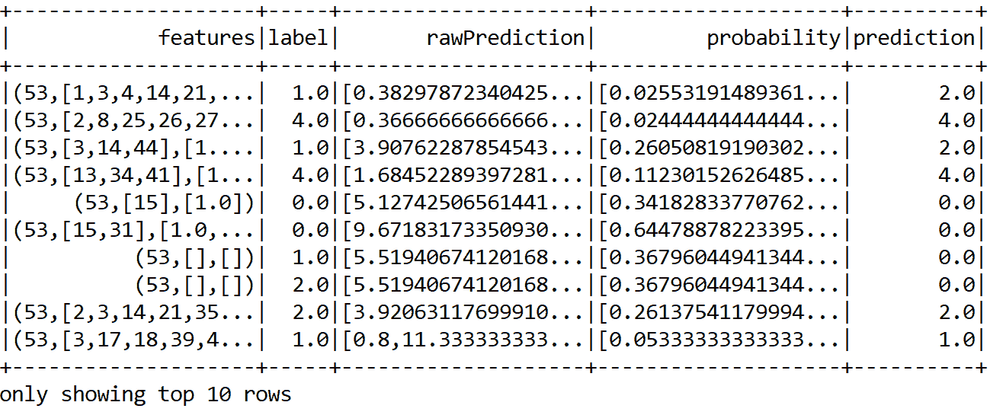

现在让我们计算测试数据的分类`accuracy`、`precision`、`recall`、`f1`测量和误差:

```
val metric = 
new MulticlassClassificationEvaluator()
    .setLabelCol("label")
    .setPredictionCol("prediction")

val evaluator1 = metric.setMetricName("accuracy")
val evaluator2 = metric.setMetricName("weightedPrecision")
val evaluator3 = metric.setMetricName("weightedRecall")
val evaluator4 = metric.setMetricName("f1")
```

最后，我们打印性能指标:

```
val accuracy = evaluator1.evaluate(predictions)
val precision = evaluator2.evaluate(predictions)
val recall = evaluator3.evaluate(predictions)
val f1 = evaluator4.evaluate(predictions)
```

是的，事实证明它是一个更好的表演者。这有点出乎意料，因为我们希望从 DL 模型中获得更好的预测准确性，但我们没有。正如我已经说过的，我们仍然可以尝试 H2O 的其他参数。无论如何，我们现在可以看到使用随机森林大约有 25%的改进。不过，大概，还是可以改进的。

```
println("Accuracy = " + accuracy);
println("Precision = " + precision)
println("Recall = " + recall)
println("F1 = " + f1)
println(s"Test Error = ${1 - accuracy}")
>>>
Accuracy = 0.7196470196470195
Precision = 0.7196470196470195
Recall = 0.7196470196470195
F1 = 0.7196470196470195
Test Error = 0.28035298035298046
```

摘要


# 在本章中，我们看到了如何与 Spark、H2O 和 ADAM 等一些大数据工具进行互操作，以处理大规模基因组数据集。我们将基于 Spark 的 K-means 算法应用于来自 1000 个基因组项目分析的遗传变异数据，目的是在人群规模上聚类基因型变异。

然后，我们应用基于 H2O 的 DL 算法和基于 Spark 的随机森林模型来预测地理种族。此外，我们还学习了如何为 DL 安装和配置 H2O。这些知识将在后面的章节中用到。最后，也是最重要的，我们学习了如何使用 H2O 来计算变量重要性，以便在训练集中选择最重要的特征。

在下一章中，我们将看到如何有效地使用**潜在狄利克雷分配** ( **LDA** )算法在数据中寻找有用的模式。我们将比较其他主题建模算法和 LDA 的可伸缩性。此外，我们将利用**自然语言处理** ( **NLP** )库，如斯坦福 NLP。

In the next chapter, we will see how effectively we can use the **Latent Dirichlet Allocation** (**LDA**) algorithm for finding useful patterns in data. We will compare other topic modeling algorithms and the scalability power of LDA. In addition, we will utilize **Natural Language Processing** (**NLP**) libraries such as Stanford NLP.