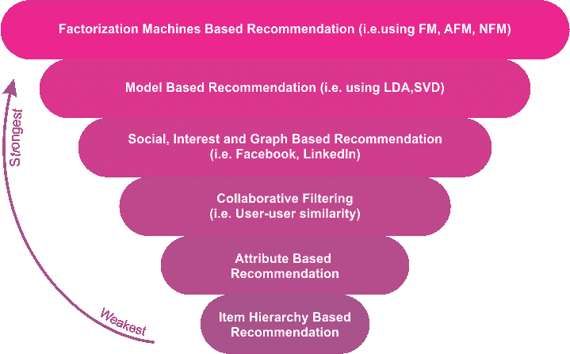
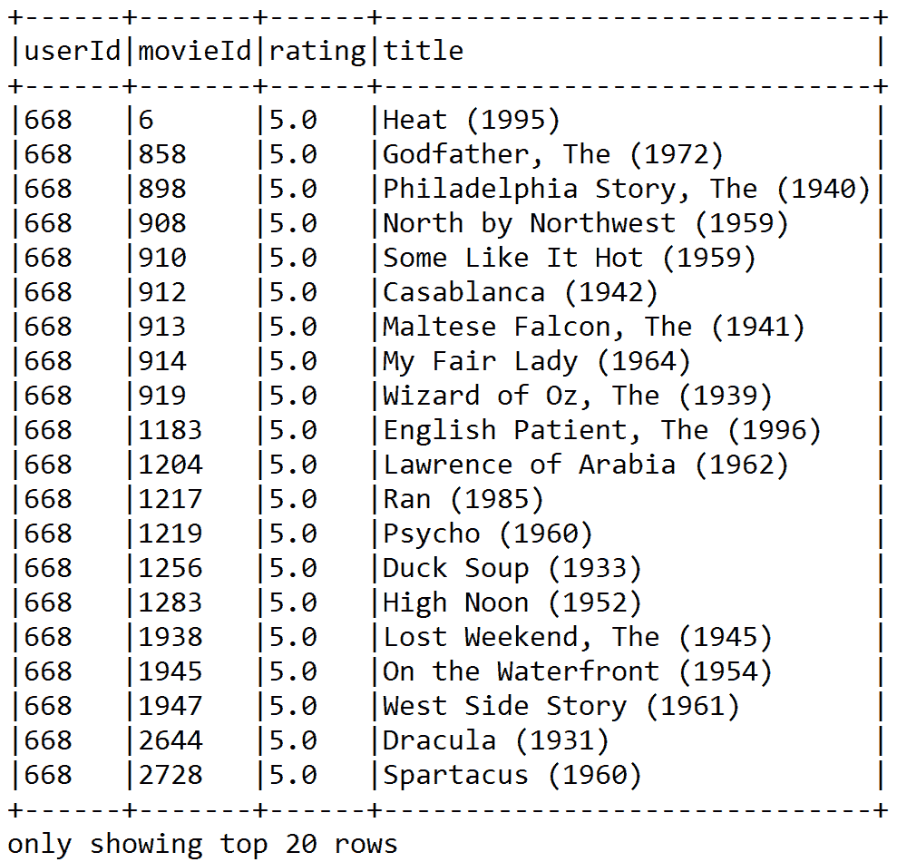
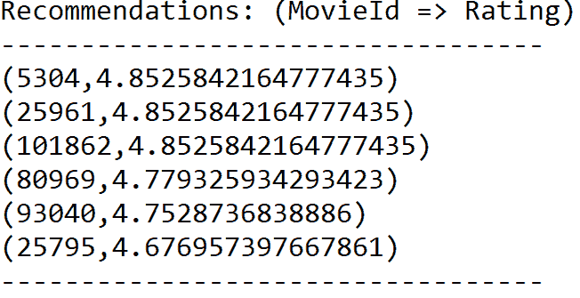
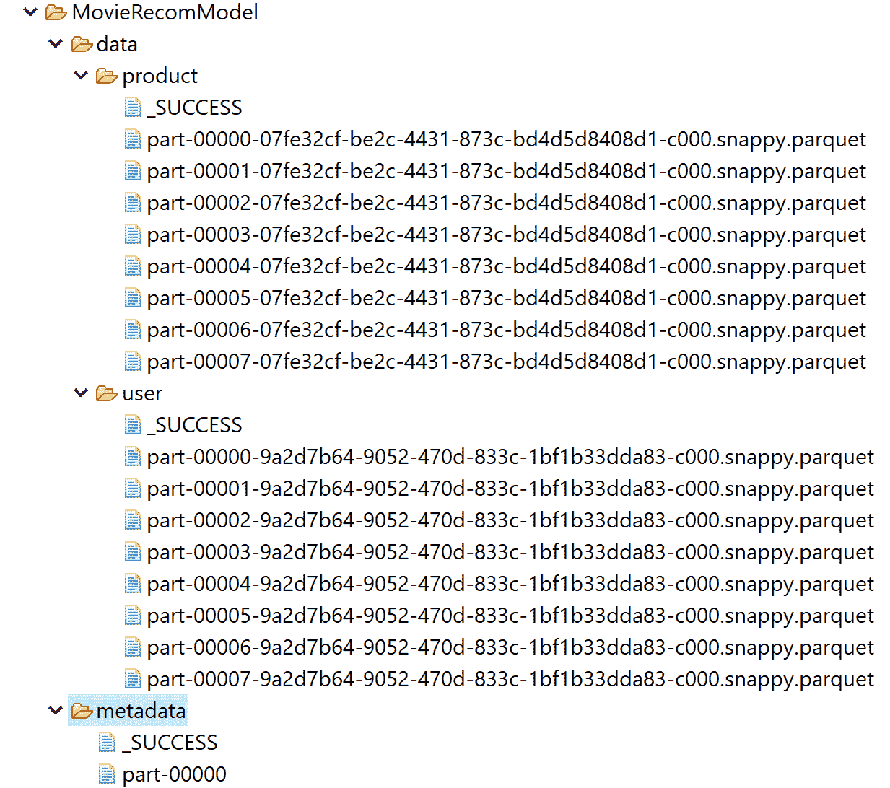

# 六、开发基于模型的电影推荐引擎

网飞是一家美国娱乐公司，由雷德·哈斯汀斯和马克·伦道夫于 1997 年 8 月 29 日在加利福尼亚州的斯科茨谷创立。它专门提供流媒体、在线视频点播和邮寄 DVD。2013 年，网飞进军电影和电视制作以及在线发行领域。网飞使用基于模型的协同过滤方法为其用户提供实时电影推荐。

在这一章中，我们将看到两个端到端的项目，并开发一个基于项目的协同过滤模型，用于电影相似性测量，以及一个基于模型的电影推荐引擎，使用 Spark 为新用户推荐电影。我们将看到如何在 ALS 和**矩阵分解** ( **MF** )之间为这两个可扩展的电影推荐引擎进行互操作。我们将在项目中使用电影镜头数据集。最后，我们将看到如何在生产中部署最佳模型。

简而言之，我们将通过两个端到端项目了解以下主题:

*   推荐系统——如何推荐，为什么推荐？
*   项目 **-** 基于协同过滤的电影相似度
*   基于 Spark 的电影推荐模型 **-**
*   模型部署


# 推荐系统

一个**推荐系统**(即**推荐引擎或** **RE** )是信息过滤系统的一个子类，它根据用户对一个项目的评分来帮助预测**评分**或**偏好**。近年来，推荐系统变得越来越流行。简而言之，推荐系统试图基于其他用户的历史来预测用户可能感兴趣的潜在项目。

因此，它们被用于许多领域，如电影、音乐、新闻、书籍、研究文章、搜索查询、社交标签、产品、合作、喜剧、餐馆、时尚、金融服务、人寿保险和在线约会。有两种方法可以开发推荐引擎，它们通常会生成一个推荐列表，例如，基于内容的协作过滤或基于个性的方法。


# 协同过滤方法

使用协同过滤方法，可以基于用户过去的行为建立 RE，其中对购买的项目给出数字评级。有时，它可以基于也购买了相同商品的其他用户做出的类似决定来开发。从下图中，您可以对不同的推荐系统有所了解:



图 1:不同推荐系统的比较视图

基于协同过滤的方法通常有三个问题——冷启动、可扩展性和稀疏性:

*   **冷启动**:为了做一个更精准的推荐系统，需要大量关于用户的数据时，有时会卡死。
*   **可伸缩性**:从拥有数百万用户和产品的数据集中计算推荐，通常需要大量的计算能力。
*   **稀疏性**:当大量商品在主要电子商务网站上出售时，众包数据集经常会出现这种情况。在这种情况下，活跃用户可能只对售出商品的一小部分进行评级，也就是说，即使是最受欢迎的商品也很少有评级。因此，用户对项目矩阵变得非常稀疏。换句话说，不能处理大规模的稀疏矩阵。

为了克服这些问题，一种特定类型的协同过滤算法使用 MF，一种低秩矩阵近似技术。我们将在本章后面看到一个例子。


# 基于内容的过滤方法

使用基于内容的过滤方法，利用项目的一系列离散特征来推荐具有相似属性的附加项目。有时它是基于项目的描述和用户偏好的配置文件。这些方法试图推荐与用户过去喜欢的或当前正在使用的项目相似的项目。

基于内容的过滤的一个关键问题是，系统是否能够从用户关于一个内容源的操作中学习用户偏好，并在其他内容类型中使用它们。当部署这种类型的 RE 时，它可以用于预测用户感兴趣的项目或项目的评级。


# 混合推荐系统

正如您所看到的，使用协作过滤和基于内容的过滤有几个优点和缺点。因此，为了克服这两种方法的局限性，最近的趋势表明，通过组合协同过滤和基于内容的过滤，混合方法可以更加有效和准确。有时，因子分解方法，如 MF 和**奇异值分解** ( **SVD** )被用来使它们鲁棒。混合方法可以通过多种方式实现:

*   首先，基于内容的预测和基于协作的预测是分开计算的，后来我们将它们结合起来，也就是说，将这两种预测统一到一个模型中。在这种方法中，FM 和 SVD 被广泛使用。
*   将基于内容的功能添加到基于协作的方法中，反之亦然。同样，FM 和 SVD 用于更好的预测。

网飞就是一个很好的例子，它使用这种混合方法向用户进行推荐。该网站以两种方式提供建议:

*   **协同过滤**:通过比较相似用户的观看和搜索习惯
*   **基于内容的过滤**:通过提供与用户高度评价的电影具有共同特征的电影


# 基于模型的协同过滤

如*图 1* 所示，我真的计划用因式分解机来实现一个系统化的项目，结果发现时间很紧。因此，决定使用协作过滤方法来开发电影推荐。基于协同过滤的方法分为:

*   基于内存，即基于用户的算法
*   基于模型的协同过滤，即核映射

在基于模型的协同过滤技术中，用户和产品由一小组因素描述，也称为**潜在因素** ( **LFs** )。然后使用 LFs 来预测丢失的条目。使用**交替最小二乘** ( **ALS** )算法来学习这些 LFs。从计算的角度来看，基于模型的协同过滤通常用于许多公司，如网飞，用于实时电影推荐。


# 效用矩阵

在混合推荐系统中，有两类实体:用户和项目(例如电影、产品等等)。现在，作为用户，您可能对某些项目有偏好。因此，这些偏好必须从关于项目、用户或评级的数据中提取。通常，这些数据被表示为效用矩阵，例如用户-项目对。这种类型的值可以表示用户对特定项目的偏好程度。矩阵中的条目，即表，可以来自有序集合。例如，整数 1-5 可用于表示用户给出的作为项目评级的星的数量。

我们已经讨论过，用户可能经常没有已评级的项目；也就是大部分条目都是**未知**。这也意味着矩阵可能是稀疏的。未知的评级意味着我们没有关于用户对项目的偏好的明确信息。*表 1* 显示了一个效用矩阵示例。该矩阵以 1-5 的尺度表示用户对电影的评级，5 是最高评级。空白条目意味着没有用户提供关于这些电影的任何评级。

这里 **HP1** 、 **HP2** 、 **HP3** 分别是电影**哈利波特一**、**二**和**三**的缩写； **TW** 为**暮光**；而 **SW1** 、 **SW2** 、 **SW3** 分别代表**星球大战**剧集 **1** 、 **2** 和 **3** 。用户用大写字母 **A** 、 **B** 、 **C** 和 **D** 表示:


图 2:效用矩阵(用户与电影矩阵)

用户电影对有许多空白条目。这意味着用户没有对那些电影进行评级。在现实生活中，矩阵可能更稀疏，典型的用户评级只占所有可用电影的一小部分。现在，使用这个矩阵，目标是预测效用矩阵中的空白。让我们看一个例子。假设我们很想知道用户 **A** 是否喜欢 **SW2** 。然而，这确实很难确定，因为在*表 1* 的矩阵中几乎没有证据。

因此，在实践中，我们可以开发一个电影推荐引擎来考虑电影的不常见属性，如制片人姓名、导演姓名、主演，甚至是他们姓名的相似性。这样我们就可以计算出电影 **SW1** 和 **SW2** 的相似度。这种相似性会让我们得出结论，既然 A 不喜欢 **SW1** ，他们也不可能喜欢 **SW2** 。

但是，这可能不适用于较大的数据集。因此，有了更多的数据，我们可能会观察到给 **SW1** 和 **SW2** 评分的人倾向于给他们相似的评分。最后，我们可以得出结论， **A** 也会给 **SW2** 一个低评分，类似于 **A** 对 **SW1** 的评分。


# 基于 Spark 的电影推荐系统

Spark MLlib 中的实现支持基于模型的协作过滤。在基于模型的协同过滤技术中，用户和产品由一小组因素描述，也称为 LFs。在这一节中，我们将看到两个完整的例子，说明它是如何向新用户推荐电影的。


# 基于项目的电影相似性协同过滤

首先，我们从文件中读取评级。对于这个项目，我们可以使用来自[http://www.grouplens.org/node/73](http://www.grouplens.org/node/73)的 MovieLens 100k 评级数据集。训练集分级在名为`ua.base`的文件中，而电影项目数据在`u.item`中。另一方面，`ua.test`包含了评估我们模型的测试集。由于我们将使用该数据集，我们应该感谢明尼苏达大学的 GroupLens 研究项目团队，他们编写了以下文本:

F.麦克斯韦·哈珀和约瑟夫·a·康斯坦。2015.电影镜头数据集:*历史和背景*。ACM Transactions on **交互式智能系统** ( **TiiS** ) 5、4、第 19 条(2015 年 12 月)，19 页。http://dx.doi.org/10.1145/2827872。

该数据集由 943 个用户对 1，682 部电影的 100，000 个 1 到 5 的评级组成。每个用户至少评价了 20 部电影。它还包含用户的简单人口统计信息(年龄、性别、职业和邮政编码)。


# 步骤 1 -导入必要的库并创建 Spark 会话

我们需要导入一个 Spark 会话，以便创建 Spark 会话，这是我们 Spark 应用程序的网关:

```scala
import org.apache.spark.sql.SparkSession 
val spark: SparkSession = SparkSession 
    .builder() 
    .appName("MovieSimilarityApp") 
    .master("local[*]") 
    .config("spark.sql.warehouse.dir", "E:/Exp/") 
    .getOrCreate() 
```


# 步骤 2 -读取和解析数据集

让我们使用 Spark 的`textFile`方法从您的首选存储(比如 HDFS 或本地文件系统)中读取一个文本文件。然而，由我们来指定如何分割字段。在读取输入数据集时，我们首先执行`groupBy`,并在使用`flatMap`操作连接后进行转换，以获得所需的字段:

```scala
val TRAIN_FILENAME = "data/ua.base" 
val TEST_FIELNAME = "data/ua.test" 
val MOVIES_FILENAME = "data/u.item" 

  // get movie names keyed on id 
val movies = spark.sparkContext.textFile(MOVIES_FILENAME) 
    .map(line => { 
      val fields = line.split("\|") 
      (fields(0).toInt, fields(1)) 
    }) 
val movieNames = movies.collectAsMap() 
  // extract (userid, movieid, rating) from ratings data 
val ratings = spark.sparkContext.textFile(TRAIN_FILENAME) 
    .map(line => { 
      val fields = line.split("t") 
      (fields(0).toInt, fields(1).toInt, fields(2).toInt) 
    }) 
```


# 步骤 3 -计算相似性

使用基于项目的协同过滤，我们可以计算两部电影彼此有多相似。我们遵循以下步骤:

1.  对于每一对电影( **A** ， **B** )，我们会找到所有给 **A** 和 **B** 评分的用户
2.  现在，使用前面的评级，我们计算一个电影 **A** 向量，比如说 **X** ，和一个电影 **B** 向量，比如说 **Y**
3.  然后我们计算 **X** 和 **Y** 之间的相关性
4.  如果用户观看电影 **C** ，我们就可以推荐与之最相关的电影

然后，我们计算每个评级向量 **X** 和 **Y** 的各种向量度量，例如大小、点积、范数等等。我们将使用这些度量来计算电影对之间的各种相似性度量，即( **A** ， **B** )。对于每个电影对( **A** ， **B** )，我们然后计算几个度量，例如余弦相似性、Jaccard 相似性相关性和正则化相关性。让我们开始吧。前两步如下:

```scala
// get num raters per movie, keyed on movie id 
val numRatersPerMovie = ratings 
    .groupBy(tup => tup._2) 
    .map(grouped => (grouped._1, grouped._2.size)) 

// join ratings with num raters on movie id 
val ratingsWithSize = ratings 
    .groupBy(tup => tup._2) 
    .join(numRatersPerMovie) 
    .flatMap(joined => { 
      joined._2._1.map(f => (f._1, f._2, f._3, joined._2._2)) 
    }) 
```

`ratingsWithSize`变量现在包含以下字段:`user`、`movie`、`rating`和`numRaters`。下一步是为自加入制作一个评级虚拟副本。从技术上讲，我们加入到`userid`并过滤电影对，这样我们就不会重复计算和排除自我对:

```scala
val ratings2 = ratingsWithSize.keyBy(tup => tup._1) 
val ratingPairs = 
    ratingsWithSize 
      .keyBy(tup => tup._1) 
      .join(ratings2) 
      .filter(f => f._2._1._2 < f._2._2._2) 
```

现在让我们计算每个电影对的相似性度量的原始输入:

```scala
val vectorCalcs = ratingPairs 
      .map(data => { 
        val key = (data._2._1._2, data._2._2._2) 
        val stats = 
          (data._2._1._3 * data._2._2._3, // rating 1 * rating 2 
            data._2._1._3, // rating movie 1 
            data._2._2._3, // rating movie 2 
            math.pow(data._2._1._3, 2), // square of rating movie 1 
            math.pow(data._2._2._3, 2), // square of rating movie 2 
            data._2._1._4, // number of raters movie 1 
            data._2._2._4) // number of raters movie 2 
        (key, stats) 
      }) 
.groupByKey() 
.map(data => { 
    val key = data._1 
    val vals = data._2 
    val size = vals.size 
    val dotProduct = vals.map(f => f._1).sum 
    val ratingSum = vals.map(f => f._2).sum 
    val rating2Sum = vals.map(f => f._3).sum 
    val ratingSq = vals.map(f => f._4).sum 
    val rating2Sq = vals.map(f => f._5).sum 
    val numRaters = vals.map(f => f._6).max 
    val numRaters2 = vals.map(f => f._7).max 
        (key, (size, dotProduct, ratingSum, rating2Sum, ratingSq, rating2Sq, numRaters, numRaters2))}) 
```

下面是计算相似性的第三和第四步。我们计算每个电影对的相似性度量:

```scala
  val similarities = 
    vectorCalcs 
      .map(fields => { 
        val key = fields._1 
        val (size, dotProduct, ratingSum, rating2Sum, ratingNormSq, rating2NormSq, numRaters, numRaters2) = fields._2 
        val corr = correlation(size, dotProduct, ratingSum, rating2Sum, ratingNormSq, rating2NormSq) 
        val regCorr = regularizedCorrelation(size, dotProduct, ratingSum, rating2Sum,ratingNormSq, rating2NormSq, PRIOR_COUNT, PRIOR_CORRELATION) 
        val cosSim = cosineSimilarity(dotProduct, scala.math.sqrt(ratingNormSq), scala.math.sqrt(rating2NormSq)) 
        val jaccard = jaccardSimilarity(size, numRaters, numRaters2) 
        (key, (corr, regCorr, cosSim, jaccard))}) 
```

接下来是我们刚刚使用的方法的实现。我们从计算两个向量( *A* ， *B* )之间相关性的`correlation()`方法开始，即 *cov(A，B)/(stdDev(A) * stdDev(B))* :

```scala
def correlation(size: Double, dotProduct: Double, ratingSum: Double, 
    rating2Sum: Double, ratingNormSq: Double, rating2NormSq: Double) = { 
    val numerator = size * dotProduct - ratingSum * rating2Sum 
    val denominator = scala.math.sqrt(size * ratingNormSq - ratingSum * ratingSum)  
                        scala.math.sqrt(size * rating2NormSq - rating2Sum * rating2Sum) 
    numerator / denominator} 
```

现在，通过在先验上添加虚拟伪计数来正则化相关性，*正则化相关性= w *实际相关性+ (1 - w) *先验相关性其中 w = #实际对/ (#实际对+ #虚拟对)*:

```scala
def regularizedCorrelation(size: Double, dotProduct: Double, ratingSum: Double, 
    rating2Sum: Double, ratingNormSq: Double, rating2NormSq: Double, 
    virtualCount: Double, priorCorrelation: Double) = { 
    val unregularizedCorrelation = correlation(size, dotProduct, ratingSum, rating2Sum, ratingNormSq, rating2NormSq) 
    val w = size / (size + virtualCount) 
    w * unregularizedCorrelation + (1 - w) * priorCorrelation 
  } 
```

两个向量 A，B 之间的余弦相似度为点积(A，B) /(范数(A) *范数(B)):

```scala
def cosineSimilarity(dotProduct: Double, ratingNorm: Double, rating2Norm: Double) = { 
    dotProduct / (ratingNorm * rating2Norm) 
  } 
```

最后，两个集合之间的 Jaccard 相似度 *A* ， *B* 为*|交集(A，B)|/|并集(A，B)|* :

```scala
def jaccardSimilarity(usersInCommon: Double, totalUsers1: Double, totalUsers2: Double) = { 
    val union = totalUsers1 + totalUsers2 - usersInCommon 
    usersInCommon / union 
    } 
```


# 步骤 4 -测试模型

让我们来看看与`Die Hard (1998)`最相似的 10 部电影，按正则化相关性排序:

```scala
evaluateModel("Die Hard (1988)") 
>>>
```


在上图中，这些列是电影 1、电影 2、相关性、注册相关性、余弦相似性和 Jaccard 相似性。现在让我们来看看与《T4》最相似的 10 部电影，按照正则化相关性排序:

```scala
evaluateModel("Postino, Il (1994)") 
>>>
```


最后，我们来看看和`Star Wars (1977)`最相似的 10 部电影，按正则化相关性排序:

```scala
evaluateModel("Star Wars (1977)") 
>>>
```


现在，从输出中，我们可以看到一些电影对只有很少的共同评分者；可以看出，使用原始相关性导致了次优的相似性。虽然余弦相似度是协同过滤方法的标准相似度度量，但是使用余弦相似度的效果并不好。

原因是有很多电影的余弦相似度都是 1.0。顺便说一下，前面的`evaluateModel()`方法测试了几部电影(用相关的电影名替换 contains 调用)，如下所示:

```scala
def evaluateModel(movieName: String): Unit = { 
    val sample = similarities.filter(m => { 
    val movies = m._1
    (movieNames(movies._1).contains(movieName)) 
    }) 
// collect results, excluding NaNs if applicable 
val result = sample.map(v => { 
val m1 = v._1._1 
val m2 = v._1._2 
val corr = v._2._1 
val rcorr = v._2._2 
val cos = v._2._3 
val j = v._2._4 
(movieNames(m1), movieNames(m2), corr, rcorr, cos, j) 
}).collect().filter(e => !(e._4 equals Double.NaN)) // test for NaNs must use equals rather than == 
      .sortBy(elem => elem._4).take(10) 
    // print the top 10 out 
result.foreach(r => println(r._1 + " | " + r._2 + " | " + r._3.formatted("%2.4f") + " | " + r._4.formatted("%2.4f") 
      + " | " + r._5.formatted("%2.4f") + " | " + r._6.formatted("%2.4f"))) } 
```

您可以理解这些基于协作过滤的方法的局限性。当然有计算上的复杂性，但是你说对了一部分。最重要的方面是，这些不具备预测真实用例中缺失条目的能力。它们也有一些已经提到的问题，比如冷启动、可伸缩性和稀疏性。因此，我们将看到如何在 Spark MLlib 中使用基于模型的推荐系统来改善这些限制。


# 基于 Spark 模型的推荐

为了对任何用户进行偏好预测，协作过滤使用具有相似兴趣的其他用户的偏好，并预测你感兴趣的电影，而这些电影是你所不知道的。Spark MLlib 使用**交替最小二乘法** ( **ALS** )进行推荐。下面是 ALS 算法中使用的一种协作过滤方法:

**表 1–用户-电影矩阵**

| **用户** | **M1** | **M2** | **M3** | **M4** |
| **U1** | 2 | 四 | 3 | 一 |
| **U2** | 0 | 0 | 四 | 四 |
| **U3** | 3 | 2 | 2 | 3 |
| **U4** | 2 | ？ | 3 | ？ |

在上表中，用户对电影的评级表示为一个矩阵(即用户项目矩阵)，其中一个单元格表示用户对特定电影的评级。有**的牢房？**代表用户 **U4** 不知道或没有看过的电影。基于当前偏好的 **U4** ，带有**的单元格？**可以填写与 **U4** 兴趣相似的用户的大致评分。因此，在这一点上，ALS 不能单独完成，但 LFs 随后被用于预测丢失的条目。

Spark API 提供 ALS 算法的实现，用于根据以下六个参数学习这些 LFs:

*   `numBlocks`:这是用于并行计算的块数(设置为-1 自动配置)。
*   `rank`:这是模型中 LFs 的数量。
*   `iterations`:这是 ALS 运行的迭代次数。ALS 通常在 20 次或更少的迭代中收敛到合理的解。
*   `lambda`:指定 ALS 中的正则化参数。
*   `implicitPrefs`:指定是否将 ALS 变量(或用户定义的变量)的显式反馈用于隐式反馈数据。
*   `alpha`:这是一个适用于 ALS 隐式反馈变量的参数，控制偏好观察的基线置信度。

注意，要用缺省参数构建 ALS 实例，可以根据需要设置值。默认值如下:`numBlocks: -1`、`rank: 10`、`iterations: 10`、`lambda: 0.01`、`implicitPrefs: false`和`alpha: 1.0`。


# 数据探索

电影和相应的评分数据集是从 MovieLens 网站([https://movielens.org](https://movielens.org))下载的。根据 MovieLens 网站上的数据描述，所有的评分都是在`ratings.csv`文件中描述的。这个文件的每一行，后跟标题，代表一个用户对一部电影的评价。

CSV 数据集包含以下几列:`userId`、`movieId`、`rating`和`timestamp`。这些如*图 14* 所示。行首先由`userId`排序，在用户内部由`movieId`排序。评级以五星为单位，增量为半星(0.5 星到总共 5.0 星)。时间戳代表自 1970 年 1 月 1 日**协调世界时** ( **UTC** )午夜以来的秒数。668 位用户对 10，325 部电影进行了 105，339 次评分:

****

图 2:评级数据集的快照

另一方面，电影信息包含在`movies.csv`文件中。除了标题信息，每一行都代表一部包含这些列的电影:`movieId`、`title`和`genres`(见*图 2* )。电影标题可以手动创建或插入，也可以从[https://www.themoviedb.org/](https://www.themoviedb.org/)的电影数据库网站导入。然而，发布年份显示在括号中。

由于电影标题是手动插入的，因此这些标题中可能存在一些错误或不一致。因此，建议读者检查 https://www.imdb.com/的 IMDb 数据库()，以确保没有与相应发行年份不一致或不正确的标题:


图 3:前 20 部电影的标题和类型

流派位于单独的列表中，从以下流派类别中选择:

*   动作、冒险、动画、儿童、喜剧和犯罪
*   纪录片、剧情片、奇幻片、黑色电影、恐怖片和音乐剧
*   神秘、浪漫、科幻、惊悚、西部和战争


# 使用 ALS 推荐电影

在这一小节中，我们将通过一个系统的例子向你展示如何向其他用户推荐电影，从数据收集到电影推荐。


# 步骤 1 -导入包、加载、解析和浏览电影和分级数据集

我们将加载、解析和做一些探索性的分析。但是，在此之前，让我们导入必要的包和库:

```scala
package com.packt.ScalaML.MovieRecommendation 
import org.apache.spark.sql.SparkSession 
import org.apache.spark.mllib.recommendation.ALS 
import org.apache.spark.mllib.recommendation.MatrixFactorizationModel 
import org.apache.spark.mllib.recommendation.Rating 
import scala.Tuple2 
import org.apache.spark.rdd.RDD 
```

这段代码应该会返回评级的数据框架:

```scala
val ratigsFile = "data/ratings.csv"
val df1 = spark.read.format("com.databricks.spark.csv").option("header", true).load(ratigsFile)    
val ratingsDF = df1.select(df1.col("userId"), df1.col("movieId"), df1.col("rating"), df1.col("timestamp"))
ratingsDF.show(false)
```

以下代码段向您展示了电影的数据帧:

```scala
val moviesFile = "data/movies.csv"
val df2 = spark.read.format("com.databricks.spark.csv").option("header", "true").load(moviesFile)
val moviesDF = df2.select(df2.col("movieId"), df2.col("title"), df2.col("genres"))
```


# 步骤 2 -将两个数据帧都注册为临时表，以便于查询

要注册这两个数据集，我们可以使用以下代码:

```scala
ratingsDF.createOrReplaceTempView("ratings")
moviesDF.createOrReplaceTempView("movies")
```

通过在内存中创建一个临时视图作为表，这将有助于加快内存中的查询。使用`createOrReplaceTempView ()`方法的临时表的生命周期与用于创建该数据帧的`[[SparkSession]]`相关联。


# 步骤 3 -浏览和查询相关统计数据

让我们检查一下与收视率相关的统计数据。只需使用以下代码行:

```scala
val numRatings = ratingsDF.count()
val numUsers = ratingsDF.select(ratingsDF.col("userId")).distinct().count()
val numMovies = ratingsDF.select(ratingsDF.col("movieId")).distinct().count() 
println("Got " + numRatings + " ratings from " + numUsers + " users on " + numMovies + " movies.") 
>>>
Got 105339 ratings from 668 users on 10325 movies.
```

你应该可以在`10,325`电影上找到`668`用户的`105,339`评分。现在，让我们来看看最高和最低评分，以及对一部电影进行评分的用户数量。但是，您需要对我们在上一步中刚刚在内存中创建的评级表执行 SQL 查询。这里的查询很简单，类似于从 MySQL 数据库或 RDBMS 进行查询。

但是，如果您不熟悉基于 SQL 的查询，建议您查看 SQL 查询规范，了解如何使用`SELECT`从特定表中执行选择，如何使用`ORDER`执行排序，以及如何使用`JOIN`关键字执行连接操作。如果您知道 SQL 查询，您应该使用复杂的 SQL 查询获得一个新的数据集，如下所示:

```scala
// Get the max, min ratings along with the count of users who have rated a movie.
val results = spark.sql("select movies.title, movierates.maxr, movierates.minr, movierates.cntu "
       + "from(SELECT ratings.movieId,max(ratings.rating) as maxr,"
       + "min(ratings.rating) as minr,count(distinct userId) as cntu "
       + "FROM ratings group by ratings.movieId) movierates "
       + "join movies on movierates.movieId=movies.movieId " + "order by movierates.cntu desc") 
results.show(false) 
```

输出:


图 4:最高和最低评分以及对电影进行评分的用户数量

为了获得一些洞察力，我们需要更多地了解用户和他们的评级。现在让我们找出 10 个最活跃的用户，以及他们给一部电影评分的次数:

```scala
val mostActiveUsersSchemaRDD = spark.sql("SELECT ratings.userId, count(*) as ct from ratings "+ "group by ratings.userId order by ct desc limit 10")
mostActiveUsersSchemaRDD.show(false) 
>>> 
```


图 5:前 10 名活跃用户和他们给电影评分的次数

让我们来看看一个特定的用户，并找到电影，比如说用户，`668`评分高于`4`:

```scala
val results2 = spark.sql( 
              "SELECT ratings.userId, ratings.movieId,"  
              + "ratings.rating, movies.title FROM ratings JOIN movies" 
              + "ON movies.movieId=ratings.movieId"  
              + "where ratings.userId=668 and ratings.rating > 4") 
results2.show(false) 
>>>
```



图 6:用户 668 评分高于 4 的电影


# 步骤 4 -准备培训和测试评级数据并检查计数

以下代码将评级 RDD 分为培训数据 RDD (75%)和测试数据 RDD (25%)。此处的种子是可选的，但出于再现性目的是必需的:

```scala
// Split ratings RDD into training RDD (75%) & test RDD (25%) 
val splits = ratingsDF.randomSplit(Array(0.75, 0.25), seed = 12345L) 
val (trainingData, testData) = (splits(0), splits(1)) 
val numTraining = trainingData.count() 
val numTest = testData.count() 
println("Training: " + numTraining + " test: " + numTest)
```

您应该注意到，在培训中有 78，792 个评级，在测试数据框架中有 26，547 个评级。


# 步骤 5 -为使用 ALS 构建推荐模型准备数据

ALS 算法采用评级的 RDD 进行训练。为此，以下代码说明了如何使用 API 构建建议模型:

```scala
val ratingsRDD = trainingData.rdd.map(row => { 
                    val userId = row.getString(0) 
                    val movieId = row.getString(1) 
                    val ratings = row.getString(2) 
                    Rating(userId.toInt, movieId.toInt, ratings.toDouble)
})
```

`ratingsRDD`是一个评级 RDD，包含`userId`、`movieId`，以及我们在上一步中准备的训练数据集中的相应评级。另一方面，评估模型也需要测试 RDD。下面的`testRDD`也包含来自我们在上一步中准备的测试数据帧的相同信息:

```scala
val testRDD = testData.rdd.map(row => { 
    val userId = row.getString(0) 
    val movieId = row.getString(1) 
    val ratings = row.getString(2) 
    Rating(userId.toInt, movieId.toInt, ratings.toDouble)
})
```


# 步骤 6 -建立 ALS 用户产品矩阵

通过指定最大迭代、块数、alpha、rank、lambda、seed 和`implicitPrefs`，建立基于`ratingsRDD`的 ALS 用户矩阵模型。本质上，这种技术基于对其他电影给出类似评级的其他用户对这些电影的评级来预测特定用户和特定电影的缺失评级:

```scala
val rank = 20 
val numIterations = 15 
val lambda = 0.10 
val alpha = 1.00 val block = -1 
val seed = 12345L 
val implicitPrefs = false 

val model = new ALS().setIterations(numIterations)
        .setBlocks(block).setAlpha(alpha)
        .setLambda(lambda)
        .setRank(rank) .setSeed(seed)
        .setImplicitPrefs(implicitPrefs)
        .run(ratingsRDD)
```

最后，我们对模型进行了 15 次迭代学习。通过这种设置，我们获得了良好的预测精度。建议读者应用超参数调整来了解这些参数的最佳值。此外，设置用户块和产品块的块数，以便针对自动配置的块数将计算并行化为 pass -1。该值为-1。


# 第七步-做预测

让我们来获得用户`668`的六大电影预测。以下源代码可用于进行预测:

```scala
// Making Predictions. Get the top 6 movie predictions for user 668 
println("Rating:(UserID, MovieID, Rating)") println("----------------------------------") 
val topRecsForUser = model.recommendProducts(668, 6) for (rating <- topRecsForUser) { println(rating.toString()) } println("----------------------------------")
>>>
```


图 7:用户 668 的前六部电影预测


# 步骤 8 -评估模型

为了验证模型的质量，使用**均方根误差** ( **RMSE** )来衡量模型预测值与实际观测值之间的差异。默认情况下，计算误差越小，模型越好。为了测试模型的质量，使用测试数据(在*步骤 4* 中拆分)。

根据许多机器学习从业者的说法，RMSE 是一种很好的准确性衡量标准，但仅用于比较不同模型对特定变量的预测误差。他们说它不适合在变量之间进行比较，因为它依赖于尺度。以下代码行计算使用定型集定型的模型的 RMSE 值:

```scala
val rmseTest = computeRmse(model, testRDD, true) 
println("Test RMSE: = " + rmseTest) //Less is better
```

对于此设置，我们得到以下输出:

```scala
Test RMSE: = 0.9019872589764073
```

此方法计算 RMSE 来评估模型。RMSE 越小，模型及其预测能力越好。需要注意的是`computeRmse()`是一个 UDF，如下所示:

```scala
def computeRmse(model: MatrixFactorizationModel, data: RDD[Rating], implicitPrefs: Boolean): Double = {         val predictions: RDD[Rating] = model.predict(data.map(x => (x.user, x.product))) 
    val predictionsAndRatings = predictions.map { x => ((x.user, x.product), x.rating) }
        .join(data.map(x => ((x.user, x.product), x.rating))).values 
    if (implicitPrefs) { println("(Prediction, Rating)")                 
        println(predictionsAndRatings.take(5).mkString("n")) } 
        math.sqrt(predictionsAndRatings.map(x => (x._1 - x._2) * (x._1 - x._2)).mean()) 
    }
>>>
```


最后，让我们为特定用户提供一些电影推荐。让我们来看看用户`668`的六大电影预测:

```scala
println("Recommendations: (MovieId => Rating)") 
println("----------------------------------") 
val recommendationsUser = model.recommendProducts(668, 6) 
recommendationsUser.map(rating => (rating.product, rating.rating)).foreach(println) println("----------------------------------")
>>>
```



我们认为，前面型号的性能可以进一步提高。然而，到目前为止，就我们所知，还没有模型调整工具可用于基于 MLlib 的 ALS 算法。

感兴趣的读者应该参考这个网址，了解更多关于调优基于 ML 的 ALS 模型的信息:[https://spark . Apache . org/docs/preview/ML-collaborative-filtering . html](https://spark.apache.org/docs/preview/ml-collaborative-filtering.html)。


# 选择和部署最佳模型

值得一提的是，在第一个项目中开发的第一个模型不能持久，因为它只是计算电影相似性的几行代码。它还有另一个我们之前没有提到的限制。它可以计算两部电影之间的相似度，但超过两部电影呢？坦率地说，像第一个这样的模型很少会被部署到现实生活的电影中。因此，让我们转而关注基于模型的推荐引擎。

尽管来自用户的评分会不断到来，但存储当前的评分还是值得的。因此，我们还想保留当前的基本模型供以后使用，以便在启动服务器时节省时间。想法是使用当前的模型进行实时电影推荐。

然而，如果我们持久化一些已经生成的 rdd，尤其是那些需要更长时间处理的 rdd，我们也可以节省时间。下面一行保存了我们训练过的 ALS 模型(详见`MovieRecommendation.scala`脚本):

```scala
//Saving the model for future use 
val savedALSModel = model.save(spark.sparkContext, "model/MovieRecomModel")
```

与另一个 Spark 模型不同，我们保存的 ALS 模型将只包含来自培训的 parquet 格式的数据和一些元数据，如下面的屏幕截图所示:



现在，下一个任务是恢复同一个模型，并提供类似的工作流，如前面的步骤所示:

```scala
val same_model = MatrixFactorizationModel.load(spark.sparkContext, "model/MovieRecomModel/")
```

尽管如此，我不会让你感到困惑，尤其是如果你是 Spark 和 Scala 的新手。下面是预测用户 558 评分的完整代码:

```scala
package com.packt.ScalaML.MovieRecommendation 

import org.apache.spark.sql.SparkSession 
import org.apache.spark.mllib.recommendation.ALS 
import org.apache.spark.mllib.recommendation.MatrixFactorizationModel 
import org.apache.spark.mllib.recommendation.Rating 
import scala.Tuple2 
import org.apache.spark.rdd.RDD 

object RecommendationModelReuse { 
 def main(args: Array[String]): Unit = { 
 val spark: SparkSession = SparkSession.builder()
                                  .appName("JavaLDAExample")
                                  .master("local[*]")
                                  .config("spark.sql.warehouse.dir", "E:/Exp/")
                                  .getOrCreate() 

 val ratigsFile = "data/ratings.csv" 
 val ratingDF =  spark.read
                        .format("com.databricks.spark.csv")
                        .option("header", true)
                        .load(ratigsFile) 

 val selectedRatingsDF = ratingDF.select(ratingDF.col("userId"), ratingDF.col("movieId"),                                                     ratingDF.col("rating"), ratingDF.col("timestamp")) 

        // Randomly split ratings RDD into training data RDD (75%) and test data RDD (25%) 
        val splits = selectedRatingsDF.randomSplit(Array(0.75, 0.25), seed = 12345L) 
        val testData = splits(1) 
        val testRDD = testData.rdd.map(row => { 
        val userId = row.getString(0) 
        val movieId = row.getString(1) 
        val ratings = row.getString(2) 
        Rating(userId.toInt, movieId.toInt, ratings.toDouble) }) 

        //Load the workflow back 
        val same_model = MatrixFactorizationModel.load(spark.sparkContext, "model/MovieRecomModel/") 

        // Making Predictions. Get the top 6 movie predictions for user 668 
        println("Rating:(UserID, MovieID, Rating)") 
        println("----------------------------------") 
        val topRecsForUser = same_model.recommendProducts(458, 10) 

        for (rating <- topRecsForUser) { 
            println(rating.toString()) } 

        println("----------------------------------") 
        val rmseTest = MovieRecommendation.computeRmse(same_model, testRDD, true) 
        println("Test RMSE: = " + rmseTest) //Less is better 

        //Movie recommendation for a specific user. Get the top 6 movie predictions for user 668 
        println("Recommendations: (MovieId => Rating)") 
        println("----------------------------------") 
        val recommendationsUser = same_model.recommendProducts(458, 10) 

        recommendationsUser.map(rating => 
        (rating.product, rating.rating)).foreach(println) 
        println("----------------------------------") 
        spark.stop() 
    } 
}
```

如果前面的脚本成功执行，您应该会看到以下输出:


干得好！我们成功地重用了该模型，并对不同的用户(即 558)进行了相同的预测。然而，可能由于数据的随机性，我们观察到了略有不同的 RMSE。


# 摘要

在这一章中，我们实现了两个端到端的项目来开发基于项目的协同过滤，用于电影相似性度量和基于模型的推荐。我们还看到了如何在 ALS 和 MF 之间进行互操作，以及如何开发可伸缩的电影推荐引擎。最后，我们看到了如何在生产中部署这个模型。

作为人类，我们从过去的经历中学习。我们变得如此迷人并非偶然。多年来积极的赞美和批评都有助于塑造我们今天的样子。通过与朋友、家人甚至陌生人的互动，你学会了什么能让人们快乐，通过尝试不同的肌肉运动直到它发出咔嗒声，你学会了如何骑自行车。当你采取行动时，你有时会立即得到回报。这都是关于**强化学习** ( **RL** )。

下一章是关于设计一个由批评和奖励驱动的机器学习项目。我们将看到如何使用真实的 IBM 股票和期权价格数据集将 RL 算法应用于开发期权交易应用程序。