# 基于深度神经网络的银行电话营销客户签约评估

在本章中，我们将看到两个示例，说明如何在银行营销数据集上使用 H2O 构建非常稳健和准确的预测模型进行预测分析。该数据与一家葡萄牙银行机构的直接营销活动有关。营销活动以电话为基础。这个端到端项目的目标是预测客户将订阅定期存款。

在整个项目中，本章将涵盖以下主题:

*   客户订阅评估
*   数据集描述
*   数据集的探索性分析
*   使用 H2O 进行客户订阅评估
*   调谐超参数


# 通过电话营销进行客户订购评估

前一段时间，由于全球金融危机，银行在国际市场获得信贷变得更加受限。这将注意力转向内部客户及其存款，以筹集资金。这导致了对有关客户存款行为以及他们对银行定期开展的电话营销活动的反应的信息的需求。通常，为了评估产品(银行定期存款)是否会被(**是**)认购或(**否**)认购，需要与同一客户进行多次联系。

这个项目的目的是实现一个 ML 模型，预测客户将订阅定期存款(变量`y`)。简而言之，这是一个二元分类问题。现在，在我们开始实现我们的应用程序之前，我们需要了解数据集。然后我们将看到数据集的解释性分析。


# 数据集描述

我要感谢两个来源。Moro 等人于 2014 年 6 月在 Elsevier 出版的《决策支持系统》中发表的一篇研究论文中使用了该数据集。后来，它被捐赠给了 UCI 机器学习知识库，可以从 https://archive.ics.uci.edu/ml/datasets/bank+marketing[下载。根据数据集描述，有四个数据集:](https://archive.ics.uci.edu/ml/datasets/bank+marketing)

*   `bank-additional-full.csv`:这包括所有示例(41，188)和 20 个输入，按日期排序(从 2008 年 5 月到 2010 年 11 月)，非常接近 Moro 等人 2014 年分析的数据
*   `bank-additional.csv`:这包括 10%的例子(4，119)，从 1 到 20 个输入中随机选择
*   `bank-full.csv`:这包括所有的例子和 17 个输入，按日期排序(这个数据集的旧版本，输入较少)
*   `bank.csv`:这包括 10%的示例和从三个示例中随机选择的 17 个输入(此数据集的旧版本，输入较少)

数据集中有 21 个属性。独立变量，即特征，可以进一步分类为银行-客户相关数据(属性 1 至 7)、与当前活动的最后联系相关的数据(属性 8 至 11)、其他属性(属性 12 至 15)以及社会和经济背景属性(属性 16 至 20)。因变量由最后一个属性(21)指定`y`:

| **ID** | **属性** | **解释** |
| 一 | `age` | 数字中的年龄。 |
| 2 | `job` | 这是一种分类格式的作业类型，可能的值有:`admin`、`blue-collar`、`entrepreneur`、`housemaid`、`management`、`retired`、`self-employed`、`services`、`student`、`technician`、`unemployed`和`unknown`。 |
| 3 | `marital` | 这是分类格式的婚姻状况，可能的值有:`divorced`、`married`、`single`和`unknown`。在这里，`divorced`是离婚或丧偶的意思。 |
| 四 | `education` | 这是分类格式的教育背景，可能的值如下:`basic.4y`、`basic.6y`、`basic.9y`、`high.school`、`illiterate`、`professional.course`、`university.degree`和`unknown`。 |
| 5 | `default` | 这是一种分类格式，在默认情况下，贷方的可能值为`no`、`yes`和`unknown`。 |
| 6 | `housing` | 客户有住房贷款吗？ |
| 七 | `loan` | 分类格式的个人贷款，可能值为`no`、`yes`和`unknown`。 |
| 8 | `contact` | 这是分类格式的联系信息类型。可能的值是`cellular`和`telephone`。 |
| 9 | `month` | 这是一年中最后一个联系月份，以分类格式表示，可能值为`jan`、`feb`、`mar`，...、`nov`和`dec`。 |
| 10 | `day_of_week` | 这是一周的最后一个联系日，以分类格式表示，可能值为`mon`、`tue`、`wed`、`thu`和`fri`。 |
| 11 | `duration` | 这是最后一次联系持续时间，以秒为单位(数值)。该属性高度影响输出目标(例如，如果`duration=0`，则`y=no`)。然而，在执行呼叫之前，持续时间是未知的。还有，通话结束后，`y`显然是知道了。因此，该输入应仅用于基准测试目的，如果目的是获得现实的预测模型，则应丢弃。 |
| 12 | `campaign` | 这是在此活动期间为此客户执行的联系次数。 |
| 13 | `pdays` | 这是上一个活动最后一次联系客户端后经过的天数(数字；999 表示之前没有联系过客户)。 |
| 14 | `previous` | 这是在此活动之前为此客户执行的联系次数(数字)。 |
| 15 | `poutcome` | 之前营销活动的结果(分类:`failure`、`nonexistent`和`success`)。 |
| 16 | `emp.var.rate` | 就业变化率—季度指标(数字)。 |
| 17 | `cons.price.idx` | 消费者价格指数—月度指标(数字)。 |
| 18 | `cons.conf.idx` | 消费者信心指数—月度指标(数字)。 |
| 19 | `euribor3m` | Euribor 3 个月利率—每日指标(数字)。 |
| 20 | `nr.employed` | 员工数量—季度指标(数字)。 |
| 21 | `y` | 表示客户是否已认购定期存款。它有可能的二进制值(`yes`和`no`)。 |

表 1:银行营销数据集的描述

对于数据集的探索性分析，我们将使用 Apache Zeppelin 和 Spark。我们将从可视化分类特征的分布开始，然后是数字特征。最后，我们将计算一些描述数字特征的统计数据。但在此之前，我们先配置一下 Zeppelin。


# Apache Zeppelin 的安装和入门

Apache Zeppelin 是一个基于网络的笔记本，使您能够以互动的方式进行数据分析。使用 Zeppelin，您可以用 SQL、Scala 等创建漂亮的、数据驱动的、交互式的协作文档。Apache Zeppelin 解释器概念允许任何语言/数据处理后端插入 Zeppelin。目前，Apache Zeppelin 支持许多解释器，如 Apache Spark、Python、JDBC、Markdown 和 Shell。

Apache Zeppelin 是来自 Apache Software Foundation 的一项相对较新的技术，它使数据科学家、工程师和从业者能够使用多种编程语言后端(如 Python、Scala、Hive、SparkSQL、Shell、Markdown 等)进行数据探索、可视化、共享和协作。由于使用其他解释器不是本书的目标，我们将在 Zeppelin 上使用 Spark，所有代码都将使用 Scala 编写。因此，在本节中，我们将向您展示如何使用只包含 Spark 解释器的二进制包来配置 Zeppelin。Apache Zeppelin 正式支持以下环境，并在这些环境中进行了测试:

| **要求** | **值/版本** |
| 甲骨文 JDK 公司 | 1.7+
(设置`JAVA_HOME`) |
| 操作系统（Operating System） | Mac OS X
Ubuntu 14。X+
厘斯 6。x+
SP1 视窗 7 专业版 |

如上表所示，在 Zeppelin 上执行 Spark 代码需要 Java。因此，如果没有设置，请在前面提到的任何平台上安装和设置 java。阿帕奇飞艇的最新版本可以从 https://zeppelin.apache.org/download.html 的[下载。每个版本都有三个选项:](https://zeppelin.apache.org/download.html)

*   **包含所有解释器的二进制包**:包含对许多解释器的所有支持。例如，Spark、JDBC、Pig、Beam、Scio、BigQuery、Python、Livy、HDFS、Alluxio、Hbase、burning、Elasticsearch、Angular、Markdown、Shell、Flink、Hive、Tajo、Cassandra、Geode、Ignite、Kylin、Lens、Phoenix 和 PostgreSQL 目前在 Zeppelin 中得到支持。
*   **带 Spark 解释器的二进制包**:通常，这个包只包含 Spark 解释器。它还包含一个解释器网络安装脚本。
*   来源:你也可以用 GitHub 库的所有最新变化来构建 Zeppelin(稍后会详细介绍)。为了向您展示如何安装和配置 Zeppelin，我们从这个站点的镜像下载了二进制包。一旦你下载了它，解压到你机器的某个地方。假设你解压文件的路径是`/home/Zeppelin/`。


# 从源头开始构建

您还可以使用 GitHub 资源库中的所有最新更改来构建 Zeppelin。如果要从源代码构建，必须首先安装以下依赖项:

*   **Git** :任何版本
*   **Maven** : 3.1.x 以上
*   **JDK** : 1.7 或更高

如果您还没有安装 Git 和 Maven，请在[http://zeppelin . Apache . org/docs/latest/install/Build . html # Build-requirements](http://zeppelin.apache.org/docs/latest/install/build.html#build-requirements)查看构建要求。由于篇幅所限，我们没有详细讨论所有步骤。感兴趣的读者应该参考这个网址，更多细节请访问阿帕奇齐柏林飞艇网站，地址是[http://zeppelin.apache.org/](http://zeppelin.apache.org/)。


# 启动和停止 Apache Zeppelin

在所有类似 UNIX 的平台(如 Ubuntu、Mac 等)上，使用以下命令:

```
$ bin/zeppelin-daemon.sh start
```

如果上述命令成功执行，您应该在终端上观察到以下日志:


图 1:从 Ubuntu 终端启动 Zeppelin

如果您在 Windows 上，请使用以下命令:

```
$ binzeppelin.cmd 
```

Zeppelin 成功启动后，用你的网络浏览器进入`http://localhost:8080`，你会看到 Zeppelin 正在运行。更具体地说，您将在浏览器上看到:


图 2: Zeppelin 运行在 http://localhost:8080 上

恭喜你！您已经成功安装了阿帕奇齐柏林飞艇！现在让我们在`http://localhost:8080/`的浏览器上访问 Zeppelin，一旦我们配置好首选解释器，就开始我们的数据分析。现在，要从命令行停止 Zeppelin，发出以下命令:

```
$ bin/zeppelin-daemon.sh stop
```


# 创建笔记本

一旦你上了`http://localhost:8080/`，你可以探索不同的选项和菜单，帮助你了解如何熟悉 Zeppelin。更多关于齐柏林飞艇及其用户友好界面的信息，感兴趣的读者可以参考[http://zeppelin.apache.org/docs/latest/](http://zeppelin.apache.org/docs/latest/)。现在，让我们首先创建一个示例笔记本，然后开始。如下图所示，您可以通过点击*图 2* 中的新建笔记选项来创建一个新的笔记本:


图 3:创建一个样本 Zeppelin 笔记本

如*图 3* 所示，默认解释器选择为 Spark。在下拉列表中，您将只看到 Spark，因为您已经为 Zeppelin 下载了 Spark-only 二进制包。


# 数据集的探索性分析

干得好！我们已经能够安装、配置并开始使用 Zeppelin。现在我们走吧。我们将看到变量是如何与标签相关联的。我们首先在 Apache 中加载数据集，如下所示:

```
val trainDF = spark.read.option("inferSchema", "true")
            .format("com.databricks.spark.csv")
            .option("delimiter", ";")
            .option("header", "true")
            .load("data/bank-additional-full.csv")
trainDF.registerTempTable("trainData")
```


# 标签分发

我们来看看班级分布。为此，我们将使用 SQL 解释器。只需在 Zeppelin 笔记本上执行以下 SQL 查询:

```
%sql select y, count(1) from trainData group by y order by y
>>>
```


# 工作分配

现在让我们看看职位与订阅决策是否有任何关联:

```
%sql select job,y, count(1) from trainData group by job, y order by job, y
```

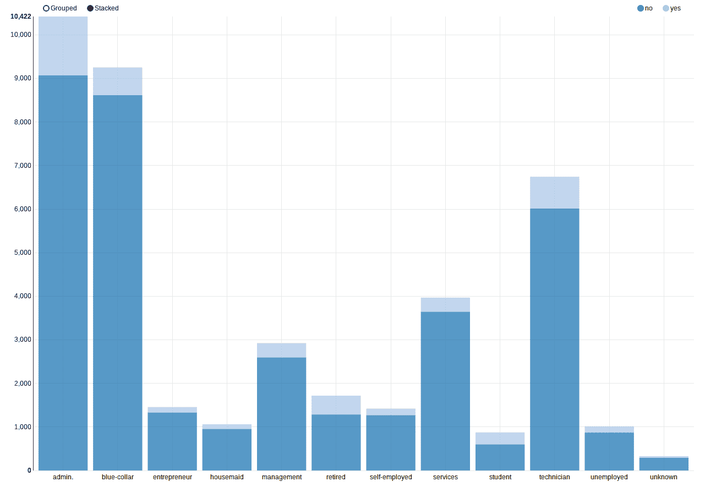

从图表中我们可以看到，大多数客户的工作是行政、蓝领或技术人员，而学生和退休客户的比例最大。


# 婚姻分配

婚姻状况与认购决策有关联吗？让我们看看:

```
%sql select marital,y, count(1) from trainData group by marital,y order by marital,y
>>>
```


这种分布表明，无论客户的婚姻状况如何，订阅都与实例的数量成比例。


# 教育分布

现在，让我们看看教育状况是否与订阅决定相关:

```
%sql select education,y, count(1) from trainData group by education,y order by education,y
```


因此，类似于婚姻状况，教育水平没有给出关于订阅的线索。现在让我们继续探索其他变量。


# 默认分布

让我们检查一下违约信用是否与认购决策相关:

```
%sql select default,y, count(1) from trainData group by default,y order by default,y
```


该图表显示几乎没有违约信贷的客户，没有违约信贷的客户有轻微的认购比率。


# 住房分配

现在让我们看看拥有一栋房子是否与认购决策有着有趣的关联:

```
%sql select housing,y, count(1) from trainData group by housing,y order by housing,y
```


前面的数字表明，住房也没有提供订阅的线索。


# 贷款分配

现在让我们看看贷款分布:

```
%sql select loan,y, count(1) from trainData group by loan,y order by loan,y
```


图表显示，大多数客户没有个人贷款，贷款对认购比例没有影响。


# 接触分布

现在，让我们检查一下联系方式是否与订购决策有重要关联:

```
%sql select contact,y, count(1) from trainData group by contact,y order by contact,y
```


# 月份分布

这听起来可能很可笑，但是电话销售的月份可能与订阅决定有很大的相关性:

```
%sql select month,y, count(1) from trainData group by month,y order by month,y
```


因此，上图显示实例较少的月份(例如，12 月、3 月、10 月和 9 月)的订阅率最高。


# 日分布

那么，星期几及其与订阅决策的相关性如何呢:

```
%sql select day_of_week,y, count(1) from trainData group by day_of_week,y order by day_of_week,y
```


日特征具有均匀分布，所以它不是那么重要。


# 先前结果分布

之前的结果及其与订阅决策的相关性如何:

```
%sql select poutcome,y, count(1) from trainData group by poutcome,y order by poutcome,y
```


该分布显示，在之前的营销活动中取得成功的客户最有可能订阅。同时，这些客户代表了数据集的少数。


# 年龄特征

让我们看看年龄与订购决策的关系:

```
%sql select age,y, count(1) from trainData group by age,y order by age,y
```


标准化图表显示，大多数客户的年龄在 **25** 到 **60** 之间。

下图显示银行在 *(25，60)* 年龄段客户中获得了较高的认购比例。


# 持续时间分布

现在让我们来看看通话时长与套餐的关系:

```
%sql select duration,y, count(1) from trainData group by duration,y order by duration,y
```


图表显示，大部分通话时间都很短，订阅比例与通话时长成正比。扩展版本提供了更好的洞察力:


# 活动分布

现在，我们将了解营销活动分布如何与订阅相关联:

```
%sql select campaign, count(1), y from trainData group by campaign,y order by campaign,y
```


图表显示，大多数客户被联系的次数少于 5 次，客户被联系的次数越多，他/她就越不可能订阅。现在，扩展版本提供了更好的洞察力:


# Pdays 分布

现在让我们来看看`pdays`分布如何与订阅相关联:

```
%sql select pdays, count(1), y from trainData group by pdays,y order by pdays,y
```


图表显示，大多数客户之前都没有联系过。


# 以前的分布

在下面的命令中，我们可以看到以前的分发如何影响订阅:

```
%sql select previous, count(1), y from trainData group by previous,y order by previous,y
```


与上一张图表一样，这张图表证实了之前没有联系过大多数客户来参与此次活动。


# 员工比率分布

以下命令显示了`emp_var_rate`分发如何与订阅相关联:

```
%sql select emp_var_rate, count(1), y from trainData group by emp_var_rate,y order by emp_var_rate,y
```


图表显示，与其他客户相比，具有不太常见的就业变化率的客户更有可能订阅。现在扩展版提供了更好的见解:


# cons_price_idx 特性

可以通过以下命令计算`con_price_idx`特性和订阅之间的相关性:

```
%sql select cons_price_idx, count(1), y from trainData group by cons_price_idx,y order by cons_price_idx,y
```


图表显示，与其他客户相比，消费价格指数不常见的客户更有可能订阅。现在，扩展版本提供了更好的洞察力:


# cons_conf_idx 分发

通过以下命令可以计算出`cons_conf_idx`分发和订阅之间的相关性:

```
%sql select cons_conf_idx, count(1), y from trainData group by cons_conf_idx,y order by cons_conf_idx,y
```


与其他客户相比，消费者信心指数较低的客户更有可能订阅。


# Euribor3m 发行版

让我们看看`euribor3m`发行版如何与订阅相关联:

```
%sql select euribor3m, count(1), y from trainData group by euribor3m,y order by euribor3m,y
```


该图表显示，3 个月期 euribor 利率的波动范围很大，大多数客户都集中在该特征的四个或五个值附近。


# nr _ 就业分布

借助以下命令，可以看到`nr_employed`分发和订阅之间的关联:

```
%sql select nr_employed, count(1), y from trainData group by nr_employed,y order by nr_employed,y
```


图表显示，订阅率与员工人数成反比。


# 数字特征的统计

我们现在来看看数字特征的统计数据:

```
import org.apache.spark.sql.types._

val numericFeatures = trainDF.schema.filter(_.dataType != StringType)
val description = trainDF.describe(numericFeatures.map(_.name): _*)

val quantils = numericFeatures
                .map(f=>trainDF.stat.approxQuantile(f.name,                 
                Array(.25,.5,.75),0)).transposeval 

rowSeq = Seq(Seq("q1"+:quantils(0): _*),
            Seq("median"+:quantils(1): _*),
            Seq("q3"+:quantils(2): _*))

val rows = rowSeq.map(s=> s match{ 
    case Seq(a:String,b:Double,c:Double,d:Double,
             e:Double,f:Double,g:Double,                                              
             h:Double,i:Double,j:Double,k:Double)=> (a,b,c,d,e,f,g,h,i,j,k)})
         val allStats = description.unionAll(sc.parallelize(rows).toDF)
         allStats.registerTempTable("allStats")

%sql select * from allStats
>>>
```

| `summary` | `age` | `duration` | `campaign` | `pdays` | `previous` |
| `count` | 41188.00 | 41188.00 | 41188.00 | 41188.00 | 41188.00 |
| `mean` | 40.02 | 258.29 | 2.57 | 962.48 | 0.17 |
| `stddev` | 10.42 | 259.28 | 2.77 | 186.91 | 0.49 |
| `min` | 17.00 | 0.00 | 1.00 | 0.00 | 0.00 |
| `max` | 98.00 | 4918.00 | 56.00 | 999.00 | 7.00 |
| `q1` | 32.00 | 102.00 | 1.00 | 999.00 | 0.00 |
| `median` | 38.00 | 180.00 | 2.00 | 999.00 | 0.00 |
| `q3` | 47.00 | 319.00 | 3.00 | 999.00 | 0.00 |
|  |  |  |  |  |  |
| `summary` | `emp_var_rate` | `cons_price_idx` | `cons_conf_idx` | `euribor3m` | `nr_employed` |
| `count` | 41188.00 | 41188.00 | 41188.00 | 41188.00 | 41188.00 |
| `mean` | 0.08 | 93.58 | -40.50 | 3.62 | 5167.04 |
| `stddev` | 1.57 | 0.58 | 4.63 | 1.73 | 72.25 |
| `min` | -3.40 | 92.20 | -50.80 | 0.63 | 4963.60 |
| `max` | 1.40 | 94.77 | -26.90 | 5.05 | 5228.10 |
| `q1` | -1.80 | 93.08 | -42.70 | 1.34 | 5099.10 |
| `median` | 1.10 | 93.75 | -41.80 | 4.86 | 5191.00 |
| `q3` | 1.40 | 93.99 | -36.40 | 4.96 | 5228.10 |


# 实施客户订阅评估模型

为了预测客户订阅评估，我们使用来自 H2O 的深度学习分类器实现。首先，我们设置并创建一个 Spark 会话:

```
val spark = SparkSession.builder
        .master("local[*]")
        .config("spark.sql.warehouse.dir", "E:/Exp/") // change accordingly
        .appName(s"OneVsRestExample")
        .getOrCreate()
```

然后，我们将数据集作为数据框加载:

```
spark.sqlContext.setConf("spark.sql.caseSensitive", "false");
val trainDF = spark.read.option("inferSchema","true")
            .format("com.databricks.spark.csv")
            .option("delimiter", ";")
            .option("header", "true")
            .load("data/bank-additional-full.csv")
```

尽管该数据集中有分类特征，但由于分类特征的范围很小，因此不需要使用`StringIndexer`。通过索引它们，引入了不存在的顺序关系。因此，更好的解决方案是使用一个热编码，事实证明，默认情况下，H2O 使用这种编码策略进行枚举。

在数据集描述中，我已经说明了`duration`特性只有在标签已知后才可用。所以不能用来预测。因此，在呼叫客户端之前，我们应该将其删除为不可用:

```
val withoutDuration = trainDF.drop("duration")
```

到目前为止，我们已经使用了 Sparks 内置方法来加载数据集和删除不需要的特性，但是现在我们需要设置`h2o`并导入它的隐含:

```
implicit val h2oContext = H2OContext.getOrCreate(spark.sparkContext)
import h2oContext.implicits._implicit 

val sqlContext = SparkSession.builder().getOrCreate().sqlContext
import sqlContext.implicits._
```

然后，我们混洗训练数据集，并将其转换为 H2O 帧:

```
val H2ODF: H2OFrame = withoutDuration.orderBy(rand())
```

然后将字符串特征转换为分类特征(类型“2 字节”代表 H2O 的字符串类型):

```
H2ODF.types.zipWithIndex.foreach(c=> if(c._1.toInt== 2) toCategorical(H2ODF,c._2))
```

在前面的代码行中，`toCategorical()`是一个用户定义的函数，用于将字符串特征转换为分类特征。下面是该方法的签名:

```
def toCategorical(f: Frame, i: Int): Unit = {f.replace(i,f.vec(i).toCategoricalVec)f.update()}
```

现在是时候将数据集分成 60%的训练数据集、20%的验证数据集和 20%的测试数据集了:

```
val sf = new FrameSplitter(H2ODF, Array(0.6, 0.2), 
                            Array("train.hex", "valid.hex", "test.hex")
                            .map(Key.make[Frame](_)), null)

water.H2O.submitTask(sf)
val splits = sf.getResultval (train, valid, test) = (splits(0), splits(1), splits(2))
```

然后，我们使用训练集训练深度学习模型，并使用验证集验证训练，如下所示:

```
val dlModel = buildDLModel(train, valid)
```

在前面的行中，`buildDLModel()`是一个用户定义的函数，它设置了一个深度学习模型，并使用训练和验证数据帧来训练它:

```
def buildDLModel(train: Frame, valid: Frame,epochs: Int = 10, 
                l1: Double = 0.001,l2: Double = 0.0,
                hidden: Array[Int] = Array[Int](256, 256, 256)
               )(implicit h2oContext: H2OContext): 
     DeepLearningModel = {import h2oContext.implicits._
                // Build a model
    val dlParams = new DeepLearningParameters()
        dlParams._train = traindlParams._valid = valid
        dlParams._response_column = "y"
        dlParams._epochs = epochsdlParams._l1 = l2
        dlParams._hidden = hidden

    val dl = new DeepLearning(dlParams, water.Key.make("dlModel.hex"))
    dl.trainModel.get
    }
```

在这段代码中，我们实例化了一个深度学习(即 MLP)网络，该网络具有三个隐藏层、L1 正则化，并且仅打算迭代训练 10 次。请注意，这些是超参数，没有进行任何调整。因此，请随意更改这一点，并查看性能以获得一组最佳参数。培训阶段完成后，我们将打印培训指标(即 AUC):

```
val auc = dlModel.auc()println("Train AUC: "+auc)
println("Train classification error" + dlModel.classification_error())
>>>
Train AUC: 0.8071186909427446
Train classification error: 0.13293674881631662
```

81%左右的准确率似乎不太好。我们现在在测试集上评估模型。我们预测测试数据集的标签:

```
val result = dlModel.score(test)('predict)
```

然后我们将原始标签添加到结果中:

```
result.add("actual",test.vec("y"))
```

将结果转换成火花数据帧并打印混淆矩阵:

```
val predict_actualDF = h2oContext.asDataFrame(result)predict_actualDF.groupBy("actual","predict").count.show
>>>
```

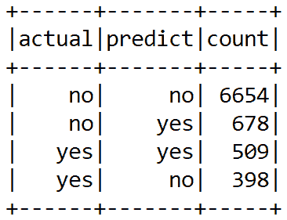

现在，前面的混淆矩阵可以使用 Vegas 由下面的图来表示:

```
Vegas().withDataFrame(predict_actualDF)
    .mark(Bar)
     .encodeY(field="*", dataType=Quantitative, AggOps.Count, axis=Axis(title="",format=".2f"),hideAxis=true)
    .encodeX("actual", Ord)
    .encodeColor("predict", Nominal, scale=Scale(rangeNominals=List("#FF2800", "#1C39BB")))
    .configMark(stacked=StackOffset.Normalize)
    .show()
>>>
```

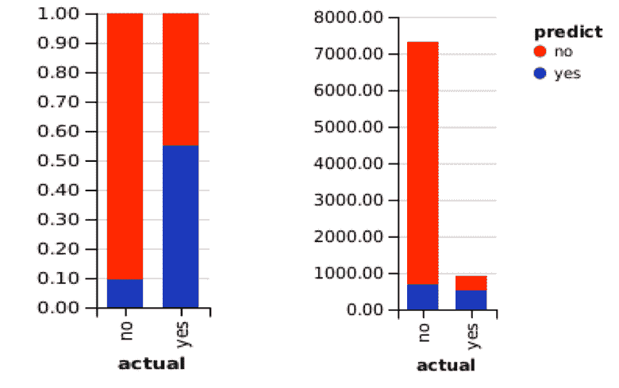

图 4:混淆矩阵的图形表示——标准化(左)与非标准化(右)

现在让我们来看看测试集的总体性能总结，即测试 AUC:

```
val trainMetrics = ModelMetricsSupport.modelMetrics[ModelMetricsBinomial](dlModel, test)println(trainMetrics)
>>>
```

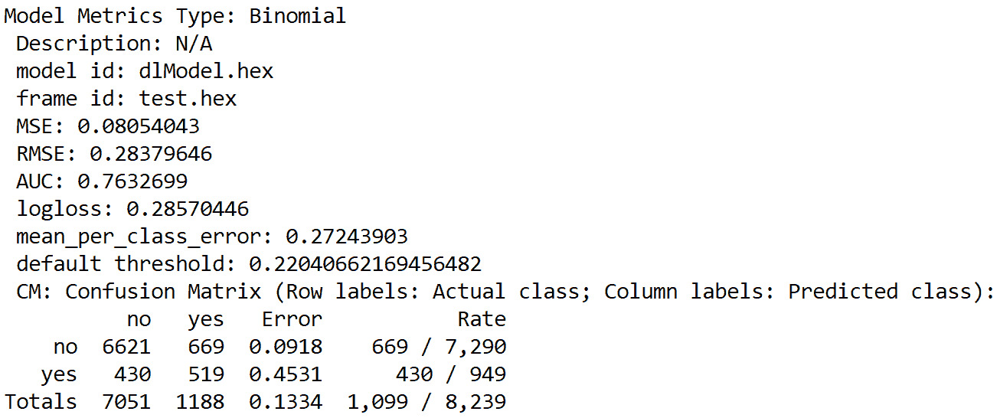

所以 AUC 测试的准确性是 76%,这不是很好。但是为什么我们不重复训练更多次(比如 1000 次)？好吧，我让你决定。但是，我们仍然可以直观地检查精确度-召回曲线，看看评估阶段是如何进行的:

```
val auc = trainMetrics._auc//tp,fp,tn,fn
val metrics = auc._tps.zip(auc._fps).zipWithIndex.map(x => x match { 
    case ((a, b), c) => (a, b, c) })

val fullmetrics = metrics.map(_ match { 
    case (a, b, c) => (a, b, auc.tn(c), auc.fn(c)) })

val precisions = fullmetrics.map(_ match {
     case (tp, fp, tn, fn) => tp / (tp + fp) })

val recalls = fullmetrics.map(_ match { 
    case (tp, fp, tn, fn) => tp / (tp + fn) })

val rows = for (i <- 0 until recalls.length) 
    yield r(precisions(i), recalls(i))

val precision_recall = rows.toDF()

//precision vs recall
Vegas("ROC", width = 800, height = 600)
    .withDataFrame(precision_recall).mark(Line)
    .encodeX("re-call", Quantitative)
    .encodeY("precision", Quantitative)
    .show()
>>>
```

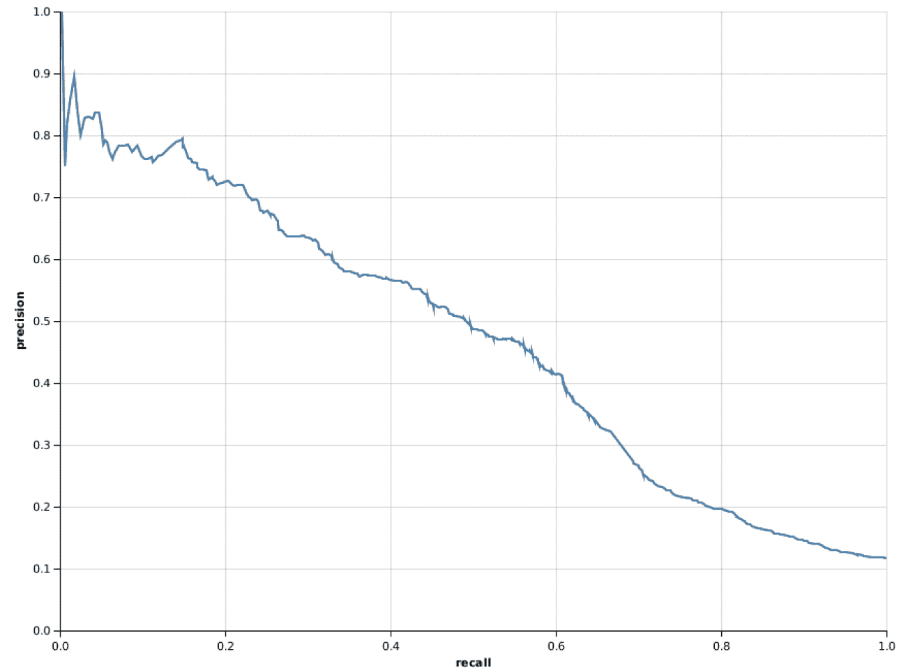

图 5:精确召回曲线

然后，我们计算并绘制灵敏度特异性曲线:

```
val sensitivity = fullmetrics.map(_ match { 
    case (tp, fp, tn, fn) => tp / (tp + fn) })

val specificity = fullmetrics.map(_ match {
    case (tp, fp, tn, fn) => tn / (tn + fp) })
val rows2 = for (i <- 0 until specificity.length) 
    yield r2(sensitivity(i), specificity(i))
val sensitivity_specificity = rows2.toDF

Vegas("sensitivity_specificity", width = 800, height = 600)
    .withDataFrame(sensitivity_specificity).mark(Line)
    .encodeX("specificity", Quantitative)
    .encodeY("sensitivity", Quantitative).show()
>>>
```

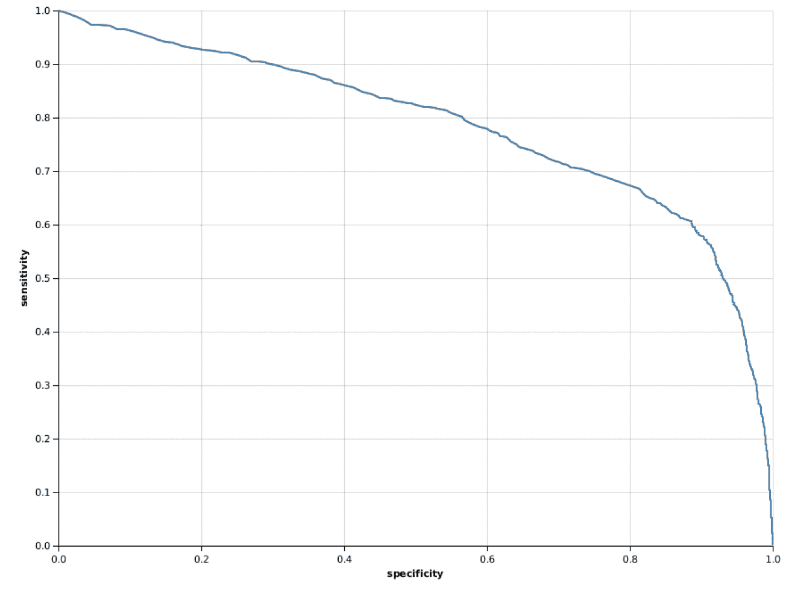

图 6:敏感性特异性曲线

现在，灵敏度特异性曲线告诉我们来自两种标记的正确预测类别之间的关系。例如，如果我们有 100%正确预测的欺诈案例，就不会有正确分类的非欺诈案例，反之亦然。最后，通过手动检查不同的预测阈值并计算在两个类别中有多少案例被正确分类，以稍微不同的方式更仔细地查看这一点会很棒。

更具体地说，我们可以直观地检查超过不同预测阈值的真阳性、假阳性、真阴性和假阴性，比如说 **0.0** 到 **1.0** :

```
val withTh = auc._tps.zip(auc._fps).zipWithIndex.map(x => x match {
    case ((a, b), c) => (a, b, auc.tn(c), auc.fn(c), auc._ths(c)) })

val rows3 = for (i <- 0 until withTh.length) 
    yield r3(withTh(i)._1, withTh(i)._2, withTh(i)._3, withTh(i)._4, withTh(i)._5)
```

首先，让我们画出真正积极的一面:

```
Vegas("tp", width = 800, height = 600).withDataFrame(rows3.toDF)
    .mark(Line).encodeX("th", Quantitative)
    .encodeY("tp", Quantitative)
    .show
>>>
```

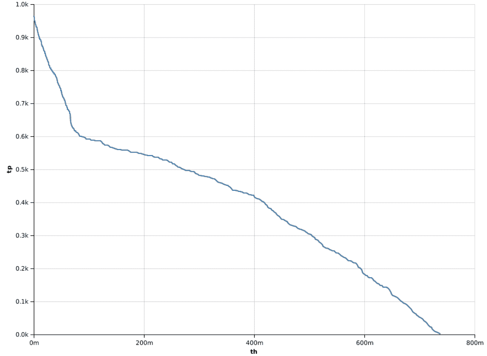

图 7:[0.0，1.0]中不同预测阈值的真阳性

其次，我们来画一个假阳性的:

```
Vegas("fp", width = 800, height = 600)
    .withDataFrame(rows3.toDF).mark(Line)
    .encodeX("th", Quantitative)
    .encodeY("fp", Quantitative)
    .show
>>>
```

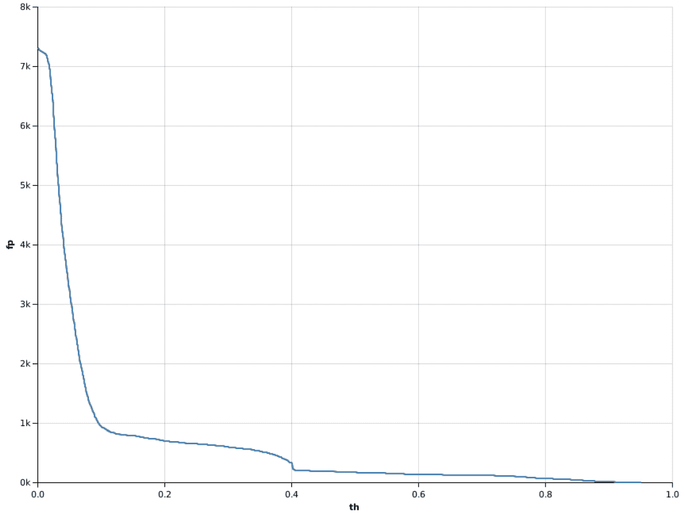

图 8:[0.0，1.0]中不同预测阈值的假阳性

然后，轮到真正消极的人了:

```
Vegas("tn", width = 800, height = 600)
    .withDataFrame(rows3.toDF).mark(Line)
    .encodeX("th", Quantitative)
    .encodeY("tn", Quantitative)
    .show
>>>
```

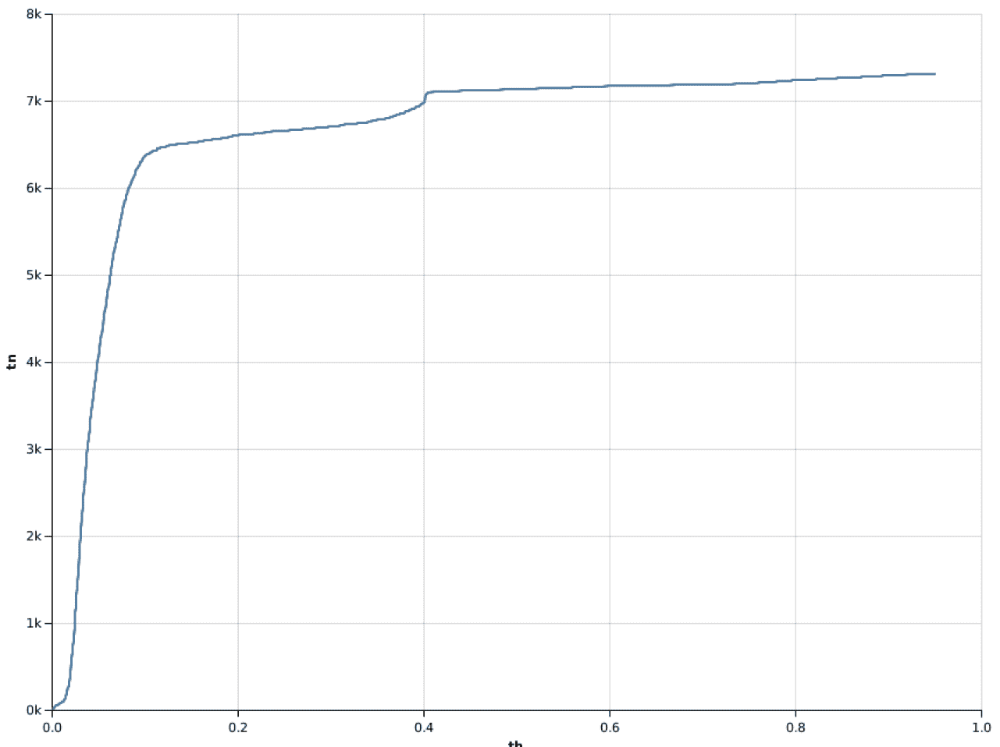

图 9:[0.0，1.0]中不同预测阈值的假阳性

最后，我们把假阴性的画出来如下:

```
Vegas("fn", width = 800, height = 600)
    .withDataFrame(rows3.toDF).mark(Line)
    .encodeX("th", Quantitative)
    .encodeY("fn", Quantitative)
    .show
>>>
```

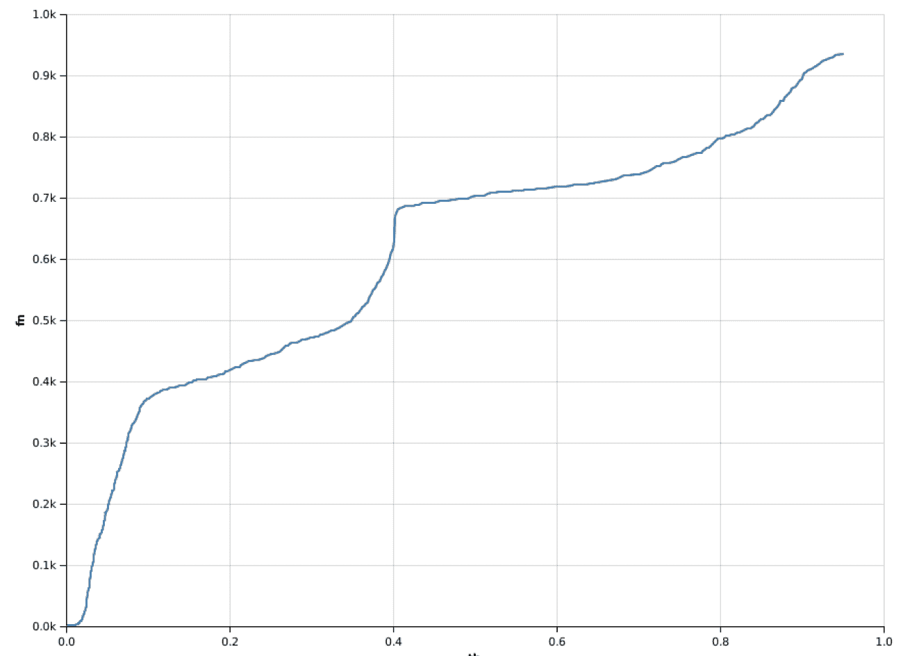

图 10:[0.0，1.0]中不同预测阈值的假阳性

因此，前面的图告诉我们，当我们将预测阈值从默认的 **0.5** 增加到 **0.6** 时，我们可以增加正确分类的非欺诈案例的数量，而不会丢失正确分类的欺诈案例。

除了这两个辅助方法，我还定义了三个 Scala case 类用于计算`precision`、`recall`、`sensitivity`、`specificity`、真阳性(`tp`)、真阴性(`tn`)、假阳性(`fp`)、假阴性(`fn`)等等。签名如下:

```
case class r(precision: Double, recall: Double)
case class r2(sensitivity: Double, specificity: Double)
case class r3(tp: Double, fp: Double, tn: Double, fn: Double, th: Double)
```

最后，停止火花会议和 H2O 的背景。`stop()`方法调用将分别关闭 H2O 上下文和 Spark 集群:

```
h2oContext.stop(stopSparkContext = true)
spark.stop()
```

第一个尤其重要；否则，它有时不会停止 H2O 流，但仍然拥有计算资源。


# 超参数调谐和特征选择

神经网络的灵活性也是其主要缺点之一:有许多超参数需要调整。即使在简单的 MLP 中，您也可以更改层数、每层神经元的数量、每层中使用的激活函数的类型、历元数、学习速率、权重初始化逻辑、退出保持概率等等。您如何知道什么样的超参数组合最适合您的任务？

当然，你可以使用交叉验证的网格搜索来为线性机器学习模型找到正确的超参数，但对于深度学习模型，有许多超参数需要调整。由于在大型数据集上训练神经网络需要大量时间，因此在合理的时间内，您只能探索超参数空间的一小部分。以下是一些有用的见解。


# 隐藏层数

对于许多问题，你可以从一个或两个隐藏层开始，使用两个具有相同神经元总数的隐藏层，在大致相同的训练时间内就可以很好地工作。对于更复杂的问题，您可以逐渐增加隐藏层的数量，直到您开始过度适应训练集。非常复杂的任务，如大型图像分类或语音识别，通常需要几十层的网络，并且需要大量的训练数据。


# 每个隐藏层的神经元数量

显然，输入和输出层中神经元的数量是由任务所需的输入和输出类型决定的。例如，如果您的数据集具有 28 x 28 的形状，它应该预期具有大小为 784 的输入神经元，并且输出神经元应该等于要预测的类的数量。

我们已经在这个项目中看到了它在下一个使用 MLP 的例子中是如何工作的，我们设置了 256 个神经元，每个隐藏层 4 个；这只是一个要调整的超参数，而不是每层一个。就像层的数量一样，你可以尝试逐渐增加神经元的数量，直到网络开始过度拟合。


# 激活功能

在大多数情况下，您可以在隐藏层中使用 ReLU 激活功能。与其他激活函数相比，它的计算速度稍快，而且与逻辑函数或双曲正切函数相比，梯度下降不会卡在平台上，逻辑函数或双曲正切函数通常会在一点饱和。

对于输出层，softmax 激活函数通常是分类任务的好选择。对于回归任务，您可以简单地使用 no activation 函数。其他激活功能包括 Sigmoid 和 Tanh。基于 H2O 的深度学习模型的当前实现支持以下激活功能:

*   实验者
*   带 Dropout 的 expectiver
*   最大输出
*   MaxoutWithDropout
*   整流器
*   整流器电压下降
*   双曲正切
*   谭威思辍学

除了 Tanh(H2O 默认的)，我没有尝试过这个项目的其他激活功能。但是，你一定要试一试。


# 权重和偏差初始化

初始化隐藏层的权重和偏差是一个需要注意的重要超参数:

*   **不要进行全零初始化**:一个听起来合理的想法可能是将所有的初始权重设置为零，但在实践中并不可行，因为如果网络中的每个神经元都计算相同的输出，那么神经元之间就不会存在不对称性，因为它们的权重被初始化为相同。
*   **小随机数**:也可以将神经元的权重初始化为小数值，但不等于零。或者，也可以使用从均匀分布中抽取的小数字。
*   **初始化偏置**:将偏置初始化为零是可能的，也是常见的，因为权重中的小随机数提供了不对称打破。将偏差设置为一个小的常数值，如所有偏差为 0.01，可确保所有 ReLU 单元都能传播梯度。然而，它既没有很好的表现，也没有持续的改进。所以建议坚持归零。


# 正规化

有几种方法可以控制神经网络的训练，以防止训练阶段的过拟合，例如，L2/L1 正则化、最大范数约束和丢弃:

*   L2 正规化:这可能是最常见的正规化形式。使用梯度下降参数更新，L2 正则化表示每个权重将向零线性衰减。
*   **L1 正则化**:对于每个权重 *w* ，我们将λ∣w∣项添加到目标中。然而，也可以结合 L1 和 L2 正则化*来实现*弹性网正则化。
*   **最大范数约束**:用于对每个隐层神经元的权重向量的大小施加一个绝对上限。然后可以使用投影梯度下降来进一步加强约束。
*   **Dropout** :在处理神经网络时，我们需要另一个用于 Dropout 的占位符，这是一个要调整的超参数和训练时间，而不是测试时间。它是通过仅保持一个神经元以某种概率活动来实现的，比如说 *p < 1.0* ，否则将其设置为零。这个想法是在测试时使用一个单一的神经网络而不丢失。这个网络的权重是经过训练的权重的缩小版本。如果一个单元在训练过程中保留了`dropout_keep_prob` *< 1.0* ，则该单元的输出权重在测试时乘以*p*(*图 17* )。

除了这些超参数之外，使用基于 H2O 的深度学习算法的另一个优势是我们可以获取相对变量/特征重要性。在前面的章节中，我们看到通过在 Spark 中使用随机森林算法，也可以计算变量重要性。

因此，这个想法是，如果你的模型表现不佳，就应该放弃不太重要的特性，重新进行训练。现在，有可能在监督训练期间发现特征重要性。我观察到了这个特性的重要性:

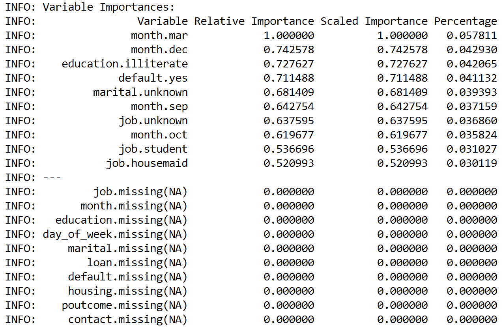

图 25:相对变量重要性

现在的问题是:你为什么不扔掉它们，再次尝试训练，看看准确性是否有所提高？好吧，我把它留给读者。


# 摘要

在本章中，我们看到了如何在银行营销数据集上使用 H2O 开发一个**机器学习** ( **ML** )项目以进行预测分析。我们能够以 80%的准确率预测客户将订阅定期存款。此外，我们看到了如何调整典型的神经网络超参数。考虑到这个小规模数据集的事实，最终的改进建议是使用基于 Spark 的随机森林、决策树或梯度增强树，以获得更好的准确性。

在下一章中，我们将使用超过 284，807 个信用卡使用实例的数据集，其中只有 0.172%的交易是欺诈性的，即高度不平衡的数据。因此，使用自编码器来预训练分类模型并应用异常检测来预测可能的欺诈交易是有意义的，也就是说，我们希望我们的欺诈案例是整个数据集中的异常。