# 使用自编码器和异常检测进行欺诈分析

检测和防止金融公司(如银行、保险公司和信用合作社)中的欺诈是促进企业发展的一项重要任务。到目前为止，在前一章中，我们已经看到了如何使用经典的监督机器学习模型；现在是时候使用其他无监督的学习算法了，比如自编码器。

在本章中，我们将使用超过 284，807 个信用卡使用实例的数据集，并且对于每笔交易，只有 0.172%的交易是欺诈性的。所以，这是高度不平衡的数据。因此使用自编码器来预训练分类模型并应用异常检测技术来预测可能的欺诈交易是有意义的；也就是说，我们期望我们的欺诈案例是整个数据集中的异常。

总之，我们将通过这个端到端项目了解以下主题:

*   异常值和使用异常值的异常检测
*   在无监督学习中使用自编码器
*   开发欺诈分析预测模型
*   超参数调整，最重要的是特性选择


# 异常值和异常检测

异常是观察到的世界中不寻常和意想不到的模式。因此，从可见和不可见的数据中分析、识别、理解和预测异常是数据挖掘中最重要的任务之一。因此，检测异常可以从数据中提取关键信息，然后用于多种应用。

虽然异常是一个普遍接受的术语，但其他同义词，如异常值、不一致的观察值、例外、异常、意外、异常或污染，经常用于不同的应用领域。特别是，异常值和异常值经常互换使用。异常检测广泛应用于信用卡、保险或医疗保健的欺诈检测、网络安全的入侵检测、安全关键系统的故障检测以及敌方活动的军事监视。

异常检测的重要性源于这样一个事实，即对于各种应用领域，数据中的异常通常会转化为重要的可操作见解。当我们开始探索一个高度不平衡的数据集时，使用峰度有三种可能的数据集解释。因此，在应用特征工程之前，需要通过数据探索来回答和了解以下问题:

*   对于所有可用字段，存在或没有空值或缺失值的数据占总数据的百分比是多少？然后尝试处理那些丢失的值，并在不丢失数据语义的情况下很好地解释它们。
*   字段之间的相关性是什么？每个字段与预测变量的相关性如何？它们取什么值(即，分类的或关于分类的，数字的或字母数字的，等等)？

然后找出数据分布是否偏斜。您可以通过查看异常值或长尾来确定偏斜度(稍微向右偏斜或正偏斜，稍微向左偏斜或负偏斜，如图 1 所示)。现在确定异常值是否有助于做出预测。从统计学角度来看，您的数据具有如下 3 种可能的峰度之一:

*   如果峰度小于但几乎等于 3，则为中峰度
*   如果峰度的度量大于 3，则为细峰度
*   如果峰度小于 3，则为平峰度

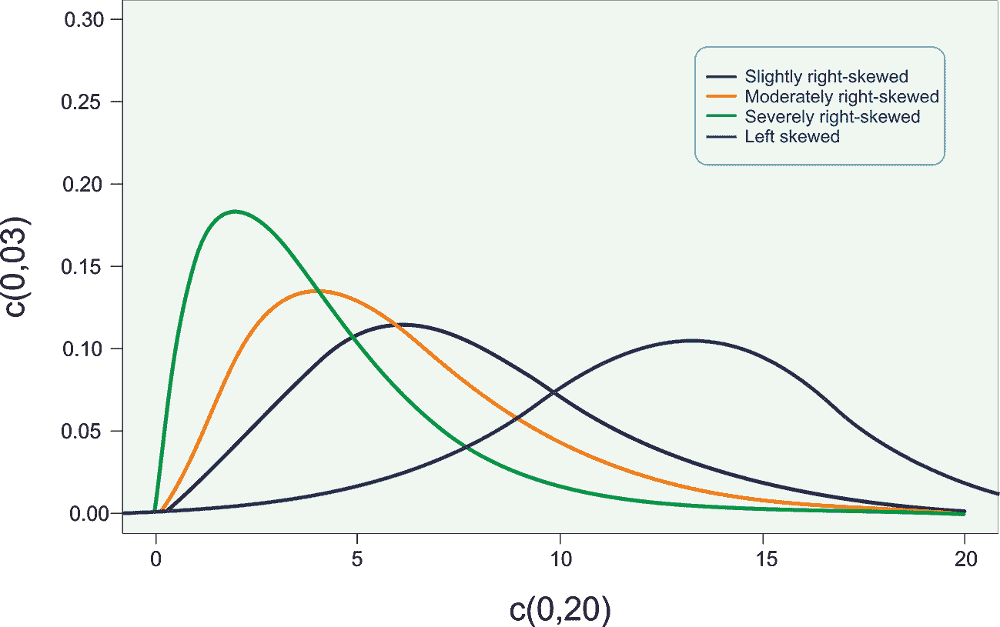

图 1:不平衡数据集中不同种类的偏斜

举个例子吧。假设你对健身散步感兴趣，并且在过去四周(不包括周末)在运动场或乡村散步。你用了以下时间(以分钟为单位完成 4 公里的步行赛道):15、16、18、17.16、16.5、18.6、19.0、20.4、20.6、25.15、27.27、25.24、21.05、21.65、20.92、22.61、23.71、35、39、50。使用 R 计算并解释这些值的偏斜度和峰度将产生如下密度图。

*图 2* 中对数据分布(锻炼次数)的解释显示，密度图向右倾斜，leptokurtic 也是如此。因此，对于我们的用例，数据指向最右边的位置可以被认为是不寻常或可疑的。因此，我们可以潜在地识别或删除它们，以使我们的数据集平衡。然而，这不是这个项目的目的，只有识别才是。


图 2:锻炼时间直方图(右偏)

然而，通过消除长尾效应，我们无法完全消除失衡。还有另一种称为异常值检测的解决方法，删除这些数据点会很有用。

此外，我们还可以查看每个单独特征的箱线图。其中箱线图显示基于五个数字汇总的数据分布:**最小值**、**第一个四分位数**、中值、**第三个四分位数**和**最大值**，如图*图 3* 所示，其中我们可以查找超出三(3) **四分位数间范围** ( **IQR** )的异常值:

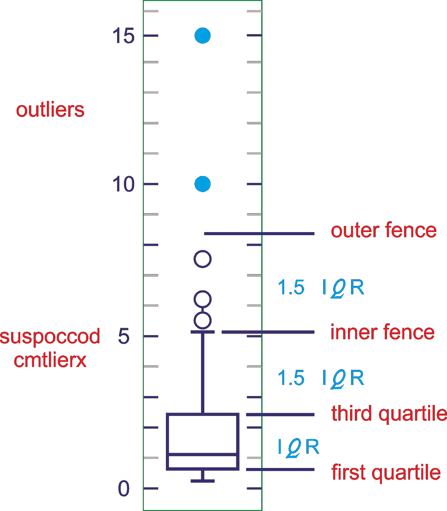

图 3:超出三(3)个四分位数范围的异常值(IQR)

因此，探索移除长尾是否可以为监督或无监督学习提供更好的预测将是有用的。但是对于这种高度不平衡的数据集，没有具体的建议。简而言之，偏态分析在这方面对我们没有帮助。

最后，如果您观察到您的模型不能为您提供完美的分类，但是**均方差** ( **MSE** )可以提供一些发现异常值或异常值的线索。例如，在我们的案例中，即使我们的预测模型无法将您的数据集分类为欺诈和非欺诈案例，但欺诈交易的平均 MSE 肯定高于常规交易。因此，即使这听起来很天真，我们仍然可以通过应用 MSE 阈值来识别异常值。例如，我们可以将 MSE >为 0.02 的实例视为异常/异常值。

现在的问题是我们如何做到这一点？嗯，通过这个端到端的项目，我们将看到如何使用自编码器和异常检测。我们还将看到如何使用自编码器来预先训练一个分类模型。最后，我们将看到如何测量不平衡数据的模型性能。让我们从了解自编码器开始。


# 自编码器和无监督学习

自编码器是人工神经网络，能够在没有任何监督的情况下学习输入数据的有效表示(即，训练集是无标签的)。这种编码通常具有比输入数据低得多的维数，使得自编码器对于维数减少是有用的。更重要的是，自编码器充当了强大的特征检测器，它们可以用于深度神经网络的无监督预训练。


# 自编码器的工作原理

自编码器是具有三层或更多层的网络，其中输入层和输出层具有相同数量的神经元，而中间(隐藏)层具有较少数量的神经元。网络被训练成对于每个输入数据，在输出中简单地再现输入中相同的活动模式。问题的显著方面是，由于隐藏层中神经元的数量较少，如果网络可以从示例中学习，并归纳到可接受的程度，则它执行数据压缩:隐藏神经元的状态为每个示例提供了输入和输出公共状态的压缩版本。

问题的显著方面是，由于隐藏层中神经元的数量较少，如果网络可以从示例中学习，并在可接受的范围内进行归纳，它会执行*数据压缩*:隐藏神经元的状态为每个示例提供了*输入*和*输出公共状态*的*压缩版本*。自编码器的有用应用是用于数据可视化的**数据去噪**和**维度** **缩减**。

下面的架构显示了自编码器通常是如何工作的。它通过两个阶段重构接收到的输入:对应于原始输入*、*的维度缩减的编码阶段，以及能够从编码(压缩)表示重构原始输入的解码阶段:

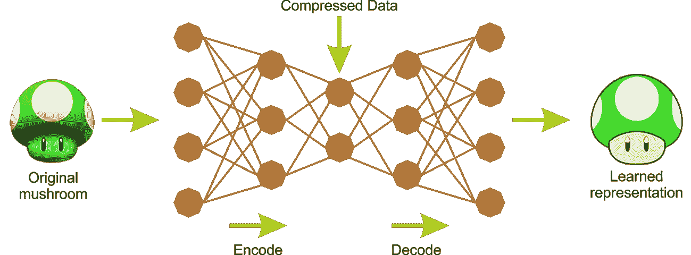

图 4:自编码器中的编码器和解码器阶段

作为一个无监督的神经网络，自编码器的主要特点是它的对称结构。自编码器有两个组件:将输入转换为内部表示的编码器，后面是将内部表示转换回输出的解码器。换句话说，自编码器可以看作是编码器和解码器的组合，前者将一些输入编码成代码，后者将代码解码/重构回原始输入作为输出。因此，**多层感知器** ( **MLP** )通常具有与自编码器相同的架构，除了输出层中神经元的数量必须等于输入的数量。

如前所述，训练自编码器的方法不止一种。第一种是一次性训练整个层，类似于 MLP。尽管在计算成本函数时(如在监督学习中)，我们没有使用一些标记的输出，而是使用输入本身。因此，`cost`函数显示了实际输入和重构输入之间的差异。

第二种方法是贪婪地一次训练一层。这种训练实现来自监督学习(例如，分类)中的反向传播方法所产生的问题。在具有大量层的网络中，反向传播方法在梯度计算中变得非常慢且不准确。为了解决这个问题，Geoffrey Hinton 应用了一些预训练方法来初始化分类权重，并且这种预训练方法一次对两个相邻层进行。


# 使用自编码器的高效数据表示

困扰所有监督学习系统的一个大问题是所谓的**维数灾难**:在增加输入空间维数的同时，性能逐渐下降。这是因为获得输入空间的足够采样所需的样本数量随着维数呈指数增长。为了克服这些问题，已经开发了一些优化网络。

第一个是自编码器网络:这些网络被设计和训练用于转换输入模式本身，以便在存在输入模式的降级或不完整版本的情况下，有可能获得原始模式。训练网络以创建输出数据，例如在入口中呈现的数据，隐藏层存储压缩的数据，即捕获输入数据的基本特征的紧凑表示。

第二种优化网络是**波尔兹曼机器**:这类网络由一个输入/输出可见层和一个隐藏层组成。可见层和隐藏层之间的连接是无方向性的:数据可以双向传输，可见-隐藏和隐藏-可见，不同的神经元单元可以完全连接或部分连接。

让我们看一个例子。决定以下哪个系列你认为更容易记忆:

*   45, 13, 37, 11, 23, 90, 79, 24, 87, 47
*   50, 25, 76, 38, 19, 58, 29, 88, 44, 22, 11, 34, 17, 52, 26, 13, 40, 20

看到前面的两个系列，似乎第一个系列对人类来说更容易，因为它比第二个系列更短，只包含几个数字。然而，如果你仔细观察第二个数列，你会发现偶数正好是后面数字的两倍。而奇数后面是一个数字乘以 3 加 1。这是一个著名的数字序列，叫做**冰雹序列**。

但是，如果你能轻松地记住长序列，你也能轻松快速地识别数据中的模式。在 20 世纪 70 年代，研究人员观察到，国际象棋专家只要看棋盘 5 秒钟，就能记住一局棋中所有棋子的位置。这听起来可能有争议，但象棋专家的记忆力并不比你我强。事实是，他们比非棋手更容易理解国际象棋的模式。自编码器首先观察输入，将它们转换为更好的内部表示，并可以接收类似于它已经学习到的内容:

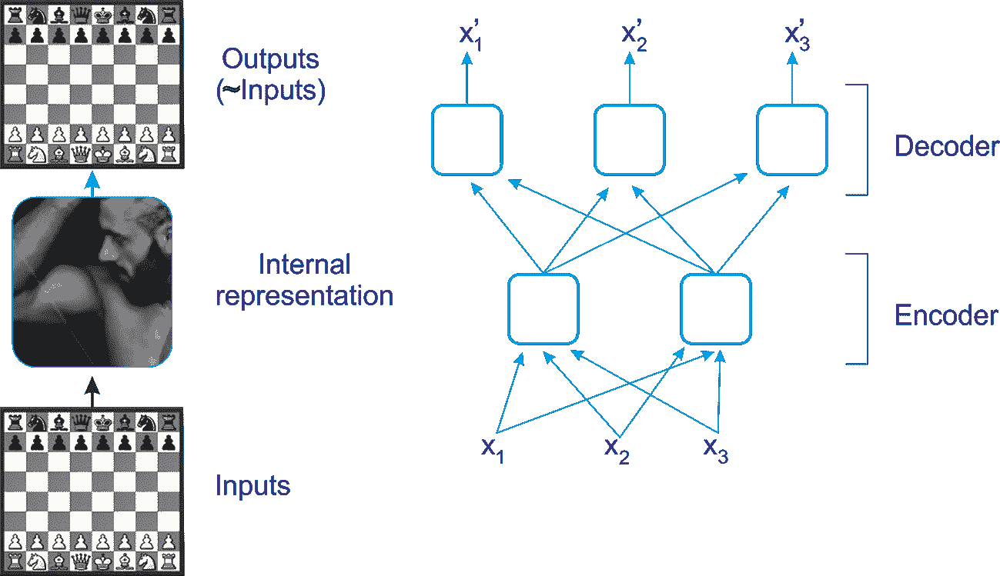

图 5:象棋游戏视角中的自编码器

让我们看看一个关于我们刚刚讨论的象棋例子的更现实的图:隐藏层有两个神经元(即编码器本身)，而输出层有三个神经元(换句话说，解码器)。因为内部表示具有比输入数据更低的维度(它是 2D 而不是 3D)，所以自编码器被认为是不完全的。一个不完整的自编码器不能简单地将其输入复制到编码中，但它必须找到一种方法来输出其输入的副本。

它被迫学习输入数据中最重要的特征，并丢弃不重要的特征。这样，自编码器可以与**主成分分析** ( **PCA** )进行比较，后者用于使用比原来更少的维数来表示给定的输入。

至此，我们知道了自编码器是如何工作的。现在，了解使用异常值识别的异常检测是值得的。


# 开发欺诈分析模型

在我们完全开始之前，我们需要做两件事:了解数据集，然后准备我们的编程环境。


# 数据集的描述和线性模型的使用

对于这个项目，我们将使用来自 Kaggle 的信用卡欺诈检测数据集。数据集可以从[https://www.kaggle.com/dalpozz/creditcardfraud](https://www.kaggle.com/dalpozz/creditcardfraud)下载。因为我正在使用数据集，所以引用以下出版物是一个透明的好主意:

*   Andrea Dal Pozzolo、Olivier Caelen、Reid A. Johnson 和 gian Luca Bontempi*利用欠采样校准不平衡分类的概率*。在 2015 年 IEEE**计算智能和数据挖掘** ( **CIDM** )研讨会上。

这些数据集包含了欧洲持卡人在 2013 年 9 月仅两天内的信用卡交易。总共有 285，299 笔交易，在 284，807 笔交易中只有 492 笔欺诈，这意味着数据集高度不平衡，正类(欺诈)占所有交易的 0.172%。

它只包含数字输入变量，这些变量是 PCA 变换的结果。不幸的是，由于保密问题，我们不能提供原始功能和更多的数据背景信息。共有 28 个特征，分别是`V1`、`V2`、...、`V28`，除了`Time`和`Amount`之外，都是用 PCA 得到的主要成分。特征`Class`是响应变量，在欺诈的情况下取值 1，否则取值 0。我们稍后会看到细节。


# 问题描述

考虑到类别不平衡率，我们建议使用精度-召回曲线 ( **AUPRC** )下的**区域测量精度。混淆矩阵精度对于不平衡分类没有意义。关于这一点，通过应用过采样或欠采样技术，使用线性机器学习模型，如随机森林、逻辑回归或支持向量机。或者，我们可以尝试在数据中发现异常，因为假设只有少数欺诈案例是整个数据集中的异常。**

在处理如此严重的响应标签不平衡时，我们还需要在测量模型性能时小心谨慎。因为只有少数几个欺诈的例子，一个预测一切都不是欺诈的模型将已经达到超过 99%的准确性。尽管准确率很高，但线性机器学习模型不一定能帮助我们发现欺诈案件。

因此，探索深度学习模型，如自编码器，将是值得的。此外，我们需要使用异常检测来发现异常。特别是，我们将看到如何使用自编码器预先训练一个分类模型，并衡量不平衡数据的模型性能。


# 准备编程环境

特别是，我将在这个项目中使用几种工具和技术。以下是解释每项技术的列表:

*   **H2O/火花水**:针对深度学习平台(详见上一章)
*   **Apache Spark** :用于数据处理环境
*   维加斯:Matplotlib 的替代品，类似于 Python，用于绘图。它可以与 Spark 集成用于绘图目的
*   Scala:我们项目的编程语言

嗯，我将创建一个 Maven 项目，其中所有的依赖项都将被注入到`pom.xml`文件中。`pom.xml`的完整内容可以从 Packt 存储库中下载。所以让我们开始吧:

```
<dependencies>
   <dependency>
      <groupId>ai.h2o</groupId>
      <artifactId>sparkling-water-core_2.11</artifactId>
      <version>2.2.2</version>
   </dependency>
   <dependency>
      <groupId>org.vegas-viz</groupId>
      <artifactId>vegas_2.11</artifactId>
      <version>0.3.11</version>
   </dependency>
   <dependency>
     <groupId>org.vegas-viz</groupId>
     <artifactId>vegas-spark_2.11</artifactId>
     <version>0.3.11</version>
     </dependency>
</dependencies>
```

现在，Eclipse 或您最喜欢的 IDE 将提取所有的依赖项。第一个依赖项还将提取与这个 H2O 版本兼容的所有 Spark 相关的依赖项。然后，创建一个 Scala 文件并提供一个合适的名称。然后我们准备出发。


# 步骤 1 -加载所需的包和库

因此，让我们从导入所需的库和包开始:

```
package com.packt.ScalaML.FraudDetection

import org.apache.spark.sql.SparkSession
import org.apache.spark.sql.functions._
import org.apache.spark.sql._
import org.apache.spark.h2o._
import _root_.hex.FrameSplitter
import water.Key
import water.fvec.Frame
import _root_.hex.deeplearning.DeepLearning
import _root_.hex.deeplearning.DeepLearningModel.DeepLearningParameters
import _root_.hex.deeplearning.DeepLearningModel.DeepLearningParameters.Activation
import java.io.File
import water.support.ModelSerializationSupport
import _root_.hex.{ ModelMetricsBinomial, ModelMetrics }
import org.apache.spark.h2o._
import scala.reflect.api.materializeTypeTag
import water.support.ModelSerializationSupport
import water.support.ModelMetricsSupport
import _root_.hex.deeplearning.DeepLearningModel
import vegas._
import vegas.sparkExt._
import org.apache.spark.sql.types._
```


# 步骤 2 -创建 Spark 会话并导入隐含

然后我们需要创建一个 Spark 会话作为我们程序的入口:

```
val spark = SparkSession
        .builder
        .master("local[*]")
        .config("spark.sql.warehouse.dir", "tmp/")
        .appName("Fraud Detection")
        .getOrCreate()
```

此外，我们需要为 spark.sql 和 h2o 导入隐含:

```
implicit val sqlContext = spark.sqlContext
import sqlContext.implicits._
val h2oContext = H2OContext.getOrCreate(spark)
import h2oContext._
import h2oContext.implicits._
```


# 步骤 3 -加载和解析输入数据

我们加载并获取事务。然后我们得到分布:

```
val inputCSV = "data/creditcard.csv"

val transactions = spark.read.format("com.databricks.spark.csv")
        .option("header", "true")
        .option("inferSchema", true)
        .load(inputCSV)
```


# 步骤 4 -输入数据的探索性分析

如前所述，数据集包含数值输入变量`V1`到`V28`，它们是原始特征的 PCA 变换的结果。响应变量`Class`告诉我们一个交易是欺诈性的(值= 1)还是非欺诈性的(值= 0)。

还有两个附加功能，`Time`和`Amount`。`Time`列表示当前事务和第一个事务之间的时间，以秒为单位。而`Amount`列表示在该交易中转移了多少钱。因此，让我们看一下*图 6* 中的输入数据(虽然只显示了`V1`、`V2`、`V26`和`V27`):

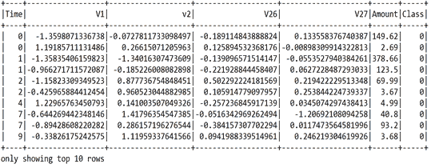

图 6:信用卡欺诈检测数据集的快照

我们已经能够加载事务，但是前面的数据帧没有告诉我们关于类分布的信息。所以，让我们来计算类分布，并考虑绘制它们:

```
val distribution = transactions.groupBy("Class").count.collect
Vegas("Class Distribution").withData(distribution.map(r => Map("class" -> r(0), "count" -> r(1)))).encodeX("class", Nom).encodeY("count", Quant).mark(Bar).show
>>>
```

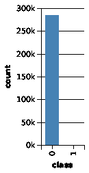

图 7:信用卡欺诈检测数据集中的类别分布

现在，让我们看看时间对可疑交易是否有任何重要贡献。`Time`列告诉我们交易完成的顺序，但不告诉我们交易的实际时间(即一天中的时间)。因此，按天对它们进行规范化，并根据一天中的时间将它们宁滨成四组，以从`Time`构建一个`Day`列将会很有用。我为此写过一篇 UDF:

```
val daysUDf = udf((s: Double) => 
if (s > 3600 * 24) "day2" 
else "day1")

val t1 = transactions.withColumn("day", daysUDf(col("Time")))
val dayDist = t1.groupBy("day").count.collect
```

现在让我们画出来:

```
Vegas("Day Distribution").withData(dayDist.map(r => Map("day" -> r(0), "count" -> r(1)))).encodeX("day", Nom).encodeY("count", Quant).mark(Bar).show
>>>
```


图 8:信用卡欺诈检测数据集中的日分布

上图显示，这两天的交易数量相同，但更具体地说，在`day1`进行的交易略多。现在让我们构建`dayTime`列。我又为它写了一首 UDF:

```
val dayTimeUDf = udf((day: String, t: Double) => if (day == "day2") t - 86400 else t)
val t2 = t1.withColumn("dayTime", dayTimeUDf(col("day"), col("Time")))

t2.describe("dayTime").show()
>>>
+-------+------------------+
|summary| dayTime |
+-------+------------------+
| count| 284807|
| mean| 52336.926072744|
| stddev|21049.288810608432|
| min| 0.0|
| max| 86400.0|
+-------+------------------+
```

现在我们需要得到分位数(`q1`、中位数、`q2`)和构建时间仓(`gr1`、`gr2`、`gr3`和`gr4`):

```

val d1 = t2.filter($"day" === "day1")
val d2 = t2.filter($"day" === "day2")
val quantiles1 = d1.stat.approxQuantile("dayTime", Array(0.25, 0.5, 0.75), 0)

val quantiles2 = d2.stat.approxQuantile("dayTime", Array(0.25, 0.5, 0.75), 0)

val bagsUDf = udf((t: Double) => 
 if (t <= (quantiles1(0) + quantiles2(0)) / 2) "gr1" 
 elseif (t <= (quantiles1(1) + quantiles2(1)) / 2) "gr2" 
 elseif (t <= (quantiles1(2) + quantiles2(2)) / 2) "gr3" 
 else "gr4")

val t3 = t2.drop(col("Time")).withColumn("Time", bagsUDf(col("dayTime")))
```

然后让我们得到`0`和`1`类的分布:

```
val grDist = t3.groupBy("Time", "class").count.collect
val grDistByClass = grDist.groupBy(_(1))
```

现在让我们绘制`0`类的组分布图:

```
Vegas("gr Distribution").withData(grDistByClass.get(0).get.map(r => Map("Time" -> r(0), "count" -> r(2)))).encodeX("Time", Nom).encodeY("count", Quant).mark(Bar).show
>>>
```

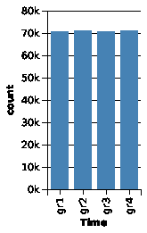

图 9:信用卡欺诈检测数据集中类别 0 的分组分布

从上图中可以清楚地看到，大部分都是正常交易。现在让我们看看`class 1`的组分布:

```
Vegas("gr Distribution").withData(grDistByClass.get(1).get.map(r => Map("Time" -> r(0), "count" -> r(2)))).encodeX("Time", Nom).encodeY("count", Quant).mark(Bar).show
>>>
```

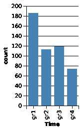

图 10:信用卡欺诈检测数据集中类别 1 的分组分布

因此，交易在四个**时间**箱中的分布显示，大多数欺诈案例发生在组 1 中。我们当然可以看看被转移资金的分布情况:

```
val c0Amount = t3.filter($"Class" === "0").select("Amount")
val c1Amount = t3.filter($"Class" === "1").select("Amount")

println(c0Amount.stat.approxQuantile("Amount", Array(0.25, 0.5, 0.75), 0).mkString(","))

Vegas("Amounts for class 0").withDataFrame(c0Amount).mark(Bar).encodeX("Amount", Quantitative, bin = Bin(50.0)).encodeY(field = "*", Quantitative, aggregate = AggOps.Count).show
>>>
```

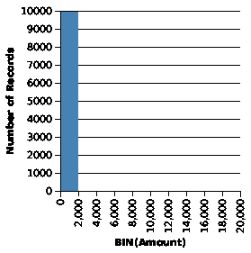

图 11:为类别 0 转移的金额分布

现在让我们为`class 1`绘制同样的图形:

```
Vegas("Amounts for class 1").withDataFrame(c1Amount).mark(Bar).encodeX("Amount", Quantitative, bin = Bin(50.0)).encodeY(field = "*", Quantitative, aggregate = AggOps.Count).show
>>>
```

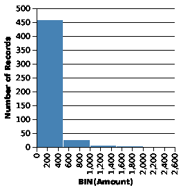

图 12:为类别 1 转移的金额分布

因此，从前面两张图中可以看出，与正常交易相比，欺诈性信用卡交易的平均转账金额更高，但最大金额却低得多。正如我们在手工构建的`dayTime`列中看到的，它并不重要，所以我们可以简单地删除它。让我们开始吧:

```
val t4 = t3.drop("day").drop("dayTime")
```


# 步骤 5 -准备 H2O 数据框架

至此，我们的数据帧(即`t4`)在 Spark 数据帧中。但它不能被 H2O 模式所消耗。所以，我们必须把它转换成 H2O 框架。所以让我们开始吧:

```
val creditcard_hf: H2OFrame = h2oContext.asH2OFrame(t4.orderBy(rand()))
```

我们使用名为 FrameSplitter 的 H2O 内置拆分器将数据集拆分为 40%监督训练、40%非监督训练和 20%测试:

```
val sf = new FrameSplitter(creditcard_hf, Array(.4, .4), 
                Array("train_unsupervised", "train_supervised", "test")
                .map(Key.make[Frame](_)), null)

water.H2O.submitTask(sf)
val splits = sf.getResult
val (train_unsupervised, train_supervised, test) = (splits(0), splits(1), splits(2))
```

在上面的代码段中，`Key.make[Frame](_)`被用作一个底层任务，根据拆分比率来拆分帧，这也有助于获得分布式的键/值对。

密钥在 H2O 计算中非常重要。H2O 支持分布式键/值存储，具有精确的 Java 内存模型一致性。事情是这样的，键是一种在云中的某个地方找到链接值的方法，本地缓存它，允许全局一致地更新链接值。

最后，我们需要显式地将`Time`列从字符串转换为分类(即**枚举**):

```
toCategorical(train_unsupervised, 30)
toCategorical(train_supervised, 30)
toCategorical(test, 30)
```


# 步骤 6 -使用 autoencoder 进行无监督的预训练

如前所述，我们将使用 Scala 和`h2o`编码器。现在是时候开始无监督的自编码器训练了。由于训练是无监督的，这意味着我们需要从无监督的训练集中排除`response`列:

```
val response = "Class"
val features = train_unsupervised.names.filterNot(_ == response)
```

下一个任务是定义超参数，例如具有神经元的隐藏层的数量、可重复性的种子、训练时期的数量和深度学习模型的激活函数。对于无监督的预训练，只需将自编码器参数设置为`true`:

```
var dlParams = new DeepLearningParameters()
    dlParams._ignored_columns = Array(response))// since unsupervised, we ignore the label
    dlParams._train = train_unsupervised._key // use the train_unsupervised frame for training
    dlParams._autoencoder = true // use H2O built-in autoencoder    dlParams._reproducible = true // ensure reproducibility    dlParams._seed = 42 // random seed for reproducibility
    dlParams._hidden = Array[Int](10, 2, 10)
    dlParams._epochs = 100 // number of training epochs
    dlParams._activation = Activation.Tanh // Tanh as an activation function
    dlParams._force_load_balance = false var dl = new DeepLearning(dlParams)
val model_nn = dl.trainModel.get
```

在前面的代码中，我们应用了一种叫做**瓶颈**训练的技术，其中中间的隐藏层非常小。这意味着我的模型必须减少输入数据的维度(在这种情况下，减少到两个节点/维度)。

然后，自编码器模型将学习输入数据的模式，而不考虑给定的类别标签。在这里，它将了解哪些信用卡交易是相似的，哪些交易是异常值或异常值。但是，我们需要记住，autoencoder 模型对数据中的异常值很敏感，这可能会丢弃其他典型的模式。

一旦预训练完成，我们应该将模型保存在`.csv`目录中:

```
val uri = new File(new File(inputCSV).getParentFile, "model_nn.bin").toURI ModelSerializationSupport.exportH2OModel(model_nn, uri)
```

重新加载模型并恢复它以供将来使用:

```
val model: DeepLearningModel = ModelSerializationSupport.loadH2OModel(uri)
```

现在，让我们打印模型的指标，看看培训进展如何:

```
println(model)
>>>
```

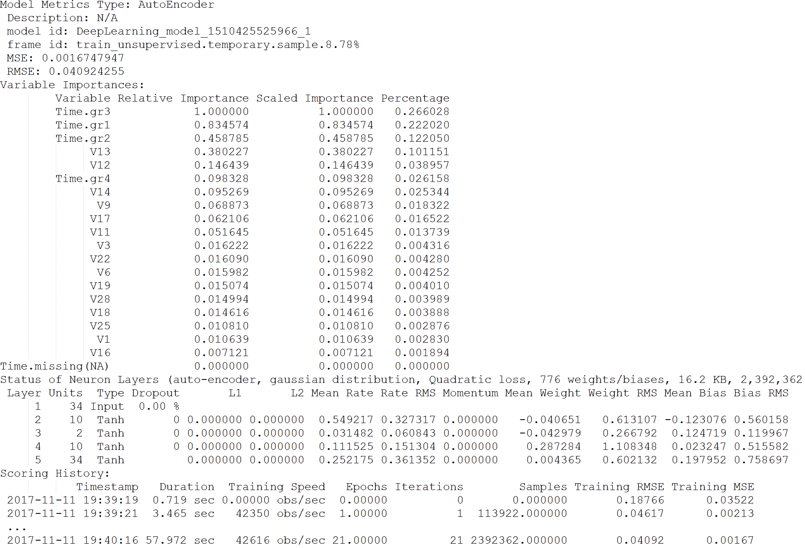

图 13:自编码器模型的度量

太棒了。预训练进行得非常顺利，因为我们可以看到 RMSE 和 MSE 相当低。我们还可以看到，有些功能相当不重要，比如`v16`、`v1`、`v25`等等。我们稍后将尝试分析它。


# 步骤 7 -使用隐藏层进行降维

因为我们使用了一个浅层自编码器，在中间的隐藏层中有两个节点，所以使用降维来探索我们的特征空间是值得的。我们可以用`scoreDeepFeatures()`方法提取这个隐藏的特征，并绘制它来显示输入数据的简化表示。

`scoreDeepFeatures()`方法即时对自编码的重建进行评分，并具体化给定层的深层特征。它采用以下参数，帧原始数据(可以包含响应，将被忽略)和要提取特征的隐藏层的层索引。最后，返回包含深度特征的帧。其中列数是隐藏的[层]

现在，对于监督训练，我们需要提取深层特征。让我们从第 2 层开始:

```
var train_features = model_nn.scoreDeepFeatures(train_unsupervised, 1) 
train_features.add("Class", train_unsupervised.vec("Class"))
```

最终聚类识别的绘图如下:

```
train_features.setNames(train_features.names.map(_.replaceAll("[.]", "-")))
train_features._key = Key.make()
water.DKV.put(train_features)

val tfDataFrame = asDataFrame(train_features) Vegas("Compressed").withDataFrame(tfDataFrame).mark(Point).encodeX("DF-L2-C1", Quantitative).encodeY("DF-L2-C2", Quantitative).encodeColor(field = "Class", dataType = Nominal).show
>>>
```

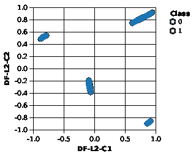

图 14:类 0 和 1 的最终聚类

从上图中，我们看不到任何与非欺诈交易明显不同的欺诈交易聚类，因此仅使用我们的 autoencoder 模型进行降维不足以识别该数据集中的欺诈行为。但是我们可以使用一个隐藏层的降维表示作为模型训练的特征。例如，使用第一个或第三个隐藏层的 10 个特征。现在，让我们从第 3 层提取深层特征:

```
train_features = model_nn.scoreDeepFeatures(train_unsupervised, 2)
train_features._key = Key.make()
train_features.add("Class", train_unsupervised.vec("Class"))
water.DKV.put(train_features)

val features_dim = train_features.names.filterNot(_ == response)
val train_features_H2O = asH2OFrame(train_features)
```

现在，让我们再次使用新维度的数据集进行无监督 DL:

```
dlParams = new DeepLearningParameters()
        dlParams._ignored_columns = Array(response)
        dlParams._train = train_features_H2O
        dlParams._autoencoder = true
        dlParams._reproducible = true
        dlParams._ignore_const_cols = false
        dlParams._seed = 42
        dlParams._hidden = Array[Int](10, 2, 10)
        dlParams._epochs = 100
        dlParams._activation = Activation.Tanh
        dlParams._force_load_balance = false dl = new DeepLearning(dlParams)
val model_nn_dim = dl.trainModel.get
```

然后我们保存模型:

```
ModelSerializationSupport.exportH2OModel(model_nn_dim, new File(new File(inputCSV).getParentFile, "model_nn_dim.bin").toURI)
```

为了测量测试数据的模型性能，我们需要将测试数据转换为与训练数据相同的缩减维度:

```
val test_dim = model_nn.scoreDeepFeatures(test, 2)
val test_dim_score = model_nn_dim.scoreAutoEncoder(test_dim, Key.make(), false)

val result = confusionMat(test_dim_score, test, test_dim_score.anyVec.mean)
println(result.deep.mkString("n"))
>>>
Array(38767, 29)
Array(18103, 64)
```

现在，就识别欺诈案件而言，这看起来相当不错:93%的欺诈案件都被识别出来了！


# 步骤 8 -异常检测

我们还可以询问哪些实例被认为是测试数据中的异常值或异常。基于之前训练的自编码器模型，将重构输入数据，并且对于每个实例，计算实际值和重构之间的 MSE。我还计算了两个类别标签的平均 MSE:

```
test_dim_score.add("Class", test.vec("Class"))
val testDF = asDataFrame(test_dim_score).rdd.zipWithIndex.map(r => Row.fromSeq(r._1.toSeq :+ r._2))

val schema = StructType(Array(StructField("Reconstruction-MSE", DoubleType, nullable = false), StructField("Class", ByteType, nullable = false), StructField("idRow", LongType, nullable = false)))

val dffd = spark.createDataFrame(testDF, schema)
dffd.show()
>>>
```


图 15:显示 MSE、类和行 ID 的数据帧

看到这个数据框架，很难识别异常值。但是绘制它们会提供更多的见解:

```
Vegas("Reduced Test", width = 800, height = 600).withDataFrame(dffd).mark(Point).encodeX("idRow", Quantitative).encodeY("Reconstruction-MSE", Quantitative).encodeColor(field = "Class", dataType = Nominal).show
>>>
```

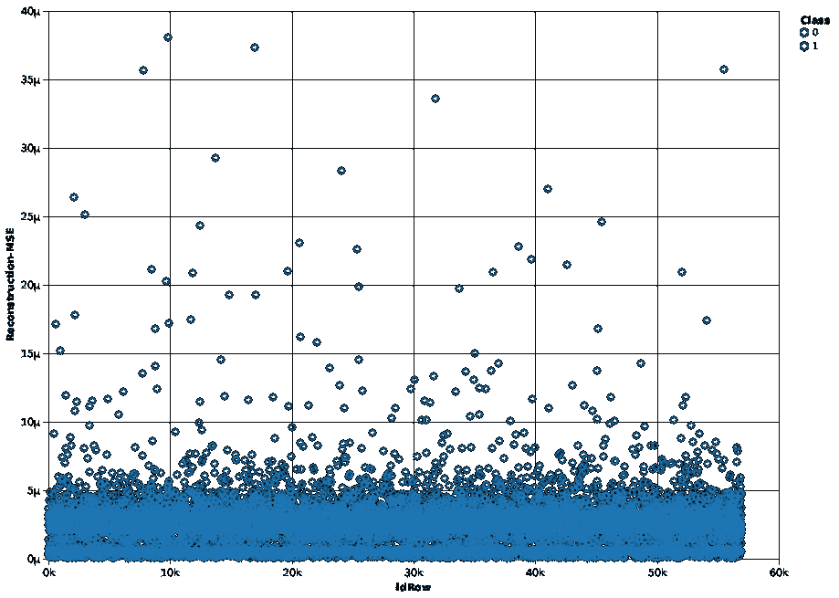

图 16:重构的 MSE 在不同行 id 之间的分布

正如我们在图中看到的，欺诈和非欺诈案例没有完美的分类，但欺诈交易的平均 MSE 肯定高于正常交易。但是最低限度的解释是必要的。

从上图中，我们至少可以看出大多数的 **idRows** 的 MSE 为 **5** 。或者，如果我们将 MSE 阈值向上扩展到 **10** ，那么超过这个阈值的数据点就可以认为是异常值或异常，也就是欺诈交易。


# 步骤 9 -预先训练的监督模型

我们现在可以尝试使用自编码器模型作为监督模型的预训练输入。这里，我再次使用神经网络。该模型现在将使用来自自编码器的权重进行模型拟合。然而，为了训练分类，将类从 Int 转换成 Categorical 是必要的。否则，H2O 训练算法会将其视为回归:

```
toCategorical(train_supervised, 29)
```

既然训练集(即`train_supervised`)已经为监督学习做好了准备，让我们开始吧:

```
val train_supervised_H2O = asH2OFrame(train_supervised)
        dlParams = new DeepLearningParameters()
        dlParams._pretrained_autoencoder = model_nn._key
        dlParams._train = train_supervised_H2O
        dlParams._reproducible = true
        dlParams._ignore_const_cols = false
        dlParams._seed = 42
        dlParams._hidden = Array[Int](10, 2, 10)
        dlParams._epochs = 100
        dlParams._activation = Activation.Tanh
        dlParams._response_column = "Class"
        dlParams._balance_classes = true dl = new DeepLearning(dlParams)
val model_nn_2 = dl.trainModel.get
```

干得好！我们现在已经完成了监督培训。现在，要查看预测类和实际类:

```
val predictions = model_nn_2.score(test, "predict")
test.add("predict", predictions.vec("predict"))
asDataFrame(test).groupBy("Class", "predict").count.show //print
>>>
+-----+-------+-----+
|Class|predict|count|
+-----+-------+-----+
| 1| 0| 19|
| 0| 1| 57|
| 0| 0|56804|
| 1| 1| 83|
+-----+-------+-----+
```

现在，这个看起来好多了！我们确实遗漏了 17%的欺诈案例，但是我们也没有错误分类太多的非欺诈案例。在现实生活中，我们会花更多的时间尝试通过示例来改进模型，执行网格搜索以进行超参数调整，返回到原始功能并尝试不同的工程功能和/或尝试不同的算法。现在，想象一下前面的结果怎么样？让我们使用`Vegas`包来完成它:

```
Vegas().withDataFrame(asDataFrame(test)).mark(Bar).encodeY(field = "*", dataType = Quantitative, AggOps.Count, axis = Axis(title = "", format = ".2f"), hideAxis = true).encodeX("Class", Ord).encodeColor("predict", Nominal, scale = Scale(rangeNominals = List("#EA98D2", "#659CCA"))).configMark(stacked = StackOffset.Normalize).show
>>>
```

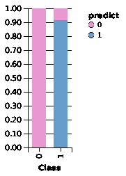

图 17:使用监督训练模型预测的与实际的类别


# 步骤 10 -高度不平衡数据的模型评估

由于数据集对非欺诈案件高度不平衡，使用模型评估指标，如准确性或曲线下的**面积** ( **AUC** )没有意义。原因在于，基于多数类的高正确分类百分比，这些度量会给出过于乐观的结果。

AUC 的一个替代方法是使用精确度-召回曲线，或灵敏度(召回)-特异性曲线。首先，让我们使用来自`ModelMetricsSupport`类的`modelMetrics()`方法来计算 ROC:

```
val trainMetrics = ModelMetricsSupport.modelMetrics[ModelMetricsBinomial](model_nn_2, test)
val auc = trainMetrics._auc
val metrics = auc._tps.zip(auc._fps).zipWithIndex.map(x => x match { case ((a, b), c) => (a, b, c) })

val fullmetrics = metrics.map(_ match { case (a, b, c) => (a, b, auc.tn(c), auc.fn(c)) })
val precisions = fullmetrics.map(_ match { case (tp, fp, tn, fn) => tp / (tp + fp) })

val recalls = fullmetrics.map(_ match { case (tp, fp, tn, fn) => tp / (tp + fn) })
val rows = for (i <- 0 until recalls.length) yield r(precisions(i), recalls(i))
val precision_recall = rows.toDF()
```

现在我们已经有了`precision_recall`数据框架，绘制它将是令人兴奋的。所以让我们开始吧:

```
Vegas("ROC", width = 800, height = 600).withDataFrame(precision_recall).mark(Line).encodeX("recall", Quantitative).encodeY("precision", Quantitative).show
>>>
```

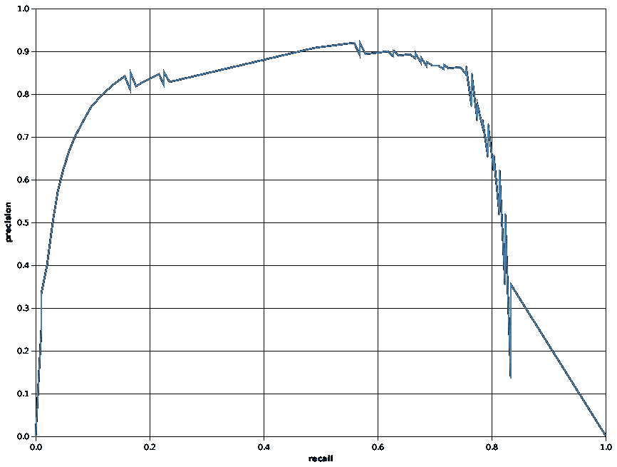

图 18:精确召回曲线

精度是被预测为欺诈的测试用例与真正欺诈的测试用例的比例，也称为**真阳性**预测。另一方面，回忆或敏感度是被识别为欺诈的欺诈案例的比例。特异性是被识别为非欺诈性的非欺诈性案例的比例。

前面的精确回忆曲线告诉我们实际欺诈预测和被预测的欺诈案例比例之间的关系。现在，问题是如何计算灵敏度和特异性。嗯，我们可以使用标准的 Scala 语法并使用`Vegas`包来绘制它:

```
val sensitivity = fullmetrics.map(_ 
 match { 
 case (tp, fp, tn, fn) => tp / (tp + fn) })
 val specificity = fullmetrics.map(_ 
 match { 
 case (tp, fp, tn, fn) => tn / (tn + fp) })
 val rows2 = 
 for (i <- 0 until specificity.length) 
 yield r2(sensitivity(i), specificity(i))

val sensitivity_specificity = rows2.toDF
Vegas("sensitivity_specificity", width = 800, height = 600).withDataFrame(sensitivity_specificity).mark(Line).encodeX("specificity", Quantitative).encodeY("sensitivity", Quantitative).show
>>>
```

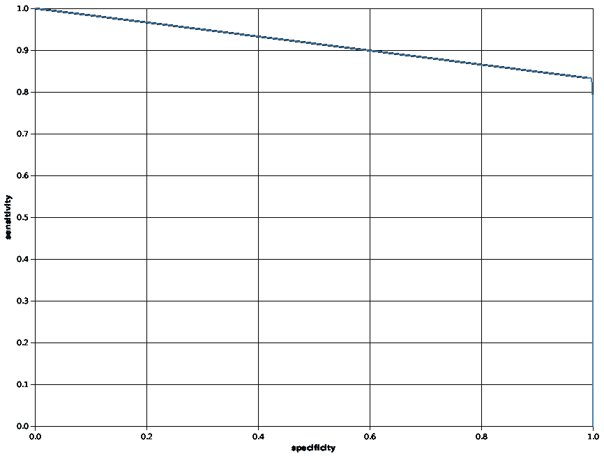

图 19:灵敏度对特异性曲线

现在，前面的灵敏度-特异性曲线告诉我们来自两个标签的正确预测的类别之间的关系-例如，如果我们有 100%正确预测的欺诈案件，则没有正确分类的非欺诈案件，反之亦然)。

最后，通过手动检查不同的预测阈值并计算在两个类别中有多少案例被正确分类，以稍微不同的方式更仔细地查看这一点会很棒。更具体地说，我们可以直观地检查不同预测阈值上的真阳性、假阳性、真阴性和假阴性，例如，0.0 到 1.0:

```
val withTh = auc._tps.zip(auc._fps)
            .zipWithIndex
            .map(x => x match { case ((a, b), c) 
            => (a, b, auc.tn(c), auc.fn(c), auc._ths(c)) })
val rows3 = for (i <- 0 until withTh.length) yield r3(withTh(i)._1, withTh(i)._2, withTh(i)._3, withTh(i)._4, withTh(i)._5)
```

首先，让我们画出真正积极的一面:

```
Vegas("tp", width = 800, height = 600).withDataFrame(rows3.toDF).mark(Line).encodeX("th", Quantitative).encodeY("tp", Quantitative).show
>>>
```

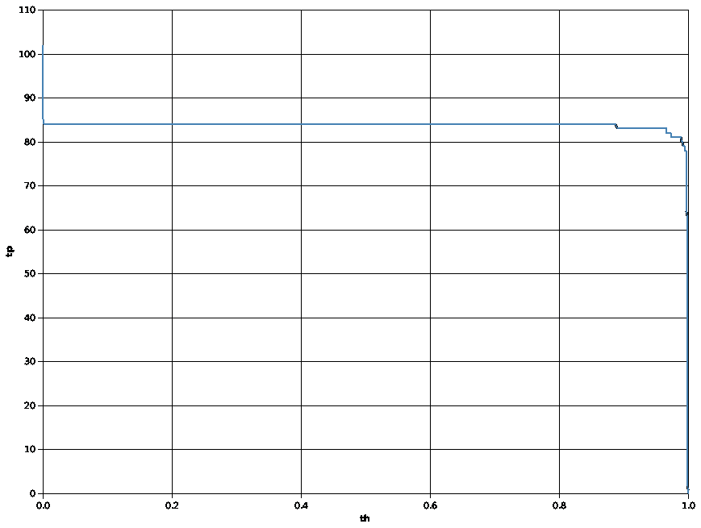

图 20:[0.0，1.0]中不同预测阈值的真阳性

其次，我们来画一个假阳性的:

```
Vegas("fp", width = 800, height = 600).withDataFrame(rows3.toDF).mark(Line).encodeX("th", Quantitative).encodeY("fp", Quantitative).show
>>>
```


图 21:[0.0，1.0]中不同预测阈值的假阳性

然而，前面的数字不容易解释。所以让我们为`datum.th`提供一个 0.01 的阈值，然后再画一次:

```
Vegas("fp", width = 800, height = 600).withDataFrame(rows3.toDF).mark(Line).filter("datum.th > 0.01").encodeX("th", Quantitative).encodeY("fp", Quantitative).show
>>>
```

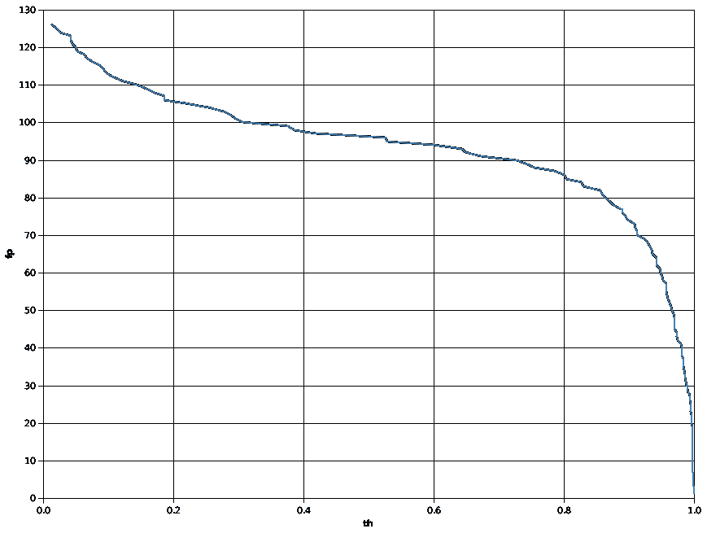

图 22:[0.0，1.0]中不同预测阈值的假阳性

然后，就轮到真正的否定了:

```
Vegas("tn", width = 800, height = 600).withDataFrame(rows3.toDF).mark(Line).encodeX("th", Quantitative).encodeY("tn", Quantitative).show
>>>
```

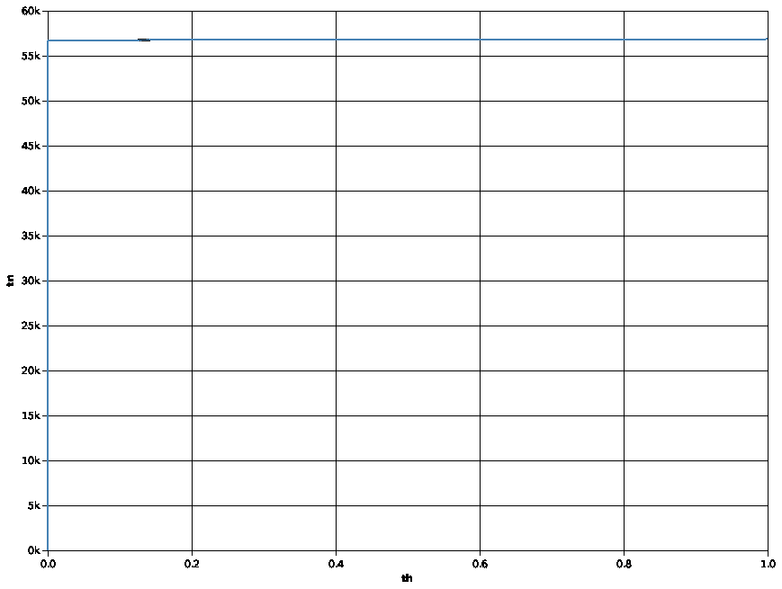

图 23:[0.0，1.0]中不同预测阈值的假阳性

最后，我们来画假阴性的，如下图:

```
Vegas("fn", width = 800, height = 600).withDataFrame(rows3.toDF).mark(Line).encodeX("th", Quantitative).encodeY("fn", Quantitative).show
>>>
```


图 24:[0.0，1.0]中不同预测阈值的假阳性

因此，前面的图告诉我们，当我们将预测阈值从默认的 0.5 增加到 0.6 时，我们可以增加正确分类的非欺诈案例的数量，而不会丢失正确分类的欺诈案例。


# 步骤 11 -停止 Spark 会话和 H2O 上下文

最后，停止火花会议和 H2O 的背景。下面的`stop()`方法调用将分别关闭 H2O 上下文和 Spark 集群:

```
h2oContext.stop(stopSparkContext = true)
spark.stop()
```

尤其是第一个，更重要，否则它有时不会停止 H2O 流，但仍然拥有计算资源。


# 辅助类和方法

在前面的步骤中，我们已经看到了一些应该在这里描述的类或方法。第一个方法名为`toCategorical()`，将框架列从 String/Int 转换为 enum 用于将`dayTime`箱包(即`gr1`、`gr2`、`gr3`、`gr4`)转换为类因子类型。该函数还用于将`Class`列转换为因子类型，以便进行分类:

```
def toCategorical(f: Frame, i: Int): Unit = {
    f.replace(i, f.vec(i).toCategoricalVec)
    f.update()
    }
```

如果一个实例被认为是异常的(如果它的 MSE 超过给定的阈值)，这将根据阈值建立用于异常检测的混淆矩阵:

```
def confusionMat(mSEs:water.fvec.Frame,actualFrame:water.fvec.Frame,thresh: Double):Array[Array[Int]] = {
 val actualColumn = actualFrame.vec("Class");
 val l2_test = mSEs.anyVec();
 val result = Array.ofDim[Int](2, 2)
 var i = 0
 var ii, jj = 0

 for (i <- 0 until l2_test.length().toInt) {
        ii = if (l2_test.at(i) > thresh) 1 else 0;
        jj = actualColumn.at(i).toInt
        result(ii)(jj) = result(ii)(jj) + 1
        }
    result
    }
```

除了这两个辅助方法，我还定义了三个 Scala case 类来计算精度，recall 敏感性、特异性；真阳性，真阴性，假阳性和假阴性等等。签名如下:

```
caseclass r(precision: Double, recall: Double)
caseclass r2(sensitivity: Double, specificity: Double)
caseclass r3(tp: Double, fp: Double, tn: Double, fn: Double, th: Double)
```


# 超参数调谐和特征选择

以下是一些通过调整超参数来提高精度的方法，如隐藏层的数量、每个隐藏层中的神经元、历元的数量和激活函数。基于 H2O 的深度学习模型的当前实现支持以下激活功能:

*   `ExpRectifier`
*   `ExpRectifierWithDropout`
*   `Maxout`
*   `MaxoutWithDropout`
*   `Rectifier`
*   `RectifierWthDropout`
*   `Tanh`
*   `TanhWithDropout`

除了`Tanh`这个，我没有试过这个项目的其他激活功能。但是，你一定要试一试。

使用基于 H2O 的深度学习算法的最大优势之一是，我们可以采用相对变量/特征重要性。在前面的章节中，我们已经看到，使用 Spark 中的随机森林算法，也可以计算变量重要性。因此，这个想法是，如果你的模型表现不佳，就应该放弃不太重要的特性，重新进行训练。

我们来看一个例子；在*图 13* 中，我们已经看到了 autoencoder 中无监督训练的最重要特征。现在，也可以在监督训练期间发现特征重要性。我在这里观察到了特性的重要性:


图 25:[0.0，1.0]中不同预测阈值的假阳性

因此，从*图 25* 中可以看出，时间、`V21`、`V17`、`V6`这些特征是次要的。所以你为什么不放弃它们，重新尝试训练，观察准确度是否有所提高？

然而，网格搜索或交叉验证技术仍然可以提供更高的准确性。然而，我将把它留给你。


# 摘要

在本章中，我们使用了包含超过 284，807 个信用卡使用实例的数据集，并且对于每笔交易，只有 0.172%的交易是欺诈性的。我们已经了解了如何使用自编码器来预训练分类模型，以及如何应用异常检测技术来从高度不平衡的数据中预测可能的欺诈交易，也就是说，我们希望我们的欺诈案例是整个数据集中的异常。

我们的最终模型现在正确识别了 83%的欺诈案例和几乎 100%的非欺诈案例。然而，我们已经看到了如何使用异常值进行异常检测，一些超参数调整的方法，以及最重要的特征选择。

一个**循环神经网络** ( **RNN** )是一类人工神经网络，其中单元之间的连接形成一个有向循环。rnn 利用过去的信息。这样，他们可以在具有高度时间依赖性的数据中进行预测。这创建了网络的内部状态，允许它展示动态的时间行为。

RNN 接受许多输入向量来处理它们并输出其他向量。与经典方法相比，使用具有**长短期记忆单元**(**lstm**)的 RNN 几乎不需要特征工程。数据可以直接输入神经网络，神经网络就像一个黑匣子，正确地模拟问题。这里的方法在预处理多少数据方面相当简单。

在下一章中，我们将看到如何使用智能手机数据集，使用名为 **LSTM** 的 RNN 实现来开发一个机器学习项目，用于**人类活动识别** ( **HAR** )。简而言之，我们的机器学习模型将能够从六个类别中对运动类型进行分类:行走、上楼、下楼、坐着、站着和躺着。