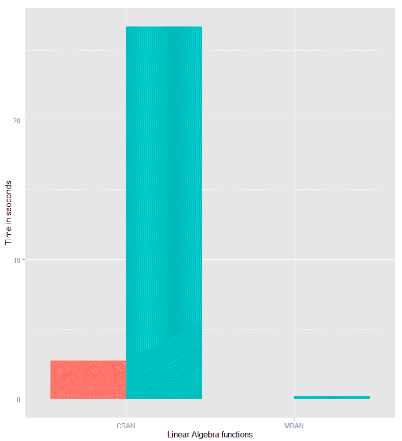
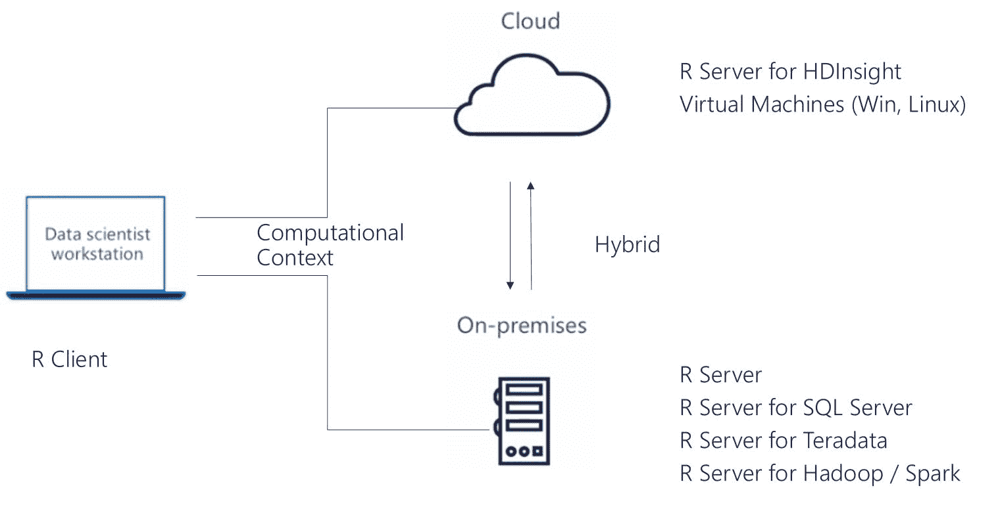
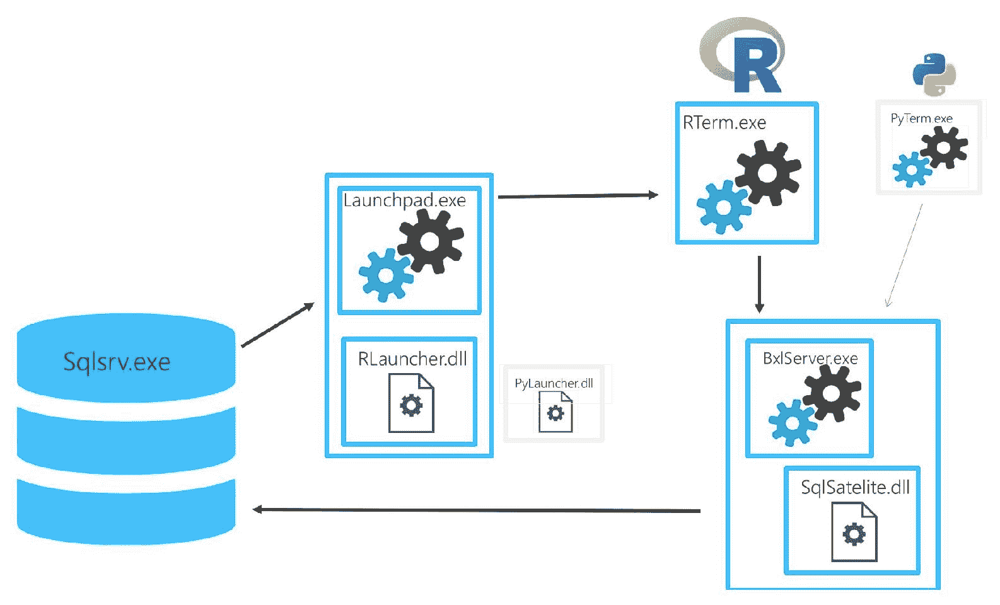

<title>Overview of Microsoft Machine Learning Server and SQL Server</title> 

# Microsoft 机器学习服务器和 SQL Server 概述

在本章中，我们将探讨微软决定在 SQL Server 2016 中添加 R 语言的原因，以及这种集成克服了哪些负担。我们将在本章中讨论以下主题:

*   解决分析障碍和 R 限制
*   微软 R 服务器平台
*   微软 R 服务架构
*   探索计算环境

<title>Analytical barriers</title> 

# 分析障碍

许多公司在试图分析他们的数据时遇到了障碍。这些障碍通常是知识匮乏(并非所有部门都有分析数据的知识)和数据分散性(通常数据来自不同的来源)。

企业根据员工的角色或职能划分职责。这种分工有积极的作用，尤其是当企业规模很大时。通常，中小型企业也采用这样的角色，但是由于员工数量较少，它们通常被细化到更高的级别。

随着市场的快速变化、新技术的出现以及对更快适应的需求，许多专家已经注意到以下许多障碍:

*   数据稀缺和数据分散
*   复杂(并且很多时候已经过时)的架构
*   缺乏知识
*   低生产率
*   对市场变化适应缓慢(上市时间长)

许多企业都面临着至少一个(如果不是更多的话)障碍，微软通过向 SQL Server 开放 R 语言解决了这些障碍。它采用开源语言和开源技术，拓宽了知识库，使企业能够使用社区知识和社区解决方案，以及开放和民主化的分析。现在，这个知识库可以轻松共享，许多数据管理和数据工程任务可以卸载给其他角色和人员，而不是忍受和等待拥有主题学术知识的数据科学家和专家。这种卸载流程还弥合了 IT 和统计人员之间的传统鸿沟，这种鸿沟在过去会导致生产力低下和缓慢。这种知识和技能上的差距现在可以通过在 SQL Server 中使用 R 混合不同的角色和任务来克服(这意味着数据辩论者或数据管家可以仔细阅读 R 代码，这将有助于他们获得数据洞察力，而实际上不需要理解统计数据的复杂性)。理解或了解不同的平台并不令人惊讶，现在，许多 IT 人员可以使用统计学家和数据科学家提供的 R 语言。此外，数据科学家可以开始学习 IT 领域的技能和语言。

两个或更多不同部门的人之间的这种互联和共享知识也将提高生产率。当生产力提高时，统计和预测模型可以更快地部署、更改或适应消费者和市场的变化，并为数据工程师、管理者和分析师提供支持。这当然是一个企业改进创新路径和最大化开源潜力的方式，并且扩大使用不同方法和模型的实验沙箱。

解决这些障碍的最后一步是解决数据稀缺和复杂基础设施的问题。规则是，企业越大，基础设施越复杂。对于复杂的基础架构，我们可以理解数据驻留在不同的层或不同的粒度上，驻留在不同的平台上，驻留在不同的供应商上，驻留在不同的孤岛上，这使得数据分析离实现又进了一步。随着 R 的引入，这种复杂性可以用更简单的数据连接器来克服，这是一种更容易提取数据的方法。

随着 R 语言在分析领域变得越来越流行和重要，它可以为不同规模的企业做好准备，并且可以设计为超越供应商，无论您的解决方案是在内部还是在云中。由于能够直接从任何混合系统访问和读取数据，并且只提取需要的数据，因此对数据移动的需求也减少了。现在，企业中存在的所有障碍都可以通过更少的官僚主义、更好的集成和更少的工作来更快地解决。

拥抱开源语言的另一个重要方面是开源解决方案的普遍存在，许多大企业仍在为之奋斗。这一点不容忽视，必须加以考虑。微软通过几个步骤将 R 语言带上了平台:

1.  加入 R 联盟，该联盟负责支持 R 基金会和关键组织，紧密合作开发、分发和维护 R 引擎，并支持 R 相关的基础设施项目。其中一个项目是 RHub 项目(由 *Gabor Csardi* 领导),它为开发、测试和验证 R 包提供服务。
2.  在 CC 许可下创建一个 R 包的 MRAN 库，并使微软 R 引擎发行版的 CRAN 包可用并与 R 发行版兼容。
3.  制作英特尔 **MKL** ( **数学内核库**)计算函数来提高 R 统计计算的性能，从 MRAN 资源库下载 R 引擎即可使用。**基本线性代数子程序** ( **BLAS** )和**线性代数包** ( **LAPACK** )是一个线性代数函数家族，为并行计算而增强。这样的函数有矩阵分解、Cholesky 矩阵分解、向量和矩阵加法、标量乘法等等。
4.  将许多 R 函数从 Fortran 重写为 C++语言以提高性能。

当我们比较克兰上可用的 R 发动机分布和 MRAN 上可用的 R 发动机分布时，我们可以很快支持 MKL 计算函数的理论。正如我们已经看到的，BLAS 和 LAPACK 被 vector 或 matrix 取代，所以我们将比较(基准测试)两个 R 引擎分布之间的矩阵计算。

比较是在克兰 R 3.3.0 和 MRAN R Open 3.3.0 上进行的，代码如下:

```
# Matrix creation 
set.seed (2908) 
M <- 20000 
n <- 100 
Mat <- matrix (runif (M*n),M,n) 

# Matrix multiply 
system.time ( 
  Mat_MM <- Mat%*% t(Mat), gcFirst=TRUE 
)[1] 

# Matrix multiply with crossprod 
system.time ( 
  Mat_CP <- crossprod(Mat), gcFirst=TRUE 
)[1] 
```

以下是在以下时间内的结果(以秒为单位):

| **时间(秒)** | **曲柄 3.3.2** | MRAN 3.3.2 |
| abbr. 毫米（millimeter） | 26,69 | 2,75 |
| 大脑性麻痹 | 0,19 | 0,01 |

在下图中，你可以看到克兰和 MRAN R 发动机的性能差异:



图 1

该图显示了一个简单的线性代数，它使用矩阵或向量，执行速度提高了 10 倍(在我的本地客户机上测试——Inter I7，4 个 CPU，20 GB RAM)。注意，当您在本地机器上运行这个测试时，您应该观察 RAM 和磁盘存储消耗；您将会看到，就内存消耗而言，MRAN 操作与 CRAN 操作相比是非常轻量级的。

当您下载 R Open 的 MRAN 发行版时，请注意将会有关于 MKL 多线程性能函数的附加信息:


图 2:来源:[https://mran.microsoft.com/download/](https://mran.microsoft.com/download/)

我们采取了更多的措施，让消费者、开发人员、争论者和大型企业的经理们相信 R 语言会一直存在下去。微软承诺，除了这一条款，还有对一般治理的支持，如果公司决定，它还可以在企业级别上获得 R 支持。

此外，为了支持使用开源 R 语言的想法，人们必须理解 R 的一般架构。R 引擎是由大约 20 人的核心小组编写的，他们有权访问 R 引擎的源代码(即使只有 6 人从事日常 R 开发)。这群人不仅维护代码，而且他们自己也是贡献者、错误修复者和开发人员。所以，R 引擎是开源的，这意味着它是自由软件(在 GNU 许可下)，但是引擎没有公开维护。另一方面，R 库(或包)大多是社区驱动的贡献，这意味着社区中的人们可以自由地开发和创建各种函数来支持统计计算、可视化、使用数据集以及许多其他方面。

在 SQL Server 2016 发布后的几个月里(从 2016 年夏天开始)，微软还改变了 SQL Server 不同版本中的可用内容。如果您访问位于[https://www . Microsoft . com/en-us/SQL-Server/SQL-Server-2016-editions](https://www.microsoft.com/en-us/sql-server/sql-server-2016-editions)的 SQL Server 2016 editions 概述，您可以看到在高级分析下，基本 R 集成在 SQL Server 2016 的所有版本中都可用，而高级 R 集成(`RevoScaleR`包中的 ScaleR 函数完全并行)仅在企业版和开发者版中可用。

<title>The Microsoft Machine learning R Server platform</title> 

# 微软机器学习 R 服务器平台

我们已经简单地提到了 R Open 和 R for enterprise environment 的概念。Microsoft Machine Learning R Server 是一个企业服务器，它提供可以并行处理的高维度和大型数据集，工作负载可以跨节点分布。R Server 可以在 Windows、Linux 服务器或 HDFS 系统(如 Hadoop、Spark、Teradata 和 HD Insight)上处理这些并行和分布式工作负载。R Server 可以使用专门设计的 Microsoft R 包来实现并行和分布式工作负载。`RevoScaleR`包将提供高度并行和分布式计算、统计分析、预测分析以及机器学习和深度学习的能力。

随着对 Revolution Analytics 公司的收购，微软将其两个主要产品 Revolution R Open 和 Revolution R Enterprise 更名为 Microsoft R Open 和 Microsoft R Server 以及 Microsoft SQL Server R Services。除了这两种风格，他们还添加了 Microsoft R Client 作为额外的独立产品:


图 3

基于不同的风格和企业生态系统，公司可以选择他们需要的使用类型(社区、非商业和商业)，并且基于他们的业务需求和他们希望他们的分析服务器安装在哪里，他们可以选择最适合他们的。在商业版本中，可以使用独立的机器学习 R 服务器(或简称为 R 服务器)，以及数据库中的机器学习服务(或 SQL Server R 服务)。

在 SQL Server 2017 版本中，微软 R Server 已改为机器学习服务器(既有数据库内的，也有作为单机的；从数据库内 R 服务到机器学习 R 服务的更名是在 SQL Server VNext 的 CTP 版本中引入的，该版本后来更改为 SQL Server 2017)。在*图 4* 中，可以看到安装 SQL Server 2016 时可用的命名(左打印屏幕)和 SQL Server 2017 中将可用的名称(右打印屏幕):


图 4

命名变化的原因是微软在 SQL Server 2017 中引入了 Python。Python 是一种强大的统计、分析和机器学习语言，因此，名称是统一的。机器学习服务器的 R 部分不会在内部改变，但它将获得有用的附加包和改进的功能，如下所示:

```
serialize/unserialize -> rxSerializeModel/rxUnserializeModel 
InstallPackages -> rxInstallPackages 
Histogram -> rxHistogram 
```

所有这些函数都经过了重写，以便在并行和分布式工作负载中处理大型数据集，或者支持 R 和 SQL Server 工作。

在 Microsoft R 平台中，可以使用以下产品:

*   微软机器学习 R 服务器
*   微软 R 客户端
*   Microsoft R 打开
*   Visual Studio 的 r 工具

产品描述基于微软文档的描述和 2016 年 9 月发表在 SQL server central(【http://www.sqlservercentral.com/articles/Microsoft/145393/】T2)上的一篇文章。

<title>Microsoft R Open (MRO)</title> 

# 微软 R 开放(MRO)

微软 R Open 是一个开源的 R 发行版，它是 100%免费的，并且普遍可用。微软增强了这个 R Open 发行版，增加了一个高性能的多线程特性**数学内核库** ( **MKL** )，针对基于向量和矩阵的数学和统计计算进行了优化；否则，这个发行版完全兼容遗留的 R 对象和 R 代码。

R Open 还兼容 CRAN 库、GitHub 包或任何其他库，使得 MRO 可以广泛使用。另一方面，R Open 也有一些局限性。它受内存限制，这意味着它只能处理适合可用内存(客户端)的数据集。专有的 ScaleR 函数(在`RevoScaleR`包中可用)在 R Open 下将不可用，它将在所有 SQL Server 2017 版本上运行，Express 或 Express with Tools 除外，而 Microsoft R Client/Server 将仅在 SQL Server 2017 的企业版或开发者版上运行。

Microsoft R Client 是与 Microsoft R Open 相同的 R 发行版，它是建立在 100%开源 R 版本之上的。微软 R Client 是微软 R 版本家族中第一个引入了`RevoScaleR`包(ScaleR 函数)的版本。安装此版本的数据管理员、数据科学家或数据工程师(或任何其他人员)将能够使用并行化和多线程计算，以及 ScaleR 的专有功能。

R 客户端版本有一些限制。内存将被限制在本地客户机上，限制与 Microsoft R Open 相同—数据必须适合本地内存才能进行计算。ScaleR 函数将与该版本一起安装，但处理将仅限于同时处理两个线程(无论客户端机器的技术规格如何)以及本地磁盘和 CPU 速度。否则，任何遗留的 R 包或 R 代码都将是兼容的。

微软 R Client 还带来了改变计算环境的可能性，这意味着可以将计算负载推送给微软 R Server 或 SQL Server R Services 以及任何 HDFS 系统，以实现最大性能。用许多 R 客户机和一个(或几个)R 服务器构建生态系统将提供一个高性能的分析环境，而不需要在本地安装 Microsoft R 服务器。它与以下版本的 R Server 兼容:Microsoft R server for Linux、Microsoft R Server for Teradata DB、Microsoft R Server for Hadoop、Microsoft R HDInsight 以及两个版本的 Microsoft R Server-Standalone 和 SQL Server R Services。

<title>Microsoft Machine Learning R Server</title> 

# 微软机器学习 R 服务器

Microsoft R Server 是 R engine 的独立服务器版本，构建在 R 开源平台之上，但经过修改以适应企业环境和大量分析用途的需求，从统计分析和数据挖掘到机器学习和任何大数据任务。

它完全兼容克兰/MRAN/GitHub 库和任何 R 遗留代码。`RevoScaleR`包中可用的定标器函数和算法能够进行并行和多线程数据处理，对 R Open 或 R Client 没有任何限制。计算是为大型数据集准备的，在大多数情况下，数据集很容易超过服务器内存大小。这可以通过一种特殊的外部数据帧格式来实现，这种格式支持多线程计算，并支持基于 R 的应用程序，这些应用程序可以在 ConnectR 和 DeployR 的帮助下跨多平台执行并行计算和可部署的解决方案。Microsoft R Server 还提供了磁盘可伸缩性。

<title>Microsoft SQL Server Machine Learning R Services</title> 

# Microsoft SQL Server 机器学习服务

R Open distribution 的数据库内风格可作为面向 Microsoft SQL Server 的机器学习 R 服务，并涵盖了所有在`RevoScaleR`包中可用的 ScaleR 算法。

在这种情况下，内存和磁盘将由您安装的 SQL Server 管理，R 的执行是使用管理 SQL Server 和 R 引擎之间通信的`SQL Server Trusted Launchpad`服务来完成的。

此外，用户可以使用 R 客户端连接到 R 服务，但`DeployR`和`ConnectR`功能将受到限制。

Microsoft SQL Server R Services 是 SQL Server 2016 及更高版本的数据库内版本，这将是本书的主要关注点。安装新的 SQL Server 实例时，可以安装这些数据库内服务。*图 4* 显示将 R in-database service(或作为 SQL Server 2017 一部分的机器学习服务(in-database))作为实例特性安装，勾选该特性时，将安装 R service(或 Python service)。还必须理解，Microsoft R Server 是一个独立的组件，在安装 R 服务时不会安装它。必须在共享服务下的 R 服务器(机器学习服务器)旁边明确地打上勾号。但是，R 服务(在数据库中)不会安装 R 服务器。

R Services (in-database)是 R 语言和 R 编程的独立来源，具有 SQL Server 的完整堆栈和功能，包括用于治理、安全性、可靠性和性能的工具和技术。在 SSMS，可以调用 R 函数，使用 transact SQL 和 R 脚本进行 R 分析或预测。这可以通过使用系统外部程序:`sp_execute_external_script`来实现。

作为 R 服务(数据库内)安装的一部分，ScaleR 库允许数据科学家、开发人员或数据库管理员从 SQL Server 计算机或 Microsoft R Server 上安全地执行 R 脚本。通过定义计算上下文，用户可以选择将计算和负载推送到哪里，要么留在数据库 R 运行时，要么使用 ScaleR 库来增强连接性和并行性，并将负载推送到 Microsoft R 服务器。

最后，通过安装作为独立安装程序提供的 client R，您可以开发自己的 R 代码，并将解决方案部署到 R 服务或运行在 Windows 或 Linux 上的 Microsoft R Server。

图 5 描述了数据科学家或数据分析师如何将负载从客户机/工作站推送到基于云的解决方案、虚拟机、R 服务器或 R 服务(数据库内)。从客户的角度来看，人们也可以很容易地选择混合解决方案，特别是当需要不同系统之间的数据集成和数据整合时。这一概念肯定会给企业带来立竿见影的性能提升，以及几乎即时的更快更好的解决方案适应能力:



图 5

<title>R Tools for Visual Studio (RTVS)</title> 

# Visual Studio 的 r 工具(RTVS)

RTVS 是微软 IDE 的免费版本(在 GNU 许可下发布),用于在 Visual Studio 中编写、验证和运行 R 代码。Visual Studio 2015 和 Visual Studio 2017 的社区版、专业版和企业版支持 RTVS。

r Tools([https://www.visualstudio.com/vs/rtvs/](https://www.visualstudio.com/vs/rtvs/))将帮助开发者、分析师和数据科学家操作和执行统计计算、可视化和数据管理。R Tools 为 R Engine 带来了图形界面、用于丰富编辑的工作空间、交互式窗口、变量和视觉资源管理器、帮助、智能感知等等。它还绑定了本地和远程工作区(内部或云中)，因此数据分析师可以非常轻松地在计算环境之间切换。

RTVS 工作区的视图变得简单且图形化，便于用户在不同的 R 环境之间切换:


图 6

它类似于著名而强大的 RStudio(【www.rstudio.com】)但是仍然提供了社区和时间为 r studio、Emacs、Vim、Eclipse 或其他开发带来的所有必需品。微软也向社区发出问卷，询问 RTVS 的用户还缺少什么。他们可以在 https://www.surveymonkey.com/r/RTVS1[投稿并添加他们的愿望。](https://www.surveymonkey.com/r/RTVS1)

RTVS 在 2016 年初宣布并发布(作为测试版)，但在 2017 年才获得版本 1。

<title>The Microsoft Machine Learning R Services architecture</title> 

# 微软机器学习服务架构

R Server 的体系结构涵盖了许多必要的组件，以便 R IDE 或 SQL Server 与 R engine 之间的通信能够正常工作。

为了正确执行 Transact SQL，R 脚本并将所有结果返回给 T-SQL，涉及到几个组件:



图 7

Launchpad 是 SQL Server 2016 中的一项新服务，支持使用来自 SQL Server 的外部存储过程执行外部脚本。但是，在 SQL Server 2017 中，还引入了 Python 启动器，使得 Launchpad 普遍适用于第二种非 SQL Server 语言。Launchpad 背后的想法是，既然基础设施已经准备好了，SQL Server 应该在未来也支持其他语言，如 JavaScript 和 C++，不仅向预测分析和机器学习开放这项服务，也向其他独立语言开放。

Launchpad 服务(服务名:`MSSQLLaunchpad`)依赖于 SQL Server 服务(服务名:`MSSQLSERVER`)，这意味着当重新启动或停止 SQL Server 服务时，Launchpad 服务也将被重新启动或停止。

此外，R 语言还带来了两个额外的服务:R 终端服务(缩写为 RTerm)和 BxlServer，它们使用 SQL Satellite，这是 SQL server 的一个额外扩展，用于在外部运行时(与 Launchpad 服务相关)和 SQL Server 之间进行通信；两者都可以作为过程找到。

为了更容易理解这些相关性，让我们启动一个简单的 PowerShell 脚本来查看`Launchpad`和`BxlServer`的所有组件:

```
Get-Process -Name Launchpad | Select-Object * 
Get-Process -Name BxlServer | Select-Object *  
```

此外，通过简单的 T-SQL 代码，我们可以包含 R 脚本:

```
EXEC sp_execute_external_script 
    @language = N'R' 
   ,@script = N'library(RevoScaleR) 
OutputDataSet <- data.frame(rxInstalledPackages())' 
```

此外，观察流程浏览器和启动板流程:


图 8

很明显，通信是如何创建从 SQL Server 到 R 并返回的整个循环的。

此外，命令行还显示 Launchpad 进程使用了`RLauncher.dll`库，并使用`sqlsatellite.dll`启动`sqlsatelitelaunch`:

```
CommandLine: "C:\Program Files\Microsoft SQL Server\MSSQL14.MSSQLSERVER\MSSQL\bin\launchpad.exe" -launcher RLauncher.dll -pipename sqlsatellitelaunch -timeout 600000 -logPath "C:\Program Files\Microsoft  SQL Server\MSSQL14.MSSQLSERVER\MSSQL\LOG\ExtensibilityLog" -workingDir "C:\Program Files\Microsoft SQL Server\MSSQL14.MSSQLSERVER\MSSQL\ExtensibilityData" -satelliteDllPath
```

```
"C:\Program Files\Microsoft SQL Server\MSSQL14.MSSQLSERVER\MSSQL\Binn\sqlsatellite.dll" 
```

更多的配置将告诉您在这种架构中通信是在哪里以及如何建立的。打开`RLauncher.config`文件将显示如下配置:


图 9

此外，通过更改`TRACE_LEVEL`参数，它还可以显示潜在的日志，显示系统之间的相同路径和通信，因为`RevoScaleR`日志还显示每个工作会话的信息:

```
library(RevoScaleR); sessionDirectory <- 'C:\\PROGRA~1\\MICROS~3\\MSSQL1~1.MSS\\MSSQL\\EXTENS~1\\MSSQLSERVER01\\0FEB1004-867F-4AB6-B9CC-E1C824596645';sessionId <- '0FEB1004-867F-4AB6-B9CC-E1C824596645';scriptFile <- file.path(sessionDirectory, paste(sessionId, '.R', sep=''));rxIgnoreCallResult <- .Call('RxSqlSessionStart', list(sessionDirectory=sessionDirectory, sessionId=sessionId, waitTime=-1));source(scriptFile) 
```

<title>R Limitations</title> 

# r 限制

社区博客和论坛，以及软件包作者和贡献者，都在争论这种语言的一长串限制。许多是模糊不清的，有些是严肃地基于特定的用户体验组，但是可以同意以下限制:

*   性能问题
*   内存限制
*   安全方面
*   语言句法

<title>Performance issues</title> 

# 性能问题

超过 40%的 R 代码主要是用 C 编写的，还有 20%多一点的代码是用 Fortran 编写的(其余的是用 C++、Java 和 R 编写的)，这使得一些常见的计算任务非常昂贵。为了解决性能问题，微软(以及之前的 Revolution analytics)的确将一些最常用的函数从旧的 Fortran 重写为 C/C++。

许多软件包作者做了非常相似的事情。例如，`data.table` R 软件包的主要作者 Matt Dowle 做了一些语言性能提升，以加快最常见的数据争论步骤。

当比较使用不同包(如`dplyr`、`plyr`、`data.table`和`sqldf`)对相同数据集的类似操作时，可以看到相同结果的时间性能差异。

下面的 R 示例粗略地显示了一个 80 MiB 的大对象，该对象带有一个简单的分组函数，该函数表示计算时间的差异。与`plyr`和`sqldf`相比，封装`dpylr`和 data.table 表现突出，性能提升超过 25 倍。`data.table`尤其高效，这主要是因为 Matt 极力优化`data.table`包的代码以提高性能:

```
set.seed(6546) 
nobs <- 1e+07 
df <- data.frame("group" = as.factor(sample(1:1e+05, nobs, replace = TRUE)), "variable" = rpois(nobs, 100)) 

# Calculate mean of variable within each group using plyr - ddply  
library(plyr) 
system.time(grpmean <- ddply( 
  df,  
  .(group),  
  summarize,  
  grpmean = mean(variable))) 

# Calcualte mean of variable within each group using dplyr 
detach("package:plyr", unload=TRUE) 
library(dplyr) 

system.time( 
  grpmean2 <- df %>%  
              group_by(group) %>% 
              summarise(group_mean = mean(variable))) 

# Calcualte mean of variable within each group using data.table 
library(data.table) 
system.time( 
  grpmean3 <- data.table(df)[ 
    #i 
    ,mean(variable)    
    ,by=(group)] ) 

# Calcualte mean of variable within each group using sqldf 
library(sqldf) 
system.time(grpmean4 <- sqldf("SELECT avg(variable), [group] from df GROUP BY [group]")) 
```

另一方面，微软`RevoScaleR`软件包也经过了优化，在性能和大型数据集方面可以取代所有这些软件包。这只是为了证明微软是如何让 R 为大型数据集做好准备来解决性能问题的。

<title>Memory limitations</title> 

# 内存限制

r 是内存受限的。这实际上意味着数据集必须适合客户端的 RAM。从前面的例子来看，如果有人要运行一个简单的代数运算，一些矩阵计算，或任何一种基于距离的算法(计算量很大)，R 系统将被限制在 RAM 中。没有溢出到磁盘或任何类型的临时对象是可用的，除非用户加载一个允许的包。

同样，微软的`RevoScaleR`包解决了这个限制。随着**外部数据帧** ( **XDF** )格式的引入，该包能够以这种格式存储任何大小的数据集(没有记录器上限)，该格式持久存储在磁盘上，可以从二进制、blob、CSV 或任何其他格式转换为 XDF 格式。这种限制在 Microsoft Machine Learning R Server 或 Machine Learning R Services 中成为可能。

<title>Security aspects</title> 

# 安全方面

R 语言作为 GNU 发行版的发展在过去几十年中一直是作为基于客户端的解决方案发展的，甚至在互联网出现之前，所有数据集都已经安全地存储在一个人的机器上。随着数据在互联网、云服务和连接系统上的传播，以及越来越多的现有混合解决方案系统，读取、写入、分析和存储数据的安全性方面从来都不是问题。然而，在过去的十年里，越来越多的系统不断涌现，企业需求发生了变化，人们的角色也发生了变化——但核心的 R 引擎和 IDE 尚未朝着这个方向迈出一步。从这方面来看，R 似乎想继续成为一所大学开发和驱动的软件。通过将 R 集成到 SQL Server 中，微软解决了这些问题，不仅创建了数据库角色，还添加了安全连接到 R 和所有计算的服务，减少了安全漏洞的可能性。

<title>Language syntax</title> 

# 语言句法

r 语言非常灵活，允许用户更改 S4 方法和 S3 对象、通用对象以及所有用户定义的对象和变量。由于 R 语言仍然不是面向对象的语言，这是一个争论的问题，如果这是真的还是假的(因为目前，R 只理解三个面向对象的系统)，因为 S3 和 S4 对象都是面向对象的结构。

r 语法可能很容易学习，但是也很容易产生一些疑问。以下是 R 社区中的一些语法分歧:

*   几个不同的 R 包给用户相同的功能(数据争论、数据分析、数据预测)。如前所示，当出于数据争论的目的将这些包的性能与使用情况进行比较时，用户将看到哪个包性能更好，或者哪个包更适合他们的需求。具有令人困惑的结构的特殊语法也是该包的一部分，可以以许多不同的方式使用。
*   做同样的事情有多种方法(声明一个变量，构造一个类，处理数据，用同样的算法预测)。
*   缺少约定、名称空间和包之间的依赖关系。
*   缺乏文档/帮助的有点挑战性的错误消息。
*   区分大小写。

列出所有的问题是很麻烦的，但人们可以很快了解语言是如何发展的，但仍然被越来越多的社区所接受；r 作为一种语言被认为是迄今为止最流行的。

<title>Summary</title> 

# 摘要

本章概述了微软提供的新 R 服务和 R 引擎产品系列的生态系统。

当考虑 R 和 SQL Server 时，人们必须记住企业的需求是什么，以及如何准备基础设施，以便利用强大的`RevoScaleR`包的最大性能。

在下一章中，我们将看到如何使用这些标量计算函数来提供更好的性能结果，以及如何建立您的生态系统。