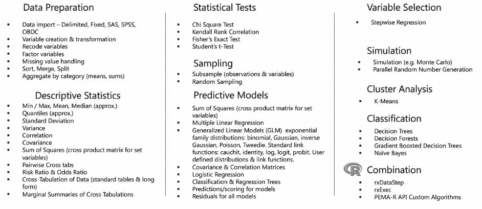
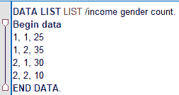
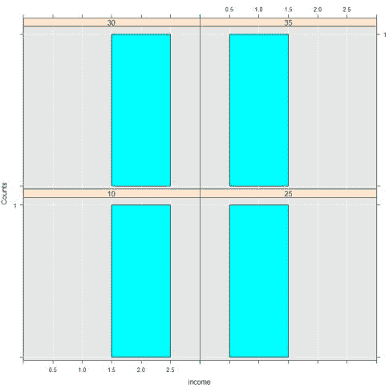
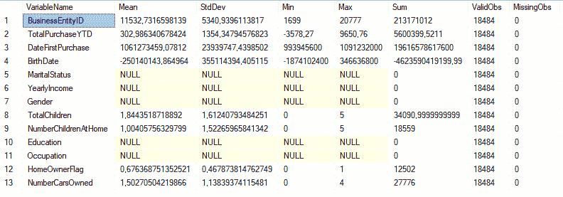
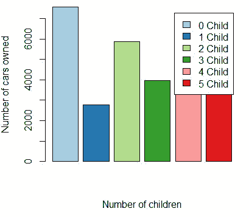
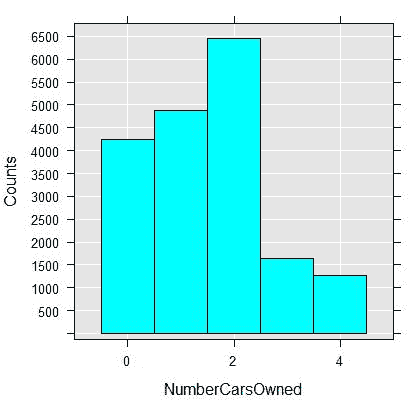
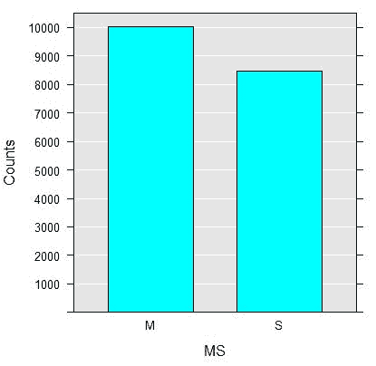
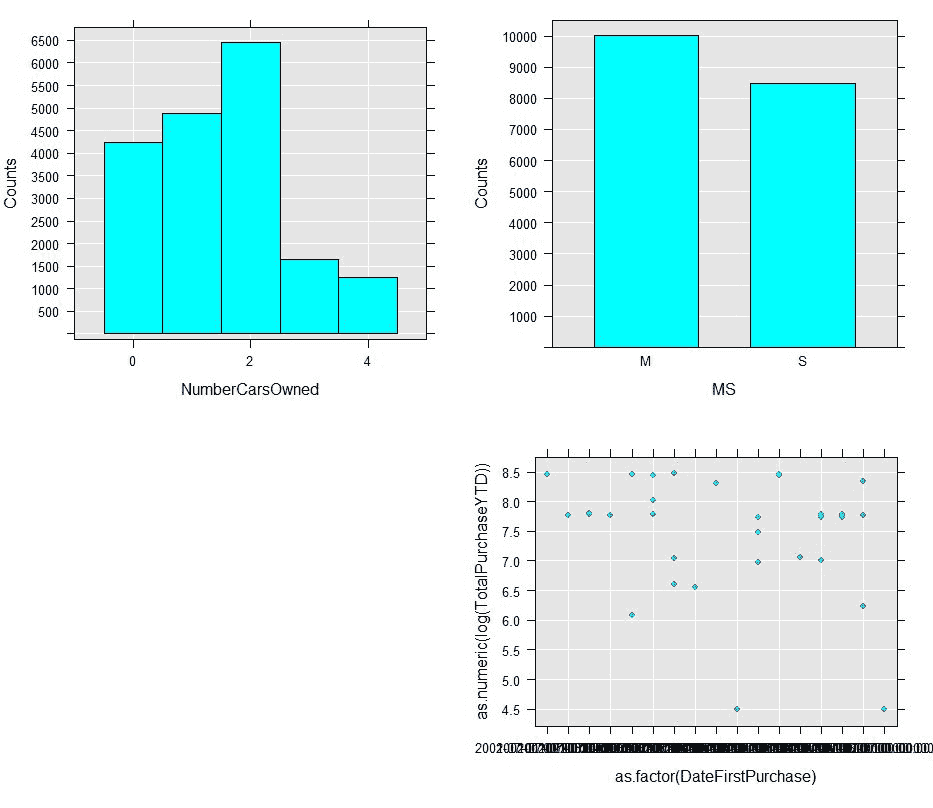
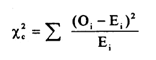

# 五、`RevoScaleR`包

`RevoScaleR`包自带微软机器学习 R 服务器和 R 服务。它也可用于 R Client，但有一些限制，在[第 2 章](part0025.html#NQU20-e3f81285367248f4bbc6431bcd4f926d)、*微软机器学习服务器和 SQL 服务器概述*中讨论。鉴于快速发展和不断升级，本章将涵盖版本 8。x 和版本 9。x-后者也可用于 SQL Server 2017。版本 9 中的更改和升级。x 是不容忽视的，也将包括在内。

本章包括以下主题:

*   R 的局限性受到质疑
*   可扩展的分布式计算环境
*   数据准备功能
*   描述性统计的函数
*   统计测试和抽样的函数
*   预测建模功能

首先，这个 R 包是为在生态系统中处理而设计的，在生态系统中，客户端将连接到 Microsoft R Server，以便在一个更强大的服务器上执行 R 代码，该服务器可能会保存整个数据集，而不仅仅是在客户端机器上工作的人将要处理的一小部分。


# 克服 R 语言限制

在 SQL Server 2016(和 2017)之前，商业智能和数据科学家在**SQL Server Analysis Services**(**SSAS**)中拥有 OLAP 立方体、DMX 语言和所有超级棒和酷的微软算法。但是，随着快速变化和更大的市场需求，集成开源产品(无论是 R、Python、Perl 还是任何其他产品)的需求实际上已经存在。下一个合乎逻辑的步骤是将它与一个。微软寻求解决方案，最终收购了 Revolution Analytics，这让他们重新走上了正轨。Revolution R 解决了关于 R 语言的主要问题。

微软解决了 R 的局限性。这些限制中有许多是针对 r 中更快的数据探索和并行编程技术。除此之外，MKL 计算也得到了增强，从而使矩阵计算、标量计算以及产生笛卡尔积的计算变得更快。

以下限制得到了处理和解决:

*   对于由大量相对较小的任务组成的细粒度并行来说，通信开销尤其成问题
*   负载平衡是指计算资源对问题的贡献不同
*   使用 RAM 和虚拟内存的影响，例如缓存未命中和页面错误
*   影响性能和通信开销的网络效应，如延迟和带宽
*   进程间冲突和线程调度
*   数据访问和其他 I/O 考虑事项


# 可扩展和分布式计算环境

`RevoScaleR`包具有以下可用功能，本章将详细介绍这些功能。

要获得所有`ScaleR`函数的列表，可以使用下面的 T-SQL:

```
EXEC sp_execute_external_script
 @language = N'R'
 ,@script = N'require(RevoScaleR)
 OutputDataSet <- data.frame(ls("package:RevoScaleR"))'
WITH RESULT SETS
 (( Functions NVARCHAR(200)))  
```

您可以在 SSMS 得到一个表，其中包含可以与`RevoScaleR`包一起使用的所有相关的`rx`功能。

基于这些功能的列表，可以准备更简单和更好的功能概述:



图 RevoScaleR 函数列表(来源:微软)


# 数据准备功能

导入数据是数据准备过程中的第一步。导入数据是使用外部文件或通过建立与实时数据源的连接，将数据从任何外部系统导入系统的过程。在接下来的部分中，我们将研究如何导入存储为 SPSS 或 SAS 文件的数据，并使用 ODBC 连接字符串直接连接到外部实时数据库系统。


# 从 SAS、SPSS 和 ODBC 导入数据

将数据导入到 R 或 SQL Server 表中并不是`RevoScaleR`库的主要重点，但是既然这个在列表中，让我们简单地研究一下。通过这种方式，基于您的数据源，`RevoScaleR`包提供了许多连接不同数据源的能力。其中还有 SAS 和 SPSS——两个非常广泛和常见的数据分析和预测分析统计程序。我们将只关注 SAS 软件([https://www.sas.com/](https://www.sas.com/))、SPSS Statistics(2009 年被 IBM 收购)([https://www.ibm.com/products/spss-statistics](https://www.ibm.com/products/spss-statistics))或者 SPSS Modeler([https://www.ibm.com/products/spss-modeler](https://www.ibm.com/products/spss-modeler))。


# 导入 SAS 数据

SAS 是最流行的数据分析程序之一，如果不是最流行的统计分析、数据挖掘和机器学习程序的话。因此，让我们创建一个简单的 SAS 文件，并使用`ScaleR`函数读取它。

使用以下 SAS 代码(该代码随书提供)，您可以非常轻松地创建一个样本数据集:


图 SAS 代码的外观

现在，让我们假设我们的 SAS 数据存储在文件`sas_data.sas7bdat`中，如代码在`PROC DATA`语句中所示。

使用下面的 R 代码，我们可以将这个数据集提取并导入到 R `data.frame`中:

```
EXEC sp_execute_external_script
 @language = N'R'
 ,@script = N'
 library(RevoScaleR)
 SampleSASFile <- file.path(rxGetOption("sampleDataDir"), "sas_data.sas7bdat")
 #import into Dataframe
 OutputDataSet <- rxImport(SampleSASFile)
 '
WITH RESULT SETS
 ((
 income  INT
 ,gender  INT
      ,[count] INT
 ))
```

确保您的`sampleDataDir`持有数据样本。此外，您还可以指定其他路径，例如:

```
SampleSASFile <- file.path(("C:\\Users\\TomazK\\Documents\\CH05"), "sas_data.sas7bdat")  
```

但是，您需要确保您已经授予了对该工作文件夹的访问权限。在这两种方法中，您都应该得到以表格形式显示的结果，从 SAS 文件中读取，如下所示:


图 SAS 代码结果的前景

导入 SAS 文件的另一种方式是直接使用`RxSasData`(在本例中，从 R 开始):

```
SampleSASFile <- file.path(("C:\\Users\\tomazK\\CH05"), "sas_data.sas7bdat")
sasDS <- RxSasData(SampleSASFile, stringsAsFactors = TRUE, 
 colClasses = c(income = "integer", gender= "integer", count="integer"),
rowsPerRead = 1000)
rxHistogram( ~F(gender)|F(income), data = sasDS)  
```

您可以很容易地从 SAS 数据文件生成直方图。


# 导入 SPSS 数据

使用 SPSS，过程是相似的。以下 SPSS 语法(该语法包含在本章中)生成存储在本地计算机上的示例数据集:



图 SPSS 语法的前景

这涉及到使用前面的 SPSS 语法生成的 SPSS save 文件将数据放入 R 服务，这与 SAS 文件基本相同:

```
EXEC sp_execute_external_script
 @language = N'R'
 ,@script = N'
 library(RevoScaleR)
 SampleSPSSFile <- file.path(rxGetOption("sampleDataDir"), "spss_data.sav")
 #import into Dataframe
 OutputDataSet <- rxImport(SampleSPSSFile)
 '
WITH RESULT SETS
 ((
 income  INT
 ,gender  INT
 ,[count] INT
 ))

```

除此之外，`RevoScaleR`包还有一个特殊的功能，直接读取 SPSS 文件，名为`RxSpssData`。下面的 R 代码可以实现与前面的 T-SQL 代码相同的结果:

```
SampleSPSSFile <- file.path(("C:\\Users\\tomazK\\CH05"), "spss_data.sav")
spssDS <- RxSpssData(SampleSPSSFile, stringsAsFactors = TRUE, 
                       colClasses = c(income = "integer", gender= "integer", count="integer"),rowsPerRead = 1000)
rxHistogram( ~F(income)|F(count), data = spssDS)

```

并且`RevoScaleR`直方图可以直接与 SPSS 数据源一起使用，生成一个简单的直方图:



# 使用 ODBC 导入数据

使用 ODBC 驱动程序将可访问性扩展到几乎任何类型的数据库，您可以获得该数据库的驱动程序，并且该数据库具有通用的 RDBM 模型。

`RevoScaleR`包扩展了 ODBS 驱动程序列表，也支持 Linux 和其他系统。使用 ODBC，您可以连接到 MySQL、Oracle、PostgreSQL、Linux 上的 SQL Server、Cloudera 和 Teradata(在这种情况下，它比`RxTeradata`函数好用得多)。

以下示例将使用 ODBC 驱动程序从另一个 SQL server 实例获取数据，两者都使用了`RxOdbcData`和`RxSqlServerData`函数，因为它们是可互换的:

```
EXEC sp_execute_external_script
 @language = N'R'
 ,@script = N'
 library(RevoScaleR)
 sConnectStr <- "Driver={ODBC Driver 13 for SQL Server};Server=TOMAZK\MSSQLSERVER2017;Database=AdventureWorks;Trusted_Connection=Yes"
 sQuery = "SELECT TOP 10 BusinessEntityID,[Name],SalesPersonID FROM [Sales].[Store] ORDER BY BusinessEntityID ASC"
 sDS <-RxOdbcData(sqlQuery=sQuery, connectionString=sConnectStr)
 OutputDataSet <- data.frame(rxImport(sDS))
                            '
WITH RESULT SETS
 ((
 BusinessEntityID  INT
 ,[Name]  NVARCHAR(50)
 ,SalesPersonID INT
 ));

```

这与在同一台服务器上运行以下内容是一样的:

```
USE AdventureWorks;
GO

SELECT
TOP 10
BusinessEntityID
,[Name]
,SalesPersonID
FROM [Sales].[Store]
ORDER BY BusinessEntityID ASC

```

在使用`RxOdbcData`函数的情况下，您应该检查凭证，并且您可能还想检查您正在使用哪个用户来运行脚本。您还可以创建一个新的登录和用户，并使用它来检查和执行脚本:`Adventureworks`数据库可以从微软的 GitHub 网站([https://GitHub . com/Microsoft/SQL-server-samples/tree/master/samples/databases/adventure-works](https://github.com/Microsoft/sql-server-samples/tree/master/samples/databases/adventure-works))下载:

```
EXECUTE AS USER='MSSQLSERVER01'
GO
-- YOUR CODE
REVERT;
GO

```


# 变量创建和数据转换

在定义数据管理和数据争论任务时，变量创建和数据转换是两个过程。这些任务对于正确的数据准备非常重要，并且可以更容易地为将来的任务分析数据。

我们将探讨的功能如下:

*   变量创建和重新编码
*   数据转换
*   处理缺失值
*   排序、合并和分割数据集
*   按类别聚合(这意味着求和)，这类似于 T-SQL 聚合和 Windows 函数

本部分将涵盖以下一些函数，主要关注数据转换、缺失值处理和数据集分割:

`RxDataSource`，`rxDataStep`，`rxDataStepXdf`，`RxFileSystem`，`rxFindFileInPath`，`rxFindPackage`，`rxFisherTest`，`RxForeachDoPar`，`rxGetInfo`，`rxGetInfoXdf`，`rxGetJobInfo`，`rxGetJobInfo`，`rxGetOption`，`rxGetVarInfo`，`rxGetVarNames`，`rxImport`，`rxImportToXdf`，`rxIsOpen`，`rxOdbcData`，`rxOptions`，`rxOpen`，`rxQuantile`，`rxReadXdf`，`rxResultsDF`，`rxSetFileSystem`，`rxSetInfo`，`rxSetInfoXdf`，`rxSetInfoXdf`，】

当使用数据库内 R 服务(或数据库内机器学习服务，也包括 SQL Server 2017 的 Python)时，您应该记住在哪里以及如何进行任何类型的数据转换、数据争论以及排序和/或合并。在运行了许多性能和速度测试之后，很明显，在将数据集发送给`sp_execute_external_script`执行之前，许多管理和争论任务应该在数据库中完成。这组函数是唯一一组计算环境被认为非常重要的函数。用于统计测试、描述性统计和预测性统计的所有其他功能可以很容易地与外部过程一起使用，而不会影响性能或时间。

从`rxDataStep`函数开始，它为我们提供了许多提取和生成 XDF 文件的机会，使用数据库内的 R:

```
EXEC sp_execute_external_script
 @language = N'R'
 ,@script = N'
 df_sql <- InputDataSet 
                  df_sql4 <- data.frame(df_sql)
 outfile <- file.path(rxGetOption("sampleDataDir"), "df_sql4.xdf") 
 rxDataStep(inData = df_sql4, outFile = outfile, overwrite = TRUE)'
 ,@input_data_1 = N'
 SELECT 
 BusinessEntityID
                  ,[Name]
                  ,SalesPersonID
                  FROM [Sales].[Store]'

```

这将在您的示例数据目录中生成`df_sql4.xdf`文件。如果您对该文件夹指向的位置感兴趣，您可以执行以下操作:

```
EXEC sp_execute_external_script
 @language = N'R'
 ,@script = N'
 OutputDataSet <- data.frame(path = file.path(rxGetOption("sampleDataDir")))'

```

它将类似于下面的截图所示:


并确保您已经授予用户访问权限，执行`rxDataStep`代码，因为代码将在目标位置创建一个物理 XDF 文件。


# 变量创建和重新编码

使用`rxGetVarInfo`会将关于`data.frame`的信息暴露给`sp_execute_external_script`输出。很明显，这些函数中的一些从来不是为向`data.frame`呈现输出而设计的，而只是为探索数据集而设计的。其中一些函数——例如`rxGetVarInfo`——在 R 环境中会给出很好的输出，但是在 SQL Server 数据库中输出的数据帧中很难操作:

```
EXEC sp_execute_external_script
 @language = N'R'
 ,@script = N'
 library(RevoScaleR)
 df_sql <- InputDataSet 
                  var_info <- rxGetVarInfo(df_sql)
 OutputDataSet <- data.frame(unlist(var_info))'
 ,@input_data_1 = N'
 SELECT 
 BusinessEntityID
 ,[Name]
 ,SalesPersonID
 FROM [Sales].[Store]'

```

请注意，我们使用的是`unlist`函数，它在一个向量中取消了列表集。为了比较输出，我们可以在 R 环境中运行相同的脚本:

```
library(RevoScaleR) 
sConnectStr <- "Driver={ODBC Driver 13 for SQLServer};Server=TOMAZK\\MSSQLSERVER2017;Database=AdventureWorks;Trusted_Connection=Yes" 
sQuery = "SELECT  BusinessEntityID,[Name],SalesPersonID FROM [Sales].[Store] ORDER BY BusinessEntityID ASC" 
sDS <-RxOdbcData(sqlQuery=sQuery, connectionString=sConnectStr) 
df_sql <- data.frame(rxImport(sDS)) 
```

现在，运行`rxGetVarInfo(df_sql)`将会给您一个稍微不同的导出:

```
> var_info <- rxGetVarInfo(df_sql) 
> var_info 
Var 1: BusinessEntityID, Type: integer, Low/High: (292, 2051) 
Var 2: Name, Type: character 
Var 3: SalesPersonID, Type: integer, Low/High: (275, 290) 
```

在与`unlist()`函数分离后，我们得到相同的信息，以稍微不同的方式书写:

```
> df <- data.frame(unlist(var_info)) 
> df 
                         unlist.var_info. 
BusinessEntityID.varType          integer 
BusinessEntityID.storage            int32 
BusinessEntityID.low                  292 
BusinessEntityID.high                2051 
Name.varType                    character 
Name.storage                       string 
SalesPersonID.varType             integer 
SalesPersonID.storage               int32 
SalesPersonID.low                     275 
SalesPersonID.high                    290 
```

这表明，与 T-SQL 数据工程师相比，有些变量创建和重新编码的函数对 R 数据工程师更有意义。

`rxGetInfo()`函数将获得数据集的大小和观察值/变量的数量:

```
EXEC sp_execute_external_script
 @language = N'R'
 ,@script = N'
                  library(RevoScaleR)
 df_sql <- InputDataSet 
                  var_info <- rxGetInfo(df_sql)
 OutputDataSet <- data.frame(unlist(var_info))'
 ,@input_data_1 = N'
 SELECT 
                   BusinessEntityID
                  ,[Name]
                  ,SalesPersonID
                  FROM [Sales].[Store]'

```

同样的逻辑也适用:如果您运行这个 R 环境，您将获得更整洁的信息显示:

```
> rxGetInfo(df_sql) 
Data frame: df_sql  
Number of observations: 701  
Number of variables: 3  
```

向该函数添加一些附加参数也会产生更丰富的输出，如下所示:

```
> rxGetInfo(df_sql, getVarInfo = TRUE) 
Data frame: df_sql  
Number of observations: 701  
Number of variables: 3  
Variable information:  
Var 1: BusinessEntityID, Type: integer, Low/High: (292, 2051) 
Var 2: Name, Type: character 
Var 3: SalesPersonID, Type: integer, Low/High: (275, 290) 
```

用`rxGetVarInfo`，`rxGetInfo`将创建一个元素列表。`rxGetVarInfo`将生成一个列表列表，其中元组的数量等于变量的数量，`rxGetInfo`将生成一个包含六个元素的列表，其中每个列表将保存关于对象的信息:


了解这一点后，可以稍微修改前面的 T-SQL 执行，以便通过向结果集显示元素(元组)以更易读的格式显示相关信息:

```
EXEC sp_execute_external_script
 @language = N'R'
 ,@script = N'
 library(RevoScaleR)
 df_sql <- InputDataSet 
 get_Info <- rxGetInfo(df_sql) 
 Object_names <- c("Object Name", "Number of Rows", "Number of Variables")
 Object_values <- c(get_Info$objName, get_Info$numRows, get_Info$numVars)
 OutputDataSet <- data.frame(Object_names, Object_values)'
 ,@input_data_1 = N'
 SELECT 
                   BusinessEntityID
                  ,[Name]
                  ,SalesPersonID
                  FROM [Sales].[Store]'
WITH RESULT SETS
 ((
 ObjectName NVARCHAR(100)
 ,ObjectValue NVARCHAR(MAX)
 ));

```

SQL Server Management Studio 中返回的结果:


这看起来非常整洁，花费一些额外的努力肯定会得到更好的格式化结果，更容易阅读，也更有信息量。

在本例中，您还看到了如何创建一个新变量。这在清理数据或记录/存储数据时尤其方便。

假设您想要重新编码数据集中现有变量的值，并创建一个新变量。可以使用标准 R 代码来实现，如下所示:

```
EXEC sp_execute_external_script
 @language = N'R'
 ,@script = N'
 df_sql <- InputDataSet
 #first create an empty variable
 df_sql$BusinessType <- NA
 df_sql$BusinessType[df_sql$BusinessEntityID<=1000] <- "Car Business"
 df_sql$BusinessType[df_sql$BusinessEntityID>1000] <- "Food Business"
 OutputDataSet <- df_sql'
 ,@input_data_1 = N'
 SELECT 
 BusinessEntityID
 ,[Name]
 ,SalesPersonID
 FROM [Sales].[Store]'
WITH RESULT SETS
 ((
 BusinessEntityID INT
 ,[Name] NVARCHAR(MAX)
 ,SalesPersonID INT
 ,TypeOfBusiness NVARCHAR(MAX)
 ));

```

或者，您可以使用`rxDataStep()`函数和`transformFunc`参数，通过转换旧值创建一个新变量:

```
EXEC sp_execute_external_script
 @language = N'R'
 ,@script = N'
 library(RevoScaleR)
 df_sql <- InputDataSet
 df_sql$BusinessEntityID_2 <- NA

 myXformFunc <- function(dataList) {
 #dataList$BussEnt <- 100 * dataList$BusinessEntityID
 if (dataList$BusinessEntityID<=1000){dataList$BussEnt <- "Car Business"} else {dataList$BussEnt <- "Food Business"}
 return (dataList)
 }

 df_sql <- rxDataStep(inData = df_sql, transformFunc = myXformFunc)
 OutputDataSet <- df_sql'
 ,@input_data_1 = N'
 SELECT 
 BusinessEntityID
 ,[Name]
 ,SalesPersonID
 FROM [Sales].[Store]'
WITH RESULT SETS
 ((
 BusinessEntityID INT
 ,[Name] NVARCHAR(MAX)
 ,SalesPersonID INT
 ,TypeOfBusiness NVARCHAR(MAX)
 ));
```

`rxDataStep()X`是一个非常强大的功能，主要用于数据选择、子集设置、数据转换以及为所需数据集创建新变量。


# 数据集子集化

使用`rxDataStep()`函数设置数据子集也相对简单:

```
EXEC sp_execute_external_script
 @language = N'R'
 ,@script = N'
 library(RevoScaleR)
 df_sql <- InputDataSet
 df_sql_subset <- rxDataStep(inData = df_sql, varsToKeep = NULL, rowSelection = (BusinessEntityID<=1000))
 OutputDataSet <- df_sql_subset'
 ,@input_data_1 = N'
 SELECT 
 BusinessEntityID
 ,[Name]
 ,SalesPersonID
 FROM [Sales].[Store]'
WITH RESULT SETS
 ((
 BusinessEntityID INT
 ,[Name] NVARCHAR(MAX)
 ,SalesPersonID INT
 ));

```

请记住，使用 R 代码的子集化操作可能会带来不必要的内存和 I/O 开销，尤其是在将整个数据集抽取到 R 中，而不是预先对数据进行子集化时。在前面的例子中，使用`rxDataStep`中的`rowSelection`参数可以很容易地替换为`@input_data_1`参数中的`WHERE`子句。所以请记住这一点，并始终避免不必要的交通。


# 数据集合并

`rxMerge()`函数将两个数据集合并成一个。数据集必须是数据帧(或 XDF 格式)，并且操作类似于 T-SQL 中的`JOIN`子句(不要将`rxMerge()`函数与 T-SQL 的`MERGE`语句混淆)。使用`matchVars`参数基于一个或多个变量合并两个数据集。此外，当使用本地计算上下文(我们将在下一个示例中使用)时，也需要定义数据的排序，因为 R 中的`data.frames`——作为向量的集合——没有预先排序或者没有任何排序。因此，如果没有进行预排序，则必须将`autoSort`参数设置为 true ( `autosort = TRUE`):

```
EXEC sp_execute_external_script
 @language = N'R'
 ,@script = N'
 library(RevoScaleR)
 df_sql <- InputDataSet
 someExtraData <- data.frame(BusinessEntityID = 1:1200, department = rep(c("a", "b", "c", "d"), 25), Eff_score = rnorm(100))
 df_sql_merged <- rxMerge(inData1 = df_sql, inData2 = someExtraData, overwrite = TRUE, matchVars = "BusinessEntityID", type = "left" ,autoSort = TRUE)
 OutputDataSet <- df_sql_merged'
 ,@input_data_1 = N'
 SELECT 
 BusinessEntityID
 ,[Name]
 ,SalesPersonID
 FROM [Sales].[Store]'
WITH RESULT SETS
 ((
 BusinessEntityID INT
 ,[Name] NVARCHAR(MAX)
 ,SalesPersonID INT
 ,Department CHAR(1)
 ,Department_score FLOAT
 ));

```

这段 T-SQL 代码在两个数据集上创建了一个左连接。Dataframe 2(称为`someExtraData`)是动态创建的，但它可以是从 XDF 文件或任何手动插入的数据集中读取的任何其他数据帧，并将在 R 运行时连接。此外，请注意哪个是第一个数据框，哪个是第二个数据框，以及您使用的连接类型。前面的示例指定了以下内容:

```
inData1 = df_sql, inData2 = someExtraData, type = "left" 
```

然而，数据帧的顺序可以改变如下:

```
inData1 = someExtraData , inData2 = df_sql, type = "left" 
```

然后，输出将以不同的方式呈现(数据框中列的排序将会改变)。


# 描述性统计的函数

描述性统计为理解数据提供了见解。这些是通过汇总特征和度量来描述给定数据集的汇总统计数据，例如集中趋势和分布度量(或可变性)。集中趋势包括平均值、中值、众数的计算，而可变性的测量包括范围、四分位数、最小和最大值、方差和标准偏差，以及偏斜度和峰度。

这些统计数据由`RevoScaleR`包中的`rx-`函数覆盖，这意味着您可以通过调用:`rxSummary`、`rxCrossTabs`、`rxMarginals`、`rxQuantile`、`rxCube`和`rxHistogram`来使用该包的所有计算优势，而不用担心性能、内存不足异常或哪个 R 包持有正确的函数。

我们将使用`AdventureWorks`数据库中的`[Sales].[vPersonDemographics]`视图来简洁地展示这些功能的可用性:

```
EXEC sp_execute_external_script
 @language = N'R'
 ,@script = N'
 library(RevoScaleR)
 df_sql <- InputDataSet
 summary <- rxSummary(~ TotalChildren,  df_sql, summaryStats = c( "Mean", "StdDev", "Min", "Max","Sum","ValidObs", "MissingObs"))
 OutputDataSet <- summary$sDataFrame'
 ,@input_data_1 = N'
 SELECT * FROM [Sales].[vPersonDemographics] WHERE [DateFirstPurchase] IS NOT NULL'
WITH RESULT SETS
 ((
 VariableName NVARCHAR(MAX)
 ,"Mean"NVARCHAR(100)
 ,"StdDev"NVARCHAR(100)
 ,"Min"NVARCHAR(100)
 ,"Max"NVARCHAR(100)
 ,"Sum"NVARCHAR(100)
 ,"ValidObs"NVARCHAR(100)
 ,"MissingObs"NVARCHAR(100)
 ));

```

通过一行 R 代码，您可以获得一些汇总统计数据。我更喜欢使用`summaryStats`参数来列出统计数据，但是请注意，统计数据的顺序并不意味着输出的顺序相同。此外，使用元素`summary$sDataFrame` dataframe 作为`rxSummary`的结果将自动生成包含所有数值变量汇总的数据框。

T-SQL 查询的结果如下:


`rxSummary()`函数也包含一个公式，通过该公式，您可以指定在计算描述性统计数据时该函数将考虑哪些变量。在我们的例子中，我们只使用了`TotalChildren`变量:

```
rxSummary(~ TotalChildren, ... 
```

但是让我们假设，我们想要得到所有变量的描述符；我们简单地写下以下内容:

```
rxSummary(~.,  .... 
```

这将为我们提供所有变量的统计数据，如下图所示:



注意，只考虑整数(连续)类型的变量，而诸如`MaritalStatus`、`Education`和`Occupation`的变量将表示为`NULL`，因为这些变量在 r 中被视为分类变量

为此，首先，我们需要指定因子变量，基于此，我们将能够运行统计数据:

```
EXEC sp_execute_external_script
 @language = N'R'
 ,@script = N'
 library(RevoScaleR)
 df_sql <- InputDataSet
 df_sql_r <- rxFactors(inData = df_sql, sortLevels = TRUE,
factorInfo = list(MS = list(levels = c("M","S"), otherLevel=NULL, varName="MaritalStatus")))
 summary <- rxSummary(~ MS,  df_sql_r)
 OutputDataSet <- data.frame(summary$categorical)'
 ,@input_data_1 = N'
 SELECT * FROM [Sales].[vPersonDemographics] WHERE [DateFirstPurchase] IS NOT NULL'
WITH RESULT SETS
 ((
 MS NVARCHAR(MAX)
 ,"Counts"INT
 ));

```

该函数将给出`MaritalStatus`因子的简单计数:

```
MS Counts 
M  10011 
S   8473 
```

同样的逻辑可以应用于所有其他分类变量。`rxSummary()`函数中的公式也让用户能够组合不同的变量。例如，不使用下面的代码:

```
rxSummary(~ TotalChildren, df_sql_r) 
```

我们也可以使用下面的代码:

```
rxSummary(NumberCarsOwned ~ TotalChildren, df_sql_r) 
```

这将同时计算两个变量的观察统计数据:

```
Name                          Mean     StdDev   Min Max Sum   ValidObs MissObs 
NumberCarsOwned:TotalChildren 3.258656 4.473517 0   20  60233 18484    0          
```

这也可以针对分类变量进行计算。首先需要将这些变量重新编码为因子，然后可以计算相同的汇总统计数据:

```
rxSummary(~ TotalChildren:F(MS), df_sql_r) 
```

使用`sp_execute_external_script`的完整 R 和 T-SQL 代码如下:

```
EXEC sp_execute_external_script
 @language = N'R'
 ,@script = N'
 library(RevoScaleR)
 df_sql <- InputDataSet
 df_sql_r <- rxFactors(inData = df_sql, sortLevels = TRUE,factorInfo = list(MS = list(levels = c("M","S"), otherLevel=NULL, varName="MaritalStatus")))
 summary <- rxSummary(~F(MS):TotalChildren, df_sql_r, summaryStats = c( "Mean", "StdDev", "Min", "Max", "ValidObs", "MissingObs", "Sum"), categorical=c("MS"))
 OutputDataSet <- data.frame(summary$categorical)'
 ,@input_data_1 = N'
 SELECT * FROM [Sales].[vPersonDemographics] WHERE [DateFirstPurchase] IS NOT NULL'
WITH RESULT SETS
 ((
 Category NVARCHAR(MAX)
 ,"MS"NVARCHAR(MAX)
 ,"Means"FLOAT
 ,"StDev"FLOAT
 ,"Min"INT
 ,"Max"INT
 ,"Sum"INT
 ,"ValidObs"INT
 ));

```

以下是每个因素级别的结果:

```
Name               Mean     StdDev   Min Max Sum   ValidObs MissingObs
 TotalChildren:F_MS 1.844352 1.612408 0   5   34091 18484    0 

Statistics by category (2 categories):

Category                  F_MS Means    StdDev   Min Max Sum   ValidObs
TotalChildren for F(MS)=M M    2.080412 1.583326 0   5   20827 10011 
TotalChildren for F(MS)=S S    1.565443 1.601977 0   5   13264  8473 

```

分位数和十分位数对于查看数据分布也非常有用，并且`RevoScaleR`包提供了`rxQuantile`功能。使用 T-SQL，可以按如下方式返回结果集:

```
EXEC sp_execute_external_script
 @language = N'R'
 ,@script = N'
 library(RevoScaleR)
                  df_sql <- InputDataSet
                  quan <- rxQuantile(data = df_sql, varName = "TotalChildren")
                  quan <- data.frame(quan)
 values <- c("0%","25%","50%","75%","100%")
 OutputDataSet <- data.frame(values,quan)'
 ,@input_data_1 = N'
 SELECT * FROM [Sales].[vPersonDemographics] WHERE [DateFirstPurchase] IS NOT NULL'
 WITH RESULT SETS
      ((
            Quartile NVARCHAR(100)
            ,QValue FLOAT
 ));

```

这给了我们以下结果:

```
0%  25%  50%  75% 100% 
0    0    2    3    5 

```

我们还可以通过对`rxQuantile()`函数稍加修改来修改和计算十分位数:

```
EXEC sp_execute_external_script
 @language = N'R'
 ,@script = N'
 library(RevoScaleR)
 df_sql <- InputDataSet
 dec <- rxQuantile(data = df_sql, varName = "TotalChildren",  probs = seq(from = 0, to = 1, by = .1))
 dec <- data.frame(dec)
 values <- c("0%","10%","20%","30%","40%","50%","60%","70%","80%","90%","100%")
 OutputDataSet <- data.frame(values,dec)'
 ,@input_data_1 = N'
 SELECT * FROM [Sales].[vPersonDemographics] WHERE [DateFirstPurchase] IS NOT NULL'
WITH RESULT SETS
 ((
 Decile NVARCHAR(100)
 ,DValue FLOAT
 ));

```

计算交叉表——两个(或更多)变量之间的关系——我们将使用两个函数:`rxCrossTabs`和`rxMargins`。交叉表通常以列联表或任何其他 *[n]*[m]* 表格式表示；这实际上取决于每个变量的级数。

我们将使用我们的两个变量`NumberCarsOwned`和`TotalChildren`来探索`rxCrossTabs`:

```
EXEC sp_execute_external_script
 @language = N'R'
      ,@script = N'
 library(RevoScaleR)
 df_sql <- InputDataSet
                  crosstab <- rxCrossTabs(N(NumberCarsOwned) ~ F(TotalChildren),  df_sql, means=FALSE) #means=TRUE
 children <- c(0,1,2,3,4,5)
                  OutputDataSet <- data.frame(crosstab$sums, children)'
 ,@input_data_1 = N'
 SELECT * FROM [Sales].[vPersonDemographics] WHERE [DateFirstPurchase] IS NOT NULL'
WITH RESULT SETS
      ((
             NumberOfCarsOwnedSUM INT
            ,NumberOfChildren INT
 ));

```

使用`rxCrossTabs`计算交叉表可以得到两种类型的统计数据:观察值的计数和观察值的平均值，给定 intersect 的类别。这是使用手段`= TRUE`或手段`= FALSE`参数操纵的。该函数的操作方式需要因变量和自变量，在我们的示例中，可以从结果中检索信息，如下所示:

```
Cross Tabulation Results for: N(NumberCarsOwned) ~ F(TotalChildren)
Data: df_sql
Dependent variable(s): N(NumberCarsOwned)
Number of valid observations: 18484
Number of missing observations: 0 
Statistic: sums 

```

为了成功地计算交叉表，自变量必须以因子的形式出现。在这种情况下，`TotalChildren`变量包装了一个`F()`函数，表示运行时的因子转换。

这可以使用基础包中的标准条形图或 R:



使用以下代码通过`barplot`功能绘制直方图:

```
library(RColorBrewer) 
barplot(OutputDataSet$V1, xlab = "Number of children",ylab = "Number of cars owned", 
        legend.text = c("0 Child","1 Child","2 Child","3 Child","4 Child","5 Child"), col=brewer.pal(6, "Paired")) 
```

使用分类变量，不需要显式转换:

```
EXEC sp_execute_external_script
      @language = N'R'
 ,@script = N'
            library(RevoScaleR)
            df_sql <- InputDataSet
 crosstab <- rxCrossTabs(NumberCarsOwned ~ MaritalStatus,  df_sql, means=FALSE) 
            status <- c("M","S")
            OutputDataSet <- data.frame(crosstab$sums, status)'
 ,@input_data_1 = N'
 SELECT * FROM [Sales].[vPersonDemographics] WHERE [DateFirstPurchase] IS NOT NULL'
WITH RESULT SETS
      ((
             NumberOfCarsOwnedSUM INT
             ,MaritalStatus NVARCHAR(100)
 ));

```

此外，transform 参数可用于重新编码、重新计算或以某种方式转换任何变量。来自`rxCrossTabs`的列联表的边际统计数据可以使用`rxMarginals`函数调用，该函数简单地包装在`rxCrossTabs`周围。

边际统计将为您提供所需变量的每行或每列的总和、计数或平均值:

```
EXEC sp_execute_external_script
 @language = N'R'
 ,@script = N'
                  library(RevoScaleR)
                  df_sql <- InputDataSet
                  mar <- rxMarginals(rxCrossTabs(NumberCarsOwned ~ F(TotalChildren), data=df_sql, margin=TRUE, mean=FALSE))
 OutputDataSet  <- data.frame(mar$NumberCarsOwned$grand)'
 ,@input_data_1 = N'
      SELECT * FROM [Sales].[vPersonDemographics] WHERE [DateFirstPurchase] IS NOT NULL'
WITH RESULT SETS
 ((
            GrandTotal INT
 ));

```

结果如下:

```
> mar$NumberCarsOwned$grand 
[1] 27776 
```

探索数据也可以使用图表来完成，并且`RevoScaleR`包带有一个线形和条形图，两者都是为处理大型数据集而设计的。

以下是其中一个变量的简单预览:



使用下面一行 R 代码:

```
rxHistogram(~NumberCarsOwned, data=df_sql) 
```

这已经转换为婚姻状况因素，如下所示:

```
rxHistogram(~F(MS), data=df_sql_r) 
```



此外，变量可以组合如下(婚姻状况与拥有的汽车数量):

```
rxHistogram(~ NumberCarsOwned | F(MS), title="Cars owned per Marital Status",  numBreaks=10, data = df_sql_r) 

```

并且我们得到下面的情节，显示婚姻状况(**M**——已婚； **S** - single)和作为分类变量的汽车拥有总数( **0** -没有汽车， **1** -拥有 1 辆汽车， **2** -拥有两辆汽车， **3** -拥有 3 辆汽车， **4** -拥有 4 辆汽车):


除了柱状图，我们还可以使用线图，但这次使用不同的变量:

```
rxLinePlot(as.numeric(log(TotalPurchaseYTD)) ~ as.factor(DateFirstPurchase), data = df_sql_r, rowSelection=  
             DateFirstPurchase >= "2001-07-01 00:00:00.000"&amp; DateFirstPurchase <= "2001-07-17 00:00:00.000", type="p") 
```

对于半年多一点的时间周期(2001 年 1 月 1 日至 7 月 17 日之间)，该图显示了该时间周期内采购总额的对数变量。在这种情况下，我们需要分解日期变量，我们还使用了`log()`函数来平衡购买量。我们没有使用`rxHistogram`，而是使用另一个`RevoScaleR`函数`rxLinePlot`，来绘制大型数据集的图表。`rxLinePlot`代表一个折线图:


因此，最后，我们可以使用`par()`函数组合所有三个图形，安排两列，每列有一个或两个图形:

```
# combined 
h1 <- rxHistogram(~NumberCarsOwned, data=df_sql) 
h2 <- rxHistogram(~F(MS), data=df_sql_r) 
p1 <- rxLinePlot(as.numeric(log(TotalPurchaseYTD)) ~ as.factor(DateFirstPurchase), data = df_sql_r, rowSelection=  
             DateFirstPurchase >= "2001-07-01 00:00:00.000"&amp; DateFirstPurchase <= "2001-07-17 00:00:00.000", type="p") 

print(h1, position = c(0, 0.5, 0.5, 1), more = TRUE) 
print(h2, position = c(0.5, 0.5, 1, 1), more = TRUE) 
print(p1, position = c(0.5, 0.05, 1, 0.5)) 
```

当结合最具信息性的变量时，使用图表有利于讲故事、客户旅程或简单地快速理解数据。另一个好方法是使用 markdown 文档，并在一个块中包含多个图形。将`par()`功能与`rxHistogram`或`rxLinePlot`结合使用的另一个好处是，它可能不总是按预期显示图形。这是由于`par()`功能的一些兼容性问题。或者，使用`print()`功能并定位每个图形是另一种方式，不会遇到可能的问题:



# 统计测试和抽样的函数

统计检验对于确定两个(或多个)变量之间的相关性以及它们的相关方向(正、中性或负)非常重要。从统计学上讲，相关性是对两个变量之间的关联强度及其方向的度量。`RevoScaleR`包支持卡方、Fischer 和 Kendall 等级相关性的计算。基于变量的类型，你可以区分肯德尔、斯皮尔曼或皮尔逊相关系数。

对于卡方检验，我们将使用`rxChiSquareTest()`函数，该函数使用列联表来查看两个变量是否相关。一个小的卡方检验统计量意味着观察到的数据与您的预期数据非常吻合，分别表示存在相关性。卡方的计算公式如下:



在计算这个统计独立性测试之前，我们必须有`xCrossTab`或 xCube 格式的数据。因此，T-SQL 查询需要首先生成交叉表，以便计算卡方系数。

卡方是根据两个分类变量生成的，如下所示:

```
EXEC sp_execute_external_script
 @language = N'R'
 ,@script = N'
 library(RevoScaleR)
 df_sql <- InputDataSet
 df_sql_r <- rxFactors(inData = df_sql, sortLevels = TRUE,factorInfo = list(MS = list(levels = c("M","S"), otherLevel=NULL, varName="MaritalStatus")))
 df_sql_r$Occupation <- as.factor(df_sql_r$Occupation)
 df_sql_r$MS <- df_sql_r$MS
 testData <- data.frame(Occupation = df_sql_r$Occupation, Status=df_sql_r$MS)
 d <- rxCrossTabs(~Occupation:Status,  testData, returnXtabs = TRUE)
 chi_q <- rxChiSquaredTest(d)

 #results
 xs <- chi_q$''X-squared''
 p <- chi_q$''p-value''
 OutputDataSet <- data.frame(xs,p)'
 ,@input_data_1 = N'
 SELECT * FROM [Sales].[vPersonDemographics] WHERE [DateFirstPurchase] IS NOT NULL'
WITH RESULT SETS
 ((
 Chi_square_value NVARCHAR(100)
 ,Stat_significance NVARCHAR(100)
 ));

```

将返回以下结果:

```
Chi-squared test of independence between Occupation and Status 
 X-squared df p-value
 588.2861  4  5.312913e-126

```

使用 Kendall Tau，您可以使用 R 代码计算等级和先前相关结果之间的相关性:

```
rxKendallCor(d, type = "b")

```

以下是结果:

```
 estimate 1 p-value
 -0.05179647       0
 HA: two.sided 

```

同样的原则也可以用在 T-SQL 查询中:

```
EXEC sp_execute_external_script
          @language = N'R'
          ,@script = N'
                library(RevoScaleR)
                df_sql <- InputDataSet
                df_sql_r <- rxFactors(inData = df_sql, factorInfo = list(MS = list(levels = c("M","S"), otherLevel=NULL, varName="MaritalStatus")))
                df_sql_r$Occupation <- as.factor(df_sql_r$Occupation)
                df_sql_r$MS <- df_sql_r$MS
                testData <- data.frame(Occupation = df_sql_r$Occupation, Status=df_sql_r$MS)
                d <- rxCrossTabs(~Occupation:Status,  testData, returnXtabs = TRUE)
                ken <- rxKendallCor(d, type = "b")

                k <- ken$`estimate 1`
                p <- ken$`p-value`

                #results
                OutputDataSet <- data.frame(k,p)'
          ,@input_data_1 = N'
          SELECT * FROM [Sales].[vPersonDemographics] WHERE [DateFirstPurchase] IS NOT NULL'
    WITH RESULT SETS
          ((
                 Kendall_value NVARCHAR(100)
                ,Stat_significance NVARCHAR(100)
          ));

```

许多其他原则可以用来计算变量之间的相关性。但这超出了本书的范围，因此我们只关注必要的内容。

预测建模的功能将在下一章介绍- [第 6 章](part0096.html#2RHM00-e3f81285367248f4bbc6431bcd4f926d)、*预测建模*。


# 摘要

本章涵盖了数据操作和数据争论的重要函数(以及其他许多函数)。这些步骤对于理解数据集的结构、数据集的内容以及数据是如何分布的是绝对重要的。这些主要用于理解频率、描述性统计以及一些统计抽样和统计相关性。

为了更好地理解数据，这些步骤必须在数据清理和数据合并之前完成。清理数据是最重要的，因为离群值可能会将敏感数据(或任何类型的数据)带到奇怪或错误的结论中:它还可能将结果转向其他方向。因此，通过使用强大的`rx` -函数(或类)将这些步骤视为非常重要，这应该是每个数据工程师、数据辩论者以及数据科学家的任务。下一章将关注用于预测建模的`RevoScaleR`函数，主要关注于创建模型和针对这些模型运行预测。