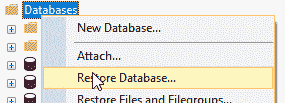
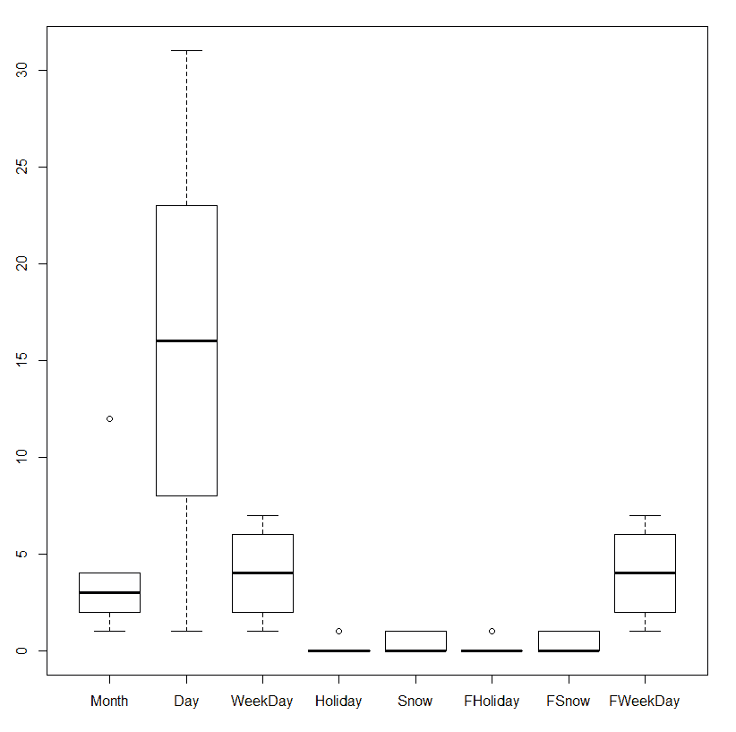
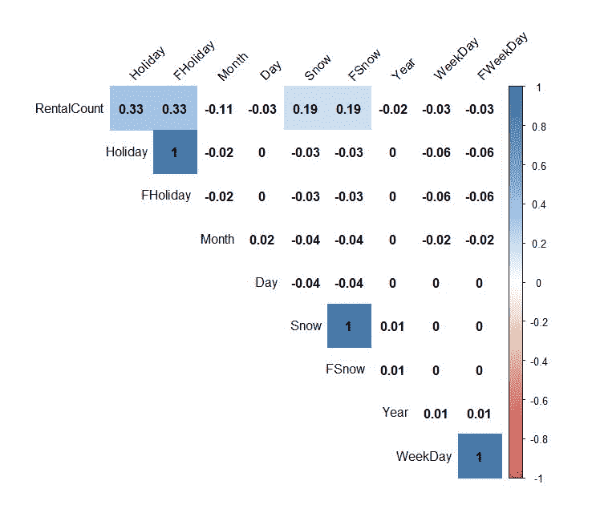
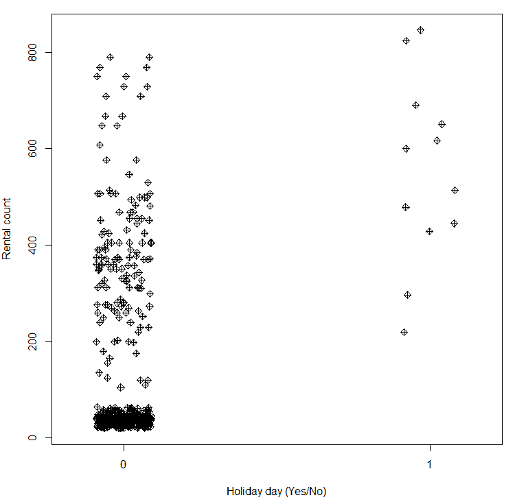
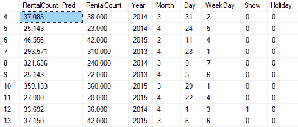
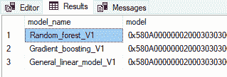
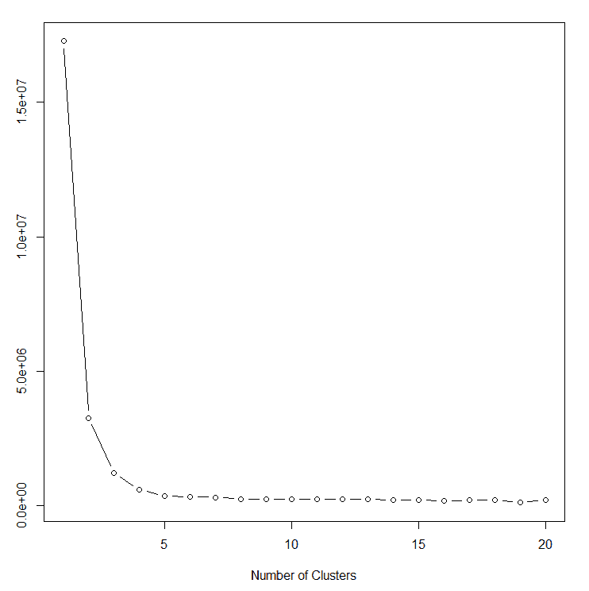
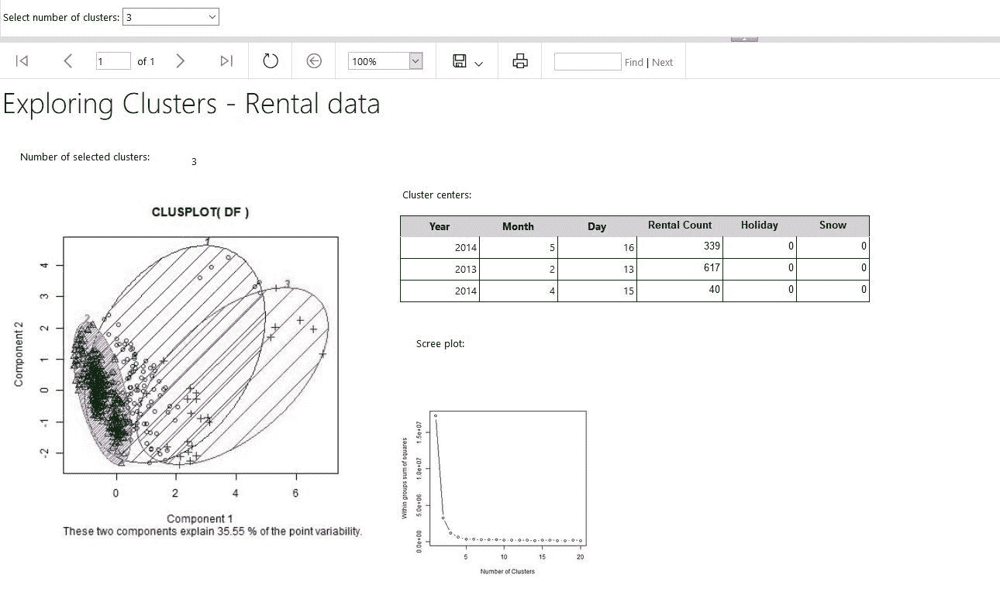

<title>Predictive Modeling</title> 

# 预测建模

预测建模是一个基于预先训练和构建的模型或函数，使用高级统计和概率算法来预测结果的过程。基于预测变量的结果，这些算法可以被分组到一个算法家族中。结果通常是解释未来行为的预测值。几个变量或输入数据组成一个数学函数，也称为模型(因此也称为数据建模)，这些输入数据试图解释或预测结果。为了更好地理解预测建模，本章将包括以下主题:

*   数据建模
*   高级预测算法
*   预测分析
*   部署和使用预测解决方案
*   使用 SQL Server 数据库中的 R 服务执行预测

本章的重点将是通过使用 R 解决您的典型业务问题，深入了解如何在 SQL Server 2016/2017 中使用预测建模。在企业环境中，业务问题可以从非常广泛的方面来定义。例如，在医学中，预测建模可以帮助理解和解决的一个典型问题是，药物 C 的成分 A 和 B 的变化是否有助于治愈疾病？此外，在冶金行业，我们能否模拟防腐涂料如何随着时间的推移而老化，或者在零售行业，客户如何根据自己的需求或行为在商店中选择更好的产品？可以说，我们的日常生活与预测和预报交织在一起。通常，我们所有人面临的每一个后勤问题都是一个潜在的非常相关的主题的简单问题:如果我晚 5 分钟离开家去工作，如果我走捷径等等，这会影响我的驾驶时间吗？从字面上看，我们可以说，我们的日常决策是我们在给定产出下采取的所有行动的总和。

<title>Data modeling</title> 

# 数据建模

数据建模是我们试图用一组独立变量或输入数据找到一个函数(或所谓的模型)的过程。就像在数据仓库中，建模指的是建立基于物理数据结构的概念框架，并借助 ORM 或 UML(甚至 CRC)图来探索数据中的结构，在进行预测分析时探索结构也是如此。对于后者，数据建模是探索两个或更多变量之间的结构(或关系)。这些关系可以表示为函数，并且本质上存储为模型。

为了开始建模，我们将使用以下 GitHub 存储库中的一些微软数据:

[https://github . com/Microsoft/SQL-server-samples/tree/master/samples/features/machine-learning-services/python/getting-started/rental-prediction](https://github.com/Microsoft/sql-server-samples/tree/master/samples/features/machine-learning-services/python/getting-started/rental-prediction)

不要对这个 Python 示例感到困惑:


下载该数据库将会下载`TutorialDB.bak`文件，您只需将该文件恢复到 SQL Server 实例，其中安装了 R in-database。该数据库是本章附带代码的一部分。

数据建模的一部分是建立对后期阶段预测如何工作的理解。因此，在这一阶段，我们将了解变量及其相互关系。从下载的文件创建 restore，并从 backup T-SQL 命令运行以下 restore:

```
USE [master]
BACKUP LOG [TutorialDB] TO DISK = N'C:\Program Files\Microsoft SQL Server\MSSQL14.MSSQLSERVER\MSSQL\Backup\TutorialDB_LogBackup_2018-01-01_23-59-09.bak'
```

```
WITH NOFORMAT, NOINIT, NAME = N'TutorialDB_LogBackup_2018-01-01_23-59-09', NOSKIP, NOREWIND, NOUNLOAD, NORECOVERY , STATS = 5

RESTORE DATABASE [TutorialDB] FROM DISK = N'C:\Program Files\Microsoft SQL Server\MSSQL14.MSSQLSERVER\MSSQL\Backup\TutorialDB.bak' 
WITH FILE = 2, MOVE N'TutorialDB' TO N'C:\Program Files\Microsoft SQL Server\MSSQL14.MSSQLSERVER\MSSQL\DATA\TutorialDB.mdf', 
MOVE N'TutorialDB_log' TO N'C:\Program Files\Microsoft SQL Server\MSSQL14.MSSQLSERVER\MSSQL\DATA\TutorialDB_log.ldf', NOUNLOAD, STATS = 5

GO 
```

或者，您可以简单地在 SSMS 使用`RESTORE`命令:



现在，您已经恢复了数据库，并且可以使用`dbo.rental_data`表。目前，这就足够了。

准备好数据集后，我们现在可以开始通过探索和理解变量以及它们之间的关系来对数据进行建模。这个快速探索可以在 SQL Operation Studio 中执行(下载链接:[https://docs . Microsoft . com/en-us/SQL/SQL-operations-Studio/download](https://docs.microsoft.com/en-us/sql/sql-operations-studio/download))，在这里我们将使用一个简单的查询:

```
SELECT RentalCount,Day,Month, Holiday, Snow FROM rental_data  
```

除了结果的标准表视图，这还将提供一个不错的图表查看器，其中变量的简单图形表示将使您更好地了解数据:


但是没有对描述性统计的一般理解，我们就不继续了。因此，使用`RevoScaleR`包中的`rxSummary`函数将会得到想要的结果:

```
EXEC sp_execute_external_Script
@LANGUAGE = N'R'
,@script = N'
 dr_rent <- InputDataSet
 dr_rent <- data.frame(dr_rent)
    summary <- rxSummary(~ RentalCount  + Year + Month + Day  + WeekDay + Snow + Holiday , data = dr_rent)
    OutputDataSet <- summary$sDataFrame'
,@input_data_1 = N'SELECT  RentalCount, Year, Month, Day, WeekDay, Snow, Holiday FROM rental_data'
WITH RESULT SETS ((
 [Name]   NVARCHAR(100)
 ,Mean   NUMERIC(16,3)
 ,StdDev  NUMERIC(16,3)
 ,[Min]   INT
 ,[Max]  INT
 ,ValidObs  INT
 ,MissingObs INT
));
GO

```

以下是作为简单描述性统计表的结果:


探索单变量和双变量统计是上一篇[第 5 章](part0081.html#2D7TI0-e3f81285367248f4bbc6431bcd4f926d)、 *RevoScaleR 包、*的一部分，但这里我们将更多地关注双变量和多变量统计。在我们开始之前，让我们进一步探索一下这种相关性。根据对变量名和描述性统计数据的研究，常识会告诉我们，在节假日期间，租赁计数应该更高。可以使用相关系数来检查这一点。下面是一个简单的例子:

```
EXEC sp_execute_external_Script
@LANGUAGE = N'R'
,@script = N'
      dr_rent <- InputDataSet
      OutputDataSet <- data.frame(cor(dr_rent$Holiday, dr_rent$RentalCount))
'
,@input_data_1 = N'SELECT  Holiday, RentalCount FROM rental_data'
WITH RESULT SETS ((
 cor NUMERIC(10,3)
 ));
GO

```

这会让你了解`0.332`的双变量关系。这是一个弱相关，但却是一个正相关:


这仅仅意味着，如果变量`RentalCount`变得更高，假期的数量也会增加。这确实是有道理的，因为如果更多的假期到来，预计会有更多的租金。

现在，我们可以通过组合每个变量来继续探索和寻找相关性。这类似于交叉连接，但是有更简单的方法来实现。当然，一种方法是运用常识，选择有意义的相关性:

```
EXEC sp_execute_external_Script
@LANGUAGE = N'R'
,@script = N'
    dr_rent <- InputDataSet
    dr_rent <- data.frame(dr_rent)
    cor_HR <- cor(dr_rent$Holiday, dr_rent$RentalCount)
    cor_FR <- cor(as.numeric(dr_rent$FWeekDay), dr_rent$RentalCount)
    cor_MR <- cor(dr_rent$Month, dr_rent$RentalCount)
    cor_YR <- cor(dr_rent$Year,dr_rent$RentalCount)
    d <- data.frame(cbind(cor_HR, cor_FR, cor_MR, cor_YR))
    OutputDataSet <- d'
    ,@input_data_1 = N'SELECT  Holiday, RentalCount,Month,FWeekDay, Year FROM rental_data'
WITH RESULT SETS ((
 cor_HR NUMERIC(10,3)
,cor_FR NUMERIC(10,3)
,cor_MR NUMERIC(10,3)
,cor_YR NUMERIC(10,3)
));
GO

```

并且我们得到如下图所示的结果。解释和理解结果是非常重要的。因此，到目前为止，假期时间是与租赁数量变量最相关的变量。无论是星期几，还是年份，都不起任何重要作用。`Month`和`RentalCount`之间的`-0.110`有一个非常微小的负相关性，这可以理解为较高的月份可能有较低的租赁数量，反之亦然。既然这种相关性如此微弱，那么对这种特定的相关性大惊小怪就毫无意义(即使它有意义或者没有任何意义):


类似地，我们可以通过绘制箱线图来研究每个变量中的值的分布:



第二种方法是绘制变量之间的相关图。一种方法是调用`corrplot` R 库，它为您提供了一个非常强大和有用的可视化关联。我倾向于创建以下代码:

```
EXEC sp_execute_external_Script
@LANGUAGE = N'R'
,@script = N'
 library(corrplot)  # * footnote
 dr_rent <- InputDataSet

 dr_rent$FWeekDay <- as.numeric(dr_rent$FWeekDay)
 dr_rent$FHoliday <- as.numeric(dr_rent$FHoliday)
            dr_rent$FSnow <- as.numeric(dr_rent$FSnow)

    cor.mtest <- function(mat, ...) {
         mat <- as.matrix(mat)
         n <- ncol(mat)
         p.mat<- matrix(NA, n, n)
         diag(p.mat) <- 0
         for (i in 1:(n - 1)) {
             for (j in (i + 1):n) {
             tmp <- cor.test(mat[, i], mat[, j], ...)
             p.mat[i, j] <- p.mat[j, i] <- tmp$p.value
             }
         }
         colnames(p.mat) <- rownames(p.mat) <- colnames(mat)
         p.mat
         }
    p.mat <- cor.mtest(dr_rent)

    R<-cor(dr_rent)

    col <- colorRampPalette(c("#BB4444", "#EE9988", "#FFFFFF", "#77AADD", "#4477AA"))

    image_file = tempfile(); 
    jpeg(filename = image_file); 

plot_corr <- corrplot(R, method="color", col=col(200), 
 type="upper", order="hclust", 
 addCoef.col = "black", # Add coefficient of correlation
 tl.col="black", tl.srt=45, #Text label color and rotation
 # Combine with significance
 p.mat = p.mat, sig.level = 0.01, insig = "blank", 
 # hide correlation coefficient on the principal diagonal
 diag=FALSE)
 dev.off(); 
OutputDataSet <- data.frame(data=readBin(file(image_file, "rb"), what=raw(), n=1e6));  '

,@input_data_1 = N'SELECT  *  FROM rental_data'
WITH RESULT SETS ((
 correlation_plot varbinary(max)
```

```
));
GO

```

代码从 corrplot lattice 文档中复制并稍作修改。

此程序可在 SSRS 或 Power BI suit 或 Excel 中直接实施和使用；视觉效果如下:



在一张图中，训练有素的眼睛会立即看到相关性及其统计意义。所以，`0.33 RentalCount`和`Holiday`在这里可见，而且`RentalCount`和`Snow`与`0.19`正相关。但是，如果我们想探究价值分散(方差)的行为，我们也可以包括方差分析。

如果您正在处理大型数据集或 XDF 数据格式，`RevoScaleR`软件包还配备了计算和计算相关矩阵的功能。下面是使用`rxCovCor`的 R 代码(或者，也可以使用`rxCor`或`rxCov`):

```
Formula_correlation =  ~ RentalCount + Year + Month + Day  + WeekDay + Snow + Holiday 
allCor <- rxCovCor(Formula_correlation, data = dr_rent, type = "Cor")
allCor

```

这给出了与所有先前相关性计算相同的结果:


该输出还具有查看标准偏差、平均值和权重总和的能力，但最好的部分是它将结果存储在数据框中，该数据框可以轻松导入或与其他 T-SQL 表一起使用。可以使用`allCov$CovCor`调用结果(R 语言将结果存储为列表的对象，可以通过使用美元符号`$`并引用列表的名称来检索每个列表——在本例中为`CovCor`)。

当我们想要进一步调查我们迄今为止在`RentalCount`和`Holiday`之间的最高相关性时，**方差分析** ( **ANOVA** )将是合适的方法。我们将比较两组(或水平)变量`Holiday` ( `0`不是假日，而`1 `是假日)，以及租赁计数之间是否存在差异。通过这样做，计算 F 统计量及其显著性将告诉我们组间方差与组内方差的比率:

```
EXEC sp_execute_external_Script
@LANGUAGE = N'R'
,@script = N'
            #ANOVA
    ANOVA <- aov(RentalCount ~ Holiday, data = InputDataSet) 
            F_Stat<- unlist(summary(ANOVA))[7]
            F_Stat_Sig <- unlist(summary(ANOVA))[9]
            df <- cbind(F_Stat, F_Stat_Sig)
OutputDataSet <- data.frame(df)'

,@input_data_1 = N'SELECT  RentalCount,Holiday FROM rental_data'
WITH RESULT SETS ((
 F_Statistic NVARCHAR(200)
,Statistical_Significance NUMERIC(16,5)
));
GO

```

运行带有 R 代码的 T-SQL 代码进行 ANOVA 的统计计算后，输出结果以返回 F 统计量和统计显著性的方式创建。下图显示了返回的结果:


结果告诉我们，F 统计量在统计上是显著的，尽管它很小，这意味着平均值很可能不相等(在这种情况下，我们将拒绝零假设)。为了找到差异所在，测试会给我们更多的信息。

为了说明这种差异，由于我们不会深入细节，我们可以使用`stripchart`直观显示租赁的假期分布之间的差异:



使用 R 代码:

```
stripchart(RentalCount ~ Holiday, vertical=TRUE, pch=9, 
               data=dr_rent_ANOVA, xlab="Holiday day (Yes/No)", ylab="Rental count", method="jitter", jitter=0.09)

```

案例的分布可以告诉我们，在节假日，平均有`400`或更高的租赁计数，而在正常日子，`10`和`50`之间的计数密度非常大。

在确定哪些特征(变量)有利于进一步分析和预测算法时，我们可以使用降低基尼系数均值计算。`randomForest`包中提供了一个基尼均值函数，因此，让我们调用该函数，看看要使用哪些变量:

```
EXEC sp_execute_external_Script
@LANGUAGE = N'R'
,@script = N'
 library(randomForest)
 dr_rent  <- InputDataSet
 fit_RF <- randomForest(factor(dr_rent$RentalCount)~., data=dr_rent)
 vp_rf <- importance(fit_RF)

      vp_rf<- data.frame(vp_rf)
      imena <- row.names(vp_rf)
      vp_rf <- data.frame(cbind(imena, vp_rf))
    OutputDataSet <- vp_rf'

,@input_data_1 = N'SELECT  *  FROM rental_data'
WITH RESULT SETS ((
    Variable NVARCHAR(200)
,MeanDecreaseGini NUMERIC(16,5)
));
GO    
```

使用 T-SQL 代码，我们返回减少的基尼系数:


`Gini`系数也可以直观地表示为散点图，以便用户可以立即确定哪些变量对模型贡献最大。为了简洁起见，该图的代码包含在代码中，但没有包含在书中。


人们现在可以确定，下列变量中的哪一个在模型中起作用或贡献增益。**meanderecasegini**被绘制为`varImpPlot(fit_RF)`。从技术上来说，这是确定哪些变量或输入参数影响最小或最大的方法，但每种技术都会为您提供一些方面-模型中哪些可能是好的，哪些可能不是。对比相关矩阵和均值下降图中的`Holiday`变量，可以看到它给出了不同的方法和不同的结果。最重要的是通过几种不同的方法，特定的变量没有任何重要性。

<title>Advanced predictive algorithms and analytics</title> 

# 高级预测算法和分析

到目前为止，我们已经检查了`RevoScaleR`包中可用的数据准备和数据探索功能。除了这些功能，还可以预测分类或回归问题，尤其是在处理大型数据集时。

我将仅提及其中的几个。完整的列表可在网上获得([https://docs . Microsoft . com/en-us/machine-learning-server/r-reference/revo scaler/revo scaler](https://docs.microsoft.com/en-us/machine-learning-server/r-reference/revoscaler/revoscaler))，其中一些要点如下:

*   `rxLinMod`:用于建立和预测线性模型
*   `rxLogit`:用于建立和预测逻辑回归模型
*   `rxGlm`:用于创建广义线性模型
*   `rxDTree`:用于创建分类或回归树
*   `rxBTrees`:用于构建分类或回归决策森林，即使用随机梯度推进算法
*   `rxDForest`:用于建立分类或回归决策森林模型
*   `rxNaiveBayes`:用于建立朴素贝叶斯分类模型

所有这些算法都是监督算法家族的一部分，其中`RevoScaleR`包中唯一可用的非监督(或无方向)算法是`rxKMeans`，用于处理聚类。

使用与前面相同的数据集，我们插入并开始使用`rxLinMod`和`rxGlm`来演示如何在 T-SQL 中使用它:

```
USE RentalDB;
GO

-- rxLinMod

EXEC sp_execute_external_Script
@LANGUAGE = N'R'
,@script = N'
            library(RevoScaleR)
            dr_rent <- InputDataSet
            Formula_supervised =  RentalCount ~ Year + Month + Day  + WeekDay + Snow + Holiday             
            #Create Linear Model 
            rent_lm <- rxLinMod(formula=Formula_supervised, data = dr_rent)

            #PREDICT   
            rent_Pred <- rxPredict(modelObject = rent_lm, data = dr_rent, extraVarsToWrite = c("RentalCount","Year","Month","Day"), writeModelVars = TRUE)
            OutputDataSet <- data.frame(rent_Pred)
'
,@input_data_1 = N'SELECT RentalCount,Year, Month, Day, WeekDay,Snow,Holiday  FROM rental_data'
WITH RESULT SETS ((
 RentalCount_Pred    NUMERIC(16,3)
,RentalCount  NUMERIC(16,3)
,YearINT
,MonthINT
,DayINT
,WeekDayINT
,Snow  INT
,Holiday INT
));
GO

-- rxGlm

EXEC sp_execute_external_Script
@LANGUAGE = N'R'
,@script = N'
            library(RevoScaleR)
            dr_rent <- InputDataSet
            Formula_supervised =  RentalCount ~ Year + Month + Day  + WeekDay + Snow + Holiday             

            #PREDICT   
                rent_glm <- rxGlm(formula = Formula_supervised, family = Gamma, dropFirst = TRUE, data = dr_rent)
                rent_Pred <- rxPredict(modelObject = rent_glm, data = dr_rent, extraVarsToWrite=c("RentalCount","Year","Month","Day"), writeModelVars = TRUE)
            OutputDataSet <- data.frame(rent_Pred)'
,@input_data_1 = N'SELECT RentalCount,Year, Month, Day, WeekDay,Snow,Holiday  FROM rental_data'
WITH RESULT SETS ((
 RentalCount_Pred    NUMERIC(16,3)
,RentalCount  NUMERIC(16,3)
,YearINT
,MonthINT
,DayINT
,WeekDayINT
,Snow  INT
,Holiday INT
));
GO

-- rxDTree

EXEC sp_execute_external_Script
@LANGUAGE = N'R'
,@script = N'
            library(RevoScaleR)
            dr_rent <- InputDataSet
            Formula_supervised =  RentalCount ~ Year + Month + Day  + WeekDay + Snow + Holiday             

            #PREDICT   
                        rent_dt <- rxDTree(formula = Formula_supervised, data = dr_rent)
                        rent_Pred <- rxPredict(modelObject = rent_dt, data = dr_rent, extraVarsToWrite=c("RentalCount","Year","Month","Day"), writeModelVars = TRUE)
            OutputDataSet <- data.frame(rent_Pred)

                '
,@input_data_1 = N'SELECT RentalCount,Year, Month, Day, WeekDay,Snow,Holiday  FROM rental_data'
WITH RESULT SETS ((
```

```
 RentalCount_Pred    NUMERIC(16,3)
,RentalCount  NUMERIC(16,3)
,YearINT
,MonthINT
,DayINT
,WeekDayINT
,Snow  INT
,Holiday INT
));
GO  
```

两者都将提供基于输入数据集的预测值以及新的预测值:



好奇的眼睛会告诉你，预测值与原始值相差甚远。因此，两种情况下的预测公式都试图根据变量:`Year`、`Month`、`Day`、`WeekDay`、`Snow`和`Holiday`来预测变量`RentalCount`。公式设置如下:

```
Formula_supervised =  RentalCount ~ Year + Month + Day  + WeekDay + Snow + Holiday 

```

比较变量`RentalCount_Pred`和`RentalCount`将显示实际值和预测值的差异/偏差。

在前面的示例中，您还可以比较所有三种算法的结果。如果您对所有三个数据集进行逐个观察的比较，您可以立即看到哪些算法执行得最好:


因此，黄色条代表原始值，到目前为止，最成功的是决策树算法，给出了上面的公式并理解了数据的洞察力。这张图只是代表了一个随机的观察。这也可以通过计算准确度或度量来实现，所述准确度或度量计算从原始值产生了多少偏差。

<title>Deploying and using predictive solutions</title> 

# 部署和使用预测解决方案

当开发数据库内解决方案并为持续开发(以及部署)而创建它时，应该考虑几个方面。首先，数据科学家将工作的环境。你可以给他们一个强大的独立服务器，甚至在云中分配适当的席位。他们会需要它，尤其是在训练模型的时候。这是非常重要的，因为你不想让你的高薪统计学家和数学家等待模型计算和生成。因此，启用高度可扩展的 CPU 和 RAM 强大的计算能力是必须的。其次，你必须从那里得到数据。无论是在云上还是在本地，都不应该忽视在那里获取数据(以及稍后返回)，因为这也可能是您会失去宝贵时间的地方。最后，为环境设置适当的设置、环境变量、包和所有通向专有软件的路径也很重要。

`RevoScaleR`软件包配有轻松切换计算环境的功能。我们现在将调用 R 中的一个简单命令:

```
rxSetComputeContext(local)
rxSetComputeContext(sql)  
```

通过这样做，您可以设置本地计算环境(即客户端的机器)或服务器端，在这种情况下，一个独立的 R 服务器将驻留在服务器端。当然，通过一个简单的函数调用，计算上下文(或简单环境)被切换，记住所有的数据都驻留在两端(这样可以避免不必要的数据传输)，并且所有的服务器环境变量都被正确设置。

为了训练模型，可以选择几个好的实践。分割数据用于训练、测试或训练，以及测试和验证是几种实践。此外，一个非常好的实践是测试训练/测试/验证数据集的百分比。你可能得到 50/50 或 60/40 或 70/30 的百分比，但通常你在挖掘数据时执行并决定这一点。之后，您还应该考虑数据的验证；几个方面是可用的，从**留一个** ( **LOO** )或 10 倍或 5 倍，用于选择验证结果的验证数据。

不要太深入这个话题，为了让这个演示更简单，我们可以当场决定做一个 70/30 的百分比。因为我们在这里享受到了 T-SQL 数据库的乐趣，所以我们可以在一个表中选择和存储训练子集，或者创建一个视图，或者决定我们想要取哪 70%。

```
-- We can set 70% of the original data
-- IN SQL Server
SELECT
TOP (70)PERCENT
*
INTO dbo.Train_rental_data
FROM rental_data
ORDER BY ABS (CAST(BINARY_CHECKSUM(RentalCount,NEWID())asint))ASC
-- (318 rows affected) 

-- Or we can set by the year; year 2013 and 2014 for training and 2015 for testing? making it cca 70% for training as well
SELECT COUNT(*),YEAR FROM rental_data GROUP BY YEAR

```

这也很大程度上取决于你的商业模式。第一种方法只是从原始数据集中提取 70%的数据，而第二个 select 语句提取大约 70%的原始数据，但是根据租赁年份进行拆分。这可能会对模型的行为方式以及您希望决策受到的影响产生至关重要的影响，尤其是业务模型。

一旦清除并覆盖了这一点，最佳实践是将训练好的模型存储在表中，以便更快地进行预测。我们现在将创建一个表格，如下所示:

```
-- or in R
EXEC sp_execute_external_Script
        @language = N'R'
        ,@script = N'
                        library(caTools)

                        set.seed(2910) 
                        dr_rent <- InputDataSet
                        Split <- .70
                        sample = sample.split(dr_rent$RentalCount, SplitRatio = Split)
                        train_dr_rent <- subset(dr_rent, sample == TRUE)
                        test_dr_rent  <- subset(dr_rent, sample == FALSE)
            OutputDataSet <- data.frame(train_dr_rent)

                '
,@input_data_1 = N'SELECT * FROM rental_data'
WITH RESULT SETS ((
         [Year] INT
        ,[Month] INT
        ,[Day] INT
        ,[RentalCount] INT
        ,[WeekDay] INT
        ,[Holiday] INT
        ,[Snow] INT
        ,[FHoliday] INT
        ,[FSnow] INT
        ,[FWeekDay] INT
));
GO 
```

由于定义了`set.seed`,无论在哪里运行这段代码，您都将得到相同的子集。如果你想得到不同的结果，你应该把它注释掉。

一旦采样再次完成，基于您预测的问题，您需要定义您的预测公式。在这种情况下，我使用公式转换器来创建一个正确的公式:

```
-- Variables to keep
-- and creating formula
EXEC sp_execute_external_Script
        @language = N'R'
        ,@script = N'
        dr_rent <- InputDataSet
            variables_all <- rxGetVarNames(dr_rent)
            variables_to_remove <- c("FSnow", "FWeekDay", "FHoliday")
            traning_variables <- variables_all[!(variables_all %in% c("RentalCount", variables_to_remove))]
            #use as.formula to create an object
        formula <- as.formula(paste("RentalCount ~", paste(traning_variables, collapse = "+")))
                #formula <- paste("RentalCount ~", paste(traning_variables, collapse = "+"))
            OutputDataSet <- data.frame(formula)'
,@input_data_1 = N'SELECT * FROM dbo.Train_rental_data'
WITH RESULT SETS ((
         [Formula_supervised] NVARCHAR(1000)
));
GO 
```

通过过程创建公式，使其不被硬编码，也是一种非常有用的方法，特别是在企业环境中，数据科学家将建立自变量池，然后数据工程师将选择包括哪些变量，然后推动数据来计算模型并部署它。

双变量和多变量统计的过程还可以让数据工程师和管理者更好地洞察和理解数据是如何操作和关联的，并且不存在不必要的相关性或不起作用的变量。

弄清楚这一点后，我们可以设置和构建运行模型训练的过程，并将模型存储在数据库中。由于本章篇幅有限，我将只展示一个过程的创建；其余程序可在随附的章节材料中找到:

T-SQL 中随机森林的过程如下所示:

```
-- Random forest

DROP PROCEDURE IF EXISTS dbo.forest_model;
GO

CREATE OR ALTER PROCEDURE dbo.forest_model(
         @trained_model VARBINARY(MAX)OUTPUT
        ,@accuracy FLOATOUTPUT
        )
AS
BEGIN
EXEC sp_execute_external_script
@language = N'R'
,@script = N'
                        library(RevoScaleR)
                        library(caTools)
            library(MLmetrics)

                        dr_rent <- InputDataSet
                        set.seed(2910) 
                        Split <- .70
                        sample = sample.split(dr_rent$RentalCount, SplitRatio = Split)
                        train_dr_rent <- subset(dr_rent, sample == TRUE)
                        test_dr_rent  <- subset(dr_rent, sample == FALSE)

                        y_train <- train_dr_rent$RentalCount
                        y_test <- test_dr_rent$RentalCount

            variables_all <- rxGetVarNames(dr_rent)
            variables_to_remove <- c("FSnow", "FWeekDay", "FHoliday")
            traning_variables <- variables_all[!(variables_all %in% c("RentalCount", variables_to_remove))]
            formula <- as.formula(paste("RentalCount ~", paste(traning_variables, collapse = "+")))

                        forest_model <- rxDForest(formula = formula,
                          data = train_dr_rent,
                          nTree = 40,
                          minSplit = 10,
                          minBucket = 5,
                          cp = 0.00005,
                          seed = 5)

                        trained_model <- as.raw(serialize(forest_model, connection=NULL))

                        #calculating accuracy
            y_predicted<- rxPredict(forest_model,test_dr_rent)

            predict_forest <-data.frame(actual=y_test,pred=y_predicted)
            #ConfMat <- confusionMatrix(table(predict_forest$actual,predict_forest$RentalCount_Pred))
            #accuracy <- ConfMat$overall[1]
            accu <- LogLoss(y_pred = predict_forest$RentalCount_Pred , y_true =predict_forest$actual)
            accuracy <- accu'

        ,@input_data_1 = N'SELECT * FROM dbo.rental_data'
        ,@params = N'@trained_model VARBINARY(MAX) OUTPUT, @accuracy FLOAT OUTPUT'
        ,@trained_model = @trained_model OUTPUT
        ,@accuracy = @accuracy OUTPUT;
END;
GO 
```

我在程序中添加了一些额外的东西，这样每次模型被训练时，都会添加一个额外的东西。这就是准确性，这也将在后面的阶段中给数据工程师和管理者一个很好的洞察力来决定哪个模型优于其他模型。

您可以简单地运行以下过程:

```
DECLARE @model VARBINARY(MAX);
DECLARE @accur FLOAT;
EXEC dbo.forest_model@model OUTPUT, @accur OUTPUT;
INSERT INTO [dbo].[Rental_data_models](model_name, model, accuracy) VALUES ('Random_forest_V1', @model, @accur);
GO  
```

这将填充保存模型的目标表。结果应存储在表`[dbo].[Rental_data_models]`中:



一旦完成，您还需要设置评估程序，这将有助于确定哪个模型功能最好。然而，这一部分可以使用 Power BI 或 reporting services 来完成，或者只使用 r。

这是 R 代码的一部分，可以包含在您的可视化工具中，以便于理解:

```
library(RevoScaleR) 
library(caTools) 
library(MLmetrics) 

#evaluate_model function; Source: Microsoft 
evaluate_model <- function(observed, predicted_probability, threshold, model_name) {  

  # Given the observed labels and the predicted probability, plot the ROC curve and determine the AUC. 
  data <- data.frame(observed, predicted_probability) 
  data$observed <- as.numeric(as.character(data$observed)) 
  if(model_name =="RF"){ 
    rxRocCurve(actualVarName = "observed", predVarNames = "predicted_probability", data = data, numBreaks = 1000, title = "RF" ) 
  }else{ 
    rxRocCurve(actualVarName = "observed", predVarNames = "predicted_probability", data = data, numBreaks = 1000, title = "GBT" ) 
  } 
  ROC <- rxRoc(actualVarName = "observed", predVarNames = "predicted_probability", data = data, numBreaks = 1000) 
  auc <- rxAuc(ROC) 

  # Given the predicted probability and the threshold, determine the binary prediction. 
  predicted <- ifelse(predicted_probability > threshold, 1, 0)  
  predicted <- factor(predicted, levels = c(0, 1))  

  # Build the corresponding Confusion Matrix, then compute the Accuracy, Precision, Recall, and F-Score. 
  confusion <- table(observed, predicted) 
  print(model_name) 
  print(confusion)  
  tp <- confusion[1, 1]  
  fn <- confusion[1, 2]  
  fp <- confusion[2, 1]  
  tn <- confusion[2, 2]  
  accuracy <- (tp + tn) / (tp + fn + fp + tn)  
  precision <- tp / (tp + fp)  
  recall <- tp / (tp + fn)  
  fscore <- 2 * (precision * recall) / (precision + recall)  

  # Return the computed metrics. 
  metrics <- list("Accuracy" = accuracy,  
"Precision" = precision,  
"Recall" = recall,  
"F-Score" = fscore, 
"AUC" = auc)  
  return(metrics)  
}  

RF_Scoring <- rxPredict(forest_model, data = train_dr_rent, overwrite = T, type = "response",extraVarsToWrite = c("RentalCount")) 

Prediction_RF <- rxImport(inData = RF_Scoring, stringsAsFactors = T, outFile = NULL) 
observed <- Prediction_RF$RentalCount 

# Compute the performance metrics of the model. 
Metrics_RF <- evaluate_model(observed = observed, predicted_probability = Prediction_RF$RentalCount_Pred , model_name = "RF", threshold=50) 

# Make Predictions, then import them into R. The observed Conversion_Flag is kept through the argument extraVarsToWrite. 
GBT_Scoring <- rxPredict(btree_model,data = train_dr_rent, overwrite = T, type="prob",extraVarsToWrite = c("RentalCount")) 

Prediction_GBT <- rxImport(inData = GBT_Scoring, stringsAsFactors = T, outFile = NULL) 
observed <- Prediction_GBT$RentalCount 
```

观察值应该会告诉您哪个模型的性能最好。一旦你做到了这一点，你就可以选择模型，看看如何进行预测。

<title>Performing predictions with R Services in the SQL Server database</title> 

# 使用 SQL Server 数据库中的 R 服务执行预测

调用存储过程是组织代码并立即开始预测的最简单方法。

同样，这里只显示一个示例，说明如何创建一个存储过程来预测新数据集:

```
CREATE OR ALTER PROCEDURE [dbo].[Predicting_rentalCount] 
(
                 @model VARCHAR(30)
                ,@query NVARCHAR(MAX)
)
AS
BEGIN
        DECLARE @nar_model VARBINARY(MAX) = (SELECT model FROM [dbo].[Rental_data_models] WHERE model_name = @model);

        EXEC sp_execute_external_script
                 @language = N'R'
                ,@script = N'

                                #input from query
                                new_data <- InputDataSet

                                #model from query
                                model <- unserialize(nar_model)                      

                                #prediction
                                prediction <- rxPredict(model,data = new_data, overwrite = TRUE, type="response",extraVarsToWrite = c("RentalCount"))
                                Prediction_New <- rxImport(inData = prediction, stringsAsFactors = T, outFile = NULL)

                                OutputDataSet <- data.frame(Prediction_New)

                                '
                ,@input_data_1 =  @query
                ,@params = N'@nar_model VARBINARY(MAX)'
                ,@nar_model = @nar_model
        WITH RESULT SETS((               
                  Prediction_new NVARCHAR(1000)
                 , OrigPredictecCount NVARCHAR(1000)
        ))
END; 
```

完成后，您可以使用以下代码开始预测:

```
-- Example of running predictions against selected model
EXEC [dbo].[Predicting_rentalCount]  
         @model = N'Random_forest_V1'
        ,@query = N'SELECT 
                                        2014 AS Year
                                        ,5 AS Month
                                        ,12 AS Day
                                        ,1 AS WeekDay
                                        ,0 AS Holiday
                                        ,0 AS Snow
                                        ,0 AS RentalCount'
```

并且，作为结果，你将得到`Year`、`Month`、`Day`、`WeekDay`、`Holiday`和`Snow`变量的预测值:


有意地，字段`OrigPredictedCount`被设置为`0`，但是新的预测值是`278.996`的值，并且基于输入变量。在检查模型如何学习的同时，最好也检查原始值:

```
SELECT
*
FROM Rental_data
WHERE [year] = 2014
AND [day] = 12  
```

我们看到月份`= 5`中没有值，因此模型必须从其他值中学习:


现在我们已经介绍了监督预测算法，让我们快速进入集群——这是`RevoScaleR`包作为唯一的无向算法支持的功能的一部分。

以下是如何创建简单聚类的示例:

```
library("cluster") 
# and remove the Fholidays and Fsnow variables 
DF <- DF[c(1,2,3,4,5,6,7)] 
XDF <- paste(tempfile(), "xdf", sep=".") 
if (file.exists(XDF)) file.remove(XDF) 
rxDataStep(inData = DF, outFile = XDF) 

# grab 3 random rows for starting  
centers <- DF[sample.int(NROW(DF), 3, replace = TRUE),]  

Formula =  ~ Year + Month + Day + RentalCount + WeekDay + Holiday + Snow  

# Example using an XDF file as a data source 
z <- rxKmeans(formula=Formula, data = DF, centers = centers) 
clusplot(DF, z$cluster, color=TRUE, shade=TRUE, labels=4, lines=0, plotchar = TRUE) 
```

以下是输出，它是集群的表示形式:


要研究集群并使用不同数量的集群，可以肯定的是直接使用 R 代码，或者使用 Power BI、Excel 或 SSRS 创建一个报告来研究集群的特征。

添加一些关于集群中心的附加信息，如`withinSS`、`betweenSS`、`totSS`等统计数据也将有助于我们理解集群。

Scree plot 也是选择正确集群数量的一个额外的非常好的演示。将这样的图形添加到报告中还将帮助用户选择正确的集群数量，并帮助他们理解集群是如何形成的。

Scree plot R 代码用于确定肘发生的位置，以及是否具有正确的聚类数；如果是这样，三个集群将是最佳数量:

```
wss <- (nrow(DF) - 1) * sum(apply(DF, 2, var)) 
for (i in 2:20) 
  wss[i] <- sum(kmeans(DF, centers = i)$withinss) 
plot(1:20, wss, type = "b", xlab = "Number of Clusters", ylab = "Within groups sum of squares") 
```

在此图中，我们可以看到创建弯头的位置，我们可以确定最佳解决方案是三个集群:



将所有内容整合成一份报告(SSRS 报告)会让探索变得更好:



用户可以通过选择所需的数量来更改集群的数量，报告也会相应地更改。该报告基于三个附加过程，这些过程根据输入的聚类数导出图形:

```
CREATE OR ALTER  PROCEDURE [dbo].[Clustering_rentalCount] 
(
                 @nof_clusters VARCHAR(2)
)
AS
BEGIN

DECLARE @SQLStat NVARCHAR(4000)
SET @SQLStat = 'SELECT  * FROM rental_data'
DECLARE @RStat NVARCHAR(4000)
SET @RStat = 'library(ggplot2)
                library(RevoScaleR)
library(cluster)
              image_file <- tempfile()
              jpeg(filename = image_file, width = 400, height = 400)
 DF <- data.frame(dr_rent)
               DF <- DF[c(1,2,3,4,5,6,7)]
XDF <- paste(tempfile(), "xdf", sep=".")
               if (file.exists(XDF)) file.remove(XDF)
                rxDataStep(inData = DF, outFile = XDF)

                centers <- DF[sample.int(NROW(DF), 3, replace = TRUE),] 
Formula =  ~ Year + Month + Day + RentalCount + WeekDay + Holiday + Snow 
                rxKmeans(formula = Formula, data = XDF, numClusters='+@nof_clusters+')
                z <- rxKmeans(formula=Formula, data = DF, numClusters='+@nof_clusters+')
                clusplot(DF, z$cluster, color=TRUE, shade=TRUE, labels=4, lines=0, plotchar = TRUE)
dev.off()
                    OutputDataSet <- data.frame(data=readBin(file(image_file, "rb"), what=raw(), n=1e6))'

EXECUTE sp_execute_external_script
        @language = N'R'
       ,@script = @RStat
       ,@input_data_1 = @SQLStat
       ,@input_data_1_name = N'dr_rent'
WITH RESULT SETS ((plot varbinary(max)))
END;
GO 
```

在 SSMS 运行这个程序会得到一个 var 二进制字符串，但是在 SSRS 或 Power BI/Excel 中添加这个程序的结果作为图像会得到一个从 r

在构建预测分析系统的基础上，为您的探索性项目添加一个漂亮的可视化效果，对于企业和最终用户，以及数据辩论者和工程师来说，无疑是一个非常好的总结。

<title>Summary</title> 

# 摘要

在这一章中，我们已经介绍了`RevoScaleR`包的可扩展功能，以根据探索的数据集提供快速而准确的预测。在前一章*使用 RevoScaleR 包进行统计学习*中，我们已经介绍了数据探索、准备以及简单和双变量统计。本章展示了如何将`RevoScaleR`包设计为处理大型数据集(克服了 RAM 和单 CPU 的限制)，支持溢出到磁盘和多线程。同样的过程也可以用在 R 的数据库实例中，用于向您的业务和驻留在数据库中的数据传递预测。我们也讨论了这个方面，探索了不同的算法并比较了解决方案。一旦你选择了你的模型，你可能想要使用`PREDICT`条款。这是 SQL Server 2017 中的一项新功能，架构略有变化。请注意，目前(在撰写本章时)如果您想使用`PREDICT`子句，模型大小不能超过 100 MB。目前只支持`RevoScaleR`和`MicrosoftML`包使用该子句，甚至不支持所有的`RevoScaleR`(和 MicrosoftML)算法——目前支持的有`rxLinMod`、`rxLogit`、`rxBTrees`、`rxDtree`、`rxdForest`。但是，这种使用`PREDICT`子句的实时评分肯定会在 SQL Server 的下一个版本中得到发展和演变。

我们需要预测一个分类或回归问题。使用`RevoScaleR`包可以支持大多数问题，并且`MicrosoftML`包中可用的一组新的附加分类器也支持这些算法。探索这两个软件包将会给你的决策带来急需的动力。此外，将序列化模型存储到数据库中是存储和调用定型模型(函数)的最佳方式，可以通过使用 SQL Server 代理或触发器添加简单的逻辑实现来对定型模型(函数)进行重新定型。

在[第 07 章](part0102.html#318PC0-e3f81285367248f4bbc6431bcd4f926d)、*操作化 R 代码*中，您将学习如何操作化您的模型和解决方案，并探索不同的操作方法和一些好的实践。