# 操作化 R 代码

在前一章中，您已经学习了预测建模的基本知识，并探索了`RevoScaleR`包中提供的高级预测算法，现在是学习如何操作它的好时机。本章讨论如何在 SQL Server 2016 和 SQL Server 2017 中操作 R 预测模型。

将 SQL Server 和机器学习结合起来的想法是为了让分析贴近数据，并消除成本和安全风险。此外，使用 Microsoft R 库有助于提高 R 解决方案的规模和性能。

本章概述了将 R 预测模型操作化到集成在 SQL Server 中的强大工作流中的步骤。首先，我们将讨论使用可扩展性框架、原生评分(SQL Server 2017)和实时评分将现有 R 模型集成到 SQL Server 的概念。然后，我们将讨论如何管理角色和权限以在 SQL Server 中运行 R 模型。您还将了解如何使用正确的工具在 SQL Server 中操作 R 模型，以及如何将 R 模型作为工作流、PowerShell、SQL Server 代理作业和 SSIS 的一部分来执行。


# 集成现有的 R 模型

本节将生成 R 模型并针对 SQL Server 数据集运行的现有 R 代码引入工作流，在工作流中可以定期刷新和评估模型，然后用于预测分析。下图显示了 R 脚本中的典型预测建模工作流:


图 7.1:典型的预测建模工作流程

要将该脚本集成到 SQL Server 中，您需要将工作流组织成三个步骤:

1.  为培训准备数据
2.  使用 T-SQL 定型并保存模型
3.  将模型付诸实施

在本节中，最后两步将使用`sp_execute_external_script`，它调用一个 R 流程。这些步骤使用了 SQL Server 可扩展性框架，稍后将对此进行描述。


# 先决条件-准备数据

我们将使用来自 *R:针对 SQL 开发人员的数据库内分析*教程的纽约市出租车样本数据，如[https://github . com/Microsoft/SQL-server-samples/blob/master/samples/features/R-services/predictive-Analytics/scripts/lab . MD](https://github.com/Microsoft/sql-server-samples/blob/master/samples/features/r-services/predictive-analytics/scripts/Lab.md)中所述。

您也可以从 Packt 代码文件库中下载`nyctaxi_sample.csv`文件，并执行下面的`bcp`命令:

```
bcp <database name>.dbo.nyctaxi_sample in <file path> -c -t, -T -S<server name>
```

其中:

*   `<database name>`是数据库的名称
*   `<file path>`是`nyctaxi_sample.csv`文件的位置
*   `<server name>`是您的服务器名。

举个例子:

```
bcp NYCTaxi.dbo.nyctaxi_sample in c:\nyctaxi_sample.csv -c -t, -T -SMsSQLGirl
```

在这种情况下，目标是预测倾翻的可能性。作为该过程的一部分，我们将创建一个逻辑回归模型，以及该模型的**受试者操作特征** ( **ROC** )曲线及其曲线下的**面积** ( **AUC** )。ROC 是诊断测试的各种阈值点的真阳性率对假阳性率的图。曲线越接近 ROC 空间的对角线，测试越不准确。

曲线越靠近左边界和上边界，就越精确。AUC 以数字形式提供准确性测试。幸运的是，ROC 图和 AUC 值都可以很容易地用 r 计算出来。

一旦我们确信模型足够准确，我们就可以分享它，并根据提供的输入信息，重新使用它来预测出租车司机是否会被小费。

以下是我们将用于训练的纽约市出租车数据集的表定义:

```
CREATE TABLE [dbo].[nyctaxi_sample]( 
   [medallion] [varchar](50) NOT NULL, 
   [hack_license] [varchar](50) NOT NULL, 
   [vendor_id] [char](3) NULL, 
   [rate_code] [char](3) NULL, 
   [store_and_fwd_flag] [char](3) NULL, 
   [pickup_datetime] [datetime] NOT NULL, 
   [dropoff_datetime] [datetime] NULL, 
   [passenger_count] [int] NULL, 
   [trip_time_in_secs] [bigint] NULL, 
   [trip_distance] [float] NULL, 
   [pickup_longitude] [varchar](30) NULL, 
   [pickup_latitude] [varchar](30) NULL, 
   [dropoff_longitude] [varchar](30) NULL, 
   [dropoff_latitude] [varchar](30) NULL, 
   [payment_type] [char](3) NULL, 
   [fare_amount] [float] NULL, 
   [surcharge] [float] NULL, 
   [mta_tax] [float] NULL, 
   [tolls_amount] [float] NULL, 
   [total_amount] [float] NULL, 
   [tip_amount] [float] NULL, 
   [tipped] [int] NULL, 
   [tip_class] [int] NULL 
) ON [PRIMARY] 
GO 
```

我们可以用几个变量来分析出租车司机被小费的可能性。正如您在前一章中所了解到的，您会想要尝试一些变量和算法来确定哪一个更准确。这可能涉及到一些迭代过程，这就是数据科学的魅力所在——您不断地进行实验。

首先，让我们使用以下变量:

| **变量** | **类型** | **栏目名称** |
| 出租车司机得到小费(是/否) | 输出 | `tipped` |
| 乘客数量 | 投入 | `passenger_count` |
| 以秒为单位的行程时间 | 投入 | `trip_time_in_seconds` |
| 出租车计价器显示的行程距离 | 投入 | `trip_distance` |
| 基于两个位置之间的经度和纬度的直接距离 | 投入 | `pickup_longitude``pickup_latitude``dropoff_longitude``dropoff_latitude` |

为了更容易计算直接距离，让我们定义以下函数:

```
CREATE FUNCTION [dbo].[fnCalculateDistance]  
(@Lat1 FLOAT, @Long1 FLOAT, @Lat2 FLOAT, @Long2 FLOAT) 
-- User-defined function calculate the direct distance  
-- between two geographical coordinates. 
RETURNS FLOAT 
AS 
BEGIN 
  DECLARE @distance DECIMAL(28, 10) 
  -- Convert to radians 
  SET @Lat1 = @Lat1 / 57.2958 
  SET @Long1 = @Long1 / 57.2958 
  SET @Lat2 = @Lat2 / 57.2958 
  SET @Long2 = @Long2 / 57.2958 
  -- Calculate distance 
  SET @distance = (SIN(@Lat1) * SIN(@Lat2)) + (COS(@Lat1) * COS(@Lat2) * COS(@Long2 - @Long1)) 
  --Convert to miles 
  IF @distance <> 0 
  BEGIN 
    SET @distance = 3958.75 * ATAN(SQRT(1 - POWER(@distance, 2)) / @distance); 
  END 
  RETURN @distance 
END 
```

这是我们希望存储在数据库中的已训练预测模型的表定义。将训练好的预测模型存储在表中的一个优点是，我们可以在以后轻松地重用它，并且可以对我们的实验进行版本控制。

请注意，有一个专栏叫做`IsRealTimeScoring`。SQL Server 2017 增加了实时评分的新功能，这将在*集成 R 模型进行实时评分*一节中讨论。如果您使用的是 SQL Server 2016，请忽略此值:

```
CREATE TABLE [dbo].[NYCTaxiModel]( 
   [Model] VARBINARY(MAX) NOT NULL, 
   [AUC] FLOAT NULL, 
   [CreatedOn] DATETIME NOT NULL 
         CONSTRAINT DF_NYCTaxiModel_CreatedOn DEFAULT (GETDATE()), 
   [IsRealTimeScoring] BIT NOT NULL  
         CONSTRAINT DF_NYCTaxiModel_IsRealTimeScoring DEFAULT (0) 
) ON [PRIMARY]  
```


# 步骤 1–使用 T-SQL 训练并保存模型

在这一步中，您可以通过存储过程在表中创建一个预测模型(以及可选的分数)。这背后的动机是，我们希望保存模型以供重用，而不是每次智能应用程序需要进行预测时都创建一个新模型:

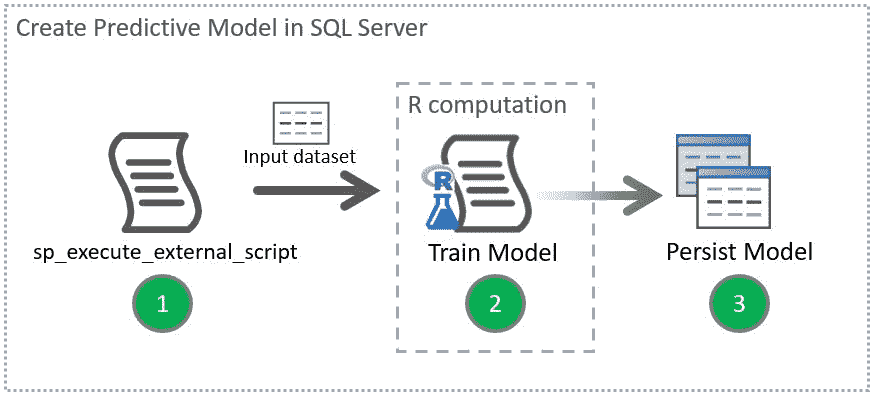

图 7.2:创建预测模型并将其存储在 SQL Server 中

在*图 7.2* 中，我们假设数据管理部分已经完成，输入数据集已准备好供 R 计算使用，以便对模型进行训练和评分。

下面是一个存储过程的示例，该存储过程基于纽约市出租车样本数据集生成预测模型，并将其保存在一个表中。该模型预测倾倒的可能性。模型和模型的 AUC 都保存在`dbo.nyc_taxi_models_v2`表中:

```
CREATE PROCEDURE [dbo].[uspTrainTipPredictionModel] 
AS 
BEGIN 
   DECLARE @auc FLOAT; 
   DECLARE @model VARBINARY(MAX); 

   -- The data to be used for training 
   DECLARE @inquery NVARCHAR(MAX) = N' 
         SELECT  
               tipped,  
               fare_amount,  
               passenger_count, 
               trip_time_in_secs, 
               trip_distance, 
               pickup_datetime,  
               dropoff_datetime, 
               dbo.fnCalculateDistance(pickup_latitude,  
                     pickup_longitude,   
                     dropoff_latitude,  
                     dropoff_longitude) as direct_distance 
         FROM dbo.nyctaxi_sample 
         TABLESAMPLE (10 PERCENT) REPEATABLE (98052)' 

  -- Calculate the model based on the trained data and the AUC. 
  EXEC sp_execute_external_script @language = N'R', 
                                  @script = N' 
         ## Create model 
         logitObj <- rxLogit(tipped ~ passenger_count +  
                           trip_distance +  
                           trip_time_in_secs +  
                           direct_distance,  
                           data = InputDataSet); 
         summary(logitObj) 

         ## Serialize model             
         model <- serialize(logitObj, NULL); 
         predOutput <- rxPredict(modelObject = logitObj,  
                     data = InputDataSet, outData = NULL,  
                     predVarNames = "Score", type = "response",  
                     writeModelVars = FALSE, overwrite = TRUE); 

         library(''ROCR''); 
         predOutput <- cbind(InputDataSet, predOutput); 

         auc <- rxAuc(rxRoc("tipped", "Score", predOutput)); 
         print(paste0("AUC of Logistic Regression Model:", auc)); 
         ', 
     @input_data_1 = @inquery,      
     @output_data_1_name = N'trained_model', 
     @params = N'@auc FLOAT OUTPUT, @model VARBINARY(MAX) OUTPUT', 
     @auc = @auc OUTPUT, 
     @model = @model OUTPUT; 

  -- Store the train model output and its AUC  
  INSERT INTO [dbo].[NYCTaxiModel] (Model, AUC) 
  SELECT @model, @auc; 

END 
GO 
```

一旦定义了这个存储过程，就可以执行它来生成模型和 AUC。例如:

```
EXEC [dbo].[uspTrainTipPredictionModel] 
```

然后，通过执行以下语句查看`NYCTaxiModel`表的内容:

```
SELECT [Model], [AUC], [CreatedOn], [IsRealTimeScoring] 
FROM [dbo].[NYCTaxiModel] 
```

如果存储过程正确执行，您应该会看到类似如下的记录:


# 第 2 步–操作模型

作为上一步的一部分，一旦创建了模型并将其存储在表中，我们现在就可以创建一个存储过程，智能应用程序可以调用它来预测倾翻:

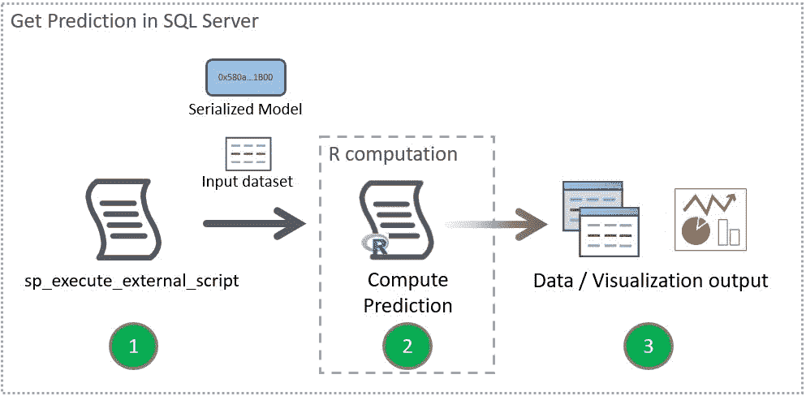

图 7.3:在 SQL Server 中获取预测

图 7.3 展示了实现预测模型的存储过程的工作流程。

这是一个存储过程的例子，其中我们使用了一个保存的模型，以及我们想要预测的数据集。我们使用的是最新的模型:

```
CREATE PROCEDURE [dbo].[uspPredictTipSingleMode]  
   @passenger_count int = 0, 
   @trip_distance float = 0, 
   @trip_time_in_secs int = 0, 
   @pickup_latitude float = 0, 
   @pickup_longitude float = 0, 
   @dropoff_latitude float = 0, 
   @dropoff_longitude float = 0 
AS 
BEGIN 

  DECLARE @inquery nvarchar(max) = N' 
   SELECT  
         @passenger_count as passenger_count, 
         @trip_distance as trip_distance, 
         @trip_time_in_secs as trip_time_in_secs, 
         [dbo].[fnCalculateDistance] ( 
               @pickup_latitude, 
               @pickup_longitude, 
               @dropoff_latitude, 
               @dropoff_longitude) as direct_distance'; 

  DECLARE @lmodel2 varbinary(max); 

  -- Get the latest non-real-time scoring model 
  SET @lmodel2 = (SELECT TOP 1 
               [Model] 
               FROM [dbo].[NYCTaxiModel] 
               WHERE IsRealTimeScoring = 0 
               ORDER BY [CreatedOn] DESC); 

  EXEC sp_execute_external_script @language = N'R', 
   @script = N' 
         mod <- unserialize(as.raw(model)); 
         print(summary(mod)) 
         OutputDataSet<-rxPredict(modelObject = mod,  
data = InputDataSet,  
                           outData = NULL, predVarNames = "Score",  
                           type = "response",  
writeModelVars = FALSE,  
overwrite = TRUE); 
               str(OutputDataSet) 
               print(OutputDataSet)', 
         @input_data_1 = @inquery, 
         @params = N'@model varbinary(max), 
@passenger_count int, 
@trip_distance float, 
                           @trip_time_in_secs INT , 
                           @pickup_latitude FLOAT , 
                           @pickup_longitude FLOAT , 
                           @dropoff_latitude FLOAT , 
                           @dropoff_longitude FLOAT',
```

```
 @model = @lmodel2, 
         @passenger_count =@passenger_count , 
         @trip_distance=@trip_distance, 
         @trip_time_in_secs=@trip_time_in_secs, 
         @pickup_latitude=@pickup_latitude, 
         @pickup_longitude=@pickup_longitude, 
         @dropoff_latitude=@dropoff_latitude, 
         @dropoff_longitude=@dropoff_longitude 
  WITH RESULT SETS ((Score FLOAT)); 

END 
GO 
```

一旦创建了`[dbo].[uspPredictTipSingleMode]`，您的应用程序现在就可以使用这个存储过程来获得分数(翻倒的概率)；例如:

```
EXEC [dbo].[uspPredictTipSingleMode]  
    @passenger_count = 2 
   ,@trip_distance   = 10 
   ,@trip_time_in_secs     = 1950 
   ,@pickup_latitude = 47.643272 
   ,@pickup_longitude      = -122.127235 
   ,@dropoff_latitude      = 47.620529 
   ,@dropoff_longitude     = -122.349297 
```

输出应该类似于以下内容。在这种情况下，值 0.64 表示被倾倒的概率，即 64%:

```
Score 
---------------------- 
0.640058591034195 
```


# 快速批量预测

正如上一节所看到的，模型训练步骤和预测步骤都调用了`sp_execute_external_script`，它调用了 R 过程。实时评分和本地评分允许您在不调用 R 流程的情况下进行预测。因此，这些评分方法提高了预测操作的性能。

此外，实时评分和原生评分允许您使用机器学习模型，而不必安装 r。只要您获得兼容格式的预训练模型并将其保存在 SQL Server 数据库中，您就可以轻松调用预测操作。


# 先决条件

*   在 SQL Server 2017 中使用`PREDICT`函数时没有先决条件。关于`PREDICT`的更多信息将在后面的*原生计分*部分介绍。
*   `sp_rxPredict`需要一些额外的步骤，如*启用实时评分模型*中所述，网址为[https://docs . Microsoft . com/en-us/SQL/advanced-analytics/r/how-to-do-real-scoring # bkmk _ enableRtScoring](https://docs.microsoft.com/en-us/sql/advanced-analytics/r/how-to-do-realtime-scoring#bkmk_enableRtScoring)。

*   目前，SQL Server 2016 和 SQL Server 2017 中的实时评分和原生评分都只支持 RevoScaleR 和 MicrosoftML 兼容的模型。有关支持的算法的最新列表，请参见[https://docs . Microsoft . com/en-us/SQL/advanced-analytics/Real-time-scoring](https://docs.microsoft.com/en-us/sql/advanced-analytics/real-time-scoring)上的*实时评分*。


# 实时评分

SQL Server 2016 和 SQL Server 2017 都支持使用`sp_rxPredict`进行实时评分。

这个存储过程是一个使用`UNSAFE`程序集的 CLR 存储过程，需要您将数据库设置为`TRUSTWORTHY`。

下面是一个调用`PREDICT`函数作为`SELECT`语句的一部分的例子:

```
EXEC dbo.sp_rxPredict @model, 
@inputData = @query; 
```

在这种情况下:

*   `@model`:由之前准备好的实时评分模型组成
*   `@query`:待评分数据的查询定义


# 本地评分

SQL Server 2017 引入了一个新的函数，`PREDICT`，允许您使用原生评分获得预测值。您可以将它作为`SELECT`语句的`FROM`子句的一部分来调用，而不是将`sp_execute_external_script`与 R script 一起使用来进行预测，这使得预测分析的操作更加容易。此外，使用`PREDICT`意味着您不再需要在每次想要进行预测时调用额外的 R 进程。

这个`PREDICT`函数是 T-SQL 的新功能，不要与现有的 DMX 的`PREDICT`函数相混淆。

下面是一个调用`PREDICT`函数作为`SELECT`语句一部分的例子:

```
SELECT  d.Input1, d.Input2, p.Output_Pred 
FROM PREDICT( MODEL = @model,  DATA = d)  
     WITH (Output_Pred FLOAT) p; 
```

在这种情况下:

*   `d`:数据源，如表、视图或常用表表达式。
*   `Input1, Input2`:来自数据源的列。
*   `@model`:由之前准备好的实时评分模型组成。
*   `Output_Pred`:正在预测的输出值。通常，列名由预测值的列名后跟一个`_Pred`后缀构成；例如，`Tipped_Pred`，其中`Tipped`是被预测的列的名称。


# 集成 R 模型进行快速批量预测

在继续下一步之前，请遵循*先决条件-准备数据*部分。


# 步骤 1–使用 T-SQL 训练并保存实时评分模型

在这一步中，您可以通过存储过程为实时评分和本地评分以及可选的 AUC 创建一个预测模型，并放入一个表中。目标是构建一个可重用的模型。如果已经在 SQL Server 的表中创建并存储了一个现有的兼容模型，则可以跳过此步骤。

下面的存储过程使用了`rxSerializeModel`，它允许您以原始格式序列化 R 模型。这就允许您将模型保存为`VARBINARY`格式，可以加载到 SQL Server 中进行实时评分。要在 R 中反转序列化，可以使用`rxUnserializeModel`:

```
CREATE PROCEDURE [dbo].[uspTrainTipPredictionModelWithRealTimeScoring] 
AS 
BEGIN 
   DECLARE @auc FLOAT; 
   DECLARE @model VARBINARY(MAX); 

   -- The data to be used for training 
   DECLARE @inquery NVARCHAR(MAX) = N' 
         SELECT  
               tipped,  
               fare_amount,  
               passenger_count, 
               trip_time_in_secs, 
               trip_distance, 
               pickup_datetime,  
               dropoff_datetime, 
               dbo.fnCalculateDistance(pickup_latitude,  
                     pickup_longitude,   
                     dropoff_latitude,  
                     dropoff_longitude) as direct_distance 
         FROM dbo.nyctaxi_sample 
         TABLESAMPLE (10 PERCENT) REPEATABLE (98052)' 

  -- Calculate the model based on the trained data and the AUC. 
  EXEC sp_execute_external_script @language = N'R', 
                                   @script = N' 
         ## Create model 
         logitObj <- rxLogit(tipped ~ passenger_count +  
                           trip_distance +  
                           trip_time_in_secs +  
                           direct_distance,  
                           data = InputDataSet); 
         summary(logitObj) 

         ## Serialize model             
         ## model <- serialize(logitObj, NULL); 
         model <- rxSerializeModel(logitObj,  
realtimeScoringOnly = TRUE); 
         predOutput <- rxPredict(modelObject = logitObj,  
                     data = InputDataSet, outData = NULL,  
                     predVarNames = "Score", type = "response",  
                     writeModelVars = FALSE, overwrite = TRUE); 

         library(''ROCR''); 
         predOutput <- cbind(InputDataSet, predOutput); 

         auc <- rxAuc(rxRoc("tipped", "Score", predOutput)); 
         print(paste0("AUC of Logistic Regression Model:", auc)); 
         ', 
     @input_data_1 = @inquery,      
     @output_data_1_name = N'trained_model', 
     @params = N'@auc FLOAT OUTPUT, @model VARBINARY(MAX) OUTPUT', 
     @auc = @auc OUTPUT, 
     @model = @model OUTPUT; 

  -- Store the train model output and its AUC  
  INSERT INTO [dbo].[NYCTaxiModel] (Model, AUC, IsRealTimeScoring) 
  SELECT @model, @auc, 1; 

END 
GO 
```

要将在 R 中创建的模型存储在 SQL Server 表中，必须先将其序列化。在 R 中，一个序列化的模型在我们可以使用它进行预测之前必须是未序列化的。


# 步骤 2a–使用实时评分操作模型

以下是一个示例脚本，我们使用`sp_rxPredict`和实时评分模型来预测倾翻的可能性:

```
DECLARE @logit_model VARBINARY(MAX) =  
   (SELECT TOP 1 [Model]  
   FROM [dbo].[NYCTaxiModel] 
   WHERE [IsRealTimeScoring] = 1 
   ORDER BY [CreatedOn] DESC); 

EXEC dbo.sp_rxPredict @model = @logit_model, 
@inputData = N'SELECT 
                     2 AS passenger_count,  
                     10 AS trip_distance,  
                     1950 AS trip_time_in_secs,  
                     dbo.fnCalculateDistance(47.643272,  
                           -122.127235,   
                           47.620529,  
                           -122.349297) AS direct_distance'; 
```

输出应该只为您提供被推进的行的预测值:

```
tipped_Pred
----------------------
0.640058591034195

(1 row affected)

```


# 步骤 2b–使用本地评分操作模型

下面是一个示例脚本，其中我们使用带有 R 实时评分模型的`PREDICT`函数来预测翻倒的可能性。SQL Server 2017 中的`PREDICT`函数可以从上一步读取存储的序列化模型进行预测分析:

```
DECLARE @logit_model VARBINARY(MAX) =  
   (SELECT TOP 1 [Model]  
   FROM [dbo].[NYCTaxiModel] 
   WHERE [IsRealTimeScoring] = 1 
   ORDER BY [CreatedOn] DESC); 

WITH d AS ( 
   SELECT      2 AS passenger_count,  
               10 AS trip_distance,  
               1950 AS trip_time_in_secs,  
               dbo.fnCalculateDistance(47.643272,  
                     -122.127235,   
                     47.620529,  
                     -122.349297) AS direct_distance) 
SELECT  * 
FROM PREDICT( MODEL = @logit_model, DATA = d)  
WITH (tipped_Pred FLOAT) p; 
```

输出应该包括您在`SELECT`语句中指定的任何列，应该如下所示:

```
tipped_Pred passenger_count trip_distance trip_time_in_secs direct_distance
----------- --------------- ------------- ----------------- ---------------
0.640058591 2               10            1950              10.4581575644

(1 row affected)

```


# 管理工作负载的角色和权限

将 R 脚本作为可扩展性框架工作负载的一部分来操作，以及使用实时评分和本地评分的预测操作，需要首先设置一些角色和权限。


# 可扩展性框架工作负载

本节概述了使用`sp_execute_external_script`从 SQL Server 操作 R 的典型安全需求。SQL Server 登录名或 Windows 用户帐户可用于使用存储过程直接从 SQL Server 运行 R 脚本。以下是设置此帐户的步骤，以便它拥有足够的权限:

1.  允许访问运行 R 脚本的数据库。
2.  允许从安全对象(如表)读取数据的权限。这包括(但不限于)可能存储模型的表，以及用于定型模型或预测输入的表/视图。
3.  如果 R 脚本需要向一个表中写入新数据，比如一个模型或者一个评分结果，允许写入新数据的权限。
4.  如果 R 脚本需要在运行时安装 R 包，允许安装新包的权限。

通常，创建角色来管理权限集，然后将用户分配给这些角色比单独设置用户权限更容易。

以下是如何根据步骤 1、2 和 3 创建角色并将其分配给名为`JulieGuest2`的登录名的示例:

```
-- Create a new role  
CREATE ROLE TutorialDBRUser AUTHORIZATION dbo 
GO 

-- Assign the role to a new member JulieGuest2 so that the login 
-- can connect to the database Tutorial DB. 
ALTER ROLE TutorialDBRUser ADD MEMBER JulieGuest2 
GO 

-- Allow members of TutorialDBRUser to read and write.  
ALTER ROLE db_datareader ADD MEMBER TutorialDBRUser 
GO 

ALTER ROLE db_datareader ADD MEMBER TutorialDBRUser 
GO 

-- Allow members of TutorialDBRUser to run external script 
GRANT EXECUTE ANY EXTERNAL SCRIPT TO [TutorialDBRUser] 
GO 

-- Allow members of TutorialDBRUser to run a specific  
-- stored procedure. 
GRANT EXECUTE ON [dbo].[predict_rentals] TO [TutorialDBRUser] 
GO 
```


# 快速批量预测工作负载

仅当您使用实时评分或本地评分时，请遵循以下步骤:

*   对于使用`sp_rxPredict`的实时评分，您需要将执行这个存储过程的用户添加到`rxpredict_users`
*   对于使用 SQL Server 2017 中新的`PREDICT`语法的原生评分，您需要授予数据库上的`EXECUTE`权限

前面的步骤假设用户对实时评分模型和预测操作的输入数据集具有读取权限。


# 外部包装

从 SQL Server 2017 还可以通过`CREATE EXTERNAL LIBRARY`添加外部库，只要有`ALTER ANY EXTERNAL LIBRARY`权限:

```
GRANT ALTER ANY EXTERNAL LIBRARY TO [TutorialDBRUser] 
GO 
```

您必须首先从源代码中下载软件包；例如，`ggplot2`从克兰([https://cran.r-project.org/web/packages/ggplot2/index.html](https://cran.r-project.org/web/packages/ggplot2/index.html))到 SQL Server 可以访问的路径:

```
CREATE EXTERNAL LIBRARY ggplot2pkg  
FROM  
  (CONTENT = 'C:\Program Files\Microsoft SQL Server\MSSQL14.MSSQLSERVER\ggplot2.zip')  
WITH (LANGUAGE = 'R'); 
```

如果您使用的是 SQL Server 2016，要安装新的 R 包，您需要在机器上拥有管理权限。安装步骤在 SQL Server 之外，直接在与 SQL Server R 服务关联的 R 上进行。详细步骤在[第 3 章](part0039.html#1565U0-e3f81285367248f4bbc6431bcd4f926d)、*管理 SQL Server 2017 和 R 的机器学习服务*中有概述。


# 工具

有三个主要选项可以操作嵌入在 T-SQL 中的 R 代码。所有这些工具都是免费的:

*   **SQL Server 管理工作室** ( **SSMS** )
*   **Visual Studio 的 R 工具** ( **RTVS** )
*   **SQL Server 数据工具** ( **SSDT** )

本节概述了这些工具如何帮助您在工作流中操作 SQL Server 中的 R 代码。


# 使用 SSMS 作为操作化 R 脚本的一部分

SSMS 是一个强大的工具，可以让你操作上一节的预测分析。SSMS 还使您能够管理与在 SQL Server 中操作和维护 R 代码相关的各种管理任务，例如:

*   管理权限，如本章前面所述。
*   管理 R 包(在 SQL Server 2017 中)，如本章前面所述。
*   管理集成 R 代码的存储过程，如前一节所述。
*   管理 SQL Server R 服务的资源，如[第 3 章](part0039.html#1565U0-e3f81285367248f4bbc6431bcd4f926d)、*管理 SQL Server 2017 和 R 的机器学习服务*中所述
*   使用内置自定义报告并通过 dmv 监控 SQL Server R 服务，如*使用 SQL Server R 服务的自定义报告中所述。*
*   创建和管理执行 R 脚本的作业。参见本章后面的*安排训练和预测操作*。

要获得最新版本的 SSMS 来帮助您使用 SQL Server R services 开发和管理工作流，请访问[https://docs . Microsoft . com/en-us/SQL/ssms/download-SQL-Server-management-studio-ssms](https://docs.microsoft.com/en-us/sql/ssms/download-sql-server-management-studio-ssms)。


# 为 SQL Server R 服务使用自定义报表

GitHub 上有针对 SQL Server R 服务的自定义报告:[https://GitHub . com/Microsoft/SQL-Server-samples/tree/master/samples/features/R-Services/ssms-custom-reports](https://github.com/Microsoft/sql-server-samples/tree/master/samples/features/r-services/ssms-custom-reports)

以下是自定义报告的列表以及它们可以帮助您实现的目标:

| **报告** | **目的** |
| `R Services - Configuration.rdl` | 查看 R 服务的安装设置和 R 运行时的属性。安装后配置 R 服务。 |
| `R Services - Packages.rdl` | 查看安装在 SQL Server 实例上的 R 包及其属性，如名称和版本。 |
| `R Services - Resource Usage.rdl` | 查看 SQL Server 和 R 脚本执行的资源消耗。查看外部资源池的内存设置。 |
| `R Services - Extended Events.rdl` | 查看扩展事件以了解有关 R 脚本执行的更多信息。 |
| `R Services - Execution Statistics.rdl` | 查看 R 服务的执行统计，包括但不限于 R 脚本执行数、并行执行数、`RevoScaleR`函数。 |


# 首次添加自定义报告

一旦您从前面的 GitHub 位置下载了定制报告，请按照以下步骤首次添加定制报告:

1.  转到 SSMS |对象资源管理器。
2.  在对象资源管理器中右键单击 SQL Server 实例的名称，然后选择“报告”|“自定义报告”...
3.  从下载位置添加 RDL 文件。

添加后，您可能会看到以下警告对话框:


图 7.4:从 SSMS 运行自定义报告警告

单击运行意味着您确认希望运行这些报告。

*图 7.5* 展示了一个成功导入的 R 服务-执行统计报告。上面说 38 次执行有 24 次 R 脚本执行错误，最流行的`RevoScaleR`函数是`rxPredict_rxLogit`:

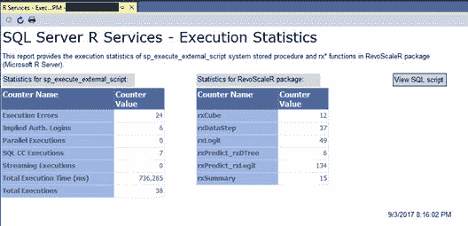

图 7.5:SSMS 的 SQL Server R 服务执行统计报告


# 查看 R 服务自定义报告

一旦您第一次添加了一个 R Services 定制报告，您就可以再次访问它。以下是步骤:

1.  转到 SSMS |对象资源管理器。
2.  右键单击 SQL Server 实例的名称。

3.  选择报告|自定义报告。如果您已经添加了所有的自定义报告，您应该会看到如下内容:

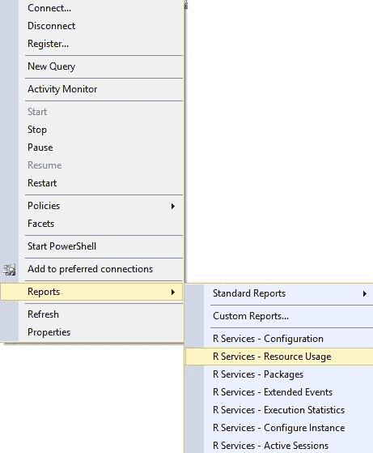

图 7.6:在 SSMS 查看定制报告


# 使用 dmv 管理 SQL Server 机器学习服务

有各种各样的 dmv 可以帮助你监控你已经操作化的 R 脚本。本节根据指定将 SQL Server 机器学习服务的 dmv 分为以下两类。


# 系统配置和系统资源

您可能熟悉`sys.dm_exec_sessions`和`sys.dm_os_performance_counter`来分别理解活动会话和系统性能计数器。下面是您应该了解的 dmv 列表，以便跟踪和监视 SQL Server 中 R 脚本执行的性能和使用情况:

*   `sys.dm_exec_sessions`:查看用户会话和系统会话的详细信息，分别标识为`with session_id >= 51`和`< 51`。
*   `sys.dm_os_performance_counters`:查看每个系统性能计数器的详细信息，包括与 R 脚本相关的信息。下面是一个专门与 SQL Server R 服务相关的脚本示例:

```
SELECT *  
FROM sys.dm_os_performance_counters  
WHERE object_name LIKE '%External Scripts%' 
```

*   `sys.dm_external_script_requests`:查看当前实例上活动的外部脚本:

```
SELECT  
   [external_script_request_id]  
  , [language] 
  , [degree_of_parallelism] 
  , [external_user_name] 
FROM sys.dm_external_script_requests; 
```

*   `sys.dm_external_script_execution_stats`:通过计数器查看新外部脚本的整体使用情况。


# 资源调控器

在 SQL Server 2016 中，添加了两个新的 dmv 来帮助监控外部资源池:`sys.resource_governor_external_resource_pools`和`sys.dm_resource_governor_external_resource_pool_affinity`。如果您熟悉跟踪和管理资源调控器，您可能知道下面列出的另外两个 dmv:

*   `sys.resource_governor_resource_pools`:查看当前资源池状态、资源池当前配置及其统计。
*   `sys.resource_governor_workload_groups`:查看工作负载组统计数据和工作负载组的当前配置。这个 DMV 得到了增强，增加了一个新列来显示与工作负载组相关联的外部池的 ID。
*   `sys.resource_governor_external_resource_pools`:查看外部资源池的当前配置值。在撰写本文时，SQL Server 2016/2017 企业版允许您配置额外的资源池，以便在 SQL Server 中运行的 R 作业的资源将与来自远程客户端的资源隔离。
*   这个 DMV 允许您查看与特定资源池相关联的处理器和资源。


# 用 Visual Studio 操作化 R 代码

使用**Visual Studio 的 R 工具** ( **RTVS** )开发 R 脚本，或者使用 R 脚本的 T-SQL，现在变得很容易。如果已经使用 SQL Server 数据工具作为 SQL Server 数据库项目的 IDE，只需在解决方案中添加一个新的 R 项目。这种集成在 Visual Studio 2017 中有所改进。

如果您没有安装 Visual Studio，请转到[https://www.visualstudio.com/downloads/](https://www.visualstudio.com/downloads/)。

RTVS 作为数据科学和分析应用程序工作负载的一部分进行安装。

从 Visual Studio 安装程序中，您可以将数据科学和分析应用程序工作负载添加到您的 Visual Studio 2017 安装中，如*图 7.7* 所示:

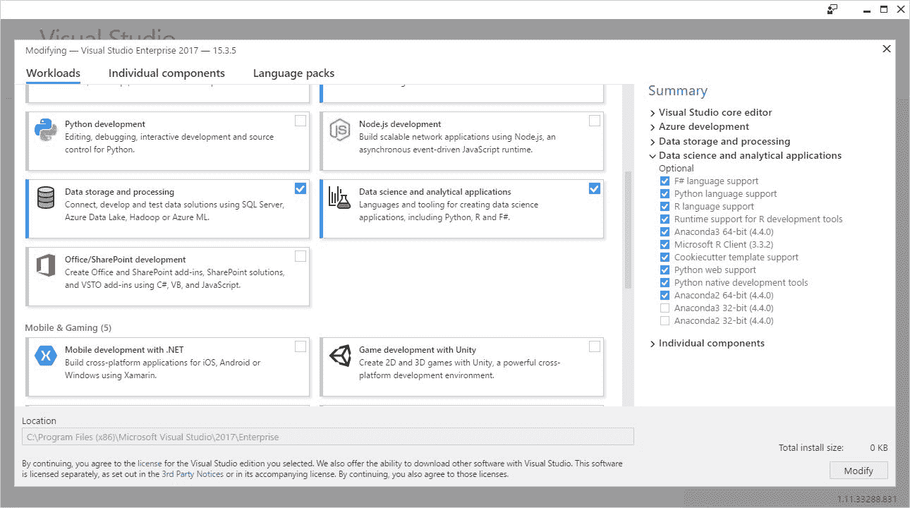

图 7.7:在 Visual Studio 2017 的 Visual Studio 安装程序中选择数据科学和分析应用程序选项

以下是开始使用 RTVS 的附加提示:

1.  通过选择 File | New | Project 在 RTVS 创建一个新的 R 项目。提供的项目名称和文件路径类似于以下内容:

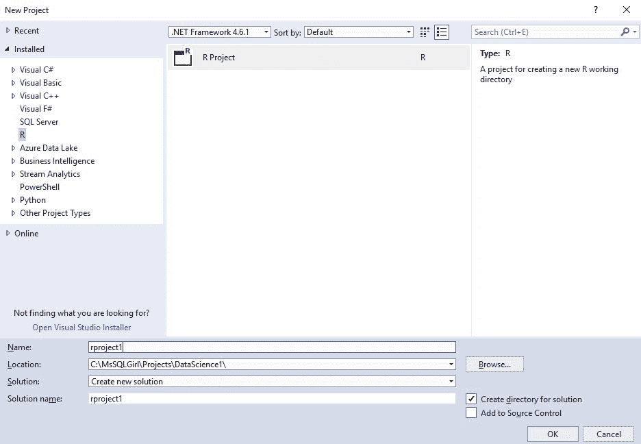

图 7.8:创建一个新的 R 项目

2.  在 RTVS，您可以选择运行 R 脚本的工作区。如果您已经安装了第 4 章、*数据浏览和数据可视化*中提到的带有 R 服务的 SQL Server，您将看到如下内容:

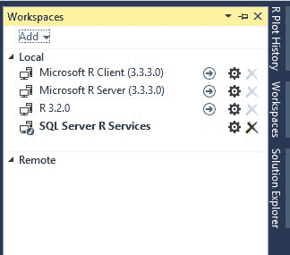

图 7.9:显示可供 RTVS 连接的所有工作区

转到 R Tools | Windows | Workspaces 或按下 *Ctrl* + *9* 显示 Workspaces 窗口。

3.  您可以从 R 交互式窗口运行 R 代码，或者在 R 项目中保存 R 文件。你可以参考 https://docs.microsoft.com/en-us/visualstudio/rtvs/来了解更多关于 RTVS 的特色。

4.  您还可以在项目中添加 SQL 查询文件，方法是右键单击项目并选择“添加新项”，然后选择“SQL 查询”，如下所示:

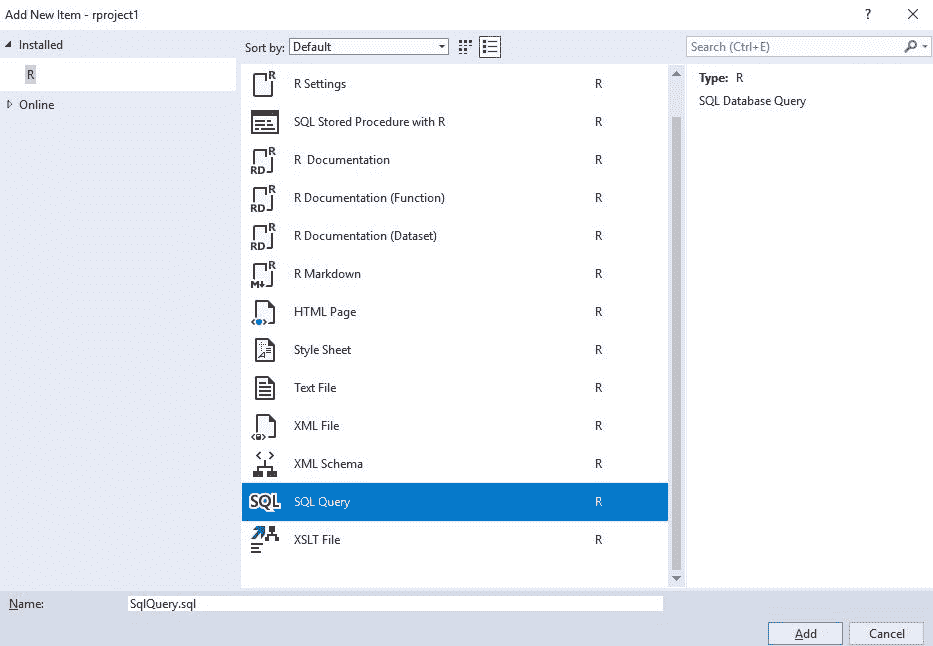

图 7.10:选择一个新的条目/文件来添加到 R 项目中

5.  RTVS 还允许您通过模板开发集成到 SQL Server 存储过程的 R 代码。要访问它，只需单击 Add New Item，类似于上一步，然后选择 SQL Stored Procedure。有关这方面的更多信息，请访问[https://docs . Microsoft . com/en-us/visual studio/rtvs/SQL-server](https://docs.microsoft.com/en-us/visualstudio/rtvs/sql-server)。


# 在 SQL Server 之外集成 R 工作负载和预测操作

在本节中，您将学习如何在 SQL Server 之外包含您在前面几节中创建的 R 工作负荷和预测操作。我们将讨论如何在 PowerShell、SQL 代理作业和 **SQL Server 集成服务** ( **SSIS** )中运行工作负载和操作。

请注意，您也可以在 SSIS、Azure 和 Linux 上的 Bash 中使用 SQLCMD、C#来执行这些工作负载/预测操作。这个讨论超出了本章的范围。


# 通过 PowerShell 执行 SQL Server 预测操作

假设您已经创建了从 SQL Server 执行 R 脚本的存储过程，例如前面示例中的`[dbo].[uspTrainTipPredictionModel]`,您可以轻松地将该命令作为 PowerShell 工作流的一部分来执行。

下面是一个从 PowerShell 调用存储过程的简单示例:

```
$SqlConnection = New-Object System.Data.SqlClient.SqlConnection
$SqlConnection.ConnectionString = "Server=.;Database=Taxi;Integrated Security=True"
$SqlCmd = New-Object System.Data.SqlClient.SqlCommand
$SqlCmd.CommandText = "EXEC [dbo].[uspPredictTipSingleMode] 
 @passenger_count    = 2
 ,@trip_distance   = 10
 ,@trip_time_in_secs     = 35
 ,@pickup_latitude = 47.643272
 ,@pickup_longitude      = -122.127235
 ,@dropoff_latitude      = 47.620529
 ,@dropoff_longitude     = -122.349297
 "
$SqlCmd.Connection = $SqlConnection
$SqlAdapter = New-Object System.Data.SqlClient.SqlDataAdapter
$SqlAdapter.SelectCommand = $SqlCmd
$DataSet = New-Object System.Data.DataSet
$SqlAdapter.Fill($DataSet)
$SqlConnection.Close()
$DataSet.Tables[0] 

```


# 安排训练和预测操作

在 SSMS，您可以创建一个新的 SQL Server 作业，该作业允许您一次性或按特定计划运行 R 代码。

例如，您可以执行计划的离线预测分析工作负载。为此，只需通过 SSMS 创建一个职位:

1.  若要创建作业，您需要是 SQL Server 代理固定数据库角色之一或 sysadmin 固定服务器角色的成员。只有作业所有者或 sysadmin 角色的成员才能更新作业的定义。
2.  在 SSMS 的对象资源管理器中，展开要在其中创建 SQL Server 代理作业的 SQL Server 实例。
3.  展开 SQL Server 代理，右键单击`Jobs`文件夹，然后选择新建作业...：

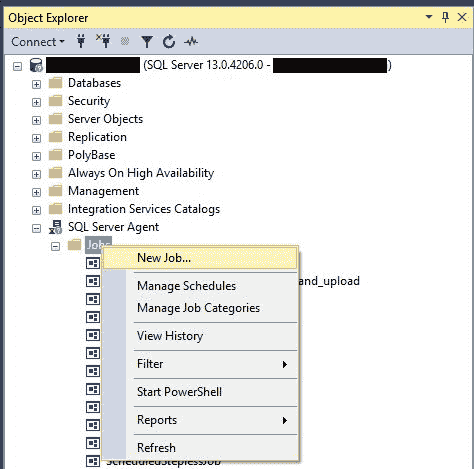

图 7.11:使用 SSMS 创建新的 SQL Server 代理作业

4.  在“常规”页面上提供详细信息:

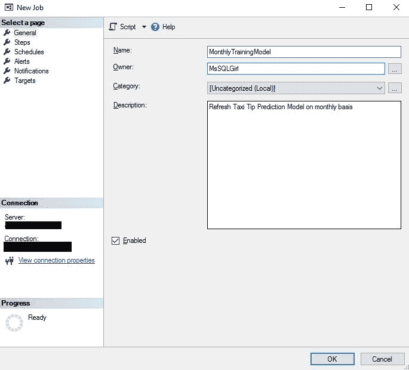

图 7.12:在新作业窗口中添加更多详细信息

5.  在“新建工单”窗口的左侧菜单中点击“步骤”,然后点击“新建”...在新工作窗口的底部。

6.  在要执行的新作业步骤中提供详细信息。在本例中，我们希望更新纽约市出租车培训模型。然后单击确定:


图 7.13:作为 SQL Server 代理作业中的一个步骤调用 R 集成存储过程

7.  在“新建作业”窗口中，从左侧菜单中选择“计划”。
8.  点击新建...在新工作窗口的底部。
9.  提供你希望这项工作遵守的时间表的细节。

10.  在“New Schedule”窗口中单击“OK ”,然后在“New Job”窗口中单击以保存更改。


# 将 R script 作为 SSIS 的一部分进行操作

R Script 可以很容易地集成为 SSIS 工作流的一部分。两种主要方式是作为执行流程任务的一部分运行和作为执行 SQL 任务的一部分运行:

1.  在执行进程任务中运行 R 代码(不是作为 SQL Server R 服务的一部分)可以简单地通过调用`Rscript.exe`来完成。如果您已经有一个准备执行的 R 文件，那么只需在 SSIS 包中添加执行流程任务。您还可以将 SSIS 包中执行流程任务的输入/输出编织到 R 文件中:

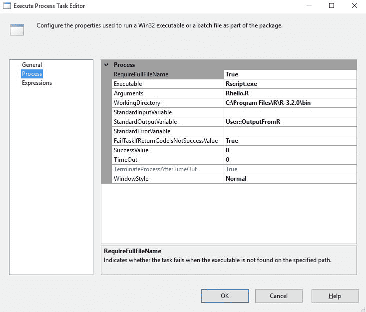

图 7.14:在 SSIS 执行流程任务中外部执行 R 脚本

2.  在 SSIS 使用执行 SQL 任务在 SQL Server 中运行预测操作:如果您已经有一个执行预测的存储过程(或训练模型)，那么只需从 SSIS 的执行 SQL 任务中调用此存储过程。还可以将执行 SQL 任务中的输入/输出与 SSIS 包结合起来:

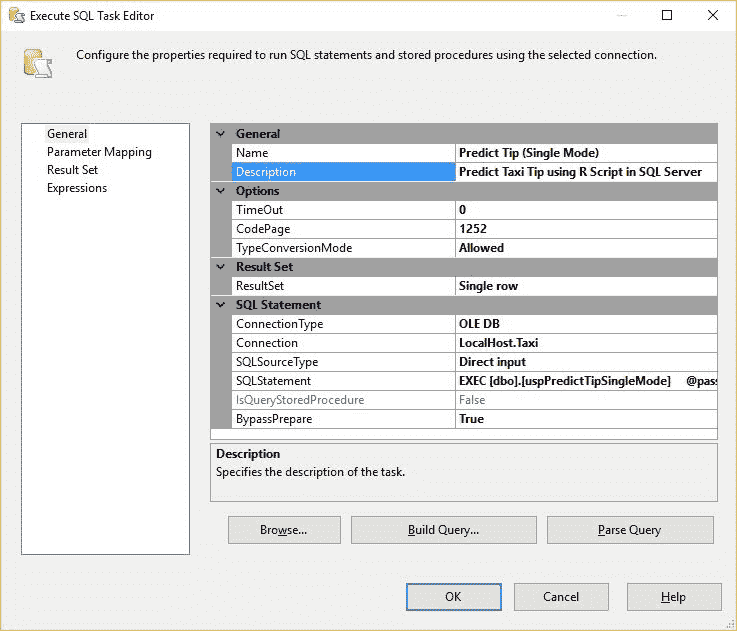

图 7.15:在 SSIS 中将 R 集成存储过程作为执行 SQL 任务步骤执行


# 摘要

在本章中，您学习了将现有预测分析 R 代码集成到 SQL Server R 外部的可扩展性框架中所需的步骤。您还看到了 SQL Server 2017 中新的`PREDICT`函数的简单性和强大功能，它允许在不安装 r 的情况下进行本机评分。管理运行预测分析工作负载所需的安全性在预测操作中也很重要。您已经学习了如何使用 RTVS 向 R 项目添加 SQL 查询。最后，您发现了将 R 代码和预测操作集成到现有工作流中的不同可能性，如 SQL Server 存储过程、SQL Server 代理作业、PowerShell 脚本和 SSIS 项目。

有了这些新技能，我们就为在数据库生命周期中管理数据科学解决方案的下一个构件做好了准备:管理实践。在下一章中，您将了解如何在**持续集成/持续交付** ( **CI/CD** )和持续模型性能监控中管理数据科学解决方案。