# 八、部署、管理和监控包含 R 代码的数据库解决方案

在 SQL Server 数据库中运行 R 代码意味着数据科学家/数据库开发人员也可以将生产数据科学解决方案作为**数据库生命周期管理** ( **DLM** )的一部分。这包括以下内容:

*   将 R 代码作为 SQL Server 数据库项目的一部分签入版本控制
*   将数据科学解决方案的存储过程添加为 SQL Server 单元测试的一部分
*   将数据科学解决方案集成到**持续集成/持续交付** ( **CI/CD** )流程中
*   定期监控数据科学解决方案在生产中的性能

在本章中，我们将使用 Visual Studio 2017 和 Visual Studio Team Services 中的 **SQL Server 数据工具** ( **SSDT** )来执行这个 DLM 工作流。然而，底层概念可以应用于您或您的团队可能已经在使用的任何其他 CI/CD 平台。


# 将 R 集成到 SQL Server 数据库生命周期工作流中

在前面的[第 7 章](part0102.html#318PC0-e3f81285367248f4bbc6431bcd4f926d)、*操作化 R 预测模型*中，我们讨论了如何在 Visual Studio 2017 中创建 R 项目。我们还谈到了在 SQL Server 中集成 R 代码作为`sp_execute_external_script`的一部分。在这里，我们将重温 Visual Studio 2017，特别是在作为 SQL Server 数据库项目的一部分将 R 代码集成到`sp_execute_external_script`中的背景下，并且整体上作为数据库生命周期工作流的一部分。


# 为数据库生命周期工作流准备您的环境

在本节中，我们将讨论数据库生命周期工作流的各个阶段以及我们将使用的工具。对于工作流程中的每个阶段，还会有一些建议的备选方案供您探索。

1.  **编码和管理 SQL Server 数据库项目/解决方案**:有几种不同的方法来管理构成 SQL Server 数据库项目的 SQL Server DML/DDL 脚本。Visual Studio 2017 (VS2017)中的 SQL SSDT 是一个成熟的产品，它形式化了数据库模式和对象的创建和修改。在本节中，我们将在 VS2017 中使用 SSDT。

您可以使用 VS2017 社区版、专业版或企业版。请查看[https://www.visualstudio.com/vs/compare/](https://www.visualstudio.com/vs/compare/)了解更多关于这些版本比较的最新信息。在本节的演练和示例中，我们将使用 Visual Studio 企业版，但是您可以使用任何版本。你可以从 https://www.visualstudio.com/vs/的[下载这些。](https://www.visualstudio.com/vs/)

以下其他值得尝试的方法有:

2.  单元测试:就像应用程序开发一样，数据库开发将受益于单元测试框架，尤其是如果它可以自动化的话。有两个众所周知的单元测试框架可用于 SQL Server 数据库，tSQLt 和集成在 Visual Studio 中的 SQL Server 单元测试。以下是链接:

在本节中，我们将使用 VS2017 中的 SQL Server 单元测试。

另一个值得尝试的工具是:

3.  **版本控制**:版本控制系统有很多流行的选择，例如 Git 和 **Team Foundation 版本控制** ( **TFVC** )。在本节中，我们将使用 TFVC 主持的 **Visual Studio 团队服务** ( **VSTS** )。VS2017 可以连接到 VSTS 存储库。你可以通过[https://www.visualstudio.com/team-services/](https://www.visualstudio.com/team-services/)在线注册一个 VSTS 账户。

其他值得尝试的方法有:

使用 Visual Studio，您可以连接到在线版本控制主机，如 GitHub 和 VSTS，以及私有的本地版本控制服务器，如**Team Foundation Server**(**TFS**):

4.  **CI/CD** : VSTS 支持托管代理和私有代理。托管代理是基于云的代理，执行持续集成和持续交付。私有代理是基于内部部署的代理版本，在 Visual Studio 2017 中可用。将 CI 放在适当的位置意味着当脚本被签入时，代理将自动构建并选择性地执行许多测试。有了 CD，我们就可以只根据基线来测试代码发布和/或模式变更。在本章中，我们将使用带有私有代理的 VSTS 来部署本地 SQL Server 数据库。

其他值得尝试的方法有:

*图 8.1* 显示了使用 VSTS 的 CI/CD 工作流，我们将在本章的示例 SQL Server R Services 解决方案中使用该工作流:


图 8.1 使用 VSTS 的 CI/CD 流程

来源:[https://docs . Microsoft . com/en-us/vsts/build-release/actions/ci-CD-part-1](https://docs.microsoft.com/en-us/vsts/build-release/actions/ci-cd-part-1)


# 本章的先决条件

| **工具** | **网址** | **注释** |
| **Visual Studio 2017** | 下载:[https://www.visualstudio.com/downloads/](https://www.visualstudio.com/downloads/) | 社区版是免费的。 |
| **VSTS** | 报名/签到:[https://www.visualstudio.com/team-services/](https://www.visualstudio.com/team-services/) | 免费注册个人帐户。 |
| **动力壳 v2.0 以上** | 下载 PowerShell:[https://www.microsoft.com/en-us/download/details.aspx?id=42554](https://www.microsoft.com/en-us/download/details.aspx?id=42554) | 您将需要在本地设置私有代理。 |


# 创建 SQL Server 数据库项目

在本节中，我们将带您了解如何在 VS2017 中创建数据库项目。

1.  在 VS2017 中，单击文件|新建项目。
2.  从左侧窗格的“已安装”中选择 SQL Server，然后单击 SQL Server 数据库项目模板。
3.  在 Name:字段中键入`Ch08`,在 Solution name: file 中键入`SQL Server R Services Book`,如下图所示:

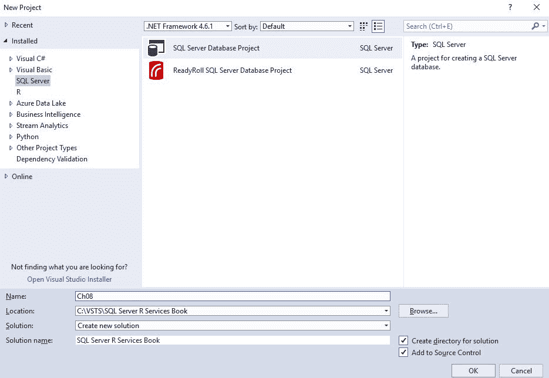

图 8.2 Visual Studio 中的新项目

4.  选择保存解决方案的位置。

如果您已经有了版本控制的本地文件夹，您可以在此指定路径。

在这个例子中，我的 VSTS 项目被命名为 SQL Server R Services Book，它与我的本地文件夹`C:\VSTS\SQL Server R Services Book`相关联。

5.  确保“为解决方案创建目录”和“添加到源代码管理”都已选中。
6.  在新建项目对话框中单击确定。解决方案资源管理器窗口应该显示类似于以下屏幕截图的内容:

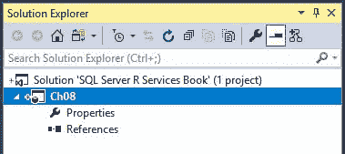

图 8.3 解决方案资源管理器中的数据库项目

从这里，您可以添加新的对象，如表、存储过程和许多其他对象。


# 将现有数据库导入到项目中

现在我们有了一个空白数据库，我们可以导入您在第 7 章*运行 R 预测模型*中创建的现有数据库:

1.  在 Ch08 上，右键单击并选择导入|数据库:


图 8.4 将数据库导入数据库项目

2.  在导入数据库对话框中，单击选择连接。然后，指定您先前在第 7 章、*操作 R 预测模型*中创建的数据库的数据库连接。

3.  “导入数据库”对话框应如下所示。点击开始:

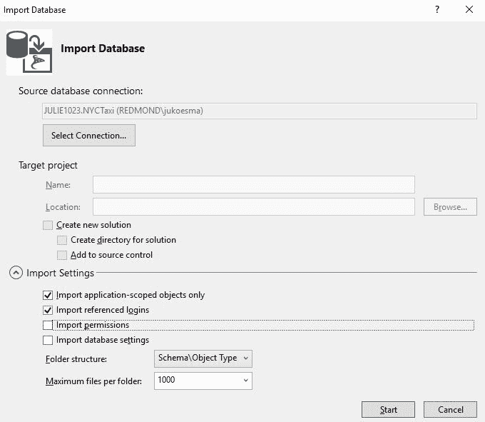

图 8.5 导入数据库对话框

4.  “导入数据库”对话框将显示导入进度摘要:

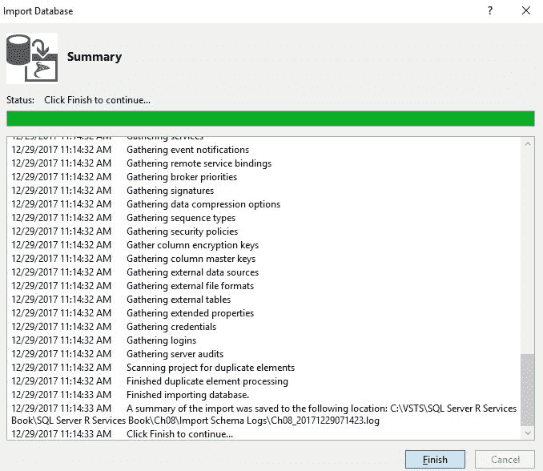

图 8.6 数据库项目导入摘要

5.  解决方案应该如下所示:

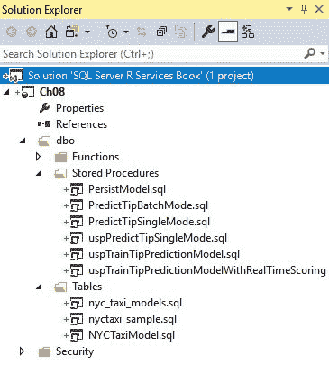

图 8.7 导入数据库后显示数据库项目的解决方案资源管理器

6.  在我们进行更多的更改之前，让我们通过右键单击根解决方案节点并选择 Build Solution 来构建解决方案，或者您也可以单击*Ctrl*+*Shift*+*B*。

请注意，输出应该包含每个引用`sp_execute_external`脚本的存储过程的警告，如下所示:

```
C:\VSTS\SQL Server R Services Book\SQL Server R Services Book\Ch08\dbo\Stored Procedures\uspTrainTipPredictionModelWithRealTimeScoring.sql(27,8): Warning:  SQL71502: Procedure: [dbo].[uspTrainTipPredictionModelWithRealTimeScoring] has an unresolved reference to object [dbo].[sp_execute_external_script].
```


# 添加新的存储过程对象

以下是如何向现有数据库项目添加新对象的示例:

1.  要创建一个新的过程，您可以右键单击`Stored Procedures`文件夹，然后单击 Add | Stored Procedure...
2.  在名称字段中键入`uspTrainTipPredictionModelWithRealTimeScoringDTree`作为新的存储过程:

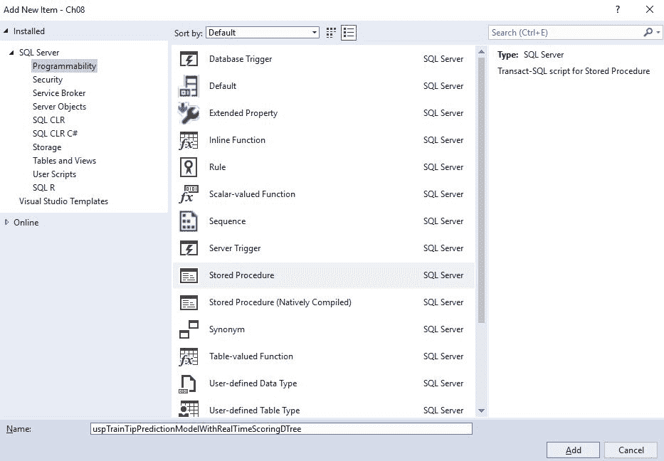

图 8.8 向数据库项目添加新项

3.  将以下脚本添加到存储过程中:

```
CREATE PROCEDURE [dbo].[uspTrainTipPredictionModelWithRealTimeScoringDTree] 
AS 
BEGIN 
   DECLARE @auc FLOAT; 
   DECLARE @model VARBINARY(MAX); 

   -- The data to be used for training 
   DECLARE @inquery NVARCHAR(MAX)= N' 
         SELECT  
               tipped,  
               fare_amount,  
               passenger_count, 
               trip_time_in_secs, 
               trip_distance, 
               pickup_datetime,  
               dropoff_datetime, 
               dbo.fnCalculateDistance(pickup_latitude,  
                     pickup_longitude,   
                     dropoff_latitude,  
                     dropoff_longitude) as direct_distance 
         FROM dbo.nyctaxi_sample 
         TABLESAMPLE (10 PERCENT) REPEATABLE (98052)' 

-- Calculate the model based on the trained data and the AUC. 
EXEC sys.sp_execute_external_script @language = N'R', 
                                  @script = N' 
         ## Create model 
         dTreeObj<- rxDTree(tipped ~ passenger_count + 
trip_distance + 
trip_time_in_secs + 
direct_distance, 
                    data = InputDataSet); 

treeCp <- rxDTreeBestCp(dTreeObj); 
         dTreeObjChosen<- prune.rxDTree(dTreeObj, cp = treeCp); 

         ## Serialize model             
         model <- serialize(dTreeObjChosen, NULL); 

         predictTree <- rxPredict(dTreeObjChosen, data = InputDataSet, overwrite = TRUE)               

        library('ROCR'); 
predOutput <- cbind(InputDataSet, predictTree); 

auc <- rxAuc(rxRoc("tipped", "tipped_Pred", predOutput)); 
print(paste0("AUC of Classification Model:", auc)); 
         ', 
     @input_data_1 = @inquery,    
     @output_data_1_name = N'trained_model', 
     @params= N'@auc FLOAT OUTPUT, @model VARBINARY(MAX) OUTPUT', 
     @auc= @auc OUTPUT, 
     @model = @model OUTPUT; 

-- Store the train model output and its AUC  
INSERT INTO [dbo].[NYCTaxiModel] (Model, AUC,IsRealTimeScoring) 
SELECT @model, @auc, 1; 

END 
```

4.  按下 *Ctrl* + *S* 保存文件。
5.  您现在可以使用*Ctrl*+*Shift*+*B*重新构建解决方案。


# 发布架构更改

发布对环境的更改有两种选择:

*   现有数据库
*   新数据库

在本例中，数据库中已经存在 NYCTaxi。您可以识别模式更改并创建更新脚本:

1.  右键单击 Ch08 并选择模式比较。
2.  确保左侧的源代码指向数据库项目路径。
3.  在选择目标下拉列表中，单击它以设置目标数据库。
4.  选择数据库并点击选择连接。在这里，您可以提供到现有的`NYCTaxi`数据库的连接。

5.  单击比较，它应该只显示一个文件:

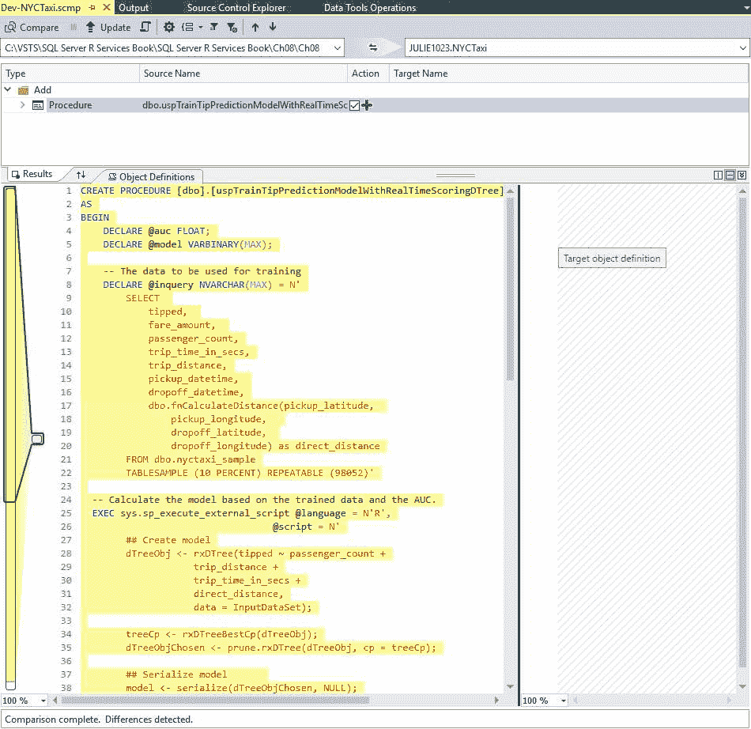

图 8.9 Visual Studio 中的架构比较

6.  在这里，您可以单击 Update 直接对数据库进行更改，或者单击 Generate Script 图标为更改生成脚本。

作为一种最佳实践，特别是如果您有一个正式的生产变更管理流程，您应该选择生成脚本并将其包含在变更管理请求中。


# 针对存储过程添加单元测试

针对可编程性对象(如存储过程或函数)添加单元测试是良好编程实践的一部分:

1.  通过右键单击其中一个存储过程或函数来创建一个单元测试套件，比如`Ch08 ` | `dbo` | `Stored Procedures` | `uspTrainTipPredictionModel`。然后，选择创建单元测试...：


图 8.10 在 Visual Studio 中创建单元测试

2.  选择连接:


图 8.11 SQL Server 测试配置

3.  一旦您点击 OK，您将会看到一个新的单元测试项目被创建，并且一个单元测试模板的例子被创建:


图 8.12 SQL Server 单元测试模板

在右上方的窗格中，您可以管理您的单元测试用例。随着`dbo.uspTrianTipPredictionModel`训练样本数据并将模型和 AUC 存储到`dbo.NYCTaxiModel`，我们将创建一个单元测试来确保:

4.  复制以下代码:

```
-- database unit test for dbo.uspTrainTipPredictionModel
DECLARE @RC AS INT;
DECLARE @RowCountBefore AS INT;
DECLARE @RowCountAfter AS INT;
DECLARE @AUC FLOAT;
SELECT @RC = 0;
```

```
SELECT @RowCountBefore = IS NULL((SELECT COUNT(1) ROWCOUNT
FROM [dbo].[NYCTaxiModel]
WHERE [AUC] ISNOTNULL), 0);
EXECUTE @RC = [dbo].[uspTrainTipPredictionModel];
-- Expected value: there should be a new record added to NYCTaxiModel
-- where AUC is known.
SELECT @RowCountAfter = ISNULL((SELECTCOUNT(1)ROWCOUNT
FROM [dbo].[NYCTaxiModel]
WHERE [AUC] ISNOTNULL), 0);
SELECT @AUC = (SELECTTOP 1 [AUC]
FROM [dbo].[NYCTaxiModel]
ORDER BY [CreatedOn] DESC);
SELECT
@RowCountAfter - @RowCountBeforeRowCountAdded,
IIF(@AUC > 0.5, 1, 0) AUCOfModel;
```

5.  在 Test Conditions 窗格中，单击 inconclusiveCondition1，然后单击红叉将其删除。
6.  现在，从测试条件中选择标量值，并单击加号按钮。
7.  然后，右键单击 scalarValueCondition1 并单击 Properties。
8.  在“属性”窗口中更新以下值:
    1.  **名称** : `TestNYCTaxiModelAdded`
    2.  **期望值** : `1`
    3.  **空预期** : `False`
9.  重复步骤 6 至 8，并在“属性”窗口中更改以下值:
    1.  **姓名** : `TestNYCTaxiModelAdded`
    2.  **期望值** : `1`
    3.  **空预期** : `False`

完成设置后，您的 Visual Studio 现在应该是这样的:

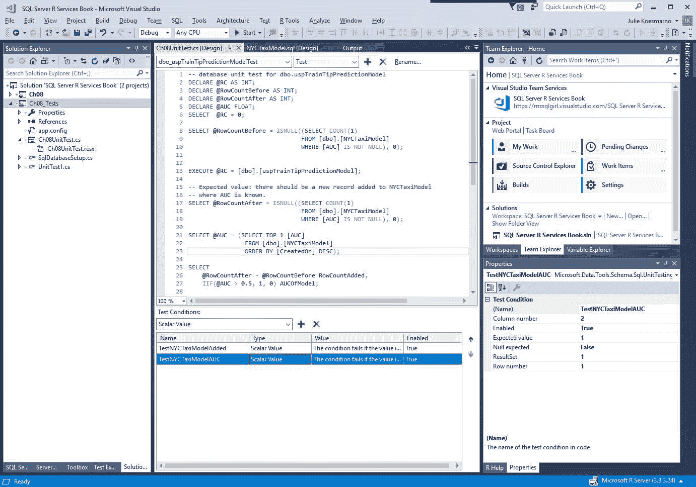

图 8.13 dbo . usptrintippredictionmodel 的 SQL Server 单元测试

10.  拆下`UnitTest.cs`。
11.  然后，右键单击 Ch08_Test 项目，并单击 Build。
12.  导航到测试资源管理器并单击 Run All。
13.  几秒钟后，`dbo_uspTrainTipPredictionModelTest`出现在通过测试下。单击它可以查看执行摘要。

14.  单击输出查看更多详细信息，例如:


图 8.14 测试执行结果

现在，您已经学习了如何创建一个针对存储过程的单元测试，该单元测试是针对现有 NYC Taxi 模型上的现有存储过程执行的。理想情况下，单元测试是针对最近发布的 SQL Server 运行的。


# 使用版本控制

从 Visual Studio 中，我们可以签入解决方案并管理版本控制中的更改。在这个具体的例子中，我们使用 VSTS 进行登记。假设您已经在 VSTS 创建了一个项目。

以下是本节其余部分的先决条件:

1.  **一个 VSTS 项目**:要建立一个新的 VSTS 项目，只需转到:[https://www.visualstudio.com/team-services/](https://www.visualstudio.com/team-services/)。

VSTS 项目的 URL 应该遵循以下格式:
`https://<your account>.visualstudio.com/<VSTS Project>`

本章所指的 VSTS 项目名为`SQL Server R Services Book`。所以，在我的例子中，URL 是`https://mssqlgirl.visualstudio.com/SQL%20Server%20R%20Services%20Book`

2.  VSTS 项目被映射到本地文件夹。

这里映射到项目的本地文件夹是`C:\VSTS\SQL Server R Services Book`。在本章的前面，我们在这个路径中创建了 SQL Server 数据库解决方案。

按照下列步骤从 Visual Studio 签入您的解决方案:

1.  在解决方案根节点上，右键单击并选择“签入”。
2.  在团队资源管理器窗口中，在挂起的更改下，在注释文本框中键入`Initial check-in`。

3.  在单击“签入”之前，查看相关的工作项、包括的更改和排除的更改:

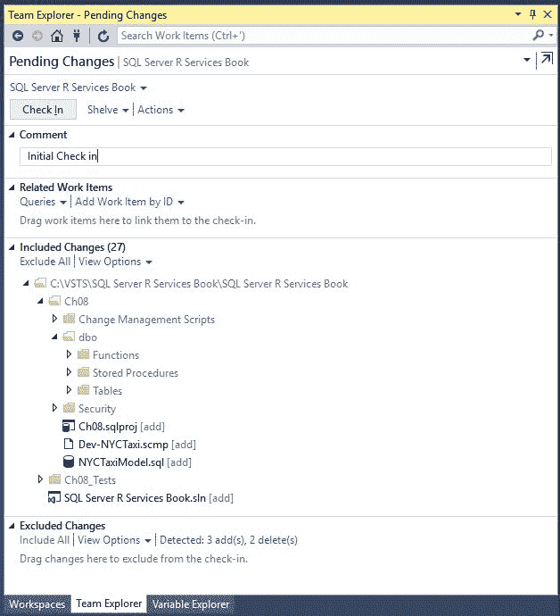

图 8.15 签入挂起的更改

4.  在检入确认对话框中，单击是。

所有文件成功签入后，您还可以在 VSTS 网站上查看它们。举个例子:

`https://mssqlgirl.visualstudio.com/SQL%20Server%20R%20Services%20Book/_versionControl`


# 设置持续集成

**持续集成** ( **CI** )的主要思想是执行基于一个或多个触发器的自动化构建。执行构建的触发器之一是签入事件。另一个可能是定期构建。选择哪个触发器合适取决于各种因素，例如项目的复杂性和团队的文化。在这一部分中，由于项目很小，我们将自动执行由签入触发的构建。我们还将添加测试作为构建的一部分。

VSTS 是一个自动化构建、测试部署和监控的良好平台。在这个部分中，我们将在 VSTS 配置一个构建定义并安排一个持续集成。

确保成功生成 Visual Studio 解决方案，包括 SQL Server 数据库项目和 SQL Server 单元测试项目。

*图 8.16* 显示了 VSTS 在线的 SQL Server R Services Book 团队。在接下来的几节中，我们将在您的浏览器上使用 VSTS 来配置 CI:


图 8.16 签入挂起的更改

这是本节其余部分的先决条件:

*   为了能够将 SQL Server 数据库项目部署到本地 SQL Server 实例，您需要创建一个在 VSTS 注册的本地托管的私有代理。这仅在 Visual Studio 2017 中可用。要进行设置，请遵循以下位置的文档:[https://docs . Microsoft . com/en-us/vsts/build-release/actions/agents/v2-windows](https://docs.microsoft.com/en-us/vsts/build-release/actions/agents/v2-windows)。


# 在 VSTS 创建构建定义

按照以下步骤在 VSTS 创建构建定义:

1.  在 VSTS 项目网站上，点击顶部菜单中的构建和发布，然后选择构建。选择新定义。
2.  从空流程开始。
3.  在“任务”下，转到“处理”并从“代理队列”下拉列表中选择专用代理。在 mssqlgirl 帐户中，私有代理被命名为 Default:

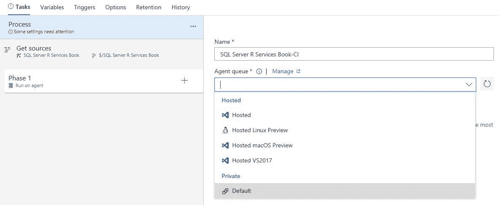

图 8.17 为构建中的任务选择私有代理(默认)

4.  查看获取源中的选择。

`$(build.sourcesdirectory)`下的本地路径指的是私有代理的工作空间，用于构建和执行额外的任务。

5.  单击 Phase 1 并用 Build Phase 替换 Display name 值。
6.  在顶部菜单上，从保存&队列下拉列表中选择保存。
7.  查看保存构建定义并添加注释。

8.  通过单击加号将任务添加到构建阶段。
9.  在添加任务中，搜索 MS Build，然后单击添加。
10.  将项目更改为`$/SQL Server R Services Book/SQL Server R Services Book/SQL Server R Services Book.sln`。

默认值是`**/*.sln`，它指的是 VSTS 项目中的所有解决方案文件。

11.  在构建阶段，添加另一个名为发布构建工件的任务。这允许我们获得以后可能很重要的文件，比如 DACPAC 文件。
12.  在“发布构建工件”任务中，指定以下详细信息:
    1.  发布路径:`$(Build.Repository.LocalPath)\SQL Server R Services Book\Ch08\bin\Debug`
    2.  神器名称:`DACPAC`
    3.  工件发布位置:`Visual Studio Team Services/TFS`

在这一步中，我们只发布 DACPAC 文件。在 Visual Studio Team Services 区域中发布这个特定的文件允许我们以后在发布过程中引用这个 DACPAC(一个连续的交付步骤)。

13.  点击 Save & Queue 来测试构建定义。
14.  查看 SQL Server R Services Book-CI 的队列构建中的选项，然后单击队列。

15.  该页面将显示一个构建正在排队，如下所示:


图 8.18 添加发布工件任务

如果构建成功，您将看到类似下面的内容。现在是熟悉构建概要页面和工件页面的好时机:

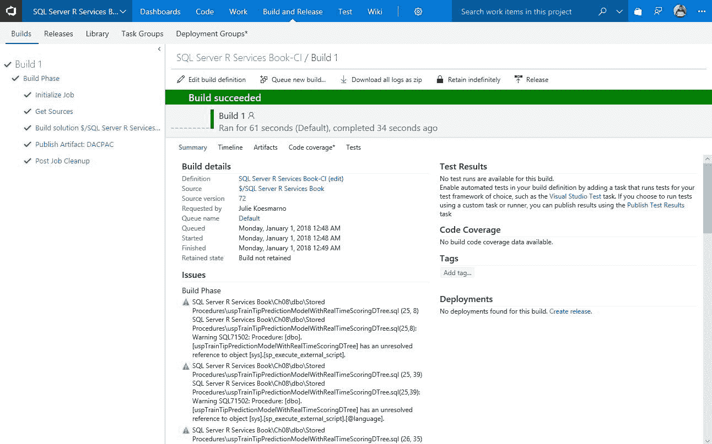

图 8.19 查看构建结果

当您导航到 Artifacts 选项卡时，您应该能够看到`DACPAC`文件夹。通过单击 Explore，您可以看到解决方案中的文件，包括与通过 Visual Studio 进行本地构建类似的构建输出:

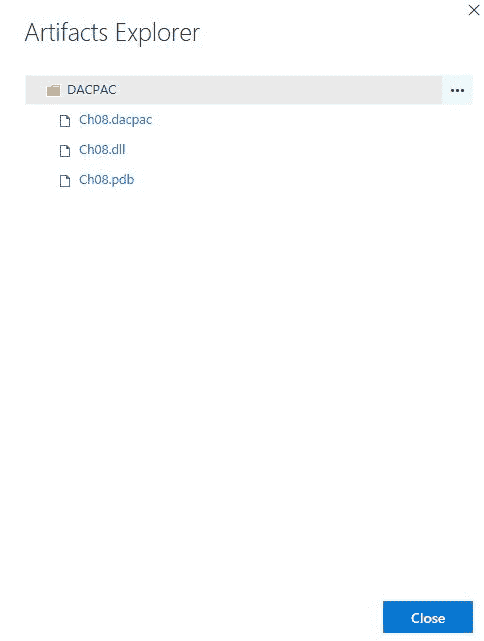

图 8.20 探索从先前成功构建中发布的工件


# 将生成部署到本地 SQL Server 实例

现在，通过私有代理上的 VSTS 的构建已经成功，让我们尝试将数据库部署到 SQL Server 实例。这样做的先决条件是专用代理必须能够访问 SQL Server 实例。*图 8.21* 显示了如何使用具有本地(私有)代理的 VSTS 部署到多个本地服务器/环境:

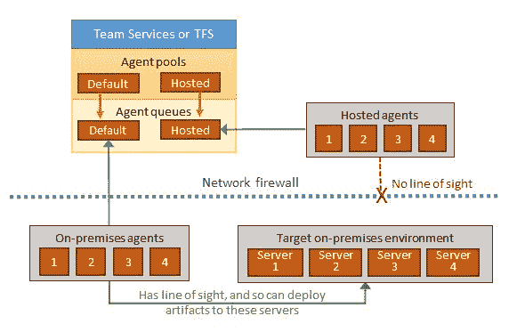

图 8.21 VSTS 和本地代理/环境的高级布局

来源:[https://docs . Microsoft . com/en-us/vsts/build-release/concepts/agents/agents](https://docs.microsoft.com/en-us/vsts/build-release/concepts/agents/agents)

生成 SQL Server 数据库项目时，它将生成一个可用于创建新数据库的 DACPAC 文件。因此，在 SQL Server R Services Book-CI 构建定义的构建阶段，我们将添加一个新任务:

1.  导航到 SQL Server R 服务手册-CI 生成定义。
2.  单击构建阶段并添加一个新任务。
3.  搜索`WinRM - SQL Server DB Deployment`。然后，点击添加。

如果不存在，请点击查看我们的市场。搜索`IIS Web App Deployment using WinRM`，在你的 VSTS 账户上安装。

4.  在部署使用:DACPAC 中，键入以下详细信息:
    1.  机器:`$(UATMachine)`
    2.  管理员登录:`$(UATAdminUser)`
    3.  密码:`$(UATAdminPwd)`
    4.  DACPAC 文件:`$(Build.Repository.LocalPath)\SQL Server R Services Book\Ch08\bin\Debug\Ch08.dacpac`
    5.  使用`Publish Profile`指定 SQL
    6.  发布个人资料:`$(System.DefaultWorkingDirectory)$(UATPublishProfilePath)`
5.  添加以下新变量:

| **名称** | **值** | **秘密** |
| `UATMachine` | {输入您在 FQDN 的机器名或 IP 地址，例如:`uatpc.mssqlgirl.com` } | 不 |
| `UATAdminUser` | {输入可以登录 UAT 机器的管理员用户} | 不 |
| `UATAdminPwd` | {输入管理员的管理员密码} | 是 |
| `UATPublisProfilePath` | `\SQL Server R Services Book\Ch08\Ch08-UAT.publish.xml` | 不 |

6.  单击 Save and Queue 测试构建。


# 将测试阶段添加到构建定义中

在本节中，您将学习如何向 SQL Server R Services Book-CI 构建定义添加测试阶段。这个测试阶段将执行我们之前已经完成的单元测试。

在开始单元测试之前，我们需要为测试做准备。这包括填充`dbo.nyctaxisample`表:

1.  要添加一个新的测试阶段，转到流程**，点击**...**、**并选择添加代理相。
2.  在代理阶段，在显示名称中键入`Test Phase`。
3.  在测试阶段，添加一个新任务。
4.  搜索`Command Line`。然后，点击`Add`。
5.  在命令行任务中，键入以下详细信息:
    1.  工具:`bcp`
    2.  参数:`Ch08.dbo.nyctaxi_sample in "$(System.DefaultWorkingDirectory)$(UATSampleFilePath)" -c -t , -r \n -U $(UATDBUser) -P $(UATDBPwd)`
6.  点击保存。

现在，我们可以添加创建和执行单元测试的步骤:

1.  在测试阶段，添加一个新任务。
2.  搜索`Visual Studio Test`。然后，点击添加。
3.  在`Visual Studio Test`中，输入以下详细信息:
    1.  显示名称:`Unit Test`
    2.  使用`Test assemblies`选择测试
    3.  测试组件:`**\Ch08_test*.dll`
    4.  搜索文件夹:`$(System.DefaultWorkingDirectory)`
    5.  测试平台站:`Visual Studio 2017`
    6.  测试运行标题:`Ch08 SQL Server Testing`
4.  点击保存&队列。

5.  当您查看构建时，您应该能够看到如下内容:

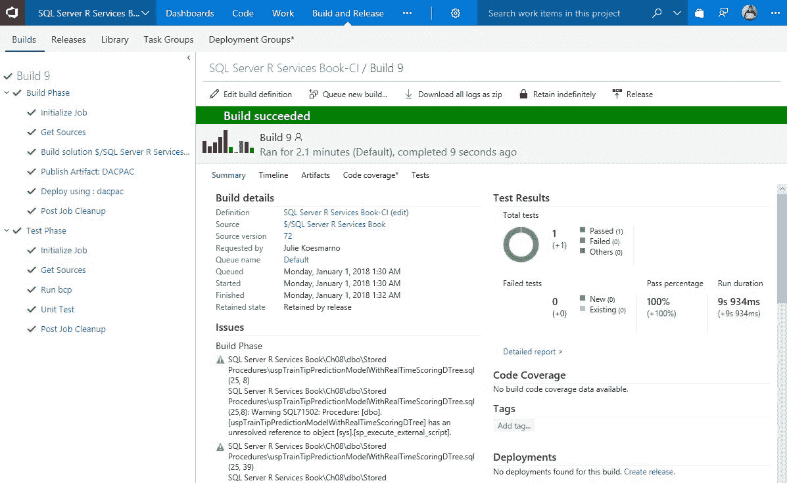

图 8.22 成功的自动化测试


# 自动构建配置项

既然我们已经用构建阶段和测试阶段定义了 SQL Server R Services Book-CI，我们就可以自动化它了:

1.  在 VSTS，编辑 SQL Server R Services Book-CI。
2.  单击触发器选项卡。
3.  确保选中了启用持续集成。

4.  或者，单击+添加查看计划:


图 8.23 为配置项和特定时间表配置构建

5.  单击选项选项卡。
6.  在构建属性|构建编号格式中，键入`Build_$(Date:yyyyMMdd)$(Rev:.r)`。
7.  点击保存。

现在，为了测试自动化是否有效，让我们对解决方案进行更改，例如:

1.  在 Visual Studio 中，打开 SQL Server R Services Book 解决方案。
2.  从 Ch08 项目中删除以下文件:
    1.  `nyc_taxi_models.sql`
    2.  `PersistModel.sql`
    3.  `PredictTipBatchMode.sql`
    4.  `PredictTipSingleMode.sql`
3.  现在让我们签入挂起的更改。右键单击解决方案节点，然后选择“签入”。
4.  或者，在单击“签入”按钮之前添加注释。

成功签入后，您应该能够看到变更集编号:


图 8.24 检查 Visual Studio 的变更集信息

在 VSTS，您应该能够转到最新的版本并看到匹配的源代码版本，如下所示:

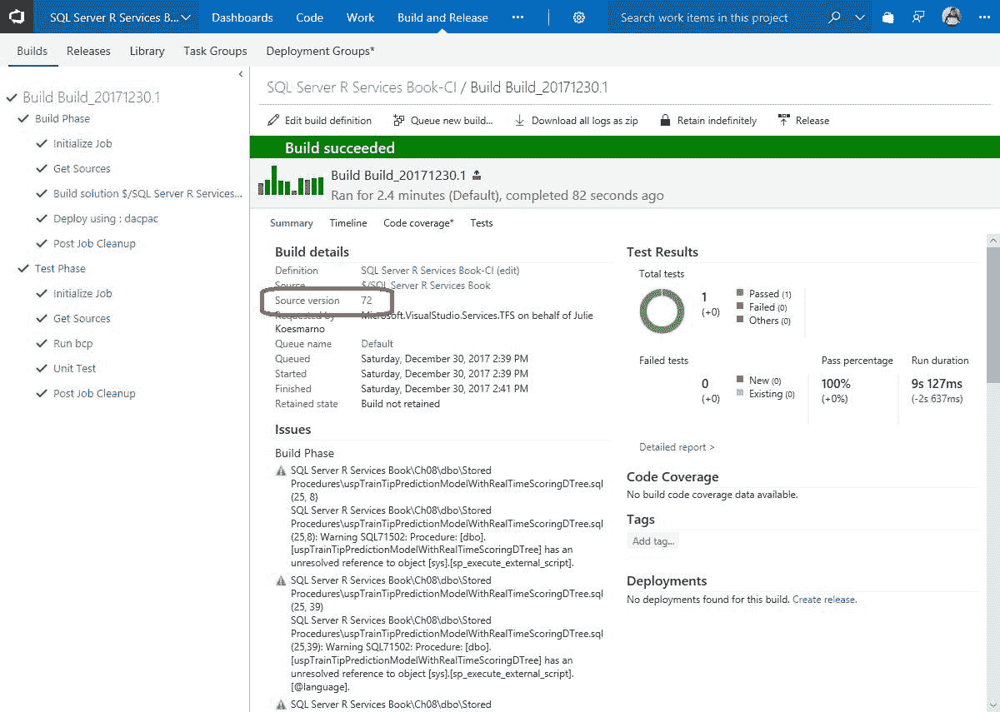

图 8.25 在 VSTS 通过变更集信息验证自动化配置项


# 设置连续交货

持续交付旨在确保我们能够将良好的构建部署到期望的环境中。这可能意味着 UAT 环境或生产环境。在本节中，我们将使用 VSTS 来实现连续交付:

1.  在 VSTS，转到 SQL Server R Services Book 项目。
2.  从顶部菜单导航到构建和发布|发布。
3.  点击+ |新定义。
4.  查看“选择模板”窗格。从这里，您可以从许多选项中进行选择，包括从测试管理器中运行自动化测试。强烈建议您使用该选项来定期检查现有模型的准确性，这将在下一步的手动过程中讨论。现在，让我们选择 Empty 并点击 Add。
5.  在顶部标题上显示所有定义 **|** 新发布定义，点击铅笔图标将名称编辑为`UAT Release`。
6.  让我们继续看“管道”选项卡。有两个盒子:工件和环境。
7.  在工件框中，点击添加工件。
8.  提供以下详细信息，然后单击添加:
    1.  **项目** : SQL Server R 服务书
    2.  **Source** (构建定义):SQL Server R Services Book-CI
9.  在“环境”框中，单击环境 1 中的 1 阶段 0 任务。
10.  在 Tasks 选项卡中，单击第一行 Environment 1。将环境名称更改为`UAT`。
11.  在“任务”选项卡中，单击“代理”阶段，并提供以下详细信息:
    1.  显示名称:部署到 UAT
    2.  代理队列:默认

12.  现在，添加一个部署到 UAT 的新任务。
13.  搜索`WinRM - SQL Server DB Deployment`并点击添加。
14.  在部署使用:Dacpac 中，填写以下详细信息:
    1.  机器:`$(UATMachine)`
    2.  管理员登录:`$(UATAdminUser)`
    3.  密码:``$(UATAdminPwd)``
    4.  DACPAC 文件:`$(System.ArtifactsDirectory)\$(Build.DefinitionName)\DACPAC\Ch08.dacpac`
    5.  服务器名称:`{specify the server name, for example: localhost}`
    6.  数据库名称:`NYCTaxiUAT`
15.  转到变量选项卡，添加以下变量:

| **名称** | **值** | **秘密** |
| `UATMachine` | {输入您的计算机名(FQDN)或 IP 地址，例如:uatpc.mssqlgirl.com} | 不 |
| `UATAdminUser` | {输入可以登录 UAT 机器的管理员用户} | 不 |
| `UATAdminPwd` | {输入管理员的管理员密码} | 是 |

16.  然后，单击保存并接受默认值。
17.  要测试这个发布定义，在 New Release Definition 下，点击+ Release 并选择 Create **Release** ，然后选择....

18.  在为新版本定义创建新版本上，在版本描述中键入`Test UAT deployment`。然后，单击创建，如下所示:

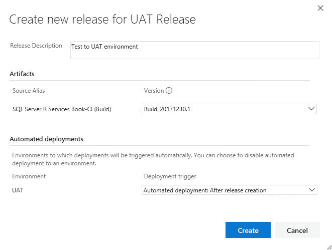

图 8.26 基于最新的成功构建为 UAT 环境创建一个新的版本

可以部署到具有不同数据库连接设置的多个环境中。一个可以帮助你实现这一点的扩展是 https://marketplace.visualstudio.com/items?的 XDT 变换:
[itemName = qetza . xdt transform](https://marketplace.visualstudio.com/items?itemName=qetza.xdttransform)

一旦发布完成，它将如下所示:


图 8.27 成功发布的结果

要在发布中启用连续交付，您必须编辑定义:

1.  进入发布视图，点击...UAT 发布，然后选择编辑。
2.  在 Pipeline 视图上，转到 Artifacts 框内的 SQL Server R Services Book-CI。

3.  单击持续部署触发器，如下所示:


图 8.28 更改持续部署触发器

4.  在“连续部署触发器”窗口中，确保“已启用”滑块处于打开状态。
5.  点击保存。

要测试 UAT 版本的持续交付设置，您可以调用 SQL Server R Services Book-CI 上的新构建。视图应该是这样的:

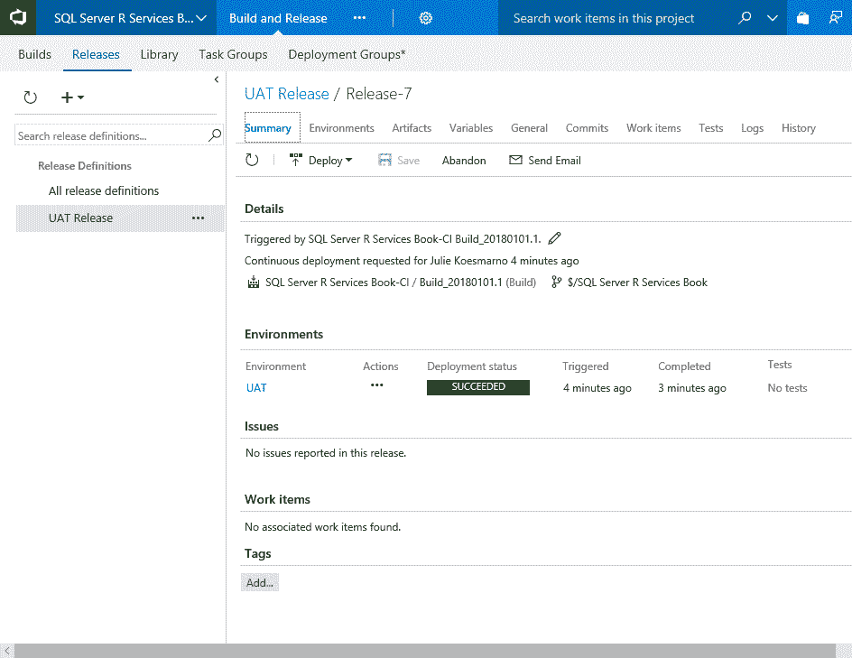

图 8.29 通过持续开发成功发布的结果

总结中，细节应该说发布是由 SQL Server R Services Book-CI Build _ 2018 01 01.1 触发的。因此，我们成功地创建了一个基本的连续交付流程。像设置集成测试和负载测试这样的高级步骤现在可以使用与前面显示的步骤相似的步骤添加到发布中。关于在 VSTS 设置这个的更多信息，请参考以下来自微软的教程:[https://docs . Microsoft . com/en-us/vsts/build-release/test/example-continuous-testing # configure-CD](https://docs.microsoft.com/en-us/vsts/build-release/test/example-continuous-testing#configure-cd)。


# 监控生产模型的准确性

在[第 6 章](part0096.html#2RHM00-e3f81285367248f4bbc6431bcd4f926d)、*预测建模*中，我们讨论了一些预测建模的例子。创建的模型基于训练数据。在现实世界的场景中，新的数据不断出现，例如，在线交易、出租车交易(还记得之前的纽约出租车例子)和航班延误预测。因此，应该定期检查数据模型，以确保它仍然令人满意，并且没有其他更好的模型可以为它生成。对于后者，一个优秀的数据科学家会不断地问至少四个这样的问题:

1.  由于数据的变化，是否需要考虑不同的算法？

例如，如果当前模型使用逻辑回归(`rxLogit`)，决策树算法是否会因规模或预期结果的变化而更准确(`rxDTree`)。

2.  新交易的其他特征是否变得越来越重要？

考虑下面的场景:目前，出租车上的小费预测使用乘客数量、行程距离、行程时间和直接距离。也许定期检查其他特征，例如一天中的某个时间、一周中的某一天、上车和/或下车的邮政编码、假期、出租车的清洁度或顾客评级，是否会对小费预测有更大的贡献。

3.  需求中是否有可以让位于改进业务或客户的行动的变化？

在出租车乘车小费预测中，当前预测是二进制值，即真或假。企业可能有兴趣更多地了解出租车的清洁度或客户评级如何与无小费、小小费、中等小费或大小费相关联。出租车驾驶室的清洁是一个行动，司机可以使用它来推动更好的改善。

4.  性能下降是由模型执行或输入数据瓶颈引起的吗？

随着输入数据集/数据源的增长且未得到优化，端到端预测建模也可能会变慢。

为了捕捉模型的性能，应该记录实际预测的性能或实际数据的合理表示。下面是日志表的一个示例:

| **值** | **数据类型** | **评论** |
| `LogID` | `INT` | 执行的顺序 ID。 |
| `Created On` | `DATETIME` | 模型生成和测试的日期。 |
| `ModelID` | `INT` | 每个型号的唯一 ID。 |
| `Model` | `VARBINARY(MAX)` | 这是模型的序列化表示。 |
| `RxFunction` | `VARCHAR(50)` | 这是模型中使用的 rx 函数。 |
| `Formula` | `VARCHAR(1000)` | 预测模型的公式。 |
| `Training Input Query` | `VARCHAR(MAX)` | 可重现的训练数据集 |
| `AUC` | `FLOAT` | 模型的 AUC 表示。这可以是您用来比较模型质量的任何其他指标。 |
| `Training Row Count` | `INT` | 行数。 |
| `CPU Time` | `INT` | 生成模型的秒数。 |

一旦您捕获了执行，您就可以分析 AUC 值和 CPU 时间，如*图 8.30* 所示:

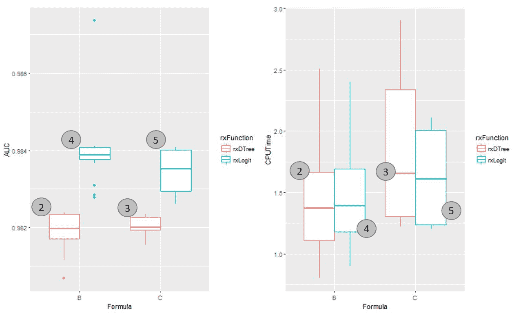

图 8.30 AUC 和 CPU 时间的监控模型比较

这些图表比较了以下型号的性能:

|  | **公式 B** | **公式 C** |
| `rxDTree` | 型号 ID 2 | 型号 ID 3 |
| `rxLogit` | 型号 ID 4 | 型号 ID 5 |

描述如下:

*   公式 B 为*小费~乘客数+行程距离+行程时间秒数+直达距离+支付类型*
*   公式 C 为*小费~乘客数+行程距离+行程时间秒数+支付类型*

每一个模型都是针对:

*   过去 2 个月的数据
*   随机前 5%的数据

基于前面提到的比较，我们可以看到，模型 ID 4，也就是公式 B 的`rxLogit`，具有最高的 AUC 范围和最低的 CPU 时间。所以，这个模型是两个中最好的。下一步是决定这种型号是否应该取代生产中的型号。

既然您已经学习了比较模型的技术和一些在预测建模中很重要的度量标准，那么您可以像前面显示的那样安排这个性能测试。调度可以是一个 SQL 代理作业，如第 7 章、*操作化 R 代码*所示，如果新的结果低于某个阈值，您可以得到警告。或者，您可以将它作为部署在 VSTS 的单独的 SQL Server 数据库单元项目的一部分来发布，以使用最新的事务数据检查数据库。


# 有用的参考资料

*   将 SQL Server 2017 集成到您的 DevOps 管道中:[https://www . Microsoft . com/en-us/SQL-Server/developer-get-started/SQL-devo PS/](https://www.microsoft.com/en-us/sql-server/developer-get-started/sql-devops/)
*   Visual Studio 团队服务(VSTS):【https://www.visualstudio.com/team-services/ 
*   对比 Visual Studio 2017 IDEs:【https://www.visualstudio.com/vs/compare/ 
*   在 VS 2017 中配置托管代理:[https://docs . Microsoft . com/en-us/vsts/build-release/actions/agents/v2-windows](https://docs.microsoft.com/en-us/vsts/build-release/actions/agents/v2-windows)
*   连续交付:[https://www . visual studio . com/learn/what-is-continuous-Delivery/](https://www.visualstudio.com/learn/what-is-continuous-delivery/)


# 摘要

Visual Studio 2017 是一个强大的 IDE，用于数据科学家/开发人员管理他们的代码、单元测试和版本控制。与 Visual Studio Team Services 相结合，它们形成了一个完整的工具包来执行数据库生命周期管理，也可以很容易地适应 DevOps 实践。本章详细描述了如何将 SQL Server 机器学习服务与 SQL Server 数据库项目、DevOps 实践和 CI/CD 工作流中的 R 集成。最后，您还学习了如何随着时间的推移监控预测模型的准确性。

在下一章，我们将讨论 DBA 如何利用 r 的机器学习服务。