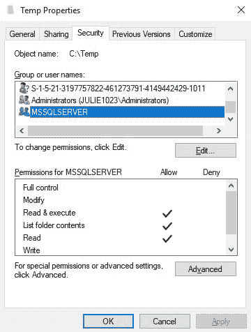
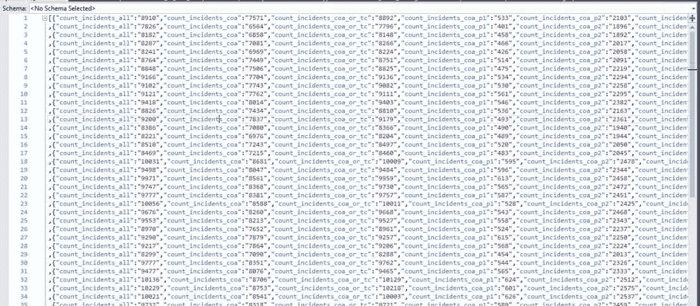
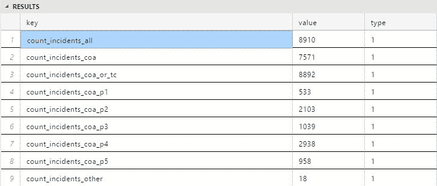
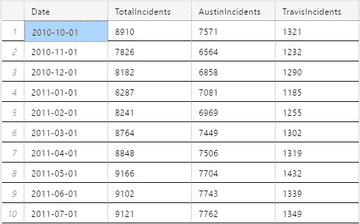
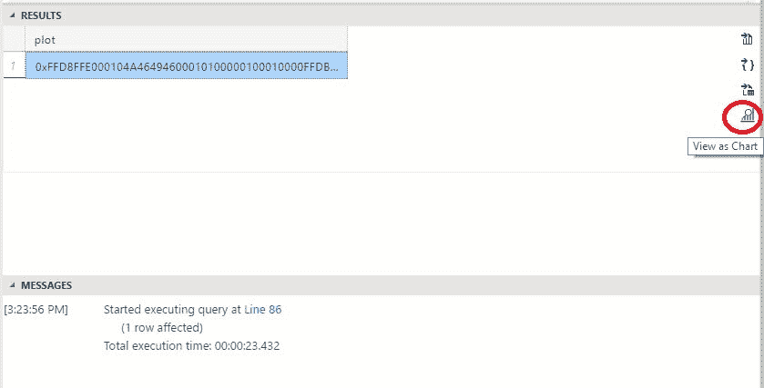
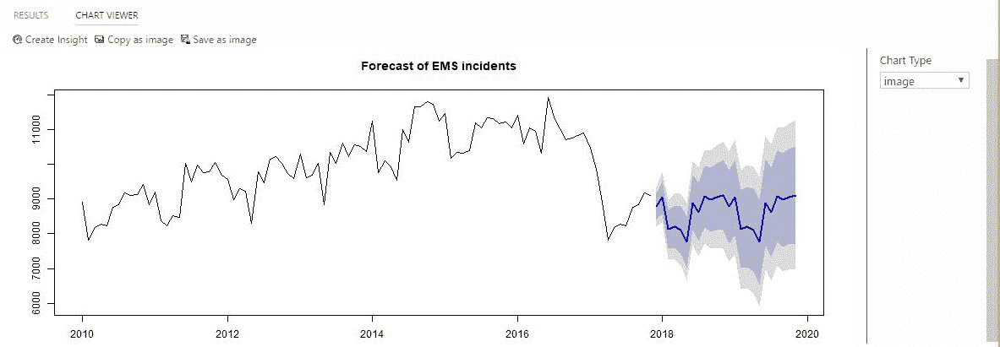
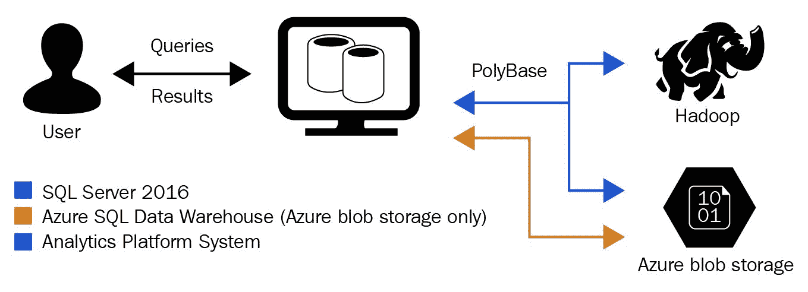
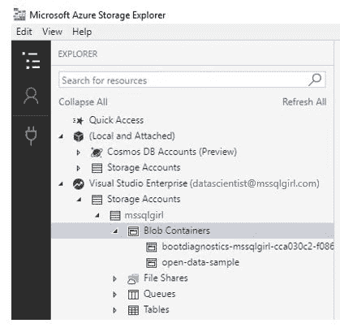
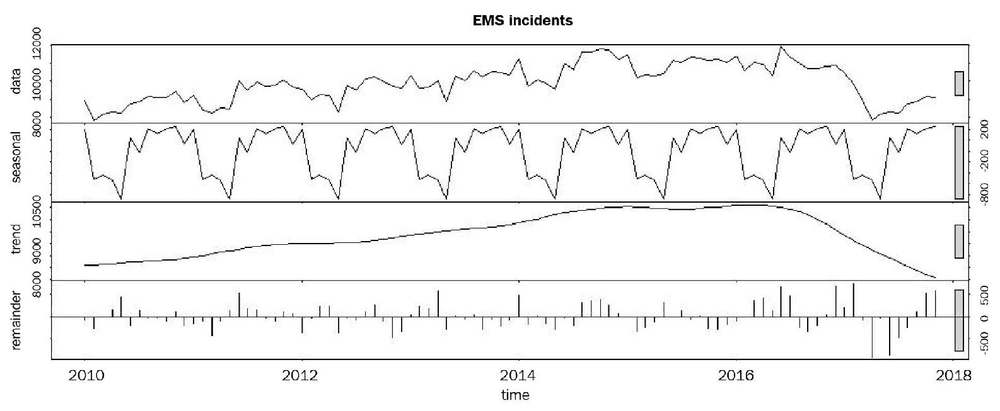
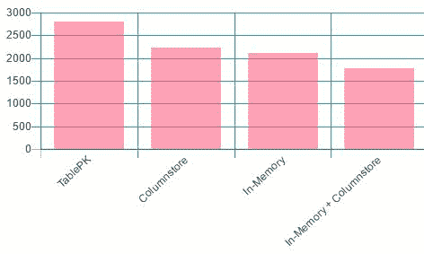

# r 和 SQL Server 2016/2017 功能扩展

SQL Server 2016 和 2017 提供了许多新的和改进的查询性能功能、可扩展性功能、安全功能和内置/原生功能，对开发人员、数据库管理员和数据科学家非常有用。这些新特性和功能可以与 SQL 中的机器学习服务一起使用，带来强大的数据科学解决方案，并使开发人员/数据科学家的生活更加轻松。

本章将通过几个独特的场景向您展示 R 和 SQL Server 中其他内置功能的组合威力。这些场景包括 JSON 内置的功能来展示我们如何处理物联网数据，PolyBase 来说明关系数据源以外的内容，以及大量带有`ColumnStore`索引的数据。我们将深入这些场景，并在 R 中产生我们在前面章节中学到的数据可视化和预测分析能力。


# 内置的 JSON 功能

在这个场景中，我们将使用奥斯汀市官方开放数据门户网站([https://data . Austin Texas . gov/Public-Safety/EMS-Incidents-by-Month/gjtj-jt2d](https://data.austintexas.gov/Public-Safety/EMS-Incidents-by-Month/gjtj-jt2d))中按月统计的 EMS 事件。该数据主要包含奥斯汀市和特拉维斯县事故的地点和优先级细分的事故计数，以及按时合规的百分比。

以下是入门的先决条件:

1.  从[https://data.austintexas.gov/resource/bpws-iwvb.json](https://data.austintexas.gov/resource/bpws-iwvb.json)下载数据到本地路径，比如`C:\Temp\bpws-iwvb.json`。
2.  授予对目录的读取权限；例如:



图 10.1 授予 MS SQL Server 对 C:\Temp 的访问权限

3.  为了便于可视化，我们将使用 SQL Operations Studio。可以从:[https://docs . Microsoft . com/en-us/SQL/SQL-operations-Studio/download](https://docs.microsoft.com/en-us/sql/sql-operations-studio/download)下载 SQL Ops Studio。

以下是 JSON 文件的摘录:



图 10.2:bpws-iwvb . JSON 的摘录

这个文件中 JSON 对象的模式相当简单。它是以下 31 个属性的数组:

若要查看数据的第一行以及值的样子，可以使用以下 T-SQL 代码:

```
SELECT * 
FROM OPENJSON((SELECT Doc.BulkColumn  
                FROM OPENROWSET(BULK N'C:\Temp\bpws-iwvb.json', SINGLE_CLOB) AS Doc), '$[0]') 
```

以下是前面命令的输出:



图 10.3 检查 bpws-iwvb.json 中的第一行数据

本节的剩余部分将向您展示如何使用 SQL Server 中内置的 JSON 和 R 功能来解析数据并创建可视化，以了解 ATCEMS 收到的 EMS 事件的趋势。下面的屏幕截图显示了我们将通过 SQL Operations Studio 从前面的 JSON 数据构建的数据可视化:


图 10.4 使用 R 预测 EMS 事故

执行以下步骤来构建前面的可视化:

1.  打开 SQL Operations Studio。
2.  使用 JSON，获得`Date`和事件计数:

```
SELECT  
    a.Date,  
    a.TotalIncidents, 
    a.AustinIncidents, 
    a.TravisIncidents 
FROM OPENJSON((SELECT Doc.BulkColumn  
                FROM OPENROWSET(BULK N'C:\Temp\bpws-iwvb.json', SINGLE_CLOB) AS Doc), '$') 
WITH (Date          DATE    '$.month_start_date', 
    TotalIncidents  INT     '$.count_incidents_all', 
    AustinIncidents INT     '$.count_incidents_coa', 
    TravisIncidents INT     '$.count_incidents_tc' 
    ) AS a 
ORDER BY a.Date ASC;
```

这里，我们使用`OPENROWSET`和`SINGLE_CLOB`以明文读取文件流。

3.  然后，我们用`OPEN_JSON`提取`month_start_date`为`Date`、`count_incidents_all`为`TotalIncidients`、`count_incidents_coa`为`AustinIncidents`、`count_incidents_tc`为`TravisIncidents`。

输出应该如下所示:



图 10.5:对 EMS 事件 JSON 文件运行 OPENJSON 的输出

4.  现在，让我们用`Date`和`TotalIncidents`数据为 R 脚本构建`InputDataSet`:

```
DECLARE @input_query    NVARCHAR(MAX);  
SET @input_query = 'SELECT  
    a.Date,  
    a.TotalIncidents 
FROM OPENJSON((SELECT Doc.BulkColumn  
    FROM OPENROWSET(BULK N'C:\Temp\bpws-iwvb.json',  
         SINGLE_CLOB) AS Doc), '$') 
   WITH (Date            DATE  '$.month_start_date', 
         TotalIncidents  INT   '$.count_incidents_all' 
        ) AS a;' 
```

5.  让我们构建使用前面的`InputDataSet`的 R 脚本:

在此脚本中，我们将使用预测包根据 2010 年 1 月和 2017 年 11 月的现有数据执行预测。有关预测包(包括相关包)的更多信息，请访问:[https://cran.r-project.org/web/packages/forecast/index.html](https://cran.r-project.org/web/packages/forecast/index.html)。

在这个具体的例子中，事件的数量可以是季节性的。因此，我们将使用一些有助于预测的辅助功能:

```
DECLARE @RPlot          NVARCHAR(MAX); 

SET @RPlot = 'library(forecast); 
    image_file = tempfile();  
    jpeg(filename = image_file, width=1000, height=400);  

    #store as time series  
    myts <- ts(InputDataSet$TotalIncidents,  
        start = c(2010, 1), end = c(2017, 11), 
         frequency = 12);  
    fit <- stl(myts, s.window = "period"); 

    # show the plot 
    plot(forecast(fit), main = "Forecast of EMS incidents"); 
    dev.off();  

    # return the plot as dataframe 
    OutputDataSet <-  data.frame( 
        data=readBin(file(image_file,"rb"), 
        what=raw(),n=1e6));' 
```

6.  现在，让我们执行以下脚本:

```
EXEC sp_execute_external_script @language = N'R' 
    ,@script = @RPlot  
    ,@input_data_1 = @input_query 
    ,@input_data_1_name = N'InputDataSet' 
    ,@output_data_1_name = N'OutputDataSet'  
    WITH RESULT SETS (( [plot] VARBINARY(MAX)));     
```

7.  在 SQL Ops Studio 中，结果将在`VARBINARY`数据类型中:



图 10.6:SQL Operations Studio 中的查看图表功能

8.  单击右侧的查看图表图标，然后单击结果窗格上的图表查看器选项卡，然后从图表类型中选择图像。输出应该类似于以下内容:



图 10.7:在 SQL Operations Studio 中显示 R 生成的图表


# 使用 PolyBase 访问外部数据源

PolyBase 允许您的 SQL Server 实例使用 T-SQL 访问服务器/数据库之外的数据。在 SQL Server 2016 中，您可以在 Hadoop 中对外部数据运行查询，或者从 Azure Blob 存储中导入数据:



图 10.8: PolyBase 概念(来源:https://docs . Microsoft . com/en-us/SQL/relational-databases/poly base/poly base-guide)

在本节中，我们将使用与上一节类似的数据集，在 Azure Blob 存储中表示为 CSV 文件。这些 CSV 文件代表 EMS 事件，这些事件将作为 SQL Server 中的外部表公开。本演练的目标是了解 EMS 事件的季节性和趋势。我们将在 SQL Server 中使用 R 来完成这项工作，并在 SQL Operations Studio 中查看图表。

以下是入门的先决条件:

1.  与 PolyBase 一起安装的 SQL Server 实例。该步骤记录在:[https://docs . Microsoft . com/en-us/SQL/relational-databases/poly base/get-started-with-poly base](https://docs.microsoft.com/en-us/sql/relational-databases/polybase/get-started-with-polybase)
2.  已安装 Microsoft Azure 存储资源管理器。使用 Azure 存储资源管理器，您可以上传文件，管理您的存储帐户中的容器，并从存储帐户获取主访问密钥:



图 10.9:使用 Microsoft Azure 存储资源管理器连接到 Azure Blob 存储

3.  按月 EMS 事件从<insert github="" link="">下载并上传到您的 Azure Blob 存储。</insert>
4.  已安装 SSMS 或 SQL Operations Studio。

执行以下步骤创建外部表:

1.  启用高级选项以首先启用到 master 数据库上 Azure Blob 存储的连接。

将 Hadoop 连接性设置为 7 允许连接到 Azure Blob 存储。有关其他受支持数据源的更多信息，请访问:

[https://docs . Microsoft . com/en-us/SQL/database-engine/configure-windows/poly base-connectivity-configuration-transact-SQL](https://docs.microsoft.com/en-us/sql/database-engine/configure-windows/polybase-connectivity-configuration-transact-sql)

```
USE master;   
GO   
EXEC sp_configure 'show advanced option', '1';   
RECONFIGURE;  
GO 
EXEC sp_configure 'hadoop connectivity', 7;  
GO  
RECONFIGURE;  
GO 
```

2.  在您的数据库中创建一个主密钥，您希望在该数据库中创建一个连接到 Azure Blob 存储中的 CSV 文件的外部表:

```
USE [AdventureWorks2016] 
GO 
CREATE MASTER KEY ENCRYPTION BY PASSWORD='MsSQLGirlLovesSQLServer2016&2017:)'; 
```

3.  创建数据库`MsSQLGirlAtAzureBlobStorage`:

```
CREATE DATABASE SCOPED CREDENTIAL MsSQLGirlAtAzureBlobStorage   
WITH IDENTITY = 'credential', Secret = 'Es3duvq+x9G5x+EFbuUmGo0salEi6Jsd59NI20KXespbiBG9RswLA4L1fuqs/59porPBay64YkRj/tvQ7XAMLA=='; 
```

4.  创建指向 Azure Blob 存储中的容器的外部数据源。在这个实例中，`open-data-sample`是容器的名称，`mssqlgirl.blob.core.windows.net`是 Azure Blob 存储位置:

```
CREATE EXTERNAL DATA SOURCE OpenDataSample 
WITH ( 
    TYPE = HADOOP, 
    LOCATION = 'wasbs://open-data-sample@mssqlgirl.blob.core.windows.net/', 
    CREDENTIAL = MsSQLGirlAtAzureBlobStorage 
); 
```

5.  在容器中创建源文件的文件格式:

```
CREATE EXTERNAL FILE FORMAT csvformat  
WITH (  
    FORMAT_TYPE = DELIMITEDTEXT,  
    FORMAT_OPTIONS (  
        FIELD_TERMINATOR = ',' 
    )  
); 
```

6.  在容器中创建以下源文件:

```
CREATE EXTERNAL TABLE EMSIncident 
(  
   [Month Key]                         INT, 
   [Month-Year]                        VARCHAR(30), 
   [Total Incidents]                   INT, 
   [Austin Incidents]                  INT, 
   [Travis County Incidents]           INT, 
   [Other Area Incidents]              INT, 
   [Combined Austin & Travis Incidents]      INT, 
   [Austin P1 Incidents]               INT, 
   [Austin P2 Incidents]               INT, 
   [Austin P3 Incidents]               INT, 
   [Austin P4 Incidents]               INT, 
   [Austin P5 Incidents]               INT, 
   [Travis County P1 Incidents]        INT, 
   [Travis County P2 Incidents]        INT, 
   [Travis County P3 Incidents]        INT, 
   [Travis County P4 Incidents]        INT, 
   [Travis County P5 Incidents]        INT, 
   [Overall On-Time Compliance]        VARCHAR(10), 
   [Austin On-Time Compliance]               VARCHAR(10), 
   [Travis County On-Time Compliance]        VARCHAR(10), 
   [Austin P1 On-Time Compliance]            VARCHAR(10), 
   [Austin P2 On-Time Compliance]            VARCHAR(10), 
   [Austin P3 On-Time Compliance]            VARCHAR(10), 
   [Austin P4 On-Time Compliance]            VARCHAR(10), 
   [Austin P5 On-Time Compliance]            VARCHAR(10), 
   [Travis County P1 On-Time Compliance]     VARCHAR(10), 
   [Travis County P2 On-Time Compliance]     VARCHAR(10), 
   [Travis County P3 On-Time Compliance]     VARCHAR(10), 
   [Travis County P4 On-Time Compliance]     VARCHAR(10), 
   [Travis County P5 On-Time Compliance]     VARCHAR(10), 
   [Target On-Time Compliance]               VARCHAR(10) 
)  
WITH  
(  
    LOCATION = '/EMS_-_Incidents_by_Month.csv',  
    DATA_SOURCE = OpenDataSample,  
    FILE_FORMAT = csvformat  
) 
```

7.  所以，现在我们可以在外部表上做一个`SELECT`语句作为 R 脚本的输入:

```
DECLARE @input_query    NVARCHAR(MAX);  
DECLARE @RPlot          NVARCHAR(MAX); 

SET @input_query = 'SELECT  
    CAST([Month-Year] AS DATE) AS [Date], 
    [Total Incidents] AS [TotalIncidents] 
FROM EMSIncident;' 
SET @RPlot = 'library(ggplot2);  
    library(forecast); 
    image_file = tempfile();  
    jpeg(filename = image_file, width=1000, height=400);  

    #store as time series  
    myts <- ts(InputDataSet$TotalIncidents,  
        start = c(2010, 1), end = c(2017, 11), 
         frequency = 12);  
    fit <- stl(myts, s.window = "period"); 

    # show the plot 
    plot(fit, main = "EMS incidents"); 
    dev.off();  

    # return the plot as dataframe 
    OutputDataSet <-  data.frame( 
        data=readBin(file(image_file,"rb"), 
        what=raw(),n=1e6));' 

EXEC sp_execute_external_script @language = N'R' 
    ,@script = @RPlot  
    ,@input_data_1 = @input_query 
    ,@input_data_1_name = N'InputDataSet' 
    ,@output_data_1_name = N'OutputDataSet'  
    WITH RESULT SETS (( [plot] VARBINARY(MAX))); 
```

如果您使用的是 SQL Operations Studio，您可以查看该图，它应该如下所示:



图 10.10: EMS 事件时间序列

上图表明，从 2010 年到 2016 年，趋势是上升的，然后总体上显著下降。


# 使用列存储和内存 OLTP 实现高性能

SQL Server 2016 R 服务和 SQL Server 2017 ML 服务提供了高级分析功能，这些功能也可以应用于优化的表。在本节中，我们将带您比较如何使用 R 服务:

*   带有主键的表
*   具有聚集的`ColumnStore`索引的表
*   内存优化表
*   带有聚集的`ColumnStore`索引的内存优化表

有关 SQL Server 和机器学习的更多优化提示和技巧，请访问:
[https://azure . Microsoft . com/en-us/blog/optimization-tips-and-tricks-on-azure-SQL-Server-for-machine-learning-services/](https://azure.microsoft.com/en-us/blog/optimization-tips-and-tricks-on-azure-sql-server-for-machine-learning-services/)


# 在带有主键的表上测试 rxLinMod 性能

下面的步骤将测试`rxLinMod`在存储在一个带有主键的表中的 6096762 位数据上的性能。该航空航班数据可从[https://packages . revolution analytics . com/datasets/airontime 2012 . xdf](https://packages.revolutionanalytics.com/datasets/AirOnTime2012.xdf)下载并存储在`C:/Program Files/Microsoft SQL Server/140/R_SERVER/library/RevoScaleR/SampleData`中。在步骤结束时，我们将记录 CPU 时间:

1.  创建一个存储过程来读取 XDF 文件中的`AirFlights`样本数据，并将其作为数据帧返回，以便我们可以将其插入到一个新表中:

```
CREATE PROCEDURE [dbo].[usp_ImportXDFtoSQL] 
AS 
   DECLARE @RScript NVARCHAR(MAX) 
   SET @RScript = N'library(RevoScaleR) 
         rxOptions(sampleDataDir = "C:/Program Files/Microsoft SQL Server/140/R_SERVER/library/RevoScaleR/SampleData"); 
         outFile <-  file.path(rxGetOption("sampleDataDir"), "AirOnTime2012.xdf"); 
         OutputDataSet <- data.frame(rxReadXdf(file=outFile, varsToKeep=c("ArrDelay", "CRSDepTime","DayOfWeek")))' 

   EXECUTE sp_execute_external_script 
          @language = N'R' 
         ,@script = @RScript 
         WITH RESULT SETS (( 
               [ArrDelay]        SMALLINT, 
               [CRSDepTime]      DECIMAL(6,4), 
               [DayOfWeek]       NVARCHAR(10))); 
GO
```

2.  创建一个存储`AirFlights`数据的表格。此表代表一个带有主键的行存储表:

```
CREATE TABLE [dbo].[AirFlights] 
( 
    [ID]             INT NOT NULL IDENTITY(1,1)  
   ,[ArrDelay]       SMALLINT 
   ,[CRSDepTime]     DECIMAL(6,4) 
   ,[DayOfWeek]      NVARCHAR(10)  
   ,CONSTRAINT PK_AirFlights PRIMARY KEY ([ID]) 
); 
GO 
```

3.  将航班数据插入`AirFlights`表中。在这个实例中，我们使用 R 服务来加载数据:

```
INSERT INTO [dbo].[AirFlights] 
EXECUTE [dbo].[usp_ImportXDFtoSQL] 
```

4.  创建一个调用外部脚本的过程，根据到达延迟的线性模型预测来计算系数:

```
CREATE PROCEDURE dbo.usp_TestPerformance (@TableName VARCHAR(50)) 
AS 
   DECLARE @RScript NVARCHAR(MAX) 
   SET @RScript = N'library(RevoScaleR) 
                           LMResults <- rxLinMod(ArrDelay ~ DayOfWeek, data = InputDataSet) 
                           OutputDataSet <- data.frame(LMResults$coefficients)' 

   DECLARE @SQLScript nvarchar(max) 
   SET @SQLScript = N'SELECT ArrDelay, DayOfWeek FROM ' + @TableName  
   SET STATISTICS TIME ON; 
   EXECUTE sp_execute_external_script 
          @language = N'R' 
         ,@script = @RScript 
         ,@input_data_1 = @SQLScript 
   WITH RESULT SETS (( 
                     Coefficient DECIMAL(10,5) 
                     )); 

   SET STATISTICS TIME OFF; 
GO 
```

5.  执行该过程，如下所示:

```
EXEC dbo.usp_TestPerformance '[dbo].[AirFlights]' 
```

结果应该是这样的:

```
SQL Server parse and compile time:  
   CPU time = 0 ms, elapsed time = 1 ms. 
STDOUT message(s) from external script:  
Rows Read: 6096762, Total Rows Processed: 6096762, Total Chunk Time: 0.075 seconds  
Computation time: 0.080 seconds. 
(8 rows affected) 
 SQL Server Execution Times: 
   CPU time = 2797 ms,  elapsed time = 10463 ms. 
 SQL Server Execution Times: 
   CPU time = 2797 ms,  elapsed time = 10464 ms. 
```


# 在具有聚集列存储索引的表上测试 rxLinMod 性能

下面的步骤将测试存储在带有聚集索引的表中的 6，096，762 位数据的性能。在步骤结束时，我们将记录 CPU 时间:

1.  创建一个类似于上一节中的`dbo.AirFlights`的表格。我们还想创建一个聚集的`ColumnStore`索引，并插入来自`dbo.AirFlights`的数据:

```
CREATE TABLE AirFlights_CS 
( 
    [ID]             INT NOT NULL IDENTITY(1,1) 
   ,[ArrDelay]       SMALLINT 
   ,[CRSDepTime]     DECIMAL(6,4) 
   ,[DayOfWeek]      NVARCHAR(10)  
); 
GO 

INSERT INTO [dbo].[AirFlights_CS] 
( 
    [ArrDelay]        
   ,[CRSDepTime]      
   ,[DayOfWeek]       
) 
SELECT  
    [ArrDelay]        
   ,[CRSDepTime]      
   ,[DayOfWeek]       
FROM [dbo].[AirFlights];  
GO 

CREATE CLUSTERED COLUMNSTORE INDEX CCI_Airflights_CS ON [dbo].[AirFlights_CS]  
GO 
```

2.  执行以下程序:

```
EXEC dbo.usp_TestPerformance '[dbo].[AirFlights_CS]' 
```

结果应该如下所示:

```
SQL Server parse and compile time:  
   CPU time = 0 ms, elapsed time = 7 ms. 
STDOUT message(s) from external script:  
Rows Read: 6096762, Total Rows Processed: 6096762, Total Chunk Time: 0.075 seconds  
Computation time: 0.080 seconds. 
(8 rows affected) 
 SQL Server Execution Times: 
   CPU time = 2235 ms,  elapsed time = 10684 ms. 
 SQL Server Execution Times: 
   CPU time = 2235 ms,  elapsed time = 10692 ms. 
```


# 在带有主键的内存优化表上测试 rxLinMod 性能

下面的步骤将测试`rxLinMod`在 6096762 位数据上的性能，这些数据存储在一个具有非聚集主键的内存优化表中。在步骤结束时，我们将记录 CPU 时间:

1.  为数据库中的内存优化表创建一个文件组:

```
ALTER DATABASE PerfTuning  
   ADD FILEGROUP PerfTuningMOD CONTAINS MEMORY_OPTIMIZED_DATA; 

ALTER DATABASE PerfTuning  
   ADD FILE (NAME='PerfTuningMOD',  
   FILENAME = 'C:\Program Files\Microsoft SQL Server\MSSQL14.MSSQLSERVER\MSSQL\DATA\PerfTuningMOD.ndf')  
   TO FILEGROUP PerfTuningMOD; 

ALTER DATABASE PerfTuning  
   SET MEMORY_OPTIMIZED_ELEVATE_TO_SNAPSHOT=ON   
GO   
```

2.  创建一个内存优化的表版本`dbo.AirFlights`:

```
    CREATE TABLE [dbo].[AirFlights_MOD] 
    ( 
           [ID] INT IDENTITY(1,1) NOT NULL PRIMARY KEY NONCLUSTERED
          ,[ArrDelay] SMALLINT
          ,[CRSDepTime]     DECIMAL(6,4)
    ,[DayOfWeek]      NVARCHAR(10) 
    ) WITH (MEMORY_OPTIMIZED=ON, DURABILITY = SCHEMA_AND_DATA);

    GO

    INSERT INTO [dbo].[AirFlights_MOD]
    (
    [ArrDelay] 
    ,[CRSDepTime] 
    ,[DayOfWeek] 
    )
    SELECT 
    [ArrDelay] 
    ,[CRSDepTime] 
    ,[DayOfWeek] 
    FROM [dbo].[AirFlights] 
    go 
```

3.  执行以下程序:

```
EXEC dbo.usp_TestPerformance '[dbo].[AirFlights_MOD]'
```

结果应该是这样的:

```
SQL Server parse and compile time: 
 CPU time = 2 ms, elapsed time = 2 ms.
STDOUT message(s) from external script: 
Rows Read: 6096762, Total Rows Processed: 6096762, Total Chunk     
Time: 0.072 seconds 
Computation time: 0.077 seconds.
(8 rows affected)
 SQL Server Execution Times:
 CPU time = 2109 ms,  elapsed time = 8835 ms.
 SQL Server Execution Times: 2235 ms,  elapsed time = 10692 ms.

```


# 在具有聚集列存储索引的内存优化表上测试 rxLinMod 性能

下面的步骤将测试`rxLinMod`在 6096762 位数据上的性能，这些数据存储在一个带有非聚集主键的内存优化表中。在步骤结束时，我们将记录 CPU 时间:

1.  使用`dbo.AirFlights`的聚集`columstore`索引版本创建一个内存优化表:

```
CREATE TABLE [dbo].[AirFlights_MODCS]  
(   
    [ID] INT IDENTITY(1,1) NOT NULL PRIMARY KEY NONCLUSTERED 
   ,[ArrDelay] SMALLINT 
   ,[CRSDepTime] DECIMAL(6,4) 
   ,[DayOfWeek]      VARCHAR(10)  
) WITH (MEMORY_OPTIMIZED=ON, DURABILITY = SCHEMA_AND_DATA); 
GO 

INSERT INTO [dbo].[AirFlights_MODCS] 
( 
    [ArrDelay]        
   ,[CRSDepTime]      
   ,[DayOfWeek]       
) 
SELECT  
    [ArrDelay]        
   ,[CRSDepTime]      
   ,[DayOfWeek]       
FROM [dbo].[AirFlights]; 
GO 
ALTER TABLE [dbo].[AirFlights_MODCS] 
ADD INDEX CCI_Airflights_MODCS CLUSTERED COLUMNSTORE 
GO 
```

2.  执行以下程序:

```
EXEC dbo.usp_TestPerformance '[dbo].[AirFlights_MODCS]' 
```

结果应该是这样的:

```
SQL Server parse and compile time:  
   CPU time = 3 ms, elapsed time = 3 ms. 
STDOUT message(s) from external script:  
Rows Read: 6096762, Total Rows Processed: 6096762, Total Chunk Time: 0.088 seconds  
Computation time: 0.093 seconds. 
(8 rows affected) 
 SQL Server Execution Times: 
   CPU time = 1766 ms,  elapsed time = 8659 ms. 
 SQL Server Execution Times: 
   CPU time = 1782 ms,  elapsed time = 8662 ms. 
```


# 比较结果

从下面的快速图表比较中可以看出，SQL Server R 服务可以很好地利用优化的表:



图 10.11 与 R 服务结合使用时，经典主键、列存储、内存中以及内存+列存储的性能比较

有关性能比较的更多信息，您可以在此处访问*tomaka trun 的*文章:

[https://github . com/tomaztk/Performance-differences-between-revo scaler-column store-Table-and-In-Memory-OLTP-Table/blob/master/revo scaler _ vs _ column store _ vs _ inmemoryoltp . SQL](https://github.com/tomaztk/Performance-differences-between-RevoScaleR-ColumnStore-Table-and-In-Memory-OLTP-Table/blob/master/RevoScaleR_vs_ColumStore_vs_InMemoryOLTP.sql)


# 摘要

SQL Server 2016 和 SQL Server 2017 包含了许多有用的功能，从 JSON、PolyBase 到高性能功能，如`ColumnStore`索引和内存优化表。这些功能中的大多数都是兼容的，可以增强您的高级分析体验。在本章中，您学习了在奥斯汀和特拉维斯县创建 EMS 事件预测和季节性趋势的步骤。我们在 Azure Blob 存储中使用了 JSON 数据源和 CSV 文件。最后，您还学习了如何利用`ColumnStore`和内存优化表来提高 R 服务的性能。