# 三、使用非参数模型

在最后一章，我们介绍了参数模型，并探讨了如何实现线性和逻辑回归。在本章中，我们将介绍非参数模型族。我们将首先讨论偏差-方差的权衡，并解释参数模型和非参数模型在基本层面上的区别。稍后，我们将进入决策树和聚类方法。最后，我们将讨论非参数模型的一些优点和缺点。

在本章中，我们将讨论以下主题:

*   偏差/方差权衡
*   非参数模型和决策树介绍
*   决策树
*   从头开始实现决策树
*   各种聚类方法
*   从零开始实现**K-最近邻** ( **KNNs** )
*   非参数模型——利弊


# 技术要求

对于本章，您需要安装以下软件，如果您还没有这样做:

*   Jupyter 笔记本
*   蟒蛇
*   计算机编程语言

本章的代码文件可以在 [https:/ / github 找到。com/ PacktPublishing/
用 Python 监督机器学习](https:/%E2%80%8B/%E2%80%8Bgithub.%E2%80%8Bcom/%E2%80%8BPacktPublishing/%20Supervised-Machine-Learning-with-Python)。


# 偏差/方差权衡

在本节中，我们将继续讨论由**偏差**引起的误差，并引入一种新的误差源，称为**方差**。我们将首先阐明错误术语的含义，然后剖析建模错误的各种来源。


# 错误术语

模型构建的中心主题之一是减少误差。然而，有几种类型的错误，其中两种我们在某种程度上可以控制。这些被称为**偏差**和**偏差**。在模型最小化偏差或方差的能力方面有一个权衡，这被称为**偏差-方差权衡**或**偏差-方差困境**。

一些模型在一定程度上很好地控制了这两者。然而，在很大程度上，这是一个两难的问题，总是会出现在您的建模考虑中。


# 偏差引起的误差

高偏差也可以被称为拟合不足或过度概括。高偏差通常会导致不灵活的模型，这种模型会错过我们正在建模的目标函数中的特征之间的真实关系。在下图中， *x* 和 *y* 之间的真实关系被过分简化，并且遗漏了 *f(x)* 的真实函数，其本质上是一个逻辑函数:

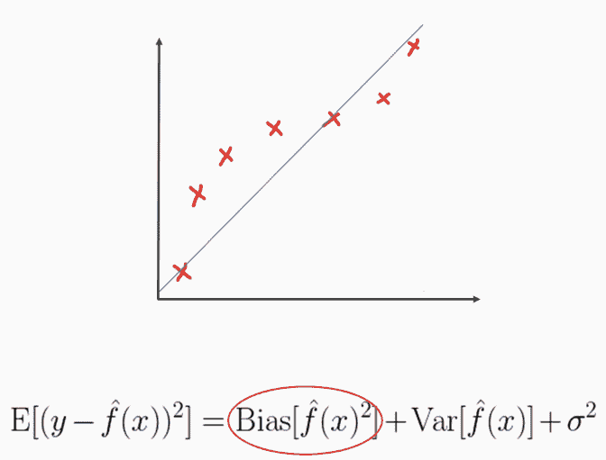

参数模型比非参数模型更容易遭受高偏差问题。这方面的例子包括线性回归和逻辑回归，我们将在本章的最后一节更详细地探讨。


# 差异导致的误差

相比之下，对于您现在所熟悉的高偏差，方差导致的误差可以被认为是给定样本的模型预测的可变性。想象你多次重复建模过程；方差是给定样本的预测值在模型的不同归纳中的变化程度。高方差模型通常被称为过度拟合，与高偏差正好相反。也就是说，它们不够一般化。高方差通常来自于模型对噪声过敏导致的对信号的不敏感性。通常，随着模型复杂性的增加，方差成为我们主要关心的问题。请注意，图中的多项式项导致了非常过度拟合的模型，而简单的 **logit** 函数就足够了:

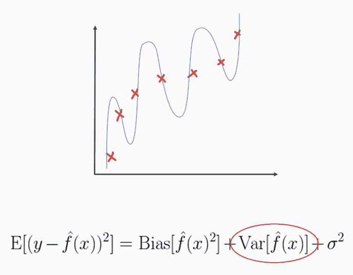

与高偏差问题不同，高方差问题可以通过更多的训练数据来解决，这可以帮助模型更好地学习泛化。因此，我们还没有涉及的高方差模型的例子有决策树和 KNN。我们将在本章中讨论这两个问题。


# 学习曲线

在本节中，我们将研究一种简便的方法来诊断高偏差或方差，称为**学习曲线**。在这个示例 Python 片段中，我们将利用名为`plot_learning_curve`的`packtml.utils`子模块中的函数，如以下代码所示:

```py
from sklearn.datasets import load_boston
from sklearn.metrics import mean_squared_error
from packtml.utils.plotting import plot_learning_curve
from packtml.regression import SimpleLinearRegression
%matplotlib inline

boston = load_boston()
plot_learning_curve(
        model=SimpleLinearRegression, X=boston.data, y=boston.target,
        metric=mean_squared_error, n_folds=3,
        train_sizes=(50, 150, 250, 300),
        seed=42, y_lim=(0, 45))\
    .show
```

该函数将采用一个估计器，并使其适合在`train_sizes`参数中定义的各种大小的训练数据。显示的是模型在列车上的性能以及每个增量模型拟合的相应验证集。因此，此示例使用我们的线性回归类来模拟波士顿住房数据，这是一个回归问题，显示了高偏差的症状。请注意，对于训练集和验证集，我们的错误非常相似。它到达那里的速度非常快，但仍然相对较高。随着我们训练集的增加，他们根本没有提高。我们得到前面代码的输出如下:

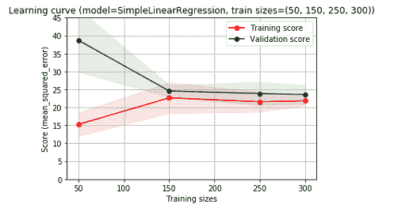

或者，如果我们用决策树回归器对相同的数据建模，我们会注意到高方差或过度拟合的症状:

```py
from sklearn.datasets import load_boston
from sklearn.metrics import mean_squared_error
from packtml.utils.plotting import plot_learning_curve
from packtml.decision_tree import CARTRegressor
%matplotlib inline

boston = load_boston()
plot_learning_curve(
        model=CARTRegressor, X=boston.data, y=boston.target,
        metric=mean_squared_error, n_folds=3,
        train_sizes=(25, 150, 225, 350),
        seed=42, random_state=21, max_depth=50)\
    .show
```

在**训练分数**和**验证分数**之间有巨大的差异，即使随着更多的数据它变得更好，它也从未完全达到收敛。我们得到以下输出:

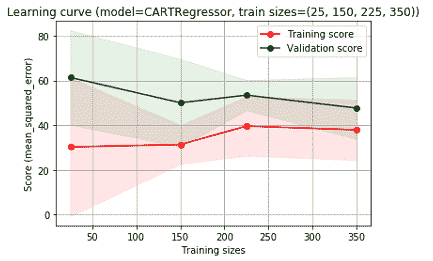


# 处理高偏差的策略

如果您确定您正遭受高偏差问题，您可以尝试通过设计更多信息丰富的信号特征来使您的模型更加复杂。例如，在这里，您可以尝试做的一件事是创建新的功能，这些功能是您的 *x1* 的多项式组合，因此，您可以创建 *x1* 的 logit 函数，这将完美地模拟我们的函数。您还可以尝试调整一些超参数，例如 KNNs，尽管它是一个高方差模型，并且随着您增加 *k* 超参数，它可能会很快变得高度偏向，反之亦然:

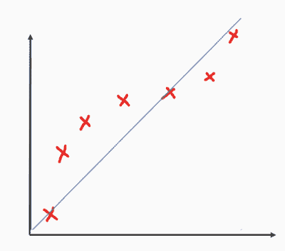

# 处理高差异的策略

相反，如果你发现自己面临一个高方差的问题，我们已经看到了更多的训练数据在某种程度上是如何帮助你的。您还可以执行一些特征选择来降低模型的复杂性。最可靠的解决方案是打包或集合，它将输出组合成迷你模型，这些模型依次对每个样本的标签或输出回归得分进行投票:


在下一节中，我们将更正式地定义非参数学习算法，并介绍决策树。


# 非参数模型和决策树介绍

在这一节中，我们将正式定义什么是非参数学习算法，并介绍我们的第一个算法背后的一些概念和数学，称为**决策树**。


# 非参数学习

非参数模型不学习参数。他们确实了解数据的特征或属性，但不是正式意义上的参数。我们最终不会提取系数向量。最简单的例子是决策树。决策树将学习在哪里递归地分割数据，以便它的叶子尽可能纯净。因此，在这种意义上，决策函数是每个非参数叶的分裂点。


# 非参数学习算法的特征

非参数模型往往更加灵活，不会对数据的底层结构做太多假设。例如，许多线性模型或参数模型假设每个特征的正态分布需要相互独立。大多数非参数模型并非如此。正如我们在上一节中所介绍的，偏差-方差权衡也知道非参数模型需要更多的数据来训练，以便不受高方差问题的困扰。


# 模型是否是参数化的？

如果您发现自己想知道一个模型是否是参数化的，这可能不是要回答的最重要的问题。您应该选择最适合您的数据的建模技术。然而，一个好的经验法则是模型学习多少特征或参数。如果它与特征空间或维度相关，它可能是参数化的，例如，在线性回归中学习系数θ的数量。相反，如果它与样本的数量有关，它可能是非参数的，例如，决策树的深度或聚类中邻居的数量。


# 直观的例子——决策树

决策树将从所有的数据开始，反复进行分裂，直到每一片叶子的纯度达到最大，或者满足其他一些停止标准。在本例中，我们将从三个样本开始。这棵树了解到颜色特征上的分裂将是我们最大化它的叶子纯度的最有用的一步。所以，这是首先要注意的。第一次拆分是最能提供信息的拆分，可以最好地将数据分成两部分。如下图所示，通过对颜色进行分割，马铃薯类被隔离在左侧。我们已经很好地将土豆分类了。但是，另外两个样本仍然需要拆分。所以，这棵树知道，如果它是橙色和圆形的，那它就是一个红薯。否则，如果它只是橙色而不是圆形，它就是胡萝卜，它会再向左走一次。在这里，我们可以看到所有类的完美划分:

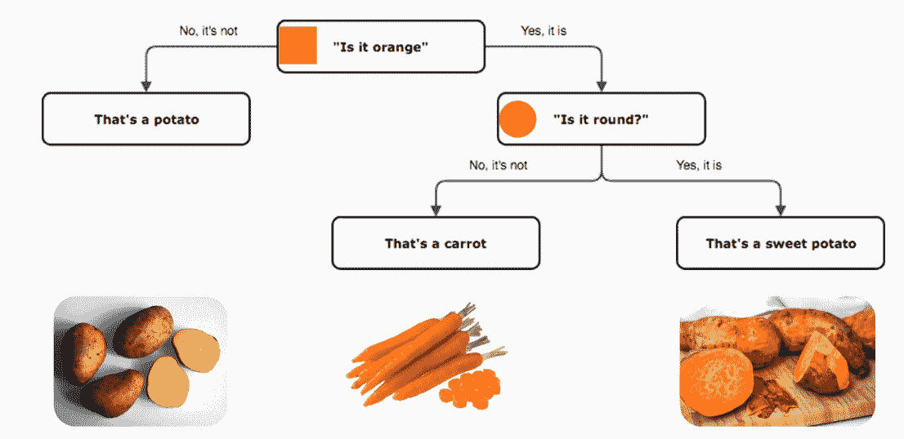

# 决策树——简介

我们对决策树感兴趣的是定义一个灵活的可扩展算法来实现决策树。这就是**分类和回归树** ( **CART** )算法的用武之地。CART 适用于任何一项任务，它本质上是通过对数据提问来学习的。在每个分割点，CART 将扫描整个特征空间，从每个特征中采样值，以确定分割的最佳特征和值。它通过评估信息增益公式来做到这一点，该公式寻求在分离中最大化纯度增益，这非常直观。 *Gini 杂质*是在叶子水平上计算的，并且是测量叶子有多纯或不纯的一种方式；其公式如下:


*IG* 底部是我们的信息增益，是根节点的基尼，如下图:


# 决策树是如何做决策的？

在看数学之前，我们将首先讨论目标。我们将计算分裂的信息增益，以确定最佳分裂点。如果信息增益是正的，这意味着我们从那次分裂中学到了一些东西，这可能是最佳点。如果信息增益为负，这意味着我们实际上走错了方向。我们所做的是创建一个无信息的分裂。树中的每个分裂将选择最大化信息增益的点。

所以，这里是设置:

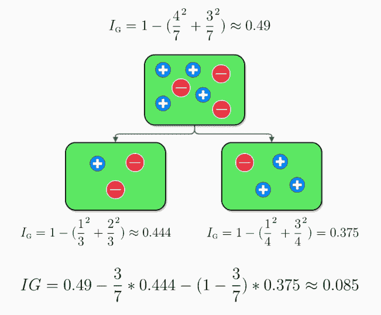

基尼系数为 0 的杂质会特别纯。更高的杂质本质上意味着在那片叶子中发现了更随机的类别集合。所以，我们的根相当不纯。现在我们的树将扫描整个特征空间，从每个特征中采样值。如果我们在那里分开，它将评估获得的信息。所以，假设我们的树选择了 *x12* 。我们将沿着对该变量采样的相同值分开。我们想知道的是，如果我们最终从这种分裂中获得更多的纯叶节点，我们将计算信息增益。为此，我们必须为我们刚刚创建的每个叶节点计算 Gini。

我们将使用`packtml`库来看看这个问题的一个例子。我们有`example_information_gain.py`文件，它在`examples/decision_tree`目录中:

```py
# -*- coding: utf-8 -*-

from __future__ import absolute_import

from packtml.decision_tree.metrics import gini_impurity, InformationGain
import numpy as np

# #############################################################################
# Build the example from the slides
y = np.array([0, 0, 0, 1, 1, 1, 1])
uncertainty = gini_impurity(y)
print("Initial gini impurity: %.4f" % uncertainty)

# now get the information gain of the split from the slides
directions = np.array(["right", "left", "left", "left",
                       "right", "right", "right"])
mask = directions == "left"
print("Information gain from the split we created: %.4f"
      % InformationGain("gini")(target=y, mask=mask, uncertainty=uncertainty))
```

接下来，我们将使用来自`packtml.decision_tree.metrics`的`InformationGain`类来计算信息增益:

```py
from packtml.decision_tree.metrics import gini_impurity, InformationGain
import numpy as np
```

当我们运行`example_information_gain.py`时，我们将得到以下输出:


在下一节中，我们将更深入一点，了解决策树如何生成候选分割供我们评估。


# 决策树

在上一节中，我们计算了给定分割获得的信息。回想一下，它是通过计算每个`LeafNode`中父节点的 Gini 杂质来计算的。更高的信息也更好，这意味着我们已经成功地通过我们的分割减少了子节点的杂质。然而，我们需要知道一个候选分裂是如何被评估的。

对于每次分割，从根开始，算法将扫描数据中的所有要素，为每个要素选择一个随机数值。有各种策略来选择这些值。对于一般用例，我们将描述并选择一种 *k* 随机方法:

*   对于每个特征中的每个样本值，我们模拟一个候选分割
*   高于采样值的值向一个方向移动，例如向左，高于采样值的值向另一个方向移动，即向右
*   现在，对于每个候选分裂，我们将计算信息增益，并选择产生最高信息增益的特征值组合，即最佳分裂
*   从最佳分割开始，我们将向下递归每个分割作为新的父分割，直到满足停止标准

现在，关于何时何地停止标准，有各种方法可以使用。一个常见的是最大树深度。如果我们陷得太深，我们就会开始过度适应。例如，当我们的树长到五倍深时，我们可能会修剪它。另一个是每片叶子的最小样本数。如果我们有 100 万个训练样本，我们将我们的树增长到每片叶子有一个样本；我们也可能过度适应。因此，min samples leaf 参数将允许我们在分割后剩余 50 个样本时停止分割树叶。这是一个可调的超参数，您可以在交叉验证过程中使用。


# 用手劈树

我们现在来看一个练习。假设我们有这样的训练集:

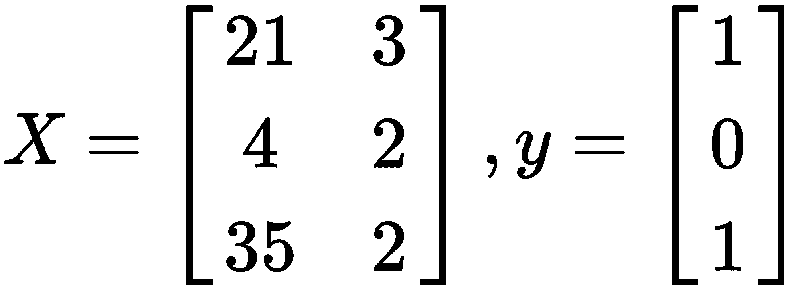

根据前面的数据，最佳分割点在哪里？我们应该使用什么特性或值组合来定义我们的规则？


# 如果我们在 x1 上分开

首先，我们将计算根节点的基尼杂质，这是分裂前的状态。我们得到 *0.444* ，如图所示:


算法的下一步是迭代每个特征。有三种情况，如下所示。使用我们的 *IG* 公式，我们可以计算出这个特性的最佳分割点。在这种情况下，第一个恰好是最好的:


在第二种情况下进行拆分，其中 *x1* 大于或等于 *4* ，这不是一个好主意，因为结果与根处的状态没有什么不同。因此，我们的信息增益为 *0* :


在最后一种情况下，当 *x1* 大于或等于 *37* 时，分裂确实产生正 IG，因为我们已经成功地将正类的一个样本从其他样本中分裂出来:


# 如果我们在 x2 上分开

然而，我们不知道我们是否已经完成了。因此，我们将迭代到 *x2* ，这里可能有一个更好的分割点:


候选拆分向我们表明，与我们在 *x1* 中确定的当前最佳拆分相比，任何潜在拆分都不是最佳拆分。

所以最好的拆分是 *x1* 大于等于 *21* ，这样会完美的把我们的类标签分开。你可以在这个决策树中看到，当我们产生这种分裂时，当然，我们得到了完全分离的类:

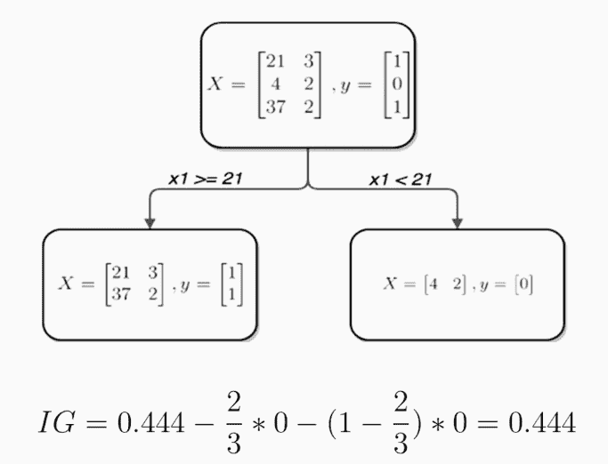

然而，在一个更大的例子中，例如，如果我们有数百万个样本，我们可能没有完全分离我们的类。因此，我们将在这一点上递归，为每个节点寻找新的分割点，直到我们达到停止标准。在这一点上，让我们使用我们的`packtml`库来运行这个确切的例子，并表明我们实际上确定了相同的最佳分割点，并证明这不仅仅是一手牌的诡计。

在 PyCharm 中，`example_classification_split.py`文件是打开的。这位于您的`examples`目录和`decision_tree`示例目录中。你可以看到我们将从`packtml`进口两样东西。这两个都在你得到`RandomSplitter`的`decision_tree`子模块里面:

```py
from __future__ import absolute_import

from packtml.decision_tree.cart import RandomSplitter
from packtml.decision_tree.metrics import InformationGain
import numpy as np
```

在上一节中，我们已经稍微看了一下`InformationGain`来计算我们的信息增益候选分割。在这里，我们将看看我们实际上是如何创建候选人分裂的。我们得到以下数据以及相应的类别标签:

```py
# Build the example from the slides (3.3)
X = np.array([[21, 3], [ 4, 2], [37, 2]])
y = np.array([1, 0, 1])
```

因为`n_val_sample`是`3`，所以`RandomSplitter`将评估每个先前的值。因此，它将为每个特征计算三个候选分割点，我们将找出哪一个是最好的:

```py
# this is the splitting class; we'll use gini as the criteria
random_state = np.random.RandomState(42)
splitter = RandomSplitter(random_state=random_state,
                          criterion=InformationGain('gini'),
                          n_val_sample=3)
# find the best:
best_feature, best_value, best_gain = splitter.find_best(X, y)
print("Best feature=%i, best value=%r, information gain: %.3f"
      % (best_feature, best_value, best_gain))
```

当我们运行前面的代码时，我们看到`best_feature`是`0`而`best_value`是`21`，这意味着特性`0`中任何大于或等于`21`的都将向左，其他的都向右。我们得到的`InformationGain`是`0.444`，当然，当我们手工计算时，它正是我们所期望的:


在下一节中，我们将介绍如何在`packtml`库中从头开始实现决策树。


# 从头开始实现决策树

我们将从查看分割指标的实现开始。然后，我们将介绍一些分割逻辑，最后，我们将看到如何包装树，以便我们可以从分类和回归任务中进行归纳。


# 分类树

让我们来看一个分类树的例子。我们将使用信息增益标准。在 PyCharm 中有三个打开的脚本，其中两个是`metrics.py`和`cart.py`，它们都在`packtml/decision_tree`子模块中。然后我们有`example_classification_decision_tree.py`文件，它在`examples/decision_tree`。让我们从度量标准开始。

如果你打开`cart.py`文件，我们有一个顺序，我们应该按照这个顺序逐步完成，这样你就可以理解决策树类是如何工作的:

```py
# 1\. metrics.InformationGain & metrics.VarianceReduction
# 2\. RandomSplitter
# 3\. LeafNode
# 4\. BaseCART
```

从顶部的`metrics.py`文件开始，您可以看到`_all_`将包含四个不同的指标:

```py
__all__ = [
    'entropy',
    'gini_impurity',
    'InformationGain',
    'VarianceReduction'
]
```

`entropy`和`gini_impurity`都是分类指标。我们已经讲过`gini_impurity`。这里可以看到，它们都在调用`clf_metric`私有函数，如下所示:

```py
def entropy(y):
    """Compute the entropy of class labels.

    This computes the entropy of training samples. A high entropy means
    a relatively uniform distribution, while low entropy indicates a
    varying distribution (many peaks and valleys).

    References
    ----------
    .. [1] http://www.cs.csi.cuny.edu/~imberman/ai/Entropy%20and%20Information%20Gain.htm
    """
    return _clf_metric(y, 'entropy')

def gini_impurity(y):
    """Compute the Gini index on a target variable.

    The Gini index gives an idea of how mixed two classes are within a leaf
    node. A perfect class separation will result in a Gini impurity of 0 (that is,
    "perfectly pure").
    """
    return _clf_metric(y, 'gini')
```

现在，`gini`和`entropy`的行为基本相同，除了最后，`gini`对自身计算一个范数，其中`entropy`是`log2`:

```py
def _clf_metric(y, metric):
    """Internal helper. Since this is internal, so no validation performed"""
    # get unique classes in y
    y = np.asarray(y)
    C, cts = np.unique(y, return_counts=True)

    # a base case is that there is only one class label
    if C.shape[0] == 1:
        return 0.

    pr_C = cts.astype(float) / y.shape[0] # P(Ci)

    # 1 - sum(P(Ci)^2)
    if metric == 'gini':
        return 1\. - pr_C.dot(pr_C) # np.sum(pr_C ** 2)
    elif metric == 'entropy':
        return np.sum(-pr_C * np.log2(pr_C))

    # shouldn't ever get to this point since it is internal
    else:
        raise ValueError("metric should be one of ('gini', 'entropy'), "
                         "but encountered %s" % metric)
```

这里需要注意的一点是，熵和基尼系数将对你的树的表现产生巨大的影响。Gini 实际上是 CART 算法的标准，但是我们在这里包括了熵，所以你可以看到，如果你想的话，你可以使用它。

`BaseCriterion`是我们拆分标准的基类。我们有两个分割标准，`InformationGain`和`VarianceReduction`。他们两个都打算实现`compute_uncertainty`:

```py
class BaseCriterion(object):
    """Splitting criterion.

    Base class for InformationGain and VarianceReduction. WARNING - do
    not invoke this class directly. Use derived classes only! This is a
    loosely-defined abstract class used to prescribe a common interface
    for sub-classes.
    """
    def compute_uncertainty(self, y):
        """Compute the uncertainty for a vector.

        A subclass should override this function to compute the uncertainty
        (that is, entropy or gini) of a vector.
        """

class InformationGain(BaseCriterion):
    """Compute the information gain after a split.

    The information gain metric is used by CART trees in a classification
    context. It measures the difference in the gini or entropy before and
    after a split to determine whether the split "taught" us anything.
```

如果你还记得上一节，不确定性本质上是由分裂引起的杂质或熵的水平。当我们使用`gini`或`entropy`计算`InformationGain`时，我们的不确定性将是`metric`预分割:

```py
def __init__(self, metric):
        # let fail out with a KeyError if an improper metric
        self.crit = {'gini': gini_impurity,
                     'entropy': entropy}[metric]
```

如果我们计算`uncertainty`，我们将传入一个节点，比如说，在我们分割之前，对节点内的所有样本计算基尼，然后，当我们调用实际计算`InformationGain`时，我们传入`mask`来判断是发生了`left`还是`right`。我们将计算左右两边的基尼系数，并返回`InformationGain`:

```py
def __call__(self, target, mask, uncertainty):
        """Compute the information gain of a split.

        Parameters
        ----------
        target : np.ndarray
            The target feature

        mask : np.ndarray
            The value mask

        uncertainty : float
            The gini or entropy of rows pre-split
        """
        left, right = target[mask], target[~mask]
        p = float(left.shape[0]) / float(target.shape[0])

        crit = self.crit # type: callable
        return uncertainty - p * crit(left) - (1 - p) * crit(right)
```

这就是我们如何计算`InformationGain`，这只是我们已经建立的包装类。`VarianceReduction`非常相似，除了`compute_uncertainty`函数简单地返回 *y* 的方差。当我们调用它时，我们减去了预分割节点的不确定性，减去了分割点左右两侧的不确定性之和。我们在这里做的是最大限度地减少每次分裂之间的差异。这样的话，我们可以知道一个分裂是好是坏。它沿着一条相对直观的线分开，如下所示:

```py
class VarianceReduction(BaseCriterion):
    """Compute the variance reduction after a split.

    Variance reduction is a splitting criterion used by CART trees in the
    context of regression. It examines the variance in a target before and
    after a split to determine whether we've reduced the variability in the
    target.
    """
    def compute_uncertainty(self, y):
        """Compute the variance of a target."""
        return np.var(y)

    def __call__(self, target, mask, uncertainty):
        left, right = target[mask], target[~mask]
        return uncertainty - (self.compute_uncertainty(left) +
                              self.compute_uncertainty(right))
```

这是我们的两个拆分标准:`InformationGain`和`VarianceReduction`。我们将使用`InformationGain`进行分类，使用`VarianceReduction`进行回归。既然我们现在正在讨论分类，那就让我们把注意力集中在`InformationGain`上。转到`cart.py`文件，我们看到我们要谈论的下一件事是`RandomSplitter`。

在最后一节中，我们学习了产生候选人分裂的策略。这本质上就是`RandomSplitter`。这里有很多不同的策略可以使用。我们将使用一点熵，这样我们可以相对快速地通过这个类和这个算法，而不用深入本质。

`RandomSplitter`将需要几个参数。我们需要`random_state`,这样我们以后就可以复制这种分割。标准是`InformationGain`或`VarianceReduction`的一个实例，以及我们希望从每个特征中采样的值的数量:

```py
 def __init__(self, random_state, criterion, n_val_sample=25):
        self.random_state = random_state
        self.criterion = criterion # BaseCriterion from metrics
        self.n_val_sample = n_val_sample
```

因此，我们的`find_best`函数将扫描整个特征空间，对每个分割或每个特征的值的数量进行采样，并确定要分割的`best_value`和`best_feature`。这将产生我们当时对树的最佳分割。所以，`best_gain`会以`0`开头。如果是负的，那就是坏的，所以我们根本不想分开。如果它是正的，那么它就比我们目前的最好结果好，所以我们要把它加 1，找到我们的最好结果。我们想找到我们的`best_feature`和我们的`best_value`:

```py
def find_best(self, X, y):
        criterion = self.criterion
        rs = self.random_state

        # keep track of the best info gain
        best_gain = 0.

        # keep track of best feature and best value on which to split
        best_feature = None
        best_value = None

        # get the current state of the uncertainty (gini or entropy)
        uncertainty = criterion.compute_uncertainty(y)
```

现在，对于我们数据集的每一列，我们将继续提取特征。这只是一个数字阵列，一个 1D 数字阵列:

```py
# iterate over each feature
for col in xrange(X.shape[1]):
    feature = X[:, col]
```

我们将创建一个集合，以便我们可以跟踪我们已经看到的值，如果我们碰巧一次又一次地对同一个值进行采样。我们将置换这个特性，这样我们就可以将它混洗并扫描特性中的每个值。这里需要注意的一点是，我们可以只收集要素的唯一值。但首先，获得唯一值的代价有点高。其次，这丢弃了关于该特征的所有分布信息。通过这样做，我们碰巧有更多的某个值，或者更多的值更紧密地组合在一起。这将允许我们获得更多的特征本身的真实样本:

```py
 # For each of n_val_sample iterations, select a random value
 # from the feature and create a split. We store whether we've seen
 # the value before; if we have, continue. Continue until we've seen
 # n_vals unique values. This allows us to more likely select values
 # that are high frequency (retains distributional data implicitly)
 for v in rs.permutation(feature):
```

如果集合中的`seen_values`的数量等于我们想要采样的值的数量，我们就要爆发了。所以，如果我们说有`100`唯一值，但我们已经看到了`25`，我们就要爆发了。否则，如果我们已经在那个集合中看到这个值，我们将继续下去。我们不想在已经计算过的值上计算同样的东西。因此，这里我们将该值添加到集合中，并为我们是向左还是向右拆分创建遮罩:

```py
# if we've hit the limit of the number of values we wanted to
# examine, break out
if len(seen_values) == n_vals:
   break
# if we've already tried this value, continue
elif v in seen_values: # O(1) lookup
     continue
# otherwise, it's a new value we've never tried splitting on.
# add it to the set.
seen_values.add(v)

# create the mask (these values "go left")
mask = feature >= v # type: np.ndarray
```

现在，还有一个棘手的问题。如果我们已经得到了最小值，那么我们的掩码将把所有东西都带向一个方向，这就是我们要检查的。我们不希望这样，因为，否则，我们就不会产生真正的分裂。所以，如果是这样的话，那么我们`continue`，再采样一次:

```py
# skip this step if this doesn't divide the dataset
if np.unique(mask).shape[0] == 1: # all True or all False
    continue
```

现在让我们来计算增益，或者是`InformationGain`或者是`VarianceReduction`，它计算出左右两边的基尼系数，然后从原始不确定性中减去这个系数。如果`gain`是好的，意味着如果它比我们见过的当前最好的更好，那么我们有一个新的`best_feature`和一个新的`best_value`，并且我们存储它。因此，我们对此进行循环，检查每个特性中的随机采样值，并确定要分割的`best_feature`和该特性中要分割的`best_value`。如果我们没有一个，这意味着我们从来没有找到一个可行的分裂，这种情况很少发生:

```py
# compute how good this split was
gain = criterion(y, mask, uncertainty=uncertainty)

# if the gain is better, we keep this feature & value &
# update the best gain we've seen so far
if gain > best_gain:
    best_feature = col
    best_value = v
    best_gain = gain

# if best feature is None, it means we never found a viable split...
# this is likely because all of our labels were perfect. In this case,
# we could select any feature and the first value and define that as
# our left split and nothing will go right.
if best_feature is None:
    best_feature = 0
    best_value = np.squeeze(X[:, best_feature])[0]
    best_gain = 0.

# we need to know the best feature, the best value, and the best gain
return best_feature, best_value, best_gain
```

接下来，我们来看看`LeafNode`。如果你以前曾经构建过二叉树，那么你应该熟悉`LeafNode`的概念。`LeafNode`将存储一个左指针和一个右指针，这两个指针通常都被初始化为空，以表示那里什么也没有。因此，在这种情况下，叶节点将是我们决策树的核心。它提供了一个框架，其中树本身只是一个包装器:

```py
class LeafNode(object):
    """A tree node class.

    Tree node that store the column on which to split and the value above
    which to go left vs. right. Additionally, it stores the target statistic
    related to this node. For instance, in a classification scenario:

        >>> X = np.array([[ 1, 1.5 ],
        ...               [ 2, 0.5 ],
        ...               [ 3, 0.75]])
        >>> y = np.array([0, 1, 1])
        >>> node = LeafNode(split_col=0, split_val=2,
        ...                 class_statistic=_most_common(y))
```

`LeafNode`将存储`split_col`、我们正在分割的特征、`split_val`、`split_gain`以及`class_statistic`。因此，`class_statistic`对于分类来说将是节点，在那里我们投票选择最常见的值。在回归中，它将是平均值。如果你想变得更有趣，你可以使用中位数或者其他回归策略。然而，我们将使用平均值，因为我们在这里保持简单。因此，构造函数将存储这些值，并再次将我们的左右两边初始化为 null:

```py
   def __init__(self, split_col, split_val, split_gain, class_statistic):

        self.split_col = split_col
        self.split_val = split_val
        self.split_gain = split_gain

        # the class statistic is the mode or the mean of the targets for
        # this split
        self.class_statistic = class_statistic

        # if these remain None, it's a terminal node
        self.left = None
        self.right = None

    def create_split(self, X, y):
        """Split the next X, y.
```

现在在`create_split`函数中，我们实际上获得了树结构本身。但这实质上是要分裂节点，并创建一个新的左和右。因此，它从终端节点向下到下一个分裂，我们可以递归。我们将从`X`和`y`分割中获取当前数据集的当前集合。假设我们已经初始化的特征中的值将创建我们的左右掩码，如果我们要全左或全右，那就是它存储的位置。否则，它将产生这种分割，分割出左边的行和右边的行，否则这些行都不存在。如果左/右没有拆分，我们就使用 none，我们将返回`X_left`、`X_right`、`y_left`和`y_right`:

```py
# If values in the split column are greater than or equal to the
# split value, we go left.
left_mask = X[:, self.split_col] >= self.split_val

# Otherwise we go to the right
right_mask = ~left_mask # type: np.ndarray

# If the left mask is all False or all True, it means we've achieved
# a perfect split.
all_left = left_mask.all()
all_right = right_mask.all()

# create the left split. If it's all right side, we'll return None
X_left = X[left_mask, :] if not all_right else None
y_left = y[left_mask] if not all_right else None

# create the right split. If it's all left side, we'll return None.
X_right = X[right_mask, :] if not all_left else None
y_right = y[right_mask] if not all_left else None

return X_left, X_right, y_left, y_right
```

终端在这里只是左右的捷径。如果我们有任何一个，那就不是晚期。但是，如果它的左右两边都为空，那么它就是一个终端节点:

```py
def is_terminal(self):
     """Determine whether the node is terminal.

     If there is no left node and no right node, it's a terminal node.
     If either is non-None, it is a parent to something.
     """
     return self.left is None and self.right is None
```

我们将在内部使用`predict_record`函数来产生`LeafNode`内部的预测。这将使用我们拥有的那个`class_statistic`函数。`class_statistic`要么是分类的模式，要么是回归的均值。为了预测一个记录是向左还是向右，我们向下递归，这正是在`predict`中所发生的，我们将会看到，并看看我们如何产生预测:

```py
   def predict_record(self, record):
        """Find the terminal node in the tree and return the class statistic"""
        # First base case, this is a terminal node:
        has_left = self.left is not None
        has_right = self.right is not None
        if not has_left and not has_right:
            return self.class_statistic

        # Otherwise, determine whether the record goes right or left
        go_left = record[self.split_col] >= self.split_val

        # if we go left and there is a left node, delegate the recursion to the
        # left side
        if go_left and has_left:
            return self.left.predict_record(record)

        # if we go right, delegate to the right
        if not go_left and has_right:
            return self.right.predict_record(record)

        # if we get here, it means one of two things:
        # 1\. we were supposed to go left and didn't have a left
        # 2\. we were supposed to go right and didn't have a right
        # for both of these, we return THIS class statistic
        return self.class_statistic
```

现在，树本身分为两类。我们有`CARTRegressor`和`CARTClassifier`。这两个都将包装`BaseCART`类，我们现在就来浏览一下。`BaseCART`，正如我们已经走过的大多数基本简单估计器一样，肯定会有两个参数，它们是`X`和`y`——我们的训练数据和训练标签。它还将采用我们的标准，我们将在底部通过。要么是你的`InformationGain`用于分类，`VarianceReduction`用于回归，`min_samples_split`，以及所有这些超参数，我们已经讨论过了。我们要做的第一件事是，像往常一样，检查我们的`X`和`y`以确保我们有所有连续的值，我们没有丢失任何数据。这只是为超参数分配`self`属性，我们将把`splitter`创建为`RandomSplitter`，我们将在这个过程中使用它。这就是我们如何种植这棵树。这一切都发生在`find_next_split`。这需要三个参数。我们有我们的`X`，我们的`y`，然后是计数:

本质上，我们将递归调用`find_next_split`函数，直到我们的树完全成长或被修剪。因为我们是递归的，所以我们总是先设置基本情况。如果`current_depth`等于`maximum_depth`表示我们要生长一棵树，或者大小，即`X`中的样本数，小于或等于我们拆分中的`min_samples_split`，这两个都是我们的最终标准，我们将返回`None`:

否则，我们将抓住我们的分割器，并在`X`和`y`之间找到最佳分割，这给了我们`best_feature`、`best_value`和`gain`、`VarianceReduction`或`InformationGain`。接下来，我们刚刚找到了第一个裂口。因此，现在我们将创建对应于该拆分的节点。该节点将接受所有这些相同的参数，加上目标统计数据。当我们为节点生成预测时，如果它是终端，我们返回该标签的节点；否则，我们返回训练标签的平均值。这就是我们如何分配预测。现在我们有了节点，我们想创建我们的拆分。所以，我们得到`X_right`和`X_left`。我们可以沿着树的两边向下递归。我们将使用该节点在`X`和`Y`上创建分割。因此，如果`X`是`None`，`X_left`是`None`，这意味着我们不会再向下到左侧。如果不是`None`，那么我们可以在左边分配一个节点，它将在`find_next_split`递归。如果`X_right`是`None`，那么这意味着我们不会再在右边生长它了。如果不是`None`，我们也可以这么做。因此，我们将通过向下递归`find_next_split`来分配我们的右侧。我们重复这个过程，不断增加`current_depth + 1`，直到一边达到它的`maximum_depth`。否则，分裂的尺寸对`min_sample_split`来说不再足够长，我们停止生长。所以，我们到达了停止增长的点:

```py
class _BaseCART(BaseSimpleEstimator):
    def __init__(self, X, y, criterion, min_samples_split, max_depth,
                 n_val_sample, random_state):
        # make sure max_depth > 1
        if max_depth < 2:
            raise ValueError("max depth must be > 1")

        # check the input arrays, and if it's classification validate the
        # target values in y
        X, y = check_X_y(X, y, accept_sparse=False, dtype=None, copy=True)
        if is_classifier(self):
            check_classification_targets(y)

        # hyper parameters so we can later inspect attributes of the model
        self.min_samples_split = min_samples_split
        self.max_depth = max_depth
        self.n_val_sample = n_val_sample
        self.random_state = random_state

        # create the splitting class
        random_state = check_random_state(random_state)
        self.splitter = RandomSplitter(random_state, criterion, n_val_sample)

        # grow the tree depth first
        self.tree = self._find_next_split(X, y, 0)
```

现在，为了预测，我们将遍历树，直到找到记录所属的点。因此，对于`X`中的每一行，我们将预测一行，我们已经在`LeafNode`类中看过了，向左或向右遍历，直到找到该行所属的节点。然后我们将返回`class_statistics`。所以，如果这一行到达一个节点，它说这属于这里。如果分类的节点是`1`，那么我们返回`1`。否则，如果平均值是，比方说，`5.6`，那么我们返回相同的值。这就是我们如何产生这些预测，我们只是要捆绑到一个 NumPy 数组:

那么，让我们看看分类决策树如何在一些真实数据上执行。在下面的示例脚本中，我们将导入`CARTClassifier`:

我们将在`multivariate_normal`的 2D 访问中创建两个不同的气泡。使用`RandomState`中的这个`multivariate_normal`，我们将把它们堆叠在一起，照常生成`train_test_split`:

```py
    def _find_next_split(self, X, y, current_depth):
        # base case 1: current depth is the limit, the parent node should
        # be a terminal node (child = None)
        # base case 2: n samples in X <= min_samples_split
        if current_depth == self.max_depth or \
                X.shape[0] <= self.min_samples_split:
            return None
```

我们将拟合`CARTClassifier`并执行两个不同的分类器。我们将做第一个。了解了您现在对方差和偏差的了解，您就知道分类器或非参数模型，尤其是决策树，能够具有非常高的方差:它们很容易过度拟合。因此，如果我们使用一个非常浅的深度，那么我们更有可能不会过度拟合。在第二个中，我们将尝试用最大深度`25`来尽可能多的填充。由于我们有一个非常小的数据集，我们可以合理地确定这可能会过拟合。当我们看这个例子的实际输出时，我们会看到:

```py
# create the next split
split_feature, split_value, gain = \
     self.splitter.find_best(X, y)

# create the next node based on the best split feature and value
# that we just found. Also compute the "target stat" (mode of y for
# classification problems or mean of y for regression problems) and
# pass that to the node in case it is the terminal node (that is, the
# decision maker)
node = LeafNode(split_feature, split_value, gain, self._target_stat(y))
# Create the splits based on the criteria we just determined, and then
# recurse down left, right sides
X_left, X_right, y_left, y_right = node.create_split(X, y)

# if either the left or right is None, it means we've achieved a
# perfect split. It is then a terminal node and will remain None.
if X_left is not None:
node.left = self._find_next_split(X_left, y_left,
                                  current_depth + 1)
```

因此，我们拟合这两个，看看精度，并绘制它们。让我们继续运行代码，看看它是什么样子的:

```py
def predict(self, X):
    # Check the array
    X = check_array(X, dtype=np.float32) # type: np.ndarray

    # For each record in X, find its leaf node in the tree (O(log N))
    # to get the predictions. This makes the prediction operation
    # O(N log N) runtime complexity
    predictions = [self.tree.predict_record(row) for row in X]
    return np.asarray(predictions)
```


```py
from packtml.decision_tree import CARTClassifier
from packtml.utils.plotting import add_decision_boundary_to_axis
from sklearn.metrics import accuracy_score
from sklearn.model_selection import train_test_split
import matplotlib.pyplot as plt
import numpy as np
import sys
```

如果您运行前面的代码，我们在欠装配树上得到 95%的测试准确率，如下所示:

```py
# Create a classification dataset
rs = np.random.RandomState(42)
covariance = [[1, .75], [.75, 1]]
n_obs = 500
x1 = rs.multivariate_normal(mean=[0, 0], cov=covariance, size=n_obs)
x2 = rs.multivariate_normal(mean=[1, 3], cov=covariance, size=n_obs)

X = np.vstack((x1, x2)).astype(np.float32)
y = np.hstack((np.zeros(n_obs), np.ones(n_obs)))

# split the data
X_train, X_test, y_train, y_test = train_test_split(X, y, random_state=42)
```


```py
# Fit a simple decision tree classifier and get predictions
shallow_depth = 2
clf = CARTClassifier(X_train, y_train, max_depth=shallow_depth, criterion='gini',
                     random_state=42)
pred = clf.predict(X_test)
clf_accuracy = accuracy_score(y_test, pred)
print("Test accuracy (depth=%i): %.3f" % (shallow_depth, clf_accuracy))

# Fit a deeper tree and show accuracy increases
clf2 = CARTClassifier(X_train, y_train, max_depth=25, criterion='gini',
                      random_state=42)
pred2 = clf2.predict(X_test)
clf2_accuracy = accuracy_score(y_test, pred2)
print("Test accuracy (depth=25): %.3f" % clf2_accuracy)
```

回归树

现在让我们看看回归树是如何表现的。除了我们将使用方差缩减之外，我们遍历了回归树的完全相同的实现。我们将使用平均值，而不是使用投票模式来进行预测。

在`examples`目录中，我们有`example_regression_decision_tree.py`文件。因此，这里我们将导入`CARTRegressor`，并使用`mean_squared_error`作为我们的损失函数来确定我们做得有多好:


# Regression tree

Now let's see how a regression tree can perform. We walked through the same exact implementation of our regression tree, except we're going to use the variance reduction. Rather than using the mode voting here for producing predictions, we're going to use the mean.

Inside the `examples` directory, we have the `example_regression_decision_tree.py` file. So, here we will import `CARTRegressor` and use `mean_squared_error` as our loss function to determine how well we did:

```py
from packtml.decision_tree import CARTRegressor
from sklearn.metrics import mean_squared_error
from sklearn.model_selection import train_test_split
import matplotlib.pyplot as plt
import numpy as np
import sys
```

我们将在正弦波中创建随机值。这就是我们想要的函数，作为我们的输出:

我们要做的事情和我们在分类树中做的一样。我们将为回归树安装一个简单的`max_depth=3`树，然后为第二个树安装一个`max_depth=10`树。它不会过度拟合，但它会显示我们如何随着深入一点而增加我们的预测能力:

这里，我们只是绘制输出:

让我们继续运行这个。我们将运行`example_regression_decision_tree.py`，而不是`example_classification_decision_tree.py`:

```py
# Create a classification dataset
rs = np.random.RandomState(42)
X = np.sort(5 * rs.rand(80, 1), axis=0)
y = np.sin(X).ravel()

# split the data
X_train, X_test, y_train, y_test = train_test_split(X, y, random_state=42)
```


```py
# Fit a simple decision tree regressor and get predictions
clf = CARTRegressor(X_train, y_train, max_depth=3, random_state=42)
pred = clf.predict(X_test)
clf_mse = mean_squared_error(y_test, pred)
print("Test MSE (depth=3): %.3f" % clf_mse)

# Fit a deeper tree and show accuracy increases
clf2 = CARTRegressor(X_train, y_train, max_depth=10, random_state=42)
pred2 = clf2.predict(X_test)
clf2_mse = mean_squared_error(y_test, pred2)
print("Test MSE (depth=10): %.3f" % clf2_mse)
```

首先，你可以看到我们的均方误差随着`max_depth`的增加而减小，这很好。你还可以看到，随着深度的增加，我们的结果开始很好地模拟这个正弦波，我们能够很好地学习这个非线性函数:

```py
x = X_train.ravel()
xte = X_test.ravel()

fig, axes = plt.subplots(1, 2, figsize=(12, 8))
axes[0].scatter(x, y_train, alpha=0.25, c='r')
axes[0].scatter(xte, pred, alpha=1.)
axes[0].set_title("Shallow tree (depth=3) test MSE: %.3f" % clf_mse)

axes[1].scatter(x, y_train, alpha=0.4, c='r')
axes[1].scatter(xte, pred2, alpha=1.)
axes[1].set_title("Deeper tree (depth=10) test MSE: %.3f" % clf2_mse)

# if we're supposed to save it, do so INSTEAD OF showing it
if len(sys.argv) > 1:
    plt.savefig(sys.argv[1])
else:
    plt.show()
```

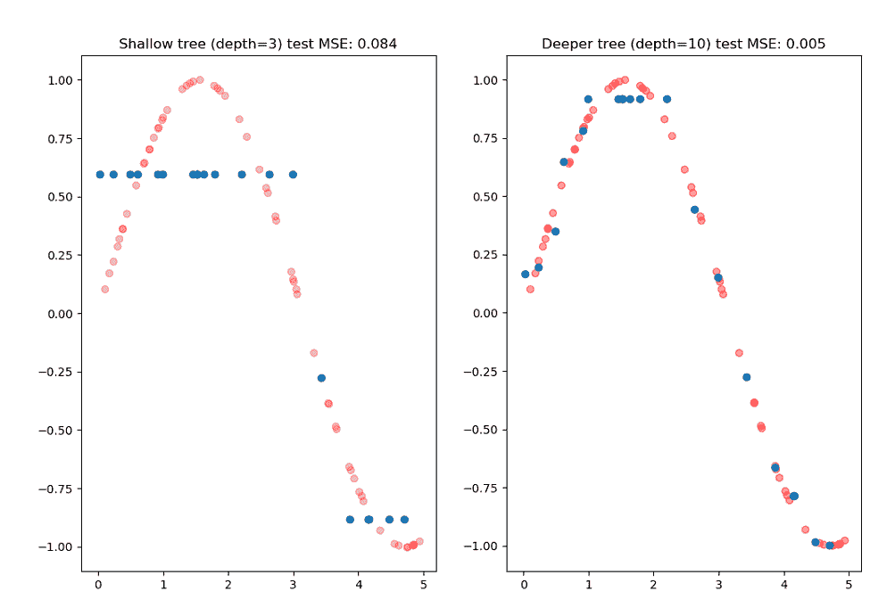

在下一节中，我们将研究聚类方法，并从决策树开始。


各种聚类方法

在这一节中，我们将介绍不同的聚类方法。首先，让我们看看什么是集群。然后我们将解释一些我们可以在聚类中使用的数学技巧。最后，我们将介绍我们最新的非参数算法 KNN。

什么是集群？

就机器学习模型而言，聚类是最直观的。这个想法是我们可以根据样本组之间的接近程度来分割它们。假设是越接近的样本在某些方面越相似。因此，有两个原因我们可能想要集群。第一种是为了发现的目的，当我们对数据的底层结构没有任何假设，或者没有标签时，我们通常会这样做。因此，这通常是在完全无人监管的情况下完成的。但由于这显然是一本监督学习的书，我们将把重点放在第二个用例上，它使用聚类作为分类技术。


# 距离度量

所以，在我们进入算法之前，我想解决一些数学上的深奥问题。当你在 2D 空间中有两个点，或者任意数量的点时，概念化是相当容易的。它基本上是计算直角三角形的斜边，也就是测量距离。然而，当你有一个真正的高维空间时会发生什么呢？这就是我们将要进入的，我们有很多集群问题。


# 因此，最常见的距离度量是欧几里德距离。这基本上是 2D 方法的概括。它是两个向量的平方差之和的平方根，可以用在任何维度的空间。还有很多其他的，我们就不一一赘述了。其中两个是**曼哈顿**和**马哈拉诺比斯**。曼哈顿很像欧几里德距离。然而，不是差的平方，而是差的绝对值。

KNN-简介


# KNN 是一种非常简单直观的构建聚类分类器的方法。其思想是，给定一组标记样本，当引入一个新样本时，我们查看 k 个最近的点，并基于其周围的大多数点来估计其类别成员。因此，在下图中，我们将这个新问号归类为正样本，因为它的大多数邻居都是正样本:

KNN–注意事项

这里有几个你应该考虑的因素。KNN 有点有趣，可以根据其超参数 *K* 在极高偏差或高方差之间波动。如果 *K* 太大，并且你正在比较一个新的样本和整个训练集，它倾向于多数类。本质上，无论哪个更多，我们都这样投票。这将是一个严重不足的模型。如果 *K* 过小，则给予紧邻的样本更高的优先级，这意味着模型极度过拟合。除了围绕 *K* 的考虑之外，您可能还想考虑数据的居中和缩放。否则，您的距离度量将不会对小比例要素非常敏感。例如，如果你的一个特征是一栋房子的几千美元，而另一个特征是浴室的数量， *1.5* 到 *3.5* 左右，你将隐含地偏爱美元而不是浴室的数量。所以，你可能想要居中和缩放。


# 一个经典的 KNN 算法

经典的 KNN 算法将计算训练样本之间的距离，并将它们存储在距离分区的堆结构中，例如 **KDTree** 或 ball tree，它们本质上是排序堆二叉树。然后我们查询测试样本树。我们在这堂课上的方法会有一点不同，为了更加直观和易读。

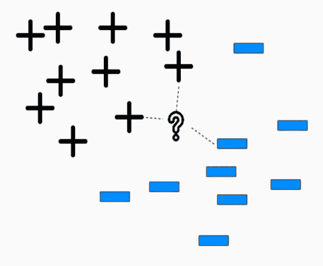

# 在下一节中，我们将介绍如何从头开始实现它。

There are a few considerations you should take into account here. KNN is a bit interesting and can fluctuate between wildly high bias or high variance depending on its hyperparameter *K*. If *K* is too large and you're comparing a new sample to the entire training set, it favors the majority class. Essentially, whichever is more, we vote that way. This would be a highly underfitted model. If *K* is too small, it gives higher priority to the immediately adjacent samples, which means that the model is extremely overfitted. In addition to considerations around *K*, you may also want to consider centering and scaling your data. Otherwise, your distance metric will not be very sensitive to small-scale features. For instance, if one of your features is thousands of dollars for a house and the other feature is the number of bathrooms, *1.5* to *3.5* or so, you're going to implicitly be favoring the dollars versus the number of bathrooms. So, you might want to center and scale.


# 从头开始实现 KNNs

在这一节中，我们将跳转到`packtml`代码库，看看我们如何从头开始实现它。我们将从回顾上一节中介绍的经典算法开始，然后我们将看看实际的 Python 代码，其中有一些实现上的变化。

回想一下原型 KNN 算法。高效的实现是预先计算距离，并将它们存储在一个特殊的堆中。当然，对于计算机科学中的大多数事情，有聪明的方法，也有易读的方法。为了最大化可读性，我们将做一些不同的事情，但基本算法是一样的。

KNN 聚类


# 我们有两份文件想看看。首先是`packtml` Python 包中的源代码。其次，我们将查看一个应用于`iris`数据集的 KNN 示例。让我们直接跳到 PyCharm，那里有两个打开的文件。在`clustering`子模块中，我们打开了`knn.py`文件。这就是我们将要找到 KNN 类和所有实现细节的地方。然后在示例目录的`clustering`子目录中，我们也打开了`example_knn_classifier.py`文件。在我们完成了实现细节之后，我们将详细讨论这个问题。

现在，关于其他库，我们将使用 scikit-learn 的 utils 来验证`X`、`y`和分类目标。然而，我们也将使用`metrics.pairwise`子模块来使用`euclidean_distances`:

如前所述，如果我们想使用不同的距离度量，我们也可以导入 Manhattan。但是对于这个，我们只用欧几里得。所以，如果你以后想调整，请自便。我们的 KNN 类将接受三个参数。对于`BaseSimpleEstimator`来说，像往常一样，我们将使用`X`和`y`，它们是我们的训练向量和训练标签，然后使用`k`，它是我们想要计算的每个样本周围的邻居数量的调整参数:


# 所以，我们的构造函数非常简单。我们要检查我们的`X`和`y`并基本存储它们。然后我们将`k`分配给一个`self`属性。现在，在其他实现中，我们可以继续计算我们的 KDTree 或 ball tree:

所以，我们要用蛮力方法，在预测之前，我们不会计算距离。这是对距离的懒惰评估。在我们的预测函数中，我们将使用我们的`X`，这是我们的测试数组。`X`，我们在构造函数中赋值。我们将计算训练数组和测试数组之间的`euclidean_distances`。这里，我们通过`M`矩阵得到一个`M`，其中`M`是测试数组中的样本数:

Now, regarding other libraries, we're going to use scikit-learn's utils to validate the `X`, `y`, and classification targets. However, we're also going to use the `metrics.pairwise` submodule to use `euclidean_distances`:

```py
from __future__ import absolute_import

from sklearn.metrics.pairwise import euclidean_distances
from sklearn.utils.validation import check_X_y
from sklearn.utils.multiclass import check_classification_targets
```

If we want to use a different distance metric, we could also import Manhattan, as mentioned in the earlier section. But for this, we're just going to use Euclidean. So, if you want to adjust that later, feel free. Our KNN class here is going to take three parameters. As usual for `BaseSimpleEstimator`, we're going to take our `X` and `y`, which are our training vectors and our training label, and then `k`, which is our tuning parameter for the number of neighbors that we want to compute around each sample:

```py
 Parameters
 ----------
 X : array-like, shape=(n_samples, n_features)
     The training array. Should be a numpy array or array-like structure
     with only finite values.

y : array-like, shape=(n_samples,)
    The target vector.
k : int, optional (default=10)
    The number of neighbors to identify. The higher the ``k`` parameter,
    the more likely you are to *under*-fit your data. The lower the ``k``
    parameter, the more likely you are to *over*-fit your model.
```

为了找到最近的距离，我们通过列`argsort`距离来显示哪些样本是最近的。接下来是距离数组，我们将沿着`axis`列对其进行`argsort`处理，这样我们就可以根据距离得到最接近的样本:

```py
    def __init__(self, X, y, k=10):
        # check the input array
        X, y = check_X_y(X, y, accept_sparse=False, dtype=np.float32,
                         copy=True)

        # make sure we're performing classification here
        check_classification_targets(y)

        # Save the K hyper-parameter so we can use it later
        self.k = k

        # kNN is a special case where we have to save the training data in
        # order to make predictions in the future
        self.X = X
        self.y = y
```

我们将基于`top_k`沿着`y`分割标签。这些基本上是类别标签:

```py
def predict(self, X):
    # Compute the pairwise distances between each observation in
    # the dataset and the training data. This can be relatively expensive
    # for very large datasets!!
    train = self.X
    dists = euclidean_distances(X, train)
```

既然是分类，我们就对`mode`感兴趣。沿着`axis`和`ravel`使用`mode`函数取模式，并将其放入 NumPy 数组:

因此，我们只是计算预测函数的距离，对最近的距离进行 arg 排序，然后找到相应的标签，并采用模式。现在，在`examples/clustering`目录中，转到`example_knn_classifier.py`。我们将使用 scikit-learn 中的`load_iris`函数:

我们将只使用前两个维度，这样我们可以用一种相对直观的方式将其形象化。执行训练分割，然后使用`StandardScaler`居中和缩放:

```py
# Arg sort to find the shortest distance for each row. This sorts
# elements in each row (independent of other rows) to determine the
# order required to sort the rows.
# that is:
# >>> P = np.array([[4, 5, 1], [3, 1, 6]])
# >>> np.argsort(P, axis=1)
# array([[2, 0, 1],
# [1, 0, 2]])
nearest = np.argsort(dists, axis=1)
```

将`KNNClassifier`与`k=10`装配在一起:

```py

 # We only care about the top K, really, so get sorted and then truncate
 # that is:
 # array([[1, 2, 1],
 # ...
 # [0, 0, 0]])
 predicted_labels = self.y[nearest][:, :self.k]
```

最后，我们将通过键入以下命令来绘制它。像往常一样，确保您已经激活了环境:

```py
 # We want the most common along the rows as the predictions
 # that is:
 # array([1, ..., 0])
 return mode(predicted_labels, axis=1)[0].ravel()
```


```py
from __future__ import absolute_import

from packtml.clustering import KNNClassifier
from packtml.utils.plotting import add_decision_boundary_to_axis
from sklearn.model_selection import train_test_split
from sklearn.preprocessing import StandardScaler
from sklearn.metrics import accuracy_score
from sklearn.datasets import load_iris
from matplotlib import pyplot as plt
from matplotlib.colors import ListedColormap
import sys
```

输出为`k = 10`，我们得到大约 73-74%的测试精度。请注意，我们只使用两个维度:

```py
# Create a classification sub-dataset using iris
iris = load_iris()
X = iris.data[:, :2] # just use the first two dimensions
y = iris.target

# split data
X_train, X_test, y_train, y_test = train_test_split(X, y, random_state=42)

# scale the data
scaler = StandardScaler()
X_train = scaler.fit_transform(X_train)
X_test = scaler.transform(X_test)

```


```py
# Fit a k-nearest neighbor model and get predictions
k=10
clf = KNNClassifier(X_train, y_train, k=k)
pred = clf.predict(X_test)
clf_accuracy = accuracy_score(y_test, pred)
print("Test accuracy: %.3f" % clf_accuracy)
```

所以，现在你是一个 KNN 专家，你可以从头开始建立一个。在下一节中，我们将比较非参数模型和参数模型。

非参数模型——优点/缺点

在本节中，我们将讨论每个统计学家最喜欢的哲学辩论，即非参数模型相对于参数模型的利弊。

非参数模型的优点

非参数模型能够学习预测器和输出变量之间的一些非常复杂的关系，这使得它们对于非平凡的建模问题非常强大。就像我们在决策树中建模的回归正弦波一样，许多非参数模型对数据规模也相当宽容。这里的主要例外是聚类技术，但是这些技术可以为决策树之类的模型带来很大的优势，因为它们不需要像参数模型那样的预处理。最后，如果您发现自己受到高方差的困扰，您总是可以添加更多的训练数据，有了这些数据，您的模型可能会变得更好。


# 非参数模型的缺点

非参数模型也有不太好的地方。其中几个我们已经讨论过了。因此，正如你可能知道的，它们可能拟合或预测较慢，并且在许多情况下不如许多参数模型直观。如果速度不如精度重要，非参数模型可能是您的模型的一个很好的候选。同样，有了可解释性，这些模型可能会过于复杂，难以理解。最后，非参数模型的优势之一是能够利用更多的数据变得更好，如果数据很难获得，这可能是一个弱点。他们通常比他们的参数兄弟需要更多的数据来有效地训练。


# Pros of non-parametric models

Non-parametric models are able to learn some really complex relationships between your predictors and the output variable, which can make them really powerful for non-trivial modeling problems. Just like the regression sinusoidal wave we modeled in the decision trees, a lot of non-parametric models are fairly tolerant to data scale as well. The major exception here is the clustering techniques, but these techniques can pose a major advantage for models such as decision trees, which don't require the same level of pre-processing that parametric models might. Finally, if you find yourself suffering from high variance, you can always add more training data, with which your model is likely to get better.


# 用哪个型号？

我们已经讨论过的参数模型有一些非常好和方便的属性。选择参数模型而非非参数模型有几个原因。特别是如果你在一个受监管的行业，我们需要更容易地解释模型。另一方面，非参数模型可以创建更好、更复杂的模型。但是如果你没有一个好的数据块，它可能不会执行得很好。最好不要对该用还是不该用过于哲学化。只需使用最适合您的数据并满足您的业务需求的产品。

摘要

在本章中，我们首先介绍了非参数模型，然后我们浏览了决策树。在接下来的部分中，我们学习了拆分标准以及它们如何产生拆分。我们还了解了偏差-方差权衡，以及非参数模型如何倾向于更高的误差方差集，而参数模型则倾向于高偏差。接下来，我们研究了聚类方法，甚至从头开始编写了一个 KNN 类。最后，我们总结了非参数方法的优缺点。


# 在下一章中，我们将进入监督机器学习的一些更高级的主题，包括推荐系统和神经网络。

Parametric models that we've already covered have some really great and convenient attributes. There are several reasons you may opt for a parametric model over a non-parametric model. Particularly if you're in a regulated industry, we need to explain the models more easily. Non-parametric models, on the other hand, may create a better, more complex model. But if you don't have a good chunk of data, it may not perform very well. It is best not to get overly philosophical about which one you should or should not use. Just use whichever best fits your data and meets your business requirements.


# Summary

In this chapter, we initially got introduced to non-parametric models and then we walked through the decision trees. In the next sections, we learned the splitting criteria and how they produce splits. We also learned about the bias-variance trade-off, and how non-parametric models tend to favor a higher variance set of error, while parametric models favor high bias. Next, we looked into clustering methods and even coded a KNN class from scratch. Finally, we wrapped up with the pros and cons of non-parametric methods.

In the next chapter, we will get into some more of the advanced topics in supervised machine learning, including recommender systems and neural networks.